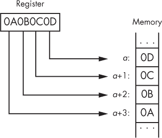
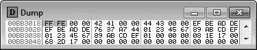
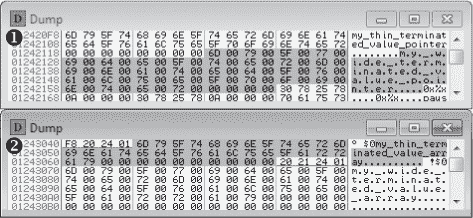
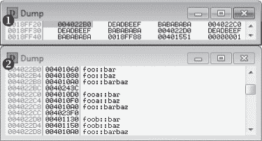
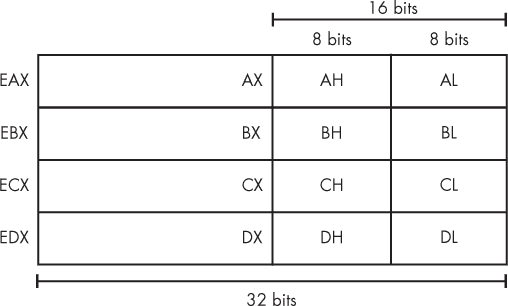
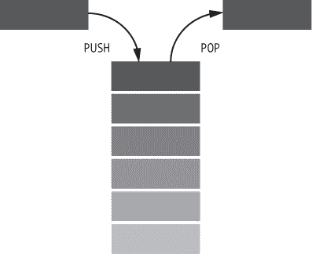
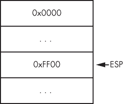
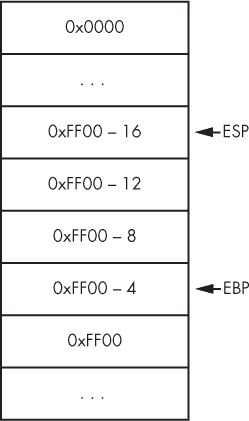

## **4**

**从代码到内存：一个通用入门**


在最低级别，游戏的代码、数据、输入和输出是不断变化的字节的复杂抽象。许多字节代表由编译器生成的变量或机器代码，该编译器是根据游戏的源代码生成的。有些代表图像、模型和声音。其他的则只存在一瞬间，由计算机硬件作为输入发布，并在游戏完成处理后销毁。剩余的字节则通知玩家游戏的内部状态。但人类无法用字节思考，因此计算机必须以我们能理解的方式将其翻译出来。

反过来，也存在一个巨大的断层。计算机实际上并不理解高级代码和直观的游戏内容，因此这些必须从抽象转换为字节。有些内容——如图像、声音和文本——是无损存储的，准备好在微秒级别向玩家呈现。另一方面，游戏的代码、逻辑和变量则被剥去所有人类可读性，并被编译成机器数据。

通过操控游戏数据，游戏黑客能够在游戏中获得人类难以实现的优势。然而，要做到这一点，他们必须理解开发者的代码在被编译和执行后如何表现。实质上，他们必须像计算机一样思考。

为了让你像计算机一样思考，本章将从教你数字、文本、简单结构和联合体在字节级别上的内存表示开始。然后，你将深入探索类实例是如何在内存中存储的，以及抽象实例如何在运行时知道该调用哪些虚拟函数。在本章的后半部分，你将参加一门 x86 汇编语言速成课程，内容包括语法、寄存器、操作数、调用栈、算术运算、分支操作、函数调用和调用约定。

本章非常注重一般技术细节。虽然没有很多直接与游戏黑客相关的“精彩”信息，但你在这里获得的知识将在接下来的章节中发挥核心作用，当我们讨论如何通过程序读取和写入内存、注入代码以及操控控制流等主题时。

由于 C++是游戏和机器人开发的事实标准，本章将解释 C++代码与代表它的内存之间的关系。大多数本地语言都有非常相似（有时是相同的）低级结构和行为，因此你应该能够将所学的知识应用到几乎任何软件中。

本章中的所有示例代码都在本书源文件的 *GameHackingExamples/Chapter4_CodeToMemory* 目录中。包含的项目可以用 Visual Studio 2010 编译，但也应该适用于任何其他 C++ 编译器。如果你想跟着做，可以从 *[`www.nostarch.com/gamehacking/`](https://www.nostarch.com/gamehacking/)* 下载并编译它们。

### **变量和其他数据在内存中的表现**

正确操作游戏的状态可能非常困难，找到控制它的数据并不像点击“下一次扫描”并希望 Cheat Engine 不会失败那样简单。实际上，许多黑客必须同时操作几十个相关的值。找到这些值及其关系通常需要你分析地识别结构和模式。此外，开发游戏黑客通常意味着在你的机器人的代码中重新创建原始结构。

为了完成这些任务，你需要深入了解变量和数据在游戏内存中的布局。通过示例代码、OllyDbg 内存转储和一些表格来将一切联系在一起，本节将教你如何了解不同类型的数据如何在内存中表现。

#### ***数值数据***

大多数游戏黑客需要的值（比如玩家的血量、魔法值、位置和等级）都由数值数据类型表示。由于数值数据类型也是所有其他数据类型的构建块，理解它们是极其重要的。幸运的是，它们在内存中有相对直接的表示方式：它们是按预测方式对齐的，并且有固定的位宽。表 4-1 展示了你在 Windows 游戏中会遇到的五种主要数值数据类型，以及它们的大小和范围。

**表 4-1：** 数值数据类型

| **类型名称** | **大小** | **有符号范围** | **无符号范围** |
| --- | --- | --- | --- |
| `char`, `BYTE` | 8 位 | -128 到 127 | 0 到 255 |
| `short`, `WORD`, `wchar_t` | 16 位 | -32,768 到 -32,767 | 0 到 65535 |
| `int`, `long`, `DWORD` | 32 位 | -2,147,483,648 到 2,147,483,647 | 0 到 4,294,967,295 |
| `long long` | 64 位 | -9,223,372,036,854,775,808 到 9,223,372,036,854,775,807 | 0 到 18,446,744,073,709,551,615 |
| `float` | 32 位 | +/-1.17549*10^(-38) 到 +/-3.40282*10³⁸ | 不适用 |

数值数据类型的大小在不同的架构甚至编译器之间可能会有所不同。由于本书聚焦于在 Windows 上破解 x86 游戏，因此我使用了 Microsoft 标准的类型名称和大小。除了 `float` 外，表 4-1 中的数据类型采用 *小端序* 存储，这意味着整数的最低有效字节存储在该整数占用的最低地址中。例如，图 4-1 显示 `DWORD` 0x0A0B0C0D 被字节 0x0D 0x0C 0x0B 0x0A 表示。



*图 4-1：小端序排列示意图*

`float`数据类型可以存储混合数字，因此它在内存中的表示不像其他数据类型那么简单。例如，如果你在内存中看到 0x0D 0x0C 0x0B 0x0A，并且这个值是`float`类型的，你不能简单地将其转换为 0x0A0B0C0D。相反，`float`值有三个组成部分：*符号*（位 0）、*指数*（位 1–8）和*尾数*（位 9–31）。

符号位决定数字是正数还是负数，指数决定小数点移动多少位（从尾数之前开始），尾数则存储该值的近似值。你可以通过计算表达式*尾数* × 10^(*n*)（其中*n*是指数）来恢复存储的值，如果符号位被设置，则结果乘以-1。

现在让我们来看一下内存中的一些数字数据类型。清单 4-1 初始化了九个变量。

```
unsigned char ubyteValue = 0xFF;
char byteValue = 0xFE;
unsigned short uwordValue = 0x4142;
short wordValue = 0x4344;
unsigned int udwordValue = 0xDEADBEEF;
int dwordValue = 0xDEADBEEF;
unsigned long long ulongLongValue = 0xEFCDAB8967452301;
long long longLongValue = 0xEFCDAB8967452301;
float floatValue = 1337.7331;
```

*清单 4-1：在 C++中创建数字数据类型的变量*

从顶部开始，这个示例包括了`char`、`short`、`int`、`long long`和`float`类型的变量。其中四个是无符号的，五个是有符号的。（在 C++中，`float`不能是无符号的。）考虑到你到目前为止学到的内容，请仔细研究清单 4-1 中的代码和图 4-2 中的内存转储之间的关系。假设这些变量在全局作用域中声明。



*图 4-2：OllyDbg 的数字数据内存转储*

你可能会注意到一些值看起来被随机分隔开。由于处理器访问存储在地址大小倍数位置的值更快（在 x86 中是 32 位），因此编译器会用零来填充这些值，以便将它们对齐到这样的地址上——因此，填充也被称为*对齐*。单字节值不会进行填充，因为访问它们的操作无论对齐如何都执行相同。

请记住这一点，来看一下表 4-2，它提供了图 4-2 中的内存转储和清单 4-1 中声明的变量之间的内存与代码的映射。

**表 4-2:** 清单 4-1 和图 4-2 的内存与代码的映射

| **地址** | **大小** | **数据** | **对象** |
| --- | --- | --- | --- |
| 0x00BB3018 | 1 字节 | 0xFF | `ubyteValue` |
| 0x00BB3019 | 1 字节 | 0xFE | `byteValue` |
| 0x00BB301A | 2 字节 | 0x00 0x00 | `uwordValue`之前的填充 |
| 0x00BB301C | 2 字节 | 0x42 0x41 | `uwordValue` |
| 0x00BB301E | 2 字节 | 0x00 0x00 | `wordValue`之前的填充 |
| 0x00BB3020 | 2 字节 | 0x44 0x43 | `wordValue` |
| 0x00BB3022 | 2 字节 | 0x00 0x00 | `udwordValue`之前的填充 |
| 0x00BB3024 | 4 字节 | 0xEF 0xBE 0xAD 0xDE | `udwordValue` |
| 0x00BB3028 | 4 字节 | 0xEF 0xBE 0xAD 0xDE | `dwordValue` |
| 0x00BB302C | 4 字节 | 0x76 0x37 0xA7 0x44 | `floatValue` |
| 0x00BB3030 | 8 字节 | 0x01 0x23 0x45 0x67 0x89 0xAB 0xCD 0xEF | `ulongLongValue` |
| 0x00BB3038 | 8 字节 | 0x01 0x23 0x45 0x67 0x89 0xAB 0xCD 0xEF | `LongLongValue` |

地址列列出了内存中的位置，数据列告诉你存储在这些位置的内容。对象列告诉你每条数据与清单 4-1 中哪个变量相关。注意，尽管 `floatValue` 在清单 4-1 中是最后声明的变量，但它被放置在 `ulongLongValue` 之前。这是因为这些变量是在全局范围内声明的，编译器可以将它们放置在任何位置。这个特定的排列很可能是由于对齐或优化的结果。

#### ***字符串数据***

大多数开发者将*字符串*一词与*文本*等同起来，但文本只是字符串最常见的应用。低层次上，字符串只是一些看起来线性且未对齐的内存中任意数值对象的数组。清单 4-2 展示了四个文本字符串声明。

```
// char will be 1 byte per character
char* thinStringP = "my_thin_terminated_value_pointer";
char thinStringA[40] = "my_thin_terminated_value_array";

// wchar_t will be 2 bytes per character
wchar_t* wideStringP = L"my_wide_terminated_value_pointer";
wchar_t wideStringA[40] = L"my_wide_terminated_value_array";
```

*清单 4-2：在 C++ 中声明多个字符串*

在文本的上下文中，字符串包含字符对象（`char` 用于 8 位编码，`wchar_t` 用于 16 位编码），每个字符串的结束由*空终止符*指定，该字符等于 0x0。让我们看看这些变量存储的内存，如图 4-3 中的两个内存转储所示。



*图 4-3：在这个 OllyDbg 字符串数据内存转储中，ASCII 列中的人类可读文本是我们在清单 4-2 中存储的文本。*

如果你不习惯阅读内存，OllyDbg 转储可能在这个时候会有点难以跟随。表 4-3 展示了清单 4-2 中的代码与图 4-3 中的内存之间的更深层次的关联。

**表 4-3：** 清单 4-2 和 图 4-3 中的内存与代码映射

| **地址** | **大小** | **数据** | **对象** |
| --- | --- | --- | --- |
| 面板 1 |
| 0x012420F8 | 32 字节 | 0x6D 0x79 0x5F {...} 0x74 0x65 0x72 | `thinStringP`字符 |
| 0x01242118 | 4 字节 | 0x00 0x00 0x00 0x00 | `thinStringP` 终结符和填充 |
| 0x0124211C | 4 字节 | 0x00 0x00 0x00 0x00 | 无关数据 |
| 0x01242120 | 64 字节 | 0x6D 0x00 0x79 {...} 0x00 0x72 0x00 | `wideStringP`字符 |
| 0x01242160 | 4 字节 | 0x00 0x00 0x00 0x00 | `wideStringP` 终结符和填充 |
| {...} |  |  | 无关数据 |
| 面板 2 |
| 0x01243040 | 4 字节 | 0xF8 0x20 0x24 0x01 | 指向 `thinStringP` 的指针，位于 `0x012420F8` |
| 0x01243044 | 30 字节 | 0x6D 0x79 0x5F {...} 0x72 0x61 0x79 | `thinStringA`字符 |
| 0x01243062 | 10 字节 | 0x00 重复 10 次 | `thinStringA` 终结符和数组填充 |
| 0x0124306C | 4 字节 | 0x20 0x21 0x24 0x01 | 指向 `wideStringP` 的指针，位于 `0x01242120` |
| 0x01243070 | 60 字节 | 0x6D 0x00 0x79 {...} 0x00 0x79 0x00 | `wideStringA`字符 |
| 0x012430AC | 20 字节 | 重复 10 次的 0x00 | `wideStringA` 终止符和数组填充 |

在图 4-3 中，面板 1 显示了存储在`thinStringP`（地址 0x01243040）和`wideStringP`（地址 0x0124306C）所在内存位置的数据仅为 4 字节长，并且不包含任何字符串数据。这是因为这些变量实际上是指向各自数组第一个字符的指针。例如，`thinStringP`包含 0x012420F8，在图 4-3 中的面板 2 里，你可以看到位于地址 0x012420F8 的字符串 `"my_thin_terminated_value_pointer"`。

查看面板 1 中这些指针之间的数据，你可以看到由`thinStringA`和`wideStringA`存储的文本。此外，注意到`thinStringA`和`wideStringA`在它们的空字符终止符之后被填充了空间；这是因为这些变量被声明为长度为`40`的数组，因此它们被填充到 40 个字符。

#### ***数据结构***

与我们之前讨论的数据类型不同，*结构体*是包含多个简单相关数据的容器。懂得如何识别内存中结构体的游戏黑客可以在他们自己的代码中模拟这些结构体。这可以大大减少他们必须查找的地址数量，因为他们只需要找到结构体起始地址，而不是每个单独项的地址。

**注意**

*本节讨论了作为简单容器的结构体，它们没有成员函数，仅包含简单数据。超出这些限制的对象将在“类和虚函数表”中讨论，详见第 74 页。*

##### **结构体元素的顺序和对齐**

由于结构体仅仅是多个对象的集合，它们在内存转储中不会直接显示。相反，结构体的内存转储会显示其中包含的对象。这个转储看起来与我在本章中展示的其他转储非常相似，但在顺序和对齐上有重要的区别。

为了查看这些差异，首先请查看示例 4-3。

```
struct MyStruct {
    unsigned char ubyteValue;
    char byteValue;
    unsigned short uwordValue;
    short wordValue;
    unsigned int udwordValue;
    int dwordValue;
    unsigned long long ulongLongValue;
    long long longLongValue;
    float floatValue;
};
MyStruct& m = 0;
printf("Offsets: %d,%d,%d,%d,%d,%d,%d,%d,%d\n",
        &m->ubyteValue, &m->byteValue,
        &m->uwordValue, &m->wordValue,
        &m->udwordValue, &m->dwordValue,
        &m->ulongLongValue, &m->longLongValue,
        &m->floatValue);
```

*示例 4-3：一个 C++ 结构体及其使用的代码*

这段代码声明了一个名为`MyStruct`的结构体，并创建了一个名为`m`的变量，假设它指向地址 0 上的该结构体实例。实际上地址 0 上并没有结构体实例，但这个技巧让我可以在`printf()`调用中使用取地址符号（`&`）来获取结构体每个成员的地址。由于结构体位于地址 0，因此打印的每个成员的地址相当于它相对于结构体起始位置的偏移量。

这个示例的最终目的是精确查看每个成员在内存中的布局，相对于结构体的起始位置。如果你运行这段代码，你会看到以下输出：

```
Offsets: 0,1,2,4,8,12,16,24,32
```

如你所见，`MyStruct` 中的变量是按照代码中定义的顺序排列的。这种顺序排列是结构体的强制属性。与示例 4-1 中的例子对比，我们声明了一组相同的变量；在图 4-2 中的内存转储里，编译器明显将一些值放置到了内存中的不正确顺序。

此外，你可能已经注意到，成员的对齐方式与示例 4-1 中的全局作用域变量不同；例如，如果它们对齐的话，在 `uwordValue` 前面应该有 2 个填充字节。这是因为结构体成员会按照能被*结构体成员对齐*（这是一个编译器选项，接受 1、2、4、8 或 16 字节；在此示例中设置为 4）或成员的大小——取较小者——的地址进行对齐。我安排了 `MyStruct` 的成员，使得编译器无需填充这些值。

然而，如果我们在 `ulongLongValue` 后立即放一个 `char`，`printf()` 调用将会输出以下结果：

```
Offsets: 0,1,2,4,8,12,16,28,36
```

现在，一起看看原始输出和修改后的输出：

```
Original: Offsets: 0,1,2,4,8,12,16,24,32
Modified: Offsets: 0,1,2,4,8,12,16,28,36
```

在修改后的版本中，最后两个值，即 `longLongValue` 和 `floatValue` 从结构体起始位置的偏移量发生了变化。由于结构体成员对齐，变量 `longLongValue` 移动了 4 字节（1 字节用于 `char` 值，后面跟着 3 字节）以确保它被放置在一个能被 4 整除的地址上。

##### **结构如何工作**

理解结构体——它们是如何对齐的以及如何模拟它们——非常有用。例如，如果你在自己的代码中复制了一个游戏的结构体，你可以在一次操作中从内存中读取或写入整个结构体。考虑一个游戏，声明玩家当前的生命值和最大生命值，如下所示：

```
struct {
    int current;
    int max;
} vital;
vital health;
```

如果一个经验不足的游戏黑客想要从内存中读取这些信息，他们可能会写如下代码来获取生命值：

```
int currentHealth = readIntegerFromMemory(currentHealthAddress);
int maxHealth =  readIntegerFromMemory(maxHealthAddress);
```

这个游戏黑客没有意识到，看到这些值在内存中紧挨着彼此可能不仅仅是一个幸运的偶然现象，所以他们使用了两个独立的变量。但如果你带着对结构体的理解来分析，你可能会得出结论：既然这些值密切相关并且在内存中相邻，那么我们的黑客本可以使用一个结构体来代替：

```
   struct {
       int current;
       int max;
   } _vital;
➊ _vital health = readTypeFromMemory<_vital>(healthStructureAddress);
```

由于这段代码假设正在使用结构体并正确模拟了它，它只需一行代码就能获取健康值和最大健康值 ➊。我们将在第六章中深入探讨如何编写自己的代码来读取内存。

#### ***联合体***

与封装多个相关数据的结构体不同，*联合体*包含通过多个变量暴露的单一数据。联合体遵循三条规则：

• 联合体在内存中的大小等于其最大成员的大小。

• 联合体的成员都引用相同的内存。

• 联合体继承其最大成员的对齐方式。

以下代码中的`printf()`调用有助于说明前两个规则：

```
union {
    BYTE byteValue;
    struct {
        WORD first;
        WORD second;
    } words;
    DWORD value;
} dwValue;
dwValue.value = 0xDEADBEEF;
printf("Size %d\nAddresses 0x%x,0x%x\nValues 0x%x,0x%x\n",
    sizeof(dwValue), &dwValue.value, &dwValue.words,
    dwValue.words.first, dwValue.words.second);
```

这个`printf()`调用输出以下内容：

```
Size 4
Addresses 0x2efda8,0x2efda8 
Values 0xbeef,0xdead
```

第一个规则通过`Size`值来说明，该值首先被打印。尽管`dwValue`有三个成员，占用了 9 个字节，但它的大小仅为 4 个字节。这个大小结果也验证了第二个规则，因为`dwValue.value`和`dwValue.words`都指向地址`0x2efda8`，这在`Addresses`后面打印的值中得到了显示。第二个规则也得到了验证，因为`dwValue.words.first`和`dwValue.words.second`分别包含`0xbeef`和`0xdead`，这些值在`Values`后面打印出来，考虑到`dwValue.value`为`0xdeadbeef`，这就有意义了。第三个规则在这个示例中没有展示，因为我们没有足够的内存上下文，但如果你将这个联合体放入一个结构体中，并围绕它放置任何你喜欢的类型，它实际上总是会像`DWORD`那样对齐。

#### ***类与 VF 表***

类似于结构体，*类*是用于容纳和隔离多个数据项的容器，但类还可以包含函数定义。

##### **一个简单的类**

带有普通函数的类，如清单 4-4 中的`bar`，遵循与结构体相同的内存布局。

```
class bar {
public:
    bar() : bar1(0x898989), bar2(0x10203040) {}
    void myfunction() { bar1++; }
    int bar1, bar2;
};

bar _bar = bar();
printf("Size %d; Address 0x%x : _bar\n", sizeof(_bar), &_bar);
```

*清单 4-4：一个 C++类*

清单 4-4 中的`printf()`调用将输出以下内容：

```
Size 8; Address 0x2efd80 : _bar
```

即使`bar`有两个成员函数，输出仍然显示它仅占用 8 个字节来保存`bar1`和`bar2`。这是因为`bar`类不包含这些成员函数的抽象，程序可以直接调用它们。

**注意**

*如`public`、`private`和`protected`等访问级别在内存中不会显现。无论这些修饰符如何，类的成员仍然按其定义顺序排列。*

##### **一个带有虚拟函数的类**

在包含抽象函数（通常称为*虚拟*函数）的类中，程序必须知道调用哪个函数。请参考清单 4-5 中的类定义：

```
class foo {
public:
foo() : myValue1(0xDEADBEEF), myValue2(0xBABABABA) {}
    int myValue1;
    static int myStaticValue;
    virtual void bar() { printf("call foo::bar()\n"); }
    virtual void baz() { printf("call foo::baz()\n"); }
    virtual void barbaz() {}
    int myValue2;
};

int foo::myStaticValue = 0x12121212;

class fooa : public foo {
public:
    fooa() : foo() {}
    virtual void bar() { printf("call fooa::bar()\n"); }
    virtual void baz() { printf("call fooa::baz()\n"); }
};

class foob : public foo {
public:
    foob() : foo() {}
    virtual void bar() { printf("call foob::bar()\n"); }
    virtual void baz() { printf("call foob::baz()\n"); }
};
```

*清单 4-5：foo、fooa 和 foob 类*

`foo`类有三个虚拟函数：`bar`、`baz`和`barbaz`。`fooa`和`foob`类继承自`foo`类并重载了`bar`和`baz`。由于`fooa`和`foob`有一个公开的基类`foo`，因此一个`foo`指针可以指向它们，但程序仍然必须调用正确版本的`bar`和`baz`。你可以通过执行以下代码来查看这一点：

```
foo* _testfoo = (foo*)new fooa();
_testfoo->bar(); // calls fooa::bar()
```

下面是输出：

```
call fooa::bar()
```

输出结果显示，尽管`_testfoo`是一个`foo`指针，`_testfoo->bar()`调用了`fooa::bar()`。程序知道调用哪个版本的函数，因为编译器在`_testfoo`的内存中包含了一个*VF（虚拟函数）表*。VF 表是函数地址的数组，抽象类实例使用它来告诉程序它们的重载函数的位置。

##### **类实例与虚拟函数表**

为了理解类实例与 VF 表之间的关系，我们来检查一下在此清单中声明的三个对象的内存转储：

```
foo _foo = foo();
fooa _fooa = fooa();
foob _foob = foob();
```

这些对象是清单 4-5 中定义的类型。您可以在图 4-4 中看到它们的内存布局。



*图 4-4：OllyDbg 的类数据内存转储*

面板 1 显示每个类实例像结构体一样存储其成员，但它们之前会有一个 `DWORD` 值，指向该类实例的 VF 表。面板 2 显示了我们三个类实例的 VF 表。表 4-4 中的内存到代码交叉映射展示了这些面板和代码是如何关联的。

**表 4-4：** 清单 4-5 和 图 4-4 的内存到代码交叉映射

| **地址** | **大小** | **数据** | **对象** |
| --- | --- | --- | --- |
| 面板 1 |
| 0x0018FF20 | 4 字节 | 0x004022B0 | `_foo` 的开始及指向 `foo` VF 表的指针 |
| 0x0018FF24 | 8 字节 | 0xDEADBEEF 0xBABABABA | `_foo.myValue1` 和 `_foo.myValue2` |
| 0x0018FF2C | 4 字节 | 0x004022C0 | `_fooa` 的开始及指向 `fooa` VF 表的指针 |
| 0x0018FF30 | 8 字节 | 0xDEADBEEF 0xBABABABA | `_fooa.myValue1` 和 `_fooa.myValue2` |
| 0x0018FF38 | 4 字节 | 0x004022D0 | `_foob` 的开始及指向 `foob` VF 表的指针 |
| 0x0018FF3C | 8 字节 | 0xDEADBEEF 0xBABABABA | `_foob.myValue1` 和 `_foob.myValue2` |
| {...} |  |  | 无关数据 |
| 面板 2 |
| 0x004022B0 | 4 字节 | 0x00401060 | `foo` VF 表的开始；`foo::bar` 的地址 |
| 0x004022B4 | 4 字节 | 0x00401080 | `foo::baz` 的地址 |
| 0x004022B8 | 4 字节 | 0x004010A0 | `foo::barbaz` 的地址 |
| 0x004022BC | 4 字节 | 0x0040243C | 无关数据 |
| 0x004022C0 | 4 字节 | 0x004010D0 | `fooa` VF 表的开始；`fooa::bar` 的地址 |
| 0x004022C4 | 4 字节 | 0x004010F0 | `fooa::baz` 的地址 |
| 0x004022C8 | 4 字节 | 0x004010A0 | `foo::barbaz` 的地址 |
| 0x004022CC | 4 字节 | 0x004023F0 | 无关数据 |
| 0x004022D0 | 4 字节 | 0x00401130 | `foob` VF 表的开始；`foob::bar` 的地址 |
| 0x004022D4 | 4 字节 | 0x00401150 | `foob::baz` 的地址 |
| 0x004022D8 | 4 字节 | 0x004010A0 | `foo::barbaz` 的地址 |

这个交叉表显示了清单 4-5 中的代码如何在内存中布局 VF 表。每个 VF 表都是在生成二进制文件时由编译器生成的，这些表是常量。为了节省空间，相同类的实例都会指向相同的 VF 表，这也是 VF 表没有与类内联的原因。

由于我们有三个 VF 表，您可能会想知道类实例如何知道使用哪个 VF 表。编译器会在每个虚拟类构造函数中插入类似以下的汇编代码：

```
MOV DWORD PTR DS:[EAX], VFADDR
```

这个示例获取了 VF 表的静态地址（`VFADDR`），并将其作为类的第一个成员放置在内存中。

现在查看表 4-4 中的地址 0x004022B0、0x004022C0 和 0x004022D0。这些地址包含了`foo`、`fooa`和`foob` VF 表的起始位置。请注意，`foo::barbaz`存在于这三个 VF 表中；这是因为该函数没有被任何子类重载，这意味着每个子类的实例都将直接调用原始实现。

请注意，`foo::myStaticValue`在这个交叉表中并没有出现。由于该值是静态的，它实际上不需要作为`foo`类的一部分存在；它只是在这个类内部放置，以便更好地组织代码。实际上，它像一个全局变量一样被处理，并且被放置在其他地方。

**VF 表和作弊引擎**

还记得作弊引擎的“指针结构的第一个元素必须指向模块选项，以便从图 1-4 上的第 14 页进行指针扫描”吗？现在你已经读了一些关于 VF 表的内容，这些知识应该能帮助你理解这个选项是如何工作的：它使作弊引擎忽略所有堆块，其中第一个成员不是指向有效 VF 表的指针。它加快了扫描速度，但仅在指针路径中的每一步都是抽象类实例的情况下有效。

内存之旅到此为止，但如果将来你在识别一段数据时遇到困难，欢迎回来参考这一节。接下来，我们将探讨计算机是如何理解游戏的高级源代码的。

### **x86 汇编速成课程**

当一个程序的源代码被编译成二进制时，它会被剥离掉所有不必要的艺术品，并转化为*机器码*。这个机器码只由字节组成（命令字节叫做*操作码*，但也有表示操作数的字节），它直接传递给处理器，告诉它如何精确地执行操作。那些 1 和 0 翻转晶体管以控制计算，它们可能非常难以理解。为了让与计算机的交流稍微变得容易一些，处理这类代码的工程师使用*汇编语言*，它是一种简化的语言，通过缩写名称（称为助记符）和简单的语法，来表示原始机器操作码。

汇编语言对于游戏黑客来说非常重要，因为许多强大的黑客技术只能通过直接操控游戏的汇编代码实现，例如使用 NOP 或钩子等方法。在本节中，你将学习* x86 汇编语言*的基础知识，这是一种特定的汇编语言，专为与 32 位处理器交互而设计。汇编语言非常广泛，因此为了简洁，本节仅讲解对游戏黑客最有用的那一小部分汇编概念。^(1)

**注意**

*在本节中，许多小段汇编代码包含了由分号（`;`）分隔的注释，用来更详细地描述每个指令。*

#### ***命令语法***

汇编语言用于描述机器码，因此其语法相当简单。虽然这种语法使得理解单个命令（也叫*操作*）变得非常容易，但它也使得理解复杂的代码块变得非常困难。即使是用高级语言编写的易读算法，在汇编中看起来也显得晦涩难懂。例如，以下伪代码片段：

```
if (EBX > EAX)
    ECX = EDX
else
    ECX = 0
```

它在 x86 汇编中看起来像列表 4-6。

```
    CMP EBX, EAX
    JG label1
    MOV ECX, 0
    JMP label2
label1:
    MOV ECX, EDX
label2:
```

*列表 4-6：一些 x86 汇编命令*

因此，理解汇编中的即使是最简单的功能也需要大量的练习。然而，理解单个命令是非常简单的，到本节结束时，你将知道如何解析我刚刚给出的命令。

##### **指令**

汇编命令的第一部分被称为*指令*。如果你把汇编命令类比为终端命令，那么指令就是要运行的程序。在机器码层面，指令通常是命令的第一个字节；^(2) 也有一些 2 字节的指令，其第一个字节是 0x0F。不管怎样，指令告诉处理器要做什么。在列表 4-6 中，`CMP`、`JG`、`MOV`和`JMP`都是指令。

##### **操作数语法**

虽然一些指令是完整的命令，但绝大多数指令如果没有跟随*操作数*或参数，都是不完整的。列表 4-6 中的每个命令至少有一个操作数，如`EBX`、`EAX`和`label1`。

汇编操作数有三种形式：

**立即数** 是一种内联声明的整数值（十六进制值后跟一个`h`）。

**寄存器** 是指处理器寄存器的名称。

**内存偏移量** 是一个表达式，放在方括号内，表示某个值的内存位置。该表达式可以是立即数或寄存器。或者，它可以是寄存器和立即数的和或差（类似于`[REG+Ah]`或`[REG-10h]`）。

每条 x86 汇编指令可以有零到三个操作数，多个操作数用逗号分隔。在大多数情况下，需要两个操作数的指令有一个*源操作数*和一个*目标操作数*。这些操作数的顺序取决于汇编语法。例如，列表 4-7 展示了一组用 Intel 语法编写的伪命令，这种语法被 Windows（因此也被 Windows 游戏黑客）使用：

```
   MOV R1, 1          ; set R1 (register) to 1 (immediate)
➊ MOV R1, [BADF00Dh] ; set R1 to value at [BADFOODh] (memory offset)
   MOV R1, [R2+10h]   ; set R1 to value at [R2+10h] (memory offset)
   MOV R1, [R2-20h]   ; set R1 to value at [R2+20h] (memory offset)
```

*列表 4-7：演示 Intel 语法*

在 Intel 语法中，目标操作数首先出现，源操作数紧随其后，因此在➊处，`R1`是目标操作数，`[BADFOODh]`是源操作数。另一方面，像 GCC 这样的编译器（可以用于在 Windows 上编写机器人）使用一种被称为 AT&T 或 UNIX 语法的语法。这种语法的处理方式略有不同，如下例所示：

```
MOV $1, %R1         ; set R1 (register) to 1 (immediate)
MOV 0xBADF00D, %R1  ; set R1 to value at 0xBADFOOD (memory offset)
MOV 0x10(%R2), %R1  ; set R1 to value at 0x10(%R2) (memory offset)
MOV -0x20(%R2), %R1 ; set R1 to value at -0x20(%R2) (memory offset)
```

这段代码是清单 4-7 的 AT&T 版本。AT&T 语法不仅反转了操作数顺序，还要求操作数前缀，并且对于内存偏移量操作数有不同的格式。

##### **汇编命令**

一旦你理解了汇编指令及其操作数的格式，你就可以开始编写命令。以下代码展示了一个汇编函数，由一些非常基础的命令组成，实际上什么也不做。

```
 PUSH EBP     ; put EBP (register) on the stack
MOV EBP, ESP ; set EBP to value of ESP (register, top of stack)
PUSH -1      ; put -1 (immediate) on the stack
ADD ESP, 4   ; negate the 'PUSH -1' to put ESP back where it was (a PUSH
                 ; subtracts 4 from ESP, since it grows the stack)
MOV ESP, EBP ; set ESP to the value of EBP (they will be the same anyway,
                 ; since we have kept ESP in the same place)
POP EBP      ; set EBP to the value on top of the stack (it will be what
                 ; EBP started with, put on the stack by PUSH EBP)
XOR EAX, EAX ; exclusive-or EAX (register) with itself (same effect as
                 ; 'MOV EAX, 0' but much faster)
RETN         ; return from the function with a value of 0 (EAX typically
                 ; holds the return value)
```

前两行，一个`PUSH`命令和一个`MOV`命令，设置了堆栈帧。接下来的一行将-1 压入堆栈，这在通过`ADD ESP, 4`命令将堆栈恢复到原始位置时被撤销。之后，堆栈帧被移除，返回值（存储在`EAX`中）通过`XOR`指令被设置为`0`，然后函数返回。

你将在“调用栈”（第 86 页）和“函数调用”（第 94 页）中了解更多关于堆栈帧和函数的信息。现在，将注意力转向代码中的常量——即经常作为操作数使用的`EBP`、`ESP`和`EAX`。这些值，连同其他值，被称为*处理器寄存器*，理解它们对于理解堆栈、函数调用以及汇编代码的其他低级方面至关重要。

#### ***处理器寄存器***

与高级编程语言不同，汇编语言没有用户定义的变量名。相反，它通过引用内存地址来访问数据。然而，在进行大量计算时，处理器不断处理读取和写入 RAM 数据的开销可能会非常昂贵。为了减轻这种高昂的成本，x86 处理器提供了一小组临时变量，称为处理器寄存器，这些寄存器是处理器内部的小存储空间。由于访问这些寄存器的开销远小于访问 RAM，因此汇编语言使用它们来描述其内部状态，传递易失性数据并存储上下文相关的变量。

##### **通用寄存器**

当汇编代码需要存储或操作任意数据时，它使用一组称为*通用寄存器*的进程寄存器子集。这些寄存器专门用于存储特定于进程的数据，例如函数的局部变量。每个通用寄存器是 32 位的，因此可以视为一个`DWORD`变量。通用寄存器也经过优化以用于特定目的：

**EAX，累加器** 这个寄存器经过优化，专门用于数学运算。有些操作，比如乘法和除法，只能在 EAX 中进行。

**EBX，基址寄存器** 这个寄存器被任意用于额外存储。由于它的 16 位前身 BX 是唯一一个可以用于引用内存地址的寄存器，EBX 曾被用作对 RAM 的引用。然而，在 x86 汇编中，所有寄存器都可以作为地址引用，使得 EBX 失去了其真正的用途。

**ECX，计数器** 这个寄存器被优化用于充当循环中的计数变量（通常在高级代码中称为 `i`）。

**EDX，数据寄存器** 这个寄存器被优化为 EAX 的辅助寄存器。例如，在 64 位计算中，EAX 作为位 0–31，EDX 作为位 32–63。

这些寄存器还拥有一组 8 位和 16 位的子寄存器，您可以用它们来访问部分数据。可以把每个通用寄存器看作一个联合体，其中寄存器名称描述的是 32 位成员，而子寄存器则是允许访问寄存器中更小部分的备用成员。以下代码展示了 EAX 的联合体可能的样子：

```
union {
    DWORD EAX;
    WORD AX;
    struct {
        BYTE L;
        BYTE H;
    } A;
} EAX;
```

在这个示例中，`AX` 允许访问 `EAX` 的低位 `WORD`，而 `AL` 允许访问 `AX` 的低位 `BYTE`，`AH` 则是高位 `BYTE`。每个通用寄存器都有这样的结构，我在 图 4-5 中列出了其他寄存器的子寄存器。



*图 4-5：x86 寄存器和子寄存器*

EAX、EBC、ECX 和 EDX 也有高位字，但是编译器几乎从不单独访问它们，因为它可以在需要仅存储字时直接使用低位字。

##### **索引寄存器**

x86 汇编还有四个*索引寄存器*，用于访问数据流、引用调用栈以及跟踪局部信息。与通用寄存器一样，索引寄存器是 32 位的，但索引寄存器有着更为严格的用途：

**EDI，目标索引** 这个寄存器用于索引目标为写操作的内存。如果代码中没有写操作，编译器可以在需要时将 EDI 用作任意存储。

**ESI，源索引** 这个寄存器用于索引目标为读取操作的内存。它也可以被任意使用。

**ESP，栈指针** 这个寄存器用于引用调用栈的顶部。所有栈操作都会直接访问这个寄存器。您必须在处理栈时使用 ESP，且它必须始终指向栈的顶部。

**EBP，栈基指针** 这个寄存器标记了栈帧的底部。函数使用它来引用它们的参数和局部变量。一些代码可能在编译时选择忽略这种行为，这种情况下 EBP 可以被任意使用。

与通用寄存器类似，每个索引寄存器都有一个 16 位的对应寄存器：DI、SI、SP 和 BP，分别对应。然而，索引寄存器没有 8 位的子寄存器。

**为什么一些 x86 寄存器有子寄存器？**

通用寄存器和索引寄存器都有 16 位对应版本，背后有一个历史原因。x86 架构基于 16 位架构，随后它*扩展*了寄存器 AX、BX、CX、DX、DI、SI、SP 和 BP。恰当的，扩展版本保留相同的名称，但在前面加上了 *E*，表示“扩展”。16 位版本保留是为了向后兼容。这也解释了为什么索引寄存器没有 8 位的抽象：它们旨在用作内存地址偏移量，并且没有实际需求去了解这些值的部分字节。

##### **执行索引寄存器**

执行索引寄存器，简称 *EIP*，有一个非常明确的目的：它指向当前由处理器执行的代码的地址。由于它控制执行流程，因此由处理器直接递增，并且不允许汇编代码直接修改。要修改 EIP，汇编代码必须通过间接操作来访问它，如 `CALL`、`JMP` 和 `RETN`。

##### **EFLAGS 寄存器**

与高级语言不同，汇编语言没有像 `==`、`>` 和 `<` 这样的二进制比较运算符。它使用 `CMP` 指令比较两个值，并将结果信息存储在 EFLAGS 寄存器中。然后，代码通过特殊的操作根据存储在 EFLAGS 中的值改变控制流。

虽然比较指令是唯一能够访问 EFLAGS 的用户模式操作，但它们仅使用该寄存器的*状态*位：0、2、4、6、7 和 11。位 8–10 作为控制标志，位 12–14 和 16–21 作为系统标志，其余位为处理器保留。表 4-5 显示了每个 EFLAGS 位的类型、名称和描述。

**表 4-5:** EFLAGS 位

| **位(s)** | **类型** | **名称** | **描述** |
| --- | --- | --- | --- |
| 0 | 状态 | 进位 | 如果前一条指令的最高有效位产生了进位或借位，则设置。 |
| 2 | 状态 | 奇偶校验 | 如果前一条指令的结果值的最低有效字节有偶数个位被设置，则设置。 |
| 4 | 状态 | 调整 | 与进位标志相同，但考虑最低有效的 4 位。 |
| 6 | 状态 | 零 | 如果前一条指令的结果值为 0，则设置。 |
| 7 | 状态 | 符号 | 如果前一条指令的结果值的符号位（最高有效位）被设置，则设置。 |
| 8 | 控制 | 陷阱 | 设置时，处理器在执行下一个操作后向操作系统内核发送一个中断。 |
| 9 | 控制 | 中断 | 如果未设置，系统将忽略可屏蔽中断。 |
| 10 | 控制 | 方向 | 设置时，ESI 和 EDI 在自动修改的操作中被递减。未设置时，它们将被递增。 |
| 11 | 状态 | 溢出 | 如果前一条指令发生了溢出，例如在对正数执行 ADD 操作后，结果为负数时，则设置。 |

EFLAGS 寄存器还包含一个系统位和一个保留位，但这些在用户模式汇编和游戏破解中无关紧要，因此我将它们从本表中省略。在调试游戏代码时，记得留意 EFLAGS。例如，如果你在一个 JE（相等时跳转）指令上设置断点，可以查看 EFLAGS 0 位，判断是否会跳转。

##### **段寄存器**

最后，汇编语言有一组 16 位寄存器，称为*段寄存器*。与其他寄存器不同，段寄存器不是用来存储数据的；它们用于定位数据。理论上，它们指向内存中的隔离段，使得不同类型的数据可以存储在完全独立的内存段中。这种分段的实现由操作系统来完成。这些是 x86 段寄存器及其预期用途：

**CS，代码段** 该寄存器指向存储应用程序代码的内存。

**DS，数据段** 该寄存器指向存储应用程序数据的内存。

**ES、FS 和 GS，额外段** 这些寄存器指向操作系统使用的任何专有内存段。

**SS，堆栈段** 该寄存器指向作为专用调用堆栈的内存。

在汇编代码中，段寄存器作为内存偏移操作数的前缀使用。当没有指定段寄存器时，默认使用 DS。这意味着`PUSH [EBP]`命令实际上与`PUSH DS:[EBP]`相同。但`PUSH FS:[EBP]`命令则不同：它从 FS 段读取内存，而不是 DS 段。

如果你仔细观察 Windows x86 的内存分段实现，可能会注意到这些段寄存器并没有按预期使用。要查看这个实际效果，你可以在 OllyDbg 附加到一个暂停的进程时，使用 OllyDbg 命令行插件运行以下命令：

```
? CALC (DS==SS && SS==GS && GS==ES)
? 1
? CALC DS-CS
? 8
? CALC FS-DS
; returns nonzero (and changes between threads)
```

该输出告诉我们三个不同的事实。首先，它显示了 Windows 只使用了三个段：FS、CS 和其他所有段。通过 DS、SS、GS 和 ES 相等的方式来证明这一点。出于同样的原因，该输出还显示 DS、SS、GS 和 ES 可以互换使用，因为它们指向相同的内存段。最后，由于 FS 根据线程变化，因此该输出显示它是线程依赖的。FS 是一个有趣的段寄存器，它指向特定线程的数据。在《绕过生产环境中的 ASLR》一章中的第 128 页，我们将探讨如何利用 FS 中的数据来绕过 ASLR——这是大多数机器人需要做的事情。

实际上，在为 Windows 编译器生成的汇编代码中，你只会看到使用了三个段：DS、FS 和 SS。有趣的是，尽管 CS 似乎显示了与 DS 的常量偏移量，但它在用户模式代码中没有实际用途。了解了这些之后，你可以进一步得出结论，Windows 实际上只使用了两个段：FS 和其他所有段。

这两个段实际上指向相同内存中的不同位置（虽然没有简单的方法来验证这一点，但它确实是事实），这表明 Windows 实际上根本不使用内存段。相反，它使用了一个平坦的内存模型，其中段寄存器几乎是无关紧要的。虽然所有段寄存器都指向相同的内存，只有 FS 和 CS 指向不同的位置，而 CS 并未被使用。

总结一下，当你在 Windows 中使用 x86 汇编时，关于段寄存器有三件事是你需要了解的。首先，DS、SS、GS 和 ES 是可以互换的，但为了清晰起见，应该使用 DS 来访问数据，使用 SS 来访问调用堆栈。第二，CS 可以安全地忽略。第三，FS 是唯一具有特殊用途的段寄存器；目前应该将其保持不变。

#### ***调用堆栈***

寄存器非常强大，但不幸的是它们的数量非常有限。为了使汇编代码有效地存储所有的局部数据，它还必须使用*调用堆栈*。堆栈用于存储许多不同的值，包括函数参数、返回地址和一些局部变量。

理解调用堆栈的运作方式在反向工程游戏时会非常有用。此外，当我们进入第八章的控制流操作时，你将会严重依赖这一知识。

##### **结构**

你可以将调用堆栈看作一个*FILO（先进后出）*的`DWORD`值列表，这些值可以被汇编代码直接访问和操作。之所以称之为*堆栈*，是因为这种结构类似于一堆纸：物体既可以被添加到堆栈的顶部，也可以从顶部移除。数据通过`PUSH 操作数`命令添加到堆栈，而通过`POP 寄存器`命令将其移除（并放入寄存器）。图 4-6 显示了这一过程的示例。



*图 4-6：堆栈的结构*

在 Windows 中，堆栈从较高的内存地址增长到较低的内存地址。它占据一块有限的内存区域，从地址 *n*（绝对底部）堆积到地址 0x00000000（绝对顶部）。这意味着 ESP（堆栈顶部的指针）随着项的添加而减少，随着项的移除而增加。

##### **堆栈帧**

当一个汇编函数使用栈存储数据时，它通过创建一个*栈帧*来引用这些数据。它通过将 ESP 存储在 EBP 中，然后从 ESP 中减去*n*字节，实际上打开了一个*n*字节的间隙，这个间隙被*框定*在 EBP 和 ESP 寄存器之间。为了更好地理解这一点，首先想象图 4-7 中的栈被传递给一个需要 0x0C 字节本地存储空间的函数。



*图 4-7：初始示例栈（从下到上阅读）*

在这个示例中，地址 0x0000 是栈的绝对顶部。从地址 0x0000 到 0xFF00 – 4 之间有未使用的内存，函数调用时，0xFF00 是栈的顶部。ESP 指向这个地址。0xFF00 之后的栈内存被调用链中之前的函数使用（从 0xFF04 到 0xFFFF）。当函数被调用时，它首先执行以下汇编代码，创建一个 0x0C（即 12 个十进制字节）的栈帧：

```
PUSH EBP      ; saves the bottom of the lower stack frame
MOV EBP, ESP  ; stores the bottom of the current stack frame, in EBP
                  ; (also 4 bytes above the lower stack frame)
SUB ESP, 0x0C ; subtracts 0x0C bytes from ESP, moving it up the stack
                  ; to mark the top of the stack frame
```

在这段代码执行之后，栈的状态更接近于图 4-8 所示的样子。创建完这个栈后，函数可以使用它在栈上分配的 0x0C 字节。

0x0000 仍然是栈的绝对顶部。从地址 0x0000 到 0xFF00 – 20 之间有未使用的栈内存，而地址 0xFF00 – 16 处的内存包含了本地存储的最后 4 个字节（由`[EBP-Ch]`引用）。这也是当前栈帧的顶部，因此 ESP 指向此处。0xFF00 – 12 包含本地存储的中间 4 个字节（由`[EBP-8h]`引用），0xFF00 – 8 包含本地存储的前 4 个字节（由`[EBP-4h]`引用）。EBP 指向 0xFF00 – 4，这是当前栈帧的底部；该地址保存了 EBP 的原始值。0xFF00 是较低栈帧的顶部，原始的 ESP 在图 4-7 中指向此处。最后，你仍然可以看到来自调用链中前一个函数的栈内存，从 0xFF04 到 0xFFFF。



*图 4-8：设置好栈帧的示例栈（从下到上阅读）*

在栈处于这种状态时，函数可以随意使用它的本地数据。如果这个函数调用了另一个函数，新函数将使用相同的技术构建它自己的栈帧（栈帧真的会一个个叠加）。然而，一旦一个函数完成了对栈帧的使用，它必须将栈恢复到先前的状态。在我们的例子中，这意味着栈要恢复到图 4-7 中的样子。当第二个函数完成时，第一个函数会通过以下两个命令清理栈：

```
MOV ESP, EBP  ; demolishes the stack frame, bringing ESP to 4 bytes above
                  ; its original value (0xFF00-4)
POP EBP       ; restores the bottom of the old stack frame that was saved by
                  ; 'PUSH EBP'. Also adds 4 bytes to ESP, putting it back at
                  ; its original value
```

但如果你想要修改传递给游戏中某个函数的参数，不要在该函数的栈帧中寻找它们。一个函数的参数存储在调用它的函数的栈帧中，并通过`[EBP+8h]`、`[EBP+Ch]`等进行引用。它们从`[EBP+8h]`开始，因为`[EBP+4h]`存储着函数的返回地址。（“函数调用”在第 94 页对这个主题进行了进一步的解释。）

**注意**

*代码可以在禁用栈帧的情况下编译。当这种情况发生时，你会注意到函数不会以`PUSH EBP`开头，而是相对于 ESP 引用所有内容。然而，通常情况下，编译后的游戏代码是启用了栈帧的。*

现在你已经掌握了汇编代码的基础知识，接下来让我们探讨一些在破解游戏时会用到的具体技巧。

#### ***游戏破解的关键 x86 指令***

尽管汇编语言有数百条指令，许多经验丰富的游戏黑客只了解其中的一小部分，而这些指令是我在这里详细讲解的。这些指令通常包括所有用于修改数据、调用函数、比较值或在代码中跳转的指令。

##### **数据修改**

数据修改通常会经过多个汇编操作，但最终结果必须存储在内存或寄存器中，通常通过`MOV`指令来完成。`MOV`操作接受两个操作数：目标和源。表 4-6 展示了所有可能的`MOV`操作数组合以及你可以期待的结果。

**表 4-6：** `MOV`指令的操作数

| **指令语法** | **结果** |
| --- | --- |
| `MOV R1, R2` | 将`R2`的值复制到`R1`。 |
| `MOV R1, [R2]` | 将`R2`引用的内存中的值复制到`R1`。 |
| `MOV R1, [R2+Ah]` | 将`R2+0xA`引用的内存中的值复制到`R1`。 |
| `MOV R1, [DEADBEEFh]` | 将内存地址 0xDEADBEEF 中的值复制到`R1`。 |
| `MOV R1, BADF00Dh` | 将值 0xBADF00D 复制到`R1`。 |
| `MOV [R1], R2` | 将`R2`的值复制到`R1`引用的内存中。 |
| `MOV [R1], BADF00Dh` | 将值 0xBADF00D 复制到`R1`引用的内存中。 |
| `MOV [R1+4h], R2` | 将`R2`的值复制到`R1+0x4`引用的内存中。 |
| `MOV [R1+4h], BADF00Dh` | 将值 0xBADF00D 复制到`R1+0x4`引用的内存中。 |
| `MOV [DEADBEEFh], R1` | 将`R1`的值复制到内存地址 0xDEADBEEF。 |
| `MOV [DEADBEEFh], BADF00Dh` | 将值 0xBADF00D 复制到内存地址 0xDEADBEEF。 |

`MOV`指令可以接受多种操作数组合，但并不是所有组合都被允许。首先，目标操作数不能是立即数；它必须是寄存器或内存地址，因为立即数无法被修改。其次，不能直接将一个内存地址的值复制到另一个内存地址。复制值需要两个独立的操作，如下所示：

```
MOV EAX, [EBP+10h]   ; copy memory from EBP+0x10 to EAX
MOV [DEADBEEFh], EAX ; MOV the copied memory to memory at 0xDEADBEEF
```

这些指令将 EBP+0x10 处存储的内容复制到 0xDEADBEEF 处的内存中。

##### **算术**

与许多高级语言一样，汇编语言也有两种算术类型：一元和二元。一元指令接受一个操作数，该操作数同时充当目标和源。这个操作数可以是一个寄存器或一个内存地址。表 4-7 显示了 x86 中常见的一元算术指令。

**表 4-7:** 一元算术指令

| **指令语法** | **结果** |
| --- | --- |
| `INC 操作数` | 将 1 加到操作数值上。 |
| `DEC 操作数` | 从操作数值中减去 1。 |
| `NOT 操作数` | 逻辑上取反操作数的值（翻转所有位）。 |
| `NEG 操作数` | 执行二进制补码取反（翻转所有位并加 1；实质上是乘以 -1）。 |

另一方面，二元指令（占据了大多数 x86 算术指令）在语法上与 `MOV` 指令类似。它们需要两个操作数，并且具有相似的操作数限制。然而，与 `MOV` 不同的是，它们的目标操作数有第二个作用：它也是计算中的左值。例如，汇编操作 `ADD EAX,EBX` 等同于 C++ 中的 `EAX = EAX + EBX` 或 `EAX += EBX`。表 4-8 显示了常见的 x86 二元算术指令。

**表 4-8:** 二元算术指令

| **指令语法** | **功能** | **操作数说明** |
| --- | --- | --- |
| `ADD 目标`, 源 | `目标` += 源 |  |
| `SUB 目标`, 源 | `目标` -= 源 |  |
| `AND 目标`, 源 | `目标` &= 源 |  |
| `OR 目标`, 源 | `目标` &#124;= 源 |  |
| `XOR 目标`, 源 | `目标` ^= 源 |  |
| `SHL 目标`, 源 | `目标` = 目标 << 源 | `源` 必须是 CL 或 8 位立即数。 |
| `SHR 目标`, 源 | `目标` = 目标 >> 源 | `源` 必须是 CL 或 8 位立即数。 |
| `IMUL 目标`, 源 | `目标` *= 源 | `目标` 必须是一个寄存器；源不能是立即数。 |

在这些算术指令中，`IMUL` 是特别的，因为你可以传递一个第三个操作数，作为立即数的形式。通过这个原型，目标操作数不再参与计算，计算改由剩余的操作数进行。例如，汇编命令 `IMUL EAX,EBX,4h` 等价于 C++ 中的 `EAX = EBX * 0x4`。

你还可以向 `IMUL` 传递一个单一的操作数。^(3) 在这种情况下，操作数充当源，可以是一个内存地址或一个寄存器。根据源操作数的大小，该指令会使用 EAX 寄存器的不同部分作为输入和输出，如 表 4-9 所示。

**表 4-9:** 可用的 `IMUL` 寄存器操作数

| **源大小** | **输入** | **输出** |
| --- | --- | --- |
| 8 位 | AL | 16 位，存储在 AH:AL（即 AX）中 |
| 16 位 | AX | 32 位，存储在 DX:AX 中（AX 中的第 0-15 位和 DX 中的第 16-31 位） |
| 32 位 | EAX | 64 位，存储在 EDX:EAX 中（EAX 中的第 0-31 位和 EDX 中的第 32-64 位） |

请注意，即使输入只有一个寄存器，每个输出也使用了两个寄存器。这是因为在乘法运算中，结果通常会大于输入。

让我们来看一个使用`IMUL`并带有单个 32 位操作数的计算示例：

```
IMUL [BADFOODh] ; 32-bit operand is at address 0xBADFOOD
```

该指令的行为类似于以下伪代码：

```
EDX:EAX = EAX * [BADFOODh]
```

同样，这里是一个使用`IMUL`并带有单个 16 位操作数的操作：

```
IMUL CX ; 16-bit operand is stored in CX
```

及其对应的伪代码：

```
DX:AX = AX * CX
```

最后，这是一个带有单个 8 位操作数的`IMUL`指令：

```
IMUL CL ; 8-bit operand is stored in CL
```

及其对应的伪代码：

```
AX = AL * CL
```

x86 汇编语言也有除法，通过`IDIV`指令实现。^(4) `IDIV`指令接受一个单一的源操作数，并遵循类似于`IMUL`的寄存器规则。如表 4-10 所示，`IDIV`操作需要两个输入和两个输出。

**表 4-10:** 可能的`IDIV`寄存器操作数

| **源大小** | **输入** | **输出** |
| --- | --- | --- |
| 8 位 | 16 位，存储在 AH:AL（即 AX）中 | 余数存储在 AH；商存储在 AL |
| 16 位 | 32 位，存储在 DX:AX 中 | 余数存储在 DX；商存储在 AX |
| 32 位 | 64 位，存储在 EDX:EAX 中 | 余数存储在 EDX；商存储在 EAX |

在除法中，输入通常比输出大，因此这里的输入使用了两个寄存器。此外，除法操作必须存储余数，这个余数会被存储在第一个输入寄存器中。例如，下面是一个 32 位`IDIV`计算的样子：

```
MOV EDX, 0          ; there's no high-order DWORD in the input, so EDX is 0
MOV EAX, inputValue ; 32-bit input value 
IDIV ECX            ; divide EDX:EAX by ECX
```

这是一些伪代码，表达了背后的实际操作：

```
EAX = EDX:EAX / ECX ; quotient
EDX = EDX:EAX % ECX ; remainder
```

这些`IDIV`和`IMUL`的细节很重要，因为如果仅仅看指令，行为可能会变得相当晦涩。

##### **分支**

在评估完一个表达式后，程序可以根据结果决定接下来执行什么，通常使用诸如`if()`语句或`switch()`语句等结构。然而，这些控制流语句在汇编级别并不存在。相反，汇编代码使用 EFLAGS 寄存器来做决策，并通过跳转操作来执行不同的代码块；这一过程称为*分支*。

为了获得正确的 EFLAGS 值，汇编代码使用以下两条指令之一：`TEST`或`CMP`。这两者都会比较两个操作数，设置 EFLAGS 的状态位，然后丢弃任何结果。`TEST`通过逻辑与运算来比较操作数，而`CMP`则通过有符号减法将后一个操作数从前一个操作数中减去。

为了正确地进行分支，代码在比较操作后会紧接着有一个跳转指令。每种跳转指令接受一个操作数，该操作数指定要跳转到的代码地址。特定跳转指令的行为取决于 EFLAGS 的状态位。表 4-11 描述了一些 x86 跳转指令。

**表 4-11：** 常见的 x86 跳转指令

| **指令** | **名称** | **行为** |
| --- | --- | --- |
| `JMP dest` | 无条件跳转 | 跳转到`dest`（将`EIP`设置为`dest`）。 |
| `JE dest` | 等于跳转 | 当`ZF`（零标志）为 1 时跳转。 |
| `JNE dest` | 不等跳转 | 当`ZF`为 0 时跳转。 |
| `JG dest` | 大于跳转 | 当`ZF`为 0 且`SF`（符号标志）等于`OF`（溢出标志）时跳转。 |
| `JGE dest` | 大于或等于跳转 | 当`SF`等于`OF`时跳转。 |
| `JA dest` | 无符号`JG` | 当`CF`（进位标志）为 0 且`ZF`为 0 时跳转。 |
| `JAE dest` | 无符号`JGE` | 当`CF`为 0 时跳转。 |
| `JL dest` | 小于跳转 | 当`SF`不等于`OF`时跳转。 |
| `JLE dest` | 小于或等于跳转 | 当`ZF`为 1 或`SF`不等于`OF`时跳转。 |
| `JB dest` | 无符号`JL` | 当`CF`为 1 时跳转。 |
| `JBE dest` | 无符号`JLE` | 当`CF`为 1 或`ZF`为 1 时跳转。 |
| `JO dest` | 溢出跳转 | 当`OF`为 1 时跳转。 |
| `JNO dest` | 非溢出跳转 | 当`OF`为 0 时跳转。 |
| `JZ dest` | 零跳转 | 当`ZF`为 1 时跳转（与`JE`相同）。 |
| `JNZ dest` | 非零跳转 | 当`ZF`为 0 时跳转（与`JNE`相同）。 |

记住哪些标志控制哪些跳转指令可能很麻烦，但它们的用途通过指令名称已清楚表达。一个好的经验法则是，前面有`CMP`指令的跳转与相应的操作符相同。例如，表 4-11 列出了`JE`为“等于跳转”，因此当`JE`紧跟`CMP`操作时，它与`==`操作符相同。同样，`JGE`对应于`>=`，`JLE`也对应于`>=`，以此类推。

例如，考虑在示例 4-8 中显示的高级代码。

```
--snip--
if (EBX > EAX)
    ECX = EDX;
else
    ECX = 0;
--snip--
```

*示例 4-8：一个简单的条件语句*

这个`if()`语句只是检查`EBX`是否大于`EAX`，并根据结果设置`ECX`。在汇编语言中，相同的语句可能如下所示：

```
       --snip--
       CMP EBX, EAX  ; if (EBX > EAX)
       JG label1     ; jump to label1 if EBX > EAX
       MOV ECX, 0    ; ECX = 0 (else block)
       JMP label2    ; jump over the if block
   label1: 
➊     MOV ECX, EDX ; ECX = EDX (if block)
   label2:
       --snip--
```

在示例 4-8 中的`if()`语句的汇编代码以`CMP`指令开始，并在`EBX`大于`EAX`时进行分支。如果分支被执行，`EIP`会被设置为`if`块中的位置 ➊，这是通过`JG`指令实现的。如果分支没有被执行，代码将继续按线性顺序执行，并立即跳到`JG`指令后面的`else`块。当`else`块执行完毕后，一个无条件的`JMP`指令将`EIP`设置为`0x7`，跳过`if`块。

##### **函数调用**

在汇编代码中，函数是通过`CALL`指令执行的独立命令块。`CALL`指令只接受一个函数地址作为操作数，推送返回地址到栈中，并将`EIP`设置为其操作数值。以下伪代码展示了`CALL`的执行过程，左侧是内存地址的十六进制表示：

```
0x1: CALL EAX
0x2: ...
```

当执行`CALL EAX`时，下一地址被推送到栈中，`EIP`被设置为`EAX`，这表明`CALL`本质上是一个`PUSH`和`JMP`操作。以下伪代码强调了这一点：

```
0x1: PUSH 3h
0x2: JMP EAX
0x3: ...
```

虽然`PUSH`指令和要执行的代码之间有一个额外的地址，但结果是一样的：在执行`EAX`中的代码块之前，后续代码的地址会被推入堆栈。这是为了让*被调用方*（被调用的函数）知道在*调用方*（调用函数）返回时，应该跳转到哪里。

如果调用的是一个没有参数的函数，则只需要一个`CALL`指令即可。然而，如果被调用方有参数，则必须先将参数按逆序推入堆栈。以下伪代码展示了一个带有三个参数的函数调用可能的样子：

```
PUSH 300h   ; arg3
PUSH 200h   ; arg2 
PUSH 100h   ; arg1 
CALL ECX    ; call
```

当被调用方执行时，堆栈的顶部包含一个返回地址，指向调用后面的代码。第一个参数`0x100`位于返回地址下方。第二个参数`0x200`位于其下方，再下来是第三个参数`0x300`。被调用方设置它的堆栈帧，使用从`EBP`开始的内存偏移量来引用每个参数。一旦被调用方执行完毕，它会恢复调用者的堆栈帧并执行`RET`指令，这会将返回地址从堆栈弹出并跳转到该地址。

由于参数不是被调用方堆栈帧的一部分，它们在`RET`执行后仍然保留在堆栈上。如果是调用者负责清理堆栈，它会在`CALL ECX`完成后立即将 12（3 个参数，每个 4 字节）加到 ESP。如果是被调用方负责清理，它会通过执行`RET 12`而不是`RET`来清理堆栈。这个责任由被调用方的*调用约定*决定。

函数的调用约定告诉编译器如何通过汇编代码传递参数、存储实例指针、传递返回值以及清理堆栈。不同的编译器有不同的调用约定，但表 4-12 中列出的这四种是游戏黑客最可能遇到的。

**表 4-12：** 游戏黑客需要了解的调用约定

| **指令** | **清理者** | **备注** |
| --- | --- | --- |
| `__cdecl` | 调用方 | Visual Studio 中的默认约定。 |
| `__stdcall` | 被调用方 | Win32 API 函数使用的调用约定。 |
| `__fastcall` | 被调用方 | 前两个`DWORD`（或更小）参数通过 ECX 和 EDX 传递。 |
| `__thiscall` | 被调用方 | 用于成员函数。类实例的指针通过 ECX 传递。 |

表 4-12 中的指令列给出了调用约定的名称，清理者列则告诉你根据该指令，谁负责清理堆栈。在这四种调用约定中，参数总是从右到左推入堆栈，返回值总是存储在 EAX 中。这是一个标准，但不是规则；它可能会在其他调用约定中有所不同。

### **结束思考**

我写这章的目的是帮助你在深入游戏破解的具体内容之前，先大致了解内存和汇编。通过你刚刚获得的像计算机一样思考的能力，你应该已经具备了足够的能力，开始应对更高级的内存取证任务。如果你迫不及待想要看看如何将这些知识应用到实际中，可以翻到“将调用钩子应用于 Adobe AIR”第 169 页或“将跳转钩子和 VF 钩子应用于 Direct3D”第 175 页。

如果你想亲自动手操作内存，可以编译本章的示例代码，使用 Cheat Engine 或 OllyDbg 来检查、调整并调试内存，直到你掌握了技巧。这非常重要，因为下一章将通过教授你更高级的内存取证技术，来建立在这些技能之上。
