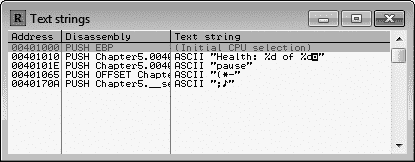
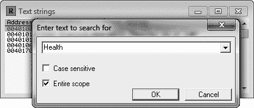
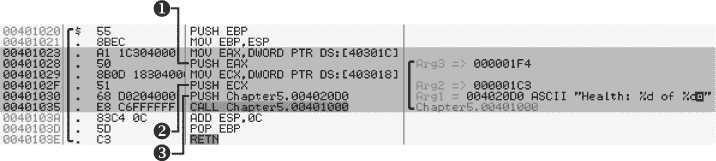
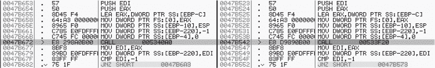
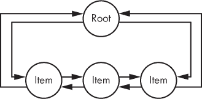
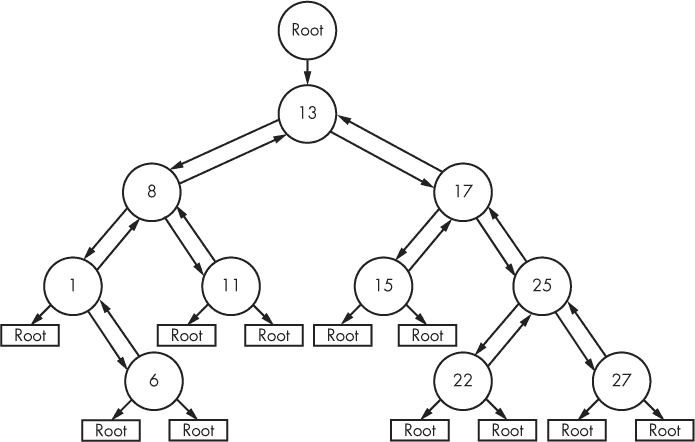

## 5

**高级内存取证**


无论你是将黑客游戏作为爱好还是事业，你最终都会发现自己陷入困境……一大堆难以理解的内存转储中。无论是与竞争对手机器人开发者竞赛发布高度请求的功能、与游戏公司不断更新的战斗，还是在内存中寻找复杂数据结构的努力，你都需要顶级的内存取证技能才能脱颖而出。

成功的机器人开发是在速度和技巧之间微妙平衡的，顽强的黑客必须迎接挑战，通过迅速发布巧妙的功能、及时响应游戏更新，并积极寻找即使是最难找到的数据。要做到这一点，需要对常见的内存模式、高级数据结构以及不同数据片段的用途有全面的理解。

这三种内存取证的技术也许是你武器库中最有效的武器，本章将教你如何使用它们。首先，我将讨论高级内存扫描技术，重点是通过理解数据的目的和使用方式来搜索数据。接下来，我将教你如何使用内存模式应对游戏更新，并在不必重新定位所有地址的情况下调整你的机器人。最后，我将剖析 C++标准库中最常见的四种复杂数据结构（`std::string`、`std::vector`、`std::list`和`std::map`），帮助你在内存中识别它们并枚举它们的内容。到本章结束时，我希望你能够深刻理解内存取证，并能够应对任何与内存扫描相关的挑战。

### 高级内存扫描

在游戏的源代码中，每一段数据都有一个冷静、计算过的定义。然而，当游戏正在进行时，所有这些数据会汇聚在一起，创造出新的东西。玩家只体验到美丽的景色、真实的声音和紧张的冒险；驱动这些体验的数据是无关紧要的。

有鉴于此，假设黑客 A 刚刚开始入侵他最喜欢的游戏，想用机器人来自动化一些无聊的环节。他还没有完全理解内存，对于他来说，这些数据不过是一些假设。他想：“我有 500 点生命值，所以我可以让作弊引擎查找一个值为 500 的 4 字节整数来找到生命值地址。”黑客 A 对数据有着准确的理解：它只是在特定位置（地址）存储的以定义结构（类型）表示的信息（值）。

现在想象一下黑客 B，她已经完全理解了这款游戏；她知道玩游戏如何改变游戏内存中的状态，这些数据不再有什么秘密。她知道数据的每个定义属性都可以根据其目的来确定。与黑客 A 不同，黑客 B 对数据的理解超越了单一变量声明的局限：她考虑的是数据的*目的*和*使用*。在本节中，我们将讨论这两者。

游戏中的每一条数据都有一个目的，游戏的汇编代码在某个时刻必须引用这些数据来实现这个目的。找到使用某条数据的唯一代码意味着找到一个版本无关的标记，这个标记会在游戏更新时持续存在，直到数据被删除或其目的发生变化。让我来告诉你为什么这很重要。

#### *推测目的*

到目前为止，我只向你展示了如何盲目地搜索内存中的某条数据，而没有考虑它是如何被使用的。这种方法可能有效，但并不总是高效。在许多情况下，推测数据的目的、确定哪些代码可能使用该数据，然后定位这些代码以最终找到数据的地址，往往更快捷。

这听起来可能不容易，但“扫描游戏内存以查找特定数据类型的特定值，然后根据不断变化的标准持续筛选结果列表”也并不容易，这正是你到目前为止学会做的事。所以让我们来看看如何根据其目的定位健康值的地址。参考列表 5-1 中的代码。

```
struct PlayerVital {
    int current, maximum;
};
PlayerVital health;
--snip--
printString("Health: %d of %d\n", health.current, health.maximum);
```

*列表 5-1：一个包含玩家生命体征的结构体，以及一个显示它们的函数*

如果你假装`printString()`是一个在游戏界面上绘制文本的高级函数，那么这段代码非常接近你在游戏中可能会找到的内容。`PlayerVital`结构体有两个属性：`current`值和`maximum`值。`health`值是一个`PlayerVital`结构体，所以它也有这些属性。单凭名称，你就可以推测`health`是用来显示玩家健康信息的，当`printString()`使用这些数据时，你可以看到这个目的被实现了。

即使没有代码，你也可以通过查看游戏界面上显示的健康文本直观地得出类似的结论；毕竟，没有代码，计算机什么也做不了。除了实际的`health`变量外，还有一些代码元素需要存在才能向玩家显示这些文本。首先，需要有一个函数来显示文本。其次，字符串`Health`和`of`必须在附近。

**注意**

*为什么我假设文本被拆分成两个独立的字符串，而不是一个？游戏界面显示当前的健康值位于这两个字符串之间，但有很多方式可能导致这种情况，包括格式化字符串，* `strcat(`)*，或者多个显示文本调用对齐的文本。在分析数据时，最好保持假设的广泛性，以考虑所有可能性。*

要在不使用内存扫描器的情况下查找`health`，我们可以利用这两个独立的字符串。不过，我们可能无法知道显示文本的函数是什么样子、它在哪里或被调用了多少次。实际上，字符串就是我们唯一需要寻找的线索，这就足够了。让我们逐步分析。

#### *使用 OllyDbg 查找玩家的健康状态*

在本节中，我将引导你如何追踪`health`结构，但我也在书籍的资源文件中包含了我分析的二进制文件。为了跟随学习并获得一些实际操作经验，使用文件*Chapter5_AdvancedMemoryForensics_Scanning.exe*。

首先，打开 OllyDbg 并将其附加到可执行文件。然后，打开 OllyDbg 的可执行模块窗口，并双击主模块；在我的示例中，主模块是模块窗口中唯一的 *.exe* 文件。CPU 窗口应该会弹出。现在，在反汇编窗格中右键单击并选择**搜索** ▸ **所有引用的文本字符串**。这将打开引用窗口，如图 5-1 所示。



*图 5-1：OllyDbg 的引用窗口，显示的仅是字符串列表。实际游戏中会有远远超过四个字符串。*

从这个窗口，右键点击并选择**搜索文本**。会出现一个搜索对话框。输入你要查找的字符串，如图 5-2 所示，并通过禁用**区分大小写**和启用**整个范围**来尽可能扩大搜索范围。



*图 5-2：在 OllyDbg 中搜索字符串*

点击**确定**执行搜索。引用窗口重新聚焦，首个匹配项被高亮显示。双击匹配项查看在 CPU 窗口中使用该字符串的汇编代码。反汇编窗格聚焦在 0x401030 的代码行，这行代码将格式化字符串参数推送到`printString()`。你可以在图 5-3 中看到这一行，我已经高亮了整个函数调用块。



*图 5-3：在 CPU 窗口的反汇编窗格中查看`printString()`调用*

通过阅读汇编代码，你可以非常准确地理解游戏到底在做什么。左侧的黑色括号显示字符串`Health`位于一个函数调用中。注意该函数的参数。按顺序，这些参数是 EAX ➊、ECX ➋，以及位于 0x4020D0 的格式化字符串 ➌。EAX 是 0x40301C 处的值，ECX 是 0x403018 处的值，格式化字符串包含 `Health`。由于字符串中包含两个格式占位符，你可以假设剩下的两个参数是这些占位符的参数。

了解了这些参数是什么，并且它们是按反向顺序入栈的，你可以倒推并得出原始代码类似于 Listing 5-2 的结论。

```
int currentHealth; // value at 0x403018
int maxHealth;     // value at 0x40301C
--snip--
someFunction("Health: %d of %d\n",
    currentHealth, maxHealth);
```

*Listing 5-2：游戏黑客可能如何解读汇编代码，该代码编译成 Figure 5-3*

存储在 EAX 和 ECX 中的值在内存中是相邻的，这意味着它们可能是某个结构的一部分。不过，为了简化起见，本例只是将它们展示为变量定义。无论哪种方式，这两者都是用来显示玩家生命值的数字。由于这两个重要的值都显示在游戏的用户界面中，因此很容易做出关于显示它们的底层代码的假设。当你知道某个数据的用途时，你可以快速找到负责实现它的代码；在这种情况下，这种知识帮助我们迅速找到了这两个地址。

在许多情况下，找到地址可能是如此简单，但有些数据的用途如此复杂，以至于很难猜测该寻找什么。例如，在 OllyDbg 中查找地图数据或角色位置可能相当棘手。

字符串并不是你用来查找游戏中想要更改的数据的唯一标记，但它们无疑是最容易教授的，且不需要做过于牵强的示例。此外，一些游戏的代码中嵌入了日志或错误字符串，在 OllyDbg 的引用文本字符串窗口中进行探查可以快速判断这些字符串是否存在。如果你熟悉某个游戏的日志实践，你将能够更轻松地找到这些值。

#### *游戏更新后如何确定新地址*

当应用程序代码被修改并重新编译时，会生成一个反映这些变化的新二进制文件。这个二进制文件可能与之前的非常相似，或者它们完全不同；两者之间的差异与高层次变更的复杂性直接相关。像修改字符串或更新常量这样的简单变更，往往不会对代码或数据的地址产生影响，二进制文件也可能几乎相同。但更复杂的变更——如新增功能、全新的用户界面、重构的内部结构或新的游戏内容——常常会导致关键内存位置的变化。

**自动查找 CURRENTHEALTH 和 MAXHEALTH**

在 “搜索汇编模式”（第 19 页）和 “搜索字符串”（第 21 页）中，我展示了一些作弊引擎 Lua 脚本，并解释了它们的工作原理。在这些示例中使用 `findString()` 函数，你可以让作弊引擎自动定位我们刚刚在 OllyDbg 中手动找到的格式字符串的地址。接下来，你可以编写一个小函数，扫描位于字节 0x68 后面的地址（这是 `PUSH` 指令的字节，如你在 图 5-3 中 0x401030 旁边看到的）来定位将其压入堆栈的代码的地址。然后，你可以从 `pushAddress - 5` 和 `pushAddress - 12` 读取 4 个字节，分别定位到 `currentHealth` 和 `maxHealth`。

这看起来可能没有用，因为我们已经找到了这些地址，但如果这是一个真实的游戏，这些地址会在更新发布时发生变化。利用这些知识来自动查找地址会非常有帮助。如果你有挑战精神，试试看吧！

由于不断的错误修复、内容改进和功能添加，网络游戏是软件中发展最快的类型之一。有些游戏每周更新一次，游戏黑客通常将大部分时间花在逆向工程新的二进制文件上，以便相应地更新他们的机器人程序。

如果你创建的是高级机器人，它们将越来越多地依赖于内存地址的基础。每当更新发布时，确定大量值和函数的新地址将是你面临的最耗时的必然任务。依赖于“更新竞赛获胜技巧”会非常有帮助，但这些技巧并不能帮助你找到更新后的地址。你可以通过作弊引擎脚本自动定位一些地址，但这并不总是有效。有时候，你需要手动做这项“脏活”。

如果你试图重新发明轮子，并像最初一样找到这些地址，你会浪费时间。然而，你实际上有一个很大的优势：旧的二进制文件和这些地址本身。利用这两者，你可以在极短的时间内找到所有需要更新的地址。

图 5-4 展示了两个不同的反汇编：左侧是新版本的游戏二进制文件，右侧是旧版本。我从一款真实的游戏（名字保密）中截取了这张图片，以便为你提供一个真实的例子。



*图 5-4：两个版本的游戏反汇编并排显示*

我的机器人修改了 0x047B542 处的代码（右侧），我需要在新版本中找到相应的代码，最终我在 0x047B672 处找到了它（左侧）。这个函数调用会在接收到数据包时调用一个数据包解析函数。为了最初找到这个地址（“最初”指的是大约 100 次更新前），我弄明白了游戏的网络协议是如何工作的，设定了许多与网络相关的 API 调用的断点，逐步执行并检查栈上的数据，直到找到一个与我预期的协议知识相似的内容。

**更新竞赛获胜提示**

在饱和的市场中，成为第一个发布稳定更新的机器人开发者对于成功至关重要。比赛在游戏更新的那一刻就开始了，决心最快的黑客会花上数百小时准备。这些是保持领先的最常见方法：

**创建更新警报** 通过编写软件，在游戏打补丁时立即提醒你，你就可以尽早开始处理更新。

**自动化机器人安装** 游戏通常在玩家最少的时候安排预期的更新。做机器人行为的玩家讨厌在开始之前起床并下载新软件，但他们喜欢醒来时发现软件已经在游戏打补丁时悄然安装好了。

**使用更少的地址** 更新的内容越少越好。将相关数据合并为结构体，并消除不必要的内存地址使用可以节省大量时间。

**拥有优秀的测试用例** 数据会发生变化，黑客也会犯错。能够快速测试每个功能的方式可能是稳定机器人与随机崩溃、导致用户死亡甚至让角色被封禁之间的区别。

使用这些方法来攻击更新将为你提供一个可观的起步优势，但它们可能并不总是足够让你获得胜利。最重要的是，尽量理解逆向工程，并利用这种理解为自己争取优势。

我本可以按照相同的步骤处理此后的每次 100 多个更新，但那样就没必要了。多年来代码保持相对不变，这让我可以使用旧代码中的模式，在新代码中找到这个函数调用的地址。

现在，考虑这段汇编代码：

```
PUSH EDI
PUSH EAX 
LEA EAX,DWORD PTR SS:[EBP-C] 
MOV DWORD PTR FS:[0],EAX 
MOV DWORD PTR SS:[EBP-10],ESP 
MOV DWORD PTR SS:[EBP-220],-1 
MOV DWORD PTR SS:[EBP-4],0
```

看起来熟悉吗？将其与图 5-4 进行比较，你会发现这个确切的代码在游戏的两个版本中都存在于突出显示的函数调用上方。不管它做什么，这一系列操作看起来相当独特；由于代码相对于 EBP 使用了多个不同的偏移量，其他地方的二进制文件中不太可能存在完全相同的代码块。

每次我需要更新这个地址时，我会在 OllyDbg 中打开旧的二进制文件，选中这一段操作，右键点击，选择 Asm2Clipboard ▸ 复制固定汇编到剪贴板。然后，我在 OllyDbg 中打开新的二进制文件，进入 CPU 窗口，按 CTRL-S，粘贴汇编代码，然后点击查找。在 9.5 次中的 10 次，这样我就能直接定位到新版本中需要找到的函数调用。

当更新到来时，你可以使用相同的方法找到几乎所有已知的地址。这对于你能在汇编代码中轻松找到的每个地址都适用。不过，有几个注意事项：

• OllyDbg 将搜索限制为八个操作，因此你必须找到大小为该数或更小的代码标记。

• 你使用的操作不能包含任何其他地址，因为那些地址很可能已经发生变化。

• 如果游戏的某些部分发生了变化，使用了你正在寻找的地址，那么代码可能会有所不同。

• 如果游戏更换了编译器或切换了优化设置，几乎所有的代码都会发生完全的变化。

正如在第 102 页的《自动找到`currentHealth`和`maxHealth`》中讨论的那样，你可以通过编写脚本来帮助你自动完成这些任务。资深的游戏黑客会非常努力地自动定位尽可能多的地址，而一些最好的机器人则设计成每次在运行时自动检测它们的地址。虽然最初可能需要很多工作，但这项投资绝对值得。

### 识别游戏数据中的复杂结构

第四章描述了游戏如何将数据存储在静态结构中。当你尝试查找简单数据时，这些知识足够使用，但对于通过动态结构存储的数据来说，它就显得不足够了。这是因为动态结构可能会分散在不同的内存位置，遵循长指针链，或者需要复杂的算法才能从中提取数据。

本节将探讨你在电子游戏代码中常见的动态结构，以及一旦找到这些结构，如何从中读取数据。首先，我将讲解每个动态结构的基本组成。接下来，我会概述读取这些结构数据所需的算法。（为简单起见，每个算法的讨论假设你有指向该结构实例的指针，并且有某种方式从内存中读取数据。）最后，我将介绍一些技巧，帮助你确定在内存中查找的值是否实际上被封装在这些结构之一中，这样你就知道何时应用这些知识。我将重点讨论 C++，因为它的面向对象特性和广泛使用的标准库通常负责这种结构。

**注意**

*这些结构可能会因编译器、优化设置或标准库实现的不同，在不同机器上略有差异，但基本概念是相同的。此外，为了简洁起见，我将省略这些结构中的无关部分，例如自定义分配器或比较函数。示例代码可以在* [`www.nostarch.com/gamehacking/`](https://www.nostarch.com/gamehacking/) *的资源文件中找到，位于第五章的内容。*

#### *std::string 类*

`std::string`的实例是动态存储最常见的罪魁祸首之一。C++标准模板库（STL）中的这个类将字符串操作从开发者中抽象出来，同时保持效率，因此广泛应用于各种软件中。一个视频游戏可能会使用`std::string`结构来存储任何字符串数据，比如生物的名字。

##### 检查 std::string 的结构

当你去掉`std::string`类中的成员函数和其他非数据组件时，剩下的结构大概是这样的：

```
class string {
    union {
        char* dataP;
        char dataA[16];
    };
    int length;
};

// point to a string in memory
string* _str = (string*)stringAddress;
```

该类预留了 16 个字符，用于直接存储字符串。然而，它也声明前 4 个字节可以是指向字符的指针。看起来这有些奇怪，但这是优化的结果。某个时候，这个类的开发者决定 15 个字符（加上一个空终止符）对于许多字符串来说是一个合适的长度，因此他们选择通过提前预留 16 个字节的内存来节省内存分配和回收的开销。为了适应更长的字符串，他们允许这 16 个字节的前 4 个字节作为指针指向更长字符串的字符。

**注意**

*如果代码是编译为 64 位的，那么实际上指向字符的是前 8 个字节（而不是 4 个字节）。不过，在本例中，你可以假设使用的是 32 位地址，并且`int`是地址的大小。*

以这种方式访问字符串数据会带来一定的开销。定位正确缓冲区的函数大致如下所示：

```
const char* c_str() {
    if (_str->length <= 15)
        return (const char*)&_str->dataA[0];
    else
        return (const char*)_str->dataP;
}
```

`std::string`可以是一个完整的字符串，也可以是指向更长字符串的指针，这使得从游戏破解的角度来看，这种结构相当棘手。有些游戏可能会使用`std::string`来存储字符串，这些字符串很少超过 15 个字符。在这种情况下，你可能会编写依赖于这些字符串的机器人，却不知道底层结构其实比一个简单的字符串要复杂得多。

##### 忽视 std::string 可能会破坏你的乐趣

如果你不了解包含所需数据的结构的真实情况，就可能编写出一个只在某些时候有效、而在关键时刻失效的机器人。例如，假设你正在尝试弄清楚一个游戏是如何存储生物数据的。在你的假设性搜索中，你发现游戏中的所有生物都存储在一个结构体数组中，这些结构体看起来类似于示例 5-3。

```
struct creatureInfo {
    int uniqueID;
    char name[16];
    int nameLength;
    int healthPercent;
    int xPosition;
    int yPosition;
    int modelID;
 int creatureType;
};
```

*列表 5-3：你可能如何解释内存中找到的生物数据*

扫描内存中的生物数据后，假设你注意到每个结构的前 4 个字节对于每个生物都是唯一的，因此你将这些字节称为`uniqueID`，并假设它们形成了一个单一的`int`属性。进一步查看内存后，你发现生物的`name`紧接在`uniqueID`之后存储，并通过一些推理，你发现名字的长度为 16 字节。接下来，你在内存中看到的值原来是`nameLength`；虽然一个以空字符结尾的字符串有一个长度字段有点奇怪，但你忽略了这个怪异现象，继续分析内存中的数据。经过进一步分析，你弄清楚了剩余值的用途，定义了列表 5-3 中展示的结构，并写了一个机器人，自动攻击具有某些名字的生物。

在几周的测试中，你的机器人不断在与像*龙*、*独眼巨人*、*巨人*和*猎犬*之类的生物战斗时表现良好，你决定是时候把机器人交给你的朋友们使用了。为了首次使用，你把大家聚集在一起，去击败一只名为*超级老板至尊*的 boss。全体队员设定机器人优先攻击 boss，并在 boss 超出攻击范围时，将目标转向像*恶魔*或*死神*之类的次级生物。

一旦你的团队到达了老板的副本……你们都会被慢慢消灭。

这个场景中出了什么问题？你的游戏一定是用`std::string`存储生物名字，而不是简单的字符数组。`creatureInfo`中的`name`和`nameLength`字段，实际上是`std::string`字段的一部分，而`name`字符数组是`dataA`和`dataP`成员的联合体。*超级老板至尊*的名字超过了 15 个字符，而由于机器人没有意识到`std::string`的实现，它没有识别出 boss。相反，机器人不断将目标锁定为召唤出的*恶魔*生物，实际上让你无法锁定 boss，同时 boss 慢慢消耗了你的生命和资源。

##### 判断数据是否存储在 std::string 中

如果不了解`std::string`类的结构，你就很难定位像我刚才描述的假设性 bug。把你在这里学到的知识与经验结合起来，你就能完全避免这类 bug。当你在内存中发现像`name`这样的字符串时，不要仅仅假设它是存储在一个简单的数组中。为了弄清楚一个字符串是否实际上是一个`std::string`，问自己以下几个问题：

• 为什么一个以空字符结尾的字符串会有字符串长度的记录？如果你想不出一个合理的理由，那么你可能就遇到了`std::string`。

• 一些生物（或其他游戏元素，具体取决于你在寻找什么）是否有超过 16 个字母的名字，但在内存中你只能找到 16 个字符的空间？如果是这样，数据几乎可以肯定是存储在`std::string`中。

• 名称是直接存储在内存中的，需要开发人员使用 `strcpy()` 来修改它吗？它可能是一个 `std::string`，因为这样处理原始 C 字符串被认为是不好的做法。

最后，请记住，还有一个名为 `std::wstring` 的类，用于存储宽字符字符串。其实现非常相似，只不过在每个 `char` 的地方使用了 `wchar_t`。

#### *std::vector 类*

游戏必须跟踪许多动态数据数组，但管理动态大小的数组可能非常棘手。为了提高速度和灵活性，游戏开发人员通常使用一个模板化的 STL 类 `std::vector` 来存储这些数据，而不是使用简单的数组。

##### 检查 std::vector 的结构

该类的声明类似于清单 5-4。

```
template<typename T>
class vector {
    T* begin;
    T* end;
    T* reservationEnd;
};
```

*清单 5-4：一个抽象的 `std::vector` 对象*

这个模板增加了一层额外的抽象，因此我将继续使用一个声明为 `DWORD` 类型的 `std::vector` 来描述。以下是游戏可能如何声明该 vector：

```
std::vector<DWORD> _vec;
```

现在，让我们解析一个 `std::vector` 类型的 `DWORD` 对象在内存中的表现。如果你知道 `_vec` 的地址并共享相同的内存空间，你就可以重新构造该类的底层结构，并像在清单 5-5 中一样访问 `_vec`。

```
class vector {
    DWORD* begin;
    DWORD* end;
    DWORD* tail;
};
// point to a vector in memory
vector* _vec = (vector*)vectorAddress;
```

*清单 5-5：一个 `DWORD std::vector` 对象*

你可以将成员 `begin` 视为原始数组，因为它指向 `std::vector` 对象中的第一个元素。然而，没有数组长度成员，因此你必须根据 `begin` 和 `end` 来计算 vector 的长度，`end` 是跟在数组中最后一个对象后面的空对象。长度计算代码如下所示：

```
int length() {
    return ((DWORD)_vec->end - (DWORD)_vec->begin) / sizeof(DWORD);
}
```

该函数简单地将 `begin` 中存储的地址与 `end` 中存储的地址相减，以找到它们之间的字节数。然后，为了计算对象的数量，它将字节数除以每个对象的字节数。

使用 `begin` 和 `length()` 函数，你可以安全地访问 `_vec` 中的元素。代码可能如下所示：

```
DWORD at(int index) {
    if (index >= _vec->length())
        throw new std::out_of_range();
    return _vec->begin[index];
}
```

给定一个索引，这段代码将从 vector 中获取一个元素。但如果索引大于 vector 的长度，则会抛出一个 `std::out_of_range` 异常。不过，如果该类无法预留或重用内存，向 `std::vector` 中添加值将会非常昂贵。为了解决这个问题，该类实现了一个名为 `reserve()` 的函数，告诉 vector 需要为多少个对象预留空间。

`std::vector` 的绝对大小（即其 *容量*）是通过一个额外的指针来确定的，在我们重新创建的 vector 类中，这个指针被称为 `tail`。容量的计算与长度计算类似：

```
int capacity() {
    return ((DWORD)_vec->tail - (DWORD)_vec->begin) / sizeof(DWORD);
}
```

要找到 `std::vector` 的容量，而不是像计算长度那样从 `begin` 地址减去 `end` 地址，这个函数是通过将 `begin` 地址减去 `tail` 来进行计算的。此外，你还可以使用这个计算的第三次来确定向量中自由元素的数量，方法是使用 `tail` 和 `end` 来代替：

```
int freeSpace() {
    return ((DWORD)_vec->tail - (DWORD)_vec->end) / sizeof(DWORD);
}
```

给定适当的内存读取和写入函数，你可以使用 列表 5-4 中的声明以及随后的计算来访问和操作游戏内存中的向量。第六章详细讨论了内存读取，但现在让我们看看如何判断你感兴趣的数据是否存储在 `std::vector` 中。

##### 判断数据是否存储在 std::vector 中

一旦你在游戏的内存中找到了一个数据数组，你可以按照以下步骤来判断它是否存储在 `std::vector` 中。首先，如果数组有静态地址，你可以确定它不是存储在 `std::vector` 中，因为 `std::vector` 对象需要通过指针路径来访问底层数组。如果数组*确实*需要指针路径，最终偏移为 `0` 将表明它是一个 `std::vector`。为了确认，你可以将最终偏移改为 `4`，并检查它是否指向数组中的最后一个对象，而不是第一个对象。如果是这样，那么你几乎可以确定你正在查看一个向量，因为你已经确认了 `begin` 和 `end` 指针。

#### *std::list 类*

类似于 `std::vector`，`std::list` 是一个可以用来存储链表中项集合的类。主要的区别在于，`std::list` 不需要元素的连续存储空间，不能通过索引直接访问元素，并且可以在不影响任何前面元素的情况下扩展大小。由于访问项所需的开销，游戏中很少使用这个类，但在一些特殊情况下它会出现，我将在本节中讨论。

##### 检查 std::list 的结构

`std::list` 类看起来像是 列表 5-6 中的样子。

```
template<typename T>
class listItem {
    listItem<T>* next;
    listItem<T>* prev;
    T value;
};

template<typename T>
class list {
    listItem<T>* root;
    int size;
};
```

*列表 5-6：一个抽象化的 `std::list` 对象*

这里有两个类：`listItem` 和 `list`。为了避免在解释 `std::list` 工作原理时出现额外的抽象，我将描述这个对象，当类型为 `DWORD` 时的样子。下面是一个游戏如何声明一个 `DWORD` 类型的 `std::list`：

```
std::list<DWORD> _lst;
```

给定这个声明，`std::list` 的结构就像 列表 5-7 中的代码。

```
 class listItem {
    listItem* next;
    listItem* prev;
    DWORD value;
};
class list {
    listItem* root;
    int size;
};
// point to a list
list* _lst = (list*)listAddress;
```

*列表 5-7：一个 `DWORD std::list` 对象*

类`list`表示列表头，而`listItem`表示存储在列表中的值。与连续存储不同，列表中的项是独立存储的。每个项都包含指向后继项（`next`）和前驱项（`prev`）的指针，这些指针用于在列表中定位项。`root`项充当列表末尾的标记；最后一个项的`next`指针指向`root`，第一个项的`prev`指针也指向`root`。`root`项的`next`和`prev`指针分别指向第一个项和最后一个项。图 5-5 展示了这个结构。

给定此结构，你可以使用以下代码来遍历`std::list`对象：



*图 5-5：`std::list`流程图*

```
// iterate forward
listItem* it = _lst->root->next;
for (; it != _lst->root; it = it->next)
    printf("Value is %d\n", it->value);

// iterate backward
listItem* it = _lst->root->prev;
for (; it != _lst->root; it = it->prev)
    printf("Value is %d\n", it->value);
```

第一个循环从第一个项（`root->next`）开始，向前迭代（`it = it->next`），直到遇到结束标记（`root`）。第二个循环从最后一个项（`root->pres`）开始，向后迭代（`it = it->prev`），直到遇到结束标记（`root`）。这个迭代依赖于`next`和`prev`，因为与数组中的对象不同，`std::list`中的对象不是连续的。由于`std::list`中每个对象的内存不是连续的，因此没有快速粗略的方法来计算其大小。相反，类只是定义了一个大小成员。此外，为新对象预留空间的概念对于列表来说是无关紧要的，因此没有变量或计算来确定列表的容量。

##### 确定游戏数据是否存储在 std::list 中

确定存储在`std::list`类中的对象可能会很棘手，但你可以注意到一些提示。首先，`std::list`中的项不能具有静态地址，因此，如果你要查找的数据具有静态地址，那么你就可以排除它。显然属于集合的一部分的项，如果它们在内存中不是连续存储的，可能是`std::list`的一部分。

还需要考虑的是，`std::list`中的对象可以具有无限长的指针链（例如`it->prev->next->prev->next->prev`...），并且在作弊引擎中进行指针扫描时，关闭“禁用循环指针”选项后，可能会显示更多的结果。

你也可以使用脚本来检测某个值是否存储在链表中。清单 5-8 展示了一个执行此操作的作弊引擎脚本。

```
function _verifyLinkedList(address)
    local nextItem = readInteger(address) or 0
    local previousItem = readInteger(address + 4) or 0
    local nextItemBack = readInteger(nextItem + 4)
    local previousItemForward = readInteger(previousItem)

    return (address == nextItemBack
            and address == previousItemForward)
end

function isValueInLinkedList(valueAddress)
    for address = valueAddress - 8, valueAddress - 48, -4 do
        if (_verifyLinkedList(address)) then
            return address
        end
    end
    return 0
end

local node = isValueInLinkedList(addressOfSomeValue)
if (node > 0) then
    print(string.format("Value in LL, top of node at 0x0%x", node))
end
```

*清单 5-8：使用作弊引擎 Lua 脚本确定数据是否存储在`std::list`中*

这里有相当多的代码，但实际上它做的事情非常简单。`isValueInLinkedList()`函数获取某个值的地址，然后向后查找最多 40 个字节（10 个整数对象，以防值存在于更大的结构中），从地址上方 8 个字节开始（两个指针必须存在，每个指针 4 字节）。由于内存对齐问题，这个循环以 4 字节为步长进行迭代。

在每次迭代中，地址会被传递给`_verifyLinkedList()`函数，这就是魔法发生的地方。如果我们根据本章定义的链表结构来看，函数只是做了以下操作：

```
return (node->next->prev == node && node->prev->next == node)
```

也就是说，函数基本假设它获得的内存地址指向一个链表，并且它确保该节点具有有效的前后节点。如果这些节点有效，那么假设是正确的，这个地址就是链表节点的地址。如果节点不存在或没有指向正确的位置，那么假设是错误的，这个地址不属于链表的一部分。

请记住，这个脚本不会给出列表根节点的地址，而只是给出包含你提供的值的节点的地址。要正确遍历链表，你需要扫描有效的指针路径直到根节点，所以你需要根节点的地址。

查找该地址可能需要搜索内存转储、进行大量的试错和头疼的思考，但这是绝对可能的。最好的开始方式是跟踪`prev`和`next`节点的链，直到你找到一个数据为空、无意义或填充有值`0xBAADF00D`的节点（一些标准库实现使用这个值来标记根节点，但不是所有实现都如此）。

如果你确切知道列表中有多少个节点，这项调查也会变得更加容易。即使没有列表头，你也可以通过不断跟踪下一个指针，直到回到起始节点，从而确定节点的数量，正如在 Listing 5-9 中所示。

```
function countLinkedListNodes(nodeAddress)
    local counter = 0
    local next = readInteger(nodeAddress)
    while (next ~= nodeAddress) do
        counter = counter + 1
        next = readInteger(next)
    end
    return counter
end
```

*Listing 5-9：使用 Cheat Engine Lua 脚本确定任意`std::list`的大小*

首先，这个函数创建一个计数器来存储节点数量，以及一个变量来存储下一个节点的地址。然后，`while`循环会遍历节点，直到它回到初始节点。最后，它返回计数器变量，该变量在每次循环迭代时都会增加。

**通过脚本查找根节点**

实际上，可以编写一个脚本来查找根节点，但我将其作为一个可选练习留给你。它是如何工作的呢？根节点必须在节点链中，列表头指向根节点，且列表的大小会紧跟根节点在内存中。基于这些信息，你可以编写一个脚本，搜索任何包含指向某个列表节点的指针的内存，后面紧跟着的是列表的大小。通常情况下，这块内存就是列表头，它指向的节点就是根节点。

#### *std::map 类*

像`std::list`一样，`std::map`也使用元素之间的链接来形成其结构。然而，`std::map`独特之处在于每个元素存储两部分数据（一个键和值），并且排序元素是底层数据结构（红黑树）的固有属性。下面的代码展示了组成`std::map`的结构。

```
template<typename keyT, typename valT>
struct mapItem {
    mapItem<keyT, valT>* left;
    mapItem<keyT, valT>* parent;
    mapItem<keyT, valT>* right;
    keyT key;
    valT value;
};

template<typename keyT, typename valT>
struct map {
    DWORD irrelevant;
    mapItem<keyT, valT>* rootNode;
    int size;
}
```

红黑树是一种自平衡的二叉搜索树，因此`std::map`也是如此。在 STL 的`std::map`实现中，树中的每个元素（或节点）都有三个指针：`left`、`parent`和`right`。除了指针外，每个节点还拥有一个`key`和一个`value`。节点在树中的排列是基于它们键的比较。一个节点的`left`指针指向一个具有较小键的节点，`right`指针指向一个具有较大键的节点。`parent`指向上一级节点。树中的第一个节点叫做`rootNode`，没有子节点的节点指向它。

##### 可视化`std::map`

图 5-6 显示了一个包含键值 1、6、8、11、13、15、17、22、25 和 27 的`std::map`。



*图 5-6：红黑树*

顶部节点（持有值`13`）由`rootNode`的`parent`指向。它左侧的所有节点有较小的`key`，右侧的所有节点有较大的`key`。这一规则适用于树中的任何节点，正是这种规则使得基于键的搜索非常高效。虽然图中没有表现出来，但根节点的`left`指针将指向最左边的节点（`1`），而`right`指针将指向最右边的节点（`27`）。

##### 访问`std::map`中的数据

再次说明，在讨论如何从结构中提取数据时，我将使用静态的`std::map`定义。由于模板需要两个类型，我也会使用一些伪类型来保持清晰。以下是我将在本节余下部分引用的`std::map`对象的声明：

```
typedef int keyInt;
typedef int valInt;
std::map<keyInt, valInt> myMap;
```

通过这个声明，`myMap`的结构变成了：

```
struct mapItem {
    mapItem* left;
    mapItem* parent;
    mapItem* right;
    keyInt key;
    valInt value;
};
struct map {
    DWORD irrelevant;
    mapItem* rootNode;
    int size;
}
map* _map = (map*)mapAddress;
```

在游戏中，你可能需要访问`std::map`结构中的一些重要算法。首先，盲目遍历映射中的每一项可能是有用的，尤其是当你只是想查看所有数据时。为了按顺序执行这一操作，你可以像这样编写一个迭代函数：

```
void iterateMap(mapItem* node) {
    if (node == _map->rootNode) return;
    iterateMap(node->left);
    printNode(node);
    iterateMap(node->right);
}
```

一个遍历整个映射的函数会首先读取当前节点，并检查它是否是`rootNode`。如果不是，它会递归向左，打印节点，然后递归向右。

调用这个函数时，你需要传入指向`rootNode`的指针，代码如下：

```
iterateMap(_map->rootNode->parent);
```

然而，`std::map`的目的是以快速可搜索的方式存储带键数据。当你需要根据特定的`key`来定位一个节点时，模仿内部搜索算法比扫描整个树更为可取。搜索`std::map`的代码大概是这样的：

```
mapItem* findItem(keyInt key, mapItem* node) {
    if (node != _map->rootNode) {
        if (key == node->key)
            return node;
        else if (key < node->key)
            return findItem(key, node->left);
        else
            return findItem(key, node->right);
    } else return NULL;
}
```

从树的顶部开始，如果当前的键大于搜索键，你就递归向左；如果小于，则递归向右。如果键相等，你就返回当前节点。如果你到达树的底部且没有找到该键，说明该键不在映射中，你应该返回`NULL`。

这里有一种你可能会使用`findItem()`函数的方式：

```
mapItem* ret = findItem(someKey, _map->rootNode->parent);
if (ret)
    printNode(ret);
```

只要`findItem()`不返回`NULL`，这段代码应该会打印出`_map`中的一个节点。

##### 确定游戏数据是否存储在`std::map`中

通常，在我确定集合不是数组、`std::vector`或`std::list`之前，我甚至不会考虑数据是否可能存储在`std::map`中。如果排除了这三种选项，那么就像对待`std::list`一样，你可以查看值前面的三个整数值，并检查它们是否指向可能是其他映射节点的内存。

再次说明，这可以通过 Cheat Engine 中的 Lua 脚本完成。这个脚本与我之前展示的列表脚本相似，向后循环遍历内存，以查看在值之前是否找到有效的节点结构。不过，与列表代码不同的是，验证节点的函数要复杂得多。看看列表 5-10 中的代码，接下来我会详细分析它。

```
   function _verifyMap(address)
       local parentItem = readInteger(address + 4) or 0

       local parentLeftItem = readInteger(parentItem + 0) or 0
       local parentRightItem = readInteger(parentItem + 8) or 0

➊     local validParent =
           parentLeftItem == address
           or parentRightItem == address
       if (not validParent) then return false end

       local tries = 0
       local lastChecked = parentItem
       local parentsParent = readInteger(parentItem + 4) or 0
➋     while (readInteger(parentsParent + 4) ~= lastChecked and tries < 200) do
           tries = tries + 1
           lastChecked = parentsParent
           parentsParent = readInteger(parentsParent + 4) or 0
       end

       return readInteger(parentsParent + 4) == lastChecked
   end
```

*列表 5-10：使用 Cheat Engine Lua 脚本确定数据是否在`std::map`中*

给定`address`，这个函数检查`address`是否在一个映射结构中。它首先检查是否有有效的父节点，如果有，检查这个父节点是否指向`address`的任一侧 ➊。但仅仅这个检查还不够。如果检查通过，函数还会沿着`parent`节点的链向上爬升，直到找到一个节点是其父节点的父节点 ➋，并在尝试 200 次后才会停止。如果爬升成功，找到了一个其祖父节点的节点，那么`address`一定指向一个映射节点。这是可行的，因为正如我在《可视化`std::map`》中概述的那样，在每个映射的顶部有一个根节点，其父节点指向树中的第一个节点，而该节点的父节点则指回根节点。

**注意**

*我敢打赌，你没想到在阅读一本游戏黑客书时会遇到时间旅行的祖父悖论！*

使用这个函数和稍作修改的回溯循环，来自列表 5-8，你可以自动检测值是否在一个映射中：

```
function isValueInMap(valueAddress)
    for address = valueAddress - 12, valueAddress - 52, -4 do
        if (_verifyMap(address)) then
            return address
        end
    end
    return 0
end

local node = isValueInMap(addressOfSomeValue)
if (node > 0) then
    print(string.format("Value in map, top of node at 0x0%x", node))
end
```

除了函数名称外，这段代码与列表 5-8 中的代码唯一的变化是，它开始从值之前的 12 个字节循环，而不是 8 个字节，因为映射有三个指针，而列表只有两个。映射结构的一个好处是，根节点很容易获取。当`_verifyMap`函数返回 true 时，`parentsParent`变量将包含根节点的地址。通过一些简单的修改，你可以将这个地址返回到主调用中，并在一个地方拥有读取`std::map`数据所需的一切。

### 结束语

内存取证是破解游戏中最耗时的部分，它的障碍可能以各种形式和大小出现。然而，利用目标、模式以及对复杂数据结构的深刻理解，你可以迅速克服这些障碍。如果你仍然对发生了什么感到有些困惑，确保下载并尝试提供的示例代码，因为它包含了本章涉及的所有算法的概念证明。

在第六章中，我们将开始深入了解你需要从自己的程序中读取和写入游戏内存的代码，以便你可以迈出第一步，将所有关于内存结构、地址和数据的信息付诸实践。
