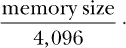

## 第六章：6

**读取和写入游戏内存**


前面的章节讨论了内存是如何构建的，以及如何使用 Cheat Engine 和 OllyDbg 扫描和修改内存。在你开始编写机器人时，操作内存将是至关重要的，你的代码需要知道如何操作内存。

本章深入探讨了内存操作的代码层面细节。首先，你将学习如何使用代码定位并获取游戏进程的句柄。接下来，你将学习如何使用这些句柄从远程进程或注入的代码中读取和写入内存。最后，你将学习绕过某种内存保护技术，并附带一个小示例，演示代码注入。你将在本书的源代码文件中的*GameHackingExamples/Chapter6_AccessingMemory*目录下找到本章的示例代码。

**注意**

*当我在本章（以及后续章节）中谈论 API 函数时，我指的是 Windows API，除非另有说明。如果我没有提到库的头文件，你可以假设它是* Windows.h。

### 获取游戏的进程标识符

要读取或写入游戏的内存，你需要其*进程标识符（PID）*，这是一个唯一标识活动进程的数字。如果游戏有一个可见窗口，你可以通过调用 `GetWindowThreadProcessId()` 来获取创建该窗口的进程的 PID。此函数将窗口的句柄作为第一个参数，并将 PID 输出到第二个参数。你可以通过将窗口标题（任务栏上的文本）作为第二个参数传递给 `FindWindow()` 来找到窗口的句柄，如 示例 6-1 所示。

```
HWND myWindow =
    FindWindow(NULL, "Title of the game window here");
DWORD PID;
GetWindowThreadProcessId(myWindow, &PID);
```

*示例 6-1：获取窗口句柄以获取 PID*

获取到窗口句柄后，你只需创建一个存储 PID 的地方并调用 `GetWindowThreadProcessId()`，如以下示例所示。

如果游戏没有窗口，或者窗口名称不可预测，你可以通过枚举所有进程并查找游戏二进制文件的名称来找到游戏的 PID。示例 6-2 就是使用 API 函数 `CreateToolhelp32Snapshot()`、`Process32First()` 和 `Process32Next()` 来实现的，这些函数来自 *tlhelp32.h*。

```
#include <tlhelp32.h>

PROCESSENTRY32 entry;
entry.dwSize = sizeof(PROCESSENTRY32); 
HANDLE snapshot =
    CreateToolhelp32Snapshot(TH32CS_SNAPPROCESS, NULL);
if (Process32First(snapshot, &entry) == TRUE) {
    while (Process32Next(snapshot, &entry) == TRUE) {
        wstring binPath = entry.szExeFile;
        if (binPath.find(L"game.exe") != wstring::npos) {
            printf("game pid is %d\n", entry.th32ProcessID);
            break;
        }
    }
} 
CloseHandle(snapshot);
```

*示例 6-2：在没有窗口名称的情况下获取游戏的 PID*

示例 6-2 可能看起来比 示例 6-1 更复杂，但在所有代码的背后，这个函数实际上就像一个典型的 `for (iterator`; 比较器; 增量) 循环。`CreateToolhelp32Snapshot()` 函数获取一个名为 `snapshot` 的进程列表，`entry` 是该列表的*迭代器*。`Process32First()` 返回的值初始化了迭代器，而 `Process32Next()` *递增* 了它。最后，`Process32Next()` 的布尔返回值是*比较器*。这段代码只是遍历了每个运行中的进程的快照，寻找其二进制路径包含文本 *game.exe* 的进程，并打印其 PID。

#### *获取进程句柄*

一旦你知道了游戏的 PID，你可以通过一个名为 `OpenProcess()` 的 API 函数获取到该进程的句柄。此函数允许你以所需的访问权限获取句柄，以便读取和写入内存。这对于游戏破解至关重要，因为任何操作进程的函数都需要具有适当访问权限的句柄。

让我们来看一下 `OpenProcess()` 的原型：

```
HANDLE OpenProcess(DWORD DesiredAccess, BOOL InheritHandle, DWORD ProcessId);
```

第一个参数 `DesiredAccess` 期望一个或多个进程访问标志，用于设置 `OpenProcess()` 返回的句柄。你可以使用多种标志，但在游戏破解中最常见的是以下几个：

`PROCESS_VM_OPERATION` 返回的句柄可以与 `VirtualAllocEx()`、`VirtualFreeEx()` 和 `VirtualProtectEx()` 一起使用，分别用于分配、释放和保护内存块。

`PROCESS_VM_READ` 返回的句柄可以与 `ReadProcessMemory()` 一起使用。

`PROCESS_VM_WRITE` 返回的句柄可以与 `WriteProcessMemory()` 一起使用，但它也必须具有 `PROCESS_VM_OPERATION` 权限。你可以通过将 `PROCESS_VM_OPERATION | PROCESS_VM_WRITE` 作为 `DesiredAccess` 参数来设置这两个标志。

`PROCESS_CREATE_THREAD` 返回的句柄可以与 `CreateRemoteThread()` 一起使用。

`PROCESS_ALL_ACCESS` 返回的句柄可以用来执行任何操作。避免使用此标志，因为它只能由启用了调试权限的进程使用，并且在旧版本的 Windows 中存在兼容性问题。

在获取游戏的句柄时，通常可以将 `OpenProcess()` 函数的第二个参数 `InheritHandle` 设置为 `false`。第三个参数 `ProcessId` 期望打开的进程的 PID。

#### *使用 OpenProcess()*

现在让我们来看一个使用访问权限允许从内存读取和写入的句柄调用 `OpenProcess()` 的示例：

```
   DWORD PID = getGamePID();
   HANDLE process = OpenProcess(
       PROCESS_VM_OPERATION |
           PROCESS_VM_READ |
           PROCESS_VM_WRITE,
 FALSE,
       PID 
   );
➊ if (process == INVALID_HANDLE_VALUE) {
      printf("Failed to open PID %d, error code %d",
             PID, GetLastError());
   }
```

首先，调用 `getGamePID()` 获取你需要的 PID。（这个函数是你需要自己编写的，不过它可以只是我在列表 6-1 和 6-2 中展示的代码片段，扩展成一个完整的函数。）接着，代码使用三个标志调用 `OpenProcess()`：`PROCESS_VM_OPERATION` 标志为该句柄提供内存访问权限，另外两个标志组合提供了读写权限。这个示例还包含了一个错误处理案例 ➊，但只要你有正确的 PID，拥有有效的访问标志，且代码运行的权限与游戏相同或更高（例如，如果你以管理员身份启动你的机器人），则该调用不应失败。

一旦使用完句柄，就应使用 `CloseHandle()` 清理它，代码如下：

```
CloseHandle(process);
```

你可以随意重用句柄，所以你可以一直保持一个句柄直到完全不再使用它，或者直到你的机器人退出。

现在你已经看到如何打开进程句柄，为操作游戏内存做好准备，接下来让我们深入探讨如何实际访问该进程的内存。

### 访问内存

Windows API 提供了两个对内存访问至关重要的函数：`ReadProcessMemory()` 和 `WriteProcessMemory()`。你可以使用这些函数来外部操控游戏的内存。

#### *使用 ReadProcessMemory() 和 WriteProcessMemory()*

这两个函数的原型（如在清单 6-3 中所示）非常相似，使用它们时你几乎会遵循完全相同的步骤。

```
BOOL ReadProcessMemory(
    HANDLE Process, LPVOID Address,
    LPVOID Buffer, DWORD Size,
    DWORD *NumberOfBytesRead 
);
BOOL WriteProcessMemory(
    HANDLE Process, LPVOID Address,
    LPCVOID Buffer, DWORD Size,
 DWORD *NumberOfBytesWritten 
);
```

*清单 6-3：`ReadProcessMemory()` *和* `WriteProcessMemory()` *原型*

两个函数都期望 `Process` 是一个进程句柄，`Address` 是目标内存地址。当函数从内存中读取时，`Buffer` 应该指向一个对象，该对象将保存读取的数据。当函数向内存写入时，`Buffer` 应该指向要写入的数据。在这两种情况下，`Size` 定义了 `Buffer` 的大小（以字节为单位）。两个函数的最后一个参数用于可选地返回已访问的字节数；你可以安全地将其设置为 `NULL`。除非函数失败，否则返回的最终参数值应该等于 `Size`。

#### *使用 ReadProcessMemory() 和 WriteProcessMemory() 访问内存中的值*

清单 6-4 中的代码展示了如何使用这些函数来访问内存中的某个值。

```
DWORD val;
ReadProcessMemory(proc, adr, &val, sizeof(DWORD), 0);
printf("Current mem value is %d\n", val);

val++;

WriteProcessMemory(proc, adr, &val, sizeof(DWORD), 0);
ReadProcessMemory(proc, adr, &val, sizeof(DWORD), 0);
printf("New mem value is confirmed as %d\n", val);
```

*清单 6-4：使用 Windows API 读取和写入进程内存*

在这种代码出现在程序中之前，你需要找到 PID（`proc`），如在 “获取游戏进程标识符”一节中所述（位于第 120 页），以及你希望读取或写入的内存地址（`adr`）。有了这些值，`ReadProcessMemory()` 函数将从内存中读取的值存储在 `val` 中。然后，代码会递增 `val` 并通过调用 `WriteProcessMemory()` 替换原始值。写入操作完成后，`ReadProcessMemory()` 将再次调用相同的地址以确认新的内存值。注意，`val` 实际上并不是一个缓冲区。将 `&val` 作为 `Buffer` 参数传递是可行的，因为它可以是指向任何静态内存结构的指针，只要 `Size` 匹配即可。

#### *编写模板化内存访问函数*

当然，清单 6-4 中的示例假设你已经知道所处理的内存类型，并且它将类型硬编码为 `DWORD`。为了成为一名多才多艺的游戏黑客，最好在工具箱中准备一些通用代码，以避免为不同类型重复编写代码。支持不同类型的通用内存读取和写入函数可能像清单 6-5 中展示的那样。

```
 template<typename T>
T readMemory(HANDLE proc, LPVOID adr) {
    T val;
    ReadProcessMemory(proc, adr, &val, sizeof(T), NULL);
    return val;
}

template<typename T>
void writeMemory(HANDLE proc, LPVOID adr, T val) {
    WriteProcessMemory(proc, adr, &val, sizeof(T), NULL);
}
```

*清单 6-5：通用内存函数*

这些函数使用 C++ 模板来接受任意类型作为参数。它们允许你以非常简洁的方式访问内存中的各种类型。例如，基于我刚才展示的 `readMemory()` 和 `writeMemory()` 模板，你可以在清单 6-6 中调用这些函数。

```
DWORD value = readMemory<DWORD>(proc, adr); // read
writeMemory<DWORD>(proc, adr, value++);     // increment and write
```

*示例 6-6：调用模板化的内存访问函数*

将其与 示例 6-4 中对 `WriteProcessMemory()` 和 `ReadProcessMemory()` 的调用进行比较。这段代码仍然读取一个值，递增它，然后将新值写入内存。但是由于模板化函数允许你在调用时指定类型，因此你不需要为每种可能需要操作的数据类型创建一个新的 `readMemory()` 和 `writeMemory()` 函数。这更加简洁，因为你通常希望处理各种数据。

### 内存保护

当内存被游戏（或任何程序）分配时，它会被放置在一个 *页面* 中。在 x86 Windows 中，页面是 4,096 字节的块，用于存储数据。由于所有内存必须在一个页面内，因此最小的分配单元为 4,096 字节。操作系统可以将小于 4,096 字节的内存块作为已有页面中足够未提交空间的子集，放置在新分配的页面中，或跨越具有相同属性的两个连续页面。

内存块为 4,096 字节或更大的范围，跨越 *n* 页，其中 *n* 是



操作系统通常在分配内存时会查找已有页面中的空闲空间，但如果必要，它会按需分配新页面。

**注意**

*对于大块数据，也可能跨越* n *+ 1 页，因为没有保证数据块从页面的开始处开始。*

关于内存页面，重要的是要理解每个页面都有一组特定的属性。这些属性在用户模式下大多数是透明的，但有一个在操作内存时你应该特别注意的属性：保护。

#### *区分 x86 Windows 内存保护属性*

到目前为止，你学到的内存读取技术非常基础。它们假设你访问的内存是用 `PAGE_READWRITE` 属性保护的。虽然这种假设对于变量数据是正确的，但还有其他类型的数据存在于具有不同保护类型的页面上。表 6-1 描述了 x86 Windows 中不同类型的内存保护。

**表 6-1：** 内存保护类型

| **保护类型** | **值** | **读取权限？** | **写入权限？** | **执行权限？** | **特殊权限？** |
| --- | --- | --- | --- | --- | --- |
| `PAGE_NOACCESS` | 0x01 | 否 | 否 | 否 |  |
| `PAGE_READONLY` | 0x02 | 是 | 否 | 否 |  |
| `PAGE_READWRITE` | 0x04 | 是 | 否 | 否 |  |
| `PAGE_WRITECOPY` | 0x08 | 是 | 是 | 否 | 是，写时复制 |
| `PAGE_EXECUTE` | 0x10 | 否 | 否 | 是 |  |
| `PAGE_EXECUTE_READ` | 0x20 | 是 | 否 | 是 |  |
| `PAGE_EXECUTE_READWRITE` | 0x40 | 是 | 是 | 是 |  |
| `PAGE_EXECUTE_WRITECOPY` | 0x80 | 是 | 是 | 是 | 是，写时复制 |
| `PAGE_GUARD` | 0x100 | 否 | 否 | 否 | 是，保护页 |

如果 表 6-1 中的某个保护类型在任何权限列中标有*是*，则意味着可以在该内存页上执行相关操作。例如，如果一个页面是 `PAGE_READONLY`，则程序可以读取该页面的内存，但不能写入该内存。

例如，常量字符串通常使用 `PAGE_READONLY` 保护存储。其他常量数据，如虚拟函数表和一个模块的整个*可移植执行文件（PE）*头部（其中包含关于程序的信息，如它是哪种类型的应用程序、使用了哪些库函数、它的大小等）也存储在只读页面上。而汇编代码则存储在使用 `PAGE_EXECUTE_READ` 保护的页面上。

大多数保护类型仅涉及读、写和执行保护的某种组合。目前，你可以安全地忽略特殊的保护类型；如果你感兴趣，可以在 第 126 页的“特殊保护类型”中了解，我在其中有详细讲解，但只有非常高级的黑客才需要了解它们。然而，基本的保护类型在你的游戏黑客之旅中将会是常见的。

**特殊保护类型**

表 6-1 中的两种保护类型包括*写时复制*保护。当多个进程拥有相同的内存页（例如，映射的系统 DLL 页）时，使用写时复制保护来节省内存。实际数据只存储在一个物理位置，操作系统会虚拟映射所有包含该数据的内存页到物理位置。如果一个共享内存的进程对数据进行了修改，数据会在物理内存中创建一份副本，修改会应用到这份副本，且该进程的内存页会被重新映射到新的物理内存。当写时复制发生时，所有受影响的页面的保护会相应地发生变化；`PAGE_WRITECOPY` 会变成 `PAGE_READWRITE`，而 `PAGE_EXECUTE_WRITECOPY` 会变成 `PAGE_EXECUTE_READWRITE`。我没有发现写时复制页在游戏黑客中的特定用途，但了解它们是很有帮助的。

页还可以使用*保护*保护。保护页面必须具有二级保护，例如 `PAGE_GUARD | PAGE_READONLY`。当程序尝试访问受保护的页面时，操作系统会抛出 `STATUS_GUARD_PAGE_VIOLATION` 异常。一旦异常被处理，保护将从页面中移除，只剩下二级保护。操作系统使用此类保护的一种方式是通过在栈顶放置受保护页面，并在该受保护页面被访问时动态扩展调用栈，分配更多内存。一些内存分析工具会将保护页放置在堆内存之后，以检测堆损坏漏洞。在游戏黑客的背景下，受保护的页面可以作为一个触发器，当游戏可能尝试检测你的代码时，告诉你其内存中的变化。

#### *更改内存保护*

当你想要破解游戏时，有时需要以内存页保护所禁止的方式访问内存，这使得能够随意更改内存保护变得非常重要。幸运的是，Windows API 提供了`VirtualProtectEx()`函数来实现这一目的。该函数的原型如下：

```
BOOL VirtualProtectEx(
    HANDLE Process, LPVOID Address,
    DWORD Size, DWORD NewProtect,
    PDWORD OldProtect 
);
```

参数`Process`、`Address`和`Size`与`ReadProcessMemory()`和`WriteProcessMemory()`函数中的输入相同。`NewProtect`应指定内存的新保护标志，而`OldProtect`则可以选择指向一个`DWORD`，其中存储旧的保护标志。

内存保护的最细粒度是按页进行的，这意味着`VirtualProtectEx()`会将新的保护设置为`Address`与`Address + Size - 1`之间的每一页。

**注意**

*`VirtualProtectEx()`* *函数有一个姐妹函数叫做* `VirtualProtect()`*。它们的工作方式相同，但* `VirtualProtect()` *只对调用它的进程起作用，因此没有进程句柄参数。*

当你编写自己的代码来更改内存保护时，我建议通过创建一个模板来使其灵活。`VirtualProtectEx()`的通用包装函数应类似于清单 6-7。

```
template<typename T>
DWORD protectMemory(HANDLE proc, LPVOID adr, DWORD prot) {
    DWORD oldProt;
    VirtualProtectEx(proc, adr, sizeof(T), prot, &oldProt);
    return oldProt;
}
```

*清单 6-7：更改内存保护的通用函数*

在这个模板的基础上，如果你想，比如说，将一个`DWORD`写入一个没有写权限的内存页，你可能会做如下操作：

```
protectMemory<DWORD>(process, address, PAGE_READWRITE)
writeMemory<DWORD>(process, address, newValue)
```

首先，这段代码将内存的保护设置为`PAGE_READWRITE`。在授予写权限后，就可以调用`writeMemory()`并更改`address`处的数据。

当你更改内存保护时，最佳实践是让变更仅在需要时生效，并尽快恢复原始保护。这虽然效率较低，但可以确保游戏不会检测到你的机器人（例如，通过注意到其某些汇编代码页已变为可写）。

对只读内存进行典型写操作应如下所示：

```
DWORD oldProt =
    protectMemory<DWORD>(process, address, PAGE_READWRITE);
writeMemory<DWORD>(process, address, newValue);
protectMemory<DWORD>(process, address, oldProt);
```

这段代码调用清单 6-7 中的`protectMemory()`函数，将保护更改为`PAGE_READWRITE`。然后，它将`newValue`写入内存，之后再将保护恢复为`oldProt`，该值在最初调用`protectMemory()`时被设置为页面的原始保护。这里使用的`writeMemory()`函数与清单 6-5 中定义的相同。

一个最终重要的点是，当你操作游戏的内存时，完全有可能游戏会在你操作内存的同时访问它。如果你设置的新保护与原始保护不兼容，游戏进程将出现 `ACCESS_VIOLATION` 异常并崩溃。例如，如果你将内存保护从 `PAGE_EXECUTE` 更改为 `PAGE_READWRITE`，当内存没有标记为可执行时，游戏可能会尝试在该页执行代码。在这种情况下，你应该将内存保护设置为 `PAGE_EXECUTE_READWRITE`，以确保在允许游戏执行代码的同时，你也能操作内存。

### 地址空间布局随机化

到目前为止，我描述的内存地址是静态整数，只有在二进制文件发生变化时才会改变。这个模型在 Windows XP 及之前的版本中是正确的。然而，在后来的 Windows 系统中，内存地址相对游戏二进制文件的基地址是静态的，因为这些系统为支持的二进制文件启用了名为*地址空间布局随机化（ASLR）*的特性。当一个二进制文件编译时支持 ASLR（在 MSVC++ 2010 和许多其他编译器中默认启用），它的基地址每次运行时可能都不同。相反，非 ASLR 的二进制文件将始终具有基地址 0x400000。

**注意**

*由于 ASLR 在 XP 上不起作用，我将 0x400000 称为* XP 基地址。

#### *禁用 ASLR 简化机器人开发*

为了保持开发简单，你可以禁用 ASLR 并使用透明的 XP 基地址。为此，你只需在 Visual Studio 命令提示符下输入一个命令：

```
> editbin /DYNAMICBASE:NO "C:\path\to\game.exe"
```

要重新启用它，请输入：

```
> editbin /DYNAMICBASE "C:\path\to\game.exe"
```

#### *绕过生产环境中的 ASLR*

禁用 ASLR 适合机器人开发，但不适用于生产环境；不能指望最终用户关闭 ALSR。相反，你可以编写一个函数，在运行时动态重新基址。如果使用带有 XP 基地址的地址，执行重新基址的代码如下：

```
DWORD rebase(DWORD address, DWORD newBase) {
    DWORD diff = address - 0x400000;
    return diff + newBase;
}
```

当你知道游戏的基地址（`newBase`）时，使用此函数可以通过重新基址 `address` 来基本忽略 ASLR。

然而，要找到 `newBase`，你需要使用 `GetModuleHandle()` 函数。当 `GetModuleHandle()` 的参数为 `NULL` 时，它总是返回一个指向进程主二进制文件的句柄。该函数返回的类型是 `HMODULE`，但实际返回的值就是二进制文件映射的地址。这就是基地址，因此你可以直接将其转换为 `DWORD` 来获取 `newBase`。不过，由于你是在另一个进程中寻找基地址，你需要一种方法来在该进程的上下文中执行此函数。

为此，调用 `GetModuleHandle()`，使用 `CreateRemoteThread()` API 函数，这个函数可以用来生成线程并在远程进程中执行代码。它的原型见 清单 6-8。

```
HANDLE CreateRemoteThread(
    HANDLE Process,
    LPSECURITY_ATTRIBUTES ThreadAttributes,
    DWORD StackSize,
    LPTHREAD_START_ROUTINE StartAddress,
    LPVOID Param,
    DWORD CreationFlags,
    LPDWORD ThreadId 
);
```

*清单 6-8：一个生成线程的函数*

被创建的线程将从 `StartAddress` 开始执行，将其视为一个单参数函数，`Param` 作为输入，并将返回的值设置为线程的退出代码。这是理想的，因为线程可以通过 `StartAddress` 指向 `GetModuleHandle()` 的地址，并将 `Param` 设置为 `NULL` 来启动。然后，你可以使用 API 函数 `WaitForSingleObject()` 等待线程执行完成，并使用 API 函数 `GetExitCodeThread()` 获取返回的基地址。

一旦所有这些操作结合起来，从外部机器人获取 `newBase` 的代码应该像 Listing 6-9 一样。

```
DWORD newBase;

// get the address of kernel32.dll
HMODULE k32 = GetModuleHandle("kernel32.dll");

// get the address of GetModuleHandle()
LPVOID funcAdr = GetProcAddress(k32, "GetModuleHandleA");
if (!funcAdr)
    funcAdr = GetProcAddress(k32, "GetModuleHandleW");

// create the thread
HANDLE thread =
    CreateRemoteThread(process, NULL, NULL,
        (LPTHREAD_START_ROUTINE)funcAdr,
        NULL, NULL, NULL);
 // let the thread finish
WaitForSingleObject(thread, INFINITE);

// get the exit code
GetExitCodeThread(thread, &newBase);

// clean up the thread handle
CloseHandle(thread);
```

*Listing 6-9：使用 API 函数查找游戏的基地址*

`GetModuleHandle()` 函数是 *kernel32.dll* 的一部分，该 DLL 在每个进程中都有相同的基地址，因此首先这段代码获取 *kernel32.dll* 的地址。由于 *kernel32.dll* 的基地址在每个进程中相同，`GetModuleHandle()` 的地址在游戏中和外部机器人中也是一样的。给定 *kernel32.dll* 的基地址，这段代码通过 API 函数 `GetProcAddress()` 很容易找到 `GetModuleHandle()` 的地址。接着，它调用 Listing 6-8 中的 `CreateRemoteThread()` 函数，让线程执行任务，并获取退出码以获得 `newBase`。

### 结束语

现在你已经看到了如何从自己的代码中操作内存，我将向你展示如何将第一和第二部分中的技能应用于游戏。这些技能对于你将在接下来的章节中探索的概念至关重要，因此请确保你牢牢掌握正在发生的事情。如果你遇到困难，在复习概念时可以尝试修改示例代码，它为测试和调整本章及早期章节中的方法提供了一个安全的沙盒环境。

Listing 6-9 通过使游戏执行 `GetModuleHandle()` 来进行的操作是一种代码注入方式。但这仅仅是注入技术能做的一部分。如果你对学习更多注入内容感兴趣，可以深入研究 第七章，该章节将详细探讨这一主题。
