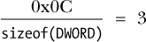
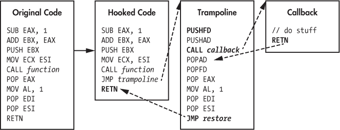

## **8**

**在游戏中操控控制流**


强制一个游戏执行外部代码确实很强大，但如果你能改变一个游戏执行自身代码的方式呢？如果你能强迫游戏绕过绘制战争迷雾的代码，欺骗它让敌人透过墙壁变得可见，或者操控它传递给函数的参数呢？*控制流操控*让你正是可以做到这一点，通过拦截代码执行并监控、修改或阻止它，来改变一个进程的行为。

有很多方法可以操控进程的控制流，但几乎所有方法都需要修改进程的汇编代码。根据你的目标，你需要完全移除进程中的代码（这叫做*NOP*）或者强迫进程将执行重定向到注入的函数（这叫做*钩子*）。在本章的开头，你将学习 NOP、几种类型的钩子以及其他控制流操控技巧。一旦我解释了基础知识，我将展示如何将这些原则应用到常见的游戏库，如 Adobe AIR 和 Direct3D。

打开本书资源文件中的 *GameHackingExamples/Chapter8_ControlFlow* 目录，查看下一节的完整示例代码和 “钩子重定向游戏执行” 在 153 页的内容。

### **使用 NOP 移除不需要的代码**

第七章描述了如何向游戏中注入新代码，但相反——从游戏中移除代码——也同样有用。一些黑客技术要求你停止某些游戏原始代码的执行，为了做到这一点，你必须将其移除。消除游戏进程中的代码的一种方法是 NOP 操作，这涉及用 NOP 指令覆盖原始的 x86 汇编代码。

#### ***何时使用 NOP***

想象一个游戏，它无法显示隐形敌人的血条。很难看到隐形敌人接近，如果至少能看到他们的血条，你在战斗中就能获得巨大的优势。绘制血条的代码通常看起来像列表 8-1。

```
for (int i = 0; i < creatures.size(); i++) {
    auto c = creatures[i];
    if (c.isEnemy && c.isCloaked) continue;
    drawHealthBar(c.healthBar);
}
```

*列表 8-1：* `drawCreatureHealthBarExample()` *函数中的循环*

在绘制血条时，一个有隐形生物的游戏可能会使用一个 `for` 循环来检查屏幕范围内的生物是否隐形。如果一个敌人不是隐形的，循环会调用某个函数（本例中是 `drawHealthBar()`）来显示敌人的血条。

给定源代码，你可以通过简单地移除 `if (c.isEnemy && c.isCloaked) continue;` 来强迫游戏绘制隐形敌人的血条。但作为一个游戏黑客，你只有汇编代码，而不是源代码。当简化时，列表 8-1 翻译后的汇编代码看起来像下面的伪代码：

```
  startOfLoop:                        ; for
      MOV i, 0                        ; int i = 0
      JMP condition                   ; first loop, skip increment
  increment:
      ADD i, 1                        ; i++
  condition:
      CMP i, creatures.Size()         ; i < creatures.size()
      JNB endOfLoop                   ; exit loop if i >= creatures.size()
  body:
      MOV c, creatures[i]             ; auto c = creatures[i]
      TEST c.isEnemy, c.isEnemy       ; if c.isEnemy
      JZ drawHealthBar                ; draw bar if c.isEnemy == false
      TEST c.isCloaked, c.isCloaked   ; && c.isCloaked
      JZ drawHealthBar                ; draw bar if c.isCloaked == false
➊     JMP increment                   ; continue
  drawHealthBar:
      CALL drawHealthBar(c.healthBar) ; drawHealthBar(c.healthBar)
      JMP increment                   ; continue
  endOfLoop:
```

为了让游戏无论敌人是否隐形都能绘制所有敌人的血条，你需要移除在 `c.isEnemy && c.isCloaked` 为 `true` 时执行的 `JMP increment` 指令 ➊。不过，在汇编中，用不执行任何操作的指令替换不需要的代码比删除代码更容易。这就是 NOP 指令的作用。由于 NOP 是一个字节（0x90），你可以用两个 NOP 指令覆盖两字节的 `JMP increment` 指令。当处理器遇到这些 NOP 指令时，它会跳过这些指令并进入 `drawHealthBar()`，即使 `c.isEnemy && c.isCloaked` 为 `true`。

#### ***如何进行 NOP 操作***

NOP（无操作）一段汇编代码的第一步是使代码所在的内存块可写。虽然同一内存页上的代码在你写入 NOP 指令时仍然可能被执行，但你还需要确保内存仍然是可执行的。你可以通过将内存保护设置为`PAGE_EXECUTE_READWRITE`来同时完成这两个任务。一旦内存得到了适当的保护，你就可以写入 NOP 指令并完成操作。从技术上讲，保持内存可写并不会造成问题，但当你完成操作后，恢复原始的保护设置是一种好的实践。

只要你有适当的设施来写入和保护内存（如第六章所描述），你就可以编写类似于示例 8-2 中显示的函数，将 NOP 指令写入游戏内存。（可以通过打开项目中的 *NOPExample.cpp* 文件来跟随操作。）

```
template<int SIZE>
void writeNop(DWORD address)
{
    auto oldProtection =
        protectMemory<BYTE[SIZE]>(address, PAGE_EXECUTE_READWRITE);

    for (int i = 0; i < SIZE; i++)
        writeMemory<BYTE>(address + i, 0x90);

    protectMemory<BYTE[SIZE]>(address, oldProtection);
}
```

*示例 8-2：正确的 NOP 操作，完整的内存保护*

在这个例子中，`writeNop()` 函数设置了适当的内存保护，写入了与 `SIZE` 相等数量的 NOP 指令，并重新应用了原始的内存保护级别。

`writeNop()` 函数将 NOP 指令的数量作为模板参数传递，因为内存函数需要在编译时使用正确大小的类型。传递一个整数`SIZE`会告诉内存函数在编译时操作一个类型为 `BYTE[SIZE]` 的数组。为了在运行时指定动态大小，只需去掉循环，改为调用 `protectMemory<BYTE>`，并传入 `address` 和 `address + SIZE` 作为参数。只要大小不超过一个页面（实际上，你不应该将一个完整页面做 NOP），这将确保即使内存在页面边界处，它也会被正确保护。

使用你想要放置 NOP 指令的地址以及要放置的 NOP 指令数量来调用此函数：

```
writeNop<2>(0xDEADBEEF);
```

请记住，NOP 指令的数量应与被删除指令的字节大小匹配。这个 `writeNop()` 调用将两条 NOP 指令写入地址 0xDEADBEEF。

**练习 NOP 操作**

如果你还没有，赶紧打开本章示例代码中的*NOPExample.cpp*，玩一玩。你会发现`writeNop()`函数的工作实现和一个有趣的函数`getAddressforNOP()`，它扫描示例程序的内存，以找出 NOP 命令应该放置的位置。

要查看 NOP 命令的实际效果，在 Visual Studio 调试器中运行编译好的 NOP 应用程序，并在`writeNop()`函数的开始和结束处设置断点。当第一个断点被触发时，按下 ALT-8 打开反汇编窗口，在输入框中输入`address`并按回车。这将把你带到 NOP 的目标地址，在那里你将看到完整的汇编代码。按 F5 继续执行，这将触发第二个断点，并允许应用程序放置 NOP 指令。最后，跳回反汇编窗口中的`address`，你将看到代码已被 NOP 替换。

你可以重新调整这段代码做其他有趣的事情。例如，你可能尝试将 NOP 指令放在比较操作上，而不是跳转指令，或者甚至修改跳转的类型或目标地址。

这些和其他替代方法可能有效，但请注意，它们比用 NOP 命令覆盖单个 JMP 指令更容易出错。当修改外部代码时，请尽量减少更改，以最小化错误的可能性。

### **挂钩以重定向游戏执行**

到目前为止，我已经向你展示了如何通过向游戏中添加代码、劫持其线程、创建新线程，甚至从其执行流中移除现有代码来操控游戏。这些方法本身已经非常强大，但当它们结合在一起时，就形成了一种更为强大的操控方法——*挂钩*。挂钩允许你拦截执行的精确分支，并将它们重定向到你编写的注入代码，从而决定游戏接下来应该做什么，且挂钩有多种形式。在本节中，我将教你四种最强大的游戏黑客挂钩方法：调用挂钩、虚拟函数表挂钩、导入地址表挂钩和跳转挂钩。

#### ***调用挂钩***

*调用挂钩*直接修改`CALL`操作的目标，将其指向一段新的代码。在 x86 汇编中，`CALL`操作有几种变体，但挂钩通常只应用于其中一种：*近调用*，它将立即地址作为操作数。

##### **在内存中使用近调用**

在汇编程序中，近调用看起来是这样的：

```
CALL 0x0BADF00D
```

这种近调用由字节 0xE8 表示，因此你可能会假设它在内存中是这样存储的：

```
0xE8 0x0BADF00D
```

或者，当拆分成单个字节并交换字节序时，像这样：

```
0xE8 0x0D 0xF0 0xAD 0x0B
```

但近距离调用在内存中的结构并不像看起来那么简单。近距离调用不会存储被调用函数的绝对地址，而是存储相对于调用之后立即地址的偏移量。由于近距离调用是 5 字节，因此调用之后立即的地址是内存中的 5 字节。基于此，可以按以下方式计算存储的地址：

```
calleeAddress – (callAddress + 5)
```

如果`CALL 0x0BADF00D`位于内存中的 0xDEADBEEF 地址，那么 0xE8 之后的值是这样的：

```
0x0BADF00D – (0xDEADBEEF + 5) = 0x2D003119
```

在内存中，该`CALL`指令看起来是这样的：

```
0xE8 0x19 0x31 0x00 0x2D
```

要挂钩一个近距离调用，首先需要更改 0xE8 之后的偏移量（即小端格式的 0x19 0x31 0x00 0x2D）以指向你的新被调用函数。

##### **挂钩近距离调用**

按照示例 8-2 中展示的相同内存保护规则，你可以这样挂钩一个近距离调用（通过打开*CallHookExample.cpp*来跟随）：

```
  DWORD callHook(DWORD hookAt, DWORD newFunc)
  {
      DWORD newOffset = newFunc - hookAt - 5;

      auto oldProtection =
          protectMemory<DWORD>(hookAt + 1, PAGE_EXECUTE_READWRITE);

      DWORD originalOffset = readMemory<DWORD>(➊hookAt + 1);
      writeMemory<DWORD>(hookAt + 1, newOffset);
      protectMemory<DWORD>(hookAt + 1, oldProtection);

➋     return originalOffset + hookAt + 5;
  }
```

该函数以`CALL`的地址(`hookAt`)和重定向执行的地址(`newFunc`)作为参数，并使用它们来计算调用`newFunc`包含的地址的偏移量。在应用正确的内存保护后，`callHook()`函数将新的偏移量写入`hookAt + 1`的内存 ➊，然后恢复原来的内存保护，计算原始调用的地址 ➋，并将该值返回给调用者。

下面是你可能在游戏破解中实际使用这样的函数的方法：

```
DWORD origFunc = callHook(0xDEADBEEF, (DWORD)&someNewFunction);
```

这将近距离调用挂钩到 0x0BADF00D（位于 0xDEADBEEF），并将其重定向到`someNewFunction`的地址，这就是你的破解程序将执行的代码。调用后，`origFunc`的值将包含 0x0BADF00D。

##### **清理堆栈**

新的被调用函数还必须正确处理堆栈，保存寄存器，并传递正确的返回值。至少，这意味着你的替代函数必须在调用约定和参数数量上与游戏的原始函数匹配。

假设这是原始的完整函数调用，汇编语言如下：

```
PUSH 1
PUSH 456
PUSH 321
CALL 0x0BADF00D 
ADD ESP, 0x0C
```

你可以通过查看函数使用 C++ `__cdecl`调用约定来判断，因为堆栈是由调用者重置的。另外，从堆栈中清除的 0x0C 字节显示有三个参数，你可以通过以下方式计算：



当然，你也可以通过检查推送到堆栈的项数来获取参数数量：有三个`PUSH`命令，每个参数一个。

##### **编写调用钩子**

无论如何，新的被调用函数`someNewFunction`必须遵循`__cdecl`约定，并且有三个参数。以下是新被调用函数的示例框架：

```
DWORD __cdecl someNewFunction(DWORD arg1, DWORD arg2, DWORD arg3)
{

}
```

在 Visual Studio 中，C++ 程序默认使用 `__cdecl` 调用约定，因此从技术上讲，你可以在函数定义中省略它；然而，我发现最好保持详细，这样可以养成具体明确的习惯。还要记住，如果调用者期望返回值，那么你的函数的返回类型也应该匹配。这个示例假设返回类型总是 `DWORD` 或更小。因为这个大小范围内的返回值都会通过 EAX 返回，接下来的示例也会使用 `DWORD` 作为返回类型。

在大多数情况下，钩子通过调用原始函数并将其返回值传递回调用者来完成。下面是这些内容如何组合在一起的示例：

```
typedef DWORD (__cdecl _origFunc)(DWORD arg1, DWORD arg2, DWORD arg3);

_origFunc* originalFunction =
    (_origFunc*)hookCall(0xDEADBEEF, (DWORD)&someNewFunction);

DWORD __cdecl someNewFunction(DWORD arg1, DWORD arg2, DWORD arg3)
{
    return originalFunction(arg1, arg2, arg3);
}
```

这个示例使用 `typedef` 声明一个类型，表示原始函数的原型，并创建一个指向该原始函数的指针。然后 `someNewFunction()` 使用这个指针调用原始函数，传递原始参数并将返回值传递回调用者。

目前，`someNewFunction()` 所做的只是返回到原始函数。但你可以在 `someNewFunction()` 的调用中做任何你想做的事情。你可以修改传递给原始函数的参数，或者拦截并存储有趣的参数以备后用。如果你知道调用者不期望返回值（或者知道如何伪造返回值），你甚至可以忽略原始函数，完全替换、复制或改进其功能，放入新的被调用函数中。一旦你掌握了这项技能，你就可以在游戏的任何部分添加你自己的本地 C 或 C++ 代码。

#### ***VF 表格钩子***

与调用钩子不同，*虚拟函数（VF）表钩子*并不修改汇编代码。相反，它们修改存储在类的 VF 表中的函数地址。（如果你需要复习 VF 表，请参阅《具有虚拟函数的类》章节中的第 75 页）。同一类类型的所有实例共享一个静态的 VF 表，因此 VF 表钩子会拦截对成员函数的所有调用，无论游戏是从哪个类实例调用该函数。这既强大又棘手。

**VF 表格的真相**

为了简化说明，当我说 VF 表钩子可以拦截所有对函数的调用时，我稍微撒了个谎。实际上，只有当虚函数的调用方式让编译器产生某种合理的类型模糊时，VF 表才会被遍历。例如，当通过`inst->function()`调用函数时，VF 表会被遍历。虚函数调用时如果编译器对类型没有疑问，例如`inst.function()`或类似的调用，VF 表则不会被遍历，因为编译器已经知道函数的地址。相反，从一个作用域调用`inst.function()`，如果`inst`是作为引用传入的，那么 VF 表就会被遍历。在你尝试部署 VF 表钩子之前，确保你想要挂钩的函数调用有类型模糊性。

##### **编写 VF 表钩子**

在我们深入探讨如何放置 VF 表钩子之前，我们需要再次讨论那些令人头疼的调用约定。VF 表由类实例用来调用虚成员函数，所有成员函数都将采用`__thiscall`约定。`__thiscall`这个名字来源于成员函数用来引用当前类实例的`this`指针。因此，成员函数会将`this`作为伪参数放置在 ECX 寄存器上。

通过声明一个类作为所有`__thiscall`钩子回调的容器，确实可以匹配`__thiscall`的原型，但我不太倾向于使用这种方法。相反，我发现通过内联汇编来控制数据更容易。让我们看看当你在一个像这样的类上放置 VF 钩子时如何控制数据：

```
class someBaseClass {
    public:
        virtual DWORD someFunction(DWORD arg1) {}
};
class someClass : public someBaseClass {
    public:
        virtual DWORD someFunction(DWORD arg1) {}
};
```

`someBaseClass`类只有一个成员（一个公共虚函数），而`someClass`类继承自`someBaseClass`并重写了`someBaseClass::someFunction`成员。要挂钩`someClass::someFunction`，你需要在 VF 表钩子中复制原型，如清单 8-3 所示（在项目中的*VFHookExample.cpp*文件中查看）。

```
   DWORD __stdcall someNewVFFunction(DWORD arg1)
   { 
➊      static DWORD _this;
        __asm MOV _this, ECX
   }
```

*清单 8-3：VF 表钩子的开始*

这个函数之所以能作为钩子工作，是因为`__thiscall`与`__stdcall`的唯一区别在于前者将`this`传递到 ECX 寄存器。为了调和这一小小的差异，回调函数使用内联汇编（用`__asm`表示）将`this`从 ECX 复制到静态变量➊。由于静态变量实际上初始化为全局变量，因此在执行`MOV _this, ECX`之前，唯一执行的代码是设置栈帧的代码——而这段代码从不接触 ECX。这确保了在执行汇编时，ECX 中的值是正确的。

**注意**

*如果多个线程开始调用相同的 VF 函数，* `someNewVFFunction()` *钩子将会失效，因为* `_this` *可能在一个调用被修改的同时仍然被另一个调用使用。我个人从未遇到过这个问题，因为游戏通常不会在线程之间传递多个关键类的实例，但一个有效的解决方法是将* `_this` *存储在线程本地存储中，从而确保每个线程都有自己的副本。*

在返回之前，VF 表回调还必须恢复 ECX，以保持与 `__thiscall` 调用约定一致。以下是这个过程的具体操作：

```
DWORD __stdcall someNewVFFunction(DWORD arg1)
{
    static DWORD _this;
    __asm MOV _this, ECX

    // do game modifying stuff here

 __asm ➊MOV ECX, _this
}
```

在执行一些游戏破解代码之后，这个版本的函数 `someNewVFFunction()` 使用反向版本的第一个 `MOV` 指令来恢复 ECX ➊，该指令来自 Listing 8-3。

然而，与 `__cdecl` 函数不同的是，你不应该仅使用函数指针和 `typedef`（如同在调用钩子中那样）从纯 C++ 调用使用 `__thiscall` 调用约定的函数。当从 VF 表钩子中调用原始函数时，必须使用内联汇编——这是确保正确传递数据（特别是 `_this`）的唯一方法。例如，以下是如何继续构建 `someNewVFFunction()` 钩子：

```
   DWORD __stdcall someNewVFFunction(DWORD arg1)
   {
       static DWORD _this, _ret;
       __asm MOV _this, ECX

       // do pre-call stuff here

       __asm {
           PUSH arg1
           MOV ECX, _this
➊          CALL [originalVFFunction]
➋          MOV _ret, EAX
       }

       // do post-call stuff here

➌      __asm MOV ECX, _this
       return _ret;
   }
```

现在，`someNewVFFunction()` 将 `this` 存储在 `_this` 变量中，允许一些代码执行，调用被钩住的原始游戏函数 ➊，将该函数的返回值存储在 `_ret` ➋，然后允许更多代码执行，恢复 `this` 到 ECX ➌，并返回存储在 `_ret` 中的值。被调用者负责清理 `__thiscall` 调用的栈，因此与调用钩子不同，推入的参数无需移除。

**注意**

*如果你想在任何时刻移除一个被推入的参数，使用汇编指令* `ADD ESP, 0x4` *，因为一个参数占 4 字节。*

##### **使用 VF 表钩子**

在确定了调用约定并建立了基本的回调框架后，是时候进入有趣的部分了：真正使用 VF 表钩子。每个类实例的第一个成员是指向该类 VF 表的指针，因此设置 VF 表钩子只需要类实例的地址和要钩住的函数索引。通过这两条信息，你只需编写少量代码就能设置钩子。以下是一个示例：

```
DWORD hookVF(DWORD classInst, DWORD funcIndex, DWORD newFunc)
{
    DWORD VFTable = ➊readMemory<DWORD>(classInst);
    DWORD hookAt = VFTable + funcIndex * sizeof(DWORD);

    auto oldProtection =
        protectMemory<DWORD>(hookAt, PAGE_READWRITE);
    DWORD originalFunc = readMemory<DWORD>(hookAt);
    writeMemory<DWORD>(hookAt, newFunc);
    protectMemory<DWORD>(hookAt, oldProtection);

    return originalFunc;
}
```

`hookVF()` 函数通过读取类实例的第一个成员 ➊ 来找到 VF 表，并将其存储在 `VFTable` 中。由于 VF 表只是一个 `DWORD` 大小地址的数组，这段代码通过将函数在 VF 表中的索引（本例中的 `funcIndex`）乘以 `DWORD` 的大小，即 4，再将结果加到 VF 表的地址上，从而找到函数的地址。之后，`hookVF()` 的作用类似于调用钩子：它通过设置适当的保护确保内存可访问，存储原始函数地址以便后续使用，写入新的函数地址，最后恢复原始的内存保护。

你通常会钩住游戏实例化的类的 VF 表，而像 `hookVF()` 这样的函数调用，钩住 VF 表看起来是这样的：

```
DWORD origVFFunction =
    hookVF(classInstAddr, 0, (DWORD)&someNewVFFunction);
```

像往常一样，你需要提前找到 `classInstAddr` 和 `funcIndex` 参数。

在一些非常小众的情况下，VF 表钩子是有用的，而找到正确的类指针和函数可能非常困难。考虑到这一点，我不会展示一些牵强的使用案例，而是会在“将跳转钩子和 VF 钩子应用于 Direct3D”的 第 175 页 中回到 VF 表钩子，一旦我讨论了其他类型的钩子。

如果你想在阅读更多内容之前先玩一下 VF 钩子，可以在本书资源文件中的示例类里添加新的虚拟函数，并练习钩住它们。你甚至可以创建一个从 `someBaseClass` 派生的第二个类，并在其虚拟表上放置一个钩子，展示如何在两个继承自相同基类的类上拥有两个完全独立的 VF 钩子。

#### ***IAT 钩子***

IAT 钩子实际上是通过替换特定类型的 VF 表中的函数地址来工作的，这种表被称为 *导入地址表（IAT）*。每个进程中加载的模块都包含一个 IAT，在其 PE 头部。一个模块的 IAT 保存了该模块依赖的所有其他模块的列表，以及该模块使用的每个依赖项中的函数列表。可以将 IAT 看作是一个 API 调用彼此的查找表。

当模块被加载时，它的依赖项也会被加载。依赖项加载是一个递归过程，直到所有模块的所有依赖项都被加载为止。当每个依赖项被加载时，操作系统会找到被依赖模块所使用的所有函数，并用函数地址填充其 IAT 中的空白位置。然后，当模块调用依赖项中的某个函数时，它会通过从 IAT 中解析函数地址来执行该调用。

##### **为了可移植性付出的代价**

函数地址总是从 IAT 中实时解析出来的，所以钩住 IAT 类似于钩住 VF 表。由于函数指针存储在 IAT 中并与其实际名称一起出现，所以不需要进行逆向工程或内存扫描；只要你知道你想钩住的 API 的名称，就可以钩住它！此外，IAT 钩子使你可以在模块特定的基础上轻松钩住 Windows API 调用，从而允许你的钩子仅拦截来自游戏主模块的 API 调用。

然而，这种可移植性是有代价的；放置 IAT 钩子的代码比你迄今所见的要复杂得多。首先，你需要定位游戏主模块的 PE 头部。由于 PE 头是任何二进制文件中的第一个结构，你可以在每个模块的基地址处找到它，如 Listing 8-4 中所示（可以在项目的 *IATHookExample.cpp* 文件中跟随）。

```
DWORD baseAddr = (DWORD)GetModuleHandle(NULL);
```

*Listing 8-4：获取模块的基地址*

一旦你找到了基地址，就必须验证 PE 头部是否有效。这项验证非常重要，因为一些游戏会在加载后通过混淆 PE 头部中的非必要部分来防止这类钩子。有效的 PE 头部之前是一个 DOS 头部，表示该文件是一个 DOS MZ 可执行文件；DOS 头部的标识值为 0x5A4D。DOS 头部中的一个成员`e_lfanew`指向可选头部，后者包含诸如代码大小、版本号等信息，并由魔术值 0x10B 标识。

Windows API 有 PE 结构`IMAGE_DOS_HEADER`和`IMAGE_OPTIONAL_HEADER`，分别对应 DOS 头部和可选头部。你可以通过代码如 Listing 8-5 来验证 PE 头部。

```
auto dosHeader = pointMemory<IMAGE_DOS_HEADER>(baseAddr);
if (dosHeader->e_magic != 0x5A4D)
    return 0;

auto optHeader =
    pointMemory<IMAGE_OPTIONAL_HEADER>(baseAddr + dosHeader->e_lfanew + 24);
if (optHeader->Magic != 0x10B)
    return 0;
```

*Listing 8-5: 确认 DOS 头部和可选头部有效*

对`pointMemory()`的调用创建了两个指向需要检查的头部的指针。如果任何一个`if()`语句返回`0`，则表示对应的头部的魔术数字错误，意味着 PE 头部无效。

从汇编中对 IAT 的引用是硬编码的，这意味着汇编引用不会遍历 PE 头部来定位 IAT。相反，每个函数调用都有一个静态位置，指示在哪里可以找到函数地址。这意味着通过覆盖 PE 头部来声明没有导入是防止 IAT 钩子的可行方法，一些游戏就采取了这种保护措施。

为了应对这种情况，你还需要确保游戏的 IAT 仍然存在。Listing 8-6 展示了如何在 Listing 8-5 中的代码中添加此检查。

```
auto IAT = optHeader->DataDirectory[IMAGE_DIRECTORY_ENTRY_IMPORT];
if (IAT.Size == 0 || IAT.VirtualAddress == 0)
    return 0;
```

*Listing 8-6: 检查 IAT 是否实际存在*

PE 头部包含许多部分，用于存储应用程序代码、嵌入资源、重定位等信息。Listing 8-6 中的代码特别关注数据段——正如你可能猜到的，它存储了许多不同类型的数据。每种类型的数据存储在自己的目录中，`IMAGE_OPTIONAL_HEADER`中的`DataDirectory`成员是一个目录头数组，描述了数据段中每个目录的大小和虚拟地址。Windows API 定义了一个常量`IMAGE_DIRECTORY_ENTRY_IMPORT`，它恰好是 IAT 头部在`DataDirectory`数组中的索引。

因此，这段代码使用`optHeader->DataDirectory[IMAGE_DIRECTORY_ENTRY_IMPORT]`来解析 IAT 的头部，并检查该头部的`Size`和`VirtualAddress`是否非零，基本上确认了其存在性。

##### **遍历 IAT**

一旦你确认 IAT 仍然完好无损，你就可以开始遍历它了，这也是 IAT 钩子开始变得复杂的地方。IAT 是一个由称为*导入描述符*的结构体数组组成。每个依赖项都有一个导入描述符，每个导入描述符指向一个称为*thunks*的结构体数组，每个 thunk 代表从依赖项中导入的函数。

幸运的是，Windows API 通过`IMAGE_IMPORT_DESCRIPTOR`和`IMAGE_THUNK_DATA`结构分别暴露了导入描述符和 thunks。由于这些结构是预定义的，你不必自己创建它们，但这并没有使遍历 IAT 的代码更加简洁。要理解我的意思，看看列表 8-7，它是基于列表 8-4 至 8-6 构建的。

```
   auto impDesc =
       pointMemory<IMAGE_IMPORT_DESCRIPTOR>(➊baseAddr + IAT.VirtualAddress);

➋ while (impDesc->FirstThunk) {
➌     auto thunkData =
          pointMemory<IMAGE_THUNK_DATA>(baseAddr + impDesc->OriginalFirstThunk);
      int n = 0;
➍     while (thunkData->u1.Function) {
          // the hook happens in here
          n++;
          thunkData++;
      }
      impDesc++;
   }
```

*列表 8-7：遍历 IAT 以查找函数*

请记住，导入描述符是相对于 PE 头部的开始位置存储的，代码通过将模块的基地址加到 IAT 目录头部找到的虚拟地址 ➊，创建一个指针`impDesc`，指向模块的第一个导入描述符。

导入描述符存储在一个顺序数组中，若某个描述符的`FirstThunk`成员为`NULL`，则表示数组的结束。知道这一点后，代码使用`while`循环 ➋，直到`impDesc->FirstThunk`为`NULL`，每次迭代时通过执行`impDesc++`来递增描述符。

对于每个导入描述符，代码会创建一个指针，名为`thunkData` ➌，指向描述符中的第一个 thunk。通过一个熟悉的循环，代码会遍历 thunks ➍，直到找到一个`Function`成员为`NULL`的 thunk。该循环还使用一个整数`n`来跟踪当前的 thunk 索引，因为在放置钩子时，索引非常重要。

##### **放置 IAT 钩子**

从这里开始，放置钩子只需要找到正确的函数名称并替换函数地址。你可以在嵌套的`while`循环中找到该名称，如列表 8-8 所示。

```
char* importFunctionName =
    pointMemory<char>(baseAddr + (DWORD)thunkData->u1.AddressOfData + 2);
```

*列表 8-8：查找函数名称*

每个 thunk 的函数名称存储在`thunkData->u1.AddressOfData + 2`字节处，因此你可以将该值加到模块的基地址上，以定位内存中的函数名称。

获取到函数名称的指针后，使用`strcmp()`来检查它是否为目标函数，方法如下：

```
if (strcmp(importFuncName, funcName) == 0) {
    // the final step happens in here
}
```

一旦你通过其名称找到了目标函数，你只需将函数地址覆盖为你自己函数的地址。与函数名称不同，函数地址存储在每个导入描述符开头的数组中。使用`n`从 thunk 循环中，你最终可以设置钩子，如列表 8-9 所示。

```
   auto vfTable = pointMemory<DWORD> (baseAddr + impDesc->FirstThunk);
   DWORD original = vfTable[n];

➊ auto oldProtection = protectMemory<DWORD>((DWORD)&vfTable[n], PAGE_READWRITE);
➋ vfTable[n] = newFunc;
   protectMemory<DWORD>((DWORD)&vfTable[n], oldProtection);
```

*列表 8-9：查找函数地址*

这段代码通过将第一个 thunk 的地址加到模块基地址来定位当前描述符的 VF 表。VF 表是一个函数地址数组，因此代码使用`n`变量作为索引来定位目标函数地址。

一旦找到地址，列表 8-9 中的代码就像典型的 VF 钩取一样工作：它存储原始函数地址，将 VF 表中索引`n`的保护设置为`PAGE_READWRITE` ➊，将新的函数地址插入到 VF 表中 ➋，最后恢复旧的保护状态。

如果你将列表 8-4 到 8-9 的代码拼接起来，最终的 IAT 钩取函数看起来就像列表 8-10。

```
DWORD hookIAT(const char* funcName, DWORD newFunc)
                 {
    DWORD baseAddr = (DWORD)GetModuleHandle(NULL);
    auto dosHeader = pointMemory<IMAGE_DOS_HEADER>(baseAddr);
    if (dosHeader->e_magic != 0x5A4D)
        return 0;

    auto optHeader =
        pointMemory<IMAGE_OPTIONAL_HEADER>(baseAddr + dosHeader->e_lfanew + 24);
    if (optHeader->Magic != 0x10B)
        return 0;

    auto IAT =
        optHeader->DataDirectory[IMAGE_DIRECTORY_ENTRY_IMPORT];
    if (IAT.Size == 0 || IAT.VirtualAddress == 0)
        return 0;

    auto impDesc =
        pointMemory<IMAGE_IMPORT_DESCRIPTOR>(baseAddr + IAT.VirtualAddress);

    while (impDesc->FirstThunk) {
        auto thunkData =
            pointMemory<IMAGE_THUNK_DATA>(baseAddr + impDesc->OriginalFirstThunk);
        int n = 0;
        while (thunkData->u1.Function) {
            char* importFuncName = pointMemory<char>
                (baseAddr + (DWORD)thunkData->u1.AddressOfData + 2);
            if (strcmp(importFuncName, funcName) == 0) {
                auto vfTable = pointMemory<DWORD>(baseAddr + impDesc->FirstThunk);
                DWORD original = vfTable[n];
                auto oldProtection =
                    protectMemory<DWORD>((DWORD)&vfTable[n], PAGE_READWRITE);
                vfTable[n] = newFunc;
                protectMemory<DWORD>((DWORD)&vfTable[n], oldProtection);
                return original;
            }
            n++;
            thunkData++;
        }
        impDesc++;
    }
}
```

*列表 8-10：完整的 IAT 钩取函数*

这是我们到目前为止编写的最复杂的代码，在页面压缩显示时非常难以阅读。如果你还没完全理解它的作用，建议在继续之前先学习本书资源文件中的示例代码。

##### **使用 IAT 钩取与游戏线程同步**

使用列表 8-10 中的代码，钩取任何 Windows API 函数都变得像知道函数名和正确的原型一样简单。`Sleep()` API 是游戏黑客中常用的钩取 API，因为机器人可以通过钩取`Sleep()`来与游戏的主循环同步线程。

**与线程同步**

你的注入代码必然需要与游戏的主循环同步，否则它将无法正常工作。例如，当你读写大于 4 字节的数据时，如果不同步，游戏可能会同时读写这些数据。这时你就会干扰到游戏，反之亦然，导致各种竞态条件和数据损坏问题。同样，如果你尝试从自己的线程调用游戏函数，如果该函数不是线程安全的，可能会导致游戏崩溃。

由于 IAT 钩取是对 PE 头的线程安全修改，它们可以从任何线程进行设置。通过将钩子放置在游戏主循环之前或之后调用的函数上，你可以有效地与游戏的主线程同步。你需要做的就是放置钩子，并在钩子回调中执行任何线程敏感的代码。

下面是使用`hookIAT()`钩取`Sleep()` API 的一种方式：

```
VOID WINAPI newSleepFunction(DWORD ms)
{
    // do thread-sensitive things
    originalSleep(ms);
}

typedef VOID (WINAPI _origSleep)(DWORD ms);
_origSleep* originalSleep =
    (_origSleep*)hookIAT("Sleep", (DWORD)&newSleepFunction);
```

下面是为什么这能奏效的原因。在游戏的主循环结束时，它可能会调用`Sleep()`来休息，直到准备好绘制下一帧。由于处于休眠状态，你可以安全地执行任何操作而不必担心同步问题。有些游戏可能不会这样做，或者它们可能从多个线程调用`Sleep()`，这些游戏就需要使用不同的方法。

一个更具可移植性的替代方法是钩住`PeekMessageA()` API 函数，因为游戏通常会在等待输入时从主循环调用该函数。然后，你的机器人可以在`PeekMessageA()`钩子内进行线程敏感的操作，确保它们从游戏的主线程中执行。你也可能希望你的机器人使用这种方法钩住`send()`和`recv()` API 函数，因为拦截这些函数可以相对简单地创建一个数据包嗅探器。

#### ***跳转钩子***

*跳转钩子*允许你在没有分支代码可以操作的地方钩住代码。跳转钩子用一个无条件跳转替换被钩住的代码，跳转到一个*弹跳函数*。当跳转被触发时，弹跳函数会保存所有当前的寄存器和标志值，调用你选择的回调函数，恢复寄存器，恢复标志，执行被钩住的代码，最后跳回钩子下方的代码。这一过程在图 8-1 中展示。



*图 8-1：一个跳转钩子*

原始代码展示了你在游戏中可能遇到的一些未修改的汇编代码，而钩住的代码展示了跳转钩子钩住后该汇编代码的样子。弹跳函数框展示了一个汇编语言的示例弹跳函数，而回调函数则表示你通过钩子试图执行的代码。在原始代码中，汇编代码是从上到下执行的。在钩住的代码中，要从`SUB EAX,1`指令跳到`RETN`指令，执行路径必须按照虚线箭头所示的路径进行。

**注意**

*如果你的回调代码很简单，它可以直接集成到弹跳函数中。并且并不总是需要存储和恢复寄存器和标志，但这样做是良好的实践。*

##### **放置跳转**

无条件跳转的字节码与近距离调用类似，但第一个字节是 0xE9 而不是 0xE8。（有关更多信息，请参阅《在内存中使用近距离调用》第 153 页。）在图 8-1 中，无条件跳转`JMP trampoline`替换了以下四个操作：

```
POP EAX
MOV AL, 1
POP EDI
POP ESI
```

在这种情况下，你需要替换多个连续操作，以适应无条件跳转的 5 字节大小。你可能会遇到需要替换的操作（或操作）的大小大于 5 字节的情况。当这种情况发生时，用 NOP 指令替换剩余的字节。

现在，让我们来看一下如何替换这些操作。清单 8-11 展示了如何放置跳转钩子的代码。

```
   DWORD hookWithJump(DWORD hookAt, DWORD newFunc, int size)
   {
       if (size > 12) // shouldn't ever have to replace 12+ bytes
           return 0;
➊      DWORD newOffset = newFunc - hookAt - 5;

       auto oldProtection =
           protectMemory<DWORD[3]>(hookAt + 1,PAGE_EXECUTE_READWRITE);
➋      writeMemory<BYTE>(hookAt, 0xE9);
➌      writeMemory<DWORD>(hookAt + 1, newOffset);
       for (unsigned int i = 5; i < size; i++)
           writeMemory<BYTE>(hookAt + i, 0x90);
       protectMemory<DWORD[3]>(hookAt + 1, oldProtection);

       return hookAt + 5;
   }
```

*清单 8-11：如何设置跳转钩子*

该函数接受钩子的地址、回调函数的地址和要覆盖的内存大小（以字节为单位）作为参数。首先，它计算钩子位置和跳板之间的偏移量，并将结果存储在 `newOffset` ➊ 中。接下来，将 `PAGE_EXECUTE_READWRITE` 权限应用于需要修改的内存。然后将无条件跳转指令（0xE9） ➋ 和回调函数的地址 ➌ 写入内存，并且使用 `for` 循环将 NOP 指令（0x90）写入任何被弃用的字节。旧的保护被重新应用后，`hookWithJump()` 返回到原始地址。

请注意，`hookWithJump()` 函数确保在放置跳转之前，`size` 不会超过 12。这个检查很重要，因为跳转占用 5 字节，这意味着如果前四个命令都是单字节，它最多可以替换五个命令。如果前四个命令是单字节的，第五个命令需要超过 8 字节才会触发 `if (size > 12)` 子句。由于 9 字节的操作非常罕见，因此 12 是一个安全但灵活的限制。设置这个限制可以避免各种 bug，尤其是当你的机器人动态检测 `size` 参数时。如果机器人出错并传递了 `size` 为 `500,000,000`，例如，这个检查将阻止你把整个宇宙做 NOP 操作。

##### **编写跳板函数**

使用清单 8-11 中的函数，你可以复制图 8-1 中显示的钩子，但首先你需要按以下方式创建跳板函数：

```
   DWORD restoreJumpHook = 0;
   void __declspec(naked) myTrampoline()
   {
      __asm {
➊         PUSHFD
➋         PUSHAD
➌         CALL jumpHookCallback
➍         POPAD
➎         POPFD
➏         POP EAX
          MOV AL, 1
          POP EDI
➐         POP ESI
➑         JMP [restoreJumpHook]
      }
  }
```

就像在图 8-1 中描述的跳板一样，这个跳板会存储当前所有标志 ➊ 和寄存器值 ➋，调用回调函数 ➌，恢复寄存器 ➍，恢复标志 ➎，执行被钩子替换的代码 ➏ 和 ➐，最后跳回到原始代码的跳转位置下方并执行 NOP 操作 ➑。

**注意**

*为了确保编译器不会在跳板中自动生成任何额外的代码，请始终使用* `__declspec(naked)` *约定声明跳板。*

##### **完成跳转钩子**

一旦创建了跳板，定义回调函数并按如下方式设置钩子：

```
void jumpHookCallback() {
    // do stuff
}
restoreJumpHook = hookWithJump(0xDEADBEEF, &myTrampoline, 5);
```

最后，在 `jumpHookCallback()` 函数内部，执行依赖于钩子的代码。如果你的代码需要读取或写入在钩子执行时的寄存器值，那么你很幸运。`PUSHAD` 命令会按照 EAX、ECX、EDX、EBX、原始 ESP、EBP、ESI 和 EDI 的顺序将寄存器值压入栈中。跳板会在调用 `jumpHookCallback()` 之前直接调用 `PUSHAD`，因此你可以将寄存器值作为参数引用，像这样：

```
void jumpHookCallback(DWORD EDI, DWORD ESI, DWORD EBP, DWORD ESP,
                      DWORD EBX, DWORD EDX, DWORD ECX, DWORD EAX) {
    // do stuff
}
restoreJumpHook = hookWithJump(0xDEADBEEF, &myTrampoline, 5);
```

由于跳板使用 `POPAD` 从栈中直接恢复寄存器的值，因此你对参数所做的任何修改将在寄存器从栈中恢复时应用到实际寄存器。

像 VF 表钩子一样，跳转钩子很少需要使用，而且用一个简单的例子来模拟它们可能会比较棘手。为了帮助你理解它们，我将在《将跳转钩子和 VF 钩子应用于 Direct3D》一文中，展示一个现实世界中的实际应用案例，内容位于第 175 页。

**专业 API 钩子库**

有一些预写的钩子库，比如微软的 Detours 和 MadCHook，仅使用跳转钩子。这些库可以自动检测并跟踪其他钩子，知道需要替换多少条指令，并且为你生成跳板函数。这些库之所以能够做到这一点，是因为它们理解如何反汇编并分析汇编指令，以确定指令长度、跳转目标等。如果你需要使用如此强大的钩子功能，使用这些库可能比自己编写更为合适。

### **将调用钩子应用于 Adobe AIR**

Adobe AIR 是一个开发框架，可以用来在类似 Adobe Flash 的环境中制作跨平台游戏。AIR 是在线游戏中常用的框架，因为它允许开发者使用一种叫做 ActionScript 的多功能高级语言编写跨平台代码。ActionScript 是一种解释型语言，AIR 在虚拟机中运行这些代码，这使得直接钩住游戏特定的代码变得不可行。相反，钩住 AIR 本身会更容易。

本节的示例代码可以在本书的源文件中找到，路径为 *GameHackingExamples/Chapter8_AdobeAirHook*。这些代码来自我以前的一个项目，适用于运行 *Adobe AIR.dll* 版本 3.7.0.1530 的任何游戏。我也让它在其他版本上运行过，但不能保证它能在更新或更旧的版本上正常工作，因此请将此作为案例研究来参考。

#### ***访问 RTMP 金矿***

*实时消息传输协议（RTMP）* 是一种基于文本的网络协议，ActionScript 用它来序列化并通过网络发送整个对象。RTMP 运行在 *超文本传输协议（HTTP）* 之上，而安全版本的 RTMPS 则运行在 *安全的 HTTP（HTTPS）* 之上。RTMPS 使游戏开发者能够通过安全连接轻松发送和接收整个对象实例，几乎没有复杂的操作，因此成为了在 AIR 上运行的游戏的首选网络协议。

**注意**

*通过 RTMP/RTMPS 发送的数据是通过* Action Message Format (AMF)* 序列化的，解析 AMF 数据包超出了本书的范围。你可以在网上搜索 “AMF3 Parser”，你会找到很多可以解析 AMF 数据包的代码。*

通过 RTMP 和 RTMPS 发送的数据非常丰富。这些数据包包含了关于对象类型、名称和数值的信息。这是一座金矿。如果你能够实时拦截这些数据，你就能即时响应游戏状态的变化，无需从内存中读取信息就能看到大量关键数据，甚至能发现一些你可能从未意识到存在的数据。

一段时间前，我正在开发一个需要大量洞察游戏状态的工具。从内存中直接获取如此大量的数据将是极其困难的，甚至是不可能的。经过一些研究，我意识到游戏使用 RTMPS 与服务器进行通信，这促使我开始挖掘这个金矿。

由于 RTMPS 是加密的，我知道我必须在获取任何可用数据之前以某种方式钩取 AIR 使用的加密函数。经过在线搜索，我找到了一个名为 airlog 的小工具的源代码，它是由另一位游戏黑客创建的，和我一样，他也在尝试记录通过 RTMPS 发送的数据包。虽然这个工具钩取了我所需的确切函数，但代码已经过时、杂乱无章，最糟糕的是，它在我尝试钩取的 AIR 版本上不起作用。

但这并不意味着它没有用。airlog 不仅钩取了我需要的两个函数，而且它还通过扫描 Adobe AIR 库中的某些字节模式来定位它们。然而，这些字节模式已经三年没更新了，所以它们不再有效。Adobe AIR 的新版本发生了足够的变化，以至于汇编字节不再相同。字节的差异对 airlog 中的代码来说是个问题，但对我来说却不是。

在内联汇编块中，你可以使用以下函数调用来指定原始字节：

```
_emit BYTE
```

如果你将`BYTE`替换为例如`0x03`，代码将以一种将`0x03`视为汇编代码中的字节的方式编译，无论这是否有意义。利用这个技巧，我将字节数组重新编译成了汇编代码。代码没有执行任何操作，也不是为了执行；使用这个技巧只是让我能够通过 OllyDBG 连接到我的虚拟应用程序，并检查字节，这些字节被方便地呈现为清晰的反汇编。

由于这些字节表示了我所需函数周围的代码，它们的反汇编也是如此。代码相当标准，看起来不太可能发生变化，所以我将注意力转向了常量。代码中有一些立即值作为命令中的偏移量传递。考虑到这些常量变化的频率，我重新编写了 airlog 的模式匹配算法以支持通配符，更新了模式以将任何常量视为通配符，然后运行匹配。经过一些对模式的调整和对重复搜索结果的挖掘，我找到了我想钩取的函数。我将它们适当地命名为`encode()`和`decode()`，并开始开发一个类似于 airlog 的工具——但更加完善。

#### ***钩取 RTMPS encode()函数***

我发现`encode()`函数用于加密传出数据包的数据显示，它是一个非虚拟的`__thiscall`，意味着它是通过近距离调用的。此外，调用发生在一个循环中。整个循环的代码如下所示：Listing 8-12，直接取自 OllyDBG 的反汇编窗格。

```
   loop:
       MOV EAX, [ESI+3C58]
       SUB EAX,EDI
       PUSH EAX
➊      LEA EAX, [ESI+EDI+1C58]
       PUSH EAX
       MOV ECX,ESI
➋      CALL encode
       CMP EAX,-1
➌      JE SHORT endLoop
       ADD EDI,EAX
➍      CMP EDI, [ESI+3C58]
       JL loop
   endLoop:
```

*Listing 8-12: `encode()`循环*

通过一些分析和来自 airlog 的指导，我确定了在➊调用的`encode()`函数接受一个字节数组和缓冲区长度（分别称为`buffer`和`size`）作为参数。当函数失败时返回`-1`，否则返回`size`。该函数以 4,096 字节为单位操作，这就是为什么它会在一个循环中执行的原因。

转换为更易读的伪代码后，调用`encode()`的循环看起来像这样（数字表示在 Listing 8-12 中相关汇编指令的位置）：

```
for (EDI = 0; EDI < ➍[ESI+3C58]; ) {
    EAX = ➋encode(➊&[ESI+EDI+1C58], [ESI+3C58] - EDI);
    if (EAX == -1) ➌break;
    EDI += EAX;
}
```

我并不关心`encode()`做了什么，但我需要它循环处理的整个缓冲区，而钩住`encode()`是我获取这个缓冲区的手段。通过查看 Listing 8-12 中的实际循环，我知道调用对象实例的完整缓冲区存储在 ESI+0x1C58 处，完整的大小存储在 ESI+0x3C58 处，且 EDI 寄存器包含循环计数器。我在这些信息的基础上设计了钩子，最终创建了一个由两部分组成的钩子。

我的钩子的第一部分是一个`reportEncode()`函数，它在第一次循环迭代时记录整个缓冲区。下面是完整的`reportEncode()`函数：

```
DWORD __stdcall reportEncode(
    const unsigned char* buffer,
    unsigned int size,
    unsigned int loopCounter)
{
    if (loopCounter == 0)
        printBuffer(buffer, size);
    return origEncodeFunc;
}
```

该函数接受`buffer`、`size`和`loopCounter`作为参数，并返回我称之为`encode()`的函数的地址。然而，在获取该地址之前，我的钩子的第二部分，`myEncode()`函数，会完成所有的脏活，获取`buffer`、`size`和`loopCounter`，具体如下：

```
void __declspec(naked) myEncode()
{
    __asm {
        MOV EAX, DWORD PTR SS:[ESP + 0x4]     // get buffer
        MOV EDX, DWORD PTR DS:[ESI + 0x3C58]  // get full size
        PUSH ECX           // store ecx
        PUSH EDI           // push current pos (loop counter)
        PUSH EDX           // push size
        PUSH EAX           // push buffer
        CALL reportEncode  // report the encode call
        POP ECX            // restore ecx
        JMP EAX            // jump to encode
    }
}
```

`myEncode()`函数是一个纯汇编函数，它通过一个近距离调用钩子替代了原始的`encode()`函数调用。在将 ECX 寄存器保存到堆栈后，`myEncode()`获取`buffer`、`size`和`loopCounter`，并将它们传递给`reportEncode()`函数。调用完`reportEncode()`函数后，`myEncode()`恢复 ECX 寄存器并直接跳转到`encode()`，使得原始函数得以执行，并优雅地返回到循环中。

由于`myEncode()`在执行时会清除它使用的所有堆栈数据，因此在`myEncode()`运行后，堆栈仍然保持原始参数和返回地址在正确的位置。这就是为什么`myEncode()`直接跳转到`encode()`而不是使用函数调用的原因：堆栈已经设置好了正确的返回地址和参数，因此`encode()`函数会认为一切都像正常一样发生。

#### ***钩住 RTMPS 的 decode()函数***

我命名为`decode()`的函数用于解密传入的数据，它也是一个`__thiscall`，并且在一个循环中被调用。它处理 4,096 字节的块，并以缓冲区和大小作为参数。这个循环要复杂得多，包含多个函数调用、嵌套循环和循环退出，但钩子工作原理与钩住所谓的`encode()`函数类似。增加的复杂性与钩住函数无关，但使得代码难以概括，因此我不会在此展示原始函数。最重要的是，一旦所有复杂性被去除，`decode()`的循环实际上就是`encode()`循环的逆过程。

再次地，我设计了一个由两部分组成的近距离调用钩子。第一部分，`reportDecode()`，如下所示：

```
void __stdcall reportDecode(const unsigned char* buffer, unsigned int size)
{
    printBuffer(buffer, size);
}
```

该函数记录每个通过的数据包。当时我没有循环索引，所以我决定记录每一个部分数据包。

钩子的第二部分，`myDecode()`函数，充当新的调用者并执行所有脏活，具体如下：

```
   void __declspec(naked) myDecode()
   {
       __asm {
           MOV EAX, DWORD PTR SS:[ESP + 0x4] // get buffer
           MOV EDX, DWORD PTR SS:[ESP + 0x8] // get size
           PUSH EDX                          // push size
           PUSH EAX                          // push buffer
➊          CALL [origDecodeFunc]

           MOV EDX, DWORD PTR SS:[ESP + 0x4] // get the buffer

           PUSH EAX                          // store eax (return value)
           PUSH ECX                          // store ecx
           PUSH EAX                          // push size
           PUSH EDX                          // push buffer
           CALL reportDecode                 // report the results now
           POP ECX                           // restore ecx
➋          POP EAX                           // restore eax (return value)
➌          RETN 8                            // return and clean stack
       }
   }
```

我知道缓冲区是原地解密的，这意味着加密的块会在调用`decode()`完成后被解密的块覆盖。这意味着`myDecode()`必须在调用`reportDecode()`函数之前，先调用原始的`decode()`函数 ➊，然后才会返回解码结果。最终，`myDecode()`还需要返回与原始`decode()`函数相同的值，并清理堆栈，最后的`POP` ➋和`RETN` ➌指令处理了这一部分。

#### ***放置钩子***

我遇到的下一个问题是，钩子是针对模块*Adobe AIR.dll*中的代码，而该模块并不是游戏的主模块。由于代码的位置，我需要以不同的方式找到钩子的基地址。此外，鉴于我需要这些钩子在多个不同版本的 Adobe AIR 中工作，我还必须找到每个版本的正确地址。我决定不去收集所有版本的 Adobe AIR，而是从 airlog 的策略中借鉴，决定通过编写一个小型内存扫描器来程序化地定位地址。在编写内存扫描器之前，我需要获取*Adobe AIR.dll*的基地址和大小，以便将内存搜索限制在该区域。

我使用`Module32First()`和`Module32Next()`找到了这些值，具体方法如下：

```
   MODULEENTRY32 entry;
   entry.dwSize = sizeof(MODULEENTRY32);
   HANDLE snapshot = CreateToolhelp32Snapshot(TH32CS_SNAPMODULE, NULL);

   DWORD base, size;
   if (Module32First(snapshot, &entry) == TRUE) {
➊      while (Module32Next(snapshot, &entry) == TRUE) {
           std::wstring binaryPath = entry.szModule;
➋          if (binaryPath.find("Adobe AIR.dll") != std::wstring::npos) {
               size = (DWORD)entry.modBaseSize;
               base = (DWORD)entry.modBaseAddr;
               break;
           }
       }
   }

   CloseHandle(snapshot);
```

这段代码会循环遍历进程中的所有模块，直到找到*Adobe AIR.dll* ➊。当它找到正确的模块条目 ➋ 时，它从中提取`modBaseSize`和`modBaseAddr`属性，然后立即跳出循环。

下一步是找到一个字节序列，我可以用它来识别这些函数。我决定使用每个调用周围的字节码。我还必须确保每个序列是唯一的，同时避免在模式中使用任何常量，以确保代码的可移植性。列表 8-13 显示了我最终得到的字节序列。

```
const char encodeSeq[16] = {
    0x8B, 0xCE,                   // MOV ECX, ESI
    0xE8, 0xA6, 0xFF, 0xFF, 0xFF, // CALL encode
    0x83, 0xF8, 0xFF,             // CMP EAX, -1
    0x74, 0x16,                   // JE SHORT endLoop
    0x03, 0xF8,                   // ADD EDI, EAX
    0x3B, 0xBE};                  // part of CMP EDI, [ESI+0x3C58]
const char decodeSeq[12] = {
    0x8B, 0xCE,                   // MOV ECX, ESI
    0xE8, 0x7F, 0xF7, 0xFF, 0xFF, // CALL decode
    0x83, 0xF8, 0xFF,             // CMP EAX, -1
    0x89, 0x86};                  // part of MOV [ESI+0x1C54], EAX
```

*列表 8-13：`encode()` 和 `decode()` 字节序列*

注意每个模式中的 `CALL` 指令；这些是我命名为 `encode()` 和 `decode()` 的 Adobe AIR 函数的调用。我使用以下函数扫描这些序列：

```
DWORD findSequence(
    DWORD base, DWORD size,
    const char* sequence,
    unsigned int seqLen){
    for (DWORD adr = base; adr <= base + size – seqLen; adr++) {
        if (memcmp((LPVOID)sequence, (LPVOID)adr, seqLen) == 0)
            return adr;
    }
    return 0;
}
```

将 *Adobe AIR.dll* 的内存视为字节数组后，`findSequence()` 函数会查找该字节数组中的某个字节序列作为子集，并返回它找到的第一个匹配项的地址。编写完 `findSequence()` 函数后，找到我需要钩住的 `encode()` 和 `decode()` 的地址变得简单了。这些调用是这样的：

```
DWORD encodeHookAt =
    findSequence(base, size, encodeSeq, 16) + 2;
DWORD decodeHookAt =
    findSequence(base, size, decodeSeq, 12) + 2;
```

由于每个目标调用在其接受的搜索序列中相差 2 个字节，我所需要做的就是定位每个序列并加上 2。然后，最后一步是使用 “调用钩子” 方法在 第 153 页 上放置钩子。

在完成我的钩子后，我能够看到游戏客户端和服务器之间传输的每一块数据。而且，由于 RTMPS 协议发送序列化的 ActionScript 对象，数据本身就像文档一样自说明。每一块信息都有一个变量名。每个变量都是一个描述清晰的对象的成员。每个对象都有一个一致的名称。正如我所说——这简直是个宝藏。

### **将跳转钩子和 VF 钩子应用于 Direct3D**

与我刚刚描述的 Adobe AIR 钩子不同，Direct3D 钩子（微软 DirectX API 的 3D 图形组件）非常常见，并且有着高度的文档支持。Direct3D 在游戏界中无处不在：大多数 PC 游戏都使用这个库，这意味着钩住它为你提供了一种非常强大的方法，用来截取数据并操控多个游戏的图形层。你可以使用 Direct3D 钩子完成许多任务，比如检测隐藏敌人玩家的位置、增强游戏中昏暗环境的光照，或无缝地显示额外的图形信息。有效利用 Direct3D 钩子需要你了解 API，但这本书中有足够的信息帮助你入门。

在本节中，我将为你简要介绍使用 Direct3D 的游戏循环，然后再深入实现 Direct3D 钩子的方法。与我在 Adobe AIR 钩子中所做的详细内部解析和分析背景不同，我将介绍最流行的 Direct3D 钩子方法，因为它有大量文档支持，且被大多数游戏黑客使用。

本书的在线资源包括两个示例代码文件；如果你想跟着一起做，可以现在就找到这些文件。第一部分是一个 Direct3D 9 应用程序示例，供你进行修改，位于 *GameHackingExamples/Chapter8_Direct3DApplication*。第二部分是实际的挂钩代码，位于 *Chapter8_Direct3DHook*。

任何给定时间，都会使用多个版本的 Direct3D，并且有方法可以挂钩每一个版本。在本书中，我将重点讲解如何挂钩 Direct3D 9，因为它是唯一在 Windows XP 上得到支持的常用版本。

**注意**

*尽管 XP 已经结束生命周期，但许多发展中国家的人们仍然将其作为主要的游戏平台。Direct3D 9 支持所有版本的 Windows，并且几乎与其后继版本一样强大，因此许多游戏公司仍然更倾向于使用它，而不是那些不具备强大向后兼容性的更新版本。*

#### ***绘制循环***

让我们直接进入 Direct3D 工作原理的速成课程。在 Direct3D 游戏的源代码中，你会发现一个无限循环，处理输入并渲染图形。这个绘制循环中的每次迭代称为一个 *帧*。如果我们去掉所有多余的代码，仅关注基本骨架的话，我们可以通过以下代码来可视化一个游戏的主循环：

```
int WINAPI WinMain(args)
{
    /* Some code here would be called
       to set up Direct3D and initialize
       the game. Leaving it out for brevity. */
    MSG msg;
    while(TRUE) {
        /* Some code would be here to handle incoming
           mouse and keyboard messages. */
        drawFrame(); // this is the function we care about
    }
    /* Some code here would be called to
       clean up everything before exiting. */
}
```

这个函数是游戏的入口点。简而言之，它初始化游戏，然后进入游戏的主循环。在主循环中，它执行处理用户输入的代码，然后调用 `drawFrame()` 使用 Direct3D 重新绘制屏幕。（查看 *GameHackingExamples/Chapter8_Direct3DApplication* 中的代码，看看一个完整功能的游戏循环。）

每次调用时，`drawFrame()` 函数会重新绘制整个屏幕。代码大致如下所示：

```
   void drawFrame()
   { 
➊      device->Clear(0, NULL, D3DCLEAR_TARGET, D3DCOLOR_XRGB(0, 0, 0), 1.0f, 0);
       device->BeginScene();
       // drawing will happen here
       device->EndScene();
       device->Present(NULL, NULL, NULL, NULL);
   }
```

在使用 `device->Clear` ➊ 清除屏幕之后，`drawFrame()` 函数调用 `device->BeginScene()` 解锁场景以便绘制。然后它执行一些绘制代码（这些绘制代码具体做什么现在不重要），并通过 `device->EndScene()` 调用锁定场景。最后，它通过调用 `device->Present()` 函数将场景渲染到屏幕上。

请注意，这些函数都是作为名为 `device` 的实例的成员进行调用的。这个实例只是一个表示 Direct3D 设备的对象实例，用于调用各种绘制操作。此外，注意到这个函数并没有实际的绘制代码，但这没关系。现在重要的是你要理解绘制循环、帧和 Direct3D 设备的高级概念。总结一下，游戏有一个主循环，负责两个任务：

• 处理传入的消息

• 将游戏绘制到屏幕上

该循环中的每一次迭代称为一帧，每一帧由一个设备绘制。控制设备让你可以访问游戏状态的最敏感和最详细的细节；也就是说，你可以在数据解析、处理并渲染到屏幕后查看游戏状态。此外，你还可以修改这种状态的输出。这两种超级能力使你能够完成各种令人惊叹的黑客操作。

#### ***查找 Direct3D 设备***

要控制一个 Direct3D 设备，你需要钩住设备 VF 表中的成员函数。不幸的是，使用 Direct3D API 从注入代码实例化相同的 `device` 类并不意味着你会和游戏实例共享同一个 VF 表。Direct3D 设备使用定制的运行时 VF 表实现，每个设备都有自己独特的 VF 表。此外，设备有时会重写自己的 VF 表，移除任何钩子并恢复原始函数地址。

这两个 Direct3D 特性让你面临一个不可避免的选择：你必须找到游戏设备的地址，并直接修改它的 VF 表。方法如下：

1.  创建一个 Direct3D 设备并遍历其 VF 表以找到 `EndScene()` 的真实地址。

1.  在 `EndScene()` 上放置一个临时跳转钩子。

1.  当跳转钩子回调被执行时，存储调用该函数的设备地址，移除钩子，并恢复正常执行。

1.  从那里，使用 VF 钩子来钩住 Direct3D 设备的任何成员函数。

##### **跳转钩住 EndScene()**

由于每个设备会在每一帧结束时调用 `EndScene()`，你可以使用跳转钩子钩住 `EndScene()`，并在钩子回调中截取游戏的设备。独特的设备可能有自己独特的 VF 表，但不同的表仍然指向相同的函数，因此你可以在任何设备的 VF 表中找到 `EndScene()` 的地址。使用标准的 Direct3D API 调用，你可以像这样创建自己的设备：

```
LPDIRECT3D9 pD3D = Direct3DCreate9(D3D_SDK_VERSION);
if (!pD3D) return 0;

D3DPRESENT_PARAMETERS d3dpp;
ZeroMemory( &d3dpp, sizeof(d3dpp) );
d3dpp.Windowed = TRUE;
d3dpp.SwapEffect = D3DSWAPEFFECT_DISCARD;
d3dpp.hDeviceWindow = hWnd;

LPDIRECT3DDEVICE9 device;
HRESULT res = pD3D->CreateDevice(
    D3DADAPTER_DEFAULT,
    D3DDEVTYPE_HAL,
    hWnd,
    D3DCREATE_SOFTWARE_VERTEXPROCESSING,
    &d3dpp, &device);
if (FAILED(res)) return 0;
```

解释 Direct3D 中所有的工作原理超出了本书的范围，因此只需知道，你可以复制这段代码来创建一个包含 `EndScene()` 函数作为成员的 Direct3D 设备。`EndScene()` 地址位于 `device` 的 VF 表中的索引 `42`（详见“设备、Direct3D 和 VF 钩子的含义”框，了解如何找到该索引），你可以使用来自“使用 VF 表钩子”第 159 页的 VF 表钩子代码子集来读取它，如下所示：

```
DWORD getVF(DWORD classInst, DWORD funcIndex)
{
    DWORD VFTable = readMemory<DWORD>(classInst);
    DWORD hookAddress = VFTable + funcIndex * sizeof(DWORD);
    return readMemory<DWORD>(hookAddress);
}
DWORD EndSceneAddress = getVF((DWORD)device, 42);
```

一旦你获得了地址，你的发现设备就完成了它的使命，你可以通过调用 `Release()` 函数将其销毁：

```
pD3D->Release();
device->Release();
```

拥有 `EndScene()` 的地址后，你就准备好开始思考如何将钩子放置到内存中。但由于你只拥有一个函数地址，你唯一的选择是将跳转钩子放在函数的顶部。

**设备、Direct3D 和 VF 钩子的含义**

如果你在想我怎么知道`EndScene()`函数的索引是`42`，那么你来对地方了。由于 Direct3D 9 是一个自由开放的库，你实际上可以看到很多底层的内容。这个库的主头文件是*d3d9.h*。如果你在编辑器中打开这个文件并搜索“EndScene”，你会看到一个大型类定义的中间部分，其中使用 C 宏定义了几个函数。这是所有 Direct3D 9 `device`实现的基类，它定义了类使用的虚拟函数。

VF 表是按函数在代码中定义的顺序构建的，因此你可以通过简单地数行数来确定任何成员函数的索引。你可以滚动到类定义的顶部（在我版本的库中是第 426 行，可能你也一样），记下第一个函数声明的行（第 429 行），然后滚动到`EndScene()`的定义并记下该行（第 473 行）。最后，数一下空行或注释行的数量（我这里是两行），然后做个简单的数学运算：473 – 429 – 2 = 42。

预览！`EndScene()`函数是第 43 个声明的函数，因此它位于 VF 表的第 42 个位置。拥有这个头文件的另一个好处是，你可以看到设备类中每个函数的名称、参数类型、参数名称和返回类型。所以，当你将来编写自己的钩子时，你将确切知道该去哪里查看。

##### **放置和移除跳转钩子**

由于你只是用钩子来查找设备，因此只需要调用一次它。获取设备后，你将移除跳转钩子，并将执行恢复到`EndScene()`的起始位置，这样绘制循环就可以继续工作。信不信由你，这会让你的生活轻松很多。由于代码会立即恢复，因此不需要你的跳板执行被跳转替换的命令，也不需要用 NOP 填充跳转。你需要做的就是存储原始字节并放置钩子。为此，你可以使用稍微调整过的 Listing 8-11 中的跳转钩子代码：

```
   unsigned char* hookWithJump(DWORD hookAt, DWORD newFunc)
   {
       DWORD newOffset = newFunc - hookAt - 5;
➊      auto oldProtection = protectMemory<BYTE[5]>(hookAt, PAGE_EXECUTE_READWRITE);
       unsigned char* originals = new unsigned char[5];
       for (int i = 0; i < 5; i++)
➋          originals[i] = readMemory<unsigned char>(hookAt + i);
➌      writeMemory<BYTE>(hookAt, 0xE9);
       writeMemory<DWORD>(hookAt + 1, newOffset);
       protectMemory<BYTE[5]>(hookAt, oldProtection);
       return originals;
   }
```

像 Listing 8-11 中的函数一样，这个函数使内存变为可写➊，放置钩子➌，然后恢复内存保护。在放置钩子之前，它分配了一个 5 字节的缓冲区，名为`originals`➋，并用原始字节填充它。放置钩子后，它将`originals`返回给调用函数。

当需要移除钩子时，将`originals`传递给以下函数：

```
void unhookWithJump(DWORD hookAt, unsigned char* originals)
{
    auto oldProtection = protectMemory<BYTE[5]>(hookAt, PAGE_EXECUTE_READWRITE);
    for (int i = 0; i < 5; i++)
        writeMemory<BYTE>(hookAt + i, originals[i]);
    protectMemory<BYTE[5]>(hookAt, oldProtection);
    delete [] originals;
}
```

这段代码简单地遍历`originals`，并悄悄地将那 5 个字节放回它们被找到的位置，这样当执行返回到`EndScene()`函数时，一切都如预期那样。当时机到来时，你可以使用两行代码来放置和移除你的实际钩子，像这样：

```
auto originals = hookWithJump(EndSceneAddress, (DWORD)&endSceneTrampoline);
unhookWithJump(EndSceneAddress, originals);
```

一旦你拥有了`hookWithJump()`和`unhookWithJump()`函数，就可以准备回调并找到设备了。

##### **编写回调函数和跳转钩子**

尽管你可以从 VF 表中获取`EndScene()`的地址，但`EndScene()`函数实际上并不遵循`__thiscall`约定。Direct3D 类只是 C API 的简单封装，所有的成员函数调用都会转发到`__stdcall`函数，这些函数的第一个参数是类实例。这意味着你的跳转钩子只需要从栈中获取设备，将其传递给回调函数，然后跳回`EndScene()`函数。回调函数只需在返回到跳转钩子之前移除跳转钩子。

回调函数和跳转钩子的最终代码如下所示：

```
   LPDIRECT3DDEVICE9 discoveredDevice;
   DWORD __stdcall reportInitEndScene(LPDIRECT3DDEVICE9 device)
   {
       discoveredDevice = device;
       unhookWithJump(EndSceneAddress, originals);
       return EndSceneAddress;
   }
   __declspec(naked) void endSceneTrampoline()
   {
       __asm {
           MOV EAX, DWORD PTR SS:[ESP + 0x4]
           PUSH EAX  // give the device to the callback
➊          CALL reportInitEndScene
           JMP EAX   // jump to the start of EndScene
       }
   }
```

使用`hookWithJump()`函数，你可以在`EndScene()`上放置一个跳转钩子，调用`endSceneTrampoline()`函数。当游戏的设备调用`EndScene()`函数时，跳转钩子函数会调用`reportInitEndScene()`函数 ➊。`reportInitEndScene()`函数将捕获的设备指针存储到名为`discoveredDevice`的全局变量中，通过调用`unhookWithJump()`移除钩子，并返回`EndScene()`的地址给跳转钩子。最后，跳转钩子会直接跳转到 EAX 寄存器，EAX 存储的是从报告函数返回的地址。

**注意**

*你可以使用跳转钩子来完全跳过我将要展示的 VF 表钩子，但在常用的钩子 API 函数上使用“傻瓜式”跳转钩子非常不可靠。要仅使用跳转钩子获得稳定的效果需要专业的钩子库，我更愿意教你如何完全独立地完成这一过程。*

这时，剩下的工作就是将`discoveredDevice`的 VF 表钩住，从而破解游戏。接下来的两个章节将带你走完`EndScene()`和`Reset()`函数的钩子过程，如果你想要一个稳定的钩子，这是必要的。

#### ***编写 EndScene() 钩子***

`EndScene()`钩子非常有用，因为它允许你在渲染完成的帧即将被渲染时进行拦截；你可以有效地在游戏循环内执行你自己的渲染代码。正如你在“跳转钩住`EndScene()`”中所看到的，在第 178 页找到该函数的地址时，该函数位于 VF 表的索引`42`处。你可以通过以下方式使用 VF 钩子钩住`EndScene()`：

```
typedef HRESULT (WINAPI* _endScene)(LPDIRECT3DDEVICE9 pDevice);
_endScene origEndScene =
    (_endScene)hookVF((DWORD)discoveredDevice, 42,(DWORD)&myEndScene);
HRESULT WINAPI myEndScene(LPDIRECT3DDEVICE9 pDevice)
{
    // draw your own stuff here
    return origEndScene(pDevice);
}
```

这段代码使用了来自“使用 VF 表钩子”中的`hookVF()`函数，在第 159 页将`EndScene()`钩住，钩子的索引是`42`，并使用`myEndScene()`作为回调函数。直接的 Direct3D 设备偶尔会重新修补自己的 VF 表，并恢复原始的函数地址。这通常发生在`EndScene()`函数内部，这意味着在调用原始的`EndScene()`函数后，你还需要重新修补 VF 表。你可以对这个钩子进行一些修改来处理这种情况，具体方法见清单 8-14。

```
_endScene origEndScene = NULL;
void placeHooks()
{
    auto ret = hookVF((DWORD)discoveredDevice, 42, (DWORD)&myEndScene);
    if (ret != (DWORD)&myEndScene) // don't point to your hook
        origEndScene = (_endScene)ret;
}
placeHooks();

HRESULT WINAPI myEndScene(LPDIRECT3DDEVICE9 pDevice)
{
    // draw your own stuff here
    auto ret = origEndScene(pDevice);
    placeHooks(); // update hooks
    return ret;
}
```

*清单 8-14：钩住`EndScene()`的最终代码*

放置钩子的代码已被移入一个名为`placeHooks()`的函数中，以便可以轻松多次调用。回调函数仍然将调用转发到原始函数，但在返回之前会确保调用`placeHooks()`。这样可以确保钩子始终处于激活状态，即使原始的`EndScene()`函数将其移除。

另一个需要注意的点是，每当钩子被替换时，`placeHooks()`都会更新`origEndScene()`的地址，只要从`hookVF()`返回的地址不是`myEndScene()`函数的地址。这做了两件不同的事情。首先，它允许其他应用程序钩住`EndScene()`而不会相互干扰，因为它会将`origEndScene()`更新为 VF 表中看到的任何内容。其次，它确保`origEndScene()`的值永远不会是我们回调的地址，从而防止潜在的无限循环。否则可能会出现无限循环，因为`origEndScene()`并不总是修复设备的 VF 表，这意味着当 VF 表仍然包含`myEndScene()`函数时，`placeHooks()`仍然可以被调用。

#### ***为 Reset()编写钩子***

当你在生产环境中使用 Direct3D 钩子时，你将执行各种任务，比如绘制自定义文本、显示与你的机器人相关的图像，以及与游戏中的函数调用进行交互。这些任务将要求你创建与游戏设备绑定的 Direct3D 对象，这可能会成为一个问题。因为游戏有时会通过`Reset()`函数完全重置其设备。当设备被重置时，你需要更新为该设备创建的任何对象（最常见的是字体和精灵），使用它们的`OnLostDevice()`成员函数。

由于`Reset()`是从设备的 VF 表中调用的，你可以在它上面使用钩子来告诉你设备何时被重置。`Reset()`接受两个参数，并在 VF 表中位于索引`16`。你可以将这段代码添加到清单 8-14 中的`placeHooks()`来钩住`Reset()`函数：

```
auto ret = hookVF((DWORD)discoveredDevice, 16, (DWORD)&myReset);
if (ret != (DWORD)&myReset)
    origReset = (_reset)ret;
```

这是用于`origReset`的声明：

```
typedef HRESULT (WINAPI* _reset)(
    LPDIRECT3DDEVICE9 pDevice,
    D3DPRESENT_PARAMETERS* pPresentationParameters);
_reset origReset = NULL;
```

当重置成功时，原始函数会返回`D3D_OK`。你的钩子函数会识别这一点并相应地调用`OnLostDevice()`：

```
HRESULT WINAPI myReset(
    LPDIRECT3DDEVICE9 pDevice,
    D3DPRESENT_PARAMETERS* pPresentationParameters)
{
    auto result = origReset(pDevice, pPresentationParameters);
    if (result == D3D_OK) {
        // call onLostDevice() for all of your objects
    }
    return result;
}
```

一旦你填充了`if()`语句的内容，所有的对象就可以重新使用了。

#### ***接下来是什么？***

现在我已经向你展示了如何控制游戏的 Direct3D 设备，你可能在想你能用它做什么。与书中的其他示例不同，本节中的代码和示例代码没有一一对应的关系，但功能仍然相同。以下是本章与*Chapter8_Direct3DHook*示例项目中代码的高层次对应关系。

文件*DirectXHookCallbacks.h*包含`EndScene()`和`Reset()`函数的回调函数，另外还有两个常见函数的回调，以及用于临时跳转钩子的跳板函数和报告函数。这些函数基本上与本章中描述的相同，只不过它们调用了一个在*DirectXHook.h*和*DirectXHook.cpp*中定义的单例类。这个单例类负责将调用转发到原始函数。

这个类还负责所有的重型操作，它包含了创建发现设备、放置钩子、绘制文本、处理设备重置和显示图像的代码。此外，它允许外部代码为每个钩子添加自定义回调，如你在*main.cpp*中所看到的那样。在这里，你将看到许多不同的回调，它们绘制自定义文本、向屏幕添加新图像并改变游戏绘制的模型纹理。我建议你深入研究代码，以便更好地理解发生了什么，但不要过于投入。我们将在第九章中深入探讨这段代码，讨论它所能做的所有有趣的破解。

**提高稳定性的可选修复**

本章描述的`Reset()`和`EndScene()`钩子应该能够在运行 Direct3D 9 的任何游戏中正常工作，但它稍微有些不稳定。如果游戏在放置跳转钩子时尝试执行`EndScene()`，它会因为字节被修改而崩溃。有两种方法可以解决这个问题。首先，你可以通过在`PeekMessage()`上放置一个 IAT 钩子来放置跳转钩子。这将有效，因为放置 IAT 钩子是线程安全的操作，但它假设`PeekMessage()`只会从执行 Direct3D 绘制的相同线程中调用。

一个更安全，但更复杂的替代方法是遍历游戏中的每个线程（类似于线程劫持的方式），并使用`SuspendThread()`来暂停游戏中的所有线程（当然，除非是放置钩子的线程）。在暂停一个线程之前，你必须确保它的`EIP`不会执行`EndScene()`的前 5 个字节。钩子安装完成后，你必须使用`ResumeThread()`来恢复执行，并且保持钩子生效。

### **结束语**

控制流操作是游戏破解中的一项非常重要的技能，本书中的许多破解都依赖于它。在接下来的两章中，你将学习如何使用 Direct3D 钩子创建常见的破解技术，并且你将更好地了解钩子的常见使用场景。即使你感到有些不确定，也请继续阅读第九章。那里的代码示例集中在 Direct3D 钩子，并将让你更加熟悉钩子技术。
