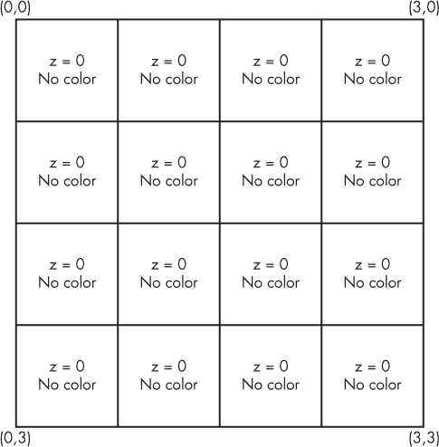
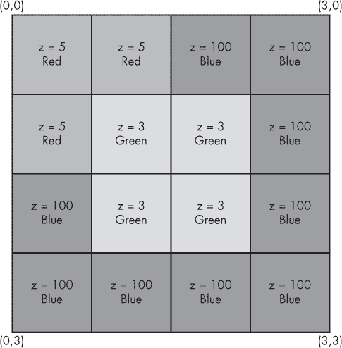

## **9**

**利用超感知能力驱散战争迷雾**


*战争迷雾*（通常简称为*迷雾*）是一种游戏开发者常用的机制，用来限制玩家的环境感知并隐藏关于游戏环境的信息。迷雾在大型多人在线战术竞技游戏（MOBA）中通常表现为视觉上的缺失，但这个概念还包括任何相关的游戏信息缺失或模糊。隐形人物、黑暗房间和隐藏在墙后面的敌人都是迷雾的一种形式。

游戏黑客可以使用*超感知能力（ESP）*黑客技术来减少或完全去除战争迷雾。ESP 黑客通过钩取、内存操作或两者结合，强制游戏显示隐藏信息。这些黑客利用了这样的事实：某些类型的迷雾通常是在客户端实现的，而不是服务器端，这意味着游戏客户端仍然包含有关隐藏内容的部分或完整信息。

在本章中，您将学习如何实现不同类型的 ESP 黑客技术。首先，您将学习如何点亮黑暗环境。接下来，您将使用 X 光视觉透视墙壁。最后，您将了解缩放黑客技术、调整信息显示以及其他简单的 ESP 黑客，这些都可以揭示游戏中各种有用的（但通常隐藏的）信息。

### **背景知识**

本章开始从黑客技术、操控和逆向工程转向编码。从现在开始，您将学习如何实际编写自己的黑客技术。为了保持话题一致，迄今为止我讨论的所有内容都将视为背景知识。如果您看到一个您不太记得的技术，例如内存扫描、设置内存断点、钩取或写入内存，请翻回相关章节，稍作复习再继续阅读。在整个文本中，您将看到一些提示，提醒您可以在哪些地方回顾某些话题。

具体来说，本章将大量讨论 Direct3D。在《"将 Jump Hooks 和 VF Hooks 应用于 Direct3D"》的第 175 页中，我解释了如何将钩子插入游戏的 Direct3D 绘图循环。该章节的示例代码包括一个功能齐全的 Direct3D 钩取引擎，位于*GameHackingExamples/Chapter8_Direct3DHook*。本章中的许多黑客技术都建立在这个钩子基础上，示例代码可以在 Direct3D 钩子代码的*main.cpp*文件中找到。您可以从*GameHackingExamples/Chapter8_Direct3DApplication*运行编译后的应用程序，在测试应用程序上看到黑客技术的实际效果。

### **通过 Lighthacks 揭示隐藏细节**

*Lighthacks*增加了黑暗环境中的光照，使您可以清楚地看到敌人、宝箱、路径以及任何通常被黑暗掩盖的东西。光照通常是在游戏的图形层中添加的装饰性变化，通常可以通过图形层的钩子直接修改。

最佳光照效果取决于相机的朝向、环境布局，甚至游戏引擎的具体特性，你可以操控这些因素来创建光照破解。然而，最简单的方法就是给房间添加更多的光源。

#### ***添加中央环境光源***

本书的在线资源包括两个小型光照破解示例。第一个是 *main.cpp* 中的 `enableLightHackDirectional()` 函数，如 清单 9-1 中所示。

```
void enableLightHackDirectional(LPDIRECT3DDEVICE9 pDevice)
{
    D3DLIGHT9 light;
    ZeroMemory(&light, sizeof(light));
    light.Type = D3DLIGHT_DIRECTIONAL;
    light.Diffuse = D3DXCOLOR(0.5f, 0.5f, 0.5f, 1.0f);
    light.Direction = D3DXVECTOR3(-1.0f, -0.5f, -1.0f);

    pDevice->SetLight(0, &light);
    pDevice->LightEnable(0, TRUE);
}When you know how much experience you
```

*清单 9-1：方向光照破解*

这段代码从 `EndScene()` 钩子中调用，通过创建一个名为 `light` 的光源向场景添加光照。代码将 `light.Type` 设置为方向光，这意味着光源将像聚光灯一样投射光线到特定方向。然后，代码将 `light.Diffuse` 的红、绿、蓝值分别设置为 0.5、0.5 和 0.5，使光源在从表面反射时呈现淡白色光泽。接下来，它将 `light.Direction` 设置为三维空间中的一个任意点。最后，代码使用游戏的 Direct3D 设备在索引 0 处设置光源并启用光照效果。

**注意**

*在示例应用程序中，光源从场景的左下角向上和向右照射。你可能需要根据目标游戏的渲染方式来改变这个位置。*

请注意，在索引 0 处插入光源适用于这个概念验证，但并非始终有效。游戏通常定义了多个光源，设置光源的索引可能会覆盖游戏使用的关键光照效果。实际上，你可以尝试将索引设置为一个任意较高的数字。然而，这种光照破解方法存在一个问题：方向光会被墙壁、生物和地形等物体阻挡，这意味着阴影仍然会被投射。方向光在开阔空间中效果很好，但对于狭窄的走廊或地下洞穴效果不佳。

#### ***增加绝对环境光***

另一种光照破解方法，如 `enableLightHackAmbient()` 函数中所见，比 清单 9-1 中的更为激进。它会全球性地影响光照强度，而不是增加额外的光源。以下是代码的样子：

```
void enableLightHackAmbient(LPDIRECT3DDEVICE9 pDevice)
{
    pDevice->SetRenderState(D3DRS_AMBIENT, D3DCOLOR_XRGB(100, 100, 100));
}
```

这个光照破解方法将绝对环境光（通过将 `D3DRS_AMBIENT` 传递给 `SetRenderState()` 函数来指示）设置为中等强度的白色。`D3DCOLOR_XRGB` 宏设置了该强度，以 `100` 作为红、绿、蓝级别的参数。这会使用全向白光照亮物体，从而有效地揭示所有物体，但会失去阴影和其他基于光照的细节。

#### ***创建其他类型的光照破解***

创建光照作弊的方法有很多，但它们因游戏而异。一种创造性的方法是禁用游戏调用`device->SetRenderState()`函数的代码。由于此函数用于设置全局环境光强度，禁用对它的调用会使 Direct3D 保持默认的光照设置，从而使一切都变得可见。这也许是最强大的光照作弊方法，但它要求你的机器人知道光照代码的地址才能禁用它。

还有基于内存的光照作弊。在一些游戏中，玩家和生物会根据其装备、坐骑或活跃的法术发出不同颜色和强度的光。若你了解游戏生物列表的结构，就可以直接修改决定生物光照强度的值。

举个例子，假设在某个游戏中，角色在施加治疗或强化法术时会发出一团蓝色的光球。在游戏的内存中，存在与每个生物相关的值，这些值告诉游戏该生物应该发出什么颜色和强度的光。如果你能在内存中找到这些值，你就可以改变它们，使生物有效地发出光球。这种类型的光照作弊通常用于 2D 俯视风格的游戏，因为围绕个别生物的光球产生了一种很酷的艺术效果，同时还可以照亮屏幕上的重要部分。然而，在 3D 游戏中，这种作弊方法只会将生物变成四处跑动的光团。

你还可以在游戏的 Direct3D 设备的 VF 表中挂钩`SetLight()`成员函数的第 51 个索引。然后，每当调用你的挂钩回调时，你可以在将其传递给原始函数之前修改拦截到的`D3DLIGHT9`光照结构的属性。例如，你可以将所有光源更改为`D3DLIGHT_POINT`类型，导致游戏中的任何现有光源像灯泡一样四面八方地发光。这种类型的光照作弊非常强大且精确，但它可能会产生一些令人不安的视觉效果。而且，它通常在没有光照的环境中失效，且不透明的障碍物仍然会阻挡点光源。

光照作弊非常强大，但它不会揭示任何内容。如果信息被障碍物而不是黑暗所隐藏，你将需要使用透视墙壁作弊来揭示它。

### **用透视墙壁作弊揭示狡猾的敌人**

你可以使用*透视墙壁作弊*来显示被墙壁、地板和其他障碍物隐藏的敌人。创建这些作弊的方法有几种，但最常见的方法是利用一种叫做*z-buffering*的渲染技术。

#### ***使用 Z-Buffering 渲染***

大多数图形引擎，包括 Direct3D，都支持 z 缓冲，它是一种确保在场景中有重叠物体时，只绘制最上面物体的方式。z 缓冲通过将场景“绘制”到一个二维数组来工作，这个数组描述了屏幕上每个像素的物体离观察者的远近。可以将数组的索引看作是坐标轴：它们对应于屏幕上每个像素的 x 轴（左右）和 y 轴（上下）。数组中存储的每个值都是某个像素的 z 轴值。

当一个新物体出现时，它是否真的绘制到屏幕上由 z 缓冲数组决定。如果物体的 x 和 y 位置在数组中已经被填充，那就意味着屏幕上的那个像素位置已有其他物体。如果新物体的 z 轴值更低（也就是离观察者更近），它才会出现在这个位置。当场景绘制完成后，数组会被刷新到屏幕上。

为了说明这一点，假设一个三维空间需要通过某个游戏绘制到一个 4×4 像素的二维视口上。这个场景的 z 缓冲看起来会像图 9-1。



*图 9-1：空的 z 缓冲*

首先，游戏绘制一个完全填充视口的蓝色背景，并将其放置在 z 轴上尽可能远的位置；假设最高的 z 值是 100。接着，游戏在位置(0,0)绘制一个 2×2 像素的红色矩形，z 位置为 5。最后，游戏在位置(1,1)绘制一个 2×2 像素的绿色矩形，z 位置为 3。此时，z 缓冲看起来像图 9-2。



*图 9-2：填充后的 z 缓冲*

z 缓冲根据物体的 z 位置巧妙地处理了重叠物体。离 z 轴最近的绿色方块会覆盖离它稍远的红色方块，而两个方块又会覆盖远离屏幕的蓝色背景。

这种行为允许游戏在不需要担心玩家实际看到什么的情况下绘制地图、玩家、怪物、细节和粒子。这对于游戏开发者来说是一个巨大的优化，但也暴露了一个巨大的攻击面。由于所有游戏模型*总是*被提供给图形引擎，你可以使用钩子来检测玩家看不见的物体。

#### ***创建一个 Direct3D 墙 hack***

你可以通过在`DrawIndexedPrimitive()`函数上设置钩子来创建操控 z 缓冲的透视墙 hack，这个函数在游戏绘制 3D 模型到屏幕时会被调用。当敌方玩家模型被绘制时，这种类型的墙 hack 会禁用 z 缓冲，调用原始函数绘制模型，然后重新启用 z 缓冲。这样，敌方模型就会被绘制在场景中的所有其他物体之上，不管它前面有什么。某些墙 hack 还可以将特定模型以纯色显示，比如敌人用红色，盟友用绿色。

##### **切换 Z 缓冲区**

来自*GameHackingExamples/Chapter8_ Direct3DHook*的*main.cpp*中的 Direct3D 钩子有这个例子透视墙，位于`onDrawIndexedPrimitive()`函数中：

```
void onDrawIndexedPrimitive(
    DirectXHook* hook,
    LPDIRECT3DDEVICE9 device,
    D3DPRIMITIVETYPE primType,
    INT baseVertexIndex, UINT minVertexIndex,
    UINT numVertices, UINT startIndex, UINT primCount)
{
    if (numVertices == 24 && primCount == 12) {
        // it's an enemy, do the wallhack
    }
}
```

这个函数作为对`DrawIndexedPrimitive()`的钩子回调函数，位于游戏的 Direct3D 设备的 VF 索引 82 处。游戏绘制的每个模型都会经过这个函数，并伴随一些模型特有的属性。通过检查其中一部分属性，特别是`numVertices`和`primCount`值，钩子能够检测到何时绘制一个敌人模型，并启动透视墙。在这个例子中，表示敌人模型的值是`24`和`12`。

魔法发生在`if()`语句内部。只需要几行代码，透视墙就能以忽略 z 缓冲区的方式绘制模型，如下所示：

```
device->SetRenderState(D3DRS_ZENABLE, false); // disable z-buffering
DirectXHook::origDrawIndexedPrimitive(        // draw model
    device, primType, baseVertexIndex,
    minVertexIndex, numVertices, startIndex, primCount);
device->SetRenderState(D3DRS_ZENABLE, true);  // enable z-buffering
```

简单来说，这段代码在绘制敌人模型时禁用 z 缓冲区，并在绘制后重新启用它。禁用 z 缓冲区后，敌人会绘制在所有其他物体前面。

##### **更改敌人的纹理**

当一个模型在屏幕上渲染时，*纹理*被用来为模型贴图。纹理是二维图像，拉伸并包裹在三维模型上，用以应用构成模型三维艺术作品的颜色和图案。要改变敌人在你的透视墙（wallhack）中显示的方式，你可以将其设置为使用不同的纹理，就像这个例子一样：

```
// when hook initializes
LPDIRECT3DTEXTURE9 red;
D3DXCreateTextureFromFile(device, "red.png", &red);
// just before drawing the primitive
device->SetTexture(0, red);
```

这段代码的第一个块加载纹理文件，并且只会执行一次——当钩子被初始化时。完整的示例代码在`initialize()`函数中执行此操作，这个函数在第一次调用`EndScene()`钩子回调时被调用。第二个代码块发生在调用原始`DrawIndexedPrimitive()`函数之前，它使模型使用自定义纹理绘制。

#### ***指纹识别你想要显示的模型***

创建一个好的透视墙的最棘手部分是找到正确的`numVertices`和`primCount`值。为了做到这一点，你可以创建一个工具，记录所有这两个变量的唯一组合，并允许你使用键盘在列表中遍历。这个工具的工作示例代码在本章提供的示例应用中可能并不有用，但我会给你一些高层的实现细节。

首先，在全局作用域中，你需要声明一个结构体，它包含成员用于存储以下内容：

• `numVertices`和`primCount`

• 一个此结构的`std::set`（我们称之为`seenParams`）

• 一个该结构的实例（我们称之为`currentParams`）

`std::set`需要一个比较器来比较该结构，因此你还需要声明一个比较函数对象，使用`memcmp()`来比较两个结构体。每当调用`DrawIndexedPrimitive()`回调时，你的透视墙可以创建一个结构实例，并传递到`seenParams.insert()`函数中，该函数只有在该参数对不在列表中时才会插入它。

使用 `GetAsyncKeyState()` Windows API 函数，你可以检测空格键是否被按下，并执行类似以下伪代码的操作：

```
auto current = seenParams.find(currentParam);
if (current == seenParams.end())
    current = seenParams.begin();
else
    current++;
currentParams = *current;
```

这样，当按下空格键时，`currentParams` 会被设置为 `seenParams` 中的下一个对。通过这段代码，你可以使用类似于壁 hack 的代码，改变与 `currentParams.numVertices` 和 `currentParams.primCount` 匹配的模型的纹理。工具还可以将这些值绘制在屏幕上，以便你看到它们并将其记录下来。

使用像这样的工具，找到合适的模型就像在一个角色不会死亡的模式下启动游戏（与朋友对战、在自定义模式下等），运行机器人，然后按空格键直到每个需要的模型被高亮显示。一旦你得到了目标模型的数值，就可以修改你的壁 hack 中的 `numVertices` 和 `primCount` 检查，让它知道需要高亮显示哪些模型。

**注意**

*角色模型通常由多个较小的模型组成，用于显示身体各个部位，而且游戏通常会在不同的距离显示同一角色的不同模型。这意味着一个游戏可能会为一种类型的角色有 20 个或更多的模型。即便如此，选择仅一个模型（比如敌人的躯干）在壁 hack 中显示，可能就足够了。*

### **使用 Zoomhacks 获得更广的视野**

许多 MOBA 和即时战略（RTS）类型的游戏使用 3D 俯视风格，使它们免受壁 hack 的影响。它们还使用地图上的黑暗区域作为一种迷雾，但使用光 hack 显示黑暗区域并不会提供任何额外的信息；迷雾中的模型只有游戏服务器知道，而客户端无法看到。

这种风格使得大多数类型的 ESP 作弊无效：几乎没有未知信息可以揭示，因此这些作弊只会增强你已经能看到的信息。然则，有一种类型的 ESP 作弊仍然有帮助。*Zoomhacks* 让你可以将视野缩小到游戏通常允许的范围之外，从而有效地显示出你否则无法看到的地图大片区域——因此可以绕过游戏的壁 hack 和光 hack 免疫。

#### ***使用 NOPing Zoomhacks***

MOBA 和 RTS 游戏通常允许玩家进行可变的但有限的缩放。最简单的类型的 zoomhack 是找到*缩放因子*（一个随着缩放级别变化而变化的乘数，通常是`float`或`double`）并用更大的值覆盖它。

要找到缩放因子，启动 Cheat Engine 并搜索一个初始值未知的 `float`。（要复习 Cheat Engine，请参考《Cheat Engine 的内存扫描器》在第 5 页的内容。）对于重新扫描，请重复以下过程，直到只剩下少数几个值，以找到缩放因子：

1.  转到游戏窗口并放大视野。

1.  在 Cheat Engine 中搜索增大的值。

1.  转到游戏窗口并缩小视野。

1.  在 Cheat Engine 中搜索减小的值。

尝试将值列表缩小到一个选项。为了确认剩下的值是缩放因子，将其在 Cheat Engine 中冻结并查看游戏中的缩放行为；冻结正确的值将禁用缩放。如果无法通过`float`搜索找到缩放因子，请尝试使用`double`进行搜索。如果两次搜索都失败，请再次尝试，但将缩放与减小的值对应，放大与增大的值对应。一旦找到内存中的缩放因子，你可以编写一个小的机器人来覆盖它为最适合你的缩放因子。

更高级的缩放黑客方法会将负责确保缩放因子在设定范围内的游戏代码 NOP 掉。你应该能够使用 OllyDbg 找到这段代码。设置一个针对缩放因子的内存写入断点，在游戏中缩放以触发断点，然后检查断点处的代码。（要提升你的 OllyDbg 内存断点技能，翻到第 43 页的“通过命令行控制 OllyDbg”部分。）你应该能看到修改缩放因子的代码。缩放限制代码通常很容易辨认：与最小和最大缩放值匹配的常量就是明显的提示。

如果你使用这种方法无法找到限制代码，那么这个限制可能是在新缩放级别下重新绘制图形时应用的，而不是缩放因子变化时。在这种情况下，将断点切换到内存读取时，寻找相同的线索。

#### ***触及缩放黑客的表面***

你还可以通过在`device->SetTransform(type, matrix)`函数上使用 Direct3D 钩子来创建缩放黑客，但这需要深入理解游戏是如何设置玩家视角的。有几种不同的方式来管理视角，但你可以通过*视图*（变换类型`D3DTS_VIEW`）或*投影*（变换类型`D3DTS_PROJECTION`）来控制缩放级别。

正确操作控制视图和投影的变换矩阵需要相当深入的 3D 图形数学知识，因此我会尽量避免使用这种方法——而且我从未遇到过仅仅操作缩放因子会有问题。如果你对这种技巧感兴趣，我建议你先阅读一本 3D 游戏编程书籍，了解更多关于 3D 数学的内容。

但有时，即使是缩放黑客也不够。一些有用的信息可能会作为游戏的内部状态隐藏，或者可能对于玩家来说一眼难以看出。在这些情况下，抬头显示（HUD）就是合适的工具。

### **通过 HUD 显示隐藏数据**

*抬头显示（HUD）* 是一种 ESP 黑客，它以叠加的形式显示关键的游戏信息。HUD 通常类似于游戏现有的界面，用于显示诸如剩余弹药、迷你地图、当前健康值、任何正在进行的技能冷却时间等信息。HUD 通常显示历史信息或汇总数据，主要用于 MMORPG。它们通常是文本为主，但也有些包含精灵图、形状以及其他小型视觉效果。

你可以创建的 HUD 取决于游戏中可用的数据。常见的数据点有：

• 每小时经验增长（exp/h）

• 每小时击杀生物数（KPH）

• 每秒伤害（DPS）

• 每小时获得金币（GPH）

• 每分钟治疗量

• 预计达到下一级所需时间

• 花费在物资上的金币数量

• 被盗物品的总金币价值

更高级的自定义 HUD 可能会显示包含已获得物品、使用的物资、每种生物的击杀数，以及最近被看到的玩家名称的大表格。

除了你已经学习的关于读取内存、挂钩图形引擎和显示自定义数据的内容外，我没什么别的可以教你如何创建 HUD 的知识。大多数游戏的架构足够简单，你可以轻松地从内存中获取所需的大部分信息。然后，你可以进行一些基本的按小时、百分比或总和的计算，将数据转化为可用的格式。

#### ***创建经验 HUD***

想象一下，你希望一个 HUD 显示你的当前等级、每小时经验以及距离角色升级还需要多长时间。首先，你可以使用 Cheat Engine 查找包含你等级和经验的变量。当你知道这些值后，你可以使用游戏特定的算法或硬编码的经验表来计算达到下一级所需的经验。

当你知道了升级所需的经验量后，你可以计算每小时经验。用伪代码表示，这个过程可能是这样的：

```
   // this example assumes the time is stored in milliseconds
   // for seconds, remove the "1000 * "
   timeUnitsPerHour = 1000 * 60 * 60
   timePassed = (currentTime - startTime)
➊ timePassedToHourRatio = timeUnitsPerHour / timePassed
➋ expGained = (currentExp - startExp)
   hourlyExp = expGained * timePassedToHourRatio

➌ remainingExp = nextExp - currentExp
➍ hoursToGo = remainingExp / hourlyExp
```

为了找到每小时经验 `hourlyExp`，你需要存储你的经验值和 HUD 启动时的时间；这些分别是 `startExp` 和 `startTime`。这个例子还假设 `currentLevel` 和 `currentExp` 已经定义，其中 `currentLevel` 是角色的等级，`currentExp` 是当前的经验值。

有了这些值，`hourlyExp` 可以通过将时间单位比例 ➊（即一个小时内的时间单位与已经过去的时间之间的比值）乘以从 `startTime` 以来获得的经验来计算 ➋。在这个例子中，时间单位是毫秒，所以时间单位需要乘以 1,000。

接下来，`currentExp` 从 `nextExp` 中减去，以确定升级所需的剩余经验 ➌。为了计算还需要多少小时才能升级，剩余经验除以每小时经验 ➍。

当你拥有所有这些信息时，你就可以最终将其显示在屏幕上。使用本书示例代码中提供的 Direct3D hooking 引擎，你可以在`EndScene()`钩子回调函数中通过这个调用来绘制文本：

```
hook->drawText(
    10, 10,
    D3DCOLOR_ARGB(255, 255, 0, 0),
    "Will reach level %d in %0.20f hours (%d exp per hour)",
    currentLevel, hoursToGo, hourlyExp);
```

这就是一个有效的经验跟踪 HUD 所需要的一切。这些相同公式的变体可以用来计算 KPH、DPS、GPH 和其他有用的基于时间的度量。此外，你可以使用 Direct3D 钩子的`drawText()`函数来显示任何你能找到并规范化的信息。钩子还包含`addSpriteImage()`和`drawSpriteImage()`函数，你可以用它们来绘制自定义图像，让你的 HUD 变得更加炫酷。

#### ***使用钩子定位数据***

读取内存并不是获取自定义 HUD 数据的唯一方式。你还可以通过计算`DrawIndexedPrimitive()`函数绘制特定模型的次数、钩取游戏内部负责绘制某些类型文本的函数，甚至拦截负责处理来自游戏服务器的数据包的函数调用来收集信息。你用来实现这些的方式会因每个游戏而大不相同，找到这些方法将需要你将本书中学到的所有知识与自己的创造力和编程直觉结合起来。

例如，要创建一个显示地图上有多少敌人的 HUD，你可以使用墙壁透视（wallhacks）中使用的模型指纹识别方法来计算敌人的数量，并将这个数字输出到屏幕上。这个方法比从内存中读取敌人列表更好，因为它不需要在每次游戏更新时都找到新的内存地址。

另一个例子是显示敌人的技能冷却列表，这需要你拦截告知客户端显示哪些技能效果的传入数据包。然后，你可以根据技能和敌人位置、技能类型等，将某些技能与某些敌人关联，并利用这些信息来追踪每个敌人使用过的技能。如果你将这些数据与冷却时间数据库关联，你可以准确地显示每个敌人技能何时可以再次使用。这非常强大，因为大多数游戏并不会将敌人的技能冷却存储在内存中。

### **其他 ESP 黑客概述**

除了本章讨论的黑客技巧外，还有一些没有通用名称、专门针对某些类型或甚至某些特定游戏的 ESP 黑客。我将简要介绍一些这些黑客的理论、背景和架构。

**范围黑客**

范围黑客使用类似于墙壁透视（wallhacks）的方法来检测不同类型的英雄或角色的模型何时被绘制。然后，它们会在每个英雄模型周围绘制圆圈。每个圆圈的半径对应于包围该英雄的最大攻击范围，从而有效地显示你可以被每个敌人攻击的区域。

**加载屏幕 HUD**

加载屏幕 HUD 在 MOBA 和 RTS 游戏中很常见，这些游戏要求所有玩家在游戏启动时都要经历一个加载屏幕。这些黑客利用了这些游戏通常有网站，可以查询历史玩家统计信息的事实。你可以编写一个自动查询每个玩家统计信息的机器人，并将信息无缝地显示为加载屏幕上的叠加层，让你在战斗前了解敌人的情况。

**选择阶段 HUD**

选择阶段 HUD 与加载屏幕的 HUD 类似，但它们显示在每个玩家选择一个角色或英雄的预游戏阶段。与显示敌人统计数据不同，选择阶段的 HUD 显示的是盟友的统计信息。这使你能够快速评估盟友的优缺点，从而做出更好的决策，选择适合的角色。

**楼层间谍黑客**

楼层间谍黑客在较旧的 2D 自上而下游戏中很常见，这些游戏具有不同的楼层或平台。如果你在顶层，你可能希望在冲进去之前了解楼下发生了什么。你可以编写楼层间谍黑客，修改当前楼层值（通常是 `unsigned int`），将其更改为你上方或下方的其他楼层，从而让你窥探其他楼层的情况。

游戏通常会根据玩家的位置每帧重新计算当前楼层值，因此有时需要使用 NOP 操作来防止每次重绘帧时楼层值被重置。找到当前楼层值以及 NOP 代码的方法与查找缩放因子类似，正如在《使用 NOP 缩放黑客》一节中所讨论的，在第 197 页上。

### **结束语**

ESP 黑客是获取游戏额外信息的强大方式。有些黑客可以通过 Direct3D 钩子或简单的内存编辑轻松完成，而其他一些则需要你了解游戏的内部数据结构并钩住专有函数，这样你就可以运用你的逆向工程技能。

如果你想尝试 ESP 黑客，可以研究并调整本章的示例代码。为了更具体地练习 ESP 黑客，我鼓励你去找一些游戏来进行探索。
