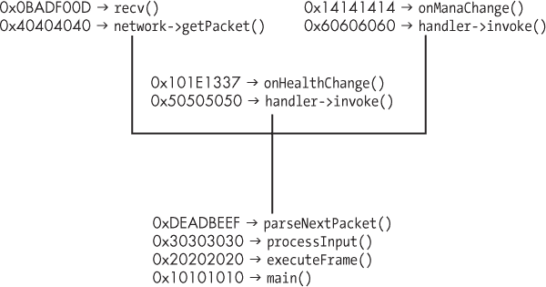
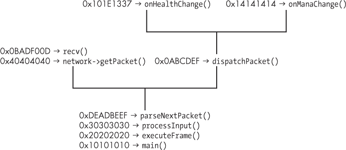
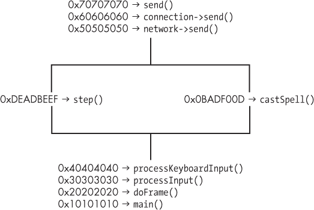

## 10

**响应式黑客**


平均玩家的反应时间为 250 毫秒，或者四分之一秒。职业玩家的平均反应时间为五分之一秒，但有些玩家能够在六分之一秒内做出反应。这些数据基于在线测试，测量玩家对单一、可预测事件的反应时间。然而，在实际游戏中，玩家必须对数十个不同的事件做出反应，比如失去健康、技能射击的来临、技能冷却结束、敌人攻击等。只有非常熟练的玩家才能在如此动态的环境中维持四分之一或五分之一秒的反应时间；而要想更快，唯一的方法就是使用计算机。

在这一章中，你将学习如何制作比任何玩家反应更快的机器人。首先，我会展示一些你可以在机器人中使用的代码模式，用于检测游戏中何时发生某些事件。接下来，你将学会如何让一个机器人独立移动你的角色、治疗或施放法术。一旦你掌握了这些基本技巧，我将帮助你将它们结合起来，实现一些最常见且最强大的响应式黑客。

### 观察游戏事件

在玩游戏的几秒钟内，大多数人就能对游戏环境做出基本的观察。你可以清晰地看到导弹飞向你的角色，健康值过低时，或者技能冷却结束时。而对于机器人来说，这些看似直观的观察并不容易。机器人必须通过查看内存变化、检测视觉提示或截取网络流量来识别每个事件。

#### *内存监控*

为了检测简单的事件，比如你的健康条下降，你可以编程让机器人定期从内存中读取健康值，并将其与某个最小可接受值进行比较，如清单 10-1 所示。

```
// do this every 10 milliseconds (100 times a second)
auto health = readMemory<int>(HEALTH_ADDRESS);
if (health <= 500) {
    // some code to tell the bot how to react
}
```

*清单 10-1：一个检查健康的`if`语句*

给定你角色的健康地址，你可以根据需要频繁检查其值；通常每 10 毫秒检查一次是一个好的频率。（如果需要复习如何在内存中查找值，请翻回第一章。）一旦`health`值降到某个特定值以下，你就需要运行一些反应代码，比如施放治疗法术或喝药水。我将在本章后面讲解如何做到这一点。

如果你希望你的机器人拥有更精细的信息并能够提供更多样化的反应，可以编程使其对*任何*健康变化作出反应，而不仅仅是在超过设定阈值后才反应。为此，请将清单 10-1 中的代码更改为比较当前的健康值和上次执行时的健康值，如下所示：

```
// still do this every 10 milliseconds
static int previousHealth = 0;
auto health = readMemory<int>(HEALTH_ADDRESS);
if (health != previousHealth) {
    if (health > previousHealth) {
        // react to increase
    } else {
        // react to decrease
    }
    previousHealth = health;
}
```

现在，这段代码使用一个名为 `previousHealth` 的静态变量来追踪上一轮迭代中的 `health` 值。如果 `previousHealth` 和 `health` 不同，机器人不仅会对生命值的变化作出反应，还会根据生命值的增加或减少作出不同的反应。这种技术是最简单、最常见的应对游戏状态变化的方式。通过正确的内存地址，你可以使用这种代码模式来观察生命值、魔法值、技能冷却时间以及其他关键数据的变化。

#### *检测视觉提示*

生命值对机器人来说相对简单，因为它只是一个数字，但一些游戏元素必须以不同的方式传递给机器人。例如，当状态异常或增益效果影响角色时，最简单的方式就是通过屏幕上的状态指示器来判断，机器人也可以采用同样的方法。

当读取内存不足以满足需求时，你可以通过钩取游戏的图形引擎并等待游戏渲染特定模型来检测某些事件。（请参见 “在 Direct3D 中应用跳跃钩子和 VF 钩子” 第 175 页 和 “创建 Direct3D 墙体透视” 第 194 页 来复习有关 Direct3D 钩子的内容。）当模型被绘制时，你可以排队一个反应，在帧绘制完成后执行，像这样：

```
// below is the drawIndexedPrimitive hook
void onDrawIndexedPrimitive(...) {
    if (numVertices == EVENT_VERT && primCount == EVENT_PRIM) {
        // react, preferably after drawing is done
    }
}
```

使用与第九章 墙体透视代码 相同的模型指纹识别技巧，这段代码可以检测特定模型何时被绘制到屏幕上，并做出相应的反应。然而，这段代码会在每一帧都做出反应，这可能会导致游戏无法正常进行。你可能希望加入一些内部冷却机制，以避免反应过度。在那些指示器模型持续绘制（即非闪烁）的情况下，你实际上可以跨帧追踪它，以确定它何时出现或消失。

下面是一个也处理追踪的代码片段：

```
bool eventActive = false;
bool eventActiveLastFrame = false;
// below is the drawIndexedPrimitive hook
void onDrawIndexedPrimitive(...) {
    if (numVertices == EVENT_VERT && primCount == EVENT_PRIM)
        eventActive = true;
}

// below is the endScene hook
void onDrawFrame(...) {
    if (eventActive) {
        if (!eventActiveLastFrame) {
            // react to event model appear
        }
        eventActiveLastFrame = true;
    } else {
        if (eventActiveLastFrame) {
            // react to event model disappear
        }
        eventActiveLastFrame = false;
    }
    eventActive = false;
}
```

`onDrawIndexedPrimitive()` 函数仍然会检查是否绘制了某个模型，但现在有两个布尔值变量追踪该模型是出现在当前帧还是上一帧。当帧完全绘制完后，机器人可以检查这些变量，并根据模型的出现或消失作出反应。

这种方法对于检测只在角色受到眩晕、移动减速、束缚、毒药等影响时才会出现的视觉状态指示器非常有效。你还可以用它来检测敌人在 MOBA 和 RTS 游戏中的出现和消失，因为这些游戏只绘制处于友方单位或玩家视距范围内的敌人。

#### *拦截网络流量*

观察事件最可靠的方法之一与游戏客户端的做法相同：等待游戏服务器告诉你事件已经发生。在这种通信方式中，游戏服务器通过套接字将称为 *数据包* 的字节数组发送到客户端。数据包通常是加密的，包含通过专有格式序列化的数据块。

##### 典型的数据包解析函数

要接收和处理数据包，游戏客户端在绘制帧之前执行类似于清单 10-2 的操作。

```
void parseNextPacket() {
    if (!network->packetReady()) return;

    auto packet = network->getPacket();
    auto data = packet->decrypt();
    switch (data->getType()) {
        case PACKET_HEALTH_CHANGE:
            onHealthChange(data->getMessage());
            break;
        case PACKET_MANA_CHANGE:
            onManaChange(data->getMessage());
            break;
        // more cases for more packet types
    }
}
```

*清单 10-2：游戏如何解析数据包的简化示例*

任何特定游戏的具体代码可能看起来有所不同，但控制流始终相同：接收数据包，解密它，决定它包含什么类型的消息，然后调用一个知道如何处理它的函数。一些游戏黑客拦截原始网络数据包并在他们的机器人中复制这种功能。这种技术是有效的，但需要广泛的加密知识、对游戏如何在数据包中存储数据的全面理解、能够进行中间人攻击的能力，并且需要能够定位游戏客户端使用的解密密钥。

在数据包被解密和解析后，挂钩负责处理数据包的函数是一个更好的方法；在清单 10-2 中，这些函数是 `onHealthChange()` 和 `onManaChange()` 函数。这种方法利用了游戏本身处理数据包的能力，使机器人无需了解游戏使用的各种网络设施。它还使你可以自行决定拦截哪些网络数据，因为你只需要挂钩那些满足你需求的处理程序。

**注意**

*拦截整个数据包有时是有利的——例如，在任何使用 Adobe AIR 并通过 RTMPS 通信的游戏中。由于 RTMPS 已被广泛记录，因此无需逆向工程格式或加密。第八章详细解释了如何挂钩 RTMPS。*

有一些技巧可以帮助你轻松找到解析函数，并最终定位到处理数据包的 `switch()` 语句。我发现最有用的方法是将断点放在游戏用于接收网络数据的函数上，然后在断点触发时分析应用程序的流程。

让我们一起走一遍在 OllyDbg 中附加到目标游戏时如何进行操作的过程。在 Windows 中，`recv()` 是接收来自套接字数据的 API 函数。在 OllyDbg 命令行中，你可以通过输入 `bp recv` 命令来设置一个 `recv()` 的断点。当断点触发时，你可以使用 CTRL-F9（执行直到返回的快捷键）和 F8（单步跳过的快捷键）来爬取调用堆栈。这个组合实际上让程序执行直到被调用者返回给调用者，从而让你和游戏同步地爬取调用堆栈。在每个堆栈级别，你可以检查每个调用者的代码，直到找到包含一个大型 `switch()` 语句的调用者；这应该就是数据包解析器。

##### 更复杂的解析器

然而，根据游戏的架构，找到解析函数可能并不像想象中那么简单。考虑一个有如下解析函数的游戏：

```
packetHandlers[PACKET_HEALTH_CHANGE] = onHealthChange;
packetHandlers[PACKET_MANA_CHANGE] = onManaChange;

void parseNextPacket()
{
    if (!network->packetReady()) return;
    auto packet = network->getPacket();
    auto data = packet->decrypt();
    auto handler = packetHandlers[data->getType()];
    handler->invoke(data->getMessage());
}
```

由于 `parseNextPacket()` 函数没有 `switch()` 语句，因此没有明显的方法在内存中识别它。除非你特别小心，否则很可能会在调用堆栈中跳过它。当一个游戏有像这样的解析函数时，试图弄清楚解析函数的样子可能是没有意义的。如果在爬取 `recv()` 调用堆栈时没有看到 `switch()` 语句，你将不得不记录堆栈中的每个被调用者。

与其从断点开始爬取调用堆栈，不如去查看 OllyDbg 堆栈窗格中 ESP 以下标记为 `RETURN` 的每个地址。这些是每个被调用者返回到每个调用者的返回地址。在每个返回地址处，你需要在 OllyDbg 的反汇编窗格中找到调用者的顶部并记下地址。这样，你就可以得到一份所有函数调用的列表，直到 `recv()` 调用。

接下来，你需要重复相同的列表制作过程，设置断点到一些游戏的处理函数上。你可以通过监控这些函数必然会使用的内存来找到一个处理函数。例如，健康变化的数据包的处理函数将会更新内存中的健康值。通过 OllyDbg，你可以将一个 *内存写入* 断点设置到健康地址。当断点被触发时，意味着游戏从处理函数更新了健康值。这应该对于大多数由服务器控制的值同样适用。服务器会控制任何游戏关键的值，如健康、魔法、等级、物品等等。

一旦你记录了 `recv()` 和一些处理函数的调用堆栈，你就可以将它们关联起来，找到解析函数。例如，考虑 表 10-1 中的三个伪调用堆栈。

**表 10-1：** 三个与数据包相关的函数的伪调用堆栈

| **`recv()` 堆栈** | **`onHealthChange()` 堆栈** | **`onManaChange()` 堆栈** |
| --- | --- | --- |
| 0x0BADF00D | 0x101E1337 | 0x14141414 |
| 0x40404040 | 0x50505050 | 0x60606060 |
| 0xDEADBEEF | 0xDEADBEEF | 0xDEADBEEF |
| 0x30303030 | 0x30303030 | 0x30303030 |
| 0x20202020 | 0x20202020 | 0x20202020 |
| 0x10101010 | 0x10101010 | 0x10101010 |

这些栈显示了在调用 `recv()` 和游戏的假设 `onHealthChange()` 和 `onManaChange()` 函数时内存的可能状态。请注意，每个函数都起源于一链四个共同的函数调用（以粗体显示）。最深的共同地址 0xDEADBEEF 是解析器的地址。为了更好地理解这种结构，可以查看以树形结构展示的调用栈，如 图 10-1 所示。



*图 10-1：我们三个调用栈的树形视图*

每个函数的调用栈都从地址 0xDEADBEEF 处分支，这意味着该函数是三个调用的共同起点。示例中的 `parseNextPacket()` 函数负责调用这些函数，因此它必须是 0xDEADBEEF 处的最新共同祖先。

**注意**

*这些调用栈是假设的，它们简化得比你通常遇到的情况要多。实际的调用栈可能会有更多的函数调用，比较它们的难度也会更大。*

##### 一个混合解析系统

解析循环的第三种变体可能是前两者的混合，它在函数调用后使用 `switch()` 语句。这里是另一个假设的函数：

```
void processNextPacket()
{
    if (!network->packetReady()) return;
    auto packet = network->getPacket();
    auto data = packet->decrypt();
    dispatchPacket(data);
}

void dispatchPacket(data)
{
    switch (data->getType()) {
    case PACKET_HEALTH_CHANGE:
        processHealthChangePacket(data->getMessage());
        break;
    case PACKET_MANA_CHANGE:
        processManaChangePacket(data->getMessage());
        break;
        // more cases for more data types
    }
}
```

`processNextPacket()` 函数获取一个新的数据包，并调用 `dispatchPacket()` 来处理数据。在这种情况下，`dispatchPacket()` 函数出现在每个处理函数的调用栈中，但不在 `recv()` 函数的调用栈中。例如，可以查看 表 10-2 中的假设栈。

**表 10-2：** 三个与数据包相关的函数的伪调用栈

| **`recv()` 栈** | **`onHealthChange()` 栈** | **`onManaChange()` 栈** |
| --- | --- | --- |
| 0x0BADF00D | 0x101E1337 | 0x14141414 |
| 0x40404040 | 0x00ABCDEF | 0x00ABCDEF |
| 0xDEADBEEF | 0xDEADBEEF | 0xDEADBEEF |
| 0x30303030 | 0x30303030 | 0x30303030 |
| 0x20202020 | 0x20202020 | 0x20202020 |
| 0x10101010 | 0x10101010 | 0x10101010 |

尽管这三个函数的调用栈中的前四个地址相同，只有两个处理程序有一个额外的共同地址（再次以粗体显示）。那个地址是 0x00ABCDEF，它是 `dispatchPacket()` 函数的地址。你可以再次想象这些栈以树形结构展现，如 图 10-2 所示。



*图 10-2：我们三个调用栈的树形视图*

##### 一个解析器破解

一旦你找到了负责将数据包分发到处理函数的函数，你就能识别出可以被调用的每个处理程序。你可以通过在某个处理程序上设置断点，观察它执行时内存中变化的值，从而推断该处理程序的功能。然后，你可以挂钩你需要响应的任何处理程序。（如果你需要复习如何挂钩这些函数，可以翻回 第八章。）

当然，实现网络行为的方法是无穷无尽的。我无法覆盖所有方法，但看到这三种常见技巧应该能帮助你理解这种方法论。无论你处理的是哪个游戏，在`recv()`上设置一个断点应该是朝着正确方向迈出的第一步。

### 执行游戏内操作

在机器人能够响应事件之前，你需要教会它如何玩游戏。它需要能够施放法术、四处移动和激活物品。在这一方面，机器人与人类并没有太大区别：它们只需被告知按下哪些按钮。按按钮很简单，许多情况下也足够用，但在更复杂的情况下，机器人可能需要通过网络与服务器进行通信，告诉服务器它正在做什么。

为了跟随本节的示例并在之后自行探索，请打开本书资源文件中的*GameHackingExamples/Chapter10_ResponsiveHacks/*文件夹。

#### *模拟键盘*

在游戏中，你最常按下的按钮是键盘按键，有几种方法可以教你的机器人进行输入。

##### SendInput()函数

一种常见的模拟键盘的方法是使用`SendInput()` Windows API 函数。这个函数将键盘和鼠标输入发送到最上层的窗口，它的原型如下：

```
UINT SendInput(UINT inputCount, LPINPUT inputs, int size);
```

第一个参数，`inputCount`，是发送的输入数量。对于本书中的示例，我将始终使用`1`作为值。第二个参数，`inputs`，是指向一个结构体（或者一个结构体数组，其长度与`inputCount`值匹配）的指针，该结构体类型为预定义的`INPUT`类型。最后一个参数是输入在内存中的大小，通过公式`size` = `inputCount` × `sizeof(INPUT)`来计算。

`INPUT`结构体告诉`SendInput()`函数要发送什么类型的输入，以下代码展示了如何初始化`INPUT`实例来按下 F1 键：

```
INPUT input = {0};
input.type = INPUT_KEYBOARD;
input.ki.wVk = VK_F1;
```

要让你的机器人真正按下 F1 键，你需要像这样发送两次这个输入：

```
SendInput(1, &input, sizeof(input));
// change input to key up
input.ki.dwFlags |= KEYEVENTF_KEYUP;
SendInput(1, &input, sizeof(input));
```

第一次调用`SendInput()`按下 F1 键，第二次释放它。释放操作并非因为输入被发送了两次，而是因为第二次调用时，在`input`参数的键盘标志字段中启用了`KEYEVENTF_KEYUP`标志。由于即使是设置一个单一的按键输入也有些繁琐，因此最好将所有内容包装在一个函数中。结果看起来像清单 10-3。

```
void sendKeyWithSendInput(WORD key, bool up)
{
    INPUT input = {0};
    input.type = INPUT_KEYBOARD;
    input.ki.wVk = key;
    input.ki.dwFlags = 0;

    if (up)
        input.ki.dwFlags |= KEYEVENTF_KEYUP;
    SendInput(1, &input, sizeof(input));
}
sendKeyWithSendInput(VK_F1, false); // press
sendKeyWithSendInput(VK_F1, true);  // release
```

*清单 10-3：一个包装器，用于通过`SendInput()`模拟按键*

该函数使用给定的`key`初始化`input`，如果`up`被设置，则启用`KEYEVENTF_KEYUP`标志，并调用`SendInput()`函数。这意味着即使释放键是必须的，`sendKeyWithSendInput()`仍然需要被调用第二次来发送按键释放。这样编写的原因是，因为涉及到修改键（如 SHIFT、ALT 或 CTRL）的组合键必须以稍有不同的方式发送；修改键的按下必须在主键按下之前，释放则必须在主键释放之后。

以下代码展示了如何使用`sendKeyWithSendInput()`函数告诉机器人按下 SHIFT-F1：

```
sendKeyWithSendInput(VK_LSHIFT, false); // press shift
sendKeyWithSendInput(VK_F1, false);     // press F1
sendKeyWithSendInput(VK_F1, true);      // release F1
sendKeyWithSendInput(VK_LSHIFT, true);  // release shift
```

你需要调用`sendKeyWithSendInput()`四次，但这比直接使用没有包装函数的代码要简单。

##### SendMessage()函数

发送按键的另一种方法依赖于`SendMessage()`Windows API 函数。这个函数允许你将输入发送到任何窗口，即使它被最小化或隐藏，通过直接将数据发送到目标窗口的消息队列。这一优点使其成为游戏黑客的首选方法，因为它使得用户可以在机器人在后台运行游戏的同时进行其他操作。`SendMessage()`的原型如下：

```
LRESULT SendMessage(
    HWND window,
    UINT message,
    WPARAM wparam,
    LPARAM lparam);
```

第一个参数`window`是输入将要发送到的窗口句柄。第二个参数`message`是发送的输入类型；对于键盘输入，此参数是`WM_KEYUP`、`WM_KEYDOWN`或`WM_CHAR`。第三个参数`wparam`应该是键码。最后一个参数`lparam`在`WM_KEYDOWN`消息时应为`0`，否则为`1`。

在使用`SendMessage()`函数之前，你必须获取目标进程主窗口的句柄。根据窗口的标题，你可以使用`FindWindow()`Windows API 函数来获取句柄，如下所示：

```
auto window = FindWindowA(NULL, "Title Of Game Window");
```

在拥有有效窗口句柄的情况下，调用`SendMessage()`大致如下：

```
SendMessageA(window, WM_KEYDOWN, VK_F1, 0);
SendMessageA(window, WM_KEYUP, VK_F1, 0);
```

第一个调用按下 F1 键，第二个调用释放它。然而，请记住，这一系列调用只对不输入文本的按键有效，比如 F1、INSERT 或 TAB。若要让你的机器人按下会输入文本的按键，你还必须在按下和释放消息之间发送`WM_CHAR`消息。例如，要输入 W，你可以像这样操作：

```
DWORD key = (DWORD)'W';
SendMessageA(window, WM_KEYDOWN, key, 0);
SendMessageA(window, WM_CHAR, key, 1);
SendMessageA(window, WM_KEYUP, key, 1);
```

这创建了一个`key`变量，以便可以轻松更改要按下的字母键。然后，它遵循与 F1 示例相同的步骤，只是在中间加上了`WM_CHAR`消息。

**注意**

*你实际上可以只发送`WM_CHAR`消息也能得到相同的结果，但最好是发送所有三个消息。游戏开发者可以通过修补游戏来忽略那些没有跟随`WM_KEYDOWN`的`WM_CHAR`消息，从而轻松关闭机器人，甚至可以用它来检测你的机器人并封禁你。*

正如我通过`SendInput()`技术所展示的，你可以围绕这个功能创建一个包装器，使得你的机器人代码更容易操作。这个包装器看起来像这样：

```
void sendKeyWithSendMessage(HWND window, WORD key, char letter)
{
    SendMessageA(window, WM_KEYDOWN, key, 0);
    if (letter != 0)
        SendMessageA(window, WM_CHAR, letter, 1);
    SendMessageA(window, WM_KEYUP, key, 1);
}
```

与清单 10-3 不同，这个包装器实际上同时发送按下和释放操作。这是因为`SendMessage()`不能用于发送带有修改键的按键输入，因此不需要在两个调用之间插入代码。

**注意**

*不过，游戏可能通过多种方式检查是否按下了修改键。您可能能够通过调用*`SendMessage()`*函数向某些游戏发送修改键，但这取决于这些游戏如何检测修改键。*

您可以像在清单 10-3 中一样使用这个包装器。例如，这段代码发送 F1 键，后跟 W 键：

```
sendKeyWithSendMessage(window, VK_F1, 0);
sendKeyWithSendMessage(window, 'W', 'W');
```

这个示例，就像我之前展示的所有`SendMessage()`代码一样，简单地完成了任务。它可以输入文本，但并没有准确地发送正确的消息。

如果您希望使用`SendMessage()`函数发送 100%有效的消息，您需要确保处理很多小细节。例如，`lparam`的前 16 位应该存储由于按住键而自动重复的次数。接下来的 8 位应该存储*扫描码*，这是一个特定于每个键盘制造商的键标识符。接下来的第 24 位仅在按钮位于键盘扩展部分（例如数字键盘）时设置。接下来的 4 位是未记录的，接下来的 1 位仅在消息来源时 ALT 键按下时设置。最后 2 位是上一个状态标志和转换状态标志。上一个状态标志仅在键先前按下时设置，而转换状态仅在键的当前状态与其之前的状态相反时设置（即，如果键现在是松开的而之前是按下的，或反之）。

幸运的是，大多数游戏并不在意这些值。事实上，大多数软件也不关心它们。如果您必须为这些值填充正确的数据才能让您的机器人正常工作，那么您正在朝错误的方向前进。还有许多其他更简单的方式来执行操作，其中大多数比尝试模拟操作系统内核级别的键盘输入处理器/分发器的精确行为要简单得多。事实上，已经有一个函数可以做到这一点，我之前已经提到过：`SendInput()`函数。

您还可以使用`SendInput()`和`SendMessage()`函数来控制鼠标，但我强烈建议避免这样做。您发送的任何鼠标命令都会受到玩家发送的任何合法鼠标移动、鼠标点击或按键输入的影响，反之亦然。键盘输入也是如此，不过这种复杂性要少得多。

#### *发送数据包*

在游戏绘制一帧之前，它会检查键盘和鼠标输入。当它接收到导致动作的输入（例如移动或施放魔法）时，它会检查动作是否可能，如果可以，它会告诉游戏服务器该动作已经执行。检查事件并提醒服务器的游戏代码通常类似于以下内容：

```
void processInput() {
    do {
        auto input = getNextInput();
        if (input.isKeyboard())
            processKeyboardInput(input);
        // handle other input types (e.g., mouse)
    } while (!input.isEmpty());
}
void processKeyboardInput(input) {
    if (input.isKeyPress()) {
        if (input.getKey() == 'W')
            step(FORWARD);
        else if (input.getKey() == 'A')
            step(BACKWARD);
        // handle other keystrokes (e.g., 'S' and 'D')
    }
}
void step(int direction) {
    if (!map->canWalkOn(player->position))
        return;
    playerMovePacket packet(direction);
    network->send(packet);
}
```

`processInput()`函数在每一帧被调用。该函数遍历所有待处理的输入，并将不同类型的输入分派到相应的处理程序。在这个例子中，当接收到键盘输入时，它会将输入分派给`processKeyboardInput()`函数。然后，这个处理程序检查按键是否为 W 或 S，如果是，它会调用`step()`将玩家移到相应的方向。

由于`step()`用于执行动作，因此它被称为*演员*函数。调用演员函数的过程被称为*执行*。你可以直接从你的机器人调用游戏的演员函数来执行一个动作，而完全绕过输入层。

然而，在你能够调用一个演员函数之前，必须先找到它的地址。为此，你可以将 OllyDbg 附加到游戏上，打开命令行并输入`bp send`。这将在`send()`函数上设置一个断点，该函数用于通过网络发送数据。当你玩游戏时，每次你采取步骤、施放魔法、拾取战利品或做任何其他事情时，断点应该会触发，你可以记录下调用堆栈中的每个函数。

**注意**

*游戏应该在你玩游戏的每个动作后都调用* `send()` *。注意每次`send()`断点被触发之前你做了什么，这将给你一个大概的思路，了解每个调用传达给服务器的是什么动作，最终帮助你了解你找到的演员函数的职责。*

一旦你有了几个不同的调用堆栈，你可以比较它们来定位演员函数。为了了解如何识别演员函数，我们来看一下图 10-3 中标注的两个调用堆栈。



*图 10-3：两个演员函数的调用堆栈树状视图*

就像这两个堆栈一样，你找到的调用堆栈应该在顶部是相同的，共享几个负责通用网络传输的公共函数。它们在底部也应该是相同的，因为每次调用`send()`都应该来自`processInput()`函数。尽管如此，每个堆栈在这些相同区域之间应该有一些独特的函数，这些就是你要寻找的演员函数。通常，感兴趣的函数紧跟在公共网络调用之后。在这个例子中，两个演员函数是`step()`和`castSpell()`函数。

在同一个游戏中黑客攻击一段时间后，你会了解到演员函数距离`send()`调用的栈深度。例如，在图 10-3 中，演员函数是在`send()`调用前的三次调用。知道这一点后，当你的`send()`断点被触发时，你可以在 OllyDbg 中爬升栈（按 CTRL-F9 后再按 F8）三次，并进入发送数据的演员函数。

一旦你找到了一个演员函数，你可以从注入的 DLL 中调用它。假设你在地址 0xDEADBEEF 处找到了`step()`，以下是如何调用它的示例：

```
typedef void _step(int direction);
auto stepActor = (_step*)0xDEADBEEF;

stepActor(FORWARD);
```

由于机器人并不知道该游戏函数的实际名称，因此代码将内存中 0xDEADBEEF 地址的内容赋值给一个方便命名的变量：`stepActor`。然后，代码就像调用任何其他函数一样调用`stepActor()`。

如果你有正确的地址、函数原型和参数，这应该能完美地工作；你将能够像访问游戏源代码一样自动化操作。只要确保从与游戏相同的线程内调用演员函数，否则你可能会遇到线程问题。最好的做法是从一个主要函数的钩子中调用演员函数，比如 Direct3D 的`EndScene()`或 Windows API 的`PeekMessage()`函数，因为这些函数通常只会从游戏的主线程中调用。

**使用此方法调用 _ _THISCALL**

如果你尝试调用一个属于类的非静态成员的演员函数，该函数将采用`_thiscall`调用约定，这意味着你需要将类的实例传递到 ECX 寄存器中。（你可以在“函数调用”中复习调用约定，见第 94 页）。传递实例是直接的，但你首先需要定位到指向类实例的指针链。

为了找到指针链，你可以在演员函数上设置断点，在断点触发时从 ECX 中获取类实例的值，并将该值放入 Cheat Engine 的指针扫描中。然后，为了调用该函数，你需要遍历指针链，获取当前实例的地址，并使用内联汇编设置 ECX，执行实际的函数调用。这个过程与 VF 钩子回调调用其原始函数的方式类似，如在“编写 VF 表钩子”的第 156 页所示。

### 将各个部分结合起来

在你创建了用于观察事件和执行动作的框架之后，你可以将它们结合起来创建响应式黑客程序。响应式黑客程序有很多种类型，但有一些是常见的。

#### *打造完美治疗者*

游戏玩家中最受欢迎的机器人是*自动治疗*，这是一种在玩家的生命值急剧下降或低于某个阈值时自动使用治疗法术的黑客程序。给定一种检测生命值变化的方法和一个施放法术的演员函数，一个自动治疗器可能如下所示：

```
void onHealthDecrease(int health, int delta) {
    if (health <= 500)     // health below 500
        castHealing();
    else if (delta >= 400) // large drop in health
        castHealing();
}
```

这个自动治疗函数相当简单，但效果很好。更高级的自动治疗器可能会有更多的治疗层级，并且能够随着时间的推移不断学习。在《控制理论与游戏黑客》一章中，你将看到实际的示例代码，并且对高级自动治疗器有更深入的解释，第 222 页会讲解具体内容。

#### *抵抗敌人的人群控制攻击*

*反人群控制*黑客会检测到即将到来的*人群控制攻击*，并自动施放减少效果或完全消除效果的法术。人群控制攻击会以某种方式禁用玩家，所以敌人对你施放这些攻击会让人很头疼。

如果有办法检测到即将到来的或已激活的人群控制效果，例如通过检测 Direct3D 模型或拦截即将到来的数据包，并且有一个角色函数来施放法术，那么你就可以让机器人即时反应，例如：

```
void onIncomingCrowdControl() {
    // cast a shield to block the crowd control
    castSpellShield();
}
void onReceiveCrowdControl() {
    // cleanse crowd control that has already taken effect
    castCleanse();
}
```

`onIncomingCrowdControl()`函数可能会尝试阻止人群控制法术击中你。如果失败，机器人可以调用`onReceiveCrowdControl()`法术来移除效果。

#### *避免浪费法力*

*法术训练师*在机器人玩家中也相当常见。法术训练师会等到玩家的法力值满了，然后施放法术来提高玩家的魔法等级或属性。这使得玩家可以快速提升魔法技能，因为他们永远不会浪费法力恢复，即使法力已经满了。

如果有办法检测到法力的变化，并且有一个角色函数来施放法术，那么一个机器人可能会包含以下伪代码来作为法术训练师：

```
void onManaIncrease(int mana, int delta) {
    if (delta >= 100) // player is using mana potions,
        return;       // they must need the mana, abort
    if (mana >= MAX_MANA - 10) // mana is nearly full, waste some
        castManaWasteSpell();
}
```

这个函数将玩家的法力和玩家法力的增量（`delta`）作为参数。如果法力的增量超过一定值，函数假设玩家正在使用药水或其他物品来补充法力，并且不会施放任何额外的法术。否则，如果玩家有充足的法力，函数会施放任何旧的法术来为玩家获取一些经验值。

其他常见的响应式黑客包括*自动重装*来立即重新装填弹药，*自动闪避*来躲避来袭的飞弹，以及*自动连招*来立即攻击与附近盟友相同的目标。实际上，你可以为机器人添加的响应式黑客的数量，唯一的限制是你的机器人能够观察到的游戏事件数量，再乘以它能为每个事件发送的有效和有帮助的响应数量。

### 结语

通过使用钩子、内存操控和键盘模拟，你可以开始创建你的第一个响应式黑客。这些黑客是你进入游戏自主性的大门，但它们只是你所能做到的一小部分。《第十一章》将是你游戏黑客冒险的巅峰。利用你迄今为止学到的所有知识，并基于响应式黑客的原则，你将学会如何自动化高级动作，并创建一个真正自主的机器人。

如果你还没有准备好深入学习，我强烈建议你复习一下之前的内容，然后在自己电脑上的隔离环境中进行一些实践。实现像这样的机器人比你想象的要简单，而且这是一个非常令人满足的体验。一旦你熟悉了制作自动治疗机器人和其他基本的响应式黑客，你就准备好开始完全自动化游戏玩法了。
