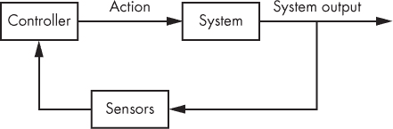
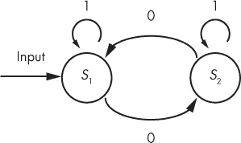
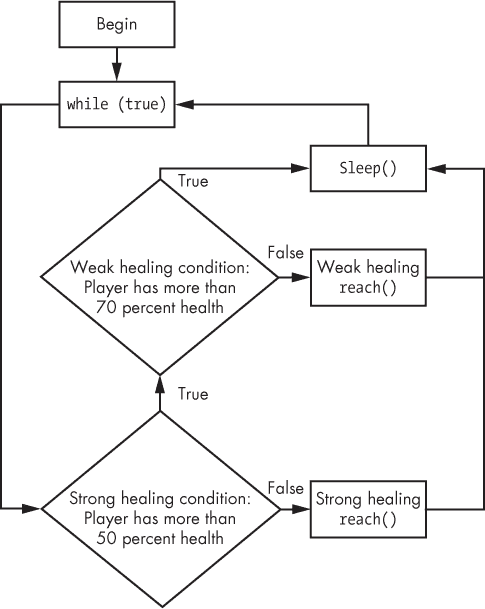
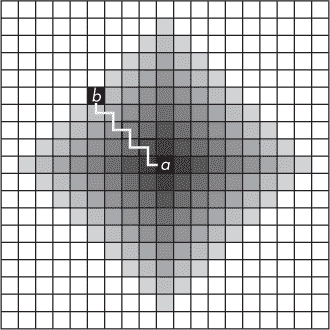
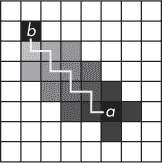
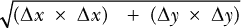

## 第十一章：11

**将所有内容整合：编写自动化机器人**


游戏黑客的最终目标是制作一个功能完善的自动化机器人，能够连续数小时玩游戏。这些机器人可以治疗、喝药水、打怪、掠夺尸体、四处走动、出售战利品、购买补给等等。要制作出如此强大的机器人，需要将你的挂钩和内存读取与控制理论、状态机和搜索算法等概念结合，这些内容在本章中都有涉及。

在这里的课程中，你还将学习常见的自动化黑客以及它们在高层次上应该如何表现。在讲解了自动化黑客背后的理论和代码后，我将从高层次上向你展示两种依赖于此类代码的机器人类型：*洞穴机器人*，它们可以探索洞穴并带回战利品；*战争机器人*，它们可以为你与敌人作战。到本章结束时，你应该准备好拿出你的工具，启动开发环境，开始制作一些非常酷的机器人。

### 控制理论与游戏黑客

*控制理论* 是一门工程学科，提供了一种控制动态系统行为的方法。控制理论使用*传感器*确定*系统*的状态，然后由*控制器*确定一组行动，来将系统的当前状态转变为另一个期望的状态。在控制器执行该行动集合中的第一个动作后，整个过程—称为*反馈回路*—会重复（参见图 11-1）。



*图 11-1：控制理论反馈回路*

让我们将这个反馈回路应用到游戏黑客中。为了在游戏（系统）中实现自动化玩法，机器人实现一些算法（控制器），它们能够理解如何在内存读取、网络挂钩等所观察到的任何状态下进行游戏（传感器）。控制器通常有一些人类输入，比如行走的路径、攻击的生物和要拾取的战利品。因此，为了达到期望的状态，控制器必须执行一些子集的输入，这些输入在当前状态下是可能的。

例如，如果屏幕上没有生物，也没有尸体可以掠夺，那么期望的状态可能是玩家到达下一个位置（称为*路径点*）。在这种情况下，控制器会在每次迭代中将玩家向路径点推进一步。如果玩家遇到一个生物，控制器可能会在第一帧决定攻击这个生物，接下来的帧中则在逃跑（称为*拉扯*）和向其施放法术之间切换。一旦生物死亡，控制器会执行一系列操作来掠夺尸体并继续前往下一个路径点。

鉴于反馈回路可能如何运作的这个例子，编写这样一个系统可能看起来令人不知所措。幸运的是，有一些设计模式使得这项任务比听起来要容易得多。

### 状态机

*状态机*是计算的数学模型，用来描述系统如何基于输入行为。图 11-2 展示了一个简单的状态机，它读取一组二进制数字。机器从初始状态*S*[1]开始。在遍历输入中的数字时，它会相应地改变自己的状态。在这种情况下，当机器遇到 1 时，状态*S*[1]和*S*[2]会自我重复，并且当遇到 0 时，它们会彼此激活。例如，对于二进制数字 11000111，状态转换将是*S*[1]、*S*[1]、*S*[2]、*S*[1]、*S*[2]、*S*[2]、*S*[2]，最后是*S*[2]。



*图 11-2：一个简单的状态机*

通过对经典状态机理论稍作修改，状态机可以作为控制理论反馈回路中的控制器。这个修改后的状态机包括一组状态、每个状态的标志条件，以及为了到达每个状态而必须执行的动作。

**状态机与游戏黑客**

游戏黑客状态机不仅必须保持内部状态，还必须根据该状态响应（或*激活*）游戏环境。整体游戏状态可以根据你的机器人动作、其他玩家的行为以及游戏环境中其他不可预测的事件发生变化。因此，试图基于观察到的游戏环境持久地遍历一个状态机是徒劳的；几乎不可能为每个状态创建一组转换来应对每次迭代中可能发生的每个观察结果。更合理的做法是，让状态机每次在考虑输入时重新评估游戏环境，就像一个全新的起点。为了做到这一点，状态机必须使用游戏环境本身作为状态之间转换的机制——也就是说，机器对环境的激活应对下一次迭代产生足够的影响，从而激活新的状态。可以设计出能够像这样工作的经典状态机，但我们将简化它们，以更简单但仍然非常强大的方式使用它们。

如果你熟悉经典状态机，可能觉得这不太直观，但在接下来的章节中，你将看到状态机如何变异并与控制理论结合，以实现我们想要的效果。

主要的区别在于，游戏自动化状态机中的每个状态并不是简单地激活另一个状态，而是机器人将在游戏中执行改变游戏整体状态的动作，从而改变下次反馈回路迭代时检测到的状态。在代码中，表示这个状态机中某个状态的对象可能看起来像这样：

```
class StateDefinition {
public:
    StateDefinition(){}
    ~StateDefinition(){}
    bool condition();
    void reach();
};
```

你可以将`StateDefinition`对象通过一个简单的`std::vector`定义组装成一个状态机，像这样：

```
std::vector<StateDefinition> stateMachine;
```

于是，状态机的骨架就完成了，准备好接收你创建的任何`StateDefinition`对象。配合反馈循环，这个状态机可以用来定义自动化的流程。

首先，你可以创建一个定义列表，模型化你的机器人期望的行为，并按照重要性顺序排列。在该列表中的每个`StateDefinition`对象都可以使用来自传感器的信息作为输入，将这些数据传递给`condition()`函数，以判断是否应激活该状态。然后，你可以创建一个控制器，遍历状态列表，调用第一个`condition()`函数返回`false`的状态的`reach()`函数。最后，你可以将控制器包裹在反馈循环中。如果你还不明白这个反馈循环是如何工作的，别担心；我现在会向你展示如何编码实现。

**注意**

*你可以将`condition()`* *函数中的语句看作是机器转移到下一个状态的条件。如果该语句为真，则意味着在评估列表中的下一个状态并继续迭代循环之前，不需要执行任何激励。如果该语句为假，则意味着必须执行某些激励，才能发生状态转移。*

你将在本书源文件的*GameHackingExamples/Chapter11_ StateMachines*目录中找到以下部分以及“错误修正”的所有示例代码，代码位于第 230 页。所包含的项目可以使用 Visual Studio 2010 编译，但它们也应该能在任何其他 C++编译器上运行。如果你想跟着一起做，可以从* [`www.nostarch.com/gamehacking/`](https://www.nostarch.com/gamehacking/)*下载并编译它们。

### 结合控制理论与状态机

要将状态通过反馈循环连接起来，首先你需要为每个`StateDefinition`对象提供一种通用的方式来访问你实现的传感器和执行器。`StateDefinition`类随后变成以下形式：

```
class StateDefinition {
public:
    StateDefinition(){}
    ~StateDefinition(){}
    bool condition(GameSensors* sensors);
    void reach(GameSensors* sensors, GameActuators* actuators);
};
```

这个变化只是简单地修改了`condition()`和`reach()`函数，使其能够接受`GameSensors`和`GameActuators`类的实例作为参数。`GameSensors`和`GameActuators`是你需要定义的类；`GameSensors`将包含从游戏中拦截的内存读取、网络挂钩和其他数据源的结果，而`GameActuators`将是一个包含可执行游戏内动作的函数集合。

接下来，你需要一种通用的方式来定义每个独立的状态。你可以将每个状态的定义抽象为一个继承自`StateDefinition`并实现`condition()`和`reach()`虚函数的类。或者，如果源代码需要适应有限空间（比如书籍，*眨眼*），你可以保持使用单一类来表示每个定义，并使用`std::function`在类定义外部实现`condition()`和`reach()`函数。

根据那个替代方法，`StateDefinition`的最终版本会如下所示：

```
class StateDefinition {
public:
    StateDefinition(){}
    ~StateDefinition(){}
    std::function<bool(GameSensors*)> condition;
    std::function<void(GameSensors*, GameActuators*)> reach;
};
```

使用这个版本的`StateDefinition`类，你可以通过创建该类的实例并将`condition()`和`reach()`分别赋值为与预期行为相对应的函数来定义一个新的状态。

#### *一个基础治疗状态机*

接下来的步骤是定义机器人的实际行为。为了保持示例代码的简洁，假设你正在实现一个自动治疗机器人。这个治疗机器人有两种治疗方法：当玩家的血量低于或等于 50%时使用强治愈，当玩家的血量在 51%到 70%之间时使用弱治愈。

一个表示这种行为的状态机需要两个状态，一个用于强治愈，另一个用于弱治愈。首先，你需要将状态机定义为一个包含两个`StateDefinition`对象的向量：

```
std::vector<StateDefinition> stateMachine(2);
```

这段代码创建了一个名为`stateMachine`的状态机，并使用两个空的`StateDefinition`对象初始化它。接下来，你为这些状态定义了`condition()`和`reach()`函数。强治愈状态是最重要的，因为它防止角色死亡，因此应该在向量中排在第一位，正如列表 11-1 所示。

```
   auto curDef = stateMachine.begin();
   curDef->condition = [](GameSensors* sensors) {
➊     return sensors->getHealthPercent() > 50;
   };
   curDef->reach = [](GameSensors* sensors, GameActuators* actuators) {
➋     actuators->strongHeal();
   };
```

*列表 11-1：强治愈状态的代码*

这段代码首先创建了一个名为`curDef`的迭代器，指向`stateMachine`向量中的第一个`StateDefinition`对象。然后定义该对象的`condition()`函数➊；用英文表达就是，“如果玩家的血量百分比大于 50%，则满足该状态。”如果状态没有满足，则该对象的`reach()`函数调用`strongHeal()`角色函数➋，以便执行强治愈。

定义了强治愈状态后，接下来你定义弱治愈状态，正如列表 11-2 所示。

```
   curDef++;
   curDef->condition = [](GameSensors* sensors) {
➊     return sensors->getHealthPercent() > 70;
   };
   curDef->reach = [](GameSensors* sensors, GameActuators* actuators) {
➋     actuators->weakHeal();
   };
```

*列表 11-2：弱治愈的代码*

在将`curDef`递增，使其指向`stateMachine`向量中的第二个`StateDefinition`对象之后，这段代码定义了该对象的`condition()`函数➊为：“如果玩家的血量百分比大于 70%，则满足该状态。”它还定义了该对象的`reach()`函数为`actuators->weakHeal()`调用➋。

一旦完成了状态机的定义，你必须实现控制器。由于控制器的实际行为包含在状态机中，你只需添加一个简单的循环来完成它：

```
for (auto state = stateMachine.begin(); state != stateMachine.end(); state++) {
    if (➊!state->condition(&sensors)) {
        state->reach(&sensors, &actuators);
        break;
    }
}
```

这个控制器循环遍历状态机，执行第一个`condition()`函数返回`false`的状态的`reach()`函数➊，如果任何`reach()`函数被调用，就会跳出循环。最后一步是实现反馈循环，并将控制器循环放入其中，正如列表 11-3 所示。

```
while (true) {
    for (auto state = stateMachine.begin();
         state != stateMachine.end();
         state++) {
        if (!state->condition(&sensors)) {
            state->reach(&sensors, &actuators);
            break;
    }
    Sleep(FEEDBACK_LOOP_TIMEOUT);
}
```

*列表 11-3：最终的治愈状态机和反馈循环*

这个循环持续执行控制器循环，并在每次执行之间暂停 `FEEDBACK_LOOP_TIMEOUT` 毫秒。`Sleep()` 调用允许游戏服务器接收并处理上一次迭代的任何操作，并允许游戏客户端在执行下一个控制器循环之前接收来自服务器的操作结果。

如果你对我刚才展示的内容还有点困惑，可以查看图 11-3，它展示了清单 11-3 中无限循环的代码如何工作。首先，它检查强治疗条件是否为 `true`，如果是，则检查弱治疗条件。如果强治疗条件为 `false`，那么玩家的健康必须处于或低于 50%，于是调用强治疗方法。如果弱治疗条件检查为 `false`，则玩家的健康必须在 51% 到 70% 之间，于是执行弱治疗方法。



*图 11-3：治疗状态机和反馈循环的流程图*

在任一方法后，机器会进入休眠状态。如果两个条件检查都为 `true`，则玩家无需治疗。机器不会更改状态，进入休眠状态后再次从 `while` 循环的顶部开始。

#### *一个复杂的假设状态机*

治疗状态机中实现的行为很简单，因此将其融入这种控制结构可能显得有些过度，但如果你想扩展控制器，它是非常有用的。例如，如果你想将治疗状态机与我在《控制理论与游戏黑客》中讨论的“走路、攻击、拾取战利品”行为结合起来（见第 222 页），控制结构将会复杂得多。我们来高层次地看看你需要的状态：

**强治疗** 如果健康值超过 50%，则满足条件。通过施放强治疗法术来达到。

**弱治疗** 如果健康值超过 70%，则满足条件。通过施放弱治疗法术来达到。

**攻击法术** 如果没有目标可用，或者攻击法术正在冷却，则满足条件。通过向目标施放攻击法术来达到。

**牵制怪物** 如果没有目标可用，或者与目标的距离足够，则满足条件。（“足够”的定义取决于你在牵制敌人时希望与敌人的距离有多远。）通过远离目标迈步来达到。

**目标怪物** 如果没有可攻击的生物，则满足条件。通过攻击一个生物来达到。

**拾取战利品** 如果没有打开的尸体，或者打开的尸体没有任何可以拾取的物品，则满足条件。通过从打开的尸体中取出物品来达到。

**接近尸体** 如果没有可以打开的尸体或接近一个尸体，则满足条件。通过向将要被打开的尸体迈步来达到。

**打开尸体** 如果角色没有接触到一个可以打开的尸体，则满足条件。通过打开相邻的尸体来达到。

**跟随路径** 如果角色无法移动到当前航点，或者站在当前航点上，则满足该条件。通过向当前航点迈步来到达。

**前进航点** 如果没有剩余的航点可供跟随，则满足该条件。通过将当前航点更新为列表中的下一个航点来到达。如果角色由于某些原因（例如卡住）无法到达当前航点，则前进航点状态可以防止其卡住。如果角色已经到达当前航点，前进航点会选择下一个航点，确保进度继续推进。

这个状态机比仅用于治疗的状态机复杂得多。如果我画出这个状态机的图表，图表中将有 23 个对象，箭头连接 33 条控制路径。相比之下，图 11-3 只有 7 个对象和 9 条控制路径。

你可以在不使用状态机或反馈循环的情况下编写治疗者行为，但我无法想象如何轻松地对这个完整功能的机器人做同样的事情。这些 10 个状态不仅依赖于各自的条件，还依赖于前面每个状态的条件。此外，硬编码逻辑将需要大量嵌套的`if()`语句或一堆堆叠的`if()`/`return()`语句——无论哪种方式，它都将像状态机一样工作，但没有运行时的灵活性。

*运行时灵活性* 指的是状态机的变异能力。与硬编码条件检查不同，状态机中的状态定义可以动态移动、移除和添加。状态机方法使你能够根据用户输入，灵活地插拔不同的行为和功能。

更进一步，你可以将传感器和执行器暴露给 Lua 环境，创建能够添加和移除状态的 Lua 函数，并修改`StateDefinition`，使其`condition()`和`reach()`函数能够调用 Lua 环境暴露的 Lua 函数。通过这种方式编写控制系统，可以让你在 C++中编写机器人的核心部分（钩子、内存读取、执行），同时让 Lua（作为一种高级动态语言）为你提供自动化功能。

**注意**

*你可以通过包含一些头文件并链接 Lua 库，将 Lua 嵌入到你自己的程序中。这个过程并不困难，但超出了本书的范围，所以我鼓励你查看*《Lua 程序设计》*（作者：Roberto Ierusalimschy）第二十四章* ([`www.lua.org/pil/24.html`](http://www.lua.org/pil/24.html)) *以获取更多信息。*

#### *错误修正*

另一种对游戏黑客有用的控制理论是*错误修正*。控制器中的错误修正机制观察执行结果，将结果与预期结果进行比较，并调整未来的计算，以使后续结果更接近预期结果。错误修正对于处理*随机系统*时非常有用，在这些系统中，给定输入生成的输出无法完全预测。

游戏整体是随机的，但幸运的是，对于游戏黑客来说，动作的结果大多是确定的。以治疗控制器为例。在大多数游戏中，你可以准确计算出通过给定法术能够恢复多少生命值，从而知道何时进行治疗。但试想一下，你正在编写一个治疗器，用于处理一些无法计算的治疗情况；例如，可能机器人需要在没有用户输入的情况下，适应各种不同级别的角色。

错误修正可以让你的机器人学会如何最好地治疗玩家。在这种情况下，你可以实现错误修正的方式有两种，每一种都取决于治疗系统的工作原理。

##### 调整恒定比例

如果你以恒定的比例进行治疗，你只需要在第一次治疗后调整你的控制器。假设你的传感器能够检测你恢复了多少生命值，这只需要几行代码。你可以轻松地将 Listing 11-2 中的微弱治疗状态修改成像这样的代码：

```
curDef->condition = [](GameSensors* sensors) -> bool {
    static float healAt = 70;
    static bool hasLearned = false;
    if (!hasLearned && sensors->detectedWeakHeal()) {
        hasLearned = true;
        healAt = 100 - sensors->getWeakHealIncrease();
    }
    return sensors->getHealthPercent() > healAt;
};
```

与其硬编码`70`作为微弱治疗的阈值，不如将阈值移动到一个名为`healAt`的静态变量中。它还添加了另一个静态变量`hasLearned`，这样代码就能知道何时学习完成。

每次调用此`condition()`函数时，代码会检查两个条件：`hasLearned`是否为`false`，以及传感器是否检测到微弱的治疗事件。当这个检查通过时，代码会将`hasLearned`设置为`true`，并更新`healAt`以在完美百分比处或以下进行治疗；也就是说，如果你的微弱治疗使生命值增加了 20%，那么`healAt`将被设置为 80%而不是 70%，这样每次治疗都会将玩家的生命值恢复到 100%。

##### 实现可调节的错误修正

但如果你的治疗能力增加了呢？如果一个角色可以升级、分配技能点或者增加最大生命值，那么他能恢复的生命值也可能相应变化。例如，如果你让一个 10 级的角色作为机器人的起始角色，并让它运行到 40 级，你的治疗代码就需要适应变化。一个 40 级的角色如果按照 10 级的治疗方式来治疗，将会造成极度过度治疗，或者在与同级敌人作战时快速死亡。

为了处理这种情况，机器人需要不断更新其治疗阈值，以反映观察到的治疗量。清单 11-4 展示了如何修改清单 11-1 中的强治疗条件函数来实现这一点。

```
   curDef->condition = [](GameSensors* sensors) -> bool {
       static float healAt = 50;
➊     if (sensors->detectedStrongHeal()) {
          auto newHealAt = 100 - sensors->getStrongHealIncrease();
➋         healAt = (healAt + newHealAt) / 2.00f;
➌         sensors->clearStrongHealInfo();
       }
       return sensors->getHealthPercent() > healAt;
   };
```

*清单 11-4：调整强治疗条件代码*

和修改后的弱治疗函数一样，治疗阈值已被移到一个名为`healAt`的静态变量中，但这次逻辑稍有不同。由于学习必须不断进行，因此没有变量来跟踪机器人是否已经学习到其真实的治疗能力。相反，代码只是检查自上次调用以来，传感器是否已经检测到过一次强治疗事件 ➊。如果是，代码将`healAt`替换为`healAt`和`newHealAt`的平均值，并调用一个函数清除与强治疗相关的传感器信息 ➌。

清除传感器实际上非常重要，因为这可以防止代码因相同的强治疗技能反馈而不断更新`healAt`。还需要注意的是，这个函数并不会将`healAt`更新为一个完美值，而是将其滑向观察到的最佳值。这种行为使得新函数非常适合在治疗量有一定随机性的情况下使用。如果你的机器人需要更快地滑向新值，你可能需要将➋处的代码改成如下形式：

```
healAt = (healAt + newHealAt * 2) / 3.00f;
```

这段更新`healAt`的代码使用了一个加权平均值，偏向于`newHealAt`值。然而，使用这种方法时有几点需要注意。首先，当你治疗过度时会发生什么？在一些游戏中，当你治疗到满血时，传感器可能只能检测到你实际治疗了多少。在其他游戏中，传感器可能能够检测到实际治疗的量。换句话说，如果你从 85%的血量施放了一个 30%的强治疗，你的传感器看到的是 30%还是 15%的治疗量？如果答案是 30%，那么你已经准备好了。如果答案是 15%，你的代码需要有办法进行调整。

调整的方法之一是，当你的传感器检测到治疗使你恢复到满血时，减少`healAt`，像这样：

```
   curDef->condition = [](GameSensors* sensors) -> bool {
       static float healAt = 50;
       if (sensors->detectedStrongHeal()) {
➊         if (sensors->getStrongHealMaxed()) {
               healAt--;
           } else {
               auto newHealAt = 100 - sensors->getStrongHealIncrease();
               healAt = (healAt + newHealAt) / 2.00f;
           }
           sensors->clearStrongHealInfo();
       }
       return sensors->getHealthPercent() > healAt;
   };
```

这段代码与清单 11-4 几乎相同，但它增加了一个`if()`语句，用于在检测到最大治疗时减少`healAt` ➊。否则，函数应该像清单 11-4 那样运行。

治愈是一个简单的案例，但这段代码展示了如何使用错误修正动态改进机器人行为的一个很好的例子。另一个更高级的用例是调整技能射击以考虑敌人的移动模式。每个玩家在躲避技能射击时都有一定的模式，因此，如果你的传感器能够测量敌人在躲避技能射击时的方向和距离，你的控制代码可以调整机器人最初发射技能射击的位置。在同样的场景中，学习也能帮助机器人考虑游戏服务器延迟、角色移动速度等差异。

在使用错误修正时，请注意，如果你的状态定义除了静态变量之外有一些内部账务管理，你的代码将更加简洁和便于移植。此外，为了避免状态定义中杂乱无章，我建议将错误修正逻辑封装在一些外部模块中，方便在需要时调用。

### 使用搜索算法进行路径规划

在编写自主机器人时，你常常会面临一个挑战，即计算一个角色从一个位置到另一个位置的路径。除了逆向工程的挑战——创建传感器来读取游戏地图上哪些坐标阻止前进之外，还有计算路径的算法挑战。计算路径叫做 *路径规划*，游戏黑客通常使用 *搜索算法* 来解决这个问题。

#### *两种常见的搜索技术*

给定一个瓦片网格、一个起始位置 *a* 和一个结束位置 *b*，搜索算法计算从 *a* 到 *b* 的路径。该算法通过在 *a* 创建一个 *节点*，将与 *a* 邻近的节点添加到待探索的瓦片列表（称为 *前沿*）中，更新节点为前沿中最佳的瓦片，并重复此过程，直到节点到达 *b*。不同的搜索算法通过不同的方式选择最佳节点，使用 *成本*、*启发式* 或两者结合。

*Dijkstra 算法* 例如，根据瓦片到 *a* 节点的距离计算瓦片的成本，并选择成本最低的瓦片。想象一个空的二维网格，*a* 位于中间。在遵循 Dijkstra 算法的搜索中，前沿将以围绕 *a* 的圆形模式扩展，直到 *b* 位于圆的边缘，如图 11-4 所示。

*贪心最佳优先搜索* 算法并不通过节点到起点的距离来优先排序，而是使用启发式方法来估算前沿中某个节点到 *b* 的距离。然后，算法会选择估算距离最短的节点。想象一下这个算法在之前的网格中运行；前沿几乎会直接从 *a* 到 *b*，如图 11-5 所示。



*图 11-4：Dijkstra 算法的前沿。较浅的瓦片表示更高的成本。*



*图 11-5：贪心的最佳优先搜索算法的边界。较浅的格子表示较高的代价。*

#### *障碍如何干扰搜索*

一旦向网格中添加障碍物，这些算法的行为差异变得更加明显。例如，如果一堵墙把 *a* 和 *b* 分隔开，Dijkstra 算法总是会找到最快的路径，但代价也很大。围绕 *a* 的圆形边界的半径将等于最终路径的长度；我们把这个半径叫做 *r*。如果没有网格边界限制该边界的扩展，你可以通过计算半径为 *r* 的圆的面积来粗略估算打开的节点数。如果绕过墙的路径是 50 个格子，算法将大约打开 7,854 个格子，计算公式如下：

π × 50² = 7,854

在相同的场景下，贪心的最佳优先搜索会计算出一个次优路径，但打开的格子数会少得多。它的边界扩展过程不容易可视化，而且现在这个问题不重要，因此我不会在这里详细讨论。最终，这两种算法都不完全适合路径寻找问题。最优路径虽然准确，但较慢；而快速路径却不是最优的。

为了快速计算最优路径，你需要将 Dijkstra 算法和贪心的最佳优先搜索结合起来。幸运的是，已经有人做过这件事， resulting 算法就是著名的 *A-star 搜索*（通常简称为 *A**）。

A* 算法通过将一个代价（*g*）和一个启发式函数（*h*）相加来选择节点。这两个值的和称为*得分*。简单来说，得分 = *g* + *h*。像 Dijkstra 算法一样，A* 可以计算从 *a* 到 *b* 的最优路径；而像贪心的最佳优先搜索一样，A* 也能相对快速地完成这一任务。

#### *A* 搜索算法*

现在你已经了解了基础知识，让我们编写代码实现 A* 算法。这个实现将应用于二维网格。最初它不会允许对角线移动，但稍后我会讨论如何修改代码以支持对角线移动。

本节的所有示例代码都位于本书源文件中的 *GameHackingExamples/Chapter11_SearchAlgorithms* 目录下。包含的项目可以使用 Visual Studio 2010 编译，但它们也应该适用于任何其他 C++ 编译器。你可以在 *[`www.nostarch.com/gamehacking/`](https://www.nostarch.com/gamehacking/)* 下载它们并进行编译，跟着一起操作。如果你执行 *Chapter11_ SearchAlgorithms.exe*，你将能够定义自己的 20×20 网格，并观看算法计算搜索路径。

##### 创建 A* 节点

首先，定义一个空的 `AStarNode` 类，如下所示：

```
typedef std::shared_ptr<class AStarNode> AStarNodePtr;
class AStarNode
{
public:
};
```

这段代码定义了 `AStarNode` 类和一个名为 `AStarNodePtr` 的 `std::shared_ptr` 类型定义，以便更方便地创建指向该类的安全指针。接下来，在这个类的公共范围内，声明节点的 x 坐标、y 坐标、代价和节点得分等成员变量：

```
int x, y;
int g, score;
```

此外，你需要一个类型为`AStarNodePtr`的公共成员，用于引用父节点：

```
AStarNodePtr parent;
```

在声明所有成员变量后，声明一个公共构造函数，在实例创建时初始化这些成员，代码如下：

```
AStarNode(int x, int y, int cost, AStarNodePtr p, int score = 0)
    : x(x), y(y), g(cost), score(score), parent(p)
{}
```

现在，为了简化安全指针的创建，添加一个像这样的静态辅助函数：

```
static AStarNodePtr makePtr(
    int x, int y, int cost,
    AStarNodePtr p,
    int score = 0)
{
    return AStarNodePtr(new AStarNode(x, y, cost, p, score));
}
```

这个`makePtr()`函数创建一个新的`AStarNode`实例，并返回被`AStarNodePtr`包装的实例。

让我们总结一下。`AStarNode`类有成员变量`x`、`y`、`g`、`score`和`parent`。当类被构造时，所有这些成员会根据传递给构造函数的值进行初始化，`score`是可选的（因为它仅在创建`AStarNode`实例的副本时使用），如果没有提供则默认为`0`。

接下来，定义一个公共成员函数，用于在给定目标坐标时计算启发式值：

```
   int heuristic(const int destx, int desty) const
   {
       int xd = destx - x;
       int yd = desty - y;
➊     return abs(xd) + abs(yd);
   }
```

这个函数返回*曼哈顿距离启发式*➊，它是一种适用于没有对角线移动的网格的距离计算方法：

|Δ*x*| + |Δ*y*|

要计算允许对角线移动的路径，你需要修改这个函数，使用*欧几里得距离启发式*，其形式如下：



该类还需要一个更新`score`的函数。你可以将这个函数添加到公共作用域，代码如下：

```
#define TILE_COST 1
void updateScore(int endx, int endy)
{
    auto h = this->heuristic(endx, endy) * TILE_COST;
    this->score = g + h;
}
```

现在，当给定目标坐标以计算`h`时，`score`应该变为`g + h`。

总结一下，节点类还需要一个可以计算其所有子节点的函数。这个函数可以通过为每个与当前节点相邻的瓦片创建新节点来实现。每个新节点将当前节点作为它的父节点，因此该类还需要能够创建指向当前节点副本的`AStarNodePtr`。以下是具体的实现方式：

```
   AStarNodePtr getCopy()
   {
       return AStarNode::makePtr(x, y, g, parent, score);
   }
   std::vector<AStarNodePtr> getChildren(int width, int height)
   {
       std::vector<AStarNodePtr> ret;
       auto copy = getCopy();
       if (x > 0)
➊         ret.push_back(AStarNode::makePtr(x - 1, y, g + TILE_COST, copy));
       if (y > 0)
➋         ret.push_back(AStarNode::makePtr(x, y - 1, g + TILE_COST, copy));
       if (x < width - 1)
➌         ret.push_back(AStarNode::makePtr(x + 1, y, g + TILE_COST, copy));
       if (y < height - 1)
➍         ret.push_back(AStarNode::makePtr(x, y + 1, g + TILE_COST, copy));
       return ret;
   }
```

这个函数在（x – 1, y）➊、（x, y – 1）➋、（x + 1, y）➌和（x, y + 1）➍位置创建子节点。它们的`parent`是调用`getChildren`的节点，`g`值是父节点的`g`加上`TILE_COST`。

为了支持对角线移动，函数需要在（x – 1, y – 1）、（x + 1, y – 1）、（x + 1, y + 1）和（x – 1, y + 1）位置添加子节点。此外，如果对角线移动的成本更高——即角色执行此操作所需的时间更多——你还需要做如下处理：

1.  将`TILE_COST`改为`10`。

1.  定义一个常量`DIAG_TILE_COST`，其值为`TILE_COST`乘以时间增加的倍数。如果对角线步骤需要 1.5 倍的时间，`DIAG_TILE_COST`的值将是`15`。

1.  给对角线子节点的`g`值设为父节点的`g`加上`DIAG_TILE_COST`。

为了完成`AStarNode`，声明用于比较两个节点优先级和相等性的运算符。你可以像这样将这些声明放在类外部的全局作用域：

```
➊ bool operator<(const AStarNodePtr &a, const AStarNodePtr &b)
   {
       return a.score > b.score;
   }
➋ bool operator==(const AStarNodePtr &a, const AStarNodePtr &b)
   {
       return a.x == b.x && a.y == b.y;
   }
```

这些运算符允许`std::priority_queue`通过`score`➊对节点进行排序，并且`std::find`通过位置➋来判断节点是否相等。

##### 编写 A*搜索函数

现在你已经完成了`AStarNode`类的编写，可以开始编写实际的搜索函数。首先定义函数原型：

```
template<int WIDTH, int HEIGHT, int BLOCKING>
bool doAStarSearch(
    int map[WIDTH][HEIGHT],
    int startx, int starty,
    int endx, int endy,
    int path[WIDTH][HEIGHT])
{ }
```

原型接受游戏地图的宽度和高度，以及表示地图上阻塞块的值作为模板参数。`doAStarSearch()`函数还接受地图本身（`map`）、起始坐标（`startx`和`starty`）、目标坐标（`endx`和`endy`）以及一个空白地图（`path`），在计算路径完成时填充计算出的路径。

**注意**

*前三个参数是模板参数，因此你可以将它们作为编译时常量传递。我在示例代码中这样做，以允许显式声明`map`和`path`参数的数组大小，并允许通过一个明确的值来标识地图上的阻塞块。在实际应用中，你从游戏中读取的地图将具有动态大小，你可能需要更强大的方式来传递这些数据。*

接下来，`doAStarSearch()`函数需要一个排序好的列表来保存 frontier，并需要一个容器来追踪所有创建的节点，以便在打开某个节点作为不同父节点的子节点时，可以更新已有节点的分数和父节点。你可以按如下方式创建这些容器：

```
std::vector<AStarNodePtr> allNodes;
std::priority_queue<AStarNodePtr> frontier;
```

`frontier`使用`std::priority_queue`定义，因为它可以根据分数自动排序节点。节点容器`allNodes`定义为`std::vector`。

现在，让我们创建第一个节点：

```
auto node = AStarNode::makePtr(startx, starty, 0, nullptr);
node->updateScore(endx, endy);
allNodes.push_back(node);
```

第一个节点是一个无成本的孤立节点，位置为（`startx`，`starty`）。该节点根据`updateScore()`函数返回的值来赋予一个分数，然后被添加到`allNodes`容器中。

有了容器中的节点后，接下来编写 A*算法的核心部分，从一个简单的循环开始：

```
while (true) {
}
```

在没有其他说明之前，本节中的其余代码将按顺序出现在这个循环中。

从这里开始，第一步是检查*目标状态*。在这种情况下，目标是为玩家找到一条路径，通往下一个航点，这发生在`node`对象的位置为（`endx`，`endy`）时。因此，要检查目标状态，程序需要检查`node`是否已经到达这些坐标。以下是该检查的代码：

```
if (node->x == endx && node->y == endy) {
    makeList<WIDTH, HEIGHT>(node, allNodes, path);
    return true;
}
```

当达到目标状态时，程序会向调用者报告`true`并填充`path`为最终路径。现在，假设有一个名为`makeList()`的函数可以为你填充`path`；稍后我会展示这个函数。如果目标状态没有达到，你需要扩展`node`的子节点，这实际上是一个相当复杂的过程：

```
   auto children = node->getChildren(WIDTH, HEIGHT);
   for (auto c = children.begin(); c != children.end(); c++) {
➊     if (map[(*c)->x][(*c)->y] == BLOCKING) continue;
       auto found = std::find(allNodes.rbegin(), allNodes.rend(), *c);
➋     if (found != allNodes.rend()) {
➌         if (*found > *c) {
               (*found)->g = (*c)->g;
               (*found)->parent = (*c)->parent;
               (*found)->updateScore(endx, endy);
           }
       } else {
           (*c)->updateScore(endx, endy);
➍         frontier.push(*c);
➎         allNodes.push_back(*c);
       }
   }
```

在调用 `node->getChildren` 生成可以添加到前沿的节点列表后，代码会遍历每个子节点，忽略掉位于阻塞地块上的子节点➊。接着，对于每个子节点，代码会检查是否已经有一个节点在相同的坐标上被打开➋。如果有，并且现有节点的 `score` 大于新子节点的 `score`，则通过 ➌ 处的 `if()` 语句将现有节点更新为新子节点的 `parent`、`cost` 和 `score`。如果新子节点没有“异母兄弟”，它将直接被添加到前沿 ➍ 和节点列表 ➎ 中。

还要注意，`std::find`使用的是`allNodes`的反向开始迭代器和反向结束迭代器，而不是常规的迭代器➊。这个例子之所以这么做，是因为新的节点会被追加到向量的末尾，重复的节点通常会靠在一起，因此重复的节点通常会更接近向量的末端。（这一步也可以直接针对前沿进行处理，但`std::priority_queue`不允许对节点进行迭代，而且将排序写到内存中会使代码变得过于庞大，不适合打印。）

最终，函数将没有新的子节点可以添加到前沿；以下的 `if()` 语句处理这种情况：

```
   if (frontier.size() == 0) return false;
➊ node = frontier.top();
➋ frontier.pop();
```

这段代码将 `node` 指向前沿中最便宜的节点 ➊，然后将其从前沿中移除 ➋，并让循环继续。如果前沿为空，函数会向调用者返回 `false`，因为没有剩余的节点可以搜索。

##### 创建路径列表

最后，到了实现 `makeList()` 函数的时候：

```
   template<int WIDTH, int HEIGHT>
   void makeList(
       AStarNodePtr end,
       std::vector<AStarNodePtr> nodes,
       int path[WIDTH][HEIGHT])
   {
       for (auto n = nodes.begin(); n != nodes.end(); n++)
➊         path[(*n)->x][(*n)->y] = 2;
       auto node = end;
       while (node.get() != nullptr) {
➋         path[node->x][node->y] = 1;
           node = node->parent;
       }
   }
```

这个函数通过更新 `path` 来包含已关闭节点的列表➊和计算出的路径➋。对于这个例子，值 `2` 代表已关闭的节点，`1` 代表路径节点。程序通过从目标节点开始，沿着父节点一路回溯，直到到达起始节点，来计算路径中的节点，起始节点是一个孤立节点，父节点是 `nullptr`。

#### *A* 搜索特别有用的情况*

确保尝试上一节的示例代码和可执行文件，因为这是你真正了解 A* 搜索行为的唯一方式。在大多数新游戏中，你应该能够直接发送包含目标的包，甚至在地图上模拟点击目标位置，但当你遇到需要计算路径的情况时，你会很高兴自己学过 A*。

实际上，有很多情况下计算路径是非常有用的：

**选择目标**

当你的机器人在选择攻击目标时，你可能需要检查角色是否能真正到达这些目标。否则，如果敌人被困在一个无法到达的房间里，你可能会永远停在原地，尝试攻击他们！

**选择尸体**

当你的抢夺状态决定了要打开哪些尸体时，你可以通过总是优先抢夺最靠近的尸体来进行优化。

**模拟鼠标移动**

很少情况下，一些防护严密的游戏实际上会将游戏内的动作与鼠标移动进行关联，以确保没有机器人在运行。在这种情况下，你可能需要模拟鼠标。通过修改版的 A* 算法，其中屏幕就是地图，没有阻挡的方块，并且节点成本稍作随机化，你可以计算出类似人类的路径，让你的鼠标在模拟移动时跟随这些路径。

**引导怪物**

如果你需要编写代码来引导怪物，你可以实现 A* 算法，目标状态是让所有生物距离你 *N* 单位远。使用本章所示的相同成本机制，调整启发式函数，给接近生物的节点更高的成本。引导怪物并不是一个常见的使用案例，启发式函数需要大量调整，但一旦成功，它的效果非常惊人。有些实现甚至能比人类更好地引导任意数量的怪物！

**预测敌人的移动**

如果你正在编写一个与其他玩家对战的机器人，你可以使用 A* 来预测他们的移动并作出相应的反应。例如，如果你的敌人开始逃跑，你的机器人可以推测他们正在跑向他们的基地，计算他们的路线，并使用法术阻挡他们的路径，甚至传送到他们预计会出现的位置。

这些只是 A* 搜索的一些使用案例，随着你提升机器人的能力，你肯定会发现更多用例。在本章的剩余部分，我将描述一些流行的自动化作弊手段，这些方法可以通过本书中描述的技术来实现。

**A* 搜索的其他用途**

A* 不仅仅是用来计算路径的。通过在 `AStarNode` 类上进行抽象，你可以将同样的算法应用于任何搜索问题。实际上，A* 算法只是在多维数据集上进行加权迭代，直到找到某个目标对象，因此它可以解决任何可以表示为多维数据集的问题。A* 的更高级应用包括下棋和跳棋，甚至在与三维曼哈顿距离启发式函数和深度优先搜索结合时，可以解决魔方问题。遗憾的是，我不会详细介绍这些用例；如果你想深入学习搜索算法，我鼓励你在线上进行更多研究。

### 常见且酷炫的自动化作弊

现在你已经了解了创建高效、自学习机器人的设计模式和算法，是时候了解一些流行的自动化作弊方法，这些方法超出了简单的治疗和路径规划。让我们从高空 10,000 英尺的高度，深入探讨两种类型的机器人。

#### *使用洞窟机器人进行掠夺*

在讨论控制理论、状态机和搜索算法时，我提到了一个洞窟机器人，它可以杀死生物、拾取战利品并在洞窟中行走。洞窟机器人的能力差异非常大。

##### 存储金币与补充物资

如果你希望让角色连续数天进行挂机，你需要一个*存款器*和一个*补充器*。存款器可以将战利品存入你的银行或保险库，而补充器则负责补充你的药水、符文和其他物资。这些功能可以用六个基本状态来描述：

**离开刷怪区** 如果角色处于刷怪区或洞穴，且没有任何物品需要存款，且有足够的物资，则满足此条件。通过离开刷怪区或洞穴来达到此状态。

**前往城镇** 如果角色处于刷怪区或洞穴，则满足此条件。通过从刷怪区或洞穴走到城镇来达到此状态。

**存款** 如果角色处于刷怪区或洞穴，或者角色在城镇中且没有任何物品需要存款，则满足此条件。通过将战利品存入银行或保险库来达到此状态。

**取款** 如果角色处于刷怪区或洞穴，或者角色在城镇中且没有物资需要购买，或者角色有足够的金币购买物资，则满足此条件。通过从银行或保险库取款来达到此状态。

**购买物资** 如果角色处于刷怪区或洞穴，或者角色有足够的物资开始狩猎，则满足此条件。通过购买物资来达到此状态。

**进入刷怪区** 如果角色处于刷怪区或洞穴，则满足此条件。通过走到刷怪区或洞穴来达到此状态。

这些状态应该位于与跟随路径点相关的状态之前（我在《复杂的假设状态机》一书的第 228 页中描述了其中的一些状态）。将它们放在前面可以优先于待在洞穴中的状态，同时仍然允许角色在返回城镇的路上击杀和掠夺怪物。根据你狩猎的位置以及你希望机器人如何表现，你还可以告诉你的目标状态在角色不在刷怪区或洞穴时不要攻击生物，或者你可以在“前往城镇”状态之前增加一个额外的状态，只攻击那些阻挡角色前进道路的怪物。指定这个额外的状态可以提高机器人的效率，因为如果途中遇到的怪物不值得击杀，前往和返回城镇的行程将会更快。

##### 使用角色作为诱饵

另外两个能让你的机器人变得强大的洞穴机器人功能是*诱饵模式*和*动态诱饵*。你不会将这两个功能实现为复杂机器人的实际状态；相反，你会让它们影响机器人的目标选择和行走状态，从而帮助机器人做出决策。

你可以通过路径中的特殊路径点来控制引怪模式，它的代码会告诉你的目标状态只在机器人卡住时才攻击生物，类似于我们之前讨论的从城镇到城镇的行走机制。不同之处在于，引怪模式可以在洞窟中的不同区域打开和关闭，使你可以在攻击怪物之前，将多个怪物群引到特定的位置。这可以使你的机器人更加高效，因为某些类型的角色可能擅长一次性击杀大量怪物。

动态引怪与此相似，但它不是通过路径点在特定位置开启或关闭，而是在怪物不足时自动开启引怪模式。例如，具有动态引怪功能的机器人可能会告诉目标状态，在屏幕上没有五个怪物时，不要攻击任何生物。目标状态将恢复攻击并引导，直到所有五个怪物被击败，然后机器人会切换回引怪模式，直到出现适当数量的怪物群。

然而，如果你的角色足够快，能够跑得过怪物，你需要修改机器人的行走状态，在引怪模式开启并且有生物存在时，走得慢一些。否则，角色会把怪物落在身后而不去击杀它们。你可以通过在状态机定义中添加一个状态，延迟在引怪模式开启且任何生物离得太远时的移动，从而减慢角色的速度。

##### 允许玩家编写自定义行为脚本

几乎每个洞窟机器人都包括一个脚本接口，允许玩家添加自己的行为。你可以实现这个接口来指定自定义的路径点、使用的法术或拾取的物品。在更高级的机器人中，你可能会让目标、拾取、行走和引怪系统尽可能地动态化，这样玩家就可以添加独特的功能。如果你使用 Lua 实现自动化，第三方可以轻松改进和扩展你机器人的功能。

使你的机器人易于编写脚本可以减轻你的工作负担，因为其他玩游戏的程序员可能会发布脚本，以支持新的狩猎点并改进你的自动化功能。这类脚本服务在机器人社区中很常见，玩家经常创建并出售与机器人兼容的专业级脚本。

#### *使用战斗机器人自动化战斗*

另一类自动化机器人用于*玩家对战玩家（PvP）*战斗。这些战斗机器人，或*PvP 机器人*，拥有许多被归类为响应式或 ESP（外部感知）作弊的功能，因为这些机器人专注于响应敌人伤害或法术、揭示隐藏敌人，并为玩家提供信息上的优势。

完全自动化的战争机器人很少见，但我已经简要讨论了如何使用一些自动化技术来制造更智能的治疗机器人，教机器人如何命中更精准的技能射击，并预测玩家的路径以将其阻止。接下来，让我们探讨一些其他有趣的黑科技，它们处于响应式、ESP 和自动化的边缘。

**注意**

*在完全基于 PvP 的游戏中，例如战场或实时策略游戏，某些玩家可能会称这些为*机器人*，因为战争或 PvP 是机器人的唯一目的。*

**自动墙壁机器人**

如果你的角色有一个创建临时墙壁的技能，你可以编写一个机器人，在敌人进入小走廊时自动阻挡他们。通过错误修正，机器人可以学习在敌人之前多远的地方放置墙壁。通过一些非常有创意的工程设计，机器人甚至可以通过检查每个敌人是否在墙壁消失之前成功越过墙壁，来学习哪些敌人能跳过墙壁。

**自动狙击机器人**

对于拥有远程技能或全球执行技能的角色，你可以使用自动化来检测地图对面的敌人何时血量低，并施放技能将其击杀。你还可以使用错误修正，更准确地猜测该如何射击远程技能。如果你无法精确计算伤害数值，错误修正也能帮助机器人判断技能造成的伤害，并相应地调整施法阈值。

**自动风筝机器人**

如果你玩的是一个通过近战攻击造成大部分伤害的输出型角色，你可以实现一个机器人，自动风筝敌人。通过使用一组与洞窟机器人类似的状态，你可以制作一个在你攻击敌人时自动风筝敌人。当你停止锁定敌人时，机器人可以停止风筝。利用 A*搜索，你可以改进风筝机制，避免多个敌人，或者如果你想在攻击时逃跑，可以引导风筝机制回到安全地点，比如你队伍的基地或一个中立位置。

### 结语

到了这个时候，你应该已经准备好开始制作一些相当酷的机器人了。如果你对本章中的技术仍然不完全熟悉，不要担心；最好的学习方法就是直接动手开始编写。利用本书提供的成千上万行示例代码，你可以不用从零开始就能入门，最重要的是，享受其中的乐趣！

在下一章，我将讨论机器人如何隐藏自己，以避开反作弊机制，这些是游戏用来检测和阻止机器人的软件。
