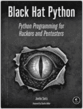
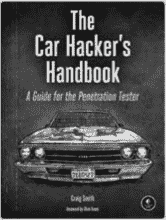
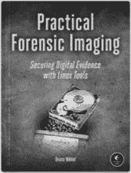
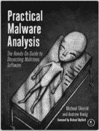

# 第十五章

**资源**

访问 *[`www.nostarch.com/gamehacking/`](https://www.nostarch.com/gamehacking/)* 获取资源、勘误和其他信息。

*更多实用书籍来自*  **NO STARCH PRESS**

**黑帽 Python**

**黑客与渗透测试者的 Python 编程**

*作者*：贾斯廷·塞茨

2014 年 12 月，192 页，$34.95

ISBN 978-1-59327-590-7

**汽车黑客手册**

**渗透测试员指南**

*作者*：克雷格·史密斯

2016 年 3 月，304 页，$49.95

ISBN 978-1-59327-703-1

**IDA Pro 书籍，第 2 版**

**世界上最流行的反汇编器非官方指南**

*作者*：克里斯·伊格尔

2011 年 7 月，672 页，$69.95

ISBN 978-1-59327-289-0

**实用法医成像**

**使用 Linux 工具保护数字证据**

*作者*：布鲁斯·尼克尔

2016 年秋季，256 页，$49.95

ISBN 978-1-59327-793-2

**IOS 应用程序安全**

**黑客与开发者的权威指南**

*作者*：大卫·蒂尔

2016 年 2 月，296 页，$49.95

ISBN 978-1-59327-601-0

**实用恶意软件分析**

**恶意软件分析实践指南**

*作者*：迈克尔·西科尔斯基 *与* 安德鲁·霍尼格

2012 年 2 月，800 页，$59.95

ISBN 978-1-59327-290-6

800.420.7240 或 415.863.9900 | SALES@NOSTARCH.COM | WWW.NOSTARCH.COM
