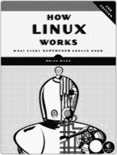
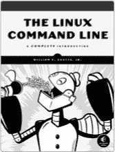
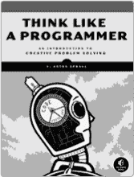
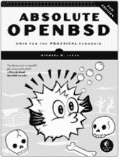
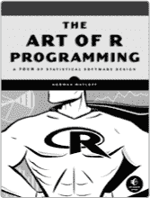

# 附录 A. 更新

访问 *[`nostarch.com/gnumake/`](http://nostarch.com/gnumake/)* 获取更新、勘误和其他信息。

*更多实用的书籍来自*  **NO STARCH PRESS**

**LINUX 编程接口**

**Linux 和 UNIX^® 系统编程手册**

*作者*：MICHAEL KERRISK

2010 年 10 月，1552 页，$99.95

ISBN 978-1-59327-220-3

*精装本*

**如何使用 LINUX，第二版**

**每个超级用户应该知道的事情**

*作者*：BRIAN WARD

2014 年 11 月，392 页，$39.95

ISBN 978-1-59327-567-9

**LINUX 命令行**

**完全介绍**

*作者*：WILLIAM E. SHOTTS, JR.

2012 年 1 月，480 页，$39.95

ISBN 978-1-59327-389-7

**像程序员一样思考**

**创意思维问题解决导论**

*作者*：V. ANTON SPRAUL

2012 年 8 月，256 页，$34.95

ISBN 978-1-59327-424-5

**绝对 OPENBSD，第二版**

**实用偏执的 UNIX**

*作者*：MICHAEL W. LUCAS

2013 年 4 月，536 页，$59.95

ISBN 978-1-59327-476-4

**R 编程艺术**

**统计软件设计巡礼**

*作者*：NORMAN MATLOFF

2011 年 10 月，400 页，$39.95

ISBN 978-1-59327-384-2

**电话：**

800.420.7240 或

415.863.9900

**电子邮件：**

sales@nostarch.com

**网站：**

[www.nostarch.com](http://www.nostarch.com)
