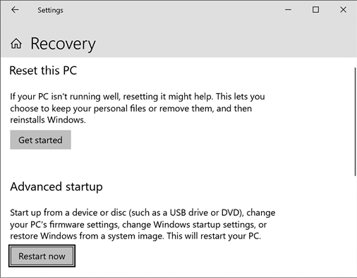
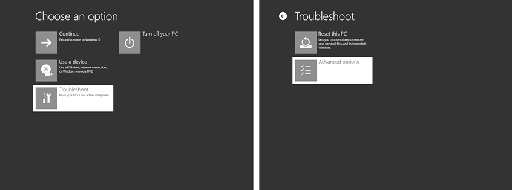
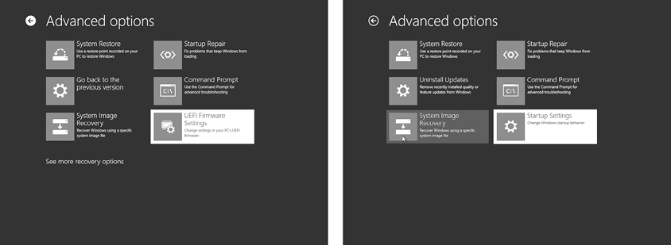

# B

VirtualBox 故障排除

在 VirtualBox 中首次运行虚拟机时，你可能会因为 Mac 或 PC 的不同设置而遇到错误。使用本附录来排查 VirtualBox 设置问题。如果你按照这些步骤操作后仍然遇到问题，可以访问本书的官方网站[`www.nostarch.com/go-hck-yourself/`](https://www.nostarch.com/go-hck-yourself/)获取最新帮助，或者在网上搜索你遇到的具体错误。设置虚拟黑客实验室可能需要几次尝试，但绝对值得！

## Mac 上的 VirtualBox 故障排除

某些 Mac 在首次加载 Kali 虚拟机时可能会显示错误。尝试按照以下步骤修复该错误：

1.  确保你已按第三章的描述正确安装了 VirtualBox 扩展包。

1.  转到**系统偏好设置**▶**安全性与隐私**，然后点击**常规**选项卡。

1.  如果你看到底部有一条消息说 Oracle 软件被阻止加载，点击**允许**。

1.  重新启动 VirtualBox，Kali 虚拟机应该能正常打开。

## Windows 上的 VirtualBox 故障排除

如果 VirtualBox 在 Windows 上运行不正常，你可能需要执行以下操作：

1.  在控制面板中关闭 Hyper-V 选项。

1.  在计算机的 BIOS 或 UEFI 设置中启用虚拟化。

接下来我们会更详细地介绍这两个步骤。完成后，重新启动 VirtualBox 并重试打开 Kali 虚拟机。

### 关闭 Hyper-V 选项

某些版本的 Windows 默认启用了 Hyper-V（微软的虚拟化软件）。如果你想使用 VirtualBox，则需要关闭 Hyper-V。

1.  转到**控制面板**▶**程序**▶**程序和功能**▶**启用或关闭 Windows 功能**。

1.  在设置列表中，取消勾选所有名称中包含 Hyper-V 或 Hypervisor Platform 的选项，如图 B-1 所示。

    图 B-1：关闭所有 Hyper-V 和 Windows Hypervisor Platform 选项

1.  关闭 Hyper-V 和 Hypervisor Platform 设置后，你需要重新启动计算机，然后再运行 VirtualBox。

### 在 BIOS/UEFI 设置中开启虚拟化

如果你已经关闭了 Hyper-V 但仍然无法使用 VirtualBox，你可能需要启用虚拟化支持。要启用虚拟化支持，你需要重新启动并进入电脑的 BIOS 或 UEFI，这是电脑的基本硬件设置。

1.  在 Windows 10 中，转到**设置**▶**更新与安全**▶**恢复**▶**高级启动**▶**立即重启**，如图 B-2 所示。你的电脑应该会重新启动进入高级启动模式。

    图 B-2：从 Windows 10 进入 BIOS

1.  在蓝色启动菜单中，选择**故障排除**并按**回车**。然后选择**高级选项**并再次按**回车**，如图 B-3 所示。

1.  高级选项菜单屏幕包含用于故障排除和修复电脑的有用工具，包括系统还原和启动修复。在此菜单的右下角，选择“**UEFI 固件设置**”或“**启动设置**”选项，如图 B-4 所示。

    图 B-3：访问高级选项菜单

    

    图 B-4：访问 UEFI 固件设置或启动设置

1.  按下 **ENTER** 键，然后点击 **重启**。如果你的电脑使用较新的 UEFI 固件设置，重启时你应该能看到 UEFI 设置菜单。如果你的电脑使用较旧的 BIOS 启动设置，你可能需要按下特定的键才能在重启时进入 BIOS。

1.  一旦进入启动 BIOS 或 UEFI 设置，找到虚拟化设置并启用它们。你可能需要使用箭头键、空格键或回车键来浏览这个看起来有些过时的菜单。每个品牌的 PC 都有略微不同的 BIOS 设置，所以只需寻找类似“虚拟化技术”、“VT-x”或“VT-d”的菜单选项。通常这些选项位于“高级”、“系统”或“CPU”设置下。

1.  启用或打开虚拟化，保存更改，并退出以重新启动进入 Windows。

1.  重启 VirtualBox 并重新打开 Kali 虚拟机。

## 最后一个问题：某些杀毒软件

如果在尝试了所有上述虚拟化设置后，虚拟机仍然无法启动，并且你已经下载并重新安装了正确的 VirtualBox 和虚拟机文件，可能是你的电脑的杀毒软件阻止了 VirtualBox。在线搜索是否有其他人遇到相同问题（我的学生遇到过 WebRoot SecureAnywhere 的问题，还有一些版本的 Avast 和 Symantec），你可能可以为 VirtualBox 添加排除项，以避免杀毒软件阻止它。作为最后的手段，可以尝试使用没有杀毒软件或换一个杀毒程序的电脑。
