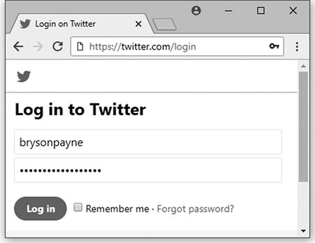
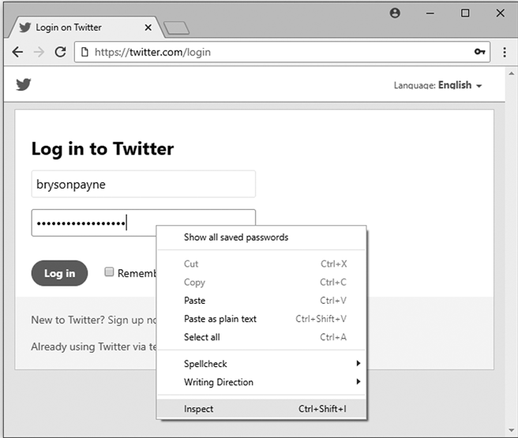
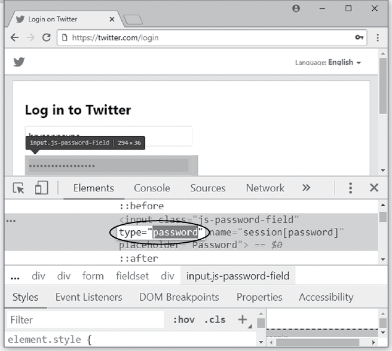
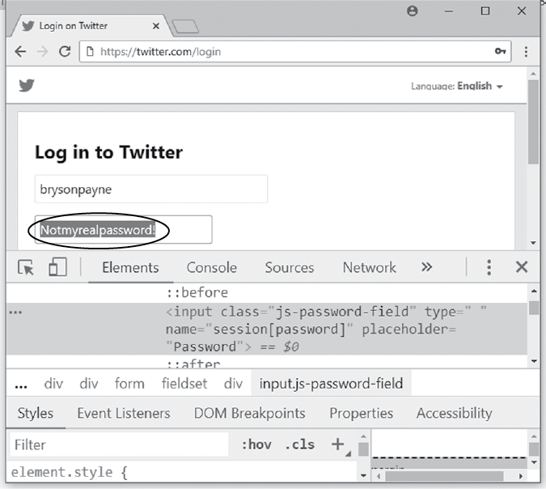

# 第一章：模糊安全

在本章中，你将开始学习如何像黑客一样思考，寻找安全措施中的弱点。你将发现一种简单的技巧，可以揭示隐藏在网页浏览器中的密码。这个技巧之所以有效，是因为网页浏览器通过*模糊安全*来保护密码。

模糊安全是一种通过隐藏事物来保持其安全的技术。在物理世界中，将房门钥匙藏在前门欢迎垫下就是模糊安全的一个例子。你的房子可能*感觉*很安全，但只要有人想到检查垫子下，安全性就会崩溃。

为了安全起见隐藏某些东西并不一定是坏方法，除非这是你采取的*唯一*安全措施。不幸的是，模糊安全往往会失败，尤其是在我们的计算机上。例如，许多用户将密码“隐藏”在计算机上的文本文件或 Excel 电子表格中，或者更糟糕的是，放在键盘下方的便签纸上，或者桌子抽屉里。这些密码比本章中你将破解的密码还容易被找到。同样，一些软件开发人员将模糊处理的密码和其他秘密值硬编码到应用程序中，但一个熟练的黑客通常可以找到并解码这些值。

正如你在本章中所看到的，如果模糊是你唯一的安全手段，那么站在你和一个有动机的入侵者之间的，只是他们花费一些时间和精力来寻找进入的方式。

## 浏览器如何“保护”密码

当你输入密码登录某个在线服务时，比如邮箱或社交媒体账户，你的浏览器通常会用点或星号来隐藏密码。这样，别人从你肩膀上看到的就不是密码。如果你告诉浏览器保存密码，下次你访问该网站时，浏览器会自动在密码框中填入你保存的密码，且仍然以点或星号的形式显示。

这些点或星号是模糊安全的一个很好的例子。你的浏览器并没有加密密码，也没有以任何其他特殊方式保护密码。它只是模糊化密码框中的字符，以防止别人随便窥视。这个技术实际上并不安全。事实上，一个黑客只需要几秒钟的时间，就能在你的键盘上查看密码。

## 揭示模糊的密码

为了揭示浏览器隐藏的密码，我们将使用浏览器的检查工具。这个工具让你查看并临时编辑网页的*源代码*，即指示浏览器如何显示网页的代码。我们将修改源代码中让密码以点或星号显示的部分。完成后，密码将以普通文本的形式显示出来。

这不是一种能够摧毁一个国家或在一举之间泄露数百万人的私人数据的黑客攻击。相反，这个黑客攻击演示了黑客的一个指导原则：以创意的方式使用现有工具——在这个案例中是浏览器的检查工具——来实现特定目标——揭示隐藏的密码。同时，这个黑客攻击还展示了将密码存储在浏览器中的风险，如果攻击者获得了你计算机的物理访问权限。

让我们尝试这个黑客攻击，以 Twitter 登录页面为例。我们将输入一个虚假的用户名和密码，启动浏览器的检查工具，并更新源代码以暴露密码。

1.  打开 Google Chrome 并访问[`twitter.com/login/`](https://twitter.com/login/)。这个黑客攻击在其他浏览器中也适用，但我们为了简便起见使用 Chrome。

1.  在用户名字段中输入你的名字，并在密码字段中输入`Notmyrealpassword!`。*不要*输入你真实的密码。密码将被点号隐藏，如图 1-1 所示。

    图 1-1：Web 浏览器通常用点或星号隐藏密码。

1.  右键单击（或在 Mac 上按 CONTROL 键单击）密码字段并选择**检查**，如图 1-2 所示。检查工具将显示一组代码窗口，应该会在浏览器中打开。由于你右键单击了密码字段来打开检查工具，浏览器应该已经高亮显示了登录页面中创建密码字段的代码部分。

    图 1-2：检查密码代码

1.  在高亮的代码中找到`type="password"`，然后双击单词`password`来选择它，如图 1-3 所示。这段代码就是浏览器识别密码字段的方式。浏览器知道，任何在`password`类型字段中的文本都应该被隐藏。

    图 1-3：在检查工具中找到`type="password"`

1.  高亮显示`password`后，按空格键将`password`替换为空格（`type=" "`），如图 1-4 所示。我们现在已经更改（或黑客化）了密码字段的代码，使得浏览器不再知道它应该是一个密码类型的字段。这应该会显示密码字段中的任何文本！！f01004

    图 1-4：在`type="password"`中替换单词*password*

1.  按 ENTER 键以在浏览器中显示更新后的代码。你现在应该可以看到你输入的密码以普通文本形式显示在浏览器窗口中，如图 1-5 所示。

这个黑客手段之所以有效，是因为`<input>`标签让网页开发者创建密码字段的方式存在安全漏洞——而且这个漏洞已经存在了二十五年。在 1990 年代，当早期的网页开发者将`<input>`标签添加到*超文本标记语言（HTML）*中——这就是让网页能够在浏览器中显示的语言时，他们的唯一安全特性就是通过额外的代码`type="password"`将密码字符替换为点或星号。然而，由于普通的文本框也使用`<input>`标签，我们可以通过使用检查工具将密码输入框变成普通文本输入框，仅需将`type="password"`改为`type=" "`。

图 1-5：密码现在可见。

## 使用和滥用这个黑客手段

我们刚刚执行的这个黑客手段有实际的、道德的应用。由于存储在浏览器中的密码会在网站登录页面自动填充并被隐藏，你可以使用这个简单的黑客技巧来揭示你已经忘记的密码。特别是当你将密码保存在一台计算机上（比如家庭计算机），但有时需要在其他计算机上登录（比如工作计算机、家人计算机或移动设备）时，这特别有用。如果你在尝试在其他计算机上登录时无法记起密码，你可以在家庭计算机上揭示存储的密码并查找它，而不是重置密码。

这个黑客手段也可以在其他方面道德地使用。例如，如果一名员工突然离开公司，公司老板允许的情况下，合格的道德黑客可以使用这个技巧恢复员工可能负责的重要在线账户的密码。

如果你练习足够多次，你可以轻松地在 5 秒钟内执行这个黑客手段。然而，这也意味着，如果你曾将密码保存在公共计算机上，任何有物理访问权限的人只需要 5 秒钟就能盗取密码。黑帽黑客可以走进世界上几乎任何地方的酒店大堂或公共图书馆，坐在计算机前，查看浏览器历史记录中最近访问的网站，看看是否有潜在的受害者在登录私人账户时保存了密码。

你甚至不需要将密码保存在浏览器中，别人也能通过这个方法窃取它。如果你在公共场所，且在输入密码时有人分散了你的注意力，他们可以利用这个黑客手段盗取你的密码。甚至他们可以修复`type="password"`代码并关闭检查工具来掩盖痕迹！如果你为多个账户使用了相同的密码，攻击者现在也能访问这些其他账户。

## 保护你的密码

我们讨论的这个黑客攻击方法，若被恶意使用，显然会对你的密码安全构成风险。然而，有一些简单的方法可以帮助你保护自己。首先，这种攻击只有在黑客能够物理访问存储的密码时才有可能发生，所以预防攻击的关键是：要么完全不在浏览器中存储密码，要么限制以下几点：

1.  密码存储的位置 只在你拥有并随身携带的计算机或设备的浏览器中存储密码，绝不要在公共计算机上存储密码。

1.  哪些密码需要存储 永远不要存储你的电子邮件密码，因为攻击者通常可以通过你的电子邮件账户发现或重置你所有其他的密码。

1.  谁能访问你的计算机 将你的计算机随身携带或存放在安全的地方，如果你必须离开，即便是片刻，也不要让它保持开启状态。

如果你必须在公共计算机上连接私人账户，使用隐身模式（CTRL-SHIFT-N）在 Chrome 中，或者在 Firefox（CTRL-SHIFT-P）或 Safari（SHIFT-⌘-N）中打开新的私人窗口，来限制浏览器中存储的信息。*记得在完成会话后既要退出登录，又要完全关闭浏览器。* 即使你退出登录或使用隐身模式，共享计算机仍然有风险，因为恶意软件可能会记录你的按键或其他信息。（实际上，我们将在第六章通过创建病毒捕捉按键。）只有在绝对必要时，才在公共计算机上登录账户。同时，回到自己的计算机后考虑更改密码。

如果你在公共场所使用个人计算机，确保在离开时退出登录或锁定屏幕——或者最好将计算机随身携带。将锁屏或屏幕保护程序的开启时间设置为几分钟，这样就能在你忘记锁屏时限制计算机暴露的时间。登录计算机时使用强密码或密码短语（尝试四个或更多单词），而不是像*password123*这样明显的密码，这样其他人就不能轻易解锁你的计算机，如果它被无人看管。

除了这些措施之外，你还应当利用其他密码安全工具，如两因素认证和像 KeePass、Dashlane、LastPass 或类似的密码管理器。我们将在第十一章讨论这些工具。

保护自己免受计算机攻击需要采取一些明智的预防措施，但重要的是要知道如何平衡便利性和安全性。将所有的密码存储在浏览器中看起来很方便，因为你无需每次都输入它们，但这也意味着所有有权访问该计算机的人都能窃取你的密码和账户信息。我们必须在现实世界和在线世界中找到便利性与安全性之间的平衡。

## 要点总结

在本章中，你看到通过模糊化实现的安全性是很容易被突破的，因此根本不安全。你学会了如何仅通过几个步骤，在几秒钟内揭示输入到浏览器中的密码。你还学会了在公共或共享计算机上永远不要存储密码的重要性。此外，你现在知道如何将计算机从你不认识或不信任的人那里物理保护起来——如果有人能接触到你的键盘，他们就能访问你的敏感信息。

本章讨论的破解方法是一个物理访问攻击的例子——攻击者需要物理接触你的计算机才能执行它。在下一章，你将了解其他物理访问攻击，这些攻击让黑客能够从你的硬盘驱动器中获取文件，而无需知道你的登录信息。
