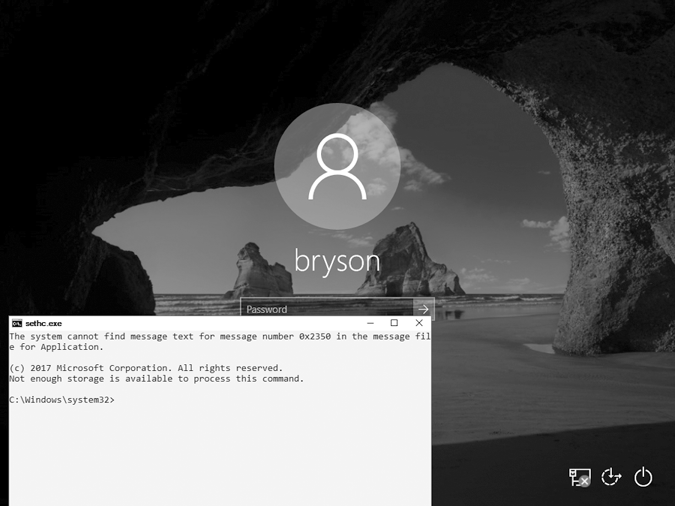
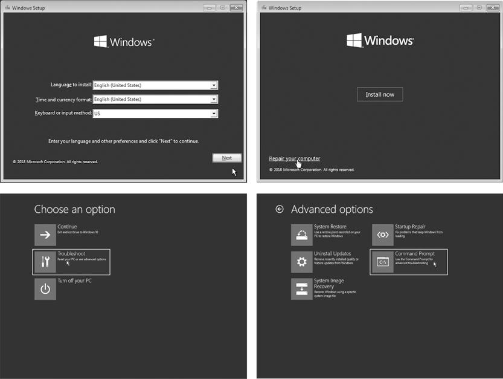
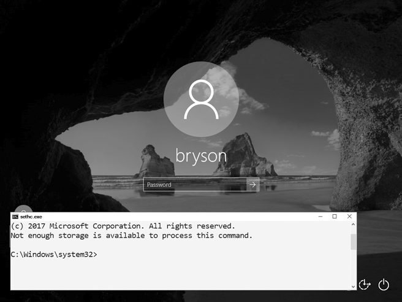
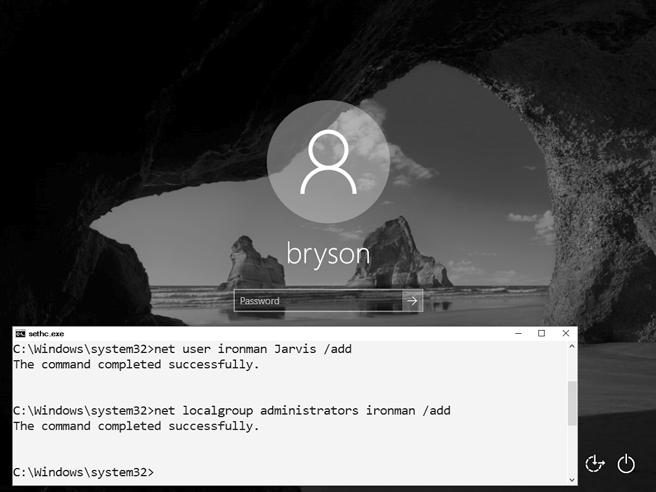
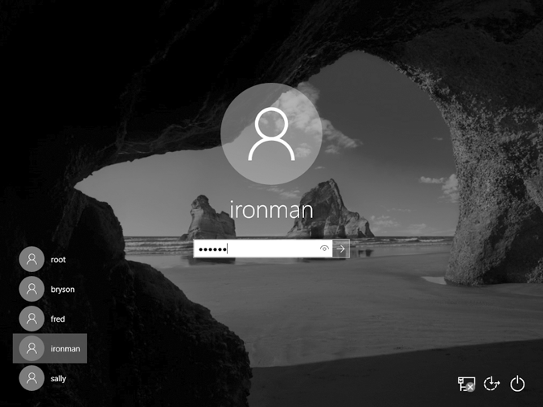
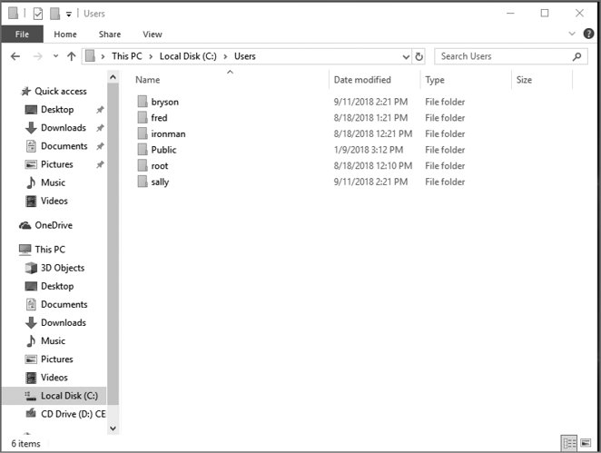
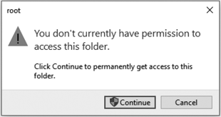
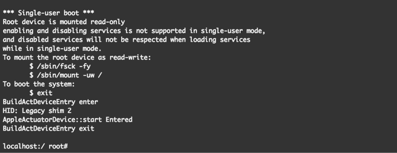
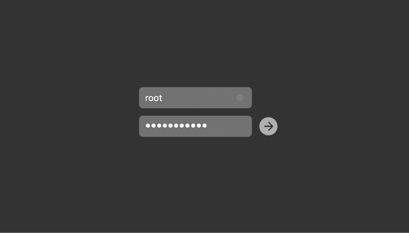

# 2

物理访问黑客攻击


你是否曾在咖啡店里把笔记本电脑放在一边，认为你的私人文件会在登录屏幕后得到安全保护？事实证明，任何具有物理访问权限的人都可以通过几次按键操作，在不需要知道你的登录详情的情况下访问你的文件。在本章中，我将向你展示两种*物理访问黑客攻击*：适用于 Windows 电脑的*粘滞键黑客攻击*和适用于 Mac 的*Mac root 黑客攻击*。这两种黑客攻击都可以让攻击者获得目标计算机的管理员级别访问权限，允许他们窃取文件或更改重要设置。

物理访问黑客攻击可能听起来很可怕，因为攻击者可以在被盗或无人看管的计算机上恶意使用它们。然而，它们也有建设性的应用。家庭和 IT 帮助台的道德黑客使用像粘滞键黑客攻击或 Mac root 黑客攻击这样的技术来恢复那些因密码遗忘而无法访问的文件。如果你有一台放在车库或阁楼的旧电脑，里面有家庭照片或其他重要文档，由于没人记得电脑密码而无法访问，这些黑客攻击可以帮助你恢复。

## 粘滞键黑客攻击

粘滞键是 Windows 的一个功能，它通过允许你依次按键而不是同时按下所有按键，使得发出某些键盘命令（如 CTRL-C 复制或 CTRL-V 粘贴）变得更加容易。粘滞键通过连续按五次 SHIFT 键来触发，甚至可以在 Windows 登录屏幕上启用，在输入用户名或密码之前。

对于这个黑客攻击，我们将用另一个文件*cmd.exe*替换粘滞键程序文件。这样，按下 SHIFT 五次后，启动的将是一个*命令提示符*，而不是通常的粘滞键助手。命令提示符是一个基于文本的程序，允许我们直接在 Windows 中输入命令。通过在登录屏幕上启动命令提示符（见图 2-1），你将能够添加一个新的用户名和密码，给自己管理员级别的访问权限，并访问计算机上的文件，而无需知道该计算机的登录信息！

由于 2019 年或之后更新的 Windows 10 计算机已免受粘滞键黑客攻击，您需要一台旧版 Windows 计算机来亲自尝试这种黑客攻击。您还需要一个 Windows 10 安装光盘或 USB 驱动器。要创建一个，请按照附录 A 中的说明进行操作。

### 从 Windows 10 安装光盘启动

要用命令提示符程序替换粘滞键程序，我们需要通过 Windows 10 安装光盘或 USB 驱动器访问包含这些程序文件的硬盘。一旦你按照附录 A 中的说明创建了安装光盘，插入光盘并重新启动计算机。



图 2-1：粘滞键黑客攻击会启动一个命令提示符窗口，而不是粘滞键助手。

我们需要告诉计算机从光盘或 USB 驱动器加载操作系统，而不是从计算机的硬盘驱动器加载。为此，我们需要访问启动菜单或*基本输入输出系统（BIOS）*，它包含控制计算机启动时基本设置的选项。不同的 PC 制造商和 Windows 版本会导致说明略有不同，但以下步骤结合一些网络搜索，通常能帮助你进入大多数较旧版本的 Windows 计算机：

1.  在 Windows 计算机上，你需要按一个特殊的键才能进入启动菜单或 BIOS。如果启动画面没有显示出在 Windows 启动 logo 出现之前需要按哪个键，重新启动计算机并在启动时迅速按 ESC、DELETE、F8、F9、F10、F11 或 F12。在线搜索“启动菜单”和你计算机的具体型号来找到正确的按键。

1.  如果出现启动菜单，请选择**从 DVD 启动**或**从 USB 启动**选项，使用插入的 Windows 安装光盘启动，然后继续执行第 5 步。

1.  如果启动菜单在几次重启后没有出现，可以尝试进入 BIOS 菜单：关机再开机，并按 DELETE、F2、F9、F10、F12 或 ESC 键。在线搜索“BIOS”和你的计算机型号以找到正确的按键。

1.  进入 BIOS 后，找到启动选项并通过调整启动设备的顺序或优先级（通常使用箭头键）将 USB 或 DVD 设置为首选项。然后保存更改并退出 BIOS。

1.  再次重启计算机。你应该会看到短暂的消息`Press any key to boot from CD or DVD`或`Press any key to boot from USB device`。*立即*按下任意键（例如空格键）以从 DVD 或 USB 启动。

1.  当 Windows 安装光盘启动时，点击**下一步**▶**修复计算机**▶**故障排除**▶**命令提示符**，如图 2-2 所示。菜单顺序或选项名称可能有所不同，但请寻找 Windows 命令提示符。

    图 2-2：使用 Windows 安装光盘访问命令提示符。

1.  一旦进入 Windows 命令提示符（通常是一个黑色的文本窗口），输入`c:`并按**ENTER**键切换到 C:驱动器，如下所示：

    ```
    X:\> `c:`
    ```

1.  输入命令`dir`以查看 C:驱动器上的文件和文件夹列表。寻找一个名为*Windows*的文件夹（它会标记为`<DIR>`，表示*目录*）。

    ```
    C:\> `dir` Volume in drive C is Windows 10 Volume Serial Number is B4EF-FAC7 Directory of C:\*--snip--*
    03/15/2018  02:51 AM    <DIR>            Users
    05/19/2019  10:09 AM    <DIR>            Windows1*--snip--*
    ```

    这个文件夹 1 包含操作系统文件，包括我们需要替换以执行此黑客操作的命令提示符应用程序和 Sticky Keys 程序文件。

1.  如果 C:驱动器中没有*Windows*目录，可以尝试在 D:驱动器中执行相同的操作，输入`d:`然后输入`dir`。如果 D:驱动器中也没有*Windows*目录，继续按字母顺序检查其他驱动器（E:、F:、G:等等），直到找到包含*Windows*目录的驱动器。

### 获取管理员级别访问权限

现在开始用*cmd.exe*命令提示符程序替换*sethc.exe* Sticky Keys 程序。然后我们将能够在计算机上创建一个新的管理员账户。

1.  输入以下三个命令：

    ```
    C:\> `cd \Windows\System32\`
    C:\Windows\System32\> `copy sethc.exe sethc.bak`
    C:\Windows\System32\> `copy cmd.exe sethc.exe`
    ```

    这些命令进入我们可以找到*sethc.exe*和*cmd.exe*的目录，创建 Sticky Keys 程序的备份副本，并用命令提示符程序文件替换原始的 Sticky Keys 程序文件。这样，每当计算机运行*sethc.exe*时，它将打开一个命令提示符窗口，而不是 Sticky Keys 程序。

1.  输入第三个命令后，Windows 会询问你是否要覆盖*sethc.exe*。输入`Y`继续。

1.  移除 Windows 10 安装 DVD 或 USB 并重启计算机。

1.  当 PC 启动到登录屏幕时，按**SHIFT**五次。你应该会看到一个命令提示符窗口弹出，*位于*登录屏幕前，而不是通常的 Sticky Keys 程序，如图 2-3 所示。

    图 2-3：打开命令提示符窗口

1.  在命令提示符窗口中输入以下两个命令：

    ```
    C:\Windows\System32\> `net user ironman Jarvis /add`
    C:\Windows\System32\> `net localgroup administrators ironman /add`
    ```

    第一个命令将一个名为*ironman*的用户账户和密码*Jarvis*添加到 Windows 计算机中。第二个命令将*ironman*用户添加到本地管理员列表中。这意味着当我们以*ironman*身份登录时，我们将拥有对计算机上所有文件的管理员级别访问权限。

1.  当你看到像图 2-4 中的成功消息时，关闭命令提示符。

    图 2-4：我们已经成功将一个名为*ironman*的用户添加为此计算机的管理员。

除了创建新用户账户外，你还可以通过在命令提示符窗口中输入`net` `user`，后跟现有用户名和你想设置的新密码，来重置现有用户的密码——例如，`net` `user` `bryson` `Thisisyournewpassword!`。不过，在没有他人许可和计算机所有者的许可下，切勿重置他人的密码。

### 现在你是管理员了。登录吧！

恭喜！你现在已经以管理员身份访问了这台计算机。继续登录吧。输入`.\ironman`作为用户名（或从账户列表中选择**ironman**，如图 2-5 所示）。在`ironman`前的点和反斜杠告诉 Windows 该账户是本地账户，而不是存储在网络服务器上的账户。输入用户名后，输入密码`Jarvis`。



图 2-5：现在你可以使用*ironman*用户登录到这台 Windows PC。

由于我们将*ironman*用户添加到了本地管理员组中，你应该可以访问*所有*文件和文件夹，包括* C:\Users\*中所有用户的文档，如图 2-6 所示。



图 2-6：作为管理员级别的用户，你可以查看*所有*用户的文件，而不仅仅是你自己的。

当你第一次点击进入其他用户的文件夹时，系统会弹出一条消息，提示你需要权限才能打开其他用户的文件，如图 2-7 所示。由于你是管理员，点击**继续**以授予自己永久访问权限！



图 2-7：管理员可以授权自己访问同一台计算机上任何人的文件。

Sticky Keys 攻击仅在 Windows 机器上有效。然而，运行 macOS 的计算机同样也容易受到物理访问攻击。

## Mac Root 攻击

与 Sticky Keys 攻击类似，Mac root 攻击是一种物理访问攻击，它将授予你管理员级别的计算机访问权限。它会让你成为 *root* 用户，这是 macOS 计算机上的管理员账户。进行此攻击时，你只需要一台 Mac 计算机。我们将以 *单用户模式* 重启 Mac，这是一个故障排除和修复登录模式。在那里，我们可以更改 root 用户的密码，从而获取计算机上所有文件的访问权限。

### 更新 Root 用户设置

1.  首先，Mac 需要完全关机——而不仅仅是睡眠模式。如果它尚未关机，按住电源按钮约六秒钟。

1.  按住 COMMAND-S (⌘-S) 再次按下电源按钮以进入单用户模式。你应该看到一个基于文本的命令行终端窗口，功能非常简单，如图 2-8 所示。

    图 2-8：Mac 单用户模式启动屏幕的一部分

    终端提示符应显示 `root#`（如果在最后一行没有显示，按几次回车，它应该会出现），这表示我们已以 root 用户（或管理员用户）身份登录命令行。

1.  输入以下命令来挂载或连接硬盘：

    ```
    localhost:/ root# `/sbin/fsck -fy`
    localhost:/ root# `/sbin/mount -uw /`
    ```

1.  现在连接到 Open Directory 服务的属性列表，即 *plist*：

    ```
    localhost:/ root# **launchctl load /System/Library/LaunchDaemons/com.apple.opendirectoryd.plist**
    ```

    你的 Mac 使用 Open Directory 来跟踪用户、组、文件共享，甚至 Wi-Fi 打印机。可以将它视为你 Mac 上所有用户账户和权限的目录。

1.  如果在运行前一个命令后遇到错误，请尝试运行以下命令——它与第 4 步相同，但适用于较旧的 Mac：

    ```
    localhost:/ root# **launchctl load /System/Library/LaunchDaemons/com.apple.DirectoryServices.plist**
    ```

1.  现在更改 root 用户的密码。输入以下命令：

    ```
    localhost:/ root# `passwd`
    ```

1.  输入一个新密码。在输入时，你不会看到密码字符出现在屏幕上。然后再次输入密码以确认更改。（如果输入错误，可以再次启动单用户模式并执行相同的操作——每次都会重置 root 用户的密码。）

### 你现在是 Root 用户！

做得好！现在你已经将 root 用户的密码更改为你自己知道的密码，你可以随时以 root 用户身份登录。现在就试试看：在命令行输入 `reboot` 重新启动计算机，或者按下电源按钮关闭电脑再重新开机。当计算机正常启动到 Mac 登录界面时，输入 `root` 作为用户名，并输入你刚设置的新密码，如图 2-9 所示。



图 2-9：在进行 Mac root 破解后，你可以使用在破解中设置的密码以 root 用户身份登录。

点击你看到的任何设置屏幕，你很快就会进入 Mac 桌面。你应该在屏幕顶部的菜单栏中看到自己已作为系统管理员登录。现在你可以访问 Mac 上所有用户的文件和文件夹！

## 其他物理攻击

除了 Sticky Keys 破解和 Mac root 破解，还有许多其他物理访问攻击。事实上，几乎任何可启动的光盘——比如 Ultimate Boot CD、KNOPPIX、SystemRescueCd 或 Trinity Rescue Kit——都可以让你访问你有物理访问权限的计算机硬盘上的文件。还有一些专门制作的黑客工具，如 Rubber Ducky 和 Bash Bunny，它们的价格低于 100 美元，外形像普通的 USB 驱动器，但包含用于黑客攻击计算机的自动化工具。一些物理攻击甚至使用语音命令。例如，Open Sesame! 攻击利用微软的 Cortana 语音助手通过告诉 Cortana 打开 USB 驱动器或网站上的恶意文件，绕过登录屏幕。

## 防止物理攻击

如你所见，物理访问攻击可以帮助你恢复旧照片、复制文件，并在几乎任何可以物理接触的计算机上更改用户，即使没有原始密码。然而，这意味着任何有物理访问权限并知道这些破解方法的人，也可以访问 *你的* 私密文件和信息！这就是为什么将设备随身携带或锁在安全区域非常重要。

然而，如果有人设法访问你的计算机，还是有一些方法可以保护你的数据。其中一种方法是设置 *固件密码*，也叫做 *BIOS 密码* 或 *EFI 密码*。这个选项在 Mac 和大多数 PC 上都可以防止攻击者篡改计算机的 BIOS/UEFI 设置，从而抵消像 Sticky Keys 破解和 Mac root 破解这样的攻击。不幸的是，固件密码只是防御的一层，通常可以被绕过。例如，动机强烈的攻击者可以从你的计算机电路板上移除电池，从而清除大多数 PC 上存储的固件密码。

更为稳妥的做法是*加密*你的文件，将它们转化为一种不可读的形式，只有通过密码才能*解密*（还原）。加密密码与计算机的登录密码不同，因此攻击者无法通过 Sticky Keys 或 Mac root 破解更改你的用户密码，从而查看你加密文件中的内容。我们将在第十一章中更详细地讨论加密。

## 结论

在本章中，你了解了如何使用 Windows Sticky Keys 破解和 Mac root 破解来获得计算机上所有文件和用户账户的管理员级别访问权限，即使你不知道用户名和密码。你还了解到，除了这些方法，还有其他物理破解技术和一些专用工具，比如 Rubber Ducky 和 Bash Bunny，这些工具使物理破解变得更加简单。虽然你可以使用这些破解方法来恢复丢失的文件或重置遗忘的密码，但你也发现，攻击者如果能够物理接触到你的计算机，往往可以访问到你所有的信息。你可以通过限制谁可以访问你的计算机、设置固件密码以及加密你的文件来防御这些破解方法。

现在你已经理解了物理安全的重要性，是时候开始考虑其他可能危害你计算机的攻击了——恶意网站、网络钓鱼和感染的电子邮件附件，甚至是对日常生活中互联网连接智能设备的攻击。为了能够安全地实践这些其他类型的破解，并学习如何防御它们，你将在第三章中建立自己的私人虚拟黑客实验室。
