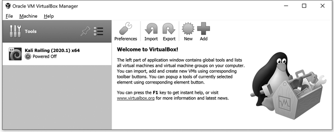
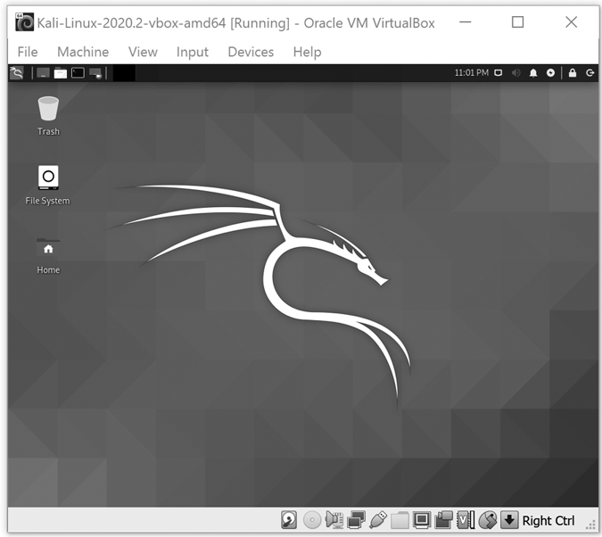
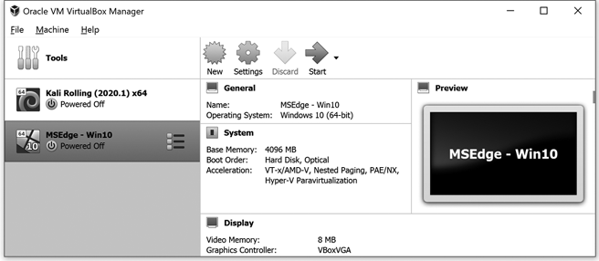
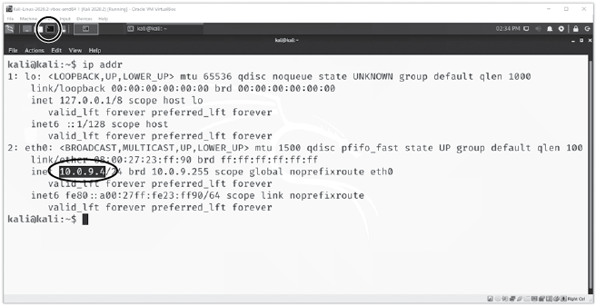
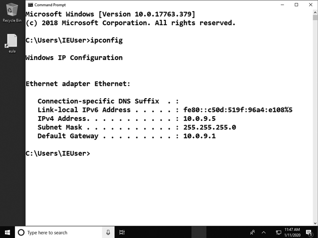

# 构建你自己的虚拟黑客实验室


为了安全和道德地学习黑客技术，你将使用*虚拟机 (VMs)*，这些程序能够在你的物理桌面或笔记本电脑中模拟独立的计算机。你可以隔离一个虚拟机，这样它里做的任何事情都不会影响你的电脑或网络。例如，如果你在虚拟机中打开一个带病毒的文件，病毒只会感染虚拟机，而不会影响你的真实电脑。

*虚拟化软件* 让你能够在桌面或笔记本电脑（*主机*）上运行一个虚拟机（称为*客户机*）。在本章中，我们将安装一个免费的虚拟化程序 VirtualBox 和 VirtualBox 扩展包。然后我们将创建两个虚拟机，第一个将是一个运行 Kali Linux 操作系统的*攻击性*虚拟机，你将使用这个虚拟机发起黑客攻击。另一个虚拟机将是一个运行 Windows 的*目标*虚拟机，你的攻击将指向这个虚拟机。设置好这两个虚拟机后，你将能够安全地尝试黑客工具，而不会影响你的电脑或其他人的电脑。

## 设置 VirtualBox

按照这些指示下载并安装 VirtualBox。

1.  访问 VirtualBox 首页 [`www.virtualbox.org/`](https://www.virtualbox.org/)，点击**下载 VirtualBox**按钮。

1.  VirtualBox 下载页面列出了 Windows、macOS 和多种 Linux 主机操作系统的选项。点击与你的电脑匹配的选项，下载 VirtualBox 的最新版本。

1.  打开下载的文件，按照屏幕上的指示安装 VirtualBox。（Windows 用户应选择以管理员身份运行该文件；你必须具备管理员权限才能运行 VirtualBox。）

除了 VirtualBox 本身，你还需要安装 VirtualBox 扩展包，它增加了诸如支持将较新 USB 设备连接到虚拟机等必要功能。现在就安装它吧。

1.  返回到 VirtualBox 下载页面 ([`www.virtualbox.org/wiki/Downloads`](https://www.virtualbox.org/wiki/Downloads))，找到 VirtualBox 扩展包部分，点击**所有支持的平台**下载扩展包。

1.  打开 VirtualBox。（在 Windows 上，确保右键点击 VirtualBox 图标并选择**以管理员身份运行**。）

1.  打开你在*下载*文件夹中的扩展包。

1.  当 VirtualBox 扩展包安装窗口打开时，点击**安装**。

## 创建 Kali Linux 虚拟机

现在你已经拥有了 VirtualBox，你将创建你的 Kali Linux 虚拟机。Kali 是一个用于全球道德黑客的 Linux 操作系统版本，包含超过 600 个安全和黑客工具，是攻击性虚拟机的完美操作系统。

1.  访问 [`www.kali.org/downloads/`](https://www.kali.org/downloads/)，向下滚动到虚拟机部分，点击链接进入虚拟机下载页面。

1.  点击 **Kali Linux VirtualBox 镜像** 标签，查看与 VirtualBox 兼容的下载选项。确保选择 VirtualBox 镜像——也有为 VMware 制作的镜像，但它是不同的软件包，与 VirtualBox 不兼容。

1.  点击 **Kali Linux VirtualBox 64 位** 下载虚拟机。该文件大约 4GB，建议在网络速度较快的地方进行下载。

1.  启动 VirtualBox 并选择 **文件**▶**导入虚拟设备**。

1.  点击右侧的文件夹图标，找到你的 Kali Linux 文件。选择该文件，点击 **打开**，然后点击 **下一步**（在 PC 上）或 **继续**（在 Mac 上）。

1.  现在你应该能看到正在导入的 Kali Linux 虚拟机的设置列表。点击 **导入** 继续。

1.  当虚拟机导入完成后，你会在左侧的 Oracle VM VirtualBox 管理器中看到它，正如图 3-1 所示。



图 3-1：Kali Linux 虚拟机出现在 VirtualBox 管理器左侧的列表中。

当你添加其他虚拟机时，它们会和 Kali 一起出现在列表中。目前，让我们测试一下新的 Kali 虚拟机，确保它能在你的系统上运行。

## 运行 Kali 虚拟机

双击 VirtualBox 管理器面板中的 Kali Linux 虚拟机条目，启动 Kali Linux 虚拟机。在 VirtualBox 中首次运行虚拟机时，由于你的 Mac 或 PC 上的设置不同，可能会遇到错误。如果你在运行 VirtualBox 或启动 Kali 虚拟机时遇到问题，请参阅附录 B。

当虚拟机启动完成后，你会看到一个登录界面。使用用户名 `kali` 和密码 `kali` 登录。登录后，你会看到带有 Kali 龙标志的界面，像图 3-2 中所示的那样。欢迎使用 Kali Linux！

在计算机中使用计算机需要一些适应。当你点击虚拟机窗口内时，你的键盘和鼠标会被“捕获”用于虚拟机内的操作。要将鼠标和键盘返回到你的物理（主机）计算机上，只需点击虚拟机窗口外部或按下键盘上的 *主机键*。在 PC/Linux 机器上，这通常是 *右侧* CTRL 键，而在 Mac 上是 *左侧* COMMAND 键。如果你需要提示，主机键也应该在虚拟机窗口的右下角标识出来。



图 3-2：你的 Kali Linux 虚拟机已准备就绪！

如果你发现虚拟机的屏幕和图标太小，可以前往 **视图**▶**虚拟屏幕 1** 并尝试更改缩放比例或分辨率。另外，如果你长时间不操作虚拟机，虚拟机窗口可能会变空白。如果发生这种情况，点击 Kali 窗口并按空格键唤醒虚拟机。

花些时间探索 Kali Linux。直到我们在本章后面设置网络之前，你将无法连接互联网，但你仍然可以四处看看。点击屏幕顶部的**应用程序**菜单（带有龙标志的按钮），查看 Kali 提供的数百个程序和工具。它们现在可能看起来有些令人生畏，但本书将教你使用其中的几个，帮助你在探索其他工具时变得更加自信。

在稍微浏览一下之后，关闭 Kali Linux 虚拟机窗口。你应该会看到关闭虚拟机的弹窗。选择**保存虚拟机状态**并点击**确定**。保存虚拟机状态可以让你在下次打开虚拟机时从上次中断的地方继续，就像将计算机置于休眠模式而不是完全关机一样。不过，如果你在安装软件或更改设置后需要重启虚拟机，则需要选择**关闭虚拟机**。

恭喜！你已经设置好了第一个虚拟机！如果这是你第一次使用 Linux，给自己一个掌声！使用这个 Kali 虚拟机，你将能够针对其他目标虚拟机进行数十种（甚至数百种）黑客攻击，以了解在线攻击是如何发生的，以及如何进行防御。接下来我们将设置其中一个目标虚拟机。

## 创建 Windows 虚拟机

现在你将创建第二个运行 Windows 的虚拟机。作为世界上最常见的桌面和笔记本操作系统，Windows 是道德和不道德黑客的主要攻击目标，因此学习如何攻击和防御它是非常重要的操作系统。我们将从 Microsoft Edge 开发者网站下载一个功能完备的 Windows 10 虚拟机。

1.  访问[`developer.microsoft.com/en-us/microsoft-edge/tools/vms/`](https://developer.microsoft.com/en-us/microsoft-edge/tools/vms/)（或搜索 Microsoft Edge 开发者虚拟机网站）。

1.  选择一个 Windows 10 虚拟机，选择 VirtualBox 作为平台，并下载虚拟机。该文件超过 6GB，所以请在网络连接较快的地方下载这个虚拟机。

1.  解压下载的文件。

1.  打开 VirtualBox，选择**文件**▶**导入虚拟机**。

1.  点击右侧的文件图标，找到你的 Windows 10 虚拟机。它可能是 *.ova* 文件或 *.ovf* 文件。选择该文件，然后点击**继续**。

1.  现在你应该能看到 Windows 10 虚拟机的设置列表。点击**导入**继续。

1.  导入完成后，Windows 虚拟机将出现在 VirtualBox 管理器列表中，与 Kali 虚拟机一起显示，如图图 3-3 所示。

    图 3-3：导入 Windows 虚拟机后，你将在你的虚拟道德黑客实验室中拥有两台虚拟机！

现在让我们启动 Windows 10 虚拟机，确保它可以正常工作。双击 VirtualBox 管理器列表中的 Windows 10 虚拟机。一旦虚拟机加载完成，点击窗口内，显示 Windows 登录提示。使用默认用户名`IEUser`和默认密码`Passw0rd!`（其中字母*o*被数字零替代）登录。如果密码不正确，请查看 Microsoft 虚拟机下载页面。默认密码应列在下载按钮下方。

一旦虚拟桌面加载完成，点击四周进行一些探索。它就像一台普通的 Windows 电脑。您目前无法上网，但我们将在下一部分设置虚拟网络。探索完 Windows 虚拟机后，关闭虚拟机并选择**关闭计算机**。您需要完全关闭虚拟机才能更改网络设置。

现在，您在道德黑客实验室中有两台虚拟机，一台是 Kali Linux 虚拟机，另一台是 Windows 10 虚拟机。我们将在后续章节中根据需要添加更多虚拟机。一旦我们将这两台虚拟机连接起来，您就可以在不危及笔记本或台式机的情况下练习黑客攻击和防御。

## 将您的虚拟机连接到虚拟网络

默认情况下，新虚拟机连接到*仅主机网络*，这意味着您只能从主机计算机访问它们。为了将虚拟机彼此连接并连接到互联网，我们将创建一个*虚拟网络*。将您的 Windows 和 Kali 虚拟机连接到虚拟网络就像是将它们连接到同一个 Wi-Fi 网络一样。

1.  在 VirtualBox 中，转到**文件**▶**首选项**（在 Mac 上为**VirtualBox**▶**首选项**）。

1.  转到**网络**选项卡，点击绿色的添加图标（带加号的图标），以创建一个新的虚拟网络。

1.  一个新网络（名称类似*NatNetwork*）应出现在列表中。确保在网络名称旁边的“活动”列下的框被勾选。

1.  选择网络，然后点击设置图标（带黄色齿轮的图标）。

1.  在网络名称框中输入`PublicNAT`，并通过键入**10.0.9.0/24**来更改网络 CIDR 文本框，以设置虚拟机的 IP 地址。

1.  保持选中支持 DHCP 的复选框，然后点击**确定**两次以完成网络创建。

我们的下一步任务是将您的虚拟机连接到您创建的 PublicNAT 网络。

### 连接您的 Kali 虚拟机

我们将从连接您的 Kali 虚拟机到网络并测试连接开始。

1.  在 Oracle VM VirtualBox 管理器中，点击您的 Kali 虚拟机，然后点击**设置**。

1.  选择**网络**选项卡，并从“附加到”下拉列表中选择**NAT 网络**。在“名称”下拉列表中，选择**PublicNAT**。然后点击**确定**保存更改。

1.  启动 Kali 虚拟机，并使用用户名`kali`和密码`kali`登录，如之前所述。

1.  一旦 Kali 虚拟机桌面出现，通过点击屏幕左上角面板中的黑色方框图标（如图 3-4 所示）打开命令行终端程序。

1.  输入命令`ip` `addr`并按**ENTER**查看虚拟机的网络连接信息。

    图 3-4：检查 Kali 虚拟机的 IP 地址

1.  你应该在`eth0:`部分看到一个以`10.0.9`开头的 IP 地址，像图 3-4 中圈出的地址一样。

当 Kali 显示以 10.0.9 开头的 IP 地址时，表示它已连接到 PublicNAT 网络。如果你没有看到像 10.0.9.*x*这样的地址，请转到**机器**▶**重置**重新启动 Kali 虚拟机。虚拟机重启后，再次在终端中运行`ip` `addr`命令。如果仍然没有看到 10.0.9.*x*的 IP 地址，请返回检查你 Kali 虚拟机的网络设置。

### 连接你的 Windows 虚拟机

连接你的 Windows 虚拟机到 PublicNAT 网络的过程几乎与连接 Kali 虚拟机完全相同。

1.  打开 VirtualBox 管理器，选择你的 Windows 虚拟机，点击**设置**。

1.  点击**网络**标签，从"附加到："下拉列表中选择**NAT 网络**，在"名称："下拉列表中选择**PublicNAT**。点击**确定**应用这些设置。

1.  启动你的 Windows 虚拟机，并使用之前的默认密码（`Passw0rd!`）登录。

1.  当虚拟机启动后，点击 Windows 搜索框（位于图 3-5 的左下角），输入`CMD`并按**ENTER**打开 Windows 命令提示符，它类似于 Kali Linux 的终端程序。

1.  输入命令`ipconfig`来检查虚拟机的网络设置。

1.  你应该会看到一个 10.0.9.*x*范围内的 IP 地址，如图 3-5 中圈出的`10.0.9.5`地址。

    如果你的地址以 10.0.9 开头，说明你已成功将 Windows 虚拟机连接到 PublicNAT 网络。如果没有，请转到**机器**▶**重置**重新启动 Windows 虚拟机，再次尝试`ipconfig`命令。如果仍然没有看到 10.0.9.*x*的 IP 地址，请返回检查虚拟机的网络设置。

    

    图 3-5：检查 Windows 虚拟机的网络设置

1.  最后，尝试测试你的网络互联网连接。在 Windows 虚拟机中，打开 Microsoft Edge 浏览器并访问任何网址，比如[`www.nostarch.com/go-hck-yourself/`](https://www.nostarch.com/go-hck-yourself/)。

如果无法访问任何网站，请再重复执行前面的步骤，并尝试关闭并重新启动 Windows 虚拟机。

## 更新你的虚拟机操作系统

现在你的虚拟机已连接到互联网，我们可以更新它们的操作系统，以确保它们能够访问最新的功能。定期更新计算机的操作系统总是个好主意，无论是启用自动更新，还是至少每月检查一次更新。更新操作系统可以保护你免受病毒、黑客和其他网络威胁。这是防范最新网络攻击的最重要措施之一。

### 更新 Kali Linux

按照这些步骤更新 Kali Linux：

1.  启动你的 Kali 虚拟机，再次打开终端命令行应用程序。

1.  在终端提示符下，输入以下命令来查看需要更新的软件：

    ```
    kali@kali:~$ `sudo apt update`
    ```

1.  Kali 在你第一次使用 `sudo` 时会要求输入密码。这个命令是“superuser do”的缩写，允许你以管理员（或 *超级用户*）权限运行命令。输入 `kali` 作为密码并按 **ENTER** 键。

1.  现在使用这个命令来执行更新：

    ```
    kali@kali:~$ `sudo apt upgrade`
    ```

1.  你可能需要按 `Y` 来确认某些更新。随着各个软件包的更新，它们会在终端窗口中列出，后面跟着`Done`消息。

1.  当 `apt` 完成更新 Kali 后，关闭虚拟机并保存虚拟机状态。

### 更新 Windows

接下来我们将更新你的 Windows 虚拟机。

1.  启动 Windows 虚拟机，在 Windows 搜索栏中输入 `updates`，然后从选项列表中选择 **检查更新**。

1.  如果 Windows 有可用的更新，你应该会看到“立即安装”或“立即重启”按钮。点击按钮安装更新。你可能需要重启虚拟机，就像有时你需要为真实电脑安装更新时一样。

1.  在 Windows 虚拟机更新完成后，关闭虚拟机并保存虚拟机状态。

## 重点总结

在这一章中，你设置了 VirtualBox 虚拟化软件，并创建了两台虚拟机，虚拟机软件在你的实际电脑中充当计算机。其中一台虚拟机运行 Kali Linux，将作为你的攻击计算机，而另一台虚拟机运行 Windows，将作为你的目标计算机。你还创建了一个名为 PublicNAT 的虚拟网络，将两台虚拟机连接到互联网并互相连接。然后，你对 Kali 和 Windows 虚拟机进行了更新。

现在你已经设置了一个功能齐全的虚拟黑客实验室。做得好！有了你的两个虚拟机和虚拟网络，你可以安全、合乎道德地尝试各种黑客攻击，而不会影响你的物理电脑。在下一章中，我们将开始通过一些侦察活动来使用你的实验室，看看仅通过搜索引擎和社交媒体能发现什么样的信息。
