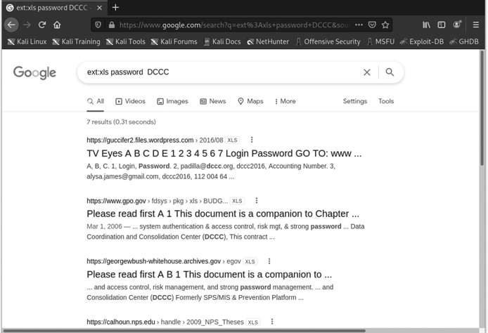
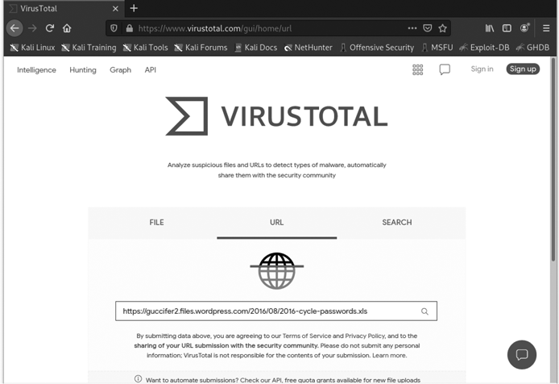
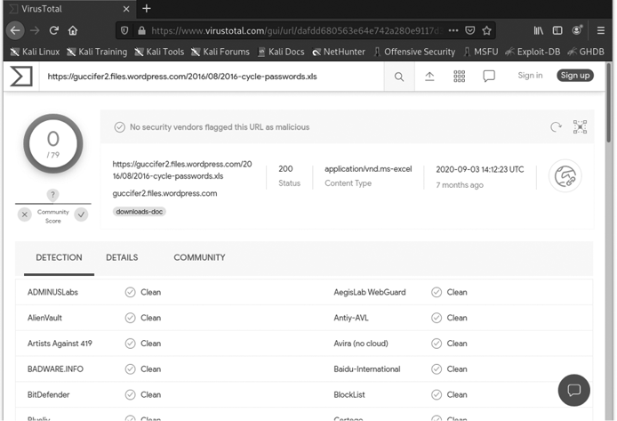
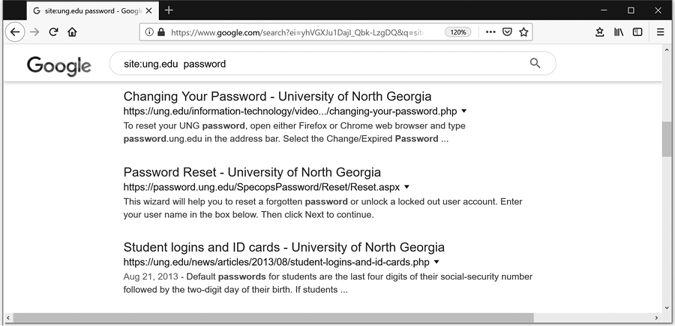
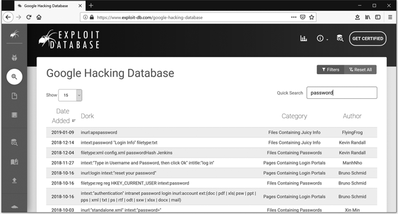
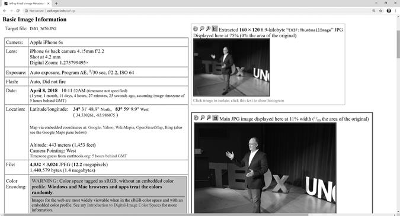

# 在线侦察与自我防护

大多数黑客攻击的第一步是*侦察*，或称为*侦查*。在军事行动中，侦察意味着对敌方领土进行勘察或观察目标。在黑客世界中，攻击者通过在线侦察来收集信息。他们使用常规搜索引擎（如谷歌）、社交媒体平台和专业工具，收集关于公司、网络和个人的信息。然后，他们利用这些信息规划攻击的下一阶段。

在本章中，你将使用谷歌查找关于自己的信息，并通过*谷歌黑客*技术查找用户名和密码。接着，你将通过社交媒体进行进一步侦察，并学习如何通过限制在线共享的信息来保护自己。你不共享的信息，就是攻击者无法利用的信息！

## 谷歌自己（在敌人之前）

攻击者可以利用公开信息进行*钓鱼*攻击，在这种攻击中，他们伪装成你认识的人，发送假邮件要求提供个人信息，如密码。许多公司网站都有员工名单或员工目录，列出了攻击者发起钓鱼攻击或更严重攻击所需的所有姓名和电子邮件地址。

让我们来看看攻击者能从你那里发现什么。打开浏览器，搜索你自己的名字。我在谷歌中搜索了我的名字，如图 4-1 所示。

图 4-1：在你最喜欢的搜索引擎中搜索自己的名字。

互联网上的任何人都可以知道我做什么、在哪里工作，还知道我写过书并发布过编程和网络安全的在线课程。点击结果链接会出现更多信息，包括我 2018 年开的车和一些我的电子邮件地址。类似地，你可能会出现在工作活动、新闻文章、运动队、教堂或非营利组织的照片中，或者出现在社交媒体页面和帖子上。你的名字或图像甚至可能出现在有关你家庭或高中或大学同学聚会的文章中——这些是你没有意识到已经出现在互联网上的内容。

仅仅几分钟的侦察，就可以发现某人的工作地点、住址、年龄、家庭成员等信息。单单其中任何一条信息可能并不会引起太多担忧，但如果足够多的信息被收集，攻击者就能建立一个完整的个人档案，包括家庭成员的姓名和出生日期、宠物的名字、工作地点和住址等。有了这些信息，攻击者可能能够回答你的密码安全问题，完全猜出你的一个密码，或伪装成你认识的人，以进一步从你那里提取更多信息。

保护个人信息比以往任何时候都更加困难，但一些意识上的提高可以帮助你避免一些常见的错误。掌握一些技能也能帮助你找到已经泄露的信息，这些信息可能与你、你的公司或你的家庭相关，包括你的在线账户和密码。

## 高级谷歌搜索

简单的网页搜索是一种不错的侦察方法，但谷歌的真正威力——谷歌黑客技术——来自于使用高级搜索命令。通过高级搜索，你可以找到用户名、密码、安全摄像头视频流等内容。然而，谷歌黑客技术也会让你面临更大的风险，可能不小心下载到恶意软件。为了保护自己，请确保使用以下防护措施：

+   在你在第三章设置的 Kali Linux 虚拟机中进行研究。记住：你在虚拟机中执行的操作通常不会影响你的计算机，因此虚拟机提供了一个安全层。如果你在虚拟机中打开了一个感染的文件，你可以简单地删除并重新安装虚拟机。

+   在点击链接之前，检查是否已被病毒感染。这始终是一个良好的安全措施，即使是在虚拟机内也不例外。VirusTotal 是一个免费的在线工具，可以扫描网页、文件和链接中的恶意软件。我们将在下一部分使用 VirusTotal 扫描一个包含密码的文件，然后再打开它。

+   确保你的计算机已安装杀毒软件，以防你不小心点击了虚拟机外的链接，并且在研究过程中有恶意软件进入你的计算机。

谷歌黑客技术的核心在于*搜索操作符*的巧妙使用，这些符号或单词使你的搜索结果更加精确。你可能已经熟悉一些基本的搜索操作符。例如，使用引号（“ ”）包围一个短语可以搜索该短语的准确内容，而不是短语中的单个单词。使用操作符*AND*和*OR*可以帮助你找到同时包含两个单词的页面（*3D* AND *printer*），或者包含其中任何一个单词的页面（*coding* OR *cyber*）。

其他搜索操作符较为冷门，但它们可以成为强大的黑客工具。例如，`ext:` 操作符用于搜索特定的*文件扩展名*，即不同类型文件的文件名后缀。例如，*docx*表示 Microsoft Word 文档，*txt*表示纯文本文件，*pdf*表示 PDF 文件，*xlsx*表示 Microsoft Excel 表格，等等。`site:` 操作符用于搜索特定网站的结果；你可以搜索 `site:nostarch.com` 或 `site:yourcompany.com`。

黑客知道如何利用这些操作符查找特定类型的文件，这些文件可能包含更有价值的信息，例如存储在摄像头用户手册在线 PDF 版中的某种视频监控摄像头的默认密码。为客户执行侦察的道德黑客可以使用这些有针对性的搜索词帮助公司删除不小心公开在网上的敏感数据，例如显示公司去年购买了哪种视频监控摄像头的预算表格。

### 使用 ext: 操作符查找密码

互联网上充满了敏感信息，如人们的用户名和密码，如果你知道在哪里——以及如何——寻找的话。让我们试着使用`ext:`搜索运算符来寻找包含密码的电子表格。

在你的虚拟机中，打开网页浏览器，访问*https://www.google.com/*，并在搜索框中输入`ext:xls password`，如图 4-2 所示。

记住*不要*点击任何结果，因为一个技术熟练的攻击者可以轻易地将病毒或勒索软件隐藏在一个感染的电子表格文件中（或者让一个感染的网页在搜索引擎中看起来像一个电子表格）。*勒索软件*是一种恶意软件，它会加密你所有的文件并要求你支付赎金才能恢复数据，所以要小心！

你很可能会在搜索页面上找到数十个用户名和密码，并且你可以添加更多的搜索词来进一步精确搜索。例如，我在搜索中加入了 DCCC（民主党国会竞选委员会的缩写），图 4-2 中的顶部结果显示了 2016 年美国大选中的密码，据信这些密码是黑客试图干预 2016 年美国总统选举时窃取的。

图 4-2：输入`ext:xls password`可以找到填充了用户名和密码的 Excel 电子表格。

一旦找到你感兴趣的搜索结果，请按照以下步骤操作：

1.  复制其中一个文件的 URL：在 Google 搜索结果中高亮显示链接地址，右键点击或按下 CONTROL 键点击（在 Mac 上），然后选择**复制链接地址**或**复制链接位置**。

1.  在一个新的浏览器标签页中打开 VirusTotal（[`www.virustotal.com`](https://www.virustotal.com)*/*），点击**URL**标签，并将复制的 URL 粘贴到搜索框中，如图 4-3 所示。

    图 4-3：在点击可疑网页链接之前，先通过 VirusTotal 扫描它们。

1.  点击搜索图标（放大镜）来扫描该链接。在图 4-4 中，VirusTotal 已经用 60 多种不同的防病毒引擎扫描了这个密码电子表格文件，结果没有发现任何感染的迹象。

在这一点上，一个不道德的黑客会打开一个或多个电子表格，看看能否找到可用的登录和密码信息。作为道德黑客，我们可以选择尊重他人的隐私，不打开文件。或者，如果我们是代表客户进行搜索，我们可以检查文件，并告知他们他们的信息可能已经暴露在网上。

图 4-4：我们选择的密码电子表格看起来是安全的，可以打开。

再次尝试搜索，但这次输入`ext:txt`或`ext:pdf`来检查是否有其他包含密码的文件类型。

现在尝试专门搜索你自己的信息。搜索你的用户名和*密码*，并添加`ext:`运算符以查找各种文件类型（例如，`bryson_payne AND password ext:xls`）。*切勿在 Google 或任何其他搜索引擎中输入你的真实密码*。

如果你在网上发现了自己的密码，请立即更改它。

### 使用 site:运算符查找密码

你可以使用`site:`搜索运算符在特定网站上查找泄露的密码。例如，在图 4-5 中，我输入了`site:ung.edu password`，以查找是否有任何来自我所在大学——乔治亚北方大学——的学生或教职工密码被存储在我们的公共网页服务器上。实际上，这种情况比你想象的更常见——有时一个私人文件或文件夹会被意外地存储在公共服务器上，或者教师或管理员可能暂时将一个密码文件上传给新用户，而忘记删除它。

图 4-5：使用`site:`搜索运算符在特定组织的网站上搜索结果。

如你所见，没有列出任何文本文件或电子表格，但底部的结果是关于为新入学大学生分配默认密码的旧新闻文章。在该文章出现时，攻击者可能会利用默认密码信息来猜测成千上万学生的初始密码。

你也可以将`site:`运算符与其他运算符结合使用。例如，`ext:pdf site:ung.edu bryson_payne AND password`会搜索我所在大学网站上的 PDF 文件，这些文件包含我的用户名和*密码*一词。

这些只是你可以在 Google 中使用的几种搜索运算符，用来查找敏感信息。多年来，其他黑客创建了一个 Google 黑客数据库，记录了有用的搜索运算符组合。

### Google 黑客数据库

*Google Hacking Database*（*GHDB*）是一个公开的数据库，列出了成千上万种 Google 搜索运算符组合，可以用来查找密码、特定类型的连接到互联网的设备或设备、具有漏洞的特定 Web 应用程序等。

GHDB 是由 Hackers for Charity 的 Johnny Long 发起的一个项目；目前该数据库由 Offensive Security 维护，Offensive Security 团队也支持 Kali Linux 和其他黑客及安全工具。你可以在[`www.exploit-db.com/google-hacking-database/`](https://www.exploit-db.com/google-hacking-database/)找到 GHDB，或者在搜索引擎中搜索“Google Hacking Database”。

访问 GHDB，[`www.exploit-db.com/google-hacking-database/`](https://www.exploit-db.com/google-hacking-database/)，并在搜索框中输入`password`，如图 4-6 所示。该数据库将显示所有包含*password*一词的*搜索查询*（运算符和要搜索的文本的组合）。

图 4-6：Google 黑客数据库密码搜索查询

点击 GHDB 中的任何条目，将显示该特定搜索查询的信息，你甚至可以直接访问 Google 并尝试该搜索。

黑客将像 GHDB 上找到的高级搜索称为*Google dorks*，将使用这些搜索的过程称为*dorking*。攻击者使用 dorking 不仅是为了查找包含用户名和密码的电子表格，还可以查找带有默认管理员密码的产品 PDF，或者查找有网络接口的脆弱设备，如监控摄像头，甚至是建筑物温控系统，这些只是一些例子。像`intext:username ext:log`这样的 Google dork 可以暴露包含有用信息（如数据库用户名和密码）的服务器日志。像这样的高级搜索技巧为黑客节省了大量时间。

### 道德黑客如何使用 Google

如果一家公司雇佣一名道德黑客来测试其安全性，黑客将把侦察搜索集中在公司本身、其供应商和供应商、员工、客户等方面。如果黑客在侦察过程中发现了密码或其他敏感信息，他们会通知公司，以便公司可以锁定账户，让用户更改密码，或根据需要采取其他措施。你在进行本书侦察时发现的任何信息，也应以同样的方式处理。

假设你发现了来自你办公室、孩子学校，或者你朋友或家人的账户密码。首先，绝对不要自己尝试这些密码；那就像是找到某人的钥匙，未经许可试图打开对方家门一样，既令人毛骨悚然，又不道德。一名道德黑客会将潜在的密码泄漏报告给公司或学校的 IT 员工，或者告诉朋友或家人他们的密码可能已被泄露，并且他们应该立即更改所有使用该密码或类似密码的账户密码。

## 社交媒体与过度共享的危险

除了 Google 搜索，黑客还拥有另一个令人惊恐的侦察工具：社交媒体。你可能会感到惊讶——甚至有点害怕——发现 Google 已经知道了你这么多信息。然而，通过社交媒体，你每天可能会泄露更多更具体、更敏感的信息，甚至一天几次。

这里有一个你可以自己做的快速练习，并与朋友或家人分享：花五分钟时间，在你最喜欢的社交媒体账户上快速进行一项自我侦查任务。你能找出你住在哪里、有什么宠物（它们的名字是什么）、你在哪里工作，或者你配偶和孩子的名字吗？那你最近生日的帖子呢？根据帖子日期和提到的年龄（例如，如果某人发布了“祝 29 岁生日快乐！”），攻击者能否推算出你确切的出生日期和年份？你还可以找到哪些关于你常去的地方的信息，比如体育赛事，以及你和谁一起度过的时光？

发布关于你的工作、爱好、孩子、旅行、宠物或周末活动的信息，会将你的位置信息和兴趣暴露给潜在的攻击者。试图进入你账户的攻击者，可能会利用他们在网上找到的个人信息，如宠物的名字、你的生日或你最喜欢的餐馆，来猜测或重置你的密码。更糟的是，如果你在度假时发布了照片，任何有权限查看你帖子的人都能推测出你的家可能是空的，从而减少了入室盗窃的风险。

甚至分享一张你猫或狗的照片也可能是危险的，因为图片文件本身可能会泄露你的位置信息，正如你将在下一节中看到的那样。

### 位置信息——社交媒体的潜在危险

大多数使用智能手机、平板电脑和许多新款数码相机拍摄的图片，都会自动存储位置信息。*位置信息*通常指的是*全球定位系统（GPS）*坐标，或者你手机或其他设备在地球上的精确经纬度。根据你使用的社交媒体服务（以及你的设置），你可能会在每张发布的照片中定期上传你的位置信息。用智能手机在家里拍的你家猫或狗的可爱照片，可能会泄露你居住的确切位置。

为了查看图片中隐藏的位置信息和其他数据，我们将使用 Jeffrey 的图像元数据查看器（[`exif.regex.info/`](http://exif.regex.info/)）。你可以上传一张图片文件，或者输入一张在线图片的 URL，查看图片文件中是否包含任何位置信息或其他数据。

1.  访问[`www.nostarch.com/go-hck-yourself/`](https://www.nostarch.com/go-hck-yourself/)，下载*BrysonPayne-TEDx.jpg*，这是一张几年前我在 TEDx 讲座上关于儿童编程和网络安全的照片。

1.  访问[`exif.regex.info/`](http://exif.regex.info/)，点击**选择文件**，然后选择下载的图片文件。

1.  勾选 reCAPTCHA 框以确认你不是机器人，然后点击**查看图片数据**。图 4-7 显示了隐藏的数据（称为*图像元数据*）。

图 4-7：图像元数据揭示了照片拍摄的时间、地点，甚至是用哪款手机拍摄的！

这张照片拍摄于 2018 年 4 月 8 日，地点是纬度 34.530261N， 经度 83.986075W——正是我演讲所在的礼堂的 GPS 坐标！舞台位于海拔 443 米（1,453 英尺）的地方，照片是在一部旧款 iPhone 6S 上拍摄的。所有这些信息，甚至更多，默认情况下都会隐藏在你用智能手机拍摄的每一张照片中，因此要小心你在哪里以及如何分享你的照片。

一些社交媒体应用也会主动发布你所在的位置。如果你曾看到某人在一个很酷的地点“签到”，那就是一个例子。但你手机上的许多其他应用， 从地图应用到电子邮件和搜索引擎，也可能在追踪你的位置。查看你常用的所有应用的安全和/或隐私设置，看看是否可以关闭位置服务，或者只在需要时使用它们，是个好主意。

### 在社交媒体上保护自己

更加小心可能会保护你免于过度在线分享。你还需要教育你的朋友、亲戚和同事——任何可能拍摄你合照并发布到社交媒体的人，或者说出你在某个特定时间在哪里的人。每个人都需要理解，在当今高度互联的世界里，保持更多隐私的重要性。

以下是你可以采取的一些步骤，来保护自己和你关心的人，免受社交媒体过度分享带来的危险：

1.  在分享之前思考。发布照片或评论之前，停下来想一想你是否真的需要立即分享（或者根本不需要）。至少等到你回到家再炫耀你那次令人惊叹的假期。还记得，毫无思考的（或醉酒状态下的）凌晨 2 点社交媒体帖子，可能会被打印出来、转发，甚至更糟。每一条推文、帖子和照片都成为你永久在线形象的一部分。

1.  更改你的默认设置。大多数社交媒体应用默认设置是与过多的人分享过多的信息。进入应用或网站的安全或隐私设置，关闭位置数据（或位置服务），以及任何你不想分享的敏感信息。

1.  限制谁可以查看你的帖子。如果一张照片或评论透露了关于你日常活动、爱好或常去的地方的过多信息，可以只与那些会喜欢这篇帖子的朋友私下分享。

1.  快速解决问题。如果遇到身份盗窃（向当地警方和信用局报告）、欺诈（向你的银行和联邦贸易委员会报告：[`www.ftc.gov/`](https://www.ftc.gov/)）、其他犯罪（向 FBI 报告：[`www.ic3.gov/`](https://www.ic3.gov/)），以及任何网络欺凌或骚扰（向当地执法机构报告）。

社交媒体是一个强大的连接工具，但它也是黑帽犯罪分子和白帽道德黑客进行侦察和信息收集的强大工具。不要过度分享。相反，要注意你的安全和隐私设置，明智地使用社交媒体，并且如果有人利用社交媒体对付你，立即向相关部门报告。

## 关键要点

在本章中，你了解了黑客如何使用免费的在线工具，如搜索引擎和图片元数据查看器，来收集关于你和你关心的人的信息。高级搜索操作符可以精确定位被盗或不小心发布到网上的特定用户名和密码。图片元数据查看器揭示了隐藏在网上发布图片中的敏感信息，包括照片拍摄地点的精确 GPS 坐标以及使用的智能手机类型。

你了解了在分享之前思考的重要性，注意你的安全和隐私设置，限制谁可以查看你的帖子，并快速报告欺诈和其他网络犯罪行为。作为聪明的网络防御者，我们必须平衡便利性和安全性，以保护自己以及我们关心的人和组织。

本章讨论的每个工具和技巧都可以被道德黑客用来提高安全性并训练人们保护自己。但它也可以被攻击者用来锁定受害者。做好准备的第一步是了解哪些信息已经泄露。掌控你在网上分享的信息，你就已经领先一步，远离网络攻击者。
