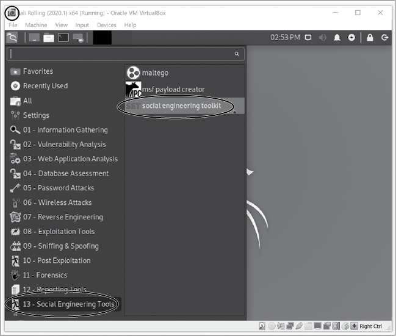
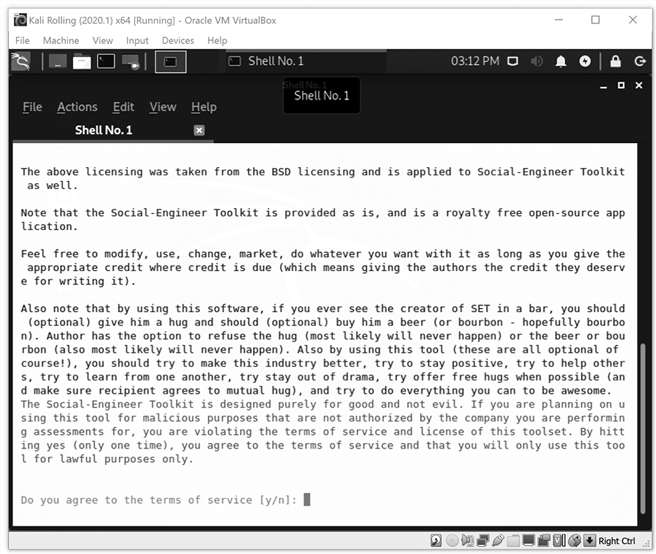
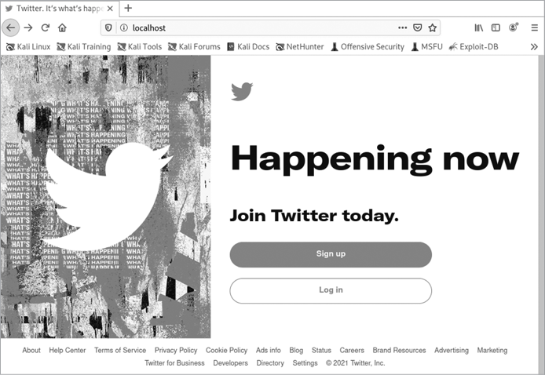
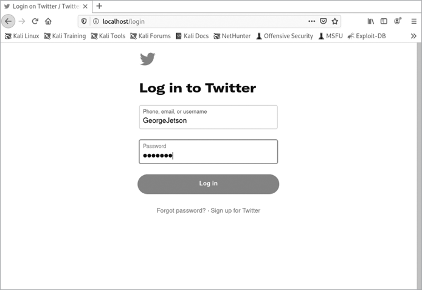
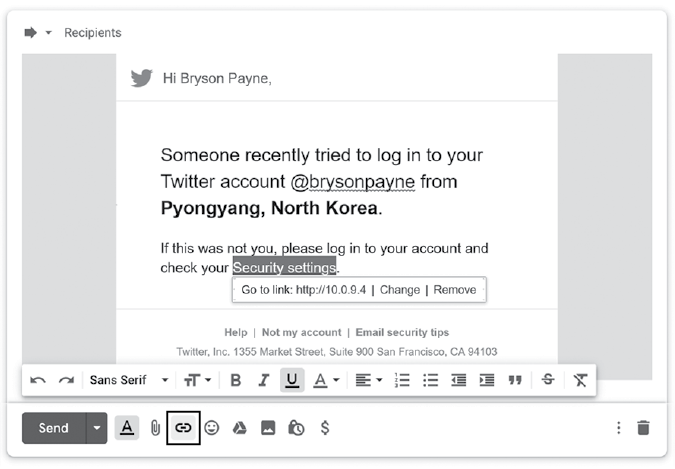

# 第五章：社交工程与网络钓鱼攻击


在本章中，你将使用虚拟黑客实验室学习攻击者访问受害者计算机和账户的最常见且最成功的方法之一：社交工程。

*社交工程*是指通过欺骗手段让人们泄露敏感或有价值的信息，如密码、信用卡号码或医疗数据。研究人员估计，94%到 98%的计算机攻击都以某种形式的社交工程为开端。在电影中，黑客常常通过一些非常先进的手段突破网络，但在现实世界中，他们通常只会发送一封电子邮件，诱使某人泄露他们的用户名和密码。这种社交工程技巧被称为*网络钓鱼*。

在本章中，你将通过创建一个网络钓鱼网站和发送网络钓鱼邮件来了解社交工程的危险。你将看到攻击者如何轻易欺骗他人泄露他们的用户名和密码，以及如何保护自己免受网络钓鱼攻击。

## 社交工程的工作原理

社交工程利用了我们人类渴望社交、帮助他人和成为群体一部分的愿望，或者它通过操纵我们的基本人类情感，如恐惧、好奇心或贪婪，来诱使我们犯下安全错误或泄露敏感信息。舆论压力是一种社交工程方式：它说服某人做出他们通常不会做的事情，因为“其他人”都在做，或者害怕错过机会。类似地，网络诈骗者通过社交工程操控我们做出错误的决策，而不考虑后果。

在现实世界中，骗子和犯罪分子通过伪装成快递员或公用事业工人进入安全建筑，或者他们会通过携带一个大箱子“紧跟”某人，要求别人为他们开门。一旦进入，他们会通过“肩窥”观察别人输入密码的过程。

在数字世界中，社交工程师利用电子邮件、社交媒体、广告、网站、短信、自动电话和其他技术手段。在线犯罪分子可以欺骗毫无戒备的用户，诱使他们点击恶意链接、登录虚假网站、接受虚假好友请求、输入信用卡信息、下载并运行恶意软件，或泄露个人信息。

最常见的社交工程攻击类型是网络钓鱼。在网络钓鱼攻击中，攻击者通过电子邮件诱使你下载感染恶意软件的文件或访问伪装成在线服务登录页面的恶意网站。如果你登录了这个虚假的服务，攻击者就能获得你的用户名和密码。

为了了解攻击者设置网络钓鱼攻击的容易程度，我们将通过你的 Kali Linux 虚拟机亲自设置一次。了解如何操作将帮助你在点击之前识别出即使是最精密的钓鱼邮件。

## 创建网络钓鱼网站

我们将从创建一个看起来与 Twitter 登录页面完全相同的钓鱼网站开始。该网站将捕获并存储用户名和密码。

1.  启动 Kali Linux 虚拟机，并点击屏幕左上角菜单面板上的 Kali 图标。打开 *13 - 社会工程工具* 文件夹，并找到 *社会工程工具包 (SET)* 应用程序，如 图 5-1 所示。这个程序，也叫做社会工程工具包，使安全专家能够开发高级社会工程攻击，测试公司的安全性。这种道德黑客被称为 *渗透测试*（简称 *pentesting*），因为你是在测试是否能突破公司的防御。

    图 5-1：找到 *13 - 社会工程工具* 文件夹和 SET 应用程序。

1.  点击 SET 图标打开社会工程工具包。如果提示输入密码，请输入 `kali`。（注意，在输入时可能看不到密码。）当应用程序加载时，SET 会要求您接受使用条款，如 图 5-2 所示。输入 `Y` 同意仅用于合法目的使用 SET。

1.  现在，您应该能看到类似 列表 5-1 中所示的主 SET 菜单。

    ```
    Select from the menu: 1) Social-Engineering Attacks 2) Penetration Testing (Fast-Track) 3) Third Party Modules 4) Update the Social-Engineer Toolkit 5) Update SET configuration 6) Help, Credits, and About 99) Exit the Social-Engineer Toolkit
    set>
    ```

    列表 5-1：主 SET 菜单

    

    图 5-2：使用 SET 前，您必须同意服务条款。

1.  输入 `1` 选择社会工程攻击。这将带您进入攻击菜单，如 列表 5-2 所示。

    ```
     1) Spear-Phishing Attack Vectors 2) Website Attack Vectors 3) Infectious Media Generator 4) Create a Payload and Listener 5) Mass Mailer Attack *--snip--*
    ```

    列表 5-2：SET 攻击菜单

1.  在攻击菜单下，输入 `2` 选择网站攻击向量。这将带您进入网站攻击向量菜单，如 列表 5-3 所示。

    ```
     1) Java Applet Attack Method  2) Metasploit Browser Exploit Method 3) Credential Harvester Attack Method 4) Tabnabbing Attack Method 5) Web Jacking Attack Method *--snip--*
    ```

    列表 5-3：SET 网站攻击向量菜单

1.  输入 `3` 选择凭证收集器攻击方法。这将打开凭证收集器攻击菜单，提供一些选项，如 列表 5-4 所示。

    ```
     1) Web Templates 2) Site Cloner 3) Custom Import
    ```

    列表 5-4：SET 凭证收集器攻击菜单

1.  我们将使用第二个选项，网站克隆器，制作一个真实网站的 *克隆* 或精确副本，用于我们的钓鱼攻击。这种钓鱼攻击被称为 *凭证收集*，因为其目标是收集人们的 *凭证*，即用户名和密码。按 `2` 选择网站克隆器，然后按 **ENTER**。

### 克隆登录页面

SET 的网站克隆器将帮助您设置几乎任何登录页面的克隆。它下载显示现有登录页面所需的所有代码，例如社交媒体平台、银行或电子邮件服务的登录页面。如我们在第一章使用浏览器的检查工具时所见，这些代码是公开的。然后，网站克隆器使用下载的代码创建页面的精确副本。剩下的就是找到方法欺骗用户将其用户名和密码输入克隆页面。

按照以下步骤克隆 Twitter 登录页面。

1.  首先，站点克隆工具会要求输入存储受害者用户名和密码的机器的 IP 地址。默认情况下，提示会显示你的 Kali 虚拟机的 IP 地址。在我的例子中，这是 10.0.9.4，如 SET 提示中所示：

    ```
    set:webattack> IP address for the POST back in Harvester/Tabnabbing [10.0.9.4]:
    ```

    如果你的 Kali 虚拟机的 IP 地址不同，记下来，因为稍后你会用到它。按 **ENTER** 继续。

1.  接下来，SET 应该会要求你输入你想要克隆的网站的 URL：

    ```
    set:webattack> Enter the url to clone:
    ```

    为了成功进行凭证收集攻击，你需要克隆一个在同一页面上要求输入用户名和密码的登录页面。大多数在线服务，包括许多社交媒体网站，符合这一描述，但一些银行网站和电子邮件网站（包括 Gmail 和 Outlook）会要求在一个页面输入用户名，在另一个页面输入密码，以防止像这样的攻击。

    我们将克隆 Twitter 登录页面。在 SET 窗口中输入 `https://twitter.com/login`：

    ```
    set:webattack> Enter the url to clone: `https://twitter.com/login`
    ```

1.  现在 SET 应该会显示它正在克隆网站。它可能会要求你再次按 ENTER 继续。如果 SET 要求你确认其他任何事情，请按 `Y` 或 ENTER 按照要求操作。

1.  稍等片刻，你会看到一条信息，确认 SET 凭证收集攻击正在运行：

    ```
    [*] The Social-Engineer Toolkit Credential Harvester Attack
    [*] Credential Harvester is running on port 80
    [*] Information will be displayed to you as it arrives below:
    ```

SET 成功启动了一个临时的 Web 服务器，受害者可以访问该服务器。现在它在等待受害者将信息输入到网站中。

### 让我们开始收集一些凭证吧！

让我们测试一下我们的钓鱼网站，看它是否有效。在保持终端窗口打开的同时，点击菜单面板上的 Kali 图标，然后进入 **收藏夹** ▶ **网页浏览器**。浏览器打开后，在地址栏中输入 `localhost`。你应该看到一个几乎完美的 Twitter 首页复本，如 图 5-3 所示。（网页会随时变化，浏览器也会变化，因此你看到的可能会稍有不同。）唯一能看出页面不真实的方法就是查看地址栏。



图 5-3：克隆的 Twitter 首页与真实的完全相同。

首先，你应该看到你输入的地址（*localhost*）而不是实际地址（[`twitter.com`](https://twitter.com)）。其次，地址栏旁边没有安全锁图标，浏览器告诉你该页面不安全。

现在我们知道克隆的网站看起来像真实的页面，让我们来看看它能否捕获登录信息。点击 **登录** 进入登录页面。输入一个虚构的用户名和密码，再次点击 **登录**。

我输入了用户名 GeorgeJetson 和密码 Jane!!!，如 图 5-4 所示。



图 5-4：在你克隆的 SET 网站中输入虚假信息；切勿在钓鱼网站上输入你的真实用户名和密码。

一旦你提交了伪造的登录凭据，SET 会将你的浏览器重定向到真正的 Twitter 网站，[`twitter.com/`](https://twitter.com/)。你可以通过地址栏看到锁定图标来判断这是一个真实的网站。SET 将受害者带到真实的登录页面，让他们认为是自己输入错误了登录信息。这一次，他们登录到真实的网站，却从未意识到攻击者窃取了他们的凭据。

现在打开运行 SET 的终端窗口。如果你的钓鱼网站工作正常，你将看到一屏幕的已提交网页表单数据。如有需要，向上滚动，你将看到你输入的用户名和密码：

```
[*] WE GOT A HIT! Printing the output:
...
POSSIBLE USERNAME FIELD FOUND: session[username_or_email]=GeorgeJetson
POSSIBLE PASSWORD FIELD FOUND: session[password]=Jane!!!
```

如果 SET 没有提取登录信息，再次填写克隆的表单。如果你仍然找不到输入的用户名和密码，关闭 SET 并尝试克隆另一个网站。

只要 SET 还在运行，你可以通过任何可以访问 Kali 虚拟机网络的浏览器，向你的表单提交用户名和密码。这意味着你可以启动 Windows 虚拟机，假装自己是钓鱼受害者，浏览到你的 Kali 虚拟机 IP 地址（例如 10.0.9.4），并在假页面上输入用户名和密码。

### 创建钓鱼邮件

钓鱼攻击的最后一步是创建并发送一封包含钓鱼网站 IP 地址链接的钓鱼邮件。记住，SET 的站点克隆器在你的 Kali 虚拟机上运行着一个假版本的 Twitter 登录页面，因此它使用的是你的 Kali 虚拟机的 IP 地址。在你的 Kali 或 Windows 虚拟机中，登录你的电子邮件账户并撰写一封新邮件。你的钓鱼邮件可以像这样简单：

> `主题：账户异常活动`
> 
> `消息：有人试图从匈牙利布达佩斯登录你的 Twitter 账户。如果这不是你，请登录你的账户并检查你的安全设置：http://10.0.9.4。`

将消息发送到你自己的邮箱，并在运行 SET 的 Kali 或 Windows 10 虚拟机上打开它。点击链接应该会将你带到克隆的钓鱼网站！

然而，大多数人可能不会点击邮件中的链接。因为邮件看起来不像是 Twitter 发来的正常邮件，而且链接显示的是一个 IP 地址，而不是 Twitter 的网址。为了创建一个更具说服力的钓鱼骗局，攻击者可能会复制一封真实的 Twitter 邮件，这封邮件使用了 Twitter 的标志和样式，并将其粘贴到一封新邮件中。然后，他们会更改文本和链接，试图说服人们点击进入克隆的网站。图 5-5 展示了我做的一个例子。



图 5-5：我通过更改文本和超链接，将一封真实的 Twitter 邮件转换成了钓鱼邮件。

我让它看起来像是有人试图从朝鲜黑客入侵用户账户，目的是促使他们点击链接查看“安全设置”。接着，我为文本“安全设置”添加了一个超链接，指向我的克隆登录页面。在大多数电子邮件程序中，你可以通过高亮要转化为链接的文本，点击链条图标（在图 5-5 中框出），并输入链接地址来插入超链接。由于可疑的 IP 地址隐藏在“安全设置”文本背后，用户更有可能点击链接进入钓鱼网站。

现在你已经了解了钓鱼攻击，我们来看看如何保护自己免受钓鱼攻击的侵害。

## 防范钓鱼攻击

你可以通过以下几个简单的技巧来保护自己免受电子邮件诈骗：

+   将鼠标悬停在邮件中的链接上（不要点击它们！），查看链接地址是否可疑，比如拼写错误或异常长/数字化的地址。通常，当你这样做时，地址会显示在浏览器或电子邮件程序的屏幕底部附近。（你也可以使用 VirusTotal 来检查链接地址是否含有恶意软件，就像我们在第四章中做的那样。）

+   检查电子邮件的发件人（From:）和收件人（To:）字段，确保它们都是可信的。注意发件人地址中的拼写错误或不同的域名，比如*gmail.com*而不是*yourbank.com*。

+   如果有人要求你提供个人信息，请仔细思考是谁在索取这些信息，要求的信息是什么，以及为什么需要这些信息。

+   如果你对电子邮件的来源感到不确定，不要点击或打开任何内容。可以打电话给发送者或者公司（使用一个真实的电话号码，而不是邮件中的号码）验证任何重要交易或紧急问题。

如果你怀疑某封电子邮件是假的，打开一个单独的浏览器窗口，输入真实的 URL 或者在线搜索该公司名称，访问真实的网站。再次检查地址栏，确保 URL 是你预期的那样。即便如此，只有在网站安全时才输入你的用户名和密码。如果一个网站是安全的，你可以通过其 URL 以*https://*开头，并且浏览器地址栏中会显示安全锁图标来判断。

## 关键要点

在本章中，你了解了社会工程师如何利用人类情感来操控受害者，诱使他们做出错误的选择，无论是在面对面的交流中，还是在线上。你了解了最常见的在线社会工程攻击——钓鱼攻击。

为了理解钓鱼攻击有多么简单且有效，你使用 Kali Linux 中的社会工程工具包（SET）克隆了一个登录页面，从而收集了毫无戒心用户的凭证。你创建了一个指向克隆页面的钓鱼邮件，并且你看到了攻击者如何通过先获取一封真实的电子邮件，再修改其中的文本和链接，来制作更具说服力的钓鱼邮件。

你学会了通过仔细查看任何要求你点击链接、打开文档或采取异常行动的电子邮件中的“发件人”和“收件人”字段，来保护自己免受钓鱼攻击。你还学会了通过将鼠标悬停在每个链接上并检查网址来检查链接。奇怪或拼写错误的网页地址，以及网址中不寻常的长网址或数字 IP 地址，都可能是钓鱼攻击的线索。如果有疑问，千万不要点击电子邮件中的任何链接。相反，打开一个独立的浏览器窗口，输入你有账户的真实网站的域名，直接登录。

在下一章节，你将向你的黑客工具箱中添加另一个重要的工具：恶意软件。恶意软件将允许你远程接管另一台计算机，窃取文件、记录击键，甚至访问用户的摄像头。
