# 8

网页黑客攻击


攻击一台单独的计算机可能会获得少量的用户名、密码和其他数据。但攻击一台网页服务器则可能让攻击者获得 *数百万* 个用户名和密码，从而可以在银行网站、电子邮件服务器等进行测试。

2019 年，Quest Diagnostics 由于其网页支付页面的漏洞遭到攻击，泄露了 1200 万患者的记录。2017 年，信用局 Equifax 未能保护 1.5 亿人的信用信息，包括出生日期、社会安全号码和地址。2018 年，万豪酒店遭到黑客攻击，导致 5 亿名旅客的数据泄露，包括信用卡号和护照信息。目前为止，最大的数据泄露事件是 2013 年对搜索引擎和电子邮件平台 Yahoo! 的攻击，泄露了 30 *亿*用户的账户信息，包括电子邮件地址和密码。

在本章中，你将看到恶意黑客如何仅通过网页浏览器和几行代码攻击网页应用程序。你还将学习一些安全专家如何防范网页攻击的常见方法，保护数百万（甚至数十亿！）人的数据免受网络犯罪分子的侵害。

## Metasploitable 虚拟机

我们希望安全、道德地进行网页黑客攻击练习，因此我们将在虚拟黑客实验室中搭建一个网页服务器。Metasploit 的创建者还专门为训练目的创建了一个故意存在漏洞的网页服务器，称为 Metasploitable。我们将使用我为你定制的该服务器版本。现在，让我们将它添加到你的虚拟黑客实验室中：

1.  访问[`www.nostarch.com/go-hck-yourself/`](https://www.nostarch.com/go-hck-yourself/)并点击链接下载 *Metasploitable2-gohack.ova* 文件到你的主机计算机。

1.  双击下载的文件，在 VirtualBox 中打开。将出现导入虚拟设备窗口，如图 8-1 所示。点击**导入**。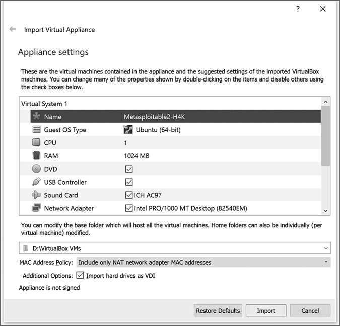

    图 8-1：将 *Metasploitable2-**gohack**.ova* 文件导入到 VirtualBox

1.  在 VirtualBox 虚拟机管理器中选择 Metasploitable2 虚拟机并点击**设置**。

1.  转到**网络**标签，确保勾选了启用网络适配器框，并且显示为“连接到：NAT 网络”和“名称：PublicNAT”，就像我们的其他虚拟机一样。正确的设置如图 8-2 所示。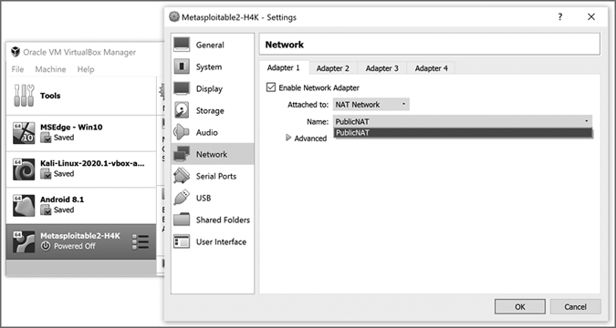

    图 8-2：确保 Metasploitable 虚拟机连接到 PublicNAT 网络

1.  点击**确定**保存这些网络设置。你的新 Metasploitable 虚拟机现在已经准备好运行！

1.  在 VirtualBox 管理器中选择 Metasploitable，点击**启动**。由于 Metasploitable 是一台网页服务器，而不是桌面计算机，因此它使用基于文本的界面而非图形用户界面。如果界面太小而无法读取，请前往虚拟机的菜单栏，选择**视图**▶**虚拟屏幕 1**▶**缩放到 200%**（或适合你屏幕的其他值）。

1.  输入用户名`msfadmin`和密码`msfadmin`。在 Metasploitable 的终端窗口中，密码在输入时不会显示，但如果输入正确，提示符会从登录界面切换到如下所示的 shell 提示符：

    ```
    msfadmin@metasploitable:~$
    ```

1.  输入以下命令：

    ```
    msfadmin@metasploitable:~$ `ip a`
    ```

    Metasploitable 将返回其 IP 地址（在我的情况下是`10.0.9.8`）：

    ```
    `--snip--`
    2: eth0: <BROADCAST,MULTICAST,UP,LOWER_UP> mtu 1500 qdisc pfifo_fast qlen 1000 link/ether 08:00:27:11:23:67 brd ff:ff:ff:ff:ff:ff inet 1 `10.0.9.8`/24 brd 10.0.9.255 scope global eth0 `--snip--`
    ```

    请记下 IP 地址 1。你将需要它从其他虚拟机访问 Metasploitable 虚拟机的网页服务器。

## 从浏览器进行网页攻击

网络攻击非常常见，因为它对攻击者来说具有回报（记住，对一个网页服务器的成功攻击可以一次性获取*数百万*用户的信息），网页服务器始终在线并连接到互联网，而攻击者只需要一个网页浏览器即可进行攻击。为了了解其工作原理，我们将在 Windows 10 虚拟机的 Edge 浏览器中攻击 Metasploitable 服务器。

在 VirtualBox 管理器中启动你的 Windows 10 虚拟机。使用凭证`IEUser`和`Passw0rd!`登录。打开 Edge 浏览器（它是任务栏上的蓝色*e*漩涡图标），并在地址栏中输入你的 Metasploitable 虚拟机的 IP 地址。你将看到 Metasploitable 2 的主页，如图 8-3 所示。

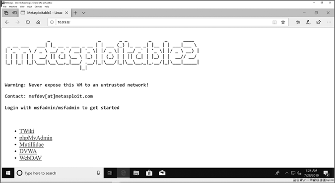

图 8-3：在 Windows 10 虚拟机中输入 Metasploitable 虚拟机的 IP 地址，查看此主页。

Metasploitable 2 包含五个易受攻击的网页应用程序，但我们只关注其中一个：DVWA，或者叫做 Darn Vulnerable Web App（极其脆弱的网页应用）。这个故意存在漏洞的开源网页应用程序是为了帮助网页开发人员和安全专业人员学习基本的黑客技术，以及如何保护网页应用免受这些攻击。DVWA 有不同的漏洞级别，用户可以在不同的安全程度下尝试攻击应用程序。我们将安全级别设置为低，以模拟没有额外安全保护的网页应用程序。

1.  点击 Metasploitable 2 主页上的**DVWA**链接。你将看到应用程序的登录界面，如图 8-4 所示。

1.  输入用户名`admin`和密码`password`以访问 DVWA。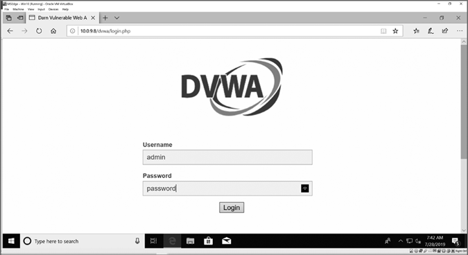

    图 8-4：使用我们的凭证登录 DVWA 界面

1.  点击左侧的**DVWA 安全性**。

1.  在脚本安全部分，将安全级别设置为**低**并点击**提交**，如图 8-5 所示。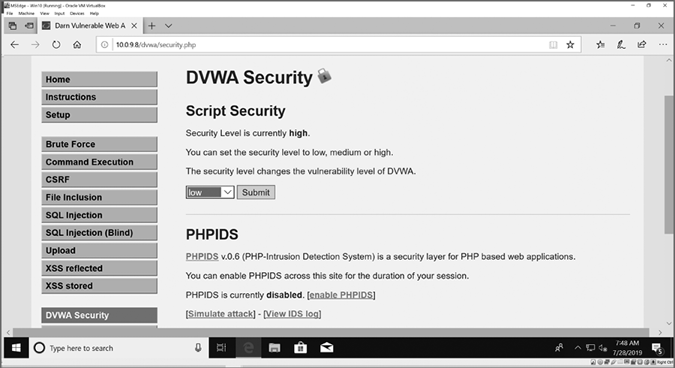

    图 8-5：将 DVWA 脚本安全级别设置为低

现在我们准备在 DVWA 上尝试两种网络攻击：跨站脚本攻击和 SQL 注入攻击。

### 发起跨站脚本攻击

在*跨站脚本（XSS）攻击*中，黑客通过一个本应接受普通文本输入的字段（如登录表单或搜索框）将恶意代码注入网页。XSS 攻击也被称为*代码注入*攻击，因为黑客能够将他们自己的代码“注入”到网页应用程序中。我们将使用两种网页语言——JavaScript 和超文本标记语言（HTML）——来注入脚本到 DVWA 中。

要测试一个 Web 应用程序的 XSS 漏洞，只需要一个简单的 JavaScript 命令：

```
alert("You've been hacked!");
```

该命令弹出一个警告框，显示“你已被黑客攻击！”为了将其注入网页，我们需要将 JavaScript 代码包裹在正确的 HTML 标签中，即`<script>`和`</script>`，如下所示：

```
<script>alert("You've been hacked!");</script>
```

HTML 中的`<script>`标签告诉网页，*脚本*（一段简短的代码），通常是 JavaScript，开始了。`</script>`标签称为结束标签，它让网页知道脚本代码已经结束。

#### 反射型跨站脚本（XSS）

*反射型 XSS 攻击*利用那些直接将用户输入反射回网页的页面，例如一个要求输入姓名和地址并在页面上显示以确认输入是否正确的订单表单。攻击者利用反射型跨站脚本将恶意 HTML 或 JavaScript 代码注入到未加保护的 Web 应用程序中。让我们来试一下！

1.  在你 Windows 10 虚拟机中的 DVWA 里，点击左侧的**反射型 XSS**，打开漏洞页面：反射型跨站脚本（XSS）。 

    本页面的设计目的是将你在“你叫什么名字？”文本框中的输入反射回页面，显示在*Hello*字样后面。例如，如果你输入名字`Bryson`，页面将显示`Hello Bryson`。

1.  不要输入你的名字，而是将上一节中的 HTML/JavaScript 命令输入到名字文本框中，如图 8-6 所示：

    ```
    `<script>alert("You've been hacked!");</script>`
    ```

    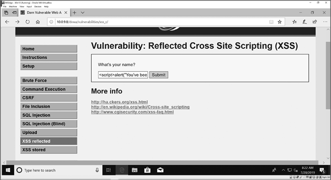

    图 8-6：通过将 HTML 和 JavaScript 输入到文本框中攻击反射型 XSS 页面

1.  点击**提交**，网页将重新加载，弹出“你已被黑客攻击！”的消息，如图 8-7 所示。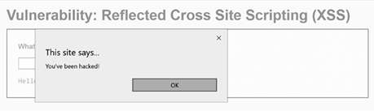

    图 8-7：受影响的网页弹出一条消息，表示我们已被黑客攻击！

通过将一行 HTML 和 JavaScript 结合起来并输入到 DVWA 中未加保护的文本框里，我们将代码注入到网页中。恶意攻击者可以使用相同的技术，欺骗用户相信他们的计算机真的遭到攻击，并让他们拨打一个免费的“技术支持”电话。在这种常见的骗局中，犯罪分子租用一个呼叫中心，获取焦虑受害者的信用卡信息，并收取虚假的计算机服务费用。

#### 存储型跨站脚本（XSS）

大多数网站使用数据库存储用户输入或经常变化的信息，如产品信息或客户数据。如果攻击者将恶意代码注入到与数据库关联的网页表单中，这段恶意代码就会存储在数据库里，成为网页的永久一部分。这种类型的攻击被称为*存储型 XSS 攻击*，它确保每次有人访问受影响的网页时，恶意代码都会运行。相比之下，我们的反射型 XSS 攻击并未永久改变网页，因为我们的注入代码并没有被保存到数据库中。接下来我们将尝试一个存储型 XSS 攻击。

1.  点击左侧 DVWA 菜单中的**XSS 存储**。你将看到一个类似留言簿的应用程序，允许用户在页面上保存自己的姓名和短消息。

1.  不要用你的名字和一条友好的留言来签名留言簿，而是仅输入你的姓名。然后，在消息文本框中输入我们希望存储在此页面数据库中的 XSS 攻击代码，`<script>alert("你已被黑客攻击！");</script>`，如图 8-8 所示。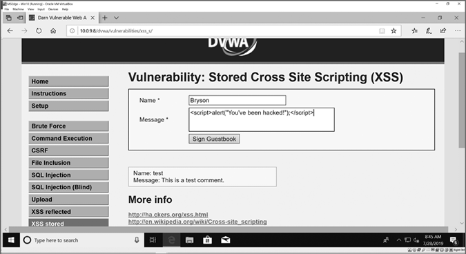

    图 8-8：在 DVWA 中将我们的恶意脚本存储到 XSS 存储页面

1.  点击**签名留言簿**，你将看到警报弹出，如图 8-9 所示。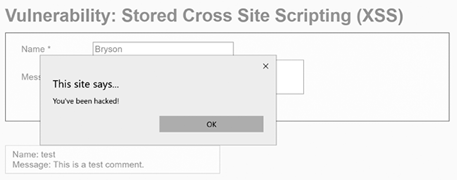

    图 8-9：我们的 JavaScript 警报会告诉每个访问者：“你被黑客攻击了！”

与反射型攻击不同，每当有人访问存储型跨站脚本（XSS）留言簿页面时，这个警报都会弹出。你已经利用数据库驱动的网页，在 DVWA 网站上永久存储了恶意脚本。

然而，JavaScript 的功能远不止弹出警报消息。我们可以更改浏览器的`window.location`，将用户重定向到一个完全不同的网站：

1.  重新加载 XSS 存储的网页并点击**确定**关闭警报消息弹窗。

1.  这次，像往常一样输入你的姓名，然后在消息文本框中输入以下代码，如图 8-10 所示：

    ```
    `<script>window.location.href="https://www.nostarch.com/go-hck-yourself";</script>`
    ```

    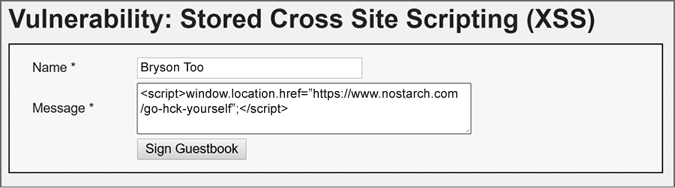

    图 8-10：输入一个更恶意的脚本，将用户重定向到一个完全不同的网页

1.  点击**签名留言簿**，你将看到我们之前注入的警报弹窗。但当你关闭警报后，你将被重定向到[`www.nostarch.com/go-hck-yourself/`](https://www.nostarch.com/go-hck-yourself/)。你无法返回 DVWA XSS 存储页面，因为每次重新加载页面时，它都会重定向到*Go H*ck Yourself* 网站。

我们已经永久劫持了 XSS 存储页面，让每个访问者都会被重定向到这个书籍网站。攻击者也可以做同样的事情，甚至更糟，针对你公司网站的未保护网页、你最喜欢的在线游戏或社交媒体应用，甚至是你当地政府的网站。要恢复网站的原始功能，站点管理员需要访问数据库并完全删除存储的 XSS 代码。

要重置 DVWA 数据库以删除我们输入的恶意代码，点击左侧 DVWA 菜单中的**设置**，如图 8-11 所示。然后点击**创建/重置数据库**，DVWA 会将数据库重置为初始状态。

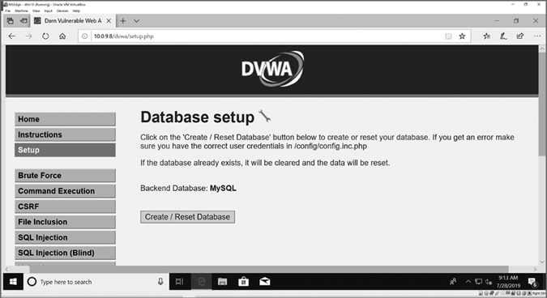

图 8-11：清除你存储的 XSS 攻击

### 对数据库发起 SQL 注入攻击

向网站注入恶意代码*是*可怕的，但黑客是如何从网站中获取敏感数据*的*呢？在本节中，你将学习到网页黑客如何使用结构化查询语言（SQL）注入攻击，直接从网站的数据库中窃取信息。SQL 是用来访问大多数数据库的语言，*SQL 注入*（*SQLi*）涉及将恶意 SQL 代码插入到网页应用程序中，以欺骗应用程序的数据库，泄露私人信息。

数据库包含*表格*，这些表格看起来像是由列和行组成的电子表格。列是用于不同*字段*或信息片段的，比如名字、姓氏、用户名、密码、电子邮件地址等等。行则表示单独的*记录*。例如，用户表中的每个用户都会占据一行。

当我们访问数据库时，我们使用类似这样的 SQL *查询*：

```
SELECT password FROM users WHERE username='Bryson'
```

这个查询请求从`users`表中获取`password`字段，并根据`username`字段为`Bryson`的行进行筛选。我们可以稍微修改查询，要求获取*所有*用户的密码：

```
SELECT password FROM users WHERE username='Bryson' OR 1='1'
```

通过在查询中添加`OR`条件，我们要求数据库从`users`表中选择所有的密码。在每一行，SQL 都会检查`username`是否等于`'Bryson'`，或者该行的`1`是否等于`'1'`。如果这两个条件中有一个为真，SQL 就会返回该行的密码。因为其中一个条件*总是*为真（1 总是等于 1），所以数据库将返回`users`表中的*所有*密码。

让我们向 DVWA 注入一些 SQL 查询，从网站的数据库中窃取信息。

1.  在你的 Windows 10 虚拟机的 Edge 浏览器中，确保 DVWA 脚本安全设置为低（如图 8-5 第 95 页所示）。

1.  点击左侧 DVWA 菜单中的**SQL 注入**。你将看到一个像图 8-12 中的用户查找页面。

    通常，输入一个用户 ID（例如 1）到文本框并点击提交，会显示该用户的信息。然而，我们将破解表单以显示所有用户的信息。

1.  如果你尝试查找用户，重新加载 SQL 注入页面。然后在用户 ID：文本框中输入`' OR 1='1`，如图 8-12 所示。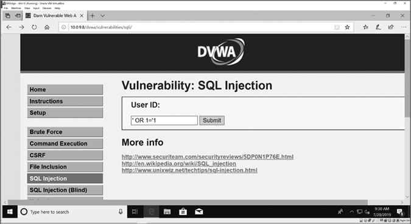

    图 8-12：通过向易受攻击的数据库搜索表单注入 SQL 代码攻击数据库

1.  点击**提交**，你应该能看到所有用户的名字和姓氏（姓氏）的列表，如图 8-13 所示。

1.  现在让我们提取所有 DVWA 的用户名和密码。重新加载 SQL 注入页面，然后在用户 ID 下方的搜索框中输入以下 SQL 代码：

    ```
    `' union select user, password from users#`
    ```

    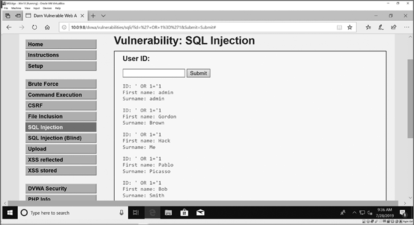

    图 8-13：我们已经显示了所有五个用户的名字和姓氏！

    SQL 中的`union`命令将两个查询语句结合在一起，以同时访问多个表。在这种情况下，我们将用户 ID 查找（包括名字和姓氏）与一个查询结合，该查询将从`users`表中返回用户名和密码。

1.  点击**提交**，你将看到五个用户的用户名和密码取代了他们的名字，如图 8-14 所示。所有密码都是哈希形式，但正如你在第七章学到的那样，像 Hashes.com 或 John the Ripper 这样的工具能够轻松破解大多数密码哈希。

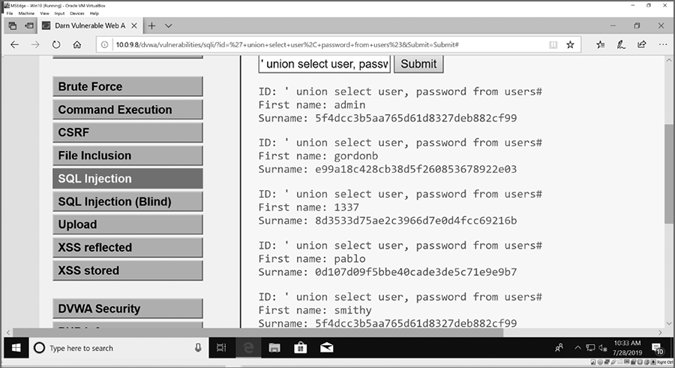

图 8-14：我们通过 SQL 注入攻击从 DVWA 中窃取了所有用户名和密码哈希！

正如你所看到的，黑客利用几行简单的 JavaScript 或 SQL 代码就可以破坏 Web 应用程序、将用户重定向到恶意网站、窃取数据，甚至更糟。幸运的是，伦理黑客可以帮助网站所有者防御这些攻击，极大地提高每个人在线数据的安全性。

## 保护 Web 应用程序免受 XSS、SQL 注入等攻击

DVWA 展示了如何进行*黑客攻击*和如何保护 Web 应用程序。在每个易受攻击页面的右下角，有一个“查看源代码”按钮，可以查看页面的代码。我们将比较低安全页面与高安全页面的源代码，学习如何防御注入攻击。

仍然处于 DVWA 的 SQL 注入页面，且脚本安全设置为低，点击**查看源代码**以查看用户查询应用程序的源代码，其中包括以下两行代码：

```
$id = $_GET['id']; 
$getid = "SELECT first_name, last_name FROM users WHERE user_id = '$id'"; 
```

这个 Web 应用程序是用 PHP 编写的，这是一种流行的 Web 编程语言。第一行代码从名为`'id'`的表单字段中获取用户输入，并将其存储在名为`$id`的变量中。然后，它使用用户输入创建 SQL 查询。用户未修改的输入成为代码的一部分——这是一个危险的编程错误，也是我们能够攻破数据库的原因。

点击左侧的**DVWA 安全性**，将脚本安全级别更改为**中**，然后点击**提交**。点击**SQL 注入**返回用户查询应用程序，再次点击**查看源代码**。（如果你切换安全级别时遇到困难，可以关闭 Edge 浏览器，重新打开并重新登录 DVWA。）这时，你会看到一行新代码插入在前面提到的两行代码之间：

```
$id = mysql_real_escape_string($id); 
```

这一行将用户的输入重新格式化，在用户输入的任何特殊字符前添加*转义字符*（如反斜杠`\`），例如我们在`' OR 1='1`攻击中使用的单引号`'`。在单引号前添加反斜杠告诉数据库将单引号视为文本的一部分，而不是命令的一部分。`mysql_real_escape_string()`命令通过将单引号和其他潜在恶意字符转换为无害的转义序列（`\'`）来使表单更安全，这样数据库就不会将它们当作代码处理，但有动机的攻击者仍然可以绕过这一点。

返回 DVWA 安全页面，将脚本安全级别更改为**高**。然后返回 SQL 注入页面，再次点击**查看源代码**。寻找以下代码：

```
 $id = $_GET['id']; $id = stripslashes($id); $id = mysql_real_escape_string($id); if (is_numeric($id)){ `--snip--`
```

高安全性代码使用`stripslashes()`命令从用户的文本中去除反斜杠，并使用`is_numeric()`确保你输入的是数字。使用`is_numeric()`是表单字段*验证*的一个例子：该命令`is_numeric()`检查用户提交的数据是否符合可接受的格式——在这个例子中是数字 ID——只有符合条件时才会继续执行。

查看其他页面（低、中、高安全级别）的源代码，发现网页开发人员用来保护应用的其他安全命令层级。例如，XSS 反射页面的安全版本包含`htmlspecialchars()`，以防止 HTML 和 JavaScript 注入。为了防止用户输入破坏网站或数据库的代码，高安全版本的源代码中添加的命令*清理*了输入，或者在这些输入被用到网站或数据库中之前，去除了潜在的恶意代码符号（如单引号、反斜杠和尖括号字符）。

## 收获总结

在本章中，你了解到，网络服务器是全天候在线的，黑客可以随时访问全球的服务器。此外，一个没有保护的网页表单可能会使数百万用户的数据暴露给攻击者。你在虚拟黑客实验室中构建了一个故意存在漏洞的网络服务器——Metasploitable 虚拟机，并使用 DVWA 网页应用程序进行训练，测试网站的两种代码注入：跨站脚本攻击（XSS）和 SQL 注入（SQLi）。

你使用了反射和存储的恶意 JavaScript 代码，使网页弹出警告信息，并将浏览器重定向到不同的网站。你通过 SQL 查看了数据库驱动的网页应用程序中所有用户的姓名，并了解了攻击者如何从网络数据库窃取用户名和密码哈希值。通过我们在第七章使用的密码破解工具，攻击者可以轻松窃取数百万个用户名和密码，几乎不需要任何技巧或努力。

由于风险巨大，保护网络应用免受攻击是道德黑客的一个重要职责。需要多个安全层级来充分保护网络应用。你了解了流行的网页编程语言 PHP 中的多个函数，这些函数通过去除与代码相关的特殊字符来清理用户输入，从而保护服务器和数据库。你还看到了一个表单字段验证的例子，检查文本字段以确保用户输入了可接受的值。

在下一章，你将掌握一项新的技能——移动设备黑客技术！你将学习如何保护自己和亲人免受日益增多的移动攻击。
