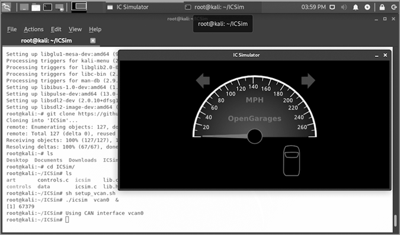
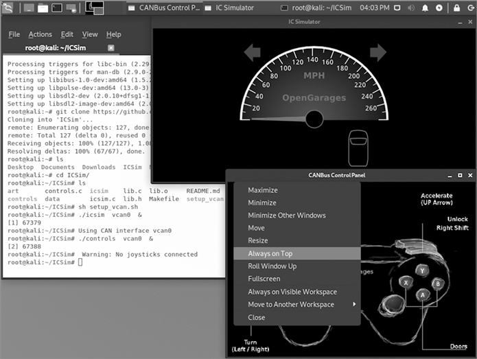
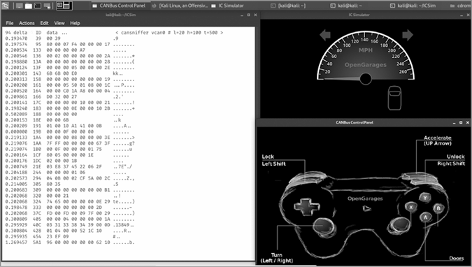
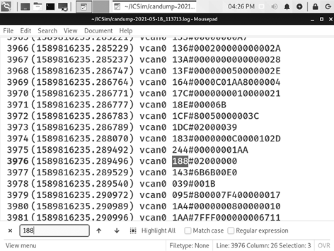
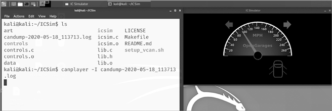
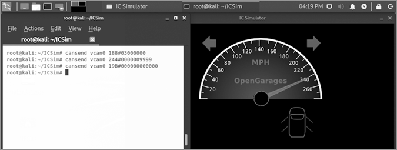

# 第十章：汽车黑客和物联网


你每天都能接触到一些非常酷的计算机，它们就在你周围，但你可能并不会把它们当作计算机来看待。许多家用电器——比如恒温器、安全摄像头、冰箱，以及 Alexa 或 Google Home 扬声器——内部都包含计算机。如今，甚至汽车也拥有互联网连接和计算机系统，这些系统可能会受到不道德黑客的攻击。

嵌入在日常物品中的互联网连接计算设备被称为 *物联网（IoT）*。IoT 设备让我们的生活更轻松或更美好，但它们也可能带来严重的安全风险。互联网连接的医疗设备可以帮助我们保持健康，并允许制造商远程监控和更新这些设备，但想象一下，如果攻击者能够黑进某人的心脏起搏器或胰岛素泵来伤害用户会怎样。同样，卫星广播、GPS 导航以及你汽车中的 4G/5G 无线娱乐系统让长途旅行变得更加方便和有趣，但所有这些网络也带来了攻击者可能利用的额外漏洞。想象一下，如果有人黑进了你的汽车并让它在高速公路上突然刹车。

道德黑客会黑进 IoT 设备，以便在攻击者利用这些设备造成实际损害之前发现问题。在这一章中，你将看到这如何运作。你将黑进一个模拟汽车网络，查看汽车发送的网络消息，并编写命令来控制汽车的仪表盘。

## 安装汽车黑客软件

在这个黑客攻击中，我们将安装一个名为 *仪表集群模拟器（ICSim）* 的软件包，这是一个虚拟仪表盘，让你像在实际车辆中一样查看和互动，比如车速表、转向灯和门锁。Craig Smith（又名 zombieCraig）和 OpenGarages 团队创建了 ICSim，旨在帮助黑客和研究人员安全且道德地学习如何与汽车网络互动，而不破坏或摧毁实际的汽车或无辜的行人。

1.  打开一个终端窗口并更新 Kali 的软件包列表：

    ```
    kali@kali:~$ `sudo apt update`
    ```

1.  现在通过输入以下内容来安装 ICSim 的依赖项：

    ```
    kali@kali:~$ `sudo apt install libsdl2-dev libsdl2-image-dev can-utils`
    ```

    注意，两个 `libsdl2` 包的拼写中都包含一个小写字母 *L*，紧跟着数字 2。

1.  以这种方式安装 ICSim：

    ```
    kali@kali:~$ `cd ~` 
    kali@kali:~$ `git clone https://github.com/zombieCraig/ICSim.git` 
    ```

1.  在你的机器上设置 can-utils：

    ```
    kali@kali:~$ `cd ~`
    kali@kali:~$ `git clone https://github.com/linux-can/can-utils`
    kali@kali:~$ `cd can-utils`
    kali@kali:~/can-utils$ `make`
    kali@kali:~/can-utils$ `sudo make install`
    ```

1.  使用以下命令设置 ICSim 仪表板模拟器软件：

    ```
    kali@kali:~/can-utils$ `cp lib.o ~/ICSim`
    kali@kali:~/can-utils$ `cd ~/ICSim`
    kali@kali:~/ICSim$ `make clean`
    kali@kali:~/ICSim$ `make`
    ```

现在，运行我们的虚拟汽车仪表盘并开始黑客攻击吧！

## 准备虚拟 CAN 总线网络

汽车的网络被称为 *CAN 总线*，简称 *CAN*。自 1990 年代以来，CAN 总线已被大多数汽车用于控制各种系统和传感器，如转向和刹车、收音机、空调和娱乐中心。你刚刚安装的 ICSim 软件创建了一个 *虚拟 CAN (VCAN)* 总线网络，我们将学习如何攻击它。现在，我们来创建这个网络并完成汽车黑客环境的设置。

1.  要设置 VCAN，请在 ICSim 文件夹内的终端中输入以下命令：

    ```
    kali@kali:~/ICSim$ `sh setup_vcan.sh`
    ```

1.  通过在终端输入 `ip addr`，确保 VCAN 配置正确。你应该能看到你的 IP 地址以及一个名为 *vcan0* 的新网络。

    ```
    kali@kali:~/ICSim$ `ip addr` `--snip--` 3: vcan0: <NOARP,UP,LOWER_UP> mtu 72 qdisc noqueue state UNKNOWN group default qlen 1000 link/can
    ```

1.  在终端输入以下命令，告诉它先使用我们刚创建的 vcan0 网络运行 ICSim，然后等待我们的指令：

    ```
    kali@kali:~/ICSim$ `./icsim vcan0 &`
    ```

    你应该能看到一个模拟的仪表盘，类似于 图 10-1 中所示。

    

    图 10-1：ICSim 程序显示了一个模拟的汽车仪表盘，包含速度计、转向信号等！

1.  启动 vcan0 上的控制器应用程序：

    ```
    kali@kali:~/ICSim$ `./controls vcan0 &`
    ```

    应该会打开 CANBus 控制面板窗口。它看起来很像一个视频游戏控制器。

1.  调整控制面板的大小，使 ICSim 窗口可见，可以点击窗口的任何角落并拖动。

1.  右键单击控制面板窗口的顶部栏，选择 **始终置顶**，如 图 10-2 所示。



图 10-2：保持控制器应用程序可见并易于访问

要驾驶虚拟汽车，点击 CANBus 控制面板窗口，然后使用键盘发送命令。可用的命令列在 表 10-1 中。按上箭头加速，使用左右箭头控制转向信号等。

表 10-1：CANBus 控制面板的键盘控制

| **功能** | **按键** |
| --- | --- |
| **加速** | 按住上箭头 (↑) |
| **打左转或右转** | 按住左箭头或右箭头 (←/→) |
| **解锁前左或前右门** | 右-SHIFT-A 或 右-SHIFT-B |
| **解锁左后或右后门** | 右-SHIFT-X 或 右-SHIFT-Y |
| **锁上所有门** | 按住右-SHIFT + 轻按左-SHIFT |
| **解锁所有门** | 按住左-SHIFT + 轻按右-SHIFT |

控制器应用程序是与 VCAN 交互的唯一方式——除非我们黑进它。

## 黑客入侵汽车

我们的汽车黑客冒险将遵循测试大多数 IoT 设备安全性的相同步骤：

1.  使用一个程序查看并记录控制器应用程序与仪表盘之间在 vcan0 网络上的流量。这类程序被称为 *数据包嗅探器*，因为在网络上传输的消息被称为 *数据包*。

1.  确定哪些网络数据包和命令控制哪些汽车系统或功能。

1.  通过将你捕获的数据包重新发送回 vcan0 网络，或通过在终端中编写你自己的命令，来控制汽车。

### 查看数据包

我们将使用 `cansniffer`，can-utils 内置的数据包嗅探器，来监听我们模拟的汽车网络。

1.  在你的终端窗口中，使用以下命令启动 `cansniffer`：

    ```
    kali@kali:~/ICSim$ `cansniffer -c vcan0`
    ```

1.  将终端窗口调整为高而窄（如 图 10-3 所示），以便更容易看到 `cansniffer` 消息。你可能还需要通过按 CTRL 和 − 减小字体大小几次。

1.  点击 CANBus 控制面板窗口，并向虚拟汽车发送一些命令。尝试加速、使用转向信号等。

`cansniffer` 工具拦截在 vcan0 上由控制器应用和仪表板之间发送的数据包，并在终端窗口中显示它们。窗口中的每一行表示一个数据包。网络每秒传输数百个数据包，因此它们会很快通过。

让我们看一个示例数据包，看看我们能找到什么信息。以下是图 10-3 中展示的一个数据包：

```
10.204188 2244 300 00 00 01 06 4.....
```



图 10-3：`cansniffer` 数据包嗅探器显示我们 vcan0 网络上的消息。

第一列是一个 *时间戳* 1，表示数据包发送的时间。第二列 2 是系统的 ID 号码，表示消息的发送或接收方。正如我们将要发现的，CAN ID# 244 代表了速度计。第三列 3 是 CAN 消息数据，使用十六进制值表示，第四列 4 包含以可打印字符表示的相同数据。

经验丰富的黑客知道如何分析数据包嗅探器捕获的流量，以确定不同数据包的含义。这需要练习和耐心。现在，尝试在控制器应用中多次按向上箭头加速，并观察终端窗口中的 ID# 244。观察消息数据列中随着你加速和减速时的变化值。识别这个模式是一个线索，表明 ID #244 代表速度计。

现在按下转向灯（左箭头和右箭头），并观察 ID# 188。当你触碰转向灯时，它应该会出现，并在你关闭转向灯后几秒钟消失。使用左、右 SHIFT 键或右 SHIFT 键加 X、Y、A 和 B 键锁定和解锁车门，并观察 ID# 19B 旁边的数据发生了什么变化。19B 的行应该只会在你锁门或解锁门时短暂出现。

在终端窗口中按下 CTRL-C 停止 `cansniffer`，当你已经进行足够的实验时。如果数据包发送得太快，你来不及挑选出具体的 ID，也不必担心。下一步是记录一些数据包，这样你可以在自己有空时进行研究。

### 捕获数据包

can-utils 工具 `candump` 用于记录来自 CAN 总线的消息，以便我们可以进一步分析或甚至重新播放这些消息。

1.  要开始从 vcan0 记录数据包，请输入以下命令：

    ```
    kali@kali:~/ICSim$ `candump -l vcan0`
    ```

    `-l` 选项（即连字符和小写 *L*）是 *log* 的缩写，因为我们要求 `candump` 通过将数据保存到文件中来记录其输出。

1.  切换回 CANBus 控制面板窗口，开车几秒钟。加速和减速，使用左、右转向灯，锁定和解锁车门。

1.  按下 CTRL-C 停止记录。

1.  在终端窗口中输入 `ls`（即 *list* 的缩写），以显示 *ICSim* 目录的内容。你应该能看到一个新的文件，格式为 `candump-``YYYY``-``MM``-``DD``_``time``.log`（时间以小时、分钟和秒表示——`HHMMSS`），如下所示：

    ```
    candump-`2021``-``05``-``18_113713`.log
    ```

`candump`日志文件是一个简单的文本文件。你可以在文本编辑器中查看该文件，并使用 CTRL-F 来查找特定的 CAN ID 值，比如用于转向信号灯的 188，如图 10-4 所示。



图 10-4：在 Mousepad 文本编辑器中搜索特定的 CAN ID 值

### 重放数据包

通过在 vcan0 网络上重新发送我们在日志文件中捕获的数据包，我们可以让仪表盘“重温”录制的驾驶过程。这种攻击被称为*重放攻击*。

1.  首先，关闭 CANBus 控制面板。即使在空闲时，控制器窗口也会不断发送信号，我们只希望使用我们捕获的数据包来控制仪表盘。

1.  在终端窗口中输入以下命令，通过`canplayer`工具重放日志文件，将`candump-``YYYY``-``MM``-``DD``_``time``.log`替换为你的日志文件名：

    ```
    kali@kali:~/ICSim$ `canplayer -I candump-``YYYY``-``MM``-``DD``_``time``.log`
    ```

1.  你的 ICSim 仪表盘应该会像你最初捕获数据包时一样开始移动。例如，在图 10-5 中，我正在右转并以每小时 90 英里的速度解锁四个车门！（我不建议你在真实的汽车中尝试这样做。）



图 10-5：重放的数据包正在控制仪表盘。

许多物联网设备容易受到像这样的重放攻击。例如，当它们首次发布时，许多蓝牙门锁就容易遭遇这种攻击。只需用一台运行蓝牙无线嗅探器（如 Kismet，它是 Kali 中的一部分）和一根物理蓝牙天线（如价格约 100 美元的 Ubertooth One）配合笔记本电脑，你就能在某人用智能手机打开门时捕获数据包，并在任何时候重放这些数据包以解锁门。如今，为了防止重放攻击，每条消息都会添加一个特殊的值，以便系统能够识别它是接收到的新消息，还是以前见过的消息。

### 发送新命令

汽车黑客可以分析`candump`日志文件来解码 CAN ID 号，并弄清楚每条消息中的数据值是什么意思。有了这些知识，黑客就可以向系统发送特定命令，使汽车做出他们想要的行为。例如，向 ID#188 发送消息`02000000`就能打开右转向信号灯。让我们试试看！

在 ICSIM 打开且控制器窗口关闭的情况下，在终端输入以下命令：

```
kali@kali:~/ICSim$ **cansend vcan0 188#02000000**
```

我们使用`cansend`将 CAN 消息发送到 vcan0\。消息包含转向信号灯的 ID 号（`188`），然后是哈希符号（`#`）作为分隔符，最后是表示右转向信号灯的数值（`02000000`）。你的仪表盘上的右转向信号灯应该会亮起绿色。

如果你想打开左转向信号灯，发送以下信息：

```
kali@kali:~/ICSim$ **cansend vcan0 188#01000000**
```

要关闭信号灯，发送消息`188#00000000`。或者，使用此命令同时打开两个信号灯：

```
kali@kali:~/ICSim$ **cansend vcan0 188#03000000**
```

现在看看`candump`日志文件中与速度表（ID# 244）相关的 CAN 数据包中的数据值。看起来最后四个十六进制数字随着速度的增加而上升。数据值`0000000000`表示 0 英里每小时，`0000003894`大约对应每小时 90 英里。我们来看看`0000009999`会产生什么效果：

```
kali@kali:~/ICSim$ **cansend vcan0 244#0000009999**
```

如图 10-6 所示，速度表跳到了每小时 240 英里！你甚至可以通过十六进制值使其更高——试着将最后四位数字改为`A000`、`B000`，甚至`FFFF`。



图 10-6：我们可以通过直接向 CAN 总线发送信号，使用`cansend`控制仪表盘。

类似地，我们可以通过发送消息`19B#00000F000000`来锁定所有车门，通过发送消息`19B#000000000000`来解锁所有车门（哈希符号后是 12 个零）：

```
kali@kali:~/ICSim$ **cansend vcan0 19B#00000F000000** kali@kali:~/ICSim$ **cansend vcan0 19B#000000000000**
```

我们的虚拟汽车认为它正在向左和向右转弯，并且在以每小时 240 英里的速度飞驰的同时解锁了四个车门！

## 攻击者如何黑客攻击真实汽车

要使用你刚刚学到的`can-utils`工具和技巧来黑客攻击一辆真实的汽车，攻击者只需要一台运行 Kali Linux 的笔记本电脑和一根电缆，将笔记本电脑连接到大多数汽车方向盘下的*车载诊断第二版（OBD-II）*端口。许多这样的电缆价格低于 100 美元。然而，现实中的汽车黑客攻击是一个严肃的问题，可能会导致重大的财产损失或伤害。研究人员在受控环境中进行汽车黑客攻击，寻找安全漏洞。如果你进行汽车黑客攻击，请确保在车库或车道，或在封闭的赛道上进行；绝不要在公路上或任何有人可能受伤的地方进行黑客攻击。

汽车黑客并不总是需要保持与车辆的有线连接才能发送命令。在通过直接连接到特定品牌和型号的汽车找到有用的 CAN ID 号码和信息后，攻击者或安全研究人员可以尝试通过蓝牙、Wi-Fi 或 4G/5G 无线连接到汽车，尝试远程发送 CAN 信息。有一起备受关注的黑客攻击事件利用了驾驶员的免提智能手机连接，通过汽车的仪表盘娱乐系统远程控制了汽车。另一例则使用了特斯拉的 4G 无线空中更新系统，远程安装恶意软件并篡改了汽车。

好消息之一是，每辆车都有些微不同，一辆车中的 CAN ID 号码通常与另一辆车的 CAN ID 不同。每个制造商使用不同的代码，有时同一制造商的每个型号使用一组不同的代码，这些代码可能会在不同的车型年之间发生变化！此外，现代汽车上有几种不同类型的控制器网络；CAN 只是最常见的一种。简而言之，破解真实汽车上的代码需要极大的耐心。

## 要点

在本章中，我们使用了 ICSim 和 `can-utils` 来破解虚拟汽车网络。我们在 Kali 虚拟机上设置了这些工具。然后，我们使用 `cansniffer` 嗅探网络流量，查看 CAN 数据的样子。我们使用 `candump` 捕获了 CAN 信号，接着使用 `canplayer` 播放这些数据包，改变仪表盘，而无需使用汽车的键盘控制。我们还通过 `cansend` 发送了特定的 CAN 消息，直接从命令行操作转向灯、改变车速表、解锁车门。最后，我们了解到，破解一辆真实的汽车只需要大约 $100 的工具和大量的耐心。
