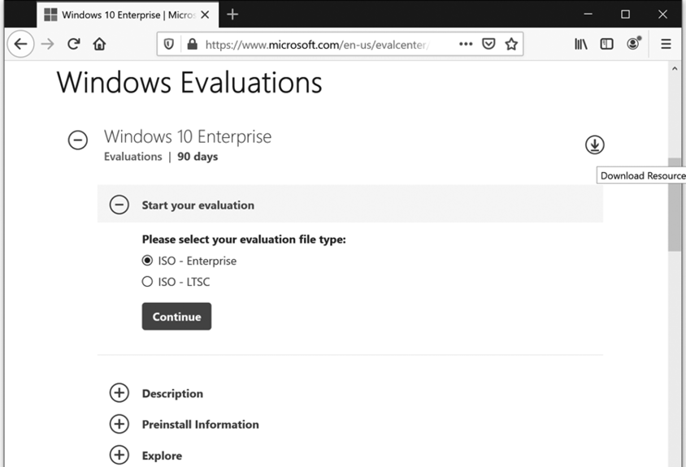
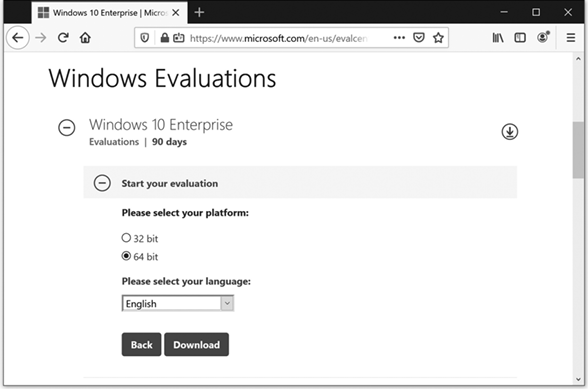
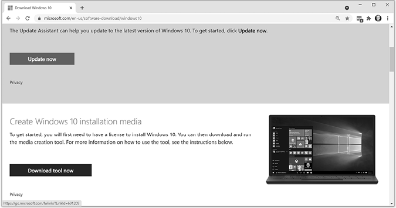
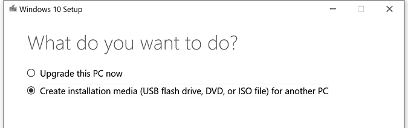
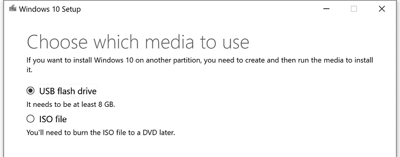

# A

创建 Windows 10 安装光盘或 USB 闪存驱动器

道德黑客通常帮助恢复文件或重置密码，正如我们在第二章中的 Sticky Keys 破解中所做的那样。为此，你可以使用可启动的恢复光盘或 USB 驱动器。这些通常用于重新安装损坏的 Windows，以便你能访问电脑上的文件。

要创建启动光盘或 USB 驱动器，你可以直接从微软下载免费的*评估版* Windows 10，然后将其刻录或安装到 DVD 或 USB 闪存驱动器上。你需要一个至少可以容纳 8GB 的光盘或驱动器。

## 下载 Windows 10

1.  在浏览器中访问[`www.microsoft.com/evalcenter/`](https://www.microsoft.com/evalcenter/)（有时微软会更改其网站，如果这个网址无法访问，请搜索“Microsoft Evaluation Center”找到新页面）。

1.  点击**开始使用**以查找多个类别的微软产品评估版，如 Windows、Windows Server 和 Office。

1.  点击**Windows**▶**Windows 10 企业版**（或其他更新的 Windows 操作系统）进入如图 A-1 所示的 Windows 10 企业版评估界面。

    图 A-1：Windows 10 企业版评估界面

1.  在“开始评估”中，选择**ISO - 企业版**作为评估文件类型，然后点击**继续**。

1.  该网站会要求你填写一份关于自己的表格。如果你未满 18 岁，请在输入个人信息前先与成年人确认。提交信息后，你应该会看到一个类似于图 A-2 的下载界面。

    图 A-2：选择平台和语言，下载免费的合法评估版 Windows。

1.  选择**64 位**，选择语言，然后点击**下载**。

Windows 10 安装下载文件是一个*ISO* 文件，通常称为*镜像*，它是一个包含所有必要文件的单一文件，用于制作像我们的软件安装光盘一样的 CD 或 DVD。ISO 文件大小为 4GB 或更大，因此请尝试在一个网络连接快速的地方下载。

### 将 Windows 10 刻录到 DVD

要将 Windows 10 刻录到 DVD 上，你需要一台带有 DVD 刻录机驱动器的计算机。

1.  对于 Windows，右键点击 ISO 文件并选择**刻录光盘镜像**。对于 Mac，选择 Finder 中的 ISO 文件并转到**文件**▶**刻录 <光盘>**。

1.  将空白 DVD 插入驱动器，几分钟后，你就会拥有一张可启动的 Windows 10 安装光盘。

### 将 Windows 10 安装到 USB 闪存驱动器

如果你没有 DVD 刻录机驱动器，可以使用微软的 Windows 媒体创建工具将 Windows 10 安装到 USB 闪存驱动器上。

1.  访问 [`www.microsoft.com/en-us/software-download/windows10/`](https://www.microsoft.com/en-us/software-download/windows10/)，如图 A-3 所示。（再次提醒，微软经常更改网址、站点名称，甚至工具名称，如果这个网址不可用，可以搜索“Windows 媒体创建工具”，你应该能找到正确的链接。）

    图 A-3：从微软下载 Windows 媒体创建工具。

1.  下载并安装适合你首选语言的 Windows 媒体创建工具。

1.  运行工具时，选择 **创建安装媒体（USB 闪存驱动器、DVD 或 ISO 文件）**，然后点击 **下一步**。

    图 A-4：选择 **创建安装媒体**。

1.  保留 Windows 10 语言和版本的默认选择，然后点击 **下一步**。

1.  选择 **USB 闪存驱动器** 作为你的媒体类型。

    图 A-5：选择 **USB 闪存驱动器**，插入一个空的 USB 驱动器，然后点击 **下一步**。

1.  插入一个至少有 8GB 空闲空间的空 USB 驱动器，选择该空的 USB 驱动器，然后点击 **下一步**。

这需要几分钟时间，但当工具完成时，你将拥有一个可启动的 USB 驱动器，里面已完整安装 Windows 10，可以用来进行 Sticky Keys 破解或一般的计算机故障排除和修复。
