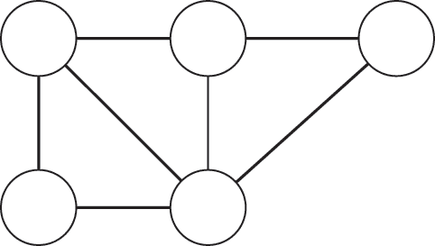
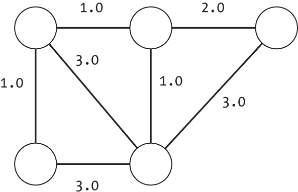
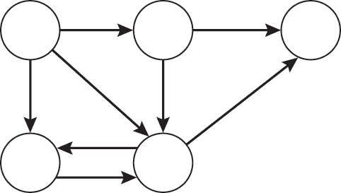
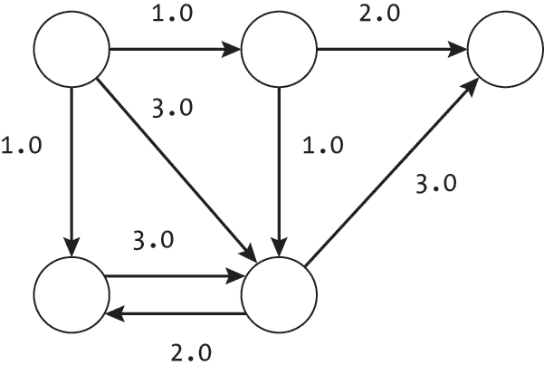
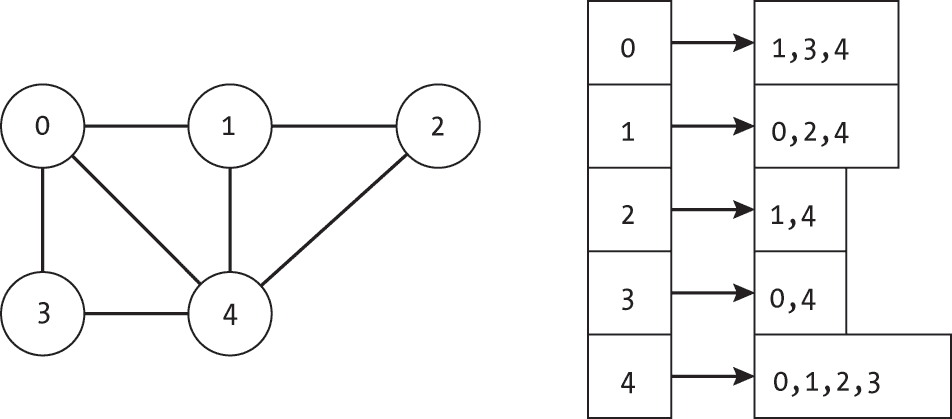
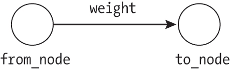
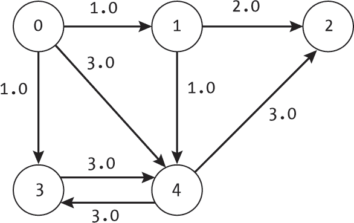
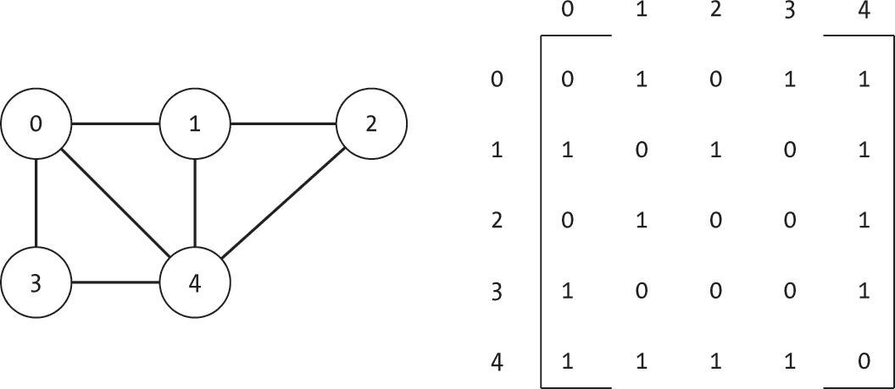

## 1 图的表示


*图* 是一种抽象数据类型，可以通过多种数据结构实现。本章介绍了图的基本组成部分——节点和边，然后展示了如何构建两种最常见的图表示方法：邻接表和邻接矩阵。理解图的结构和组成对于利用其强大功能并设计高效的算法至关重要。

为了实现图，我们定义了几乎本书中所有算法所依赖的 Edge、Node 和 Graph 类。我们讨论了这些类存储的信息，并提供了与这些对象交互的函数。我们还讨论了不同实现之间的权衡，以及可能的替代方案和混合方案。

### 图的结构

图由两个部分组成：节点和边。*节点*（也称为 *顶点*）表示图中的位置或项目。节点通常用于表示具体的实体，如人、城市或计算机。*边*（也称为 *链接* 或 *弧*）将一对节点连接在一起，定义了图中节点之间的相对连接。它们用于表示具体的项目，如城市之间的道路，以及抽象的概念，如两个人之间的友谊。

图 1-1 显示了一个包含五个节点和七条边的示例图。我们使用标准的图形表示法，节点表示为圆形，边表示为连接两个圆形的线。书中的许多图形也在每个圆形内包含标签，以识别各个节点。



图 1-1：一个包含五个节点和七条边的图

用数学符号描述图时，我们使用 *V* 来表示节点的集合，使用 *E* 来表示边的集合。节点和边的数量用集合的大小的数学符号表示，这意味着节点的数量是 |*V*|，边的数量是 |*E*|。

利用这些简单的组件，我们可以表示出令人惊讶的大量现实世界系统，并回答一系列现实世界中的实际问题。例如，图允许我们建模以下场景：

**交通网络 **节点是城市，边表示路径。我们可以计算两点之间的最短路径，或者寻找单一的故障点，这些故障点会切断网络的某一部分与另一部分的连接。

**迷宫 **节点是交叉口，边是连接它们的走廊。我们可以搜索迷宫中的路径。

**教育话题** 每个节点是一个话题，边连接两个相关的话题。我们可以根据先修知识对话题进行排序。

**社交网络** 节点是人，边是他们的友谊连接。我们可以通过网络建模信息流动，以预测谣言如何传播。

我们可以通过允许边提供额外的信息，如方向性和权重，进一步增强图的功能，具体内容将在以下小节和后续章节中讨论。

#### 加权边

在几乎每个现实世界的交通网络中，遍历不同的边会有不同的*成本*。例如，我们可能会测量这个成本为距离或油费；无论如何，从波士顿开车到纽约的成本要低于从波士顿开车到洛杉矶的成本。成本度量也可能更复杂，例如考虑到在山间窄而弯曲的道路上行驶的压力。或者，对于某些问题，我们希望考虑成本的反面，例如节点之间连接的强度或沿特定边行进的收益。考虑边的成本或收益对于准确解决许多图问题至关重要，例如找到两地之间最短（或最不吓人的）路径。

*加权边*不仅捕捉节点之间的连接，还反映了遍历这些连接的成本或收益。对于某些应用，权重是显而易见且容易获得的，例如城市之间的距离。例如，我们可以为匹兹堡和克利夫兰之间的边赋予 133 的权重，表示这两个城市之间的公路长度为 133 英里。在其他情况下，我们可能使用权重来表示更抽象的概念，如友谊的强度。例如，Tina 和 Bob 之间的连接权重为 10，可能表示他们是最好的朋友，而 Tina 与 Alice 之间的连接权重为 1，则表示他们只是泛泛之交。通常可以从上下文中明确判断权重是表示成本还是收益。

我们称具有加权边的图为*加权图*，而没有加权边的图为*无权图*。我们通过在表示边的线旁边添加数字标签来直观地表示边的权重。例如，在图 1-2 中，三条边的权重为 1.0，一条边的权重为 2.0，剩下的三条边的权重为 3.0。



图 1-2：一个加权图

如果需要，我们可以使用加权图来模拟无权边，方法是为所有边使用相同的权重（如 1.0），或在算法中忽略权重属性。

#### 有向边

在某些系统中，节点之间的连接不是对称的。例如，考虑从建筑物水加热器到厨房水龙头的管道。除非管道损坏严重，否则水不可能流入水龙头再回到水加热器。

*有向边*表示两个节点之间连接的方向性。我们使用的术语类似于现实世界的交通网络：有向边开始的节点是*起点*或 from_node，而有向边指向的节点是*终点*或 to_node。

虽然有向边可以表示物理方向性，例如单行道，我们也可以用它们来建模更抽象的方向性，例如教育机构中的先决课程。如果每个节点是一个课程，则有向边可能表示我们需要先修计算机科学导论课程，再修高级图算法课程，如图 1-3 所示。


图 1-3：显示课程先决条件方向性的箭头

我们称带有有向边的图为*有向图*。没有有向边的图（如图 1-1 和 1-2）被称为*无向图*，其中包含*无向边*。

我们可以使用有向边来扩展我们之前的社交网络模型。虽然理想情况下所有的友谊都是互惠的，但遗憾的是，情况并非总是如此。蒂娜和鲍勃可能会互称对方为最好的朋友。然而，虽然爱丽丝把蒂娜视为亲密朋友，蒂娜却只是把爱丽丝当作工作上的一个熟人。

图 1-4 展示了一个带有有向边的示例图，其中每条有向边以单箭头表示其方向。



图 1-4：一个有向图

我们可以通过使用每个方向的一对有向边来表示有向图中节点之间的对称或无向关系，如图 1-4 中底部两个节点之间所示。这使我们能够建模具有有向和无向关系的混合系统。例如，现实世界的交通网络包含单行道和双行道的混合，许多社交网络也包含互相的友谊。通过使用有向图和相应的边对，我们可以完整地建模这些系统。

#### 同时具有权重和方向的边

为了最大化图的表现力，我们可以结合使用带权重的边和有向边，如图 1-5 所示。这种表示方法使得图能够同时捕捉每个连接的方向性以及成本与效益的关系。



图 1-5：一个有向且加权的图

我们必须为两个节点之间的每条有向边指定一个单独的权重，但正如图 1-5 中底部一对节点所示，这些权重不必相等。例如，在建模道路的通行成本时，我们可能会选择为上坡方向设定一个比下坡方向高得多的成本。根据应用的不同，比如规划骑行旅行，上坡道路的成本可能会高很多。类似地，Tina 和 Alice 对她们的友谊赋予了不同的重视程度。

本书中，我们将使用支持权重和方向性的图实现。如果需要，这些数据结构仍然可以用于存储没有加权或没有方向的简单图。尽管这种通用性为数据结构带来了一些小的复杂性，并且可能会为那些不使用所有信息的算法增加额外开销，但这种方法使得数据结构更加灵活，能够被多种算法所使用。

### 邻接表表示法

本书大部分内容中使用的图表示法是*邻接表表示法*，它通过为每个节点存储一组邻居的单独列表来表示图的结构。这使得我们能够模拟现实世界中的现象，其中每个节点维护关于其本地连接的信息，比如社交网络中个人为他们的直接朋友维护联系信息。

有多种方法可以实现邻接表表示法。节点和边可以通过关联隐式地表示，或者作为独立的数据结构显式表示。在最简单的实现中，我们可以通过一个单独的列表列表隐式存储图，其中每个节点都有一个数字 ID，每个列表条目对应一个给定节点的邻居。例如，考虑以下代码行：

```
g: list = [[1,3,4], [0,2,4], [1,4], [0,4], [0,1,2,3]] 
```

这个列表中的列表g表示图 1-6 中所示的无向、无权图，包含五个节点和七条边。图右侧列表中的第一个条目表示节点 0 有三个邻居：节点 1、3 和 4。每条无向边在两个不同的邻接列表中都有表示，分别对应边的两端节点。



图 1-6：一个图（左）及其邻接表表示（右）

另外，我们可以创建一个包含不仅是邻接表，还有附加信息的Node数据结构。这可能包括一个标签来标识节点，一个布尔值表示节点是否已处理，或者一个整数表示我们第一次看到该节点的时间。我们还可以通过定义一个Edge数据结构来存储关于方向性和权重的信息，然后在每个节点内存储一个相邻边的列表，从而使表示更加详细。

任何给定使用场景的最佳表示方式在很大程度上取决于数据结构的目的。对于内存有限的环境中的大规模图，像图 1-6 中的邻接表这样的稀疏表示可能是理想的。然而，在建模更复杂的问题时，例如不同路况下的交通流向，我们可能需要存储更多的信息。

本节的其余部分介绍了一种高度结构化的邻接表表示方法，优先考虑通用性和可理解性，以便我们能够在本书的不同算法中重复使用它。我们使用Edge和Node对象来便于存储这两者的各种辅助信息。每个Node对象维护自己相邻的Edge对象的列表，这些边对象存储编码权重和方向性所需的信息。

该实现的一个重要方面是每个节点都有一个独特的*数字索引*，指示它在整个Graph数据结构中的位置。在本书中，我们将节点及其索引在某种程度上交替使用。例如，我们称索引为 0 的节点为节点 0。我们也可能说一个函数返回一个访问过的节点列表，而实际上返回的是一个索引列表。

正如我们在全书中将看到的那样，这种图形表示法适用于通过逐个节点遍历图的算法，书中大部分算法就是如此。虽然这种实现方式对于说明一系列图算法是有效的，但读者可能希望使用更节省内存或计算效率更高的表示法，以便更好地针对特定问题进行优化。

#### Edges

我们将 Edge 对象定义为一个简单的容器，用来存储有向加权边的信息：

to_node **（**int**）** **存储边的目标节点的索引。**

from_node **（**int**）** **存储边的起始节点的索引。**

weight **（**float**）** **存储边的权重。对于某些特定用例，我们将使用值 1 来表示无权边。**

如 图 1-7 所示，Edge 对象存储了我们可能需要用来处理边的信息，而不依赖其他类。将 from_node 包含在 Edge 类中似乎有些冗余，因为我们在每个节点的边列表中存储了边，并可以从节点中检索到这些信息。然而，显式地存储这些信息将使我们能够在本书后续部分使用一些与边集独立于节点操作的算法。



图 1-7：包含在 Edge 类中的信息

使用 Edge 类的属性，我们定义了一个构造函数，用来复制数据：

```
class Edge: 
    def __init__(self, from_node: int, to_node: int, weight: float):
        self.from_node: int = from_node
        self.to_node: int = to_node
        self.weight: float = weight 
```

由于 Edge 类主要用于存储，因此它不包含任何额外的功能。属性直接访问。我们可以通过存储每个节点的两个有向边来表示图中的无向边。也就是说，节点 A 和节点 B 之间的无向边将表现为从节点 A 到节点 B 的有向边和从节点 B 到节点 A 的有向边。虽然这会使无向图中存储的边的数量翻倍，但它强调了灵活性，并允许我们使用相同的类进行多种应用。

Edge 类展示了我们如何在代码中使用数字节点标识符。我们不是存储节点的显式链接，而是存储对应节点的整数索引。当我们需要访问节点中的其他属性时，我们使用这些索引直接从图的 nodes 列表中查找 Node 对象。

#### 节点

我们定义了一个 Node 对象，用于存储与节点相关的信息，并提供对这些信息的基本操作。每个 Node 对象包含以下属性：

index **(**int**) **存储节点的数字索引

edges **(**dict**) **存储从节点发出的边

label **(**int**,** string**, 或** object**) **一个可选的标签，用于标识节点或标记其当前状态

我们不使用列表来存储边，而是使用一个由目标节点的整数索引键入，且以 Edge 对象作为值的字典。这种表示方式使我们能够高效地问“节点 A 和节点 B 之间是否有边？”而不需要遍历节点 A 的所有边。

我们可以将<sup class="SANS_TheSansMonoCd_W5Regular_11">Node对象想象成一个高中社交网络中的一部分。每个学生作为一个节点，用他们的学号作为索引。edges字典表示该学生的朋友列表。正如前面所提到的，每个Edge对象可以是有方向的且加权的，以完全捕捉高中联盟和纷争的复杂性。label字符串可以用于存储有关每个学生的信息，比如他们是否听说了最新的谣言。

与Graph和Edge类一样，我们定义了一个构造函数来设置节点的初始状态，并且定义了一系列辅助函数：

```
class Node:
    def __init__(self, index: int, label=None): 
        self.index: int = index
        self.edges: dict = {}
        self.label = label

    def num_edges(self) -> int: 
        return len(self.edges)

    def get_edge(self, neighbor: int) -> Union[Edge, None]: 
        if neighbor in self.edges:
            return self.edges[neighbor]
        return None def add_edge(self, neighbor: int, weight: float): 
        self.edges[neighbor] = Edge(self.index, neighbor, weight)

    def remove_edge(self, neighbor: int): 
        if neighbor in self.edges:
            del self.edges[neighbor]

    def get_edge_list(self) -> list: 
        return list(self.edges.values())

    def get_sorted_edge_list(self) -> list: 
        result = []
        neighbors = (list)(self.edges.keys())
        neighbors.sort()

        for n in neighbors:
            result.append(self.edges[n])
        return result 
```

构造函数将整数索引（index）设置为给定的值。它创建一个空字典（self.edges = {}）来存储未来的边，并且初始化一个空标签（self.label = None）。

Node类包含各种辅助函数，方便我们与其交互。当实现图时，必须先定义<sup class="SANS_TheSansMonoCd_W5Regular_11">Edge</sup>类，然后再定义<sup class="SANS_TheSansMonoCd_W5Regular_11">Node类。我们还需要从 Python 的typing库导入Union（在文件开头添加from typing import Union），以支持示例代码中使用的可选类型提示。

前两个函数提供对节点边的访问。num_edges()函数返回边的数量。get_edge()函数返回给定的边，如果没有该边则返回None。这样可以将查找和存在性检查合并到一个函数中。

接下来的两个函数修改节点的连接。add_edge() 函数接受目标索引和权重，然后创建并插入相应的 Edge 对象。如果邻居的索引已经出现在字典中，它会覆盖现有的边，从而允许我们更新边的权重。remove_edge() 函数如果边存在，则从字典中删除该边。

最后两个函数是方便的函数，用于将节点的边返回为列表。函数 get_edge_list() 按字典顺序返回边，并在算法需要访问列表时使用。函数 get_sorted_edge_list() 按照邻居索引的升序返回边，主要用于本书中，为示例提供一致的顺序。

虽然这些函数使用字典来存储节点的边（以目标节点为索引），但也可以将每个函数调整为将节点的边存储为列表。仅存储出边的紧凑列表更注重内存使用，而不是查找特定边所需的时间。相比之下，为了优先考虑特定边的查找速度，每个节点可以存储一个长度为|*V*|的列表，为每个可能的边预留空间，并将不存在的边存储为None。基于字典的方法平衡了这两个竞争的方面。

#### 图类

本书中大多数地方使用的 Graph 类由一个 Node 对象的列表和一些简化常见计算的实用信息组成：

nodes **(**list**) **存储图中的节点

num_nodes **(**int**) **存储图中的节点总数

undirected **(**bool**) **指示这是有向图还是无向图

num_nodes 和 undirected 值可以从图的结构中计算出来，但为了方便，它们被存储了下来。

我们始终存储有向边，并使用布尔值 undirected 来修改在处理有向图和无向图时的行为。最显著的是，如本节后面“访问、构建和修改图”部分所示，当图本身是无向图时，我们将使用 undirected 插入一对有向边。其他常见的实现要么使用单独的函数，如 insert_undirected_edge() 函数，要么为有向图和无向图创建完全不同的实现。再次强调，我们在这里优先考虑数据结构的通用性，而非纯粹的优化。

根据这些信息，我们可以创建一个简单的构造函数，用于构建具有指定节点数且没有边的图：

```
class Graph:
    def __init__(self, num_nodes: int, undirected: bool=False): 
        self.num_nodes: int = num_nodes
        self.undirected: bool = undirected
        self.nodes: list = [Node(j) for j in range(num_nodes)] 
```

构造函数初始化便利变量，然后创建一个 Node 对象的列表。该函数不会创建任何边。该实现隐含地假设每个节点都有一个唯一的数字标识符，该标识符对应图的 nodes 列表中的位置。

Graph 类还包括多种函数，用于创建、搜索、访问以及其他处理图的操作。我们将不会在本节中提供一个包含所有图函数的大块代码，而是会在本节中逐步介绍这些通用函数。

##### 访问、构建和修改图

为了方便访问边，我们接下来在 Graph 类中定义一系列辅助函数：

```
def get_edge(self, from_node: int, to_node: int) -> Union[Edge, None]: 
    if from_node < 0 or from_node >= self.num_nodes:
        raise IndexError
    if to_node < 0 or to_node >= self.num_nodes:
        raise IndexError
    return self.nodes[from_node].get_edge(to_node) def is_edge(self, from_node: int, to_node: int) -> bool: 
    return self.get_edge(from_node, to_node) is not None

def make_edge_list(self) -> list:
    all_edges: list = []
    for node in self.nodes:
        for edge in node.edges.values():
            all_edges.append(edge)
    return all_edges 
```

get_edge() 函数接受一个起始索引和一个目标索引，并返回对应的边（如果存在）。它会进行基本的边界检查以验证有效性，然后使用起始节点对应的 get_edge() 函数来检索边，如果存在的话，并返回 None，否则返回。is_edge() 函数只是检查给定起始点和目标点之间是否存在边。最后，make_edge_list() 函数动态地构建并返回图中所有边的列表。

Graph 类的构造函数分配了一定数量的节点，但并未创建任何边。显然，这样并不能生成一个有用的图。为了建模任何有趣的问题，我们的图需要包含节点和边。因此，我们添加了一些额外的函数，用于创建和修改邻接图表示。首先，在 Graph 类中，我们提供了根据起始节点和目标节点的索引来添加和删除边的功能：

```
def insert_edge(self, from_node: int, to_node: int, weight: float): 
  ❶ if from_node < 0 or from_node >= self.num_nodes:
        raise IndexError
    if to_node < 0 or to_node >= self.num_nodes:
        raise IndexError

    self.nodes[from_node].add_edge(to_node, weight)
  ❷ if self.undirected:
        self.nodes[to_node].add_edge(from_node, weight)

def remove_edge(self, from_node: int, to_node: int): 
  ❸ if from_node < 0 or from_node >= self.num_nodes:
        raise IndexError
    if to_node < 0 or to_node >= self.num_nodes:
        raise IndexError

    self.nodes[from_node].remove_edge(to_node)
  ❹ if self.undirected:
        self.nodes[to_node].remove_edge(from_node) 
```

`insert_edge()` 和 `remove_edge()` 函数遵循相同的流程：它们首先检查起始节点和目标节点的索引是否对应于图中包含的节点 ❶ ❸。如果节点索引无效，函数会引发一个 IndexError 异常。

如果索引有效，函数会修改起始节点的邻接表。插入函数使用节点的 add_edge() 函数。删除函数使用节点的 remove_edge() 函数。由于我们使用同一个类表示有向图和无向图，因此在无向图的情况下，函数还需要添加 ❷ 或删除 ❹ 相应的反向边。

我们可以将这些函数结合起来，动态创建图。例如，我们可以使用以下代码来创建一个有五个节点的有向图，并插入八条加权边：

```
g: Graph = Graph(5, undirected=False)
g.insert_edge(0, 1, 1.0)
g.insert_edge(0, 3, 1.0)
g.insert_edge(0, 4, 3.0)
g.insert_edge(1, 2, 2.0)
g.insert_edge(1, 4, 1.0)
g.insert_edge(3, 4, 3.0)
g.insert_edge(4, 2, 3.0)
g.insert_edge(4, 3, 3.0) 
```

这将生成如 图 1-8 所示的图。



图 1-8：一个有向加权图，节点按其索引标记

虽然我们在构造函数中提供了预分配节点的功能，但对于某些算法，我们需要在探索图时插入新节点。为方便起见，我们还提供了一个插入新节点的函数：

```
def insert_node(self, label=None) -> Node: 
    new_node: Node = Node(self.num_nodes, label=label)
    self.nodes.append(new_node)
    self.num_nodes += 1
    return new_node 
```

`insert_node()` 函数创建一个新节点，并自动将标识号码分配给下一个索引。然后，节点被附加到 nodes 列表中，节点计数增加，并返回新节点。

尽管本节中的函数提供了构建图的基本构件，但手动指定图形的过程将会非常繁琐，需要一长串的insert_node()和insert_edge()调用。附录 A 中探讨了一些基于这些初始函数的示例算法，通过它们可以从文件或常见问题规格程序化地创建图。

##### 复制图

最后，我们还在Graph类中定义了一个辅助函数，用于生成图的副本，供修改图的算法使用：

```
def make_copy(self): 
    g2: Graph = Graph(self.num_nodes, undirected=self.undirected)
    for node in self.nodes:
      ❶ g2.nodes[node.index].label = node.label
        for edge in node.edges.values():
          ❷ g2.insert_edge(edge.from_node, edge.to_node, edge.weight)
    return g2 
```

make_copy()代码首先创建一个新的Graph对象（g2），该对象具有与当前图相同数量的节点和无向设置。然后，它使用两个嵌套的for循环遍历每个节点及其出边。对于每个节点，它复制标签❶。对于每条边，它在g2中插入一个等效的边❷。

复制图将允许我们使用那些会破坏性修改图的算法。例如，在第十六章中，我们将介绍一种为图分配颜色的算法，该算法会迭代地从图中移除节点。

### 邻接矩阵表示法

另一个强大的图表示法是*邻接矩阵*。虽然我们在本书的大多数算法中主要依赖前面的邻接表表示法，但邻接矩阵表示法对于一类基于数学的算法至关重要。许多算法可以通过矩阵运算进行描述或分析。在考虑图上的随机游走时，我们将在第十三章中使用矩阵表示法。

图的*邻接矩阵*表示法使用一个矩阵来表示每一对节点之间的边权重。在第*i*行，第*j*列的值表示从节点*i*到节点*j*的边的权重。值为 0 表示不存在这样的边。作为一个列表的列表表示，下面的矩阵将创建一个无向、无权重的图，其中包含五个节点和七条边：

```
g = [[0, 1, 0, 1, 1],
     [1, 0, 1, 0, 1],
     [0, 1, 0, 0, 1],
     [1, 0, 0, 0, 1],
     [1, 1, 1, 1, 0]] 
```

这对应于图 1-9 中显示的图，其中节点 0 的三个连接通过矩阵中相应的非零条目表示。



图 1-9：一个图（左）及其邻接矩阵表示（右）

连接矩阵可以使用任何值设置。浮动值条目可以用来表示带权重的边。无向边通过一对匹配的值来表示，使得无向图是对称的。

为了创建和存储邻接图，我们将使用本节中介绍的基本 GraphMatrix 类。与 Graph 类一样，我们优化了表示方式，以便于理解，而非计算成本或内存使用。

我们的 GraphMatrix 类包含三部分信息：

connections **(**list **of** list**) **存储邻接矩阵

num_nodes **(**int**) **存储图中节点的总数

undirected **(**bool**) **指示这是有向图还是无向图

与 Graph 数据结构一样，我们允许 GraphMatrix 表示有向图和无向图。我们使用 undirected 属性来指定包含哪种类型的边。我们定义了一个简单的构造函数，用于构建一个具有指定节点数且没有边的图：

```
class GraphMatrix:
    def __init__(self, num_nodes: int, undirected: bool=False): 
        self.num_nodes: int = num_nodes
        self.undirected: bool = undirected
        self.connections = [[0.0] * num_nodes for _ in range(num_nodes)] 
```

代码将 connections 中的每个条目初始化为 0，从而创建一个没有任何边的图。

我们还定义了一个 getter 函数，用于获取两个节点之间连接的权重：

```
def get_edge(self, from_node: int, to_node: int) -> float: 
    if from_node < 0 or from_node >= self.num_nodes:
        raise IndexError if to_node < 0 or to_node >= self.num_nodes:
        raise IndexError
    return self.connections[from_node][to_node] 
```

代码检查源节点和目标节点的索引是否有效。如果有效，核心将从数组中返回相应的浮动值。

虽然我们将邻接矩阵存储在列表的列表中以简化示例，但通常最好使用优化过的矩阵操作表示法，比如流行的 numpy 包所提供的那种。这样的数值包会更快，并提供一系列辅助函数。我们将 GraphMatrix 在 numpy 或类似数学包中的实现留给读者作为练习。

与 Graph 类不同，新的 GraphMatrix 对象预分配所有存储边信息的空间到主 connections 矩阵中。我们可以直接在该矩阵中设置条目来添加或移除边：

```
def set_edge(self, from_node: int, to_node: int, weight: float):
  ❶ if from_node < 0 or from_node >= self.num_nodes:
        raise IndexError
    if to_node < 0 or to_node >= self.num_nodes:
        raise IndexError

  ❷ self.connections[from_node][to_node] = weight
  ❸ if self.undirected:
        self.connections[to_node][from_node] = weight 
```

代码检查源节点和目标节点的索引是否有效，如果无效，则会引发错误 ❶。如果索引有效，函数会设置与该边对应的矩阵项 ❷。如果图是无向图，函数会修改矩阵中的对称项 ❸。

我们可以使用 set_edge() 函数来添加、移除或修改边。通过将条目设置为非零权重来添加新边。如果这两个节点之间已经存在边，函数会更新其权重。我们通过将条目设置为 0 来移除边。例如，我们可以创建图 图 1-8 如下：

```
g: GraphMatrix = GraphMatrix(5, undirected=False)
g.set_edge(0, 1, 1.0)
g.set_edge(0, 3, 1.0)
g.set_edge(0, 4, 3.0)
g.set_edge(1, 2, 2.0)
g.set_edge(1, 4, 1.0)
g.set_edge(3, 4, 3.0)
g.set_edge(4, 2, 3.0)
g.set_edge(4, 3, 3.0) 
```  ### 为什么这很重要

图的结构及其底层实现构成了本书所有算法的基础，并推动了它们的发展。决定使用哪种表示方式要求我们根据任务的具体情况考虑内存使用、计算效率和复杂性之间的权衡。例如，在我们只想遍历一个节点的直接邻居时，最好的选择可能是邻接表表示，因为我们可以独立地访问邻居列表。相比之下，对于那些更具数学性的算法，我们可能更倾向于使用矩阵表示，因为它可以利用现有的数学库。

本章引入实现的目的是为了展示图的不同思考方式和它们在表示中固有的不同权衡，而不是提供一种单一的标准方法。我们可以对本章中介绍的实现进行多种混合方式或进一步的调整，以优化图的表示，以解决我们关注的问题。

在接下来的章节中，我们将介绍一系列可以使用图解决的问题，并在此过程中继续扩展本章引入的概念和代码。对于每个问题，我们将介绍一些可以直接应用于实际情况的实用算法。在下一章，我们将从引入邻居节点的概念开始，并使用算法构建邻域。
