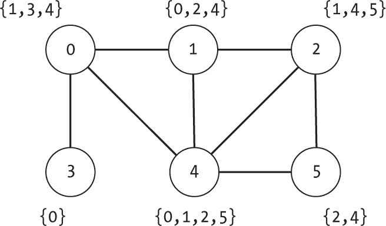
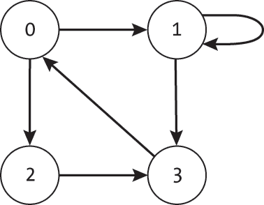
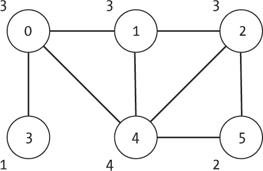
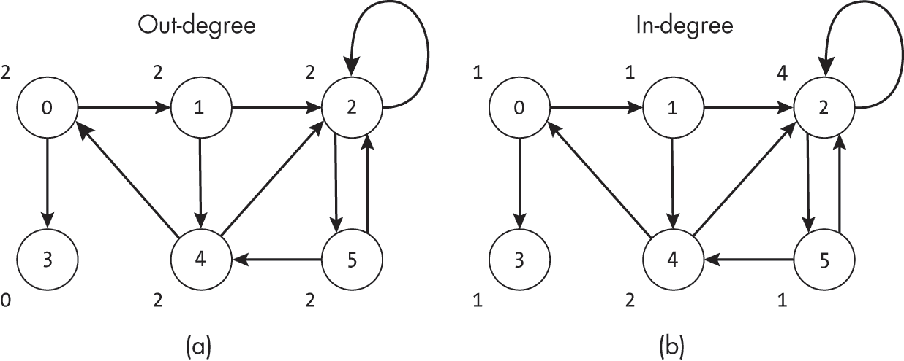
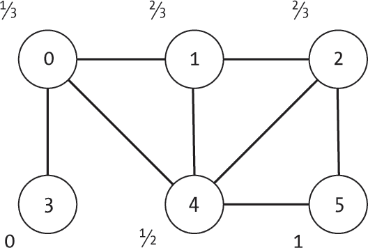
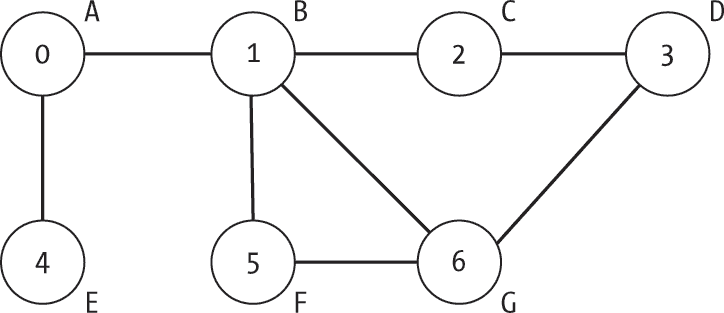
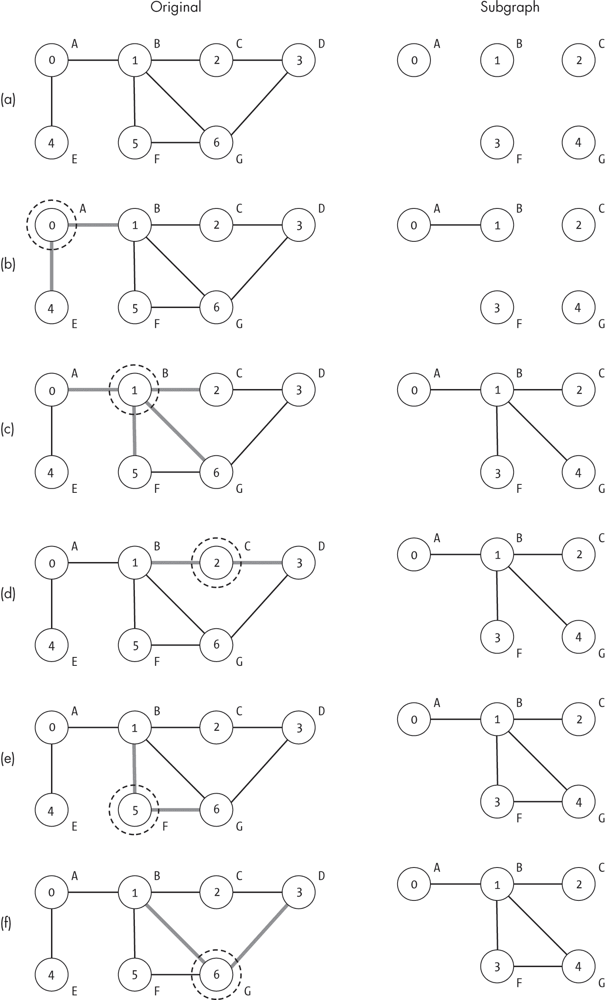

## 2 邻居与邻域


本书中的几乎每个算法都需要与节点的*邻居*进行交互。邻居的概念直观上是非常熟悉的；在无向图中，给定节点的邻居是与该节点共享边的节点。在有向图中，邻居的术语稍微复杂一些，因为邻居的种类取决于边是入边还是出边。

确定给定节点的邻居集合是大多数图算法中的基础步骤，例如，在新的图中搜索路径，以及许多现实世界中的任务。例如，在规划一趟交通网络之旅时，我们可能会问自己，从当前城市可以直接到达哪些城市。

本章介绍了邻居的正式定义，并展示了我们将在本书中使用的一些基本函数。它还介绍了两个基于邻居的度量：节点的度和聚类系数。这些度量提供了有关节点邻域的洞察，帮助我们分析图的特征。节点的度告诉我们它的连接数量，而聚类系数则告诉我们它的邻居之间的互联程度。

### 无向图中的邻居

许多度量和算法需要确定与给定节点*v*直接相邻的节点集合。在无向图中，节点*v*的*邻居*是所有与*v*通过边相连的节点。图 2-1 展示了一个示例图，并列出了每个节点的邻居。节点 0 有三个邻居（1、3 和 4），而节点 3 只有一个邻居（0）。



图 2-1：一个无向图，每个节点列出了其邻居

我们可以为我们的Node类添加一个简短的辅助函数，用于计算无向图中邻居的集合，如清单 2-1 所示。

```
def get_neighbors(self) -> set:  
    neighbors: set = set()
    for edge in self.edges.values():
        neighbors.add(edge.to_node)
    return neighbors 
```

清单 2-1：确定无向图中邻居节点的集合

清单 2-1 中的get_neighbors()函数创建一个空的set数据结构，然后遍历每个节点的边，将相应的邻居添加到集合中。

考虑一个表示社交网络的图，其中每个人是一个节点，节点 *v* 和节点 *u* 之间的无向边表示这两个人是朋友。我们可以使用节点的邻居来编制派对的宾客名单，或模拟谣言在网络中的传播。

作为确定节点邻居的另一个应用，考虑那个古老的问题，“哪位明星和某个特定的演员一起出演过电影？”这是我们将在本章稍后详细讨论的问题。我们可以构建一个共现图，表示哪些演员一起出现在电影中。每个节点代表一个人。一条边表示两个人曾一起出演过同一部电影。由于这种关系始终是对称的，我们使用无向图来建模这些共现。

### 有向图中的邻居

在有向图中，我们可以将几种类型的节点视为邻居：*v* 的出边终点上的节点、*v* 的入边起点上的节点，或者是有向边两侧的节点。为了解决这个模糊性，我们将此类图的邻居分为两种主要类型。*入邻居*是所有具有以 *v* 为目标的边的节点；换句话说，从 *v* 角度看，边是传入的。例如，在一个朋友关系不对称的有向社交网络中，*v* 的入邻居是那些会告诉他们最新八卦的朋友。*出邻居*是所有有出边指向 *v* 的节点，表示 *v* 会将八卦传给这些朋友。

我们在 Node 类中添加的计算出邻居的代码与清单 2-1 中无向图的代码相同，唯一不同的是函数的名称，如清单 2-2 所示。

```
def get_out_neighbors(self) -> set:  
    neighbors: set = set()
    for edge in self.edges.values():
        neighbors.add(edge.to_node)
    return neighbors 
```

清单 2-2：在有向图中确定出邻居集合

get_out_neighbors() 函数遍历所有边，并将目标节点收集到一个集合中，然后返回该集合。社交上的等价物是编制一个列表，列出一个人发送消息的对象。

相比之下，计算入邻居集合的代码需要我们遍历图中的每个节点，因为我们并不维护指向给定节点的边的列表，如清单 2-3 所示。此代码从 Graph 类调用，因此它可以访问所有节点的完整列表。

```
def get_in_neighbors(self, target: int) -> set:  
    neighbors: set = set()
    for node in self.nodes:
      ❶ if target in node.edges:
            neighbors.add(node.index)
    return neighbors 
```

清单 2-3：确定入邻居集合

和其他邻居算法一样，代码从一个最初为空的集合构建邻居。该函数遍历每个节点，检查目标节点是否在该节点的 edges 字典中有条目❶。如果目标节点在该节点的边字典中有条目，则将邻居添加到集合中。

如果我们在无向图上运行清单 2-3 会发生什么？不仅该函数不会失败，而且它还会产生正确的邻居集合。get_in_neighbors() 函数考虑的邻居节点与清单 2-1 中的代码相同，但来自边的相反方向。然而，get_in_neighbors() 在无向图上的效率显著低于 get_neighbors()，因为它会遍历图中的所有节点，而不仅仅是与目标节点连接的那些节点。

### 自环

定义邻居时的另一个复杂性是可能存在的 *自环*，即一条边将一个节点链接到其自身。例如，在图 2-2 中，节点 1 有一条指向自己的边。



图 2-2：带自环的图

自环就像是返回起点的环形道路。更具体地说，我们可以在我关于这本书的对话中将其可视化。如果我们使用加权图来表示我与不同的人进行的对话次数，那么最大的加权边就是一个自环，表示我在努力解决某个问题时自言自语的次数。

在邻接表表示中，自环通过包含一条目标与起点相同的边来表示。在邻接矩阵表示中，节点 *v* 的自环通过矩阵对角线上的非零值来表示（行 = *v*，列 = *v*）。

如果节点 *v* 有自环，我们认为它是自己的邻居。在有向图的情况下，这意味着节点 *v* 既是它自己的入邻居，又是它自己的出邻居，因为边从节点 *v* 开始并以节点 *v* 结束。

在本书中，我们采用计算机科学中常见的约定，只在有向图中允许自环。虽然许多算法可以处理带自环的无向图，并且其他大多数算法也能轻松适配，但这些自环在无向图所建模的问题的背景下通常是没有意义的。例如，在第十六章中讨论的图着色问题要求我们为任何两个通过边连接的节点分配不同的颜色。自环在这样的题目设定中没有意义。

### 度数

理解一个节点的连接性时，一个有用的统计量是其*度数*，即与该节点相连接的边的数量。图 2-3 展示了一个无向图示例，图中的每个节点都标注了其度数。节点 0 的度数为 3，而节点 5 的度数为 2。



图 2-3：一个无向图，显示每个节点的度数

在社交网络中，一个节点的度数表示该人拥有的朋友数量。我们可以将其作为该人受欢迎程度或社交连接的一个粗略代理。

从数学角度来看，在无向图中形成自环的边会被计算两次，因为它们分别与每个端点的节点相接触。尽管在本书的算法中我们不使用无向图中的自环，但在计算度数时为了完整性，我们仍会包括此检查，详见第十八章。

在有向图中，我们将度数的概念分为两个独立的度量，就像邻居一样。一个节点的*出度*衡量该节点的连接数，而其*入度*衡量其他节点指向该节点的边的数量。在社交网络中，您的入度和出度可能分别代表您与多少人分享新闻，以及有多少人向您分享新闻。好的知己是具有高入度和低出度的朋友。好的八卦源则拥有高入度以收集小道消息，并且有高出度，表明他们愿意传播这些小道消息。

在有向图中，形成自环的边具有相同的*起点*和*终点*。它们会分别计算一次入度和一次出度。例如，图 2-4 展示了一个有向图以及每个节点的度数。图的左侧展示了每个节点的出度，而右侧展示了它们的入度。



图 2-4：一个有向图，标注了每个节点的出度（a）和入度（b）

在一个连通图中，计算节点的入度或出度需要统计传入或传出的边的数量。为此，我们可以通过保持计数器而不是构建集合，改编前一节中的邻居计算代码。

### 聚类系数

节点的 *聚类系数*（有时称为 *局部聚类系数*）是一个衡量节点邻居之间相互连接程度的指标。在社交网络的背景下，聚类系数实际上是在问：“我的朋友们在多大程度上也互相是朋友？”当该值为零时，表示我们的朋友们互相不喜欢对方，这样的聚会会非常尴尬。另一方面，当值为一时，表示我们的每一个朋友都与每个其他朋友有连接。

正式来说，在一个无向图中，节点 *v* 的聚类系数是 *v* 的邻居之间存在的边占所有可能边的比例。我们找出所有邻居的集合（即与 *v* 共享一条边的所有节点），统计这些邻居之间共享的边数，然后将其除以该集合内所有可能的边数。如果节点 *v* 有 *k* 个邻居，则它们之间可能存在最多 *k* (*k* – 1) / 2 条边。

拥有一个或更少邻居的节点需要特殊处理，因为它们的邻居没有任何可能的连接。如果某人没有朋友，那么计算他们的朋友之间互相喜欢的百分比就没有意义。为了简化处理，在这种情况下我们返回值 0，表示没有局部连接。

我们可以定义一个函数来计算给定节点索引为 ind 的无向图中节点的聚类系数，如列表 2-4 所示。

```
def clustering_coefficient(g: Graph, ind: int) -> float: 
  ❶ neighbors: set = g.nodes[ind].get_neighbors()
    num_neighbors: int = len(neighbors)

    count: int = 0
    for n1 in neighbors:
        for edge in g.nodes[n1].get_edge_list():
          ❷ if edge.to_node > n1 and edge.to_node in neighbors:
                count += 1

    total_possible = (num_neighbors * (num_neighbors - 1)) / 2.0
  ❸ if total_possible == 0.0:
        return 0.0
    return count / total_possible 
```

列表 2-4：计算局部聚类系数的代码

`clustering_coefficient()` 函数的代码首先使用来自列表 2-1 的 `get_neighbors()` 函数 ❶ 来生成所有邻居节点的集合。然后，它使用一对嵌套的 `for` 循环检查每一对唯一的邻居。第一个 `for` 循环遍历节点的邻居，第二个则遍历邻居的边。

对于每个包含邻居节点的边，代码会检查边的另一端的节点是否具有大于当前邻居节点的索引，并且是否也是原始节点的邻居 ❷。第一个检查是为了避免重复计数邻居。在邻接列表中，无向边会出现两次，但只应计数一次。每条边 (*u*, *v*) 仅当 *u* < *v* 时才会被计数。如果边通过了这一检查，则会被计数。

`clustering_coefficient()` 函数最终返回的是邻居节点之间观测到的边的总数占所有可能边的比例，同时会避免在节点有一个或零个邻居时出现除以零的情况 ❸。

图 2-5 显示了一个示例图，其中列出了每个节点的聚类系数。



图 2-5：带有聚类系数的图

节点 0 有三个邻居（1、3 和 4），它们之间最多可以有三条边，但只有一对邻居（1 和 4）相互连接，这使得它的聚类系数为 1/3。相比之下，节点 5 有两个共享边的邻居，因此它的聚类系数为 1。节点 3 只有一个邻居，因此聚类系数为 0。

#### 计算平均聚类系数

聚类系数仅告诉我们关于单个节点周围图的特征。我们可以通过计算所有节点的*平均局部聚类系数*来扩展这个洞察，这为无向图的局部互联程度提供了一个数值度量。

我们可以通过计算每个邻居的聚类系数，然后取平均值来计算无向图的这个度量，代码如下所示：

```
def ave_clustering_coefficient(g: Graph) -> float:
    total: float = 0.0
    for n in range(g.num_nodes):
        total += clustering_coefficient(g, n)

    if g.num_nodes == 0:
        return 0.0
    return total / g.num_nodes 
```

ave_clustering_coefficient() 函数循环遍历每个节点，对该节点调用 clustering_coefficient()，并将结果累加到一个总数中。只要该函数已经处理过至少一个节点，它就会返回总数除以节点数。例如，图 2-5 中的图有一个局部聚类系数，约为 0.5278。

#### 处理局限性

聚类系数只提供有关邻居节点相对于单个给定节点的连接性的信息，而无法告诉我们这些节点的连接性。例如，考虑图 2-6。节点 0 的聚类系数为 1，表示它的所有邻居都是互相连接的。然而，这并没有告诉我们更远一步的网络情况，更别提*所有*邻居的连接了。

![一个六节点图。节点 0 直接与节点 1 和 2 相连。节点 3、4 和 5 都与节点 1 相连，并且相互之间也有连接；它们被阴影标示出来，表示它们不参与节点 0 聚类系数的计算。]](../images/f02006.jpg)

图 2-6：节点 0 及其直接邻居的相互连接与这些邻居的连接

在图 2-6 中，节点 1 有许多额外的连接，这些连接没有被聚类系数考虑，因为它们没有直接与节点 0 的邻居连接。这些连接以灰色显示，而直接邻居以黑色显示。在这种情况下，节点 1 属于两个不同的互联节点集合，{0, 1, 2}和{1, 3, 4, 5}。

在我们的社交网络示例中，这意味着聚类系数不能告诉我们关于我们朋友的朋友的信息。我们的朋友可能彼此相处得很好，但也可能属于其他群体。实际上，局部聚类系数可以告诉我们我们邀请的派对宾客是否会相互合得来，但它不能告诉我们是否有更大的派对他们会去参加。例如，如果图 2-6 中的节点 0 和节点 4 分别举办派对，节点 1 会喜欢任何一个派对，但在节点 4 的派对上会有更多的朋友。

### 生成邻域子图

我们可以扩展邻居的概念，在无向图中确定一个*邻域子图*，该子图包括邻居节点及其之间的边。根据是否包含原始节点，我们可以定义两种类型的邻域子图。在节点*v*的*开集邻域*子图中，包括节点*v*的邻居以及它们之间的边。而节点*v*的*闭集邻域*子图则包括节点*v*及其所有邻居，以及这些节点之间的边。

#### 代码

我们可以在Graph类中创建一个函数，用于生成给定节点（索引为ind）周围的开集或闭集邻域子图（在无向图中）。这个函数通过确定邻居节点，并利用它们生成一个新的图，然后添加适当的边来操作：

```
def make_undirected_neighborhood_subgraph(self, ind: int, closed: bool):  
  ❶ if not self.undirected:
        raise ValueError

  ❷ nodes_to_use: set = self.nodes[ind].get_neighbors()
    if closed:
        nodes_to_use.add(ind)

    index_map = {}
  ❸ for new_index, old_index in enumerate(nodes_to_use):
        index_map[old_index] = new_index

    g_new: Graph = Graph(len(nodes_to_use), undirected=True)
    for n in nodes_to_use:
        for edge in self.nodes[n].get_edge_list():
          ❹ if edge.to_node in nodes_to_use and edge.to_node > n:
                ind1_new = index_map[n]
                ind2_new = index_map[edge.to_node]
                g_new.insert_edge(ind1_new, ind2_new, edge.weight)

    return g_new 
```

make_undirected_neighborhood_subgraph()函数的代码首先检查图是否为无向图，如果不是，则抛出一个ValueError ❶。虽然这不是严格必要的，并且代码对有向图也能产生一些结果，但它有助于确保该函数按照设计使用。接下来，代码通过从清单 2-1 ❷中的get_neighbors()函数提取目标节点的邻居集合。这个集合nodes_to_use包含将用于子图的所有节点。如果子图是闭集邻域子图，代码会将目标节点本身添加到该集合中。

生成邻域子图的代码稍微复杂一些，因为Graph类对节点的索引方式。由于我们的图使用的是范围为[0, |*V*| – 1]的数字索引，其中|*V*|是节点的数量，因此任何子图可能会对给定节点使用不同的索引。为了解决这个问题，代码构建了一个字典index_map，将旧的节点索引映射到新的节点索引 ❸。这允许生成的子图使用没有间隙的数字索引。正如我们稍后在图 2-8 中看到的，我们可以使用替代信息，如标签，来保留节点的身份。

最后，代码通过一对嵌套的for循环创建了新的图。这段代码与清单 2-4 中的本地聚类系数代码类似。第一个for循环遍历nodes_to_use中的节点，而第二个则遍历该节点的边。通过测试邻接节点的索引（edge.to_node）是否大于当前节点n的索引，函数可以确保每条无向边只被插入一次 ❹。只有当两个节点都在nodes_to_use中并且另一个节点尚未被处理时，才会添加一条新的边。Graph类的insert_edge()函数正确地使用新的节点索引插入无向边。

#### 一个示例

考虑从图 2-7 中的图构建一个邻域子图时会发生什么。回到之前关于电影明星网络的例子，这个图可以表示出出现在世界著名的*图论*系列动作惊悚片中的七位明星（爱丽丝、鲍勃、卡尔、丹、爱德华、菲奥娜和格温）：*图论*（主演爱丽丝和鲍勃）、*图论 2：新节点*（主演鲍勃和卡尔）、*图论 3：失落的边缘*（主演鲍勃、菲奥娜和格温）等等。每个节点都以明星名字的首字母标记，并映射出他们与其他明星的关系。



图 2-7：一个表示《图论》系列明星的无向图 图论 系列

为了更好地了解 Bob 和他的共同出演者的出现情况，我们在 Bob（节点 1）周围构建了一个闭邻域子图。这表示了 Bob 曾与之同框的明星，并捕捉了他们之间的互动。图 2-8 展示了构建此图的操作。左列显示了完整的图，其中当前正在处理的节点由虚线圆圈标示，右列则显示了该时刻的新子图。如前所述，子图的节点使用不同的索引；在这种情况下，我们可能会将明星的名字存储在节点的标签中。



图 2-8：围绕 Bob 构建闭邻域子图的步骤

图 2-8(a)首先创建了一个只包含 Bob 和他的共同演员的新图。邻居集合包括了所有与 Bob 同屏的人。Alice 是从他们在原版《Graph Theory》电影中的合作中加入的，而与明星 Fiona 和 Gwen 的联系则来自该系列的第三部，也是评价最好的一部。

索引在新图中也发生了变化。如图所示，三个人被赋予相同的索引（节点 0、1 和 2），而另外两个人则被分配了新的索引（5 和 6）。Fiona 的节点索引在子图中从 5 改为 3，Gwen 从 6 改为 4。在附录 A 中，我们将讨论如何扩展 Graph 结构，以使用基于字符串的标签，从而无需进行此类索引重映射。

在建立新图后，我们逐一遍历考虑的人员（Bob 和他的共同演员），并向子图添加新的边。当考虑到图 2-8(b)中的节点 0 时，我们只添加了他们的两个边中的一个（0, 1）。这是因为 Alice 和 Bob 都被考虑在内。相反，Edward（节点 4）只和 Alice 一起出演过灾难性的衍生剧《The Golden Vertex》。由于 Edward 从未与 Bob 同屏，他不属于 Bob 的邻域子图。

当我们处理到 Bob，作为该系列的标志性人物时，我们在图 2-8(c)中向三个新的共同演员添加了边。我们没有向 Alice 添加边，因为我们已经处理过该节点及其边。代码继续处理图 2-8(d)中的 Carl，图 2-8(e)中的 Fiona 和图 2-8(f)中的 Gwen。由于 Edward 和 Dan 并未与 Bob 同演，他们不在邻域列表中，因此不会被考虑。最终的子图显示在图 2-8(f)的右侧。

### 为什么这很重要

图的邻居提供了关于给定节点周围局部结构和互联信息的基础。大多数情况下，这些术语的正式定义直观且便于理解。当遍历图时，我们会问哪些节点是当前节点的邻居，因此可以到达。邻居将构成我们在后续章节中讨论图搜索算法的基础，因为许多这些算法共享遍历节点边并查看哪些其他节点与之共享的核心循环。

节点的度数和局部聚类系数等概念提供了关于其直接邻居和邻域的具体度量。这些示例度量只是量化图属性的众多方式中的一部分。已经开发出大量度量标准来分析现实世界图的属性，从它们的互联程度到它们的宽度。对所有图度量的全面回顾超出了本书的范围，但接下来的章节将讨论一些额外的分析方法。

在下一章中，我们将讨论另一个基础的图算法概念：路径。路径描述了图中的移动，并允许我们记录如何从一个节点遍历到另一个节点。
