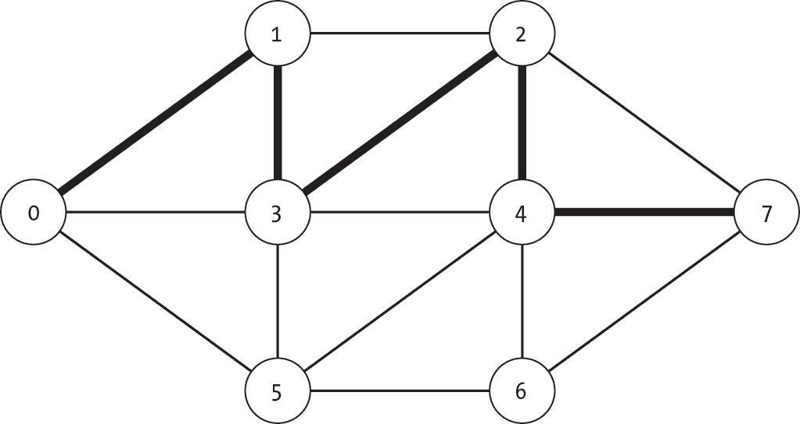
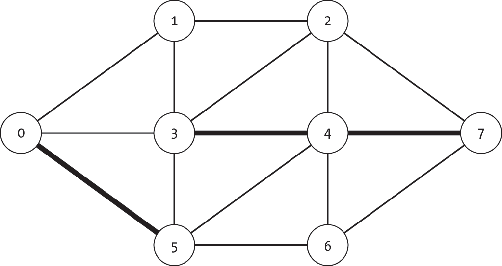
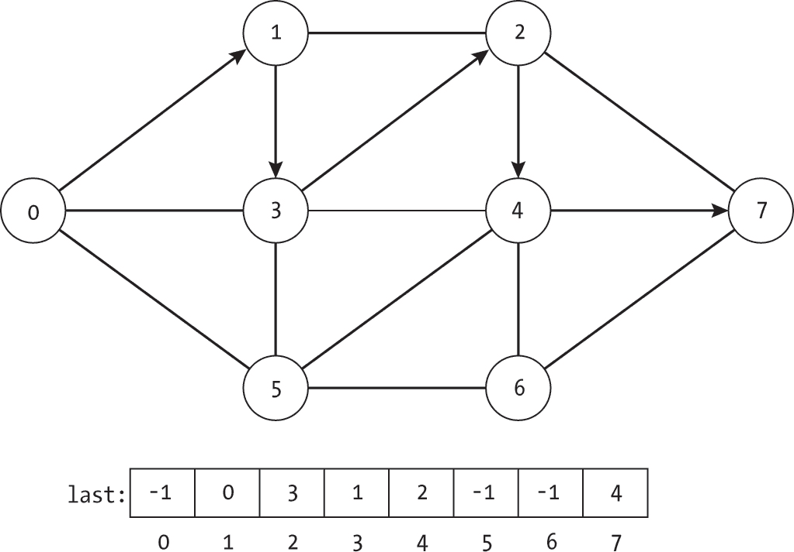
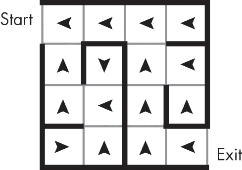
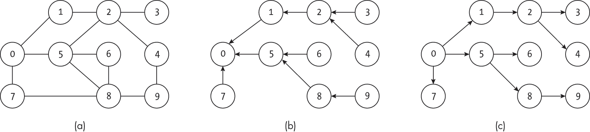
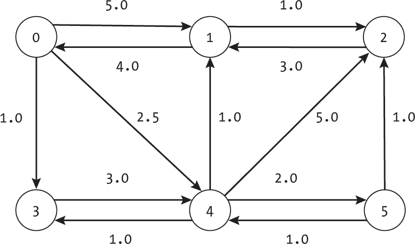
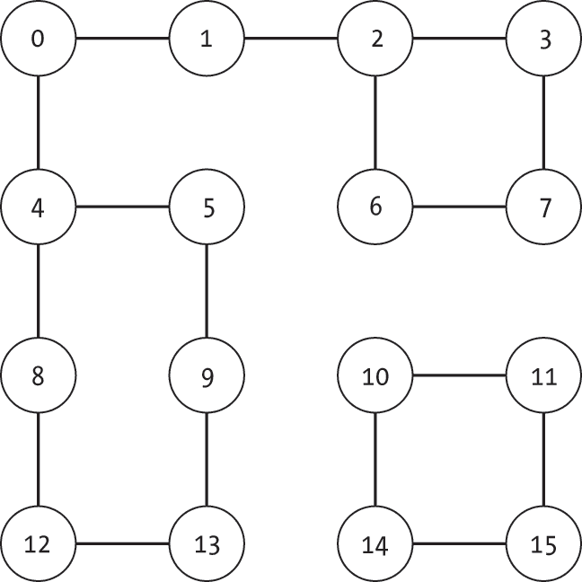

<hgroup>

## <samp class="SANS_Futura_Std_Bold_Condensed_B_11">3</samp> <samp class="SANS_Dogma_OT_Bold_B_11">图中的路径</samp>

</hgroup>


图中的*路径*概念是我们将在全书中使用的另一个基础性构建块。例如，我们可能对确定两个节点之间的最低成本路径（*最短路径算法*）感兴趣，或者我们可能关心是否可以通过任何路径到达一个节点。接下来的多个章节将专门讨论具有不同属性的路径计算。

路径的概念与其现实世界的对应物相似。就像你最喜欢的公园中的路径为你提供了从一个地方到另一个地方的路线，图中的路径也提供了相同的机制。它们是节点（或边）的序列，允许我们在图中移动。当我们逃脱迷宫或进行公路旅行时，我们通过图的边从一个节点移动到另一个节点。

本章正式定义了我们所说的图中的路径，并探讨了表示这些结构的不同方式。无论是寻找路径还是将其作为算法的一部分，我们都需要能够高效且明确地表示它们。如果你曾经请求过指示，结果得到的是模糊的手势和类似“往那边走，到了第三个或第四个路口右转，你应该能看到的”这样的回答，那么你就体验到了使用不完整路径的情况。

本章介绍了三种明确无误的表示方式。我们还考虑了路径的属性以及一些可以利用路径执行的任务。我们探讨了用于检查路径是否有效以及在加权图中计算路径成本的函数。最后，我们讨论了路径与图中可达性问题的关系。

### <samp class="SANS_Futura_Std_Bold_B_11">路径</samp>

图中的*路径*是由边连接的一系列节点。这些是我们在图中从一个节点移动到另一个节点时经过的途径。就像我们将单个边的端点称为起点和终点一样，我们也用这些术语来描述整个路径的端点：路径中的第一个节点是起点，最后一个节点是终点。图 3-1 展示了由节点[0, 1, 3, 2, 4, 7]组成的路径。路径中每一对相邻的节点对应图中的一条边。



<samp class="SANS_Futura_Std_Book_Oblique_I_11">图 3-1：从节点 0 到节点 7 的有效路径</samp>

本书中，我们采用了计算机科学和算法教材中常见的路径定义（作为节点序列）。这与图论中路径的正式定义不同，后者不允许重复节点。在图论中，允许重复节点的路径称为*游走*。采用更一般的路径定义使我们既能与其他算法文本保持一致，也能反映现实世界中的路径。

路径具有方向性，即使在无向图中也是如此。节点列表展示了我们行进路径的顺序。路径[0, 1, 2, 7]从节点 0*到*节点 1*到*节点 2*到*节点 7。这种方向性将在理解本书中算法结果时非常重要。

### <samp class="SANS_Futura_Std_Bold_B_11">路径表示</samp>

在代码中表示路径有多种方式。与所有表示法一样，我们可以根据当前的问题或算法来定制路径的数据结构。本节将介绍几种在代码中存储路径的方法，并讨论它们各自的优缺点。我们还将探讨每种表示法如何与规划公路旅行中的现实世界对应物相匹配。

在本节中，我们还使用检查路径有效性的问题来说明存储表示如何工作以及代码如何遍历它。对于以下代码的目的，我们将空路径（不包含任何节点或边）视为有效。根据问题领域，你可以轻松调整代码，以排除这些情况。

#### <samp class="SANS_Futura_Std_Bold_Condensed_Oblique_BI_11">节点列表</samp>

我们通常使用有序的*节点列表*来表示从起始节点到终止节点的路径，这种表示在许多计算机科学教材中都有。我们定义节点列表为闭区间，所以<samp class="SANS_TheSansMonoCd_W5Regular_11">path[0]</samp>是起始节点的索引（路径起点），而<samp class="SANS_TheSansMonoCd_W5Regular_11">path[N-1]</samp>是路径长度为<samp class="SANS_TheSansMonoCd_W5Regular_11">N</samp>时，终止节点的索引（路径终点）。例如，我们可以将图 3-1 中的路径表示为[0, 1, 3, 2, 4, 7]。这种表示法适用于一个具有固定起点和终点的单一路径。

在我们的公路旅行中，节点列表的表示法相当于列出我们沿途会访问的每个城市。假设我们计划从波士顿出发，途经费城、匹兹堡、哥伦布和印第安纳波利斯。如果我们在每个城市的旅游中心停留，并购买一张纪念明信片（包括起点和终点城市），那么这堆明信片就会总结我们这段激动人心的旅程。

我们通过遍历节点列表并确认每一对节点之间存在边来检查路径是否有效，如下代码所示：

```
def check_node_path_valid(g: Graph, path: list) -> bool: 
    num_nodes_on_path: int = len(path)
  ❶ if num_nodes_on_path == 0:
        return True
  ❷ prev_node: int = path[0]
    if prev_node < 0 or prev_node >= g.num_nodes:
        return False for step in range(1, num_nodes_on_path):
        next_node: int = path[step]
      ❸ if not g.is_edge(prev_node, next_node):
            return False
      ❹ prev_node = next_node
    return True 
```

<samp class="SANS_TheSansMonoCd_W5Regular_11">check_node_path_valid()</samp> 函数首先检查路径是否为空，如果为空，则返回 <samp class="SANS_TheSansMonoCd_W5Regular_11">True</samp> ❶，因为我们定义了零个节点的路径为有效路径。

如果路径不为空，代码会获取路径的起始节点，并检查它是否有效 ❷。然后，代码遍历路径中的其余节点，使用变量 <samp class="SANS_TheSansMonoCd_W5Regular_11">step</samp> 来跟踪当前正在检查的步骤。由于代码已经测试了第一个节点，所以从列表中的第二个节点开始（<samp class="SANS_TheSansMonoCd_W5Regular_11">step=1</samp>）。对于每个新节点，使用 <samp class="SANS_TheSansMonoCd_W5Regular_11">is_edge()</samp> 函数来检查该节点是否有效，并且是否存在一条从前一个节点到该新节点的边 ❸。如果新节点无效或图中没有相应的边，函数会立即返回 <samp class="SANS_TheSansMonoCd_W5Regular_11">False</samp>。检查完边后，代码会继续检查路径中的下一个节点 ❹。如果函数在遍历完整个路径时未发现任何无效节点或边，则返回 <samp class="SANS_TheSansMonoCd_W5Regular_11">True</samp>。

在我们的公路旅行示例中，这段代码对应于遍历城市列表。我们检查每个城市是否是有效城市，并且是否存在一条直接从前一个城市到当前城市的路（换句话说，是否存在一条边）。例如，对于列表 [Boston, New York, Philadelphia, Pittsburgh]，我们会返回 <samp class="SANS_TheSansMonoCd_W5Regular_11">True</samp>，而 [Boston, New York, Madrid, Philadelphia, Pittsburgh] 显然会返回 <samp class="SANS_TheSansMonoCd_W5Regular_11">False</samp>。

#### <samp class="SANS_Futura_Std_Bold_Condensed_Oblique_BI_11">边的列表</samp>

另一种表示路径的自然方法是使用 *边的列表*。路径的起点和终点分别对应第一个边的起点和最后一个边的终点。列表中的每一条边表示两个节点之间的转换。

该公式要求附加的约束条件，即每条边的起点（除了第一条边外）必须等于前一条边的终点。我们说只有当边集 [*e*[0], *e*[1], . . . , *e*k] 满足以下条件时，它才是一个有效路径：

*e*[(]i [− 1)].<samp class="SANS_TheSansMonoCd_W5Regular_11">to_node</samp> = *e*i.<samp class="SANS_TheSansMonoCd_W5Regular_11">from_node</samp> 对于所有 *i* > 0

该定义限制了路径，要求每个段（边）的起点必须与前一个段（边）的终点对齐，从而与现实世界的情况相符。我们不允许路径在一个节点停止后，从另一个不同的节点重新开始。如果朋友给你关于从波士顿到西雅图的公路旅行指示，其中第一天是从波士顿开车到匹兹堡，第二天是从辛辛那提开车到圣路易斯，你很快会意识到有问题：拟定的路线跳过了俄亥俄州的大部分地方。图 图 3-2 中的路径就像我们朋友的错误指示一样，是无效的。



<samp class="SANS_Futura_Std_Book_Oblique_I_11">图 3-2：图中无效路径</samp>

在将路径表示为边的列表时，我们将每条边表示为元组（<samp class="SANS_TheSansMonoCd_W5Regular_11">from_node</samp>, <samp class="SANS_TheSansMonoCd_W5Regular_11">to_node</samp>），以便与 <samp class="SANS_TheSansMonoCd_W5Regular_11">Edge</samp> 对象相对应。例如，图 3-1 中的路径对应于 [(0, 1), (1, 3), (3, 2), (2, 4), (4, 7)]。

我们通过遍历边的列表来检查路径是否有效，并确认最后一条边的终点是否与当前边的起点匹配，并且边在图中是否存在，如以下代码所示：

```
def check_edge_path_valid(g: Graph, path: list) -> bool: 
  ❶ if len(path) == 0:
        return True

  ❷ prev_node: int = path[0].from_node
    if prev_node < 0 or prev_node >= g.num_nodes:
        return False

    for edge in path:
      ❸ if edge.from_node != prev_node:
            return False

        next_node: int = edge.to_node
        if not g.is_edge(prev_node, next_node):
            return False

        prev_node = next_node
    return True 
```

<samp class="SANS_TheSansMonoCd_W5Regular_11">check_edge_path_valid()</samp> 函数首先检查路径是否为空，如果是，则返回 <samp class="SANS_TheSansMonoCd_W5Regular_11">True</samp> ❶，因为我们之前将零边的路径定义为有效。否则，代码将路径的起始节点作为第一条边的起点 ❷。它检查该节点是否具有有效的索引，如果没有，则返回 <samp class="SANS_TheSansMonoCd_W5Regular_11">False</samp>。

然后，代码会遍历路径上的所有边。对于每一条边，它首先检查该边的起点是否与上一条边的终点相匹配 ❸。接着，它提取新的目标节点（<samp class="SANS_TheSansMonoCd_W5Regular_11">next_node</samp>）的索引，并使用 <samp class="SANS_TheSansMonoCd_W5Regular_11">is_edge()</samp> 函数检查节点是否有效，并且该边是否存在。如果新节点无效，或者图中没有相应的边，函数将立即返回 <samp class="SANS_TheSansMonoCd_W5Regular_11">False</samp>。检查完边之后，代码会继续处理路径上的下一条边。如果没有发现任何无效的节点或边，函数将返回 <samp class="SANS_TheSansMonoCd_W5Regular_11">True</samp>。

#### <samp class="SANS_Futura_Std_Bold_Condensed_Oblique_BI_11">前一个节点的列表</samp>

本书中的许多算法采用一种更为专业的路径表示方法，将节点映射到路径上前一个节点的列表。这种方法非常适合本书中许多算法通过从一个节点到下一个节点来处理数据的方式。它既有显著的优点，也有显著的缺点。

考虑路径[0, 1, 3, 2, 4, 7]，如图 3-3 所示。对于路径中的每个节点，我们可以指示哪个节点在其之前，如列表<samp class="SANS_TheSansMonoCd_W5Regular_11">last</samp>所示。值<samp class="SANS_TheSansMonoCd_W5Regular_11">last[4]=2</samp>表示我们是*从*节点 2*到*节点 4 的。我们使用特殊值−1 来表示一个节点没有前置节点。这可能是因为该节点要么是路径中的第一个节点（路径的起点），要么根本不属于路径。



<samp class="SANS_Futura_Std_Book_Oblique_I_11">图 3-3：图中的路径及其作为前置节点数组的表示</samp>

这种表示方法的主要缺点是，它限制了我们可以表示的路径类型。每个节点最多只能有一个前置节点。我们无法表示许多会重新访问节点的路径，例如[0, 1, 3, 0, 5, 3, 4, 7]。如果我们尝试将此路径表示为前置节点的数组，我们将遇到节点 3 的<samp class="SANS_TheSansMonoCd_W5Regular_11">last</samp>条目的问题。节点 3 首先由节点 1 前置，随后又由节点 5 前置。虽然可以定义更复杂的列表来处理这些情况，但我们使用单一的索引列表，因为它非常适合本书中的算法。

这种表示方法的主要优点是，更新路径非常容易，因为我们只需更改一个索引值。在后续章节中，我们将一遍又一遍地使用这种行为来简化代码。另一个优点是，这种表示方法可以捕捉多个分支路径。与前两种使用单一固定起点和终点节点的表示方法不同，前置节点表示法仅需要一个固定的起点。该列表可以用来从*任何*目标节点提取路径，回到起点。

在公路旅行类比中，前一个节点列表的表示相当于列出你*可能*访问的每个城市，以及你从哪个城市出发前往该城市。如果你的计划发生变化，决定访问匹兹堡，你可以通过费城和波士顿追踪前一个节点链。前一次访问的列表提供了从起始城市出发的所有可能停靠点的信息。

另一个有用的类比是，冒险者在探索迷宫时所做的粉笔标记，如图 3-4 所示。



<samp class="SANS_Futura_Std_Book_Oblique_I_11">图 3-4：迷宫中的粉笔标记，指示你从哪里来</samp>

为了不迷路，冒险者在每个交叉口画一个粉笔箭头，指示他们用来到达当前房间的通道。这些标记沿着走过的路径指向后方。这种粉笔标记相比面包屑具有明显的优势，因为它们的整体信息量更大，允许冒险者从地牢中的任何房间找到回到起点的路径。特别是，如果他们知道出口的位置，他们可以从出口重新构建回到起点的路径。

##### <samp class="SANS_Futura_Std_Bold_Condensed_B_11">将前一个节点列表转换为节点列表</samp>

为了将前一个节点的表示转化为节点列表，我们从给定的目标节点开始，倒着遍历<samp class="SANS_TheSansMonoCd_W5Regular_11">last</samp>列表中的指针，如下面的代码所示：

```
def make_node_path_from_last(last: list, dest: int) -> list: 
  ❶ reverse_path: list = []
    current: int = dest

  ❷ while current != -1:
        reverse_path.append(current)
      ❸ current = last[current] ❹ path: list = list(reversed(reverse_path))
    return path 
```

<samp class="SANS_TheSansMonoCd_W5Regular_11">make_node_path_from_last()</samp>函数首先以反向的方式编译路径列表，并将其存储在<samp class="SANS_TheSansMonoCd_W5Regular_11">reverse_path</samp>中，然后在最后将顺序反转。最初，代码将<samp class="SANS_TheSansMonoCd_W5Regular_11">reverse_path</samp>列表设置为空，并从目标节点开始，设置<samp class="SANS_TheSansMonoCd_W5Regular_11">current</samp>节点为目标❶。它使用一个<samp class="SANS_TheSansMonoCd_W5Regular_11">while</samp>循环遍历路径，直到遇到<samp class="SANS_TheSansMonoCd_W5Regular_11">-1</samp>，这表示没有前一个节点❷。在循环的每一步，代码将当前节点附加到<samp class="SANS_TheSansMonoCd_W5Regular_11">reverse_path</samp>中，并根据<samp class="SANS_TheSansMonoCd_W5Regular_11">last</samp>定义的前一个节点❸进行移动。最后，代码创建一个反向的<samp class="SANS_TheSansMonoCd_W5Regular_11">reverse_path</samp>副本（即正确顺序的路径），并返回该列表❹。

让我们考虑当我们将代码应用于 图 3-5(a) 中的图，以及一个表示从节点 0 开始的路径的 <samp class="SANS_TheSansMonoCd_W5Regular_11">last</samp> 数组时会发生什么：

[−1, 0, 1, 2, 2, 0, 5, 0, 5, 8]

图 3-5(b) 显示了图中的回溯指针。正如我们所见，箭头指向回到原点节点。图 3-5(c) 反转每个点，以展示如何重建前向路径。



<samp class="SANS_Futura_Std_Book_Oblique_I_11">图 3-5：一个示例图（a），广度优先搜索创建的最后指针（b），以及通过图的相应前向路径（c）</samp>

如果我们将节点 9 作为目标节点（<samp class="SANS_TheSansMonoCd_W5Regular_11">dest=9</samp>），我们按以下方式构建反向路径（表示为节点列表）：

[9]

[9, 8]

[9, 8, 5]

[9, 8, 5, 0]

在这种情况下，返回的最终路径是 [0, 5, 8, 9]。

如前所述，前节点表示法使我们能够表示从单个起始节点到图中所有目标节点的路径。因此，通常无法将节点列表或边列表表示法转换为完整的前节点列表表示法。回到 图 3-5，从节点 0 到节点 3 的节点列表路径为 [0, 1, 2, 3]。虽然这告诉我们从节点 0 到节点 3 的路径的所有信息，但它并没有告诉我们从节点 0 到任何*不*在列表中的节点的路径。我们无法用它推导出从节点 0 到节点 5 的路径。

##### <samp class="SANS_Futura_Std_Bold_Condensed_B_11">检查前节点列表的有效性</samp>

为了测试这种路径类型的有效性，我们遍历列表中的所有条目，并检查前节点是否为 −1，或者边是否存在：

```
def check_last_path_valid(g: Graph, last: list) -> bool: 
  ❶ if len(last) != g.num_nodes:
        return False

    for to_node, from_node in enumerate(last):
      ❷ if from_node != -1 and not g.is_edge(from_node, to_node):
            return False
    return True 
```

<samp class="SANS_TheSansMonoCd_W5Regular_11">check_last_path_valid()</samp> 代码首先检查 <samp class="SANS_TheSansMonoCd_W5Regular_11">last</samp> 列表是否具有正确的条目数量 ❶。即使所有条目都是 −1，仍然需要为每个节点提供一个条目。

然后代码使用 Python 的<samp class="SANS_TheSansMonoCd_W5Regular_11">enumerate()</samp>函数遍历列表，其中<samp class="SANS_TheSansMonoCd_W5Regular_11">to_node</samp>是当前正在检查的<samp class="SANS_TheSansMonoCd_W5Regular_11">last</samp>的索引，<samp class="SANS_TheSansMonoCd_W5Regular_11">from_node</samp>是相应的值。代码检查是否<samp class="SANS_TheSansMonoCd_W5Regular_11">from_node</samp>为-1，表示路径上没有前一个节点，或者<samp class="SANS_TheSansMonoCd_W5Regular_11">to_node</samp>和<samp class="SANS_TheSansMonoCd_W5Regular_11">from_node</samp>的组合对应有效边 ❷。如果两者都不成立，代码立即返回<samp class="SANS_TheSansMonoCd_W5Regular_11">False</samp>。如果<samp class="SANS_TheSansMonoCd_W5Regular_11">last</samp>中的每个条目都是有效的，代码返回<samp class="SANS_TheSansMonoCd_W5Regular_11">True</samp>。

在我们的公路旅行示例中，这个函数遍历列表中的每个城市，并询问：“我们能直接从上一个城市到达那里吗？”我们会批准匹兹堡（Pittsburgh）的一个条目，该条目的前一个节点是费城（Philadelphia）或伊利（Erie）。然而，我们会坚决拒绝一个前一个节点为圣塔菲（Santa Fe）的波士顿（Boston）条目。

### <samp class="SANS_Futura_Std_Bold_B_11">计算路径成本</samp>

对于许多使用案例，我们不仅可能对使用哪些边来构建路径感兴趣，还可能对路径整体的效益或成本有一个总体的度量。正如我们在第一章中看到的，我们可以使用边的权重来捕捉两个节点之间的遍历成本，例如在公路旅行中使用它们来模拟城市之间的距离。当我们规划从波士顿到西雅图的航班行程时，可能会跳过波士顿到迈阿密的边，因为它的成本接近 1,500 英里。

我们在加权图中定义*路径的成本*为沿路径的所有边权重的总和。形式上，我们说，对于一个路径[*e*[0], *e*[1], . . . , *e*k]：

*PathCost*([*e*[0], *e*[1], . . . , *e*k]) = *∑*i = [1] to k *e*i.<samp class="SANS_TheSansMonoCd_W5Regular_11">weight</samp>

图 3-6 中路径[0, 3, 4, 2]的成本为 1.0 + 3.0 + 5.0 = 9.0。



<samp class="SANS_Futura_Std_Book_Oblique_I_11">图 3-6：带有六个节点的加权有向图</samp>

对于无权图，我们通常使用每条边的单位值 1.0，因此计算成本为使用的边的数量。

如果我们有一个表示路径的边列表，我们可以通过遍历这些边来计算路径的成本，如清单 3-1 中所示。

```
def compute_path_cost_from_edges(path: list) -> float: 
  ❶ if len(path) == 0:
        return 0.0

    cost: float = 0.0
    prev_node: int = path[0].from_node
    for edge in path:
      ❷ if edge.from_node != prev_node:
            cost = math.inf
        else:
            cost = cost + edge.weight
        prev_node = edge.to_node

    return cost 
```

<samp class="SANS_Futura_Std_Book_Oblique_I_11">列表 3-1：计算总路径成本的函数</samp>

代码首先检查路径是否至少包含一条边，如果没有，则返回成本 <samp class="SANS_TheSansMonoCd_W5Regular_11">0.0</samp> ❶。它还初始化了用于跟踪总成本 (<samp class="SANS_TheSansMonoCd_W5Regular_11">cost</samp>) 和之前看到的节点 (<samp class="SANS_TheSansMonoCd_W5Regular_11">prev_node</samp>) 的变量。<samp class="SANS_TheSansMonoCd_W5Regular_11">prev_node</samp> 变量用于评估路径的有效性。

<samp class="SANS_TheSansMonoCd_W5Regular_11">compute_path_cost_from_edges()</samp> 函数计算路径的成本，通过遍历列表中的每条边。它检查当前边的起点是否与最后一个节点匹配 ❷。如果节点不匹配，则路径无效。例如，边列表 [(0, 1), (2, 3), (3, 4)] 就无效，因为没有一条边连接节点 1 和节点 2，无法直接从节点 1 跳到节点 2。如果转换有效，则将边的权重加到成本中。如果转换无效，则使用无穷大的权重。根据实现方式，程序员可能会选择抛出异常、退出程序或使用其他方法来表示错误。代码更新 <samp class="SANS_TheSansMonoCd_W5Regular_11">prev_node</samp> 变量来跟踪新的当前位置。

代码继续遍历列表，检查每条边并计算其权重的总和。当它完成列表中的每一条边时，它返回总成本，使用 <samp class="SANS_TheSansMonoCd_W5Regular_11">return cost</samp>。

与本章其他函数不同，我们有意没有向此实现传递图，以演示如何仅在纯边列表上操作。这种简单性的缺点是该函数无法验证路径与图本身的一致性。我们可以通过传递图并使用它来验证节点索引和边的存在，扩展该函数以执行额外的检查。执行这些额外检查的代码遵循其他函数中的方法。

### <samp class="SANS_Futura_Std_Bold_B_11">可达性</samp>

我们可以使用路径的公式化来形式化图中的另一个重要问题：“节点 *v* 是否可以从节点 *u* 到达？”这个问题对许多现实世界的问题至关重要。在交通网络中，它转化为问题：“我们能否从城市 *u* 到达城市 *v*？”在社交网络中，它转化为问题：“谣言能否从人 *u* 传播到人 *v*？”在迷宫中，它转化为至关重要的问题：“我能从这里到达出口吗？”

我们说节点 *v* 可以从节点 *u* 达到，当且仅当从节点 *u* 出发并到达节点 *v* 存在一条路径。给定一个候选路径，我们可以使用本章前面介绍的任何有效性检查器来测试该路径是否有效。

假设你被困在图 图 3-7 所表示的城堡地牢中。边表示相邻房间之间有无锁的门。为了逃离邪恶的巫师，你需要找到一间有通往楼上的楼梯的房间。在这里，可达性问题至关重要。如果你从房间 0 出发并且需要到达节点 15，那你就不走运了。节点 15 无法从节点 0 到达。



<samp class="SANS_Futura_Std_Book_Oblique_I_11">图 3-7：表示城堡地牢中各房间连接关系的图</samp>

在无向图中，我们可以将节点划分为不相交的集合，称为*连通分量*，使得每个连通分量中的任意节点都可以从该分量中的其他节点到达。给定节点子集 *V*′ ⊆ *V*，我们可以说一个连通分量是一个最大节点集，使得：

*reachable*(*u*, *v*) 对所有 *u* ∈ *V*′ 和 *v* ∈ *V*′成立

在我们来自 图 3-7 的地牢示例中，地图由两个连通分量 {0, 1, 2, 3, 4, 5, 6, 7, 8, 9, 12, 13} 和 {10, 11, 14, 15} 组成。如果楼梯在与当前房间相同的连通分量中，我们就没问题。否则，我们就被困住了。

### <samp class="SANS_Futura_Std_Bold_B_11">为什么这很重要</samp>

在本书中，我们将使用路径的概念来解决从路径规划到优化通过容量有限网络的流量等问题。路径将成为许多算法中使用的基本数据单元，并且是函数计算的最常见结果之一。诸如可达性和路径代价等概念将是众多算法的基础，从 第十一章 中找到强连通分量，到在 第十五章 中对二分图进行匹配。

除了在计算上的实用性，路径还可以帮助我们在现实世界的背景下可视化算法的操作。与其把路径看作抽象的“边的序列”，不如将路径想象成它们在现实世界中的对应物。本章反复使用公路旅行的类比，将边映射为跨越全国的道路。我们同样可以想象，通过本书讨论的许多算法物理地走过这些路径。

下一章将在路径的概念基础上，探讨多种探索图并返回所经过路径的算法。这些路径提供了关于搜索功能和在图中导航能力的重要信息。
