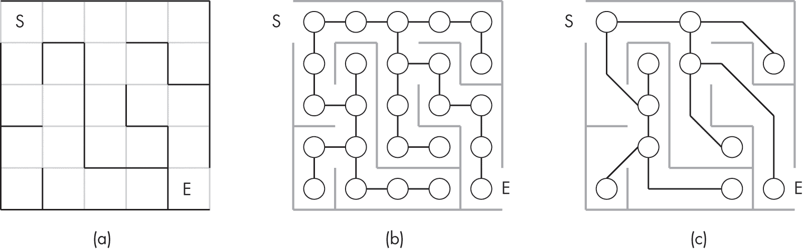
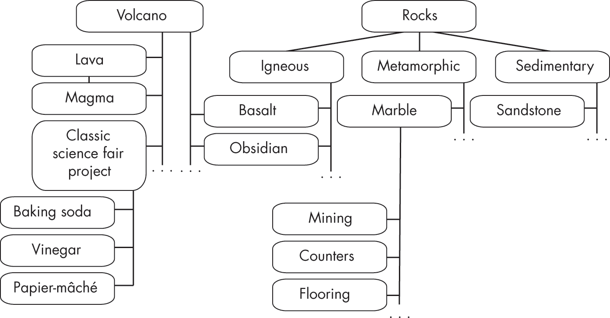
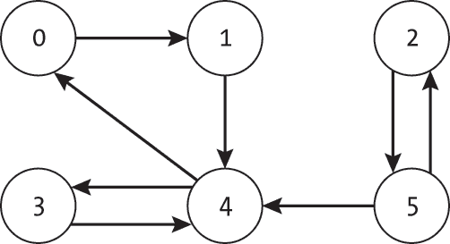
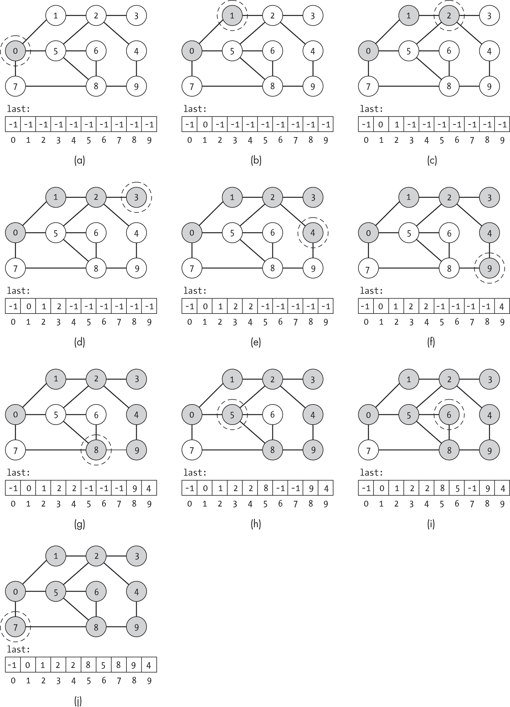
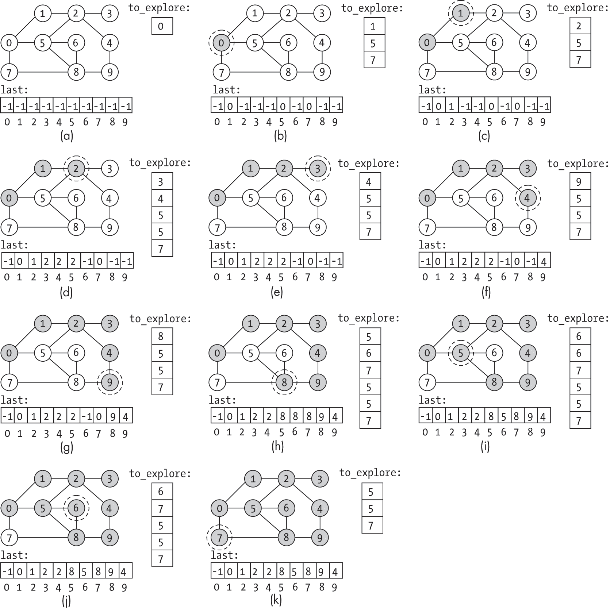
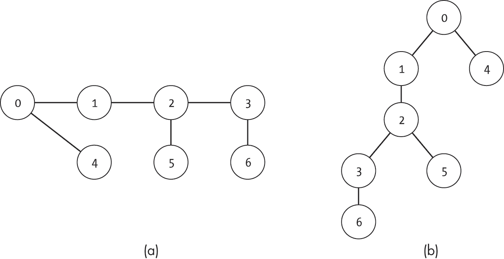
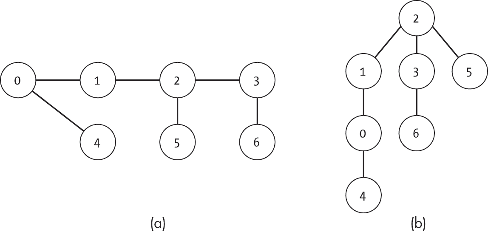
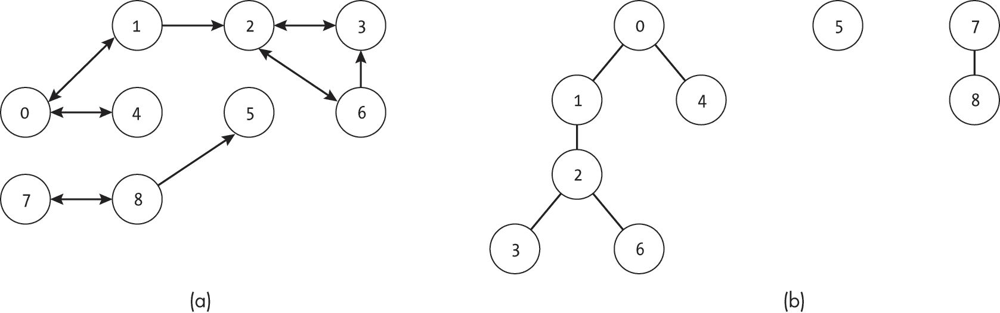
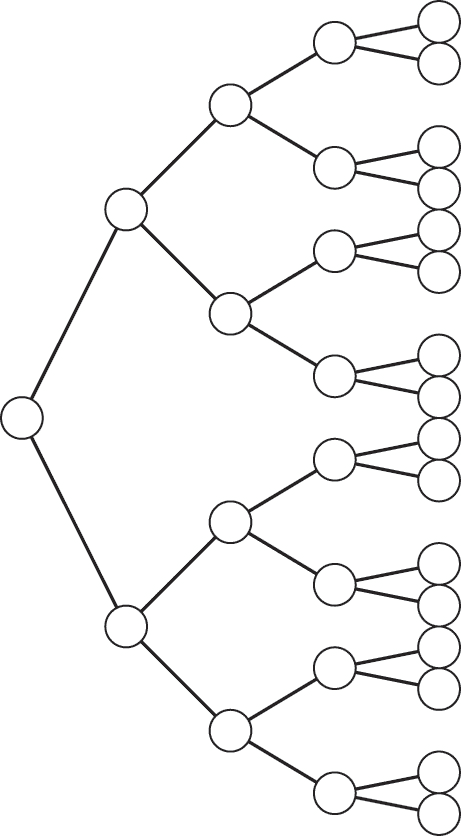
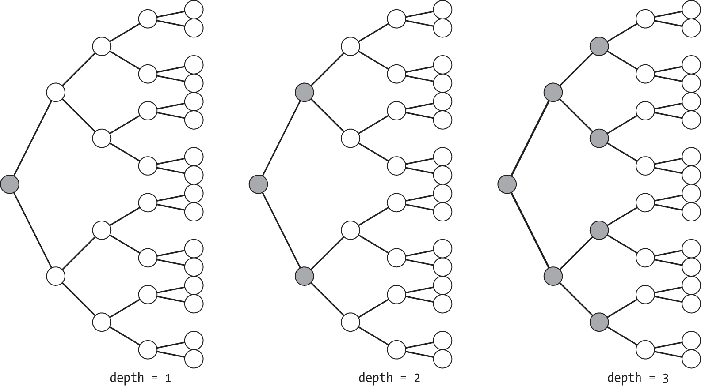

## 第四章：4 深度优先搜索


在考虑图搜索算法时，会有几个自然的问题浮现。我们为什么要搜索图？我们在寻找什么？当我们创建图时，难道没有找到所有的节点吗？在某种程度上，*图搜索*这一术语没有充分体现这些算法的普适性。图搜索算法提供了一种系统地遍历图中所有节点的机制。我们可以利用这一能力来搜索特定的节点，比如在迷宫中寻找隐藏的宝藏，或是枚举并分析图的其他属性。

我们将从*深度优先搜索*开始探索图搜索。该算法通过一次探索当前节点出发的每一条边，逐步深入图中，然后回溯并尝试其他路径。这无疑是本书中最强大、最灵活、最有用的图算法之一，为后续章节中许多更高级的算法提供了核心逻辑。

深度优先搜索之所以如此有用，源于其简洁性和适应性。它可以通过一个相对简单的递归函数实现，并且通过少量的改进，它能够编译出关于图的海量信息。这使得它能够像可靠的厨房搅拌机一样为我们服务，帮助我们从基本的面包到婚礼蛋糕的制作。

本章介绍了深度优先搜索的潜在应用场景，然后讲解了该搜索的递归和基于栈的算法。我们展示了如何使用深度优先搜索来确定图的连通分量，并讨论了该搜索的两个有用扩展：深度优先搜索树和迭代加深。

### 使用场景

为了概述深度优先搜索的工作原理及其为何有用，让我们回顾一下在日常生活中可能使用此搜索的一些场景。

#### 探索篱笆迷宫

想象你站在一个巨大的篱笆迷宫入口处。随着紧张感的增加，你提醒自己，这并不是一个古希腊神话中的迷宫，没有怪物等着袭击那些毫无防备的冒险者。你只是在面对一项考验你空间感知和导航能力的多英亩挑战。一旁无聊的青少年工作人员喃喃自语着一句并不太令人放心的安慰：“他们通常会在关门前巡查迷宫，捡起迷路的徒步者。”

在这种情况下，图形搜索相当于从入口节点开始，寻找图中一个特殊节点——出口。如图 4-1 所示，你可以通过多种有效方式将迷宫表示为图。图 4-1(a) 显示了迷宫的形状。如图 4-1(b)所示，你可以将物理空间划分为单元格，并将每个单元格称为一个节点，与可达的相邻空间通过边连接。或者，如图 4-1(c)所示，你只为入口、出口和决策点创建节点。连接这些特殊点之间的路径成为图的边。



图 4-1：迷宫（a）与两种不同的图形表示（b）和（c）

在本章中，我们将多次回到这个迷宫的例子，作为一种有趣且简单的方式来可视化自己在图中徘徊。迷宫的例子还提供了现实世界中有趣的对应场景，用于标记节点或选择该走哪条边。更重要的是，我们可以随时添加怪物来增加一点刺激：所有最好的迷宫都会涉及一些危险。

#### 学习新学科

学习新学科可以看作是一个图形探索问题。每个节点代表一个感兴趣的子主题，边表示它们之间的关联。图形搜索表示通过各种子主题的学习旅程。目标不是到达某个特定的节点，而是覆盖该主题图的相关部分。

例如，考虑地质学这一总体主题。一位勇敢的学生开始学习关于这一学科的所有知识，从岩石这一主题入手。当他们阅读每个子主题时，他们构建了一个相关知识的图，如图 4-2 所示。他们的学习路径深入到细节中。对火成岩的参考引发了对黑曜岩的兴趣，进而是对火山的兴趣，最后做了经典的小苏打与醋火山科学实验。另一条路径带领他们通过变质岩到大理石，然后他们涉足了室内装饰和地板安装的相关内容。



图 4-2：从岩石主题开始的子主题图

图 4-2 中的图是极其不完整的。许多有趣的主题（如俯冲带和铝土矿）被省略了，而且图中连接这些主题的边远远不止所显示的数量。许多不同的岩石会与常见元素或矿物共享连接。仅仅探索该领域的整个主题图可能需要一生的时间。正如我们将在本章和下一章看到的那样，使用的搜索类型会对我们接近主题的顺序产生深远影响。

#### 检查可达性

在我们的日常生活中，我们经常想知道是否存在一条从给定起始节点到某个节点的路径。例如，我们可能会使用航班图来检查是否可以在两座城市之间旅行，或者我们可能会使用社交网络来检查一个谣言是否会从一个人传播到另一个人。

考虑图 4-3 中表示的人物网络。每个节点代表一个人，从节点 *u* 到节点 *v* 的边表示 *u* 愿意与 *v* 分享信息。一个由 0 号人物发现的有用信息可以通过图传递给 1、3 和 4 号人物。在 3 号人物的情况下，信息首先通过 1 号和 4 号人物。然而，2 号和 5 号人物完全被排除，因为没有任何信息共享路径通向他们。



图 4-3: 一个有六个节点的示例有向图

本章稍后我们将探讨*可达性*和*连通组件*的概念，并在第十二章讨论这些问题在有向图中的算法。现在，了解图搜索如何回答可达性问题就足够了。给定起始节点 *S* 和目标节点 *G*，我们只需要从节点 *S* 开始搜索，并检查是否找到了节点 *G*。如果找到了，那么它们之间必定存在某条路径。

### 递归深度优先搜索

我们通常将深度优先搜索实现为一个*递归算法*，其中核心功能会针对每个节点被调用一次。本节展示了此搜索的代码，并通过一个示例图展示了它的执行过程。

#### 代码

清单 4-1 显示了深度优先搜索的简化版本。

```
def dfs_recursive_basic(g: Graph, ind: int, seen: list): 
  ❶ seen[ind] = True
    current: Node = g.nodes[ind]

    for edge in current.get_edge_list():
        neighbor: int = edge.to_node
      ❷ if not seen[neighbor]:
            dfs_recursive_basic(g, neighbor, seen) def depth_first_search_basic(g: Graph, start: int):
    seen: list = [False] * g.num_nodes
    dfs_recursive_basic(g, start, seen) 
```

清单 4-1: 核心深度优先搜索递归函数

递归辅助函数需要几个信息：图本身 (g)，当前正在探索的节点索引 (ind)，以及一个映射每个节点是否已访问的列表 (seen)。代码首先标记当前节点为已访问 ❶ 并获取 Node 数据结构。然后通过遍历边的列表检查每个节点的邻居。对于任何尚未访问的节点 ❷，它递归地在该节点上调用搜索。

外部函数设置了 seen 列表，并从一个特定的起始节点索引 (start) 开始深度优先搜索。这个外部函数只从单一的起始节点开始搜索，因此只访问从该节点可以到达的节点。如果我们想访问每一个节点，就需要从每一个之前未访问过的节点开始搜索。正如示例 4-2 所示，我们将外部函数扩展为按顺序遍历节点，并从每个未访问过的节点调用递归的深度优先搜索。

```
def depth_first_search_basic_all(g: Graph): 
    seen: list = [False] * g.num_nodes
    for ind in range(g.num_nodes):
      ❶ if not seen[ind]:
            dfs_recursive_basic(g, ind, seen) 
```

示例 4-2：一个探索图中所有节点的深度优先搜索

在初始化 seen 列表之后，代码循环遍历每个节点索引，检查该节点是否已在之前的深度优先搜索中被访问过 ❶，如果没有，则从该节点开始新的深度优先搜索。

虽然这段代码执行了深度优先搜索，但它并没有对搜索做任何有趣的处理。这就像在迷宫中散步，但没有记录任何解决方案。让我们考虑简单地添加记录路径的功能。这相当于带着一本笔记本进入迷宫，记录我们走的方向。

记录深度优先搜索过程中经过路径的代码使用了一个额外的列表——last 节点索引，即当前节点之前访问的节点：

```
def dfs_recursive_path(g: Graph, ind: int, seen: list, last: list): 
    seen[ind] = True
    current: Node = g.nodes[ind]

    for edge in current.get_edge_list():
        neighbor: int = edge.to_node
        if not seen[neighbor]:
          ❶ last[neighbor] = ind
            dfs_recursive_path(g, neighbor, seen, last) def depth_first_search_path(g: Graph) -> list: 
    seen: list = [False] * g.num_nodes
    last: list = [-1] * g.num_nodes

    for ind in range(g.num_nodes):
        if not seen[ind]:
            dfs_recursive_path(g, ind, seen, last)
    return last 
```

递归函数的开始方式与之前的基础版本相同。当前节点的索引被标记为已访问，当前节点被检索，并且一个 for 循环检查该节点的每个邻居是否已被访问。只有在探索新节点时，行为才有所不同。在递归调用新节点的深度优先搜索之前，代码会记录当前节点（ind）紧接着下一个节点（neighbor） ❶。正如在第三章中讨论的，last 列表提供了所有重建搜索路径所需的信息。

外部函数类似地被修改为初始化并传入这个之前节点的列表 last。last 列表使用一个指示值 -1 来表示没有前置节点。搜索结束时值为 -1 的节点是各种深度优先搜索的起始节点。

#### 一个示例

图 4-4 显示了在一个包含 10 个节点的无向图上进行递归深度优先搜索的示例。每个子图显示当前节点在函数中被标记为已访问后的状态。虚线圆圈表示正在探索的当前节点。阴影节点是已访问（因此标记为已访问）的节点。last 向量展示了搜索过程中图形路径的变化。

搜索从图 4-4(a)中的节点 0 开始，节点 0 有三个邻居：节点 1、5 和 7。我们可以将其可视化为探险者在迷宫中探险（比起树篱迷宫，这更为刺激）。节点 0 代表探险者站在第一个交叉口，考虑前方的三个可能分支。他们不知道哪个分支会通向出口，哪个会导致死胡同。

搜索选择了第一个邻居节点 1，并递归触发深度优先搜索。在图 4-4(b)中探索节点 1 时，我们可以看到 last 已被更新，表示节点 1 是从节点 0 到达的。就像我们的探险者从交叉点 0 走到交叉点 1 时，他们在小笔记本中记录下这一步，以便将来传承下去。



图 4-4：对具有 10 个节点的图进行递归深度优先搜索

深度优先搜索总是从一个节点移动到一个直接相连的节点。类似地，我们的冒险者会一直沿着一条路径前进，直到遇到死胡同。然后，可能充满恐慌和害怕，他们会回溯并尝试其他路径，同时坚定地希望他们不会遇到任何怪物或讽刺的迷宫守卫。由于回溯是返回到相邻房间，它在物理上是合理的。

搜索会继续遍历整个图，按节点索引递增的顺序递归地探索邻居。在迷宫示例中，这对应于我们的探险者深入迷宫并在死胡同处后退。由于图和深度优先搜索的结构，达到某个节点的路径不一定是最短的。例如，虽然节点 5 可以直接从节点 0 到达，但搜索会通过路径[0, 1, 2, 4, 9, 8, 5]到达它。

在这个例子中，所有的节点都可以从一个起始节点到达。然而，正如上一节所指出的，这种情况并不总是成立。如清单 4-2 所示，我们可能需要从不同的初始节点开始多次深度优先搜索，以便完全覆盖图。

深度优先搜索的简洁性可能成为一个缺点。探索哪个邻居是任意的（这里基于索引排序），而不是利用我们可能对世界的了解。如果我们的冒险者身处一个有西出口的迷宫，他们可能会优先向西而不是向东。我们将在第八章中看到一些将此类启发式信息纳入的方式。

### 使用栈的深度优先搜索

我们也可以通过使用*栈*，将深度优先搜索实现为一个迭代函数，而不是使用递归。

#### 代码

清单 4-3 使用标准的 Python list 作为我们的栈（使用 append 来执行传统的栈操作 push）。

```
def depth_first_search_stack(g: Graph, start: int) -> list: 
    seen: list = [False] * g.num_nodes
    last: list = [-1] * g.num_nodes
    to_explore: list = [] ❶ to_explore.append(start)
  ❷ while to_explore:
      ❸ ind = to_explore.pop()
        if not seen[ind]:
            current: Node = g.nodes[ind]
            seen[ind] = True

          ❹ all_edges: list = current.get_sorted_edge_list()
          ❺ all_edges.reverse()
            for edge in all_edges:
                neighbor: int = edge.to_node
                if not seen[neighbor]:
                    last[neighbor] = ind
                    to_explore.append(neighbor)
    return last 
```

清单 4-3：基于栈的深度优先搜索

迭代深度优先搜索的代码通过初始化我们的辅助数据结构开始。除了 seen 和 last 列表，函数还使用一个名为 to_explore 的栈来跟踪未来需要探索的节点索引。该函数通过将初始节点推送到 to_explore 栈开始 ❶。

函数中的大部分工作是在一个while循环中完成的，该循环遍历<code class="SANS_TheSansMonoCd_W5Regular_11">to_explore</code>中的元素，直到栈为空 ❷。每次迭代时，栈顶的索引被弹出 ❸，如果该索引之前未被访问，则进行探索。与递归函数类似，代码检索节点数据结构并将该索引标记为已访问。接着，代码检索所有边的列表 ❹。一个for循环遍历所有的出边，代码设置所有尚未访问节点的last值，并将它们添加到栈中。

为了与其他示例保持一致，代码在清单 4-3 中反转了列表，以*递减*顺序检查邻居的索引 ❺。这不是算法的必要组成部分。

#### 一个示例

图 4-5 展示了使用栈的迭代深度优先搜索的执行过程。如同图 4-4 所示，当前节点用虚线圆圈表示，已访问的节点被着色。



图 4-5：在一个包含 10 个节点的图上进行的迭代深度优先搜索

这种基于栈的实现与递归实现有两个有趣的不同之处。首先，last 数组会更新，以反映*最新*的通向该节点的路径，直到节点被访问。在图 4-5(b)中，last 列表表示通向节点 5 的路径来自节点 0，因为搜索已发现节点 5 是节点 0 的邻居。然而，随着深度优先搜索的进行，节点 5 的条目被更新。在图 4-5(d)中，搜索发现通过节点 2 到达节点 5 的路径更加新近。在图 4-5(h)中，搜索找到通过节点 8 的另一条路径。

其次，这里要探索的节点栈包含了*重复*的节点，比如图 4-5(h)中出现的三次节点 5。这是因为，如前一段所述，深度优先搜索在深入探索时可能会看到多个通向同一节点的路径。这些重复不会影响算法的准确性，因为我们在从栈中弹出索引时会检查节点是否已被访问。然而，它们会增加内存使用量。通过一些修改，且需要额外的运行时间开销，我们可以扩展代码，只保留栈中最高的那个索引实例。

递归方法和基于栈的方法的区别对应于我们的探索者如何跟踪他们在迷宫中的旅程。在这两种方法中，他们都会记录自己访问过的房间，并在他们的seen笔记本中做标记。然而，在基于栈的方法中，他们还保持一个标记为to_explore的第二个笔记本。与递归方法中仅进入未访问的相邻房间不同，探索者会仔细写下所有与当前房间相邻的未访问房间。在更换房间之前，他们会检查最近添加到笔记本中的房间，并前往那个房间。

### 查找连通分量

我们可以使用深度优先搜索来查找无向图中的连通分量集。如第三章所述，无向图中的连通分量是一组节点，使得集合中的每个节点都可以到达该集合中的其他每个节点。如果我们从图中的一个节点开始深度优先搜索，它只会访问从该起始节点可到达的节点。在无向图中，这些访问过的节点构成一个连通分量。通过从任何未访问的节点重新运行深度优先搜索，正如在清单 4-2 中所示，我们可以映射图中的所有连通分量。

#### 代码

以下代码从每个未访问的节点进行深度优先搜索，同时还维护有关哪个节点属于哪个连通分量的信息：

```
def dfs_recursive_cc(g: Graph, ind: int, component: list, curr_comp: int):  
  ❶ component[ind] = curr_comp
    current: Node = g.nodes[ind]

    for edge in current.get_edge_list():
        neighbor: int = edge.to_node
      ❷ if component[neighbor] == -1:
            dfs_recursive_cc(g, neighbor, component, curr_comp)

def dfs_connected_components(g: Graph) -> list:
    component: list = [-1] * g.num_nodes
    curr_comp: int = 0

    for ind in range(g.num_nodes):
        if component[ind] == -1:
          ❸ dfs_recursive_cc(g, ind, component, curr_comp)
            curr_comp += 1

    return component 
```

该代码修改了递归深度优先搜索函数，使其使用一个单一的列表（component）来跟踪节点是否已访问，并且如果已访问，记录它属于哪个连通分量。递归函数通过设置当前节点的连通分量开始 ❶。在探索一个邻居之前，它会检查该邻居是否已经是现有连通分量的一部分（因此已经被访问过） ❷。

外部函数首先设置辅助数据结构，包括一个将每个节点映射到其连通分量编号的列表（component），以及当前连通分量编号的计数器（curr_comp）。与清单 4-2 中的全面深度优先搜索一样，代码接着遍历每个节点并检查它是否已经被访问。如果没有，它将从该节点开始深度优先搜索 ❸。在每次深度优先搜索中，它会填写更多的<	samp class="SANS_TheSansMonoCd_W5Regular_11">component列表的值。

#### 一个示例

图 4-6 展示了在一个有三个连通分量的图上应用此算法的示例。阴影圆圈表示每次迭代后访问的节点，虚线圆圈表示该次迭代搜索的起始节点。

![一个包含八个节点和三个连通分量的图。在子图 B 中，节点 0 被圈出，节点 0、1、2 和 4 被阴影标示。]](../images/f04006.jpg)

图 4-6：基于深度优先搜索的连通分量检测步骤

图 4-6(a) 显示了第一次搜索之前图的状态，此时没有节点被访问过，也没有分配组件编号。如图 4-6(b)所示，第一次搜索从节点 0 开始，找到了组件 {0, 1, 2, 4}。图 4-6(c) 显示第二次搜索从节点 3 开始，3 是第一个未访问的节点，找到了组件 {3, 7}。最终的搜索在图 4-6(d)中显示，搜索从节点 5 开始，找到了组件 {5, 6}。

### 深度优先搜索树与森林

如果我们保存深度优先搜索过程中遍历的边，我们可以捕获关于搜索结构和图本身的有用信息。上一节中的连通分量只是其中的一种信息类型。考虑搜索一个无向图，图如图 4-7(a)所示。



图 4-7：一个无向图（a）和一个深度优先搜索树的示例（b）

特定搜索在探索节点（和遍历边）时的顺序定义了一种树形结构，称为*深度优先搜索树*（有时也简称为*深度优先树*），该结构总结了搜索的过程。每一条遍历过的边都会被包含在树中。节点的层次结构由深度优先搜索遇到它们的顺序决定。如果搜索从节点 *u* 进展到未访问的节点 *v*，那么 *u* 就是 *v* 在树中的父节点。或者，利用本章代码中的 last 数组，树中索引为 *i* 的节点的父节点是 last[i]。图 4-7(b) 显示了从节点 0 开始的深度优先搜索树。

深度优先搜索树不是唯一的，而是取决于搜索开始的位置，如图 4-8 所示。将搜索从相同的无向图中的节点 2 开始，如图 4-8(a)所示，将导致一个不同的深度优先搜索树，如图 4-8(b)所示。



图 4-8：一个无向图（a）和一个交替的深度优先搜索树（b）

如前所述，单次深度优先搜索可能无法遍历整个图，意味着我们可能需要运行多次深度优先搜索以保证完整性。这就产生了*深度优先搜索森林*（或者简单称为*深度优先森林*）的概念，其中每次单独的深度优先搜索会生成一个以初始节点为根的树形数据结构。森林是这些独立树的集合。如图 4-9 所示，当无向图存在断开的分量时，这种情况自然会出现。图 4-9(a) 中的两个断开分量 {0, 1, 2, 3, 4, 6} 和 {5, 7, 8} 在图 4-9(b) 中形成了两棵不同的树。


图 4-9：一个有两个非连通分量的无向图（a）及示例深度优先搜索树（b）

在有向图中，是否需要进行多次搜索取决于我们选择的起始节点。图 4-10 显示了一个有向图示例及其深度优先搜索森林。图 4-10(a) 描绘了原始有向图，而图 4-10(b) 显示了通过按递增索引顺序检查节点所得到的深度优先搜索森林。



图 4-10：一个示例图（a）及其对应的深度优先搜索森林（b）

因为我们是按递增索引顺序排列的，所以在检查节点 7 或 8 之前，会先检查节点 5。这导致了一个以 5 为根的独立树，因为从 5 不能到达任何其他节点。然而，节点 5 可以通过节点 7 和 8 到达。如果我们先检查了这些节点，那么节点 5 就会在它们的树中。森林的结构由图的结构以及我们搜索节点的顺序共同决定。

在后面的章节中，我们将利用深度优先搜索树的结构帮助我们理解深度优先搜索本身的行为。现在，只需知道这些树捕捉了深度优先搜索在给定图中进展的相关信息。

### 迭代加深

深度优先搜索的一个主要缺点是，当存在更接近的目标状态时，它可能会浪费时间在长（或深）的死胡同上。想象一下，一个在地下洞穴系统中迷路的洞探者。前方有多个分支路径，有些通向地面，另一些则深入洞穴。为了生还，他们希望使用一种不需要走 10 英里的地下道路最终到达死胡同，然后又得返回并尝试其他选项的搜索策略。

*迭代加深* 是一种在深度优先搜索中限制过深路径的策略。算法不是一直沿着一条路径走到尽头，而是从预定深度开始，达到该深度时就停止探索。如果整个搜索未能找到目标，迭代加深会增加最大深度并重新运行搜索。这个过程会一直持续，直到找到目标或整个图形都被搜索完为止。

假设我们的迷路洞探者把自己绑在一根固定长度的绳子上。洞探者使用这根绳子来限制他们愿意进入洞穴系统的深度。他们沿着一条路径走，直到到达绳子的尽头。即使前面还有更多的通道，他们也会返回并探索其他仍然能通过现有绳索到达的路径。只有在他们已经探索完所有可能的路径后，才会换上一根更长的绳子。这能防止他们在走错方向之前走得太远，而忽略了其他选项。

初看起来，迭代加深可能显得是个巨大的浪费。它会多次探索相邻的节点（使用多个最大深度）。距离起始节点一步之遥的节点每次都会被探索。同样，我们的洞探者也会多次访问第一个交叉口。

然而，在某些情况下，这种方法可能是有用的。考虑一个树形图，如图 4-11 所示。正常的深度优先搜索将沿着单一分支一直向下，直到最后。如果树很深，这可能会涉及很多节点。



图 4-11：像树一样分支的图形

相比之下，如图 4-12 所示，迭代加深有效地按层级搜索树。在第一次迭代（最大深度为 1）中，只会探索三个节点。在第二次迭代（最大深度为 2）中，探索了七个节点，其中包括四个新节点。



图 4-12：迭代加深的前三次迭代

对于像图 4-11 中这样的平衡完整二叉树，每次迭代大约需要前一次迭代的两倍时间，并探索两倍的节点。正如我们将在下一章看到的，迭代加深会产生类似于广度优先搜索的搜索模式。

### 为什么这很重要

深度优先搜索是一个核心图算法，我们将在本书的后续部分使用它，并从其简单的递归形式构建许多扩展。在图算法的世界里，这种搜索是一个基础构件。在本书后面的章节中，我们将使用图搜索算法，包括许多深度优先搜索的变种，来揭示有向图中节点的内在顺序或提出图着色中的节点标记。

不幸的是，深度优先搜索并不总是完美的解决方案。它在选择下一个要探索的节点时不使用启发式方法。更糟糕的是，它容易遍历长时间的死胡同。

接下来的章节将介绍从深度优先搜索构建的技术和避免其一些缺点的替代搜索算法。首先，我们将考虑另一种类型的搜索：广度优先搜索。
