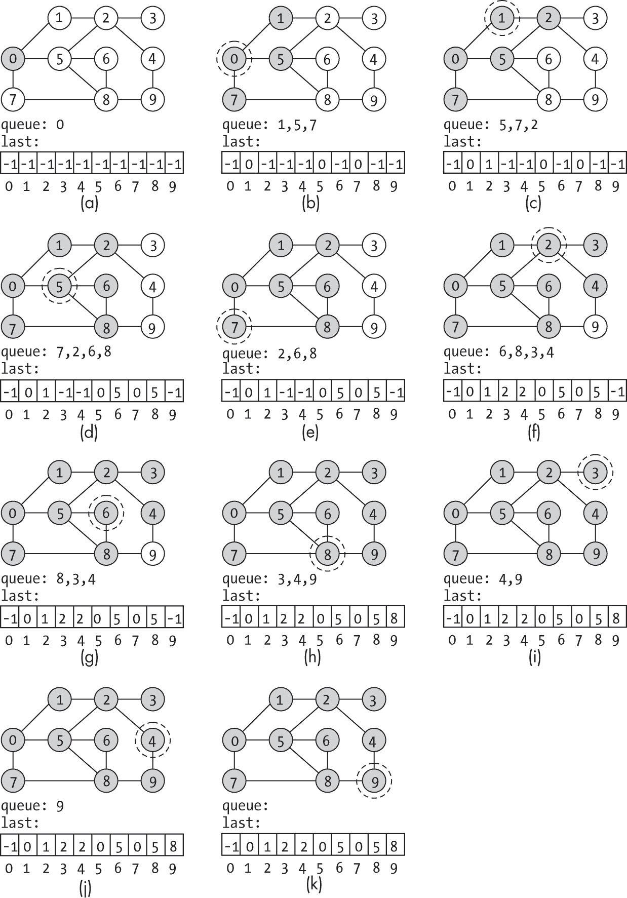
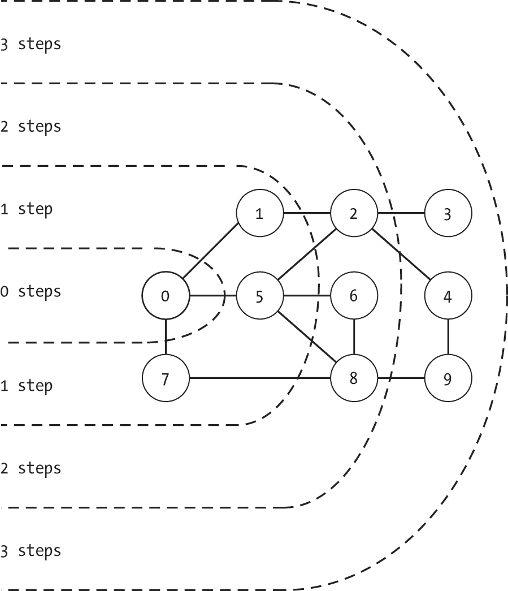
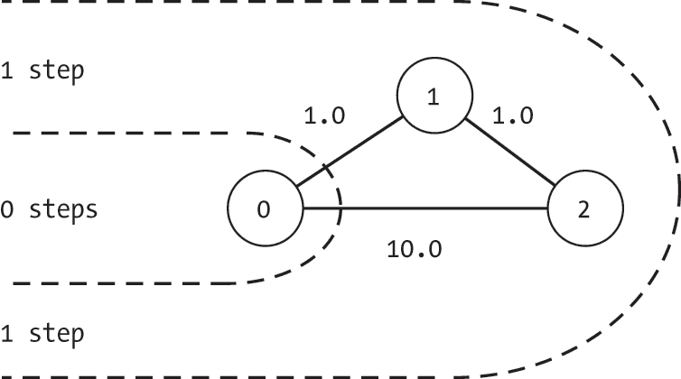
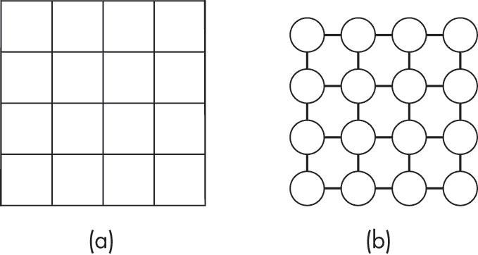
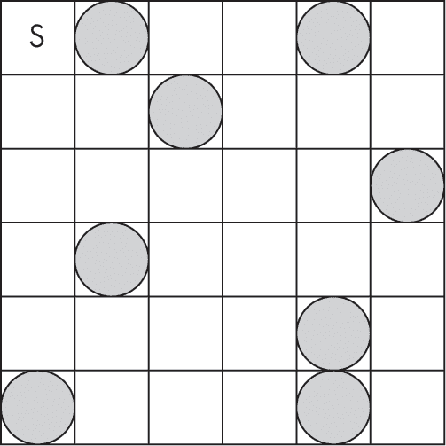
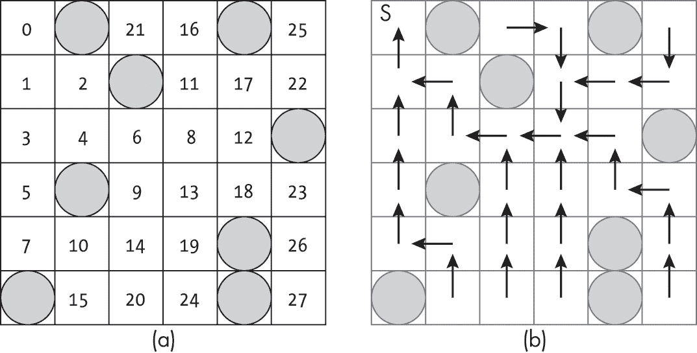

<hgroup>

## <samp class="SANS_Futura_Std_Bold_Condensed_B_11">5</samp> <samp class="SANS_Dogma_OT_Bold_B_11">广度优先搜索</samp>

</hgroup>


*广度优先搜索* 是探索图的一种替代方法，它像波浪一样从起始节点开始推进。与深度优先搜索优先处理最近发现的节点不同，广度优先搜索优先探索在搜索过程中较早发现的节点。这一优先级的简单变化导致搜索算法表现出截然不同的行为，并具有一系列有用的特性。

广度优先搜索的关键思想是，它使用先进先出（FIFO）的顺序来探索节点，例如队列所提供的顺序。每当搜索遇到一个以前未见过的节点时，它会将该节点放入一个待后续探索的节点队列中。当准备继续探索下一个节点时，搜索不会查看当前节点的邻居，而是从队列的前端提取节点，这意味着它总是选择等待时间最长的节点。

在前一章中，我们将深度优先搜索比作一位冒险者在迷宫中探险。我们可以将广度优先搜索想象成同样的冒险者，采用不同的策略，仔细地通过未来要探索的房间列表。为了尽早访问未知的领域，探险者会将所有未探索的房间列入清单。每当他们发现一个新房间时，就将它添加到清单的底部。尽管有诱惑放弃计划，冲向这个新地点，他们依然会查看清单，转而选择清单顶部的未访问选项。  

本章介绍了广度优先搜索并探讨其性质。特别是，广度优先搜索能够在无权图中找到从一个节点到所有其他可达节点的最短路径，使其成为许多更复杂算法中有用的组成部分。

### <samp class="SANS_Futura_Std_Bold_B_11">应用场景</samp>

广度优先搜索自然地映射到许多现实世界的任务中，例如学习新概念或探索一座新城市。

#### <samp class="SANS_Futura_Std_Bold_Condensed_Oblique_BI_11">学习新主题</samp>

广度优先搜索提供了一种系统的学习新概念的方法，侧重于在深入研究某一领域之前，先打好基础。假设你正在学习一门新的编程语言。图中的每个节点代表你必须学习的一个概念，而节点之间的边则代表这些概念之间的联系。也许你正在阅读一章关于 Python 的内容，讨论了它的语法和执行模型。这些概念成为当前章节的邻居，我们可以立即探索它们，或者将它们列入稍后探索的清单。

广度优先学习方法优先处理在我们的“待学习”列表中存在时间最长的概念。你可能从 Python 语言的总体概念开始，然后注意到紧邻的主题，如语法、执行模型和运行示例程序。每个主题都会加入你的探索列表，然后你逐一进行学习。在学习语法时，你可能会遇到关于列表、集合和字典的内容。与其提前翻到相关章节，你会把这些概念添加到列表的底部，稍后再进行探索，然后继续学习列表顶部的下一个主题。这样，你就能在深入了解 lambda 表达式之前，先完成一个简单的“Hello, world!”程序。

#### <samp class="SANS_Futura_Std_Bold_Condensed_Oblique_BI_11">探索新城市</samp>

假设你正在探索一个新城市，构建你的知识库，通过建立已探索区域的已知节点，再逐步扩展到未知区域。一天工作后，你多走了一街区去尝试那家你在街上看到的咖啡店。另一天，你问自己一个古老的问题：“那座山的另一边是什么？”当你发现新邻区时，你会记下这些新发现的、但尚未访问的区域，以便以后去探索。

将这种广度优先的方法与显然更具冒险精神的深度优先方法对比，后者是在一个方向上行进，直到你到达城市边界。这种方法能够高效扩展已看到的区域，但代价是推迟了更接近的选项。如果你在每次有选择时总是向北走，可能会走到北边 50 个街区，然而却完全没有意识到离你公寓只有一个街区远的惊人咖啡店。

### <samp class="SANS_Futura_Std_Bold_B_11">广度优先搜索算法</samp>

广度优先搜索通过保持一个*节点队列*并迭代地探索队列中的节点，直到队列为空。队列中的节点是从已访问的节点可达的，但尚未被访问。

广度优先搜索从将一个*起始节点*插入队列开始。在许多应用中，起始节点的选择是显而易见的。例如，如果你正在浏览一部关于咖啡磨豆机的在线百科全书，起始节点就是你打开的第一页。如果你正在寻找从酒店到最近咖啡店的路径，起始节点就是酒店。如果你正在通过社交网络寻找能帮你买到音乐会门票的人，起始节点就是你自己，网络的中心。在本章的示例中，我们随意选择节点 0 作为起始节点。

在广度优先搜索的每次迭代开始时，算法会从队列中取出第一个节点并访问它。然后它会检查该节点的出边，并将任何尚未访问过的邻居节点加入队列。这个过程会持续进行，每次访问一个节点，直到队列为空。

如果正在探索的图不是完全连通的，搜索将在访问所有节点之前终止。在许多情况下，这正是我们所需要的。如果我们在寻找从酒店到咖啡馆的路径，我们不关心无法到达的咖啡馆。也许我们正处于一个热带岛屿上，岛屿上的道路网络将酒店与 10 家咖啡馆相连。我们的搜索会扩展到岛屿上的咖啡馆，但不会建议邻近岛屿上的咖啡馆。

然而，在某些情况下，我们需要更全面的搜索。如果我们在搜索有关咖啡研磨机的信息，我们不希望仅仅因为某人没有添加超链接而错过重要的上下文。我们可以通过每当队列为空时，将第一个未探索的节点添加到队列中，从而扩展广度优先搜索，彻底探索每个节点。

#### <samp class="SANS_Futura_Std_Bold_Condensed_Oblique_BI_11">代码</samp>

广度优先搜索的代码由一个<samp class="SANS_TheSansMonoCd_W5Regular_11">while</samp>循环组成，探索新的节点直到待处理节点队列为空：

```
def breadth_first_search(g: Graph, start: int) -> list: 
    seen: list = [False] * g.num_nodes
    last: list = [-1] * g.num_nodes
    pending: queue.Queue = queue.Queue() ❶ pending.put(start)
    seen[start] = True

    while not pending.empty():
        index: int = pending.get()
        current: Node = g.nodes[index]

        for edge in current.get_edge_list():
            neighbor: int = edge.to_node
          ❷ if not seen[neighbor]:
                pending.put(neighbor)
                seen[neighbor] = True
                last[neighbor] = index

    return last 
```

<samp class="SANS_TheSansMonoCd_W5Regular_11">breadth_first_search()</samp>代码首先创建辅助数据结构，包括记录已访问节点的列表(<samp class="SANS_TheSansMonoCd_W5Regular_11">seen</samp>)，表示路径的搜索中前一个节点的列表(<samp class="SANS_TheSansMonoCd_W5Regular_11">last</samp>)，以及一个队列(<samp class="SANS_TheSansMonoCd_W5Regular_11">pending</samp>)。对于队列，我们使用 Python 的<samp class="SANS_TheSansMonoCd_W5Regular_11">queue</samp>库中定义的<samp class="SANS_TheSansMonoCd_W5Regular_11">Queue</samp>数据结构，这需要在文件中额外添加<samp class="SANS_TheSansMonoCd_W5Regular_11">import queue</samp>。然而，也可以使用像<samp class="SANS_TheSansMonoCd_W5Regular_11">list</samp>这样的内置数据结构。在主循环开始之前，代码将起始节点插入到<samp class="SANS_TheSansMonoCd_W5Regular_11">pending</samp>队列中，并将其标记为已访问❶。

该函数使用<samp class="SANS_TheSansMonoCd_W5Regular_11">while</samp>循环继续探索节点，直到队列为空。在每次迭代中，它从队列的前端取出一个节点，并使用<samp class="SANS_TheSansMonoCd_W5Regular_11">for</samp>循环检查该节点的每个邻居。如果该函数尚未访问该邻居❷，它将其添加到队列中，标记为已访问，并更新指向前一个节点的指针。函数最后返回<samp class="SANS_TheSansMonoCd_W5Regular_11">last</samp>列表，该列表记录了搜索过程中经过的路径。

与第四章中深度优先搜索的实现不同，后者在搜索访问到节点时就将其标记为已访问，广度优先搜索的实现是在首次将节点添加到队列时将其标记为已访问。这样可以防止队列中出现重复的条目。

#### <samp class="SANS_Futura_Std_Bold_Condensed_Oblique_BI_11">一个例子</samp>

图 5-1 显示了通过一个包含 10 个节点的图进行广度优先搜索的步骤示例。被阴影标记的节点已被标记为已访问。每个子图显示了 <samp class="SANS_TheSansMonoCd_W5Regular_11">last</samp> 数组的设置以及队列的状态，队列的前端在左侧。

图 5-1(a) 表示在我们开始 <samp class="SANS_TheSansMonoCd_W5Regular_11">while</samp> 循环之前，搜索的状态。搜索已经将起始节点（0）标记为已访问，并将其放入队列中。所有其他节点仍然标记为未访问。每个节点的回指针（<samp class="SANS_TheSansMonoCd_W5Regular_11">last</samp>）的值为 <samp class="SANS_TheSansMonoCd_W5Regular_11">-1</samp>，包括起始节点。



<samp class="SANS_Futura_Std_Book_Oblique_I_11">图 5-1：广度优先搜索的步骤</samp>

搜索在图 5-1(b) 中正式开始，当时它从队列中移除节点 0 并对其进行探索。它发现三个邻居（节点 1、5 和 7），将每个邻居标记为已访问，并将它们放入队列中以便稍后探索。通过这种方式，队列就像每天的待办事项清单：我们完成一项任务，意识到它会引发更多任务，并将这些任务添加到清单的末尾。我们还更新了 last 数组，以指示到达这些节点的路径。值为 0 表示节点 0 在路径上先于每个节点。

搜索接下来访问图 5-1(c) 中的节点 1。该节点只有一个未访问的邻居（节点 2），因为我们已经访问过节点 0。算法将节点 2 标记为已访问，加入队列，并将其在 <samp class="SANS_TheSansMonoCd_W5Regular_11">last</samp> 数组中的条目设置为 <samp class="SANS_TheSansMonoCd_W5Regular_11">1</samp>。

在图 5-1(d)中，我们开始看到广度优先搜索与深度优先搜索的不同之处。广度优先搜索不是继续沿着当前路径向下，而是探索第一个尚未探索的最早出现的节点。在这种情况下，它转向节点 5。在冒险者探索迷宫的情境下，这相当于探索英雄列表上最上面的房间。诚然，在现实世界中，这可能效率低下。冒险者可能需要返回并走回迷宫的许多地方，才能重新到达那个房间。然而，在计算机领域，这不是问题。一旦我们获得了节点的索引，就可以轻松地将其加载到内存中。

在图 5-1(d)中，算法探索了节点 5，发现了两个新的邻居节点 6 和 8。它标记这两个节点为已访问，并更新它们的最后一个条目指向节点 5。然后，它将 6 和 8 放在待探索节点列表的末尾；它将适时进行调查。

搜索在图 5-1(e)中继续进行，通过访问节点 7 来探索节点 0 的最后一个邻居。虽然我们现在已经看到了示例图中的大部分节点，但我们只访问了距离节点 0 一步或更少的节点。我们的搜索像波浪一样从起始节点扩展，先访问所有靠近的节点，然后再访问更远的节点。

搜索继续在图的其余部分进行。在每一步中，它从队列的前端提取节点进行探索。这个节点是队列中等待时间最长的节点。它访问该节点，检查并处理任何新的邻居。搜索在图 5-1(k)中完成，当它从队列中提取出最后一个节点时。

### <samp class="SANS_Futura_Std_Bold_B_11">寻找最短路径</samp>

广度优先搜索的一个主要优点是，它能够找到从起始节点到所有可达节点的最短路径。处理无权图时，我们使用*最短路径*这一术语来表示边数最少的路径。广度优先搜索能够找到这样的路径，得益于算法在探索路径时的优先级排序。通过使用先进先出的数据结构，算法有效地优先考虑最靠近起始节点的未探索节点。

图 5-2 展示了这一行为，描绘了图 5-1 中的图，虚线表示到达每个节点的步数。在探索起始节点时，广度优先搜索会将所有可以从此节点一步到达的节点加入队列。接下来，它按顺序探索这些节点。在探索一步之遥的节点时，它可能会发现一些距离两步远的新节点。然而，这些节点总是被添加到队列的末尾，因此在所有一步之遥的节点都被访问后才会进行探索。因此，广度优先搜索会先遍历所有*距离 k*步的节点，然后再考虑任何*距离 k+1*步的节点。



<samp class="SANS_Futura_Std_Book_Oblique_I_11">图 5-2：显示广度优先搜索扩展的等高线</samp>

在加权图中，*最短路径*的概念通常用来描述边权重总和最小的路径。由于广度优先搜索不考虑边的权重，因此广度优先搜索不会找到成本最小的最短路径。

作为示例，考虑图 5-3 中的图。无论到达该节点的边权重如何，节点 1 和节点 2 都会在探索节点 2 时通过广度优先搜索被访问。它们都会被标记为已访问，添加到队列中，并将它们的路径上的前一个节点设为 0。该算法并不会寻找或找到通过节点 1 到节点 2 的低权重路径，但它仍然会找到包含最少边数的路径。



<samp class="SANS_Futura_Std_Book_Oblique_I_11">图 5-3：显示广度优先搜索在加权图上扩展的等高线</samp>

我们将在本书后面讨论边权重和最短路径的问题。第七章介绍了各种加权图上的最短路径算法，第八章则研究了考虑边权重的启发式搜索算法。

### <samp class="SANS_Futura_Std_Bold_B_11">简单路径规划</samp>

广度优先搜索能够找到最少边数的路径，使得它在有限的一些*路径规划*任务中非常有用。考虑一下老式视频游戏中的任务：在一个平坦的二维网格上规划路径，其中一些方格被岩石障碍物阻挡。本节讨论了如何创建一个图来表示这个问题，以及运行广度优先搜索时得到的解决方案。

在有障碍物的平面上进行广度优先搜索路径规划，提供了广度优先搜索操作的有用示例。它还介绍了我们如何通过图的形式来表示路径规划问题，为后续章节的更优路径规划算法做准备。这些算法包括考虑边权重的*最低成本路径算法*，用以模拟不同地形的成本差异，以及通过优先选择最有可能的路径来提高搜索本身运行时间的*启发式引导搜索算法*。

#### <samp class="SANS_Futura_Std_Bold_Condensed_Oblique_BI_11">从网格构建图</samp>

构建规则网格的图形表示有多种用途，从路径规划到计算机视觉。底层的网格可能代表地图上的空间区域（用于路径规划或科学计算）、图像中的像素（用于计算机视觉），甚至只是节点的排列。为了本节的目的，我们将重点讨论视频游戏地图。

我们通过为每个网格方格创建一个单独的节点，并为每对相邻的方格创建一个单独的无向边来生成基于网格的图。对于一个行数 = *height* 和列数 = *width* 的网格，我们首先分配 *height* × *width* 个节点。我们可以将这些节点以网格模式直观地表示，如图 5-4(b)所示，但从技术上讲，它们存储在图数据结构中的一个单一列表中。



<samp class="SANS_Futura_Std_Book_Oblique_I_11">图 5-4：一个网格（a）和其图形表示（b）</samp>

我们可以将行*r*和列*c*的网格坐标映射到相应的节点索引，如下所示：

*index* = *r* × *width* + *c*

因为这些边是无向的，我们可以从左上角扫描节点到右下角，并向右侧或下方的相邻节点插入边。如果我们将其指定为遍历网格的*r*和*c*值，那么我们检查是否包括一条边的条件如下：

如果*c* < *width* – 1，节点右侧有一个相邻节点，索引为*index* + 1。

如果*r* < *height* – 1，节点下方有一个相邻节点，索引为*index* + *width*。

清单 5-1 展示了构建基于网格的图形的代码。

```
def make_grid_graph(width: int, height: int) -> Graph: 
    num_nodes: int = width * height

    g: Graph = Graph(num_nodes, undirected=True)
    for r in range(height):
        for c in range(width):
          ❶ index: int = r * width + c

          ❷ if (c < width - 1):
                g.insert_edge(index, index + 1, 1.0)
          ❸ if (r < height - 1):
                g.insert_edge(index, index + width, 1.0)
    return g 
```

<samp class="SANS_Futura_Std_Book_Oblique_I_11">清单 5-1：创建网格的图形表示</samp>

<samp class="SANS_TheSansMonoCd_W5Regular_11">make_grid_graph()</samp>代码首先创建一个无向图<samp class="SANS_TheSansMonoCd_W5Regular_11">g</samp>，每个网格方格对应一个节点。然后，它使用两个<samp class="SANS_TheSansMonoCd_W5Regular_11">for</samp>循环遍历所有网格单元，计算相应的节点索引❶，并检查是否需要在当前节点的右侧❷或下方❸添加一条边。代码最后返回图<samp class="SANS_TheSansMonoCd_W5Regular_11">g</samp>。

#### <samp class="SANS_Futura_Std_Bold_Condensed_Oblique_BI_11">添加障碍物</samp>

在平坦的平面上进行路径规划并不是一项特别令人兴奋的任务。即使是在描述广度优先搜索的上下文中，它也不过是看着访问节点的边界在网格中扩展而已。为了让例子更加有趣，我们向网格中添加障碍物。我们通过元组 (*r*, *c*) 将这些信息传递给代码，表示障碍物在网格中的行和列。这使我们能够创建像图 5-5 中那样的网格，其中开放单元是可遍历的，阴影圆圈表示障碍物。



<samp class="SANS_Futura_Std_Book_Oblique_I_11">图 5-5：一个带有八个障碍物的 6×6 网格</samp>

代码与示例 5-1 的形式相同，但使用了额外的信息：

```
def make_grid_with_obstacles(width: int, height: int,
                             obstacles: set) -> Graph: 
    num_nodes: int = width * height

    g: Graph = Graph(num_nodes, undirected=True)
    for r in range(height):
        for c in range(width):
          ❶ if (r, c) not in obstacles:
                index: int = r * width + c
              ❷ if (c < width - 1) and (r, c + 1) not in obstacles:
                    g.insert_edge(index, index + 1, 1.0)
              ❸ if (r < height - 1) and (r + 1, c) not in obstacles:
                    g.insert_edge(index, index + width, 1.0)
    return g 
```

如示例 5-1 所示，代码首先创建一个无向图 <samp class="SANS_TheSansMonoCd_W5Regular_11">g</samp>，其中每个网格单元对应一个节点。然后，代码通过两个 <samp class="SANS_TheSansMonoCd_W5Regular_11">for</samp> 循环遍历所有网格单元。在每个网格单元中，检查当前单元是否被障碍物阻塞 ❶。如果被阻塞，该节点没有进入或离开的边。如果没有被阻塞，代码计算节点列表中的索引，检查是否需要在当前节点的右侧添加一条边 ❷，并检查是否需要在当前节点下方添加一条边 ❸。这两个边的检查都包括一个额外的约束条件：邻近的单元格不能被障碍物阻塞。

这个函数展示了通用图表示法的强大功能，它允许我们完全捕捉环境的结构，包括有效的转换和障碍物。如果我们可以直接从一个点转移到另一个点，图中会在相应的节点之间添加一条边。否则，不允许任何转换。我们不需要保存图的维度或障碍物的列表。我们可以使用类似的方法来建模迷宫中的墙壁。正如我们在后面的章节中将看到的，我们可以使用边的权重和方向性来进一步增强建模能力。#### <samp class="SANS_Futura_Std_Bold_Condensed_Oblique_BI_11">运行广度优先搜索</samp>

我们可以在前两节中介绍的基于网格的图上运行广度优先搜索，而无需任何修改。毕竟，两个函数都产生标准的 <samp class="SANS_TheSansMonoCd_W5Regular_11">Graph</samp> 对象。图 5-6 展示了在图 5-5 中的网格上运行广度优先搜索的结果，其中 *S* 表示位于第 0 行，第 0 列的起始节点。



<samp class="SANS_Futura_Std_Book_Oblique_I_11">图 5-6：广度优先搜索后的探索顺序 (a) 和最后指针 (b)</samp>

图 5-6(a) 中的网格显示了搜索访问每个网格单元的顺序。它从左上角开始，像一个渗透的胶状生物一样向外扩展，试图吸收整个世界。虽然其他单元格的直线距离很近，但搜索需要一些时间才能访问它们，因为搜索需要绕过障碍物。

图 5-6(b) 中的网格显示了图中每个节点的 <samp class="SANS_TheSansMonoCd_W5Regular_11">最后</samp> 指针。利用这些指针，我们可以从任何目标节点重新构建到起始节点的最短路径。例如，第 3 行第 2 列的单元格（标记为 9）可以通过向上、向左、向上、向左和向上的方式到达起点。我们可以反转这些指针，得到从起始节点到任何可达目标的最短路径。

### <samp class="SANS_Futura_Std_Bold_B_11">为什么这很重要</samp>

广度优先搜索提供了一种不同的图搜索机制，其行为不同。由于它对节点的探索顺序，它优先探索与起始节点距离最近的节点，距离是通过边的数量来衡量的。因此，广度优先搜索从起始节点向外扩展，探索每个节点时经过的边数最少。这种行为使得广度优先搜索成为各种更复杂图算法的重要组成部分。

此外，广度优先搜索既简单又高效。与常见的递归实现深度优先搜索不同，广度优先搜索的标准实现使用迭代的 <samp class="SANS_TheSansMonoCd_W5Regular_11">while</samp> 循环，而不是递归函数调用来操作队列。

接下来的章节将探讨另一种类型的图搜索：在加权图上找到最短路径的算法。这些算法基于我们目前介绍的基本搜索，解锁了一系列新的应用。
