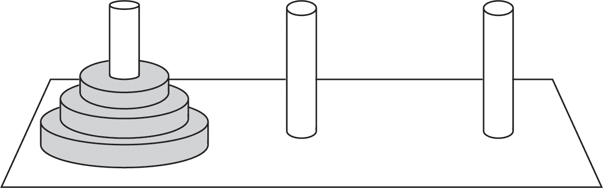
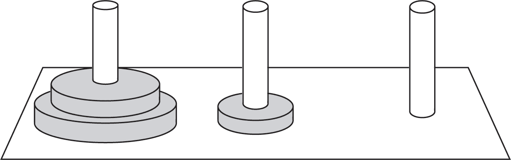
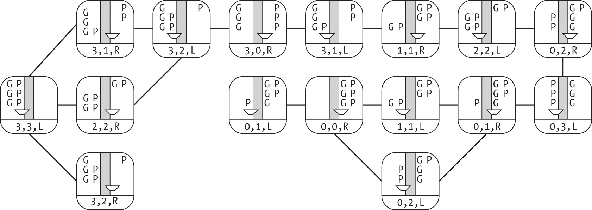
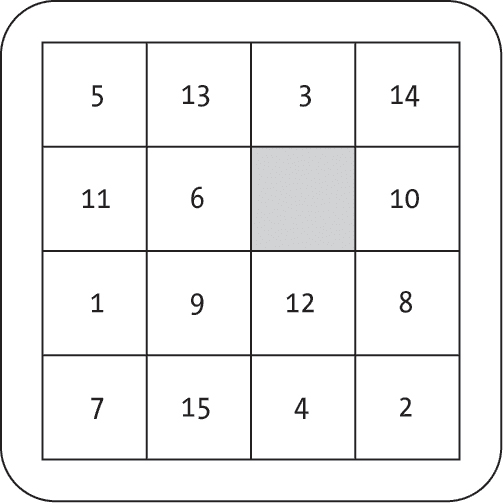
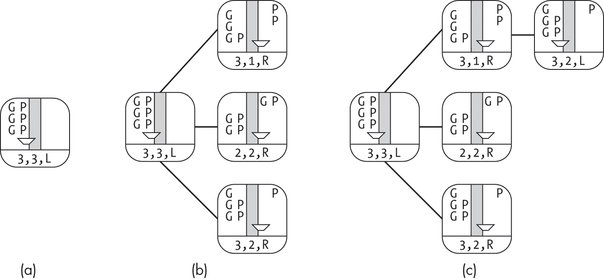
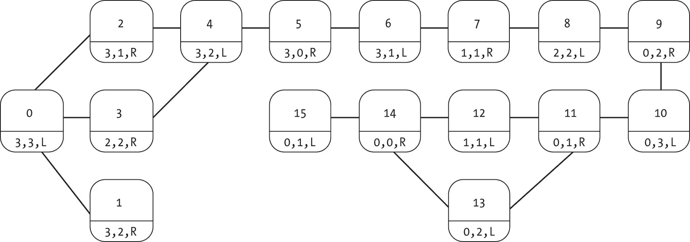

## 6 解谜


图搜索算法的应用不仅限于搜索物理位置之间的路径或物品之间的虚拟链接。它们还广泛应用于更多抽象的问题，比如解谜或在游戏中制定策略。

许多谜题可以通过一组离散的状态来表示，这些状态捕捉了谜题的不同配置。*解决谜题*可能需要通过一系列步骤，从初始状态过渡到某个预定义的目标状态。这可能对应于在河内塔谜题中移动圆盘，在过河谜题中移动人，或在滑块谜题中重新排列拼图块。在本章中，我们通过将谜题的状态建模为节点，将它们之间的过渡建模为边，来将这些谜题转化为图搜索问题。然后，我们通过搜索到达谜题目标状态的路径来解决它们。

### 状态空间与图

本节描述了我们三个经典谜题的状态空间表示和图表示。

#### 河内塔

河内塔谜题由三个柱子和不同直径的圆盘组成，这些圆盘可以堆叠在柱子上。最初，所有圆盘都在最左边的柱子上，并按直径从大到小堆叠，如图 6-1 所示，其中最宽的圆盘在底部，最小的圆盘在顶部。谜题的目标是一次移动一个圆盘，使所有圆盘最终都按相同的顺序堆放到最右边的柱子上。



图 6-1：河内塔谜题的初始状态

有两个约束条件使得这个谜题变得有趣。首先，你只能移动每个堆叠中最上面的圆盘。第二，每一步操作后，每个堆叠必须保持排序。你永远不能将一个较大的圆盘放在较小的圆盘上面。例如，图 6-2 展示了从初始状态到有效第二状态的一个移动。



图 6-2：移动一个圆盘后的河内塔谜题

我们可以通过多种方式将不同的圆盘配置表示为*状态*。为了说明这一点，假设有一组三个向量，用来跟踪每个柱子上的圆盘顺序，其中组合的向量集代表了谜题的状态。我们用尖括号表示状态。图 6-1 中的状态表示为向量<[3,2,1],[],[]>，而图 6-2 中的状态表示为<[3,2],[1],[]>。

我们可以把这些状态看作是在枚举谜题的所有可能性。当前的圆盘排列可能是<[3],[],[2,1]>。然而，如果我们做出了不同的操作，可能会得到排列<[3],[1],[2]>。我们可以放松心情，设想各种可能的选择，如何在它们之间移动，以及未来操作的影响。

通过将谜题的状态表示为向量，我们可以将问题转化为一个无向图，每个状态用一个节点表示，有效的操作用边表示。这在图 6-3 中进行了说明，该图表示了三个圆盘的汉诺塔，其中的节点是我们解决问题过程中的潜在目标状态。一个节点代表我们起始的状态<[3,2,1],[],[]>，另一个节点代表我们的目标状态<[],[],[3,2,1]>，中间还有许多其他状态。

![每个节点都标有三个数组。最左边的节点标有数组[3, 2, 1]和两个空数组。这个节点有两个右侧邻居。顶部节点标有数组[3, 2]、[1]和一个空数组。底部节点标有数组[3, 2]、一个空数组和数组[1]。](../images/f06003.jpg)

图 6-3：汉诺塔谜题的图形表示部分

由于我们可以通过将最小的圆盘从第一个柱子移动到第二个柱子，从状态<[3,2,1],[],[]>转移到状态<[3,2],[1],[]>，因此图中在这两个节点之间有一条无向边。相比之下，我们不能通过移动单个圆盘从状态<[3,2,1],[],[]>转移到状态<[2,1],[3],[]>，因此这些状态之间没有边。

直到现在，本书中的示例图节点大多表示具体的项目，如物理位置、计算机节点、网页、任务或人物。然而，现在我们的节点表示的是世界的潜在配置。这带来的一个直接后果是节点数量的爆炸。汉诺塔中盘子的潜在配置比物理盘子或柱子的数量要多得多。这意味着我们可能会遇到比以往更大的图，算法的性能变得更加重要。

#### 过河难题

过河难题是一类脑筋急转弯问题，要求将一组人或动物通过一只有容量限制的船运送过河。挑战来自于关于哪些实体可以单独留在岸上的限制。

让我们考虑一个经典的过河难题，我们将其描述为囚犯与看守的难题，其中三名看守和三名囚犯需要过河。可用的工具是一只最多能容纳两人的船。囚犯被戴上手铐，若单独留在岸边无法逃脱。然而，如果岸边囚犯的数量超过看守，囚犯就会联合起来抢夺看守的钥匙。因此，每个岸边上，看守必须至少有*与囚犯相同数量*的人陪伴。

我们可以将这个难题表示为一个*状态空间图*，其中每个节点表示难题的一个状态。该状态由三部分信息组成：左岸的看守数量，左岸的囚犯数量，以及船是否在左岸或右岸。右岸的看守和囚犯数量可以从左岸的数量推导出来，因此我们不需要显式地存储这些信息。问题的起始状态是<3,3,L>，所有六个人和船都在左岸。

图中的每个节点表示一个有效的状态，而边连接那些通过单次移动可以到达的状态。有效的移动包括将任意一组合适的人员或两人送过河：两名看守，一名看守，一名看守和一名囚犯，两名囚犯，或一名囚犯。船不能没有人驾驶而过河，因为需要有人操控它。由于我们可以通过将相同的配置送回原岸来撤销任何移动，图是无向的。

图 6-4 展示了 16 个可能状态的整个图。每个状态是一个单独的节点，既有图形表示，也有文本表示。字母G和P分别表示警卫和囚犯的位置。船的位置在状态底部用R或L表示。对于许多状态，只有两种有效的移动，但对于其他状态，则有多个选择。



图 6-4：囚徒与警卫过河问题的图表示

这个拼图展示了在使用相对较小的图时如何表示状态，并且使得可达状态集的可视化和分析变得容易。在后续的章节中，我们将使用这个拼图展示如何通过编程方式创建图并搜索解决方案。

#### 滑动拼图

滑动拼图由一个方格的瓦片组成，其中一个方格为空缺，形成一个空位。瓦片可以通过滑动相邻的瓦片进入空位来重新排列，实质上允许瓦片和空位交换位置。拼图的目标是将每个瓦片移动到正确的位置。根据拼图的不同，我们可能需要排列一系列数字或拼出一张图片。这个游戏的经典例子是 15 格拼图，如图 6-5 所示，其中每个瓦片标有从 1 到 15 的整数，正确的状态是所有瓦片按照从左上到右下的升序排列。



图 6-5：15 格拼图

滑动拼图非常适合使用图表示。每一种可能的瓦片排列都是一个独特的拼图状态，可以通过一个图节点表示。边表示状态之间可能的遍历。每个状态最多有四条无向边，表示通过将该状态的空缺位置填入四个相邻瓦片中的每一个，可以到达的邻居。我们可以将这些边称为上、下、左、右。

图 6-6 展示了一个示例状态及其四个邻居。通过在图中搜索从初始状态节点到目标状态节点的路径，我们可以找到一系列解决拼图的移动步骤。


图 6-6：15 方块难题的一个状态（中间）及其四个邻近状态

15 方块难题展示了状态空间如何迅速膨胀。这个看似简单的难题有超过 20 万亿个状态，其中许多状态在我们寻找解法的过程中根本不需要访问。

### 使用搜索构建图

前几章中的图搜索算法要求我们提供一个完全指定的图。对于难题问题，这可能不可行。在开始搜索之前，我们不想费力地手动列举出它们众多的状态。这不仅会非常耗时，而且很可能会导致错误，并且不小心引发作弊的等价问题——添加一条允许非法移动的边。更糟糕的是，我们会浪费大量的精力生成那些在解法中既不被使用，也无法到达的状态。

相反，我们可以通过扩展广度优先搜索和深度优先搜索算法来动态创建一个图，探索状态空间，并实时添加节点和边。每次发现一个新状态时，我们就添加相应的节点。每次测试状态之间的移动时，我们就添加相应的边。与之前的搜索方式不同，后者需要遍历每个节点或每个节点的边，而使用搜索来构建图则要求算法遍历难题的状态以及每个状态的有效移动。

在本节的其余部分，我们将探讨如何使用过河难题构建这样的图。我们从一个初始状态<3,3,L>开始，并从那里向外探索。在每一步中，我们会问：“如果我们把一些人（两个警卫，一个警卫，一个警卫和一个囚犯，两个囚犯，或一个囚犯）送过河，下一状态是什么？”我们通过简单的算术计算下一状态，并使用难题的规则检查其有效性。如果新状态有效，我们就将其及相应的边添加到我们的图中。在接下来的几个部分中，我们将编写代码来存储状态空间、定义有效转换并构建图。虽然我们专注于过河难题，但这些方法适用于一系列难题。

#### 表示难题的状态

为了定义我们的搜索，首先需要表示拼图的状态。以下代码展示了如何定义一个简单的类 PGState（其中 PG 代表“囚犯和警卫”）来存储拼图的当前状态，并提供一些辅助函数：

```
class PGState:
    def __init__(self, guards_left: int = 3, prisoners_left: int = 3,
                 boat_side: str = "L"):
        self.guards_left = guards_left
        self.prisoners_left = prisoners_left
        self.boat_side = boat_side

    def __str__(self) -> str:
        return (f"{self.guards_left},{self.prisoners_left},{self.boat_side}") 
```

变量 guards_left 和 prisoners_left 存储左岸的警卫和囚犯数量。字符串 boat_side 指示船当前位于左岸（L）还是右岸（R）。__str__() 函数允许我们轻松地将状态转换为字符串表示形式，便于存储和显示。

给定 PGState 数据结构，按照以下代码所示，我们可以编程地计算下一次船次移动给定数量的警卫和囚犯的结果：

```
def pg_result_of_move(state: PGState, num_guards: int,
                      num_prisoners: int) -> Union[PGState, None]: 
  ❶ if num_guards < 0 or num_prisoners < 0:
        return None
    if num_guards + num_prisoners == 0:
        return None
    if num_guards + num_prisoners > 2:
        return None

  ❷ G_L: int = state.guards_left
    G_R: int = (3 - state.guards_left)
    P_L: int = state.prisoners_left
    P_R: int = (3 - state.prisoners_left)
    if state.boat_side == "L":
        G_L -= num_guards
        G_R += num_guards
        P_L -= num_prisoners
        P_R += num_prisoners
        new_side: str = "R"
    else:
        G_L += num_guards
        G_R -= num_guards
        P_L += num_prisoners
        P_R -= num_prisoners
        new_side = "L"

  ❸ if G_L < 0 or P_L < 0 or G_R < 0 or P_R < 0:
        return None

  ❹ if G_L > 0 and G_L < P_L:
        return None
    if G_R > 0 and G_R < P_R:
        return None
    return PGState(G_L, P_L, new_side) 
```

大部分的 pg_result_of_move() 函数用于检查移动是否有效。如果移动无效，函数将返回 None。否则，函数将返回对应于该移动结果的新 PGState。需要注意的是，这要求我们从 Python 的 typing 库导入 Union，以支持多个返回类型的类型提示。代码检查囚犯和警卫的数量是否都是非负的，是否至少有一个人坐在船上，并且船上最多有两个人 ❶。如果任何有效性检查失败，则移动无效，函数返回 None，表示没有下一个有效状态。

如果移动通过了这些初步的有效性检查，代码会计算左岸的囚犯和守卫数量（分别为 P_L 和 G_L），以及右岸的囚犯和守卫数量（分别为 P_R 和 G_R） ❷。这四个数量将用于检查新状态是否有效。代码检查移动是否没有将超过当前岸上的人数移走，通过确认没有任何计数变为负数 ❸。它还检查新状态是否有有效的守卫和囚犯平衡 ❹。如果某一岸上至少有一个守卫，那么该岸上的囚犯数量不能超过守卫数量。然而，岸上只有囚犯是有效的。再一次，如果任何有效性检查失败，新状态将被视为无效，函数将返回 None。如果所有检查都通过，代码将返回一个表示新状态的 PGState 数据结构。

当 pg_result_of_move() 检查并计算单个移动的结果时，我们需要为每个有效的移动构建边缘。我们可以定义一个辅助函数来生成并测试当前状态的所有可能邻居：

```
def pg_neighbors(state: PGState) -> list: 
    neighbors: list = []
  ❶ for move in [(1, 0), (2, 0), (0, 1), (0, 2), (1, 1)]:
      ❷ n: Union[PGState, None] = pg_result_of_move(state, move[0], move[1])
        if n is not None:
            neighbors.append(n)
    return neighbors 
```

这段代码创建了一个空的邻居列表（neighbors），然后系统地尝试五种可能的移动方式：一个守卫、两个守卫、一个囚犯、两个囚犯和一个守卫加一个囚犯 ❶。每次，代码都会调用 pg_result_of_move() 并检查是否返回有效的邻接状态 ❷。如果是，它会将新状态添加到邻居列表中。

#### 生成图形

现在我们有了算法上确定哪些状态是当前状态邻接状态的组件，我们可以使用修改过的广度优先搜索来生成囚犯与守卫谜题的状态空间图。这个算法将从初始状态开始，沿着边缘向外探索到相邻状态。我们将使用上一节中的 pg_neighbors() 辅助函数来确定当前状态的有效邻接状态集。随着邻居生成函数发现新状态，我们将把这些状态作为新节点添加到图中。

我们在PGState数据结构中跟踪状态信息。为了方便起见，我们将这个状态信息链接为一个分配给节点标签的PGState对象。这使得在搜索过程中可以方便地访问当前的状态数据结构。我们使用__str__()方法生成数据结构的字符串表示，用于辅助数据结构。

除了之前广度优先搜索中使用的数据结构外，我们还需要追踪一项额外的信息：从状态到图中对应节点的映射。如果我们无法找到对应的节点并创建边缘，知道<2,2,R>与<3,3,L>之间存在一条边是没有意义的。我们将这项信息存储在一个字典（indices）中，该字典将状态的字符串表示映射到图中对应节点的索引。

创建囚犯与守卫状态图的代码将我们之前组装的各个部分组合起来：

```
def create_prisoners_and_guards() -> Graph: 
    indices: dict = {}
    next_node: queue.Queue = queue.Queue()
    g: Graph = Graph(0, undirected=True)

  ❶ initial_state: PGState = PGState(3, 3, "L")
    initial: Node = g.insert_node(label=initial_state)
    next_node.put(initial.index)
    indices[str(initial_state)] = initial.index

    while not next_node.empty():
      ❷ current_ind: int = next_node.get()
        current_node: Node = g.nodes[current_ind]
        current_state = current_node.label

      ❸ neighbors: list = pg_neighbors(current_state)
        for state in neighbors:
            state_str: str = str(state)
          ❹ if not state_str in indices:
                new_node: Node = g.insert_node(label=state)
                indices[state_str] = new_node.index
                next_node.put(new_node.index)
          ❺ new_ind: int = indices[str(state)]
            g.insert_edge(current_ind, new_ind, 1.0)

    return g 
```

生成图形的代码首先通过设置必要的数据结构来开始：一个空字典（indices）、一个空队列（next_node）和一个空图（g）。它为初始状态创建一个新的PGState对象，通过Graph类的insert_node()函数将对应的节点插入图中，将初始状态的节点索引添加到队列中，并将字符串与索引的映射添加到字典中❶。

现在我们已经准备好开始搜索了。像其他广度优先搜索一样，我们的囚犯与守卫图生成使用一个节点索引队列（next_node）来控制搜索。下一个节点索引被出队，随后获取对应的节点和状态❷。与之前的广度优先搜索示例不同，算法不能依赖节点的边列表来确定邻居。相反，代码使用pg_neighbors()函数来生成可能的邻接状态❸。

代码通过在indices字典中查找状态的字符串表示来检查每个状态是否之前出现过 ❹。如果状态在表中没有条目（以及有效的节点索引），那么我们既没有见过它，也没有将它添加到图中。对于任何以前未见过的状态，都会创建新节点，并且在当前节点与其邻居之间生成新的边 ❺。

代码最后通过返回完成的图g来结束。由于算法仅从初始状态向外搜索，因此返回的图只会包含那些可以通过有效的移动从初始状态到达的状态。无效或无法到达的状态的节点不会被包含在内。

图 6-7 显示了算法进展的前几步。图中显示了对应于图的初始状态 <3,3,L> 的单一节点，如图 6-7(a)所示。图 6-7(b) 显示了第一个节点访问后的结果：pg_neighbors()函数为当前状态找到了三个有效的邻居，算法为每个邻居创建了新节点。在探索了 <3,1,R> 状态后，代码创建了一个 <3,2,L> 节点，并且生成了相应的边，如图 6-7(c)所示。



图 6-7: 生成囚徒与警卫谜题图的前三个步骤

算法每当第一次看到节点时就会生成新节点。然而，它并不一定在访问该节点之前生成所有节点的边，这就是为什么在图 6-7(c)中，状态 <3,2,L> 和状态 <2,2,R> 之间没有边的原因。只有在访问 <2,2,R> 或 <3,2,L> 之一时，代码才会在这些节点之间生成边。

### 通过搜索解决谜题

我们可以直接将之前章节的搜索应用到囚徒与警卫的谜题图上。我们将搜索功能添加到相同的囚徒与警卫程序中，基于上一节的函数进行构建。

为了简化逻辑，我们从一个简单的辅助函数开始，该函数创建一个字典，将状态的字符串映射到相应节点的索引：

```
def pg_state_to_index_map(g: Graph) -> dict: 
    state_to_index: dict = {}
    for node in g.nodes:
        state: str = str(node.label)
        state_to_index[state] = node.index
    return state_to_index 
```

生成的状态字符串到节点索引的映射允许我们直接查找起始和目标的索引，而无需遍历整个图形。我们可以通过字符串 "3,3,L" 查找起始节点的索引（0）。同样，我们也可以通过状态字符串 "0,0,R" 查找目标节点的索引（14）。

这是用于搜索谜题的代码：

```
def solve_pg_bfs(): 
  ❶ g: Graph = create_prisoners_and_guards()

  ❷ state_to_index: dict = pg_state_to_index_map(g)
    start_index: int = state_to_index["3,3,L"]
    end_index: int = state_to_index["0,0,R"]

  ❸ last: int = breadth_first_search(g, start_index)

  ❹ current: int = end_index
    path_reversed: list = []
    while current != -1:
        path_reversed.append(current)
        current = last[current]

  ❺ if path_reversed[-1] != start_index:
        print("No solution")
        return

  ❻ for i, n in enumerate(reversed(path_reversed)):
        print(f"Step {i}: {g.nodes[n].label}") 
```

代码首先通过创建谜题的图形表示 ❶。接着，它构建一个字典 state_to_index，将状态字符串映射到索引，并使用该字典查找起始节点和目标节点的索引 ❷。

代码使用标准的广度优先搜索来探索图形，并返回 最后 列表 ❸。最后，它从目标节点开始，反向遍历 最后 列表，直到到达起始节点或死胡同 ❹。如果路径在到达起始节点之前死胡同，函数会显示消息 无解 ❺。否则，代码会向前走路径，并以正确的顺序显示访问过的状态列表 ❻。

图 6-8 显示了生成的图，并标明了节点索引。每个节点上方标有其节点索引，下方标有其状态字符串。



图 6-8：标有节点索引的囚犯与守卫图

给定生成的谜题图形，我们可以直接从第五章运行广度优先搜索。表 6-1 显示了每次节点被探索后，最后 向量的状态。第一行对应于第 0 次迭代，状态为 <3,3,L>。目标（状态 <0,0,R>）在第 14 次迭代时被访问。

表 6-1： 最后 向量

| 步骤 (节点) | 33L | 32R | 31R | 22R | 32L | 30R | 31L | 11R | 22L | 02R | 03L | 01R | 11L | 02L | 00R | 01L |
| --- | --- | --- | --- | --- | --- | --- | --- | --- | --- | --- | --- | --- | --- | --- | --- | --- |
| 0 (3,3,L) | –1 | 0 | 0 | 0 | –1 | –1 | –1 | –1 | –1 | –1 | –1 | –1 | –1 | –1 | –1 |
| 1 (3,2,R) | –1 | 0 | 0 | 0 | –1 | –1 | –1 | –1 | –1 | –1 | –1 | –1 | –1 | –1 | –1 | –1 | –1 |
| 2 (3,1,R) | –1 | 0 | 0 | 0 | 2 | –1 | –1 | –1 | –1 | –1 | –1 | –1 | –1 | –1 | –1 |
| 3 (2,2,R) | –1 | 0 | 0 | 0 | 2 | –1 | –1 | –1 | –1 | –1 | –1 | –1 | –1 | –1 | –1 |
| 4 (3,2,L) | –1 | 0 | 0 | 0 | 2 | 4 | –1 | –1 | –1 | –1 | –1 | –1 | –1 | –1 | –1 |
| 5 (3,0,R) | –1 | 0 | 0 | 0 | 2 | 4 | 5 | –1 | –1 | –1 | –1 | –1 | –1 | –1 | –1 | –1 |
| 6 (3,1,L) | –1 | 0 | 0 | 0 | 2 | 4 | 5 | 6 | –1 | –1 | –1 | –1 | –1 | –1 | –1 | –1 |
| 7 (1,1,R) | –1 | 0 | 0 | 0 | 2 | 4 | 5 | 6 | 7 | –1 | –1 | –1 | –1 | –1 | –1 | –1 |
| 8 (2,2,L) | –1 | 0 | 0 | 0 | 2 | 4 | 5 | 6 | 7 | 8 | –1 | –1 | –1 | –1 | –1 | –1 |
| 9 (0,2,R) | –1 | 0 | 0 | 0 | 2 | 4 | 5 | 6 | 7 | 8 | 9 | –1 | –1 | –1 | –1 | –1 |
| 10 (0,3,L) | –1 | 0 | 0 | 0 | 2 | 4 | 5 | 6 | 7 | 8 | 9 | 10 | –1 | –1 | –1 | –1 |
| 11 (0,1,R) | –1 | 0 | 0 | 0 | 2 | 4 | 5 | 6 | 7 | 8 | 9 | 10 | 11 | 11 | –1 | –1 |
| 12 (1,1,L) | –1 | 0 | 0 | 0 | 2 | 4 | 5 | 6 | 7 | 8 | 9 | 10 | 11 | 11 | 12 | –1 |
| 13 (0,2,L) | –1 | 0 | 0 | 0 | 2 | 4 | 5 | 6 | 7 | 8 | 9 | 10 | 11 | 11 | 12 | –1 |
| 14 (0,0,R) | –1 | 0 | 0 | 0 | 2 | 4 | 5 | 6 | 7 | 8 | 9 | 10 | 11 | 11 | 12 | 14 |
| 15 (0,1,L) | –1 | 0 | 0 | 0 | 2 | 4 | 5 | 6 | 7 | 8 | 9 | 10 | 11 | 11 | 12 | 14 |

基于广度优先搜索生成的<sup class="SANS_TheSansMonoCd_W5Regular_11">最后</sup>向量，我们可以追踪从初始状态到目标状态所需的移动。记住，广度优先搜索在无权图上返回最短路径，因此它已经找到了要求最少移动的解决方案。

我们可以使用类似的方法来解决汉诺塔问题和滑块谜题。每次，我们都将通过定义状态空间的数据结构以及一个生成状态邻居的算法函数来开始。

### 为什么这很重要

本章介绍了如何将图搜索应用于解决谜题的抽象世界。除了这里涉及的相对简单的谜题外，我们还可以通过结合图的丰富结构来建模日益复杂的问题，包括有向和加权边。例如，本章中的谜题使用无向边表示可逆移动，但我们可以用有向边表示无法撤销的移动。如果我们试图解决一个谜题，涉及到过一座桥，而这座桥在第一次通过后会坍塌，我们就无法直接返回到桥对面并保持桥完好的状态。同样，加权边使我们能够考虑移动的成本。

本章中的代码还展示了我们不必在开始搜索之前生成图形，而是可以通过搜索来创建图数据结构，同时探索不同的状态。在许多情况下，我们甚至可能根本不需要显式地创建图数据结构。一旦我们定义了状态和转换，就可以直接对它们应用图算法，比如广度优先搜索。从本书的剩余部分开始，我们将把建模问题称为图问题，即使在某些情况下我们并没有显式地构建图。

在下一章，我们将回到通过图形计算路径的问题，超越到目前为止我们看到的基于搜索的方法，寻找带权图中最低成本的路径。
