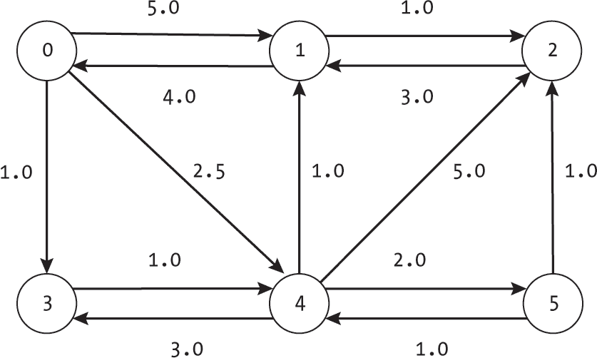
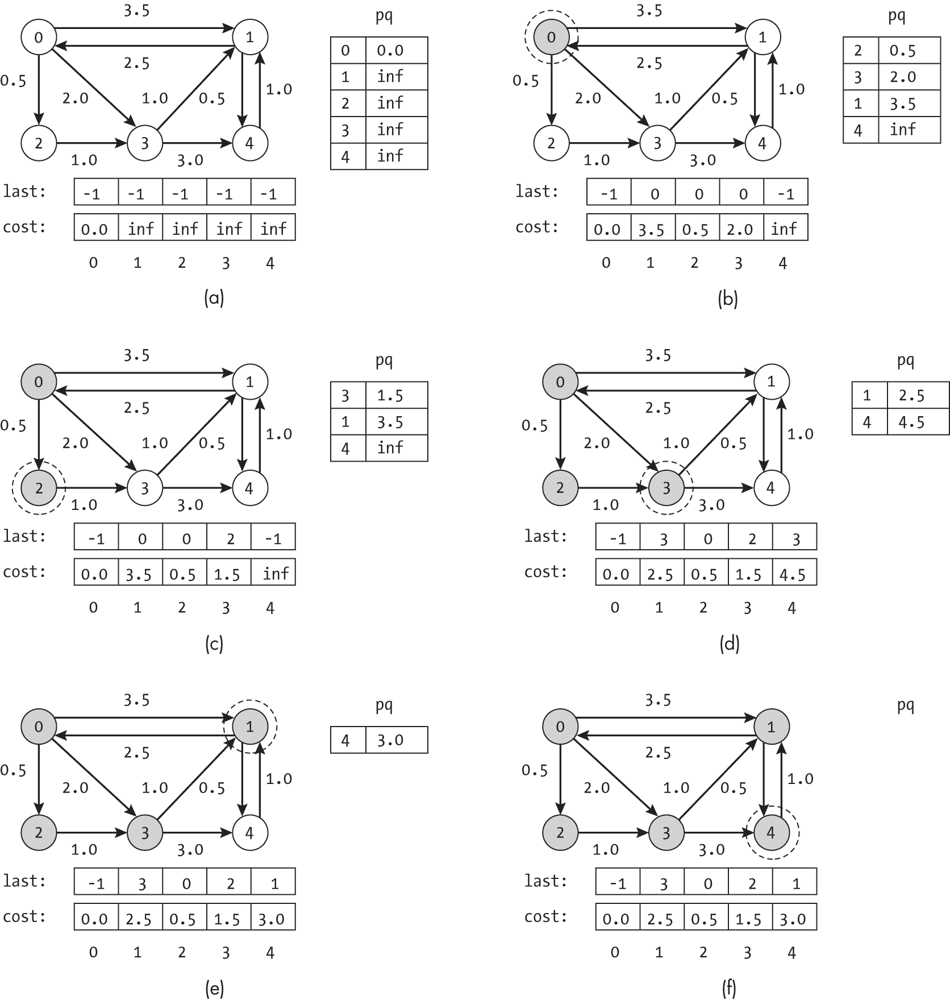
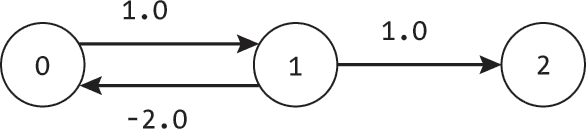
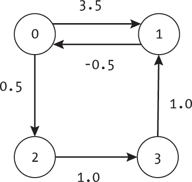
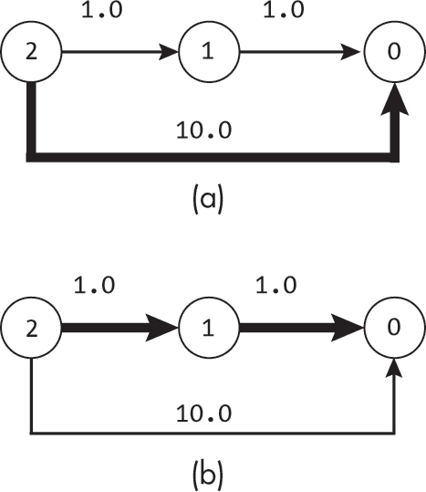
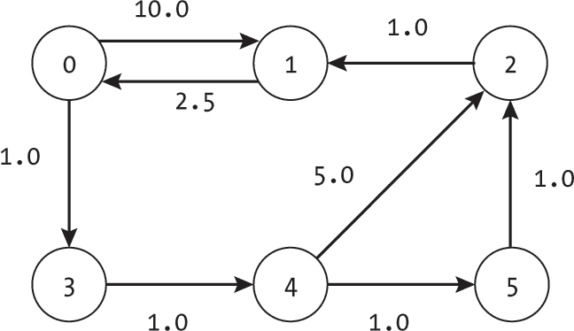
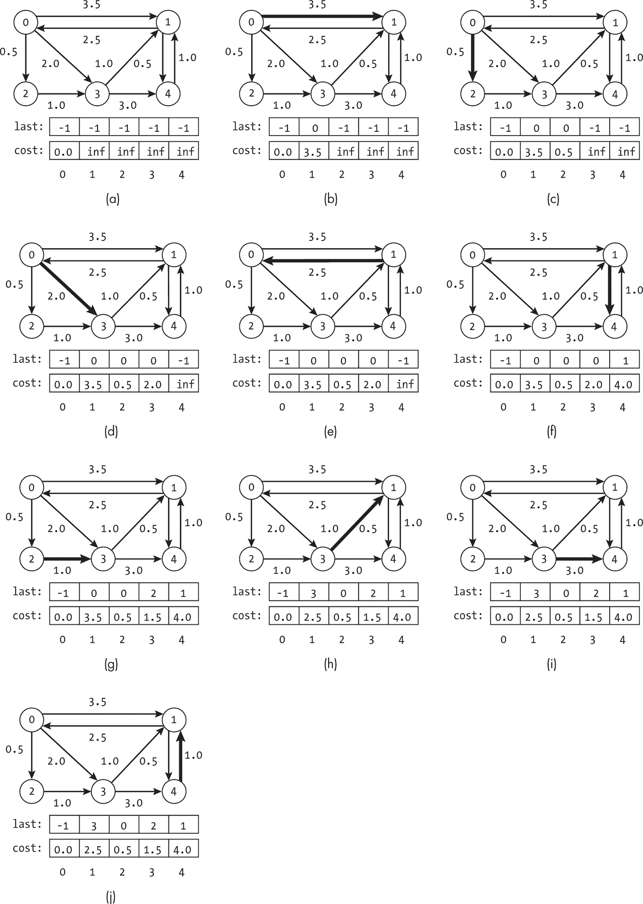
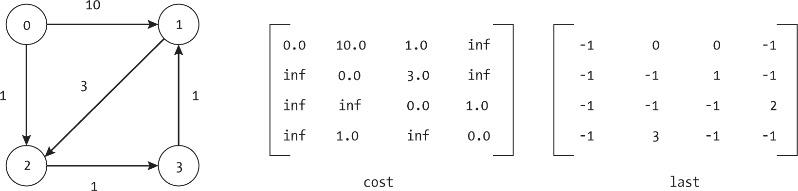
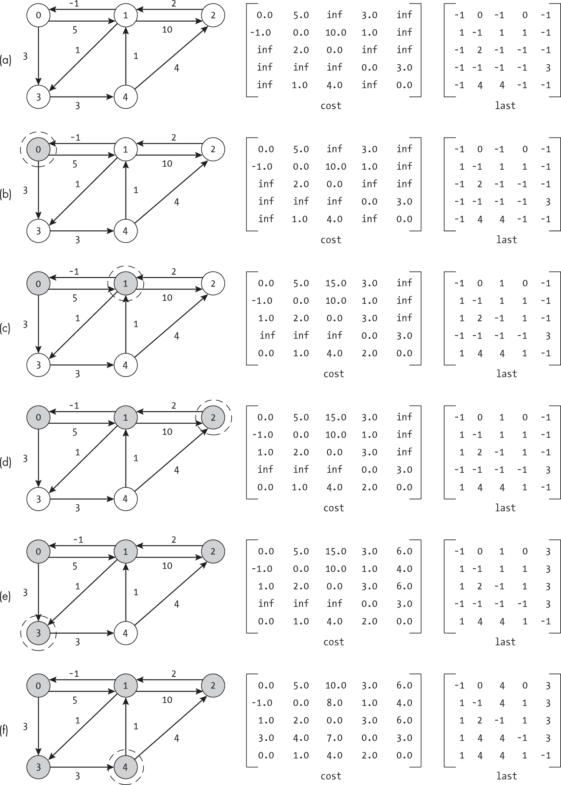

<hgroup>

## <samp class="SANS_Futura_Std_Bold_Condensed_B_11">7</samp> <samp class="SANS_Dogma_OT_Bold_B_11">最短路径</samp>

</hgroup>


寻找图中最低代价路径的问题，通过路径上所有边的权重之和来衡量，天然类似于现实世界中一系列路径规划和优化任务。例如，我们可能有兴趣规划卡车在两个城市之间的路线，以最小化燃料总费用。本章将讨论用于寻找从给定起点出发的最低代价路径的算法。

尽管寻找这些路径的问题通常被称为*最短路径问题*，但将其视为最低代价路径问题更为准确，因为路径的代价并不总是距离的函数。例如，本章还将讨论允许负权重边的版本。我们将在本章中交替使用*最短路径*和*最低代价路径*这两个术语；它们的公式和实现是相同的。

本章介绍了三种寻找最短路径的算法。我们首先介绍*Dijkstra 算法*，它像前几章中的搜索算法一样，从起始节点向外扩展。*Bellman-Ford 算法*通过逐步考虑各个边来改进最佳路径。最后，*Floyd-Warshall 算法*使我们能够找到所有节点对之间的最短路径。

### <samp class="SANS_Futura_Std_Bold_B_11">最低代价路径</samp>

在我们深入讨论确定图中最低代价路径的算法之前，我们必须明确最低代价路径的定义。回想一下第三章，路径的总代价是路径上所有边的权重之和。对于路径 *p* = [*e*[0], *e*[1], . . . , *e*k]，我们定义代价为：

*路径代价*(*p*) = *∑*i [= 0 到] k *e*i.<samp class="SANS_TheSansMonoCd_W5Regular_11">weight</samp>

我们将*最短路径*定义为从给定起始节点 *u* 到给定目标节点 *v* 的边的序列 *p* = [*e*[0], *e*[1], . . . , *e*k]，它最小化路径代价：

*最短路径*(*u*, *v*) = *最小值* p (*路径代价*(*p*)) 使得 *e*[0].<samp class="SANS_TheSansMonoCd_W5Regular_11">from_node</samp> = *u* 且 *e*k.<samp class="SANS_TheSansMonoCd_W5Regular_11">to_node</samp> = *v*

然后，我们定义两个节点之间的*距离*为这两个节点之间最短路径的代价：

*dist*(*u*, *v*) = *路径代价*(*最短路径*(*u*, *v*))

作为一个具体的例子，考虑从节点 0 到节点 5 的路径，经过具有定向边的六节点图，如图 7-1。每条边的权重已显示。我们的目标是找到从节点 0 到节点 5 的边的序列，以使总成本最小。



<samp class="SANS_Futura_Std_Book_Oblique_I_11">图 7-1：一个带权重的有向图，包含六个节点</samp>

表 7-1 列出了从节点 0 到节点 5 在图 7-1 中的一些可能路径的成本，显示我们可以定义多种具有不同成本的路径。在这个例子中，最短路径是[0, 3, 4, 5]，其*dist*(0, 5) = *PathCost* ([0, 3, 4, 5]) = 4.0。两个节点之间的最低成本路径可能不会使用最少的边，而是可能采取更多较低成本的步骤。

<samp class="SANS_Futura_Std_Heavy_B_11">表 7-1:</samp> <samp class="SANS_Futura_Std_Book_11">从节点 0 到节点 5 的路径成本</samp>

| <samp class="SANS_Futura_Std_Heavy_B_11">路径</samp> | <samp class="SANS_Futura_Std_Heavy_B_11">成本</samp> |
| --- | --- |
| <samp class="SANS_Futura_Std_Book_11">0, 3, 4, 5</samp> | <samp class="SANS_Futura_Std_Book_11">4.0</samp> |
| <samp class="SANS_Futura_Std_Book_11">0, 4, 5</samp> | <samp class="SANS_Futura_Std_Book_11">4.5</samp> |
| <samp class="SANS_Futura_Std_Book_11">0, 1, 0, 3, 4, 5</samp> | <samp class="SANS_Futura_Std_Book_11">13.0</samp> |
| <samp class="SANS_Futura_Std_Book_11">0, 3, 4, 3, 4, 5</samp> | <samp class="SANS_Futura_Std_Book_11">8.0</samp> |

如表 7-1 所示，路径可能包含环路。如果我们将问题限制为仅使用正边权值，环路将严格增加路径的成本。最短路径算法将避免这些环路。这在现实世界中的例子中是显而易见的，比如冒险者在第四章中探索迷宫的情形。在迷宫中绕圈走不仅需要额外的步伐，而且还会重复面临任何复生怪物的代价。

然而，如果允许负的边权值，问题会变得更加复杂（且更难以直观地可视化）。因此，本章中的算法对负权值的使用进行了限制，要求路径中不包含具有负成本的环路。

一个图中可能有多个最低成本的路径。此章中的算法产生其中之一。

### <samp class="SANS_Futura_Std_Bold_B_11">Dijkstra 算法</samp>

**Dijkstra 算法**由计算机科学家 Edsger W. Dijkstra 发明，用于从给定的起始节点到图中所有其他节点找到最低成本路径。它可以在无权图或加权图上运行，前提是边权值没有负值。这个限制反映了现实世界中的路径规划问题，因为我们无法通过增加一个额外的步骤来减少总路径长度（成本）。最典型的例子是规划公路旅行，目的是最小化旅行的总距离。由于不可能有负的距离，我们永远无法通过增加一个步骤来缩短旅行。

Dijkstra 算法通过维护未访问节点的集合并不断更新每个节点的当前估计代价来运行。它通过选择距离起点最近（代价最低）的未访问节点并访问它，持续减少未访问节点的数量。然后它探索该节点并检查是否提供通向每个未访问邻居的更优路径。更详细地说，算法通过将当前节点的代价与邻居的代价相加来计算新提出路径的代价。如果新路径的代价小于迄今为止看到的最佳代价，算法就会更新该代价。

因为算法始终选择下一个要探索的最近（最低代价）节点，我们可以确保每次访问节点时都在走最短的路径。这是因为我们不允许负的边权重，所以增加步骤总是会增加路径的代价。

为了可视化这一点，考虑在访问节点 *v* 之前算法的状态。我们可能会担心通过某个未访问节点到 *v* 的路径更优。毕竟，我们还没有看到图中的所有路径，甚至可能没有访问过 *v* 的所有邻居。然而，任何这样的路径都必须经过一个未访问的节点 *w*。由于 *v* 是首先被选中的，从起点 *u* 到 *w* 的路径代价至少和从 *u* 到 *v* 的路径代价一样大，而这仅仅是到达 *v* 的一部分。随后的从 *w* 到 *v* 的路径只会进一步增加代价。

对于我们从 第四章 中描绘迷宫的冒险者，Dijkstra 算法就像他们逐个房间地清理迷宫。这个冒险者曾是地图学的学生，他在每个访问过的房间里都详细记录了找到的最短路径，因为他的退休计划是编写地下城指南，并将其出售给未来的冒险者。在计划下一步行动时，冒险者会考虑可以到达哪些未访问的房间，然后尝试确定从地下城入口（起点节点）到每个房间的最佳路径。路径的长度是到达相邻房间的代价，然后转移到未探索房间的代价。

#### <samp class="SANS_Futura_Std_Bold_Condensed_Oblique_BI_11">代码</samp>

Dijkstra 算法的代码使用优先队列来管理未访问节点的集合，如下所示：

```
def Dijkstras(g: Graph, start_index: int) -> list: 
    cost: list = [math.inf] * g.num_nodes
    last: list = [-1] * g.num_nodes
    pq: PriorityQueue = PriorityQueue(min_heap=True)

  ❶ pq.enqueue(start_index, 0.0)
    for i in range(g.num_nodes):
        if i != start_index:
            pq.enqueue(i, math.inf)
    cost[start_index] = 0.0

    while not pq.is_empty():
      ❷ index: int = pq.dequeue()

        for edge in g.nodes[index].get_edge_list():
            neighbor: int = edge.to_node

          ❸ if pq.in_queue(neighbor):
                new_cost: float = cost[index] + edge.weight
              ❹ if new_cost < cost[neighbor]:
                  ❺ pq.update_priority(neighbor, new_cost)
                    last[neighbor] = index
                    cost[neighbor] = new_cost

    return last 
```

这段代码依赖于 附录 B 中描述的优先队列的自定义实现，该实现允许动态更新优先级。有兴趣的读者可以在该附录中找到详细信息。现在，仅需要将 <samp class="SANS_TheSansMonoCd_W5Regular_11">PriorityQueue</samp> 视为一种数据结构，它允许高效地插入带优先级的元素、移除具有最低优先级的元素、查找元素以及更新元素的优先级。

代码首先创建多个辅助数据结构，包括以下内容：到每个节点的最佳成本列表（<samp class="SANS_TheSansMonoCd_W5Regular_11">cost</samp>），指示在访问某个节点之前上一个访问节点的列表（<samp class="SANS_TheSansMonoCd_W5Regular_11">last</samp>），以及一个未访问节点的最小堆优先队列（<samp class="SANS_TheSansMonoCd_W5Regular_11">pq</samp>）。代码将起始节点的索引（<samp class="SANS_TheSansMonoCd_W5Regular_11">start_index</samp>）放入优先队列中，优先级为 <samp class="SANS_TheSansMonoCd_W5Regular_11">0.0</samp>，其余节点的优先级为无限大 ❶。起始节点的成本标记为 <samp class="SANS_TheSansMonoCd_W5Regular_11">0.0</samp>。

然后，代码逐个处理优先队列中的节点，使用 <samp class="SANS_TheSansMonoCd_W5Regular_11">while</samp> 循环迭代，直到优先队列为空。在每次迭代中，代码从优先队列中提取出最小成本节点并进行探索 ❷。

代码使用一个 <samp class="SANS_TheSansMonoCd_W5Regular_11">for</samp> 循环来考虑当前节点的每一个邻居，检查该邻居是否仍在优先队列中，使用 <samp class="SANS_TheSansMonoCd_W5Regular_11">in_queue()</samp> 函数 ❸。如果节点仍在队列中，说明代码尚未访问过该节点。然后，代码检查是否通过当前节点找到了一条更优的路径通往该邻居 ❹。此检查对应于将当前找到的最优路径成本（<samp class="SANS_TheSansMonoCd_W5Regular_11">cost[neighbor]</samp>）与经过当前节点的最优路径成本（<samp class="SANS_TheSansMonoCd_W5Regular_11">cost[index]</samp> <samp class="SANS_TheSansMonoCd_W5Regular_11">+</samp> <samp class="SANS_TheSansMonoCd_W5Regular_11">edge.weight</samp>）进行比较。由于代码最初将所有非起始节点的成本设为无限大，它们至少会在第一次被访问时被更新。如果代码找到了通往邻居的更优路径，它将更新该邻居节点在队列中的优先级、该节点的前一个节点在 <samp class="SANS_TheSansMonoCd_W5Regular_11">last</samp> 中的记录，以及最优成本 ❺。

代码继续探索未访问的节点（那些仍在优先队列中的节点），直到所有节点都被访问过。如前所述，一旦代码访问了某个节点，就说明已经找到了最短路径，并且不需要重新考虑任何已访问的节点。当代码访问完所有节点后，它返回路径上的前一个节点列表。

给定这里展示的基于*堆*的 Dijkstra 算法实现，我们可以想象该算法如何在更大规模的图中扩展。该算法通过将所有节点插入优先队列并逐个移除节点，确保每个节点只访问一次。使用基于堆的优先队列，每个操作的时间复杂度为 log(|*V*|)，因此迭代这些节点的总时间复杂度为|*V*| log(|*V*|)。在访问每个节点时，我们检查其每个邻居是否在优先队列中，并可能更新优先级。由于我们使用了在附录 B 中描述的自定义<samp class="SANS_TheSansMonoCd_W5Regular_11">PriorityQueue</samp>，查找操作使用字典，并且在平均情况下是常数时间。更新操作的复杂度为 log(|*V*|)。由于我们每个节点只访问一次，并且只考虑其出边一次，所以最多每条边更新一次，成本为|*E*| log(|*V*|)。因此，算法的总成本为|*V*| log(|*V*|) + |*E*| log(|*V*|) = (|*V*| + |*E*|) log(|*V*|)。

#### <samp class="SANS_Futura_Std_Bold_Condensed_Oblique_BI_11">一个示例</samp>

图 7-2 展示了 Dijkstra 算法在一个五节点图上的操作。每个子图表示算法完成一步后的状态。虚线圆圈表示刚刚处理的节点，阴影节点表示已经访问过的节点。优先队列（<samp class="SANS_TheSansMonoCd_W5Regular_11">pq</samp>）以排序顺序显示，便于查看相对优先级，尽管它实际是按堆排序存储的。



<samp class="SANS_Futura_Std_Book_Oblique_I_11">图 7-2：Dijkstra 算法的步骤</samp>

图 7-2(a)表示在探索第一个节点之前，算法的状态。冒险者站在入口处，准备开始他们的任务。所有节点的<samp class="SANS_TheSansMonoCd_W5Regular_11">last</samp>条目为<samp class="SANS_TheSansMonoCd_W5Regular_11">-1</samp>，表示我们尚不知道到达它们的路径。节点 0 的成本为<samp class="SANS_TheSansMonoCd_W5Regular_11">0</samp>，因为搜索从这里开始，而所有其他节点的估算成本为无限大，因为我们尚未知道*任何*可能的路径。与深度优先搜索和广度优先搜索算法不同，我们一开始就将所有节点放入优先队列。

在每一步中，算法都会探索队列中剩余的最佳节点。在图 7-2(b)中，算法选择了节点 0（唯一一个没有无限代价的节点），并访问了它。它发现有三条边通向邻居：节点 1、节点 2 和节点 3。搜索比较了通过节点 0 到达其他节点的路径代价与当前代价的大小。由于新路径代价对这三个节点来说都小于无限大，算法更新了它们在<samp class="SANS_TheSansMonoCd_W5Regular_11">last</samp>、<samp class="SANS_TheSansMonoCd_W5Regular_11">cost</samp> 和 <samp class="SANS_TheSansMonoCd_W5Regular_11">pq</samp> 中的条目。这个在优先队列中的更新重新排序了待探索的节点列表。

图 7-2(c)展示了当搜索访问节点 2 时发生的情况。该节点有一个邻居（节点 3），其估算代价为<samp class="SANS_TheSansMonoCd_W5Regular_11">2.0</samp>。然而，现在通过节点 2 到达节点 3 的路径提供了一个更优的选择，总代价为 0.5 + 1.0 = 1.5。算法将节点 3 的<samp class="SANS_TheSansMonoCd_W5Regular_11">cost</samp>条目更新为<samp class="SANS_TheSansMonoCd_W5Regular_11">1.5</samp>，并将其<samp class="SANS_TheSansMonoCd_W5Regular_11">last</samp>条目更新为<samp class="SANS_TheSansMonoCd_W5Regular_11">2</samp>。

从我们的冒险者角度看，房间 2 提供了一条到房间 3 的更优路径。也许有一只特别强大的怪物守卫着从房间 0 到房间 3 的通道。为了未来的探索者考虑，冒险者会将建议的路径改变，选择通过房间 2 前往房间 3。

搜索继续在剩余节点中进行。当算法访问到图 7-2(d)中的节点 3 时，发现到节点 1 的路径更优。类似地，访问到图 7-2(e)中的节点 1 时，提供了一条到节点 4 的更优路径。搜索在图 7-2(f)中完成，访问了最后一个节点。

#### <samp class="SANS_Futura_Std_Bold_Condensed_Oblique_BI_11">断开的图</samp>

询问如果某些节点无法从起始节点到达，会发生什么，能够帮助我们理解 Dijkstra 算法在断开图上的表现。考虑图 7-3 中的四节点图，其中从节点 0 出发时，只有节点 0 和节点 1 是可达的。


<samp class="SANS_Futura_Std_Book_Oblique_I_11">图 7-3：一个包含不可达节点的图</samp>

这对应于迷宫中的不可达房间。从传说中，冒险者知道迷宫有四个房间，但他们只能到达其中两个。房间 0 到房间 2 或房间 3 之间没有路径，所以冒险者只能在笔记中标明这一点。

Dijkstra 算法可以轻松处理这种情况。节点 2 和 3 最初被分配了 <samp class="SANS_TheSansMonoCd_W5Regular_11">last</samp> 值 <samp class="SANS_TheSansMonoCd_W5Regular_11">-1</samp> 和无限大的成本。由于从节点 0 到这两个节点之间没有路径，当其中一个节点从优先队列中提取出来时，它的成本仍然是无限大的。当算法考虑到该节点的邻居时，通过该节点的估计成本将是无限的，因此算法不会更新任何 <samp class="SANS_TheSansMonoCd_W5Regular_11">cost</samp> 或 <samp class="SANS_TheSansMonoCd_W5Regular_11">last</samp>。在算法结束时，节点 2 和 3 的最后指针将为 <samp class="SANS_TheSansMonoCd_W5Regular_11">-1</samp>。

### <samp class="SANS_Futura_Std_Bold_B_11">负权边</samp>

在现实问题中，边的权重可能是负数，表示负成本（或一种利益）。例如，考虑社交网络中的通信，每对朋友之间的连接就是一条边。每条边的权重表示将谣言从一个人传递到另一个人的成本。这个成本可能是发送短信或聊天所需的时间损失。然而，在某些情况下，边的权重可能为负，表示使用该通信渠道的利益。如果两个朋友有一段时间没有交谈，重新联系并传递一些八卦的成本可能是负的。

另外，我们可以设想路径规划来最小化电动汽车的电池使用。如果一条边代表一条陡峭的下坡路，我们可以利用重力和再生制动来为电池充电。该段路径的电池使用成本是负的。

注意，在负权边的情况下，*最短路径*一词并不完全有意义，因为距离不能为负。无论你在路径规划上多么熟练，你都不能组织一次在出发之前就已经回到家的骑行旅行。然而，为了与广泛的文献保持一致，我们仍然继续称这些问题为*最短路径*。

在考虑带有负权边的图中的最短路径时，我们仍然需要保持一个约束条件：图中不能包含负环。*负环*是指当从一个节点回到自身时，边的权重之和为负数的路径。在存在这样的环时，最低成本路径的概念将失效。例如，考虑图 7-4，其中边 (0, 1) 的权重为 <samp class="SANS_TheSansMonoCd_W5Regular_11">1.0</samp>，而边 (1, 0) 的权重为 <samp class="SANS_TheSansMonoCd_W5Regular_11">-2.0</samp>。



<samp class="SANS_Futura_Std_Book_Oblique_I_11">图 7-4：带有负环的图</samp>

如果我们尝试在图 7-4 中找到从节点 0 到节点 2 的最低成本路径，我们会立即遇到问题。如表 7-2 所示，我们可以不断地从节点 0 到节点 1 再到节点 0 添加另一个循环以进一步降低成本。最低成本路径将会永远来回循环。

<samp class="SANS_Futura_Std_Heavy_B_11">表 7-2:</samp> <samp class="SANS_Futura_Std_Book_11">图 7-4 中的路径成本</samp>

| <samp class="SANS_Futura_Std_Heavy_B_11">路径</samp> | <samp class="SANS_Futura_Std_Heavy_B_11">成本</samp> |
| --- | --- |
| <samp class="SANS_Futura_Std_Book_11">0, 1, 2</samp> | <samp class="SANS_Futura_Std_Book_11">2</samp> |
| <samp class="SANS_Futura_Std_Book_11">0, 1, 0, 1, 2</samp> | <samp class="SANS_Futura_Std_Book_11">1</samp> |
| <samp class="SANS_Futura_Std_Book_11">0, 1, 0, 1, 0, 1, 2</samp> | <samp class="SANS_Futura_Std_Book_11">0</samp> |
| <samp class="SANS_Futura_Std_Book_11">0, 1, 0, 1, 0, 1, 0, 1, 2</samp> | <samp class="SANS_Futura_Std_Book_11">–1</samp> |
| <samp class="SANS_Futura_Std_Book_11">. . .</samp> | <samp class="SANS_Futura_Std_Book_11">. . .</samp> |

相反，图 7-5 展示了一个具有负边权但没有负环的图。可以从节点 1 到节点 0 以负成本旅行。然而，从节点 0 返回到自身或从节点 1 返回到自身的任何路径将具有总正成本。



<samp class="SANS_Futura_Std_Book_Oblique_I_11">图 7-5: 具有负边权但无负环的图</samp>

我们如何判断一个图是否具有负环？负环可能非常长，通过图的每个节点循环，因此不会立即显现。Bellman-Ford 算法通过检查图中负环的存在来解决这个问题。

### <samp class="SANS_Futura_Std_Bold_B_11">贝尔曼-福特算法</samp>

Dijkstra 算法的一个主要缺点是它仅限于具有正边权的图。Bellman-Ford 算法消除了这一限制，但必须增加计算成本才能实现。

*Bellman-Ford 算法*通过反复遍历边列表，并利用这些边来更新到达每个节点的最佳成本来运行（这个过程叫做 *松弛*）。与 Dijkstra 算法类似，它维护一个列表 <samp class="SANS_TheSansMonoCd_W5Regular_11">cost</samp>，存储从起点到每个节点的当前最佳成本估算。每当 Bellman-Ford 考虑一条边时，它会比较该边的目标节点当前的成本估算（即 <samp class="SANS_TheSansMonoCd_W5Regular_11">cost</samp> 中的条目）与通过从边的起点出发（使用起点在 <samp class="SANS_TheSansMonoCd_W5Regular_11">cost</samp> 中的条目加上边的权重）得出的估算，查看这条边是否提供了更好的路径。它会不断重复这个测试，不断改进最佳路径的估算。

我们可以将该算法想象为一位非常细致的旅行代理人，正在为即将到来的旅游季节考虑航班选项。代理人从一个起点（例如芝加哥）开始，寻找前往全球每个可能目的地的最便宜路径。显然，代理人不能亲自乘坐每个航班（也就是说，不能遍历整个图）。然而，他们可以轻松地浏览航班和价格列表，更新他们的估算表格。

在对航班列表进行一次扫描后，代理人就能知道从芝加哥到其他每个城市的最佳直飞航班。然后，他们再次扫描列表，询问是否可以利用当前掌握的最佳旅行信息，构建通往每个目的地的更好路径。代理人反复扫描列表，更新他们的估算，直到为每个目的地找到最佳路径。

就像旅行代理人一样，通过 Bellman-Ford 外层循环的每次迭代，我们实际上在构建更好的路径。这个路径逐步构建的过程在 图 7-6 中得到了展示。加粗的线条表示每次迭代后，从节点 2 到节点 0 的最佳已知路径。



<samp class="SANS_Futura_Std_Book_Oblique_I_11">图 7-6：Bellman-Ford 算法从节点 2 到节点 0 找到逐步更优的路径</samp>

图 7-6(a)展示了节点 2 到节点 0 经过每条边一次后得到的最佳路径。由于算法仅查看了每条边一次，它只看到从节点 2 到节点 0 的直接路径，成本为<samp class="SANS_TheSansMonoCd_W5Regular_11">10.0</samp>。它没有机会意识到可以通过边(2, 1)和(1, 0)构建更好的路径。在第二次迭代中，算法利用从节点 2 到节点 1 的成本为<samp class="SANS_TheSansMonoCd_W5Regular_11">1.0</samp>的路径，构建了一条到节点 0 的路径。节点 0 的最佳路径更新为经过节点 1，成本为<samp class="SANS_TheSansMonoCd_W5Regular_11">2.0</samp>，如图 7-6(b)所示。

我们可以将总迭代次数限制为|*V*| – 1，其中|*V*|是图中节点的数量。由于不允许负环，最小成本路径永远不能返回到相同的节点，因为这样做会严格增加路径的成本。这也是现实世界中不同城市间的旅行路线不包含循环的原因——即，不会有多次在同一机场的中转。

由于最小成本路径不能重复经过节点，因此它最多可以触及所有|*V*|个节点，并使用|*V*| – 1 条边。例如，在图 7-7 中，节点 0 到节点 1 的最低成本路径是[0, 3, 4, 5, 2, 1]。虽然存在经过更少步骤的备选路径，但节点 0 到节点 1 的最低成本路径使用了五条边，并访问了图中的所有节点。



<samp class="SANS_Futura_Std_Book_Oblique_I_11">图 7-7：一个包含从节点 0 到节点 1 的五步路径的示例图</samp>

Bellman-Ford 算法利用这一约束来停止算法并检测环路。在外循环执行|*V*| – 1 次迭代后，它已经找到了所有可能的最小成本路径。由于该算法使用了两个嵌套的<samp class="SANS_TheSansMonoCd_W5Regular_11">for</samp>循环（一个遍历节点数量，另一个遍历每一条边），其成本按|*E*| |*V*|的乘积来扩展。

除非存在负环，额外的边迭代不会有任何帮助。掌握这一知识后，算法会进行一次额外的迭代，并测试是否有任何成本降低。如果有，它就知道图中存在负环。

我们可以将最后的测试想象成我们的旅行代理人对其最便宜航班列表进行最后一次检查。他们注意到，在匹兹堡和波士顿之间添加一段航程进一步降低了价格。感到困惑时，他们回顾航班数据，发现从芝加哥到波士顿，再到匹兹堡，再到波士顿，再到西雅图的行程是目前为止最便宜的选项。从波士顿到匹兹堡再回到波士顿的循环提供了一个负环。显然，航班定价出现了问题，形成了一个有效的负费用循环。旅行代理人赶紧打电话给客户，告诉他们可能有一次免费的 10 站旅行，赶在航空公司修复问题之前。

#### <samp class="SANS_Futura_Std_Bold_Condensed_Oblique_BI_11">代码</samp>

Bellman-Ford 会对每一条边进行 |*V* | – 1 次迭代。每次迭代，它都会问一个简单的问题：“当前边是否提供到目的地节点的更好路径？”代码使用一对 <samp class="SANS_TheSansMonoCd_W5Regular_11">for</samp> 循环来驱动这个搜索：

```
def BellmanFord(g: Graph, start_index: int) -> Union[list, None]: 
    cost: list = [math.inf] * g.num_nodes
    last: list = [-1] * g.num_nodes
    all_edges: list = g.make_edge_list()
    cost[start_index] = 0.0 for itr in range(g.num_nodes - 1):
        for edge in all_edges:
          ❶ cost_thr_node: float = cost[edge.from_node] + edge.weight
          ❷ if cost_thr_node < cost[edge.to_node]:
                cost[edge.to_node] = cost_thr_node
                last[edge.to_node] = edge.from_node

    for edge in all_edges:
      ❸ if cost[edge.to_node] > cost[edge.from_node] + edge.weight:
            return None
    return last 
```

<samp class="SANS_TheSansMonoCd_W5Regular_11">BellmanFord()</samp> 函数接受一个 <samp class="SANS_TheSansMonoCd_W5Regular_11">图</samp> 和起始索引，返回到每个目的地的最佳路径（使用 <samp class="SANS_TheSansMonoCd_W5Regular_11">last</samp> 数组）或如果图中存在负环则返回 <samp class="SANS_TheSansMonoCd_W5Regular_11">None</samp>。我们需要从 Python 的 <samp class="SANS_TheSansMonoCd_W5Regular_11">typing</samp> 库导入 <samp class="SANS_TheSansMonoCd_W5Regular_11">Union</samp>，以便对多个返回值进行类型提示。

这段代码首先创建跟踪数据结构，包括目前为止的最佳费用（<samp class="SANS_TheSansMonoCd_W5Regular_11">cost</samp>）和当前路径上前一个节点（<samp class="SANS_TheSansMonoCd_W5Regular_11">last</samp>）。它还使用 <samp class="SANS_TheSansMonoCd_W5Regular_11">make_edge_list()</samp> 函数提取算法所需的完整边列表，该函数遍历每个节点并组装图中的每一条边。最后，它将起始节点的费用设置为 0.0。

一对嵌套的 <samp class="SANS_TheSansMonoCd_W5Regular_11">for</samp> 循环驱动 |*V* | – 1 次遍历边列表。对于每条边，代码评估通过该边到达目的地的费用 ❶。如果该费用小于当前的最佳费用 ❷，代码就会更新最佳费用估算值和到该节点的路径。请注意，减少的费用可能不是由于更改了前一个节点（<samp class="SANS_TheSansMonoCd_W5Regular_11">last</samp>）；相反，前一个节点的费用可能是由于有了更好的路径而下降了。

当代码完成 |*V* | – 1 次外部循环迭代时，它已经完成了优化。在结束之前，它会检查解决方案是否有效。如果任何成本仍然可以通过再走一步 ❸ 来改进，那么图中必定存在负成本环，在这种情况下，算法返回 <samp class="SANS_TheSansMonoCd_W5Regular_11">None</samp>。否则，它返回 <samp class="SANS_TheSansMonoCd_W5Regular_11">last</samp> 列表。

#### <samp class="SANS_Futura_Std_Bold_Condensed_Oblique_BI_11">一个例子</samp>

图 7-8 显示了 Bellman-Ford 算法外部循环的第一次迭代。由于算法需要进行 (|*V* | – 1) |*E*| 步，其中 |*E*| 是边的数量，因此不可能展示所有的 36 步。相反，我们考虑外部循环的第一次迭代，以回顾路径（由 <samp class="SANS_TheSansMonoCd_W5Regular_11">last</samp> 表示）和估算成本的变化。每个子图表示算法在检查加粗的边后的状态。



<samp class="SANS_Futura_Std_Book_Oblique_I_11">图 7-8：Bellman-Ford 外部循环第一次迭代的起始状态和九个步骤</samp>

图 7-8(a) 显示了算法在检查任何边之前的状态。除了起始节点外，所有节点的估计成本都是无限大。在 图 7-8(b) 中，算法测试了第一条边，并发现它提供了一条到目标节点 1 的更优路径。它将到节点 1 的路径更新为从节点 0 出发的路径，并将最佳成本更新为 <samp class="SANS_TheSansMonoCd_W5Regular_11">3.5</samp>。

搜索通过图中的每一条边继续进行，每次迭代时考虑到单个节点——当前边的目标节点的成本。在 图 7-8(c) 中，它发现了一条到节点 2 的更优路径；在 图 7-8(d) 中，它发现了一条到节点 3 的更优路径。在 图 7-8(e) 中，它没有更新任何内容，因为从节点 0 到节点 0 的最佳成本是 <samp class="SANS_TheSansMonoCd_W5Regular_11">0.0</samp>，我们不需要通过节点 1 再次绕回起点。

在外部循环的第一次迭代结束时，如 图 7-8(j) 所示，搜索已经检查了每条边并更新了最佳路径和成本估算。然而，算法尚未完成。到节点 4 的真实最佳路径是 [0, 2, 3, 1, 4]，其成本为 <samp class="SANS_TheSansMonoCd_W5Regular_11">3.0</samp>。直到重新考虑边 (1, 4) 时，算法才会找到这个最终的成本。在第一次循环中，算法还未找到到节点 1 的最佳路径，因此它的成本估算值过大。

随着算法的继续，它会重新检查边，并不断更新最佳路径及其成本。图 7-9 显示了算法的最终步骤。

![边（4, 1）权重为 1.0，已加粗。最后的数组为[-1, 3, 0, 2, 1]，成本数组为[0.0, 2.5, 0.5, 1.5, 3.0]。](../images/f07009.jpg)

<samp class="SANS_Futura_Std_Book_Oblique_I_11">图 7-9：Bellman-Ford 算法的最终状态</samp>

在第四次检查边（4, 1）后，算法已经完成了两个循环。成本和路径已收敛到其真实值。

### <samp class="SANS_Futura_Std_Bold_B_11">所有节点对最短路径</samp>

我们的探险者和旅行社例子都满足于找到从给定起点到图中所有其他节点的最低成本路径的算法。然而，如果我们想要找到图中*任何*节点对之间的最短路径呢？即便是在我们之前的两个类比中，我们也能看到这种方法的吸引力。一旦冒险者绘制出整个魔法迷宫，他们可能希望在任意房间之间来回穿梭，以帮助其他遇到困难的冒险者。同样，我们的旅行社可能想要全球化，规划从任何起点到全球任何目的地的旅行。在这两种情况下，我们都需要找到两个任意节点之间的最低成本路径。

*所有节点对最短路径问题*的目标是找到图中每对节点之间的最短路径。换句话说，我们现在希望构建一个*矩阵*<samp class="SANS_TheSansMonoCd_W5Regular_11">last</samp>，使得每一行<samp class="SANS_TheSansMonoCd_W5Regular_11">last[i]</samp>包含从节点*i*出发的路径的前驱节点列表。在这个公式中，矩阵的条目<samp class="SANS_TheSansMonoCd_W5Regular_11">last[i][j]</samp>是从*i*到节点*j*路径上，紧接着*j*之前的节点。与我们之前在各种搜索算法和其他最短路径算法中使用的<samp class="SANS_TheSansMonoCd_W5Regular_11">last</samp>数组公式一样，对于一个固定的起点，我们可以从目的地追溯前驱节点，直到回到起点。

我们可以通过在本章讨论的任何一个算法周围添加一个循环来解决寻找所有节点对最短路径的问题。例如，我们可以使用一个单一的<samp class="SANS_TheSansMonoCd_W5Regular_11">for</samp>循环和 Bellman-Ford 算法来填充<samp class="SANS_TheSansMonoCd_W5Regular_11">last</samp>矩阵：

```
last: list = []
for n in range(g.num_nodes):
    last.append(BellmanFord(g, n))
return last 
```

由于 Bellman-Ford 算法的成本为|*E*| |*V*|，这种方法的总成本为|*E*| |*V*|²。类似地，我们可以用成本为|*V*|（|*V*| + |*E*|）log（|*V*|）来包装 Dijkstra 算法（如本章所实现）。这相当于在每个城市调用旅行社，询问从该城市出发的最低成本的旅行。通过结合从每个起点到所有可能目的地的最短路径信息，我们可以汇总两个城市之间旅行的成本。

以下部分介绍了一种替代的最短路径算法：Floyd-Warshall。该算法对密集图表现良好，特别是当|*E*|远大于|*V*|时。Floyd-Warshall 算法并非遍历未访问的节点或所有边，而是考虑可能作为中间路径节点的每个节点，并决定是否使用该节点。

### <samp class="SANS_Futura_Std_Bold_B_11">Floyd-Warshall 算法</samp>

*Floyd-Warshall 算法*通过迭代地考虑和优化每个起点和终点之间的节点来解决所有点对最短路径问题。*中间路径*由起点之后、终点之前的节点组成。该算法通过考虑将节点包含在中间路径中来有效地构建更好的路径。外部的`for`循环迭代每个节点*u*，并询问：“如果我们在节点*u*处停一下，是否会有更好的路径？”对于每个中间节点*u*，算法会测试每条待考虑的路径，看看它是否有帮助。如果有，它就将其加入。

在整个过程中，我们维护了之前在 Dijkstra 和 Bellman-Ford 算法中使用的`last`和`cost`数组的矩阵版本。这些矩阵的每一行对应一个起始节点的数组，每个条目表示某个目标节点的值（路径的成本或前一个节点）。我们初始化这两个矩阵以表示*没有*任何中间节点的最佳路径。`cost[u][v]`的初始值是如果边（*u*，*v*）存在则为边的权重，如果*u* = *v*则为 0，否则为无穷大。类似地，`last[u][v]`的值是如果边（*u*，*v*）存在且*u* ≠ *v*，则为*u*，否则值为`-1`，表示没有路径。

图 7-10 显示了 Floyd-Warshall 算法状态的示例。左侧的图是参考图，而两个矩阵则展示了当前估算的成本和最佳路径。这个初始状态是计算上等同于旅行社为客户规划只选择直飞航班的情况。只有当从*u*到*v*有直飞航班时，才会考虑城市对（*u*，*v*）。所有其他城市的成本可以看作是无限大。



<samp class="SANS_Futura_Std_Book_Oblique_I_11">图 7-10：Floyd-Warshall 算法开始时数据结构的状态</samp>

弗洛伊德-沃尔夏尔算法利用一种称为*动态规划*的计算技术，有效地构建了使用{0, 1, ... , *k*}中间节点的最佳路径，这些路径只能包含{0, 1, ... , *k* - 1}中间节点。由于不允许负循环，每个节点在路径中最多只能使用一次。对于每对起点-终点(*u*, *v*)，算法检查是否有通过节点*k*的更好路径，该路径仅使用中间节点{0, 1, ... , *k*}。我们可以通过重新使用上一次迭代(*k* - 1)的<samp class="SANS_TheSansMonoCd_W5Regular_11">cost</samp>和<samp class="SANS_TheSansMonoCd_W5Regular_11">last</samp>矩阵来进行编程。如果通过*k*有更好的路径，从*u*到*k*和从*k*到*v*的最佳路径的组合成本必须小于当前从*u*到*v*的路径成本。我们可以直接从上一次迭代的<samp class="SANS_TheSansMonoCd_W5Regular_11">cost</samp>和<samp class="SANS_TheSansMonoCd_W5Regular_11">last</samp>矩阵中读取这些路径和成本。

要查看其运作原理，请考虑图中的图形和算法状态图 7-11，这发生在测试了图中可能的中间节点 0、1 和 2 之后。矩阵<samp class="SANS_TheSansMonoCd_W5Regular_11">cost</samp>和<samp class="SANS_TheSansMonoCd_W5Regular_11">last</samp>表示可以有中间节点{0, 1, 2}的最佳路径。从节点 0 到节点 1 的最佳路径仍然是直接步骤[0, 1]，因为我们还不能使用节点 3。

![成本矩阵的顶行为[0.0, 10.0, 1.0, 2.0]，最后矩阵的顶行为[–1, 0, 0, 2]。](../images/f07011.jpg)

<samp class="SANS_Futura_Std_Book_Oblique_I_11">图 7-11：在测试节点 0、1 和 2 后弗洛伊德-沃尔夏尔算法数据结构的状态</samp>

当我们考虑可以使用节点 3 作为中间节点的路径时，我们发现了几条更好的路径，如图 7-12 所示。让我们再次考虑从节点 0 到节点 1 的路径。当我们询问是否有通过节点 3 从节点 0 到节点 1 的更好路径时，我们发现确实有。通过节点 3 的路径成本为 3.0，因为从 0 到 3 的路径成本（通过节点 2）为<samp class="SANS_TheSansMonoCd_W5Regular_11">2.0</samp>，从 3 到 1 的路径成本为<samp class="SANS_TheSansMonoCd_W5Regular_11">1.0</samp>。

![成本矩阵的顶行为[0.0, 3.0, 1.0, 2.0]，最后矩阵的顶行为[-1, 3, 0, 2]。](../images/f07012.jpg)

<samp class="SANS_Futura_Std_Book_Oblique_I_11">图 7-12：在测试节点 0、1、2 和 3 后弗洛伊德-沃尔夏尔算法数据结构的状态</samp>

通过将节点 3 作为中间节点添加到从节点 0 到节点 1 的路径中，我们还添加了节点 2。最佳路径现在是 [0, 2, 3, 1]。这说明了 Floyd-Warshall 迭代方法的强大之处。我们不仅仅是孤立地考虑中间节点，而是考虑到到达和离开该节点的最佳路径。

由于该算法在每对节点之间测试每个可能的中间节点的改进路径，因此需要对节点进行三重嵌套的 <samp class="SANS_TheSansMonoCd_W5Regular_11">for</samp> 循环。因此，算法的成本按 |*V* |³ 的比例增长。虽然这看起来可能很昂贵，但先前方法的相对运行时间取决于边和节点的相对数量。

#### <samp class="SANS_Futura_Std_Bold_Condensed_Oblique_BI_11">代码</samp>

Floyd-Warshall 算法的核心是三重嵌套的 <samp class="SANS_TheSansMonoCd_W5Regular_11">for</samp> 循环，首先遍历每个中间节点（*k*），然后遍历每一对需要路径的节点（*i*, *j*），如下代码所示：

```
def FloydWarshall(g: Graph) -> list: 
    N: int = g.num_nodes
    cost: list = [[math.inf] * N for _ in range(N)] last: list = [[-1] * N for _ in range(N)]
  ❶ for i in range(N):
        for j in range(N):
            if i == j:
                cost[i][j] = 0.0
            else:
                edge: Union[Edge, None] = g.get_edge(i, j)
                if edge is not None:
                    cost[i][j] = edge.weight
                  ❷ last[i][j] = i

    for k in range(N):
        for i in range(N):
            for j in range(N):
              ❸ if cost[i][j] > cost[i][k] + cost[k][j]:
                    cost[i][j] = cost[i][k] + cost[k][j]
                  ❹ last[i][j] = last[k][j]
    return last 
```

代码通过设置初始的 <samp class="SANS_TheSansMonoCd_W5Regular_11">cost</samp> 和 <samp class="SANS_TheSansMonoCd_W5Regular_11">last</samp> 矩阵开始。使用一对嵌套的 <samp class="SANS_TheSansMonoCd_W5Regular_11">for</samp> 循环来遍历每个条目 ❶。对角线上的最佳成本被设置为 0.0 (<samp class="SANS_TheSansMonoCd_W5Regular_11">i</samp> <samp class="SANS_TheSansMonoCd_W5Regular_11">==</samp> <samp class="SANS_TheSansMonoCd_W5Regular_11">j</samp>)，通过边连接的节点的边权重被设置为边权值，否则设置为无穷大。代码使用 <samp class="SANS_TheSansMonoCd_W5Regular_11">Graph</samp> 类的 <samp class="SANS_TheSansMonoCd_W5Regular_11">get_edge()</samp> 函数来检查并检索边，这需要额外导入 Python 的 <samp class="SANS_TheSansMonoCd_W5Regular_11">typing</samp> 库中的 <samp class="SANS_TheSansMonoCd_W5Regular_11">Union</samp>。类似地，任何通过边相连的节点对的前置节点被设置为源节点，其他节点（包括对角线）设置为 <samp class="SANS_TheSansMonoCd_W5Regular_11">–1</samp> ❷。

代码通过三重嵌套的<samp class="SANS_TheSansMonoCd_W5Regular_11">for</samp>循环执行大部分处理。外部循环迭代当前考虑的中间节点<samp class="SANS_TheSansMonoCd_W5Regular_11">k</samp>。两个内循环遍历每对节点<samp class="SANS_TheSansMonoCd_W5Regular_11">i</samp>和<samp class="SANS_TheSansMonoCd_W5Regular_11">j</samp>。对于每一对，代码检查是否可以通过节点<samp class="SANS_TheSansMonoCd_W5Regular_11">k</samp>获得更好的路径❸。如果可以，它将更新<samp class="SANS_TheSansMonoCd_W5Regular_11">成本</samp>和<samp class="SANS_TheSansMonoCd_W5Regular_11">最后</samp>数组以反映这一点。与书中之前的算法不同，<samp class="SANS_TheSansMonoCd_W5Regular_11">最后</samp>数组的条目会被更新，以匹配从<samp class="SANS_TheSansMonoCd_W5Regular_11">k</samp>到<samp class="SANS_TheSansMonoCd_W5Regular_11">j</samp>的*路径*上的最后一步❹。

当代码检查完所有可能的起点和终点对的所有中间节点后，它返回路径的<samp class="SANS_TheSansMonoCd_W5Regular_11">最后</samp>矩阵。

#### <samp class="SANS_Futura_Std_Bold_Condensed_Oblique_BI_11">一个示例</samp>

图 7-13 展示了 Floyd-Warshall 算法在一个包含五个节点的图上的应用示例。前五个子图展示了*在*将虚线节点加入可能的中间节点集合后的数据结构状态。阴影节点已经被加入。因此，图 7-13(a)展示了第一次迭代前的状态，而图 7-13(b)展示了第一次迭代结束后的状态，当时节点 0 已被考虑为一个中间节点。



<samp class="SANS_Futura_Std_Book_Oblique_I_11">图 7-13：Floyd-Warshall 算法在一个包含五个节点的图上的迭代</samp>

在我们旅行代理征服全球市场计划的背景下考虑这个例子。他们创建了两个电子表格，第一个（<samp class="SANS_TheSansMonoCd_W5Regular_11">cost</samp>）将出发地和目的地的组合映射到总成本。第二个（<samp class="SANS_TheSansMonoCd_W5Regular_11">last</samp>）将相同的组合映射到目的地之前的城市。由于不知道如何开始，代理填写了如图 7-13(a)所示的直飞航班。<samp class="SANS_TheSansMonoCd_W5Regular_11">cost</samp>矩阵包含了任何一对城市之间的飞行成本（同一城市之间的飞行成本为<samp class="SANS_TheSansMonoCd_W5Regular_11">0.0</samp>），如果没有直达路径则为无穷大。<samp class="SANS_TheSansMonoCd_W5Regular_11">last</samp>矩阵显示出发航班来源的城市，或者如果没有前一个城市则为<samp class="SANS_TheSansMonoCd_W5Regular_11">-1</samp>。这是算法的初始状态。

接下来，旅行代理考虑了芝加哥（节点 0），并问道：“如果我通过这个城市来规划路线会怎样？当然，我会使用目前知道的最佳路径，把我的顾客从出发地带到芝加哥，再从芝加哥带到目的地。我只是谈论在行程中增加一个中转站。”如图 7-13(b)所示，这并没有改善任何路径，旅行代理没有改变他们的矩阵。

然后，代理继续考虑纽约（节点 1）并提出同样的问题。如图 7-13(c)所示，可能性扩展了。通过考虑在纽约的中途停留，来自芝加哥（节点 0）的旅客现在可以到达缅因州波特兰（节点 2）。同样，来自波特兰（节点 2）和夏洛特（节点 4）的旅客可以到达芝加哥（节点 0）和匹兹堡（节点 3）。

在成功的鼓舞下，旅行代理立即考虑在波特兰（节点 2）停留。然而，这并没有提供太大帮助，因为将波特兰作为中转站并没有降低任何路径的成本。代理叹了口气，怀疑他们在纽约的成功是否只是偶然，然后继续他们的搜索。

他们的坚持在考虑匹兹堡（节点 3）后得到了回报，正如图 7-13(e)中的矩阵所示。代理发现了从芝加哥（节点 0）、纽约（节点 1）和波特兰（节点 2）到夏洛特（节点 4）的新路径。

到目前为止，代理只找到通往新城市的路径。然而，所有的中途停留并没有减少那些已经有路径的城市之间的成本。因此，考虑到夏洛特（节点 4）是一次开眼界的经历，因为它为多次旅行提供了更好的中途停留。在考虑将夏洛特作为停靠点之前，从芝加哥到波特兰的旅行路径为[0, 1, 2]，成本为<samp class="SANS_TheSansMonoCd_W5Regular_11">15</samp>。现在，旅行者可以通过路径[0, 3, 4, 2]完成同样的旅行，成本仅为<samp class="SANS_TheSansMonoCd_W5Regular_11">10</samp>。即使是从纽约到波特兰的旅行，通过路径[1, 3, 4, 2]也比直接航班便宜。

### <samp class="SANS_Futura_Std_Bold_B_11">计算图的直径</samp>

图的*直径*是一个衡量图中节点之间最大距离的指标。我们将直径定义为图中任意两节点之间的最大距离。

*直径* = argmaxu [∈] E, v [∈] E *dist*(*u*, *v*)

如本章前面所述，*dist*(*u*, *v*)是节点*u*和*v*之间最短路径的成本。我们可以使用本章中的算法来构建这一度量，帮助分析或比较图。

例如，考虑我们的迷宫冒险者。在经历了多年的冒险，战胜了百余个地下迷宫和无数怪物后，他们决定退休并开始运营迷宫援助工作。他们希望选择一个迷宫，花费自己的一生在那里，帮助其他陷入困境的冒险者（收取合理费用）。他们的关键考虑因素是他们能多快跳进迷宫并帮助客户。毕竟，如果怪物在冒险者能够提供帮助之前就已经压倒了客户（或者客户还没付费），那就没有意义了。这个问题的复杂性在于，救援者和他们的客户可能会在迷宫中的任何一个节点遇到麻烦。如果冒险者同时有多个客户，他们甚至可能发现自己在房间之间奔波。

冒险者决定寻找一个直径在 5 到 10 个房间之间的迷宫。如果直径更大，他们将无法及时到达客户。如果直径更小，其他冒险者可能根本不需要帮助。满意于自己的推理后，他们计算了周围所有地下城的直径，并选择了一个在正确范围内的迷宫。

我们可以直接从 Floyd-Warshall 算法中的<samp class="SANS_TheSansMonoCd_W5Regular_11">cost</samp>矩阵中提取图的直径，通过遍历条目并找到最大值。或者，我们可以通过从<samp class="SANS_TheSansMonoCd_W5Regular_11">last</samp>矩阵中反向遍历每条路径并求和路径成本来重新构建直径。以下是第二种方法的代码，旨在演示如何使用<samp class="SANS_TheSansMonoCd_W5Regular_11">last</samp>矩阵：

```
def GraphDiameter(g: Graph) -> float: 
  ❶ last: list = FloydWarshall(g)
    max_cost: float = -math.inf

    for i in range(g.num_nodes):
        for j in range(g.num_nodes):
            cost: float = 0.0
            current: int = j

          ❷ while current != i:
                prev: int = last[i][current]
              ❸ if prev == -1:
                    return math.inf

                edge: Union[Edge, None] = g.get_edge(prev, current)
                cost = cost + edge.weight
                current = prev

          ❹ if cost > max_cost:
                max_cost = cost

    return max_cost 
```

这段代码使用 Floyd-Warshall 算法计算路径的最后矩阵 ❶。然后，它通过一对嵌套的 <samp class="SANS_TheSansMonoCd_W5Regular_11">for</samp> 循环遍历所有的起点和终点配对 (<samp class="SANS_TheSansMonoCd_W5Regular_11">i</samp>, <samp class="SANS_TheSansMonoCd_W5Regular_11">j</samp>)。对于每一对配对，代码从终点开始，向回走过最后的矩阵，直到到达起点 ❷。在此过程中，它提取每条边并将其权重加到当前的总和中。如果路径到达死胡同（即，当 <samp class="SANS_TheSansMonoCd_W5Regular_11">last[i][current]</samp> <samp class="SANS_TheSansMonoCd_W5Regular_11">==</samp> <samp class="SANS_TheSansMonoCd_W5Regular_11">-1</samp> 且 <samp class="SANS_TheSansMonoCd_W5Regular_11">current !=</samp> <samp class="SANS_TheSansMonoCd_W5Regular_11">i</samp> 时），函数将立即返回一个无限大的距离，以表示这对节点之间没有路径 ❸。如果所有配对都有有效路径，代码将跟踪看到的最昂贵路径 ❹，并返回这个最大值作为图的直径。

### <samp class="SANS_Futura_Std_Bold_B_11">为什么这很重要</samp>

最低成本算法直接应用于一系列现实世界的问题，从路径规划到优化。本章中的算法提供了高效找到此类路径的实用方法。Dijkstra 算法和 Bellman-Ford 算法都返回图中所有可能目的地的解。Floyd-Warshall 算法进一步扩展这一点，返回所有可能起点和终点之间的最短路径。

本章介绍的三种算法还展示了可以适应解决其他图问题的一般技术。Dijkstra 算法维护一个未访问节点的优先队列，代表了一个未探索的可能性前沿。在 第十章 中，我们将看到另一种算法如何使用相同的方法解决不同的优化问题。Bellman-Ford 算法提供了一些关于在边集上操作的算法的视角。Floyd-Warshall 算法展示了一种更复杂的动态规划方法，它通过一个较小的子集从更简单的最佳路径问题中构建最优路径。

下一章介绍了可以结合附加启发式信息来限制在寻找从给定起点到给定终点的最低成本路径时必须访问的节点数的算法。尽管这些算法所产生的路径不比本章中的路径更短，但它们通过将搜索集中在最有前景的节点上，运行得更快。
