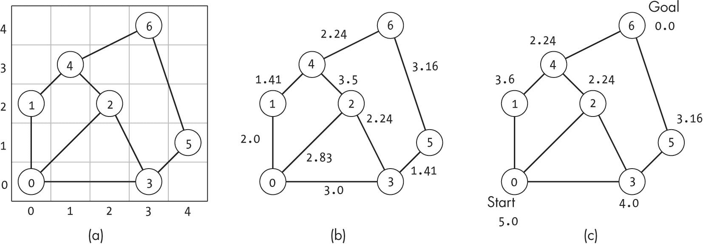
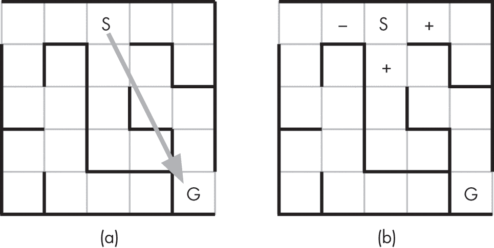
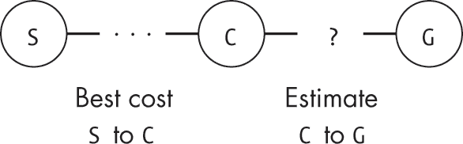
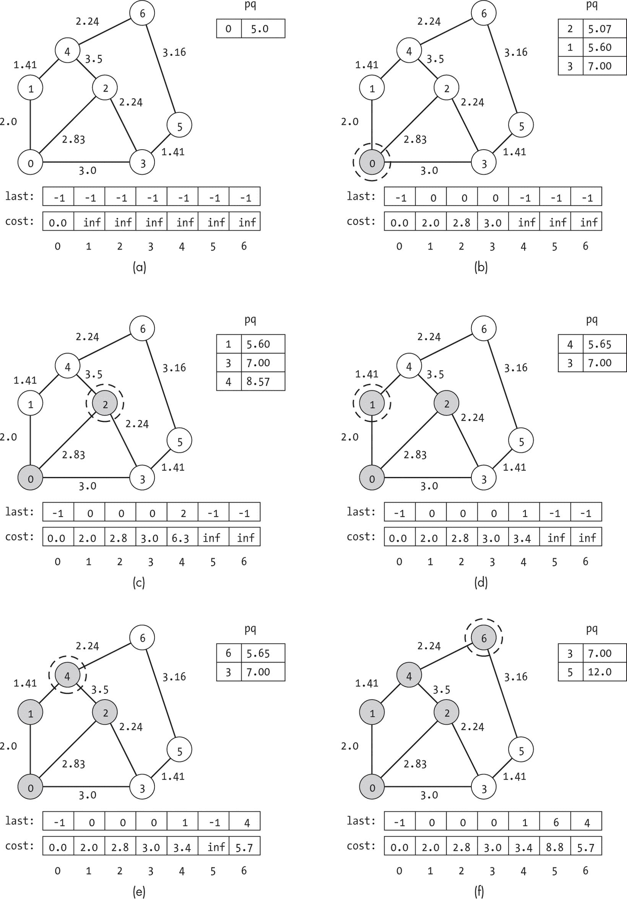
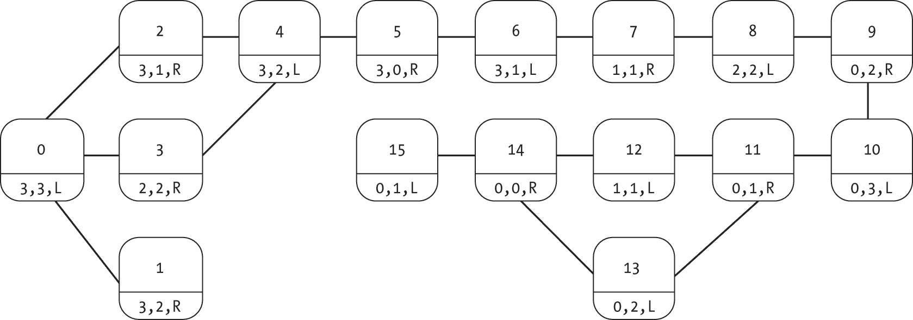
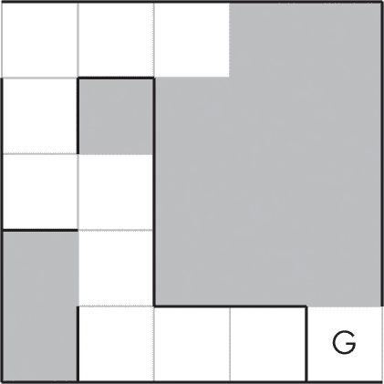
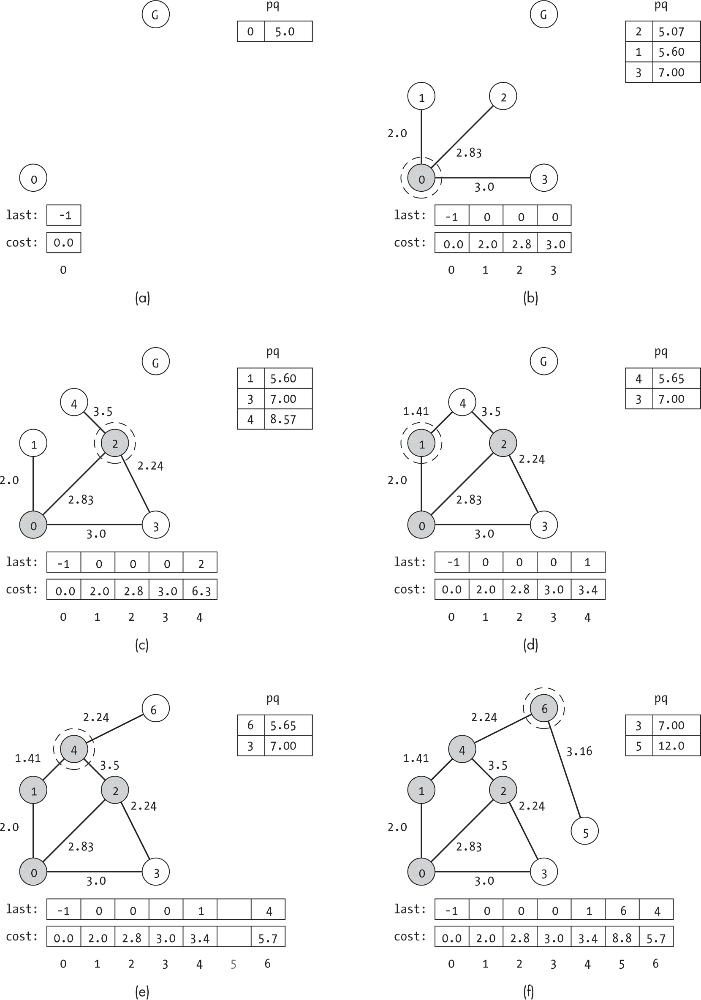

## 第八章：8 启发式引导搜索


本章介绍了*启发式引导搜索*算法，有时也称为*最佳优先搜索*。这些算法结合了节点与目标之间估算的距离信息，以确定探索节点的优先顺序。通过关注最有前景的路径，它们能够实现显著的计算节省。

正如我们在上一章中看到的，从指定的起始节点到指定目标节点找到最短（或最低成本）路径的过程，类似于我们日常导航的任务。无论是规划前往工作地点还是商店的路线，我们可能会通过所需时间、行驶距离或由于交叉路口拥堵所带来的烦恼来衡量成本。

在解释启发式方法的构成之后，本章介绍了两种典型的启发式搜索算法。*贪心最佳优先搜索*仅根据估算的到达目标的成本来优先考虑节点，而*A*搜索*（读作“A 星”）则将到达中介节点的成本与从该节点到目标的估算成本相结合。这种组合使得 A*搜索成为一种更强大的工具，能够高效地找到良好的路径。

### 选择合适的启发式方法

本章中的算法依赖于估算成本来指导搜索。为了将这种启发式信息加入到算法中，我们必须根据我们对每个节点的了解，选择一种估算成本的方法。尽管定义一个好的启发式方法在不同问题中的难度差异较大，但许多实际场景中的方法既简单又直观。在介绍欧几里得距离作为路径规划中常用的启发式方法后，我们将讨论选择启发式方法时涉及的约束和挑战。

#### 欧几里得距离

*欧几里得距离*是一个常见的、强大且直观的启发式方法，广泛应用于许多现实世界的路径规划问题中。它通过直线距离来估算到达某个节点的成本。例如，假设我们正在进行一次横跨美国的公路旅行，从波士顿到西雅图。如果出发城市位于（*x*[1]，*y*[1]）而目的地位于（*x*[2]，*y*[2]），则两者之间的欧几里得距离如下所示：

<mrow><mi>d</mi><mi>i</mi><mi>s</mi><mi>t</mi><mo>=</mo> <msqrt><mrow><mfenced><mrow><msup><mrow><mfenced><mrow><msub><mi>x</mi> <mn>1</mn></msub> <mo>−</mo> <msub><mi>x</mi> <mn>2</mn></msub></mrow></mfenced></mrow> <mn>2</mn></msup> <mo>+</mo> <msup><mrow><mfenced><mrow><msub><mi>y</mi> <mn>1</mn></msub> <mo>−</mo> <msub><mi>y</mi> <mn>2</mn></msub></mrow></mfenced></mrow> <mn>2</mn></msup></mrow></mfenced></mrow></msqrt></mrow> 

我们可以将这个方程式编码如下：

```
def euclidean_dist(x1: float, y1: float, x2: float, y2: float) -> float:
    return math.sqrt((x1 - x2)*(x1 - x2) + (y1 - y2)*(y1 - y2)) 
```

除非你像鸟一样直接飞往目的地，否则欧几里得距离充其量只能提供真实成本的下界。地图上的城市之间并非每对都有道路连接。即使是直接从一个点到另一个点的高速公路，也不太可能沿直线行驶，因为它们必须绕过地理特征，如山脉和湖泊，从而延长你的旅程。

尽管欧几里得距离具有乐观的特性，但它仍然能提供重要的启发式信息。例如，这些估算可以帮助我们在规划公路旅行时选择合适的途经点。在从波士顿到西雅图的旅途中，克利夫兰显然比迈阿密更适合作为休息站，因为迈阿密离西雅图和克利夫兰的距离都比我们的起点更远。

图 8-1(a)展示了一个二维平面上的示例图。图 8-1(b)展示了对应的边权重，这些权重大致对应于节点之间的直线距离。然而，两节点之间的成本也可能*大于*欧几里得距离。节点 2 和节点 4 之间的边的权重是 3.5，这可能表示额外的成本，例如需要穿越陡峭的山丘或使用土路。节点之间的穿越成本（即边的权重）必须大于或等于估算距离。



图 8-1：二维平面上节点之间的权重和欧几里得距离

基于这种安排，我们可以通过计算从每个节点到目标的欧几里得距离，来提供从每个节点到目标的潜在成本的下界估算，如图 8-1(c)所示，对于目标节点 6 而言。从节点 0 到节点 6 的估算成本为 5.0，反映了它们的欧几里得距离。如前所述，这些估算并不总是能够捕捉到全部成本。例如，从节点 0 到节点 6 的估算距离过于乐观，因为该节点没有直接到达节点 6 的路径。

#### 可接受的启发式方法

我们定义启发式方法为*可接受*，如果从起始节点到目标节点的估算成本始终小于或等于真实成本，或者换句话说，如果启发式方法不会高估真实成本。例如，欧几里得距离就是一个常见的、有效的且可接受的启发式方法，适用于现实世界的路径规划，因为到目标的直线距离提供了一个乐观的估算，表示到达目标的成本。可接受性要求对于某些搜索（如 A*搜索）的正确运行至关重要，并且在选择用于特定目的的启发式方法时将是我们主要的约束之一。

#### 启发式设计挑战

虽然定义估算距离的启发式方法相对简单，但让我们考虑一个更复杂的情况。假设你希望通过你的职业网络请求介绍认识一个新联系人。每个人（节点）只能通过联系他们现在或曾经的同事来传递这个请求。为了促进你的介绍，你必须找到一条加权边的序列，这些边间接地将你与最终想要见到的人连接起来，每条边的权重代表传递请求的成本。与一个每天都和你交谈的朋友联系，成本会很低，而与一个让你讨厌的前同事联系，且你再也不想和他交谈的成本则会非常高。

不幸的是，使用单一的可接受启发式方法很难捕捉所有这些因素。你或许能从每个人的工作历史中获得一些对目标的距离估算。与目标节点来自不同产业的人的沟通成本通常会更高；例如，职业棒球运动员和计算机科学家之间的职业互动比两个棒球运动员之间的职业互动要少得多。同样，如果这两个人在同一家公司工作，估算的成本会更低。然而，将这些正面和负面指标拼凑在一起很难形成一个好的定量估算，因为这些指标过于嘈杂。事实上，两个曾经一起工作过的人，如果他们从未见过面或者是死敌，那么这个信息对你并没有帮助。

更糟糕的是，确保这些问题的启发式方法是可接受的要困难得多。如果你对不同行业之间的成本设置了很高的权重，你偶尔会高估在它们之间传递信息的成本——也许你认识一位程序员，他仍然与曾是童年最好朋友的电影明星保持定期联系。同样，这个度量也无法捕捉到那些在不同公司工作但经常沟通的家庭成员。

选择一个好的启发式方法需要在保持可接受性和最小化计算成本的同时最大化信息量。通过为每个节点分配负无穷大的代价来设计一个可接受的启发式方法是微不足道的，但显然这种策略对于引导搜索没有任何帮助。同样，我们可以通过使用上一章中的算法设计一个完美的信息丰富且可接受的启发式方法：我们只需解决所有节点对之间的最短路径问题，并根据每个节点与目标之间的真实最低成本路径来计算启发式方法。然而，这也没有任何帮助，因为搜索的计算成本过高。启发式方法的关键在于减少搜索本身的计算成本。在考虑新问题和启发式方法时，始终需要权衡信息量、计算成本和可接受性之间的关系。

以下章节介绍了两种经典的启发式搜索算法，从最简单的方法开始：贪心最佳优先搜索。

### 贪心最佳优先搜索

*贪心最佳优先搜索*总是在搜索中的某一点选择看起来最好的选项，基于最优启发式值探索估算成本最低的下一个未访问节点。该算法维持一个最小优先队列，用于测试节点。当它向目标推进时，每一步都从优先队列中选择最低成本的节点，并接着探索该节点。每当算法看到新的邻居节点时，它会将其添加到队列中，并赋予与其启发式值相等的优先级。该算法逐节点推进，直到找到通往目标的路径。

我们可以将贪心最佳优先搜索看作是广度优先搜索的一个变种。广度优先搜索优先考虑按照访问顺序排列的节点，使用队列访问最早看到的节点，而最佳优先搜索则通过启发式方法对节点进行排序。

贪心最佳优先搜索采用了我们可能会期望的方式，就像一只聪明但急切的松鼠在迷宫中穿行，正如图 8-2 所示。松鼠（S）能闻到他目标目的地（G）那堆美味的橡果。通过嗅觉，松鼠可以推测出他如果没有墙壁的阻挡，可以直接走向橡果的直线路径（图 8-2(a)）。



图 8-2：带有启发式目标方向估算的迷宫

在任何给定的位置（节点），松鼠还可以确定它可以移动到的相邻位置，并估计哪一个能将它带得离目标更近。松鼠使用基于气味的启发式方法——气味更强的橡果节点更接近目标。图 8-2(b)显示，两个相邻的方格将使松鼠更接近橡果（+），而一个则使它远离橡果（–）。松鼠始终选择气味最强的路径，沿着气味朝食物前进，有时会回溯到气味比当前地点更强的点。在此过程中，它会在脑海中记下其他路径，并将它们加入到待尝试的选项列表中。

虽然贪婪的最佳优先搜索如果使用了好的启发式方法，可能会快速找到通向目标的路径，但最终路径并不保证是最优的。我们可能会走一条看起来不错的路径，因为在早期节点时的乐观估计，而跳过了一条更好的路径，尽管它的估计更为现实。松鼠可能会走一条较长的路径，暂时偏离食物的方向，仅仅因为那个方向的气味更强。我们将在本节后面看到这个场景的示例。

#### 代码

要实现贪婪搜索算法，我们需要提供比之前搜索中包含的更多的信息：节点的启发式值。有多种方法可以提供这些信息。为了清晰地说明，我们将从传递一个预先计算好的列表h开始，该列表将节点的索引与它们的启发式值对应起来，稍后在本章中我们将介绍一种替代方法。

贪婪的最佳优先搜索的代码类似于广度优先搜索的代码。我们不是使用队列按照节点被访问的顺序来存储节点，而是使用一个自定义的*基于最小堆的优先级队列*（在附录 B 中描述）来按估计成本递减的顺序获取节点：

```
def greedy_search(g: Graph, h: list, start: int, goal: int) -> list: 
    visited: list = [False] * g.num_nodes
    last: list = [-1] * g.num_nodes
    pq: PriorityQueue = PriorityQueue(min_heap=True) ❶ pq.enqueue(start, h[start])
  ❷ while not pq.is_empty() and not visited[goal]:
        ind: int = pq.dequeue()
        current: Node = g.nodes[ind]
        visited[ind] = True

        for edge in current.get_edge_list():
            neighbor: int = edge.to_node
          ❸ if not visited[neighbor] and not pq.in_queue(neighbor):
                pq.enqueue(neighbor, h[neighbor])
                last[neighbor] = ind

    return last 
```

代码首先设置内部数据结构，包括一个列表，用于指示我们是否已经访问过每个节点（visited），一个列表，将每个节点映射到它在搜索路径中前面的节点（last），以及一个最小优先级队列（pq）。然后，它将起始节点插入到优先级队列中，并以它的启发式成本作为优先级 ❶。在松鼠迷宫的类比中，这标志着松鼠搜索开始之前的那个点。它站在迷宫外，闻到橡果的气味，并且在它的心理优先级队列中有一个可用的选项：起始节点。

贪心最佳优先搜索的探索过程是在一个while循环中进行的，直到代码耗尽优先队列或访问到目标节点❷为止。在每次迭代中，代码会检索优先队列中的下一个节点——具有最佳启发式值的节点——并访问该节点。你可以将其想象成松鼠奔向下一个最佳选择的位置。

代码使用一个for循环遍历当前节点的每个邻居。如果某个邻居没有被访问过且不在优先队列中，那么它之前没有被看到❸。因此，代码会将其加入优先队列（以估算的距离作为优先级），并将当前节点标记为该邻居的前一步。

当while循环完成时，贪心搜索要么找到了通往目标节点的路径，要么发现没有这样的路径。在前一种情况下，与我们之前看到的其他算法不同，优先队列中可能仍然有未探索的节点。在后一种情况下，优先队列将为空；没有更多的节点可供探索。目标节点在last中的条目将为-1，表示没有任何路径返回到起始节点。代码最终通过返回last列表来结束。

#### 一个例子

图 8-3 展示了一个在图 8-1 中的图上进行的贪心最佳优先搜索示例。在每个子图中，当前正在探索的节点被虚线圆圈包围，而已访问的节点则被阴影标记。每条边的权重显示在每条边旁边。

![每个子图展示了图 8-1 中的七节点图，并附带排序后的优先队列和最后数组。(B)显示了节点 0 被标记和圈出。最后的数组为[–1, 0, 0, 0, –1, –1, –1]，优先队列中包含节点 2、1 和 3，它们的优先级分别为 2.24、3.60 和 4.0。](../images/f08003.jpg)

图 8-3：贪心最佳优先搜索的步骤

为避免图示过于拥挤，图 8-3 中没有直接显示每个节点的启发式值。然而，这些启发式值与图 8-1(c)中显示的欧几里得距离相同。我们将它们作为列表h提供给算法：

```
h: list = [5.0, 3.6, 2.24, 4.0, 2.24, 3.16, 0.0] 
```

每个子图还展示了当前的优先队列（为清晰起见以排序顺序显示）和last列表。虽然代码保持优先队列的堆排序，但我们以排序顺序展示优先队列，以便更清楚地看到相对顺序。

搜索从将起始节点放入优先队列并赋予其对应的成本估算值 5.0 开始，如图 8-3(a)所示。在< s amp class="SANS_TheSansMonoCd_W5Regular_11">while 循环的第一次迭代中，它从优先队列中移除节点 0，访问该节点，并将每个之前未见过的邻居添加到优先队列，如图 8-3(b)所示。节点的优先级等于其启发式成本（即到目标节点的欧几里得距离），如图 8-1(c)所示：节点 1 = 3.6，节点 2 = 2.24，节点 3 = 4.0。搜索为这些邻居设置了< s amp class="SANS_TheSansMonoCd_W5Regular_11">last 值为 0，以指示前往它们的路径来自节点 0。

在搜索的每一步，算法都会选择看起来最有前途的节点，朝着目标前进。检查优先队列后，它继续处理节点 2。如图 8-3(c)所示，它随后将节点 2 的未访问邻居添加到优先队列中。节点 4 现在以优先级 2.24 排在队列的最前面。搜索通过节点 4 进展，最终到达目标节点，如图 8-3(d)和图 8-3(e)所示。

从这个例子中可以看出，贪婪最佳优先搜索并未产生通向目标的最优路径。搜索被节点 2 的目标邻近性吸引，但最终被迫绕过节点 4，经过一个代价为 3.5 的高权重边。贪婪最佳优先搜索无法判断通过节点 1 会是更好的选择，因为它没有考虑到通向节点的路径成本。它仅仅看待从某个节点到目标的估算成本，并将其作为优先级的依据。等到搜索访问完节点 2 时，它已经看到节点 4 的启发式值比节点 1 更优。

我们可以通过一个令人沮丧的骑行旅行来形象化这种次优性。假设在一个上午的骑行中，你们没有目的地，也没有注意到路径，最终你和你的朋友都感到筋疲力尽，想要找到回家的路。你们停在一个岔路口，开始考虑各自的选择。你知道左侧的路尽头是一个与你家相邻的交叉口，但为了到达那里，必须翻越一座小山。右侧的路是平坦的，但终点是离你家几条街的交叉口。两条路都能让你们更接近家，但代价（边的权重）却有天壤之别。不幸的是，贪婪算法并未考虑这一点。在你开口之前，你那过于急切的朋友欢呼一声，便骑上了左侧的路。当你试图抗议时，他们只是喊道：“一点小山坡有什么关系？这条路让我们更接近家。”  ### A* 搜索

A* 搜索将贪心最佳优先搜索的启发式估算与对已观察到的边缘成本的更全面的考虑相结合，提供了一种高效的机制，用于找到两个节点之间的最短路径。而贪心最佳优先搜索完全忽略边缘成本，A* 则平衡了启发式估算的潜力与我们对每个节点的最佳路径所了解的冷硬事实。这种结合产生了一个准确且计算高效的算法。

A* 算法背后的关键直觉是，我们希望按估算的总成本对潜在的路径节点进行排序。仅仅关注从当前节点到目标的成本是不够的；我们还必须问，首先到达该节点的成本有多高。为了回答这个问题，A* 跟踪一个额外的信息：到每个节点的最佳路径所需的成本。如图 8-4 所示，用于未访问节点的优先级是到该节点的最佳路径成本加上从该节点到目标的估算成本之和。



图 8-4：节点的真实成本与目标的估算成本的结合

与急躁的松鼠展示的贪心最佳优先搜索相比，我们可以将 A* 搜索可视化为一个更为细致的探险者，他拥有高级制图学学位，正在寻找通往提议的考古挖掘现场的路径。除了标准的指南针、水壶和必备的探险帽，我们的主角还携带着一个文件夹来追踪有关该地区的信息。他们将每个节点表示为一行，包含三列信息：到该节点的最佳成本（标题为 Best Cost）、到该节点的最佳路径（Best Path）以及通过该节点到达目标的估算总成本（Heuristic）。在整个旅程中，探险者不断更新这三列信息。

探险者从一个村庄到另一个村庄（从一个节点到另一个节点）旅行。GPS 坐标提供了最短可能距离的估算。路标、路径标记和面对面的访谈揭示了到邻近节点的实际距离。每当探险者发现一个新节点时，他们会计算到目标的估算成本，并将其记录在启发式（Heuristic）列中。

随着旅程的继续，探险者总是朝着估算总成本最低的下一个位置（节点）移动。每次他们考虑一个邻近位置，无论是新位置还是以前见过的，他们都会问自己是否发现了比之前更好的路径到达该节点。如果是，他们会在最佳成本和最佳路径栏目中记录这一发现。也许在旅程的早期，他们发现了一条穿越密林、蜘蛛横行的 10 英里小道通向考古遗址。他们的笔记详细记录了这条路径和它的巨大成本。然而，他们后来发现了一条新的、三英里长的铺设公路，通过东边的一个小村庄通往同一地点。他们急切地擦掉旧的记录，并更新最佳成本和最佳路径栏目，以反映这一新发现。

#### 代码

清单 8-1 中的 A*搜索代码根据通过该节点并通向目标的估算总成本对潜在节点进行排序。它再次使用了一个预先计算的列表 h，该列表包含每个节点的启发式值。

```
def astar_search(g: Graph, h: list, start: int, goal: int) -> list: 
    visited: list = [False] * g.num_nodes
    last: list = [-1] * g.num_nodes
    cost: list = [math.inf] * g.num_nodes
    pq: PriorityQueue = PriorityQueue(min_heap=True)

  ❶ pq.enqueue(start, h[start])
    cost[start] = 0.0
  ❷ while not pq.is_empty() and not visited[goal]:
        ind: int = pq.dequeue()
        current: Node = g.nodes[ind]
        visited[ind] = True

        for edge in current.get_edge_list():
            neighbor: int = edge.to_node
          ❸ if cost[neighbor] > cost[ind] + edge.weight:
                cost[neighbor] = cost[ind] + edge.weight
                last[neighbor] = ind

              ❹ est_value: float = cost[neighbor] + h[neighbor]
                if pq.in_queue(neighbor):
                    pq.update_priority(neighbor, est_value)
                else:
                    pq.enqueue(neighbor, est_value)
    return last 
```

清单 8-1: A* 搜索的代码

这段代码首先设置内部数据结构，包括一个列表，表示是否访问过每个节点（visited），一个列表，将每个节点映射到其在搜索路径上前面的节点（last），一个列表，存储从起始节点到每个后续节点的最佳路径成本（cost），以及一个最小优先队列（pq）。它将起始节点插入到优先队列中，以其估算成本作为优先级，并将起始节点的成本设置为 0，以反映搜索已到达该节点 ❶。

搜索现在准备开始了。一个 while 循环将继续探索节点，直到代码耗尽优先队列或访问到目标节点 ❷。在每次迭代中，代码从优先队列中取出下一个节点——到达目标的估算总成本最低的节点——并访问它。

该算法使用一个 for 循环遍历当前节点的每个邻居。它检查当前节点是否提供了到邻居的更优路径，通过将到当前节点的最佳路径与到邻居的边权重相加来计算完整的成本 ❸。如果代码找到到某个节点的更优路径，它会更新 cost 和 last 列表。然后，它使用新的到 neighbor 的成本以及从 neighbor 到目标的估计成本，更新邻居节点的估计总成本 ❹。如果邻居已经在优先队列中，代码会使用 update_priority() 函数更新它的优先级，以考虑新的估计总成本。否则，它会将节点添加到优先队列中。

与贪心最佳优先搜索一样，当 A* 搜索完成时，要么找到了到目标节点的路径，要么得出结论没有这样的路径——也就是说，如果搜索在访问目标节点之前已经耗尽了优先队列。代码通过返回 last 列表来完成。

#### 一个例子

图 8-5 显示了一个 A* 搜索示例。与我们在贪心最佳优先搜索示例中一样，我们显示了边权重，并再次使用来自 图 8-1(c) 的启发式方法：

```
h: list = [5.0, 3.6, 2.24, 4.0, 2.24, 3.16, 0.0] 
```

每个子图还显示了 last 数组、cost 数组和优先队列。当前正在探索的节点用虚线圆圈标出，已访问的节点被阴影标记。为了清晰起见，优先队列按排序顺序显示。

图 8-5(a) 显示了搜索的初始状态，在访问第一个节点之前。优先队列最初只包含起始节点。由于从起始节点到其自身的距离为 0.0，因此起始节点的估计总成本只是到目标的估计距离。cost 数组反映了到达每个节点的已知成本：起始节点为 0.0，其它节点为无限大，因为搜索尚未观察到通往这些节点的路径。

图 8-5(a)代表了我们假设的探险者在开始探险前的状态。他们被雇佣来寻找从一个城市（节点 0）到一个提议的考古挖掘地点（节点 6）的最短路径。在到达起始城市之前，他们仅根据考古挖掘地点的地理坐标，对距离目标地的距离有一个粗略（且乐观的）估计。探险者检查他们的列表，戴上头盔，说：“我知道挖掘地点距离城市至少五英里，是时候开始了。”



图 8-5：A*算法在一个示例图上的步骤

在图 8-5(b)中，搜索从优先队列中出队最上面的节点并探索它。这相当于我们勇敢的探险者到达起始城市并四处观察。搜索发现三个邻近的节点，并计算它们的预期总成本，作为到当前节点的距离、到邻居的边权和从邻居到目标的估计成本的总和，得到以下总估算成本：

节点 1：0.0 + 2.0 + 3.6 = 5.6

节点 2：0.0 + 2.83 + 2.24 = 5.07

节点 3：0.0 + 3.0 + 4.0 = 7.0

这相当于探险者在找到三条通往起始城市的道路后更新他们的列表。从一个有用的路标上，他们知道村庄的距离和位置。每条道路提供了一个潜在的路径，并且每条路径的预估成本不同。

由于节点 2 的估计总成本最优，搜索接下来会探索它，如图 8-5(c)所示。从这里，搜索会考虑两个邻居节点 3 和 4。节点 3 从起始节点的成本已经较低（3.0 对比 2.83 + 2.24 = 5.07），所以搜索不会更新它的路径或优先级。搜索从未见过节点 4，因此提供了初始成本值 2.83 + 3.5 = 6.33，以及总成本估计 2.83 + 3.5 + 2.24 = 8.57。这个成本反映了从节点 2 到节点 4 路径的极高成本。

从探险者的视角来看，这些决策看起来很相似。他们看到一个路标，指示着两个新村庄。村庄 3 距离约 2.24 英里。与从城市 0 到村庄 3 的直线路径相比，绕过村庄 2 到村庄 3 的绕行路线要长得多。他们立刻意识到没有必要增加一个不必要的停靠点，因此决定不更新村庄 3 的行。相比之下，虽然从村庄 2 到村庄 4 的路径异常困难，但它有可能让他们更接近目标，因此他们更新了村庄 4 的行。

搜索继续进行，通过选择优先值最低的未访问节点来进行。与贪心搜索不同，A* 搜索不会直接跳到估计离目标最近的节点，这里是节点 4。虽然这个节点的估计成本（2.24）是最接近目标的，但使用当前路径到达它的成本较高（通过节点 2 为 6.3）。相反，搜索探索了节点 1，如图 8-5(d)所示，并找到了通往节点 4 的更好路径，更新了估计的总成本为 2.0 + 1.41 + 2.24 = 5.65。同时，更新了 last 数组，表明通往节点 4 的路径是通过节点 1 而不是节点 2。

这一步反映了探险者思考路线总成本的过程。雇佣探险者的考古学家希望找到一条低成本的路线，反复到达现场。知道这一点后，探险者首先尝试从村庄 2 到村庄 4 穿越山脉之前先探索村庄 1。

搜索继续在图 8-5(e)中前进到节点 4，然后在图 8-5(f)中到达节点 6。在每个停顿点，搜索会考虑未访问的邻居，并检查是否发现了更好的路径。它在到达节点 6 后停止，因为它知道自己已经找到了通向目标的最佳路径，即使没有访问节点 3 和 5。#### 为何 A* 能找到最优路径

怀疑的读者可能会问，我们如何确保 A* 搜索找到了最佳路径，因为它只探索了图的一部分，而没有访问每个节点。然而，只要其启发式是可接受的，A* 就一定能找到最优路径。为了理解原因，让我们分析一下 A* 搜索通过某条路径到达目标节点后的状态，并考虑通过一个未访问的节点 *v* 到达目标节点的替代路径。由于我们使用的是可接受的启发式和优先队列排序，任何通过节点 *v* 的路径必定比我们已经找到的路径更长。

由于搜索在到达目标节点之前没有访问节点 *v*，因此节点 *v* 的优先值（估计总成本）一定大于目标节点的优先值。当搜索访问到目标节点时，目标节点的优先值等于已找到路径的实际成本。目标的估计成本总是为 0，因为它本身就是目标节点，因此目标的优先值等于前一个节点的成本加上相应的边权重。我们不再依赖启发式方法，而是得到了实际的路径成本。

相比之下，未访问节点 *v* 的优先值是使用可接受启发式方法后的真实距离的下界。它永远不可能小于真实距离。我们的启发式方法是乐观的。任何通过节点 *v* 到达目标的路径，其成本至少与节点 *v* 的优先值相等，而这个优先值大于目标节点的优先值。因此，任何通过节点 *v* 到达目标的路径，其成本必定比已经找到的路径要高。

### 应用 A* 于难题

只要我们能生成一个有用且可接受的启发式，我们就可以应用基于启发式的搜索，来高效地为第六章中的难题图（例如囚徒与看守难题）找到解决方案。作为提醒，图 8-6 展示了该难题的状态图（最初在图 6-8 中介绍）。



图 8-6：囚徒与看守过河难题的状态图

我们可以利用关于船只物理特性的两个基本事实来推导一个可接受的度量，表示到达目标状态的距离：

+   这艘船最多可以载两个人。如果左岸有*k*人，我们至少需要 *ceil*(*k* / 2) 次旅行才能将他们全部带到右岸。

+   如果船在右岸，它必须先返回左岸才能接载更多的人。

使用这些条件，我们可以定义一个函数，从存储在每个节点中的 PGState 生成启发式值：

```
def pg_generate_heuristic(g: Graph) -> list: 
    heuristic = [0.0] * g.num_nodes
    for node in g.nodes:
        state: PGState = node.label
      ❶ num_left: int = state.guards_left + state.prisoners_left
      ❷ min_trips_l_to_r: int = math.ceil(num_left / 2.0)
      ❸ min_trips_r_to_l: int = max(0, min_trips_l_to_r - 1)
        if not state.boat_side == "L" and min_trips_l_to_r > 0:
            min_trips_r_to_l += 1
        heuristic[node.index] = min_trips_l_to_r + min_trips_r_to_l

    return heuristic 
```

代码使用 for 循环遍历图的每个节点，检查每个节点的难题状态以确定左岸的人数❶。然后，它通过考虑还需要移动的人数，并注意每次最多可以带两个人，计算船从左岸到右岸所需的最少次数❷。它还通过注意到虽然右岸有更多的乘客需要运输，但船必须返回左岸接他们，计算船从右岸到左岸所需的最少次数❸。启发式值是这两组旅行次数的总和。

表 8-1 将该启发式函数在每个状态下的值与通过计算从每个状态到目标的步骤得到的真实距离进行比较，如图 8-6 所示。正如你所看到的，启发式是可接受的，并且从不高估真实距离。

表 8-1： 来自 pg_generate_heuristic() 函数的值与目标节点的真实距离

| 状态 | 33L | 32R | 31R | 22R | 32L | 30R | 31L | 11R | 22L | 02R | 03L | 01R | 11L | 02L | 00R | 01L |
| --- | --- | --- | --- | --- | --- | --- | --- | --- | --- | --- | --- | --- | --- | --- | --- | --- |
| 启发式距离 | 5 | 6 | 4 | 4 | 5 | 4 | 3 | 2 | 3 | 2 | 3 | 2 | 1 | 1 | 0 | 1 |
| 真实距离 | 11 | 12 | 10 | 10 | 9 | 8 | 7 | 6 | 5 | 4 | 3 | 2 | 1 | 1 | 0 | 1 |

给定这个启发式函数，我们可以在过河难题上运行 A*搜索：

```
g: Graph = create_prisoners_and_guards()
h: list = pg_generate_heuristic(g)
last: list = astar_search(g, h, 0, 14) 
```

囚犯与守卫问题提供了一个示范性例子，展示了如何将 A*搜索应用于难题，因为我们可以枚举状态并将启发式值与真实的最佳路径进行比较。然而，图的结构是一个没有分支的单一长状态序列，这意味着在这个难题上，A*搜索并没有显著优于广度优先搜索。相比之下，A*搜索在状态空间更大的难题上可能会带来显著的优势，因为 A*搜索的优势在于它能够集中精力探索朝向目标的有前景路径。

### 搜索未知图

本章迄今为止介绍的算法将图和启发式值都视为已知项传递给搜索，但这些方法同样适用于算法需要动态构建一个未知图的问题。请参考第六章中的拼图构建示例。在那里，我们使用广度优先搜索来字面地探索状态空间，在遇到新节点和边时构建图。我们可以在启发式引导搜索中做同样的事情。

我们可以不直接传递一个启发式值的列表给每个节点，而是传递一个函数，这个函数根据节点中的信息动态评估启发式。例如，如果一个节点有辅助数据 *x* 和 *y*，表示其空间位置，我们可以定义启发式函数为该节点到已知目标位置的欧几里得距离。对于一个现实世界的探险者来说，这可能类似于他们使用 GPS 来估算穿越丛林时距离目标的距离。

我们可以通过使用视频游戏中的“遮罩”机制来可视化这个动态构建和评估的过程。例如，图 8-7 展示了一个 5×5 迷宫的网格。像图底部的长死胡同这样的已探索区域显示为方块，而未探索区域则显示为灰色。灰色区域中可能有任何东西：通向目标的直接路径、无数的死胡同，或是一个巨大的怪物。我们在探索之前无法得知。



图 8-7：一个迷宫，未见区域被灰色显示

在这一节中，我们修改了清单 8-1 中的代码，通过在发现新节点时动态构建图来进行探索。辅助数据结构如last和 distance 也必须动态扩展，以便考虑到新状态。

#### 代码

对于我们的示例代码，我们通过使用World类来对算法进行泛化。这个类提供了关于谜题的基本信息，包括以下内容：

+   起始状态的索引

+   给定状态的邻居

+   任意两个邻近状态之间的转换成本

+   一个状态的启发式值

+   当前状态是否为目标

通过这个接口，我们无需事先了解任何状态空间的信息。就像现实中的探险者咨询 GPS 和路标一样，我们在整个算法中使用World接口来检查世界的局部状态。

请注意，World类不需要枚举状态空间。它也不需要构建和存储完整的图。我们可以使用像第六章中的函数，动态地根据状态信息确定一个状态的邻居。动态评估使我们能够在没有巨大内存开销的情况下探索庞大的状态空间。

我们可以为本章的基于距离的示例搜索定义一个简单的World类，代码如下：

```
class World:
    def __init__(self, g: Graph, start_ind: int, goal_ind: int):
        self.g = g
        self.start_ind = start_ind
        self.goal_ind = goal_ind

    def get_num_states(self) -> int:
        return self.g.num_nodes def is_goal(self, state: int) -> bool:
        return state == self.goal_ind

    def get_start_index(self) -> int:
        return self.start_ind

    def get_neighbors(self, state: int) -> set:
        return self.g.nodes[state].get_neighbors()

    def get_cost(self, from_state: int, to_state: int) -> float:
        if not self.g.is_edge(from_state, to_state):
            return math.inf
        return self.g.get_edge(from_state, to_state).weight

    def get_heuristic(self, state: int):
      ❶ pos1 = self.g.nodes[state].label
        pos2 = self.g.nodes[self.goal_ind].label
      ❷ return math.sqrt((pos1[0]-pos2[0])**2 + (pos1[1]-pos2[1])**2) 
```

World 类存储底层图（g）、起始索引（start_ind）和目标索引（goal_ind）。在这个例子中，它们都是由用户提供的。然后，类通过基本的获取函数提供所需的信息。例如，get_start_index() 返回起始状态的索引，而 get_neighbors() 列出邻近的状态。get_cost() 函数使用两个节点之间的实际边权重，如果没有这样的边，则返回无穷大。

get_heuristic() 函数假设节点的坐标存储在其标签中，以 (*x*, *y*) 元组或列表的形式 ❶，并使用到目标的欧几里得距离作为启发式 ❷（这要求代码包含 import math）。在创建图时，我们还需要将节点的标签设置为包含这些坐标。

使用 World 类，我们创建了一个修改版的 A* 搜索，该版本动态地分配和填充数据结构。为了简化，我们使用字典将每个状态的索引（或字符串）直接映射到相应的信息，如 清单 8-2 所示。

```
def astar_dynamic(w: World): 
    visited: dict = {}
    last: dict = {}
    cost: dict = {}
    pq: PriorityQueue = PriorityQueue(min_heap=True)
    visited_goal: bool = False

  ❶ start: int = w.get_start_index()
    visited[start] = False
    last[start] = -1
    pq.enqueue(start, w.get_heuristic(start))
    cost[start] = 0.0

    while not pq.is_empty() and not visited_goal:
        index: int = pq.dequeue() visited[index] = True
        visited_goal = w.is_goal(index)

      ❷ for other in w.get_neighbors(index):
            c: float = w.get_cost(index, other)
            h: float = w.get_heuristic(other)

          ❸ if other not in visited:
                visited[other] = False
                cost[other] = cost[index] + c
                last[other] = index
                pq.enqueue(other, cost[other] + h)
          ❹ elif cost[other] > cost[index] + c:
                cost[other] = cost[index] + c
                last[other] = index
                pq.update_priority(other, cost[other] + h)

    return last 
```

清单 8-2：一个针对未知图的 A* 搜索

清单 8-2 中的代码定义了一个修改版的 astar_search() 函数（见 清单 8-1），即 astar_dynamic()。这个函数创建空的辅助数据结构并将起始状态插入到每个数据结构中 ❶。字典的使用意味着我们不需要了解总状态的数量或它们的底层索引。在这一点上，数据结构仅包含那个单一状态的信息，因为代码尚未探索其他任何状态。它通过 get_start_index() 函数获取起始状态的索引，并通过 get_heuristic() 函数获取其估计成本（优先级）。

列表 8-2 算法使用一个while循环来探索优先队列中的状态，直到没有更多状态可以探索或找到了目标。在每次迭代中，算法会出队最有前景的状态（index），将其标记为已访问，并使用is_goal()函数检查它是否为目标。在现实世界中，这可能类似于进入一个新城市并寻找熟悉的地标。

对于每个探索的状态，代码使用get_neighbors()函数检查所有邻居，以返回该状态的局部邻域❷。然后，代码计算从当前节点到该邻居的代价（c），使用get_cost()函数返回边的权重。类似地，它通过get_heuristic()函数动态计算该邻居的启发式值（h）。

一旦获取到邻居的距离和该邻居的启发式值，代码会检查是否之前遇到过该邻居状态。它通过测试是否在visited字典中有任何值的条目来检查该状态是否出现过❸。如果邻居状态不在字典中，说明它之前从未出现过，将其添加到每个数据结构中。邻居状态的代价是到达当前状态的代价（cost[index]）加上下一状态转换的代价（c）。邻居状态的优先级是到达该状态的最佳代价（cost[other]）加上该状态的启发式估算值（h）。

如果邻居状态之前已经出现过❹，代码会通过比较邻居的代价（cost[other]）与新路径的代价（cost[index] + c）来检查新路径是否更优。如果代码发现了更好的路径，它会更新到达该状态的路径（last）、到达该状态的代价（cost）以及该状态的优先级。再次强调，代码会直接更新队列中的优先级。

#### 一个例子

让我们将astar_dynamic()函数应用到图 8-1 中的图形。自然，算法并不知道图形的具体信息，也不知道图中有多少个节点。所有代码能够看到的，仅仅是由World类提供的内容。

我们可以通过在标签中加入节点的空间位置来扩展我们在图 8-3 和图 8-5 中的贪心算法和 A*示例，如以下代码所示：

```
g.nodes[1].label = [0, 2] 
```

虽然这种手动分配方法在设置这个示范例子的过程中是有效的，但对于大量数据点而言，它会导致一个冗长且繁琐的过程。在附录 A 中，我们讨论了程序化方法来读取图形数据。

图 8-8 展示了搜索过程。在图 8-8(a)中，算法知道初始状态的索引为 0，并且知道目标状态的存在。然而，它对图形的其他部分一无所知，包括节点 0 的边。目标节点甚至还没有编号，因为搜索还没有遇到它。

当搜索访问节点 0 时，如图 8-8(b)所示，它发现了三条通向三个邻居的边。每条边的权重由World类的get_cost()函数提供，启发式值则由该类的get_heuristic()函数提供。虽然这些信息并不多，但足以让我们构建出关于起始状态周围环境的图像。搜索算法通过在其辅助数据结构（visited、last、cost和pq）中新增对应节点的条目来处理这些信息。它并没有显式地创建图形或存储边。

该搜索遵循与图 8-5 中的 A*搜索示例相同的步骤。不同之处在于，图 8-8 中搜索算法在每一步时对图形的了解不同。它仅能在访问节点时保证已经看到该节点的所有边。例如，尽管算法在几次迭代中已经知道节点 1 和节点 4，但直到图 8-8(d)中，访问节点 1 后，才知道它们之间的边。



图 8-8：在未知图形上进行 A*搜索算法的步骤

与之前的 A* 搜索示例一样，代码继续执行，直到访问到目标节点。此时，World 类的 is_goal() 函数返回 True，我们知道已经找到了最短路径。然而，如 图 8-8(f) 所示，这并不意味着搜索已经遍历了整个图。它不仅跳过了访问节点 3 和 5，而且也没有了解它们之间的边缘。那些节点之外可能还有一个分支的整个世界。

### 为什么这很重要

贪心最佳优先搜索和 A* 搜索提供了将启发式估计纳入搜索算法的机制，帮助我们找到两个节点之间的最佳路径。贪心最佳优先搜索简单，所需跟踪的信息很少，但可能产生非最优路径。通过结合一个可接受的（乐观的）启发式方法和对目前成本的良好记录，A* 搜索能够高效地选择要探索的节点，同时保证找到最低成本路径。

这些算法的主要优点，特别是 A* 算法， lies in the use of heuristic information to focus the search. 就像 GPS 坐标可以帮助我们确定两条可能的道路中哪一条更快到达目的地一样，启发式方法允许我们优先考虑接下来探索的节点。因此，A* 搜索是一种实用的算法，已成为人工智能和视频游戏路径规划的核心算法之一。

在本书的下一部分，我们将不再讨论搜索算法，而是研究与图的连通性相关的任务。我们回顾如何在有向图中对节点进行排序，考虑如何测试图的连通性，并研究图上的随机行为。许多这些算法将搜索作为核心组件。
