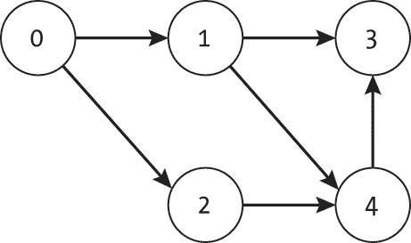
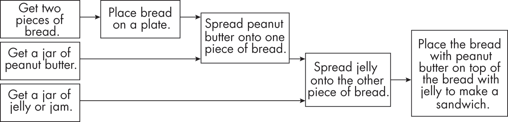
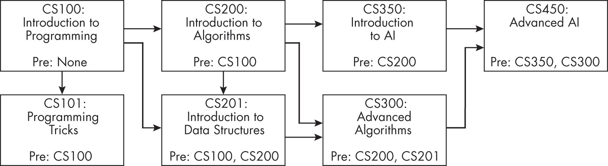
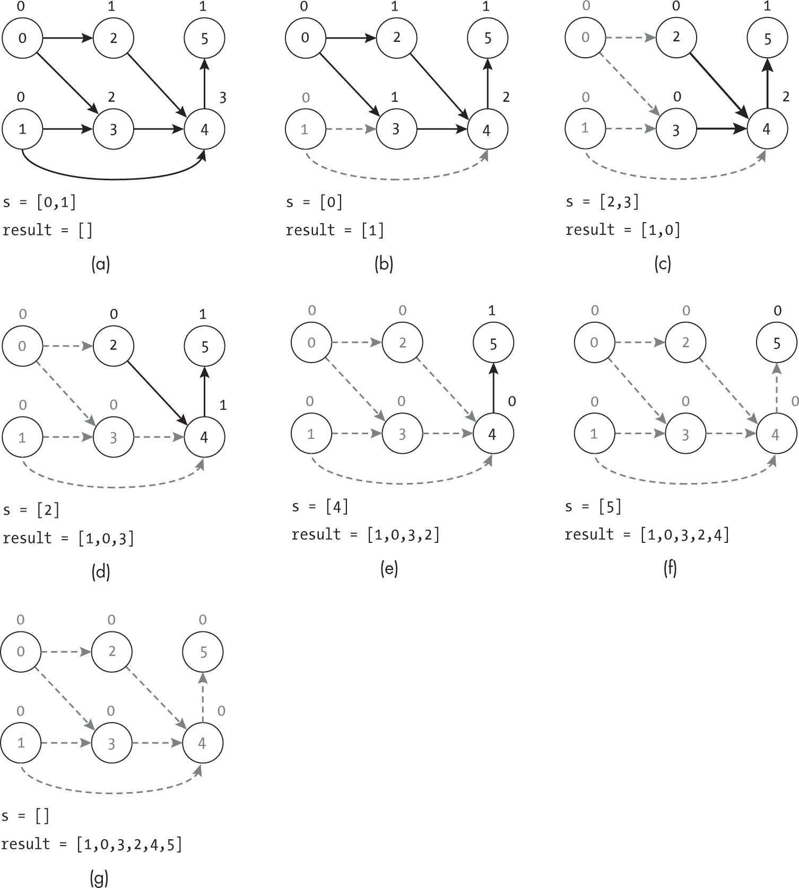
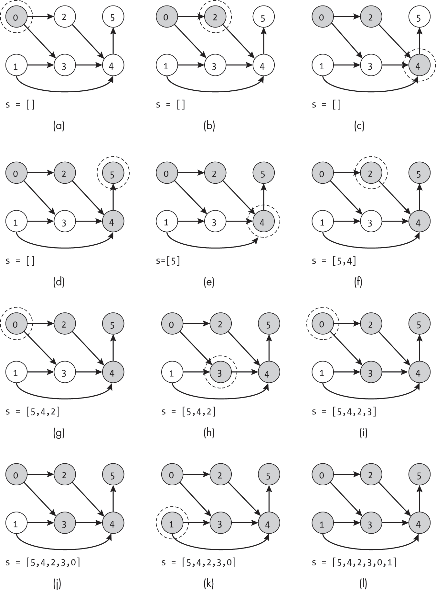
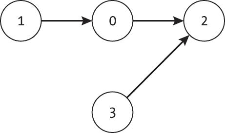
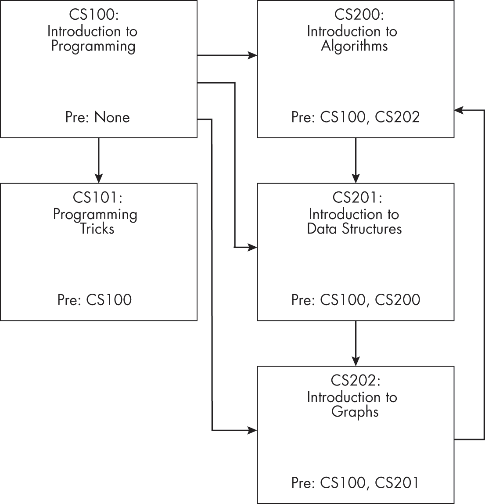
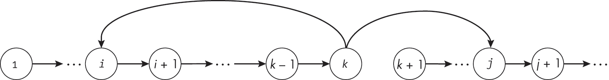
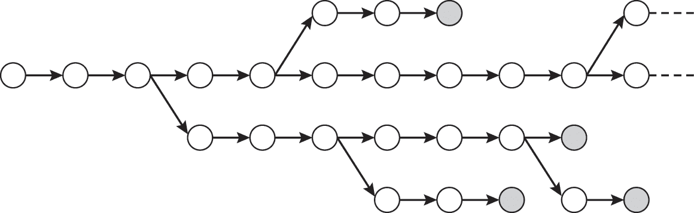
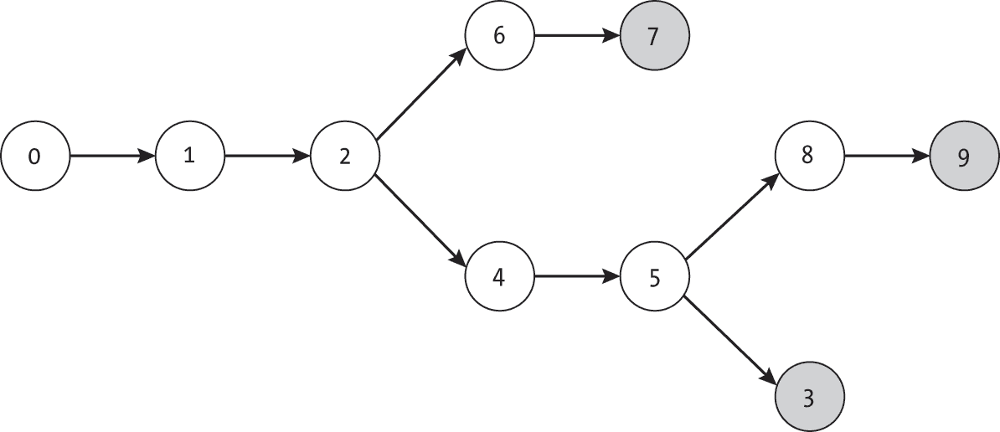

## 第九章：9 拓扑排序


除了它们的物理对应物（如单行道）外，我们还可以在图中使用有向边来指定节点之间的*依赖关系*或*排序顺序*。指向节点的入边表示必须在到达当前节点之前完成的动作。而出边指向的是通过完成当前节点后能够启用的动作。

考虑一个制作巧克力曲奇饼干的食谱示例。每个节点代表食谱中的一个步骤，包括诸如“添加面粉”和“搅拌混合物”等指令。某些步骤有明确且不可更改的顺序。我们不希望在往碗里加入任何东西之前就搅拌混合物，也不希望在没有测量之前就加入配料。

本章介绍了*拓扑排序*算法，它按照有向边指定的顺序对图的节点进行排序。在讨论了拓扑排序背后的概念，并展示了几个实际应用案例和排序算法后，我们将探讨无环图对拓扑排序的重要性，并考虑为什么说明书不是以图的形式呈现的。

### 拓扑排序算法是如何工作的

一个拓扑排序算法会找到一个节点的排序，使得如果从节点*u*到节点*v*有一条有向边，则节点*u*必须排在节点*v*之前。换句话说，每条有向边代表一个*依赖关系*。有些图有多个有效的排序。例如，图 9-1 展示了一个具有有效拓扑排序[0, 1, 2, 4, 3]和[0, 2, 1, 4, 3]的图。



图 9-1：具有两个有效拓扑排序的有向图

拓扑排序的一个关键约束是图必须是*无环*的，意味着图中不能包含任何*循环*。如果一个有向图中存在一条从某节点出发并最终回到该节点的路径，那么该图就包含了一个循环，如图 9-2 所示（这是图 9-1 的稍微修改版）。从节点 1 出发，我们可以通过节点 4 和 3 回到节点 1，路径为[1, 4, 3, 1]。


图 9-2：带有循环的有向图

含有环的图将无法进行有效的拓扑排序，因为它包含至少一个节点，其路径指向自身。这意味着该节点必须排在排序列表中的前面，但这是显然不可能的。不论我们如何在图 9-2 中排序节点 1、3 和 4，始终会有一条边从后来的节点指向较早的节点。我们称没有环的有向图为*有向无环图*，简称*DAG*。

我们可以通过检查每对节点之间的相对顺序来测试拓扑排序是否有效：

```
def is_topo_ordered(g: Graph, ordering: list) -> bool: 
  ❶ if len(ordering) != g.num_nodes:
        return False

  ❷ index_to_pos: list = [-1] * g.num_nodes
    for pos in range(g.num_nodes):
        current: int = ordering[pos]
        if index_to_pos[current] != -1:
            return False
        index_to_pos[current] = pos

  ❸ for n in g.nodes:
        for edge in n.get_edge_list():
            if index_to_pos[edge.to_node] <= index_to_pos[n.index]:
                return False
    return True 
```

代码首先检查排序中是否包含与图相同数量的节点❶。如果不相等，排序无效，函数返回False。接着，一个for循环构建一个反向索引，将每个节点映射到它在排序数组中的位置❷。这使得它能够轻松查找任意两个节点的相对顺序。在此循环中，代码还通过测试index_to_pos是否已被设置，来检查排序中是否存在重复节点。如果发现某个节点出现两次，函数将返回False，表示排序无效。

代码通过一对嵌套的for循环❸遍历每个节点及其所有出边。对于这些有向边中的每一条，代码通过比较节点在ordering中的位置（使用index_to_pos）来检查节点是否按正确顺序排列。一旦发现有任何一对节点顺序错误，函数立即返回False。最后，如果代码顺利通过所有检查，它将返回True。

### 使用案例

拓扑排序在现实世界中有多种应用场景。本节描述了如何将其中几个应用场景表示为图，并对其应用拓扑排序。

#### 代码依赖

程序员通常将大型程序拆分成一系列模块或库，以促进可理解性、可维护性和可扩展性。与其编写一个包含百万行代码的单一文件，程序员可能会创建三个模块：一个用于表示和处理图，另一个用于处理用户界面，第三个用于读取和写入文件。理想情况下，他们会设计这些模块相互依赖，以便能够在整个代码中重用核心库函数。例如，图形库和用户界面代码可能依赖文件模块来读取和写入配置文件。

这样的代码依赖关系意味着代码需要按照特定的顺序处理。我们可以将这些依赖关系表示为一个有向图，其中每个模块是图中的一个节点，每个 import 或 include 语句表示指向该节点的输入边。该图的拓扑排序告诉计算机处理文件的顺序。

#### 任务列表

我们可以将按照特定顺序遵循食谱的重要性扩展到广泛的任务中，从写作到清洁到组装家具。在这些情况下，节点代表任务列表中的步骤，边表示它们之间的依赖关系。例如，我们需要先拿出拖把和水桶，然后才能洗地板。另一个例子是，图 9-3 显示了一个图表，表示制作花生酱果冻三明治的步骤。



图 9-3：制作花生酱果冻三明治的任务图

尽管大多数说明手册是按线性顺序编写的，但顺序上通常是有一定灵活性的，这意味着图形不一定是节点的直线。例如，考虑组装一把预制椅子的过程。你先安装左臂还是右臂可能并不重要。然而，完成椅子的主体再安装座垫可能是至关重要的。

将指令表示为图形显然为并行性提供了机会。理论上，两个人一起做一个食谱可以比一个人更快完成；一个烘焙师可以量取面粉，而另一个量取糖，等等。不幸的是，这种并行表示可能会引发更多问题而不是更少。我个人在使用线性指令时常常忘记自己在哪一步，花费几分钟回想我是否已经把盐加入了碗中。通过任务的分支图跟踪已完成的步骤几乎可以保证我会漏掉某些步骤。

幸运的是，虽然人类很难追踪这种状态，但计算机在这方面表现得非常出色，它们使用图结构来寻找并行性机会。事实上，整个系统就是围绕图的概念构建工作流程的。分布式工作流系统通常是基于任务图的概念构建的，其中多个任务按其依赖关系的顺序执行。此类工作流的设计与优化是一个活跃的研究领域，且这一话题足以单独成书。

#### 教学与学习

许多学科由大量相互关联的概念组成，其中一些必须在继续学习下一个概念之前先理解。例如，数学老师很难在学生还没有学会乘法之前解释指数的概念。然而，其他一些概念可以并行学习。学习外语时，学生可能能够学习与咖啡店相关的词汇，而不必先掌握计算机科学术语。

我们可以将教学或学习概念的推荐顺序指定为一个图。节点表示概念，例如法语中的“咖啡”一词或递归的概念，而边则表示这些概念之间的依赖关系。在计算机科学的情况下，我们可能会将“函数”这一概念与“递归”概念之间加一条边，以表明学生应在学习递归之前了解函数。

基于这种图形表示法，我们可以使用拓扑排序来确定在大学课程中需要先修的课程。请参见图 9-4，该图展示了一个假设的课程先修关系图。



图 9-4：表示计算机科学课程先修关系的图

为了修完 CS450：高级人工智能，学生需要完成这门课程的先修链，直到 CS100：编程入门。

### 卡恩算法

计算机科学家 Arthur B. Kahn 提出了一种方法，现在称为*Kahn 算法*，用于在有向无环图上执行拓扑排序。该算法通过找到没有入边的节点，将其从待处理节点列表中移除，添加到已排序列表中，然后删除该节点的出边。算法会重复此过程，直到将所有节点都添加到已排序列表中。

直观上，Kahn 算法的排序方式类似于我们在现实世界中执行复杂任务的方式。我们首先执行一个可以不需要完成其他任何步骤的子任务，然后继续进行另一个子任务。任何需要我们先完成某个任务的行动，必须等到我们完成所有依赖任务后才能进行。

#### 代码

在实现 Kahn 算法时，我们不需要通过删除节点或边来修改正在处理的图。相反，我们可以使用额外的数组count来跟踪每个节点的入边数量，并在我们“删除”一个节点时减少这些计数。由于我们不需要修改图的数据结构，因此可以避免进行初始复制、重新添加删除的边或使结构发生变化。

Kahn 算法的代码使用了栈和多个循环，如在列表 9-1 所示。

```
def Kahns(g: Graph) -> list: 
    count: list = [0] * g.num_nodes
    s: list = []
    result: list = []

  ❶ for current in g.nodes:
        for edge in current.get_edge_list():
            count[edge.to_node] = count[edge.to_node] + 1
    for current in g.nodes:
        if count[current.index] == 0:
            s.append(current.index)

  ❷ while len(s) > 0:
        current_index: int = s.pop()
        result.append(current_index)
      ❸ for edge in g.nodes[current_index].get_edge_list():
            count[edge.to_node] = count[edge.to_node] - 1
            if count[edge.to_node] == 0:
                s.append(edge.to_node)
    return result 
```

列表 9-1：Kahn 算法的拓扑排序

代码首先创建了算法所需的辅助数据结构。数组count存储每个边的*入节点*计数，并将用于检查没有任何入边的节点。栈s（实现为列表）存储没有入边的未处理节点的索引。这些节点就是代码可以从图中删除的节点。最后，列表result将保存拓扑排序后的节点索引列表。

该代码使用了一对嵌套的for循环来计算每个节点的入边数量❶。在第一个循环中，由于算法在处理有向图，代码必须遍历所有节点（外层循环）及其出边（内层循环），并增加入边目标节点的计数（to_node）。接下来的for循环遍历count数组，查找没有入边的节点（count[current.index] == 0），并将它们的索引插入到栈s中。此时，函数已经设置了所有需要的初始信息，可以执行拓扑排序了。

代码的主体是一个while循环，处理堆栈中的每个项目 ❷。在每次迭代中，代码从s中弹出一个节点索引。它检索相应的节点，并将该索引添加到result数组的末尾。然后，函数通过遍历每条出边并减少指向目标的边的计数，虚拟地移除该节点及其出边 ❸。在此过程中，它检查是否有任何节点的传入边数降至零，如果是，则将该节点的索引添加到堆栈中。代码通过使用return result返回排序后的节点索引数组来完成。

每次迭代都集中于单个节点及其出边，这意味着算法的运行时间与节点数加上出边数成线性关系。

#### 示例

图 9-5 展示了如何在示例图上运行 Kahn 算法，其中每个子图表示算法进展的一个步骤。图中显示了每个节点上方传入边的计数（count中的值），并且移除的节点和边被灰显。

算法基于输入图初始化传入边的计数，并将没有任何传入边的两个节点（节点 0 和 1）存入堆栈，如图 9-5(a)所示。在图 9-5(b)中的排序的第一步，算法从堆栈中取出顶部元素（节点 1），并将其及其出边“移除”出图，从而减少节点 3 和 4 的计数。由于没有目标节点的计数减少到零，代码因此不会将它们添加到堆栈中。

在图 9-5(c)中，排序继续，通过从堆栈中弹出节点 0 并移除其到节点 2 和 3 的边。这样，节点 2 和 3 的传入边计数都降至零，允许将它们添加到堆栈中。该过程逐个节点地继续，直到堆栈中的每个节点都被处理完毕。



图 9-5：在示例图上运行 Kahn 算法

我们可以将卡恩算法想象成一个小心翼翼的烘焙师按照复杂食谱的过程。开始之前，烘焙师把所有任务及其必要的前提任务写下来。任务 5a，“添加两杯面粉”必须在任务 4，“在大碗中混合湿性原料”和任务 1a，“量取两杯面粉”之后完成。然而，烘焙师可以在任务 5a 之前或之后完成任务 5b，“加入一汤匙小苏打”，因为面粉和小苏打的添加顺序无关紧要。烘焙师会计算每个任务的前提任务数量，并将这些数字写在各自任务旁边。

烘焙师首先选择一个没有未完成前提任务的任务，执行该任务并在列表中勾选。然后，他们会遍历任务列表，并更新所有依赖于刚完成的任务的未来任务的未满足前提任务数量。例如，在量取了两杯面粉之后，他们可以将任务 5a，“添加两杯面粉”的依赖计数从 2 更新为 1——他们已经量取了面粉，但仍需要混合湿性原料才能继续。完成任务 4，“在大碗中混合湿性原料”后，他们可以将任务 5a 添加到下一步的任务列表中。

### 深度优先搜索

除了卡恩算法，另一种对有向无环图（DAG）中的节点进行排序的方法是使用深度优先搜索这一多功能工具。深度优先搜索从给定的节点*u*开始，然后按拓扑顺序探索*u*之后的节点。我们可以修改深度优先搜索，跟踪每个节点处理完成的顺序。通过保存搜索完成每个节点探索的顺序，深度优先搜索可以重建节点的*逆*排序。拓扑排序中的最后节点将在深度优先搜索中最先完成，因此会出现在列表的开头。

#### 代码

基于深度优先搜索的拓扑排序代码在很大程度上与我们在本书中使用的其他深度优先搜索实现相似，如 Listing 9-2 所示。然而，我们维护了一项额外的信息：一个列表s来跟踪搜索完成访问每个节点的顺序。

```
def topological_dfs(g: Graph) -> list: 
    seen: list = [False] * g.num_nodes
    s: list = []
  ❶ for ind in range(g.num_nodes):
        if not seen[ind]:
            topological_dfs_recursive(g, ind, seen, s)
  ❷ s.reverse()
    return s

def topological_dfs_recursive(g: Graph, index: int, seen: list, s: list):
    seen[index] = True
    current: Node = g.nodes[index]
    for edge in current.get_edge_list():
        neighbor: int = edge.to_node
        if not seen[neighbor]:
            topological_dfs_recursive(g, neighbor, seen, s)
  ❸ s.append(index) 
```

Listing 9-2：用于拓扑排序的深度优先搜索算法

列表 9-2 中的代码由两个函数组成。外部的 topological _dfs() 函数设置数据结构，调用深度优先搜索来从不同的起始节点开始，并处理结果。它首先创建一个空列表 s 和一个包含所有元素初始值为 False 的列表 seen。然后，函数遍历每个节点。如果发现一个尚未访问的节点，函数从该节点开始进行深度优先搜索 ❶。最后，函数将节点索引列表按相反的顺序输出到结果列表中 ❷。

接下来的内部 topological_dfs_recursive() 函数是一个递归实现的深度优先搜索，唯一的修改是：它将每个已完成的节点附加到一个列表中。此函数首先将当前节点标记为已访问，然后通过边列表迭代邻居，并递归地探索任何未访问的邻居。最后，它将当前节点的索引插入到列表 s 的末尾，以跟踪其完成访问节点的顺序 ❸。

#### 示例

图 9-6 展示了一个通过深度优先搜索进行拓扑排序的示例，其中当前正在访问的节点由虚线圈出，已访问的节点被着色。

搜索从 图 9-6(a) 中的节点 0 开始，并在 图 9-6(b) 中探索节点 2，图 9-6(c) 中的节点 4，以及 图 9-6(d) 中的节点 5。在每个节点上，算法将节点标记为已访问，并递归地探索其未访问的邻居。直到搜索完成一个节点的处理并回溯到其前驱节点时，才将该节点插入到排序后的列表中，正如在 图 9-6(d) 所示，搜索在节点 5 处遇到死胡同，并被迫回溯。将一个节点插入反向排序的列表意味着该节点必须位于所有先前被搜索的节点之后。



图 9-6：在示例图上运行深度优先搜索以进行拓扑排序

当搜索回溯到图 9-6(e)中的节点 4 和图 9-6(f)中的节点 2 时，它会检查是否有其他的出边。若没有，它将当前节点添加到列表中并回溯。当它返回到图 9-6(g)中的节点 0 时，深度优先搜索可以继续进行，然后再次回溯。它递归地探索图 9-6(h)中的节点 3。

如图 9-6(j)所示，在初始深度优先搜索完成后，我们可能还没有结束。节点 1 不在从节点 0 出去的任何路径上，因此尚未被探索。搜索继续进行，通过检查所有节点是否都已被访问，如果没有，则从那个未被访问的节点开始深度优先搜索。在算法结束时，搜索已访问所有节点，并按照逆拓扑顺序列出了节点，如图 9-6(l)所示。

我们可以将这个搜索过程想象成一个大学生规划要修的系列课程。他们将要修的课程列为图中的节点，并使用有向边表示课程的先修关系。深度优先搜索从一个节点开始，询问：“这门课程会让我修哪些课程？”当搜索到死胡同时，学生就知道他们找到了一个没有任何课程作为先修的课程。

返回到图 9-4 中的课程列表，考虑一下当学生从 CS200 开始并沿着路径通过 CS350 到 CS450 时会发生什么。CS450 已经完全探索过，因此他们转向未探索的课程列表。学生返回到 CS350，它不是任何其他课程的先修课程，并将其添加到列表中。最终，他们建立了[CS450, CS350, CS300, CS201, CS200]的列表。然后他们继续访问下一个未访问的课程（可能是 CS100），并继续完善他们的学习计划。

#### 起始节点的顺序

深度优先搜索方法在拓扑排序中的一个反直觉之处在于，topological_dfs()基函数在清单 9-2 中根据图中每个节点的索引开始递归搜索。它不会根据节点的入边数或其他任何位置特征对节点进行排序。

这就导致了搜索可能从一个有入边的节点开始的情况，就像图 9-7 中的图一样。毕竟，我们自然地认为深度优先搜索是从节点链的起点开始的。



图 9-7：一个图，其中节点 0 有一个入边连接

幸运的是，深度优先搜索在节点 0 不是拓扑排序起点的情况下仍然能够完美工作。在图 9-7 中，深度优先搜索算法将从节点 0 开始，并在初始递归深度优先搜索中找到节点 0 和节点 2。在第一次递归深度优先搜索结束时，包含反向排序的列表为[2, 0]。虽然看起来我们在跳过节点 1 时犯了一个错误，但我们将在下一次搜索中将其添加到正确的位置。

接下来，算法从节点 1 开始搜索，并将其添加到列表的末尾。由于列表是*反向*拓扑排序的，节点 1 在节点 0 之后的位置是正确的。在从节点 1 开始搜索后，列表变为[2, 0, 1]。当从节点 3 开始搜索时，列表变为[2, 0, 1, 3]。当函数结束时，它使用 Python 的reverse()函数反转列表，并返回正确的排序[3, 1, 0, 2]。

### 检测环路

如前所述，拓扑排序的一个关键限制是图必须是无环的。考虑图 9-8 所示的假设课程顺序。所有学生必须首先选修 CS100：编程导论，该课程没有先决条件。然而，下一学期情况变得更加复杂。为了覆盖更多的内容，CS200：算法导论的讲师希望学生掌握编程和图的基础知识。因此，他们要求 CS100 和 CS202：图论导论作为先修课程。同时，CS202 的讲师要求学生掌握数据结构，因此要求 CS201：数据结构导论作为先修课程。不幸的是，CS201 的讲师希望学生已经掌握基本算法，因此他们要求 CS200 作为先修课程。



图 9-8：带有环路的课程先修关系

当学生完成 CS100 后，他们查看自己现在可以修的课程，并遇到一个问题。每一门 200 级课程都要求另一门不同的 200 级课程作为先修课程。学生没有可以修的 200 级课程，而不需要先修其他课程。

我们可以调整本章中介绍的算法来检测图中是否存在循环，这为审核学校要求、使用手册、食谱或任何其他表示事件序列的图形提供了有用的工具。一种简单的方法是观察当我们在有循环的图上运行列表 9-1 的 Kahn 算法时会发生什么。该算法依赖于当它移除所有前置节点后，输入连接数降至零。为了移除一个属于循环的节点，该算法首先需要移除它的前驱节点，包括该节点本身。因此，循环中的节点的计数永远不会降至零，该节点也永远不会被加入到排序列表中。因此，我们知道，如果算法返回的列表不包含图中的所有节点，至少有一个节点必须是循环的一部分，因此无法移除。

我们将 Kahn 算法封装在一个名为check_cycle_kahns()的函数中：

```
def check_cycle_kahns(g: Graph) -> bool:  
    result: list = Kahns(g)
    if len(result) == g.num_nodes:
        return False
    return True 
```

此检查的代码需要一个额外的if语句来测试返回列表的长度。如果列表的大小与图相同，则代码返回False表示没有循环。否则，返回True。

### 重新排序列表

让我们考虑一个使用*拓扑排序*的任务：重新排序一个具有前向依赖关系的项目列表。作为示例，我们将使用拓扑排序来完成一个实际任务：对选择你自己冒险书的页面进行排序，以便你永远不需要翻回去。

如图 9-9 所示，我们可以将一个包含*N*页的选择你自己冒险书籍可视化为一个具有*N*节点的图。由于读者必须大部分连续翻页才能跟随各个故事情节，因此大多数页面的对应节点都有一个来自上一页的输入边和一个指向下一页的输出边。然而，使这些书籍充满趣味的是决策点。图 9-9 展示了围绕页面*k*的过渡。读者有两个选择：他们可以翻到页面*i*去探索鬼屋，或者翻到页面*j*去攀爬被雨水浸湿的悬崖。



图 9-9：表示选择你自己冒险书籍的页面顺序的图表

拓扑排序使我们能够将页面重新排列为故事顺序，如图 9-10 所示。故事从第 1 页开始。叙事路径从左到右延伸。在决策点处，它们会分支开来，其中一些决定导致了不幸的早期结局（由阴影节点表示）。



图 9-10：将书籍重新组织为故事顺序

我们可以使用本章中的两种算法来为我们排序。作为输入，我们获取一个列表的列表，该列表将每一页映射到其对应的选项。列表 [[1], [3, 4], [-1], [-1], [2]] 表示一个五页的故事，列表中的索引对应当前页面。页面 0 确定性地指向页面 1。页面 1 有一个选项可以继续到页面 3 或 4。页面 2 和 3 都表示故事的结束（由 -1 表示）。最后，页面 4 确定性地返回页面 2。

Listing 9-3 显示了通过将列表转换为图形来排序故事的代码，并且为了本示例的目的，调用了 Kahn 算法。

```
def sort_forward_pointers(options: list) -> list:
    num_nodes: int = len(options)
    g: Graph = Graph(num_nodes)
    for current in range(num_nodes):
        for next_index in options[current]:
            if next_index != -1:
                g.insert_edge(current, next_index, 1.0)
  ❶ return Kahns(g) 
```

Listing 9-3：排序前向指针

代码为每一页创建一个节点。然后，使用一个 for 循环迭代每一页，第二个 for 循环迭代该页的所有外部选项。它检查该页是否表示终结状态（next_index == -1）；如果不是，代码会向故事顺序中的下一页添加一条边。最后，代码调用 Kahn 算法来执行拓扑排序并返回结果 ❶。（或者，代码可以使用 Listing 9-2 中的 topological_dfs()。）

作为该代码的示例实现，我们将其应用于 图 9-11 中显示的 10 页冒险故事。



图 9-11：一个包含 10 页的故事图

我们将选项表示为列表的列表，选项 -1 表示叙事线的结束，无论它是积极还是消极的结局：

[[1], [2], [4, 6], [-1], [5], [3, 8], [7], [-1], [9], [-1]]

当我们通过 Listing 9-2 中的 sort_forward_pointers() 函数运行输入时，代码返回以下排序：

[0, 1, 2, 6, 7, 4, 5, 8, 9, 3]

将这个结果与图 9-11 进行比较，我们可以看到，如果我们将页面顺序重新排列，从第 0 页开始，接着翻到第 1、2、6 页，以此类推，那么在跟随叙事线的过程中，我们就不需要向后翻页。

虽然排序选择自己冒险故事书可能不是你在日常工作流程中需要处理的典型问题，但很容易从这个例子中推断，并将相同的技巧应用于其他使用场景。你可以简单地从正向指针（例如选择自己冒险故事书或食谱）或反向指针（如课程先修条件或代码依赖关系）构建依赖图。

### 为什么这很重要

拓扑排序展示了如何使用图中的有向边来强制执行更抽象的约束条件，比如物品的顺序。我们可以通过将物品建模为节点，将它们之间的依赖关系建模为有向边，将一系列依赖和排序问题转化为图。

正如本章所示，拓扑排序在现实世界中有一系列的应用场景。我们在日常生活中常常不自觉地执行拓扑排序。在我们煮咖啡之前，我们会先往水壶里加水。我们知道这一系列操作的正确顺序，当然也无需将其表示为图。然而，将拓扑排序转化为图问题，可以大大扩展我们能够使用该算法解决的问题类型。例如，编译器可以使用拓扑排序来确定在一个项目中编译数千个源文件的顺序。基于云的工作流系统也可以使用拓扑排序来确定下一步执行的计算。一旦你开始注意它，拓扑排序就在计算领域和日常生活中随处可见。知道如何建模这些问题并排序任务，是实施高效解决方案的第一步。

下一章将讨论图中的连通性，以及如何选择一组边使得图完全连通。具体来说，我们将研究如何找到一组最小成本的边，使得所有节点都能连接。
