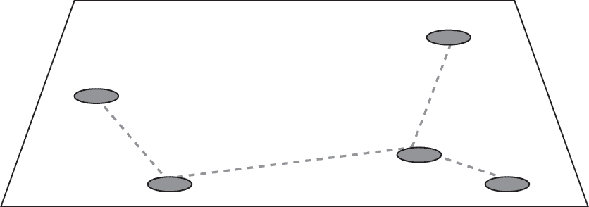
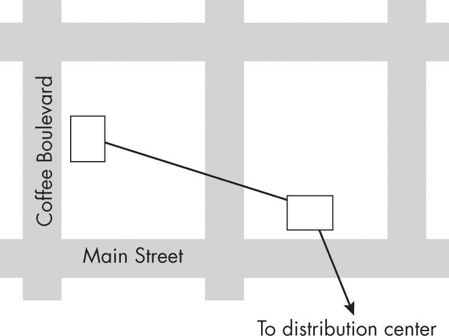
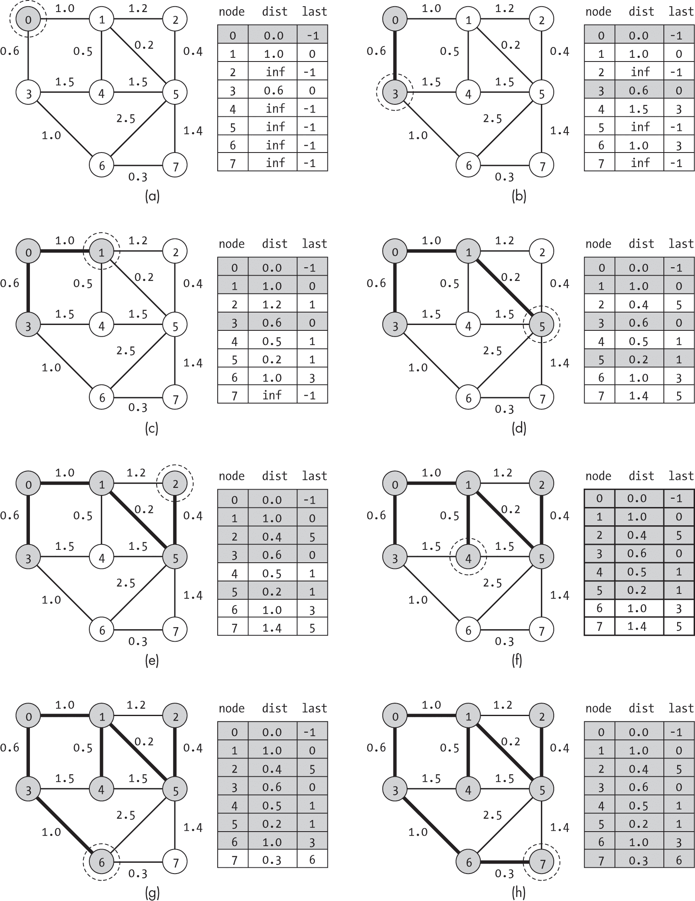
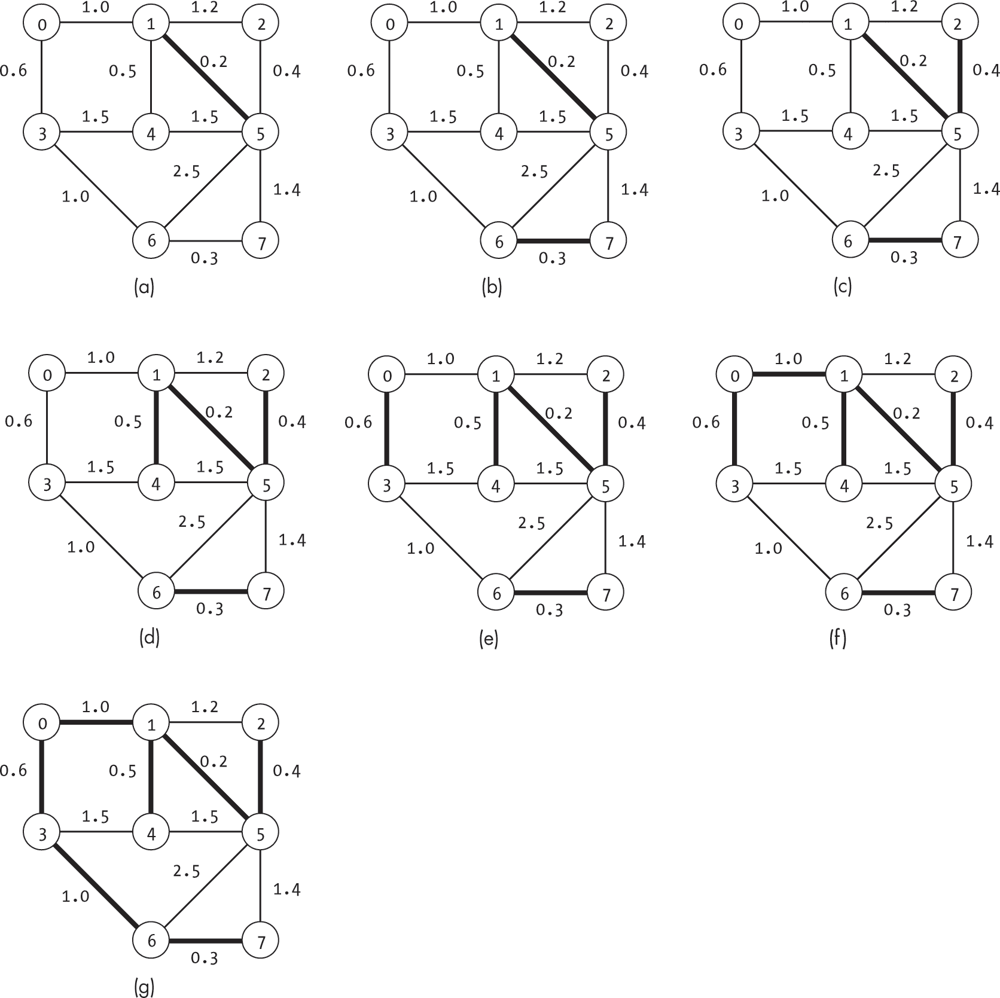
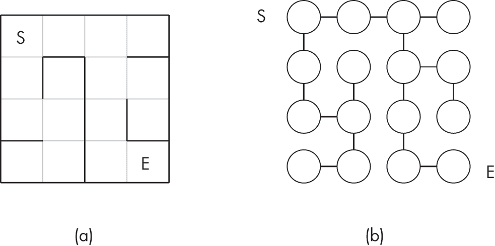
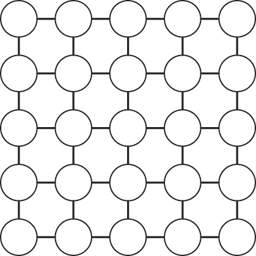
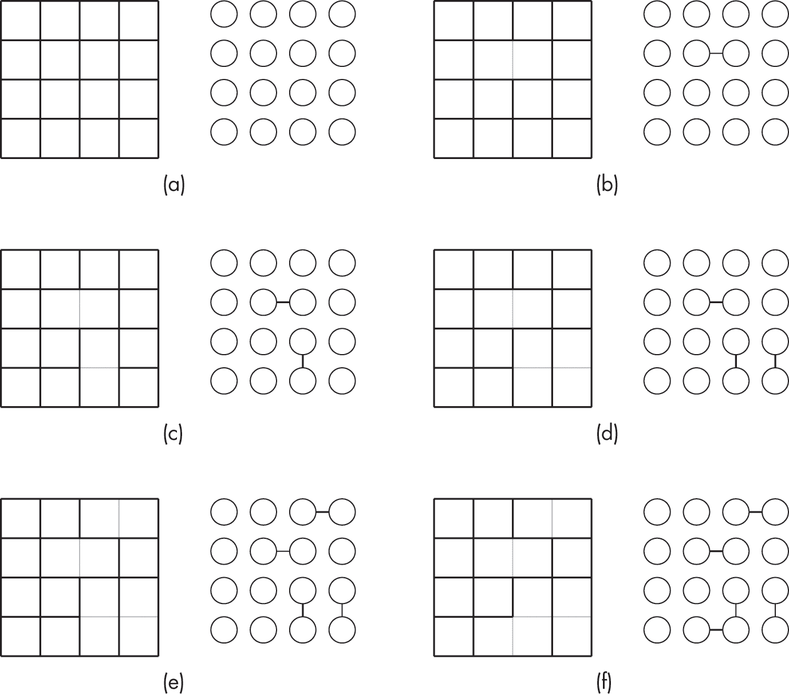
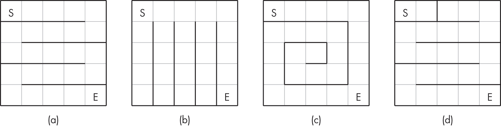
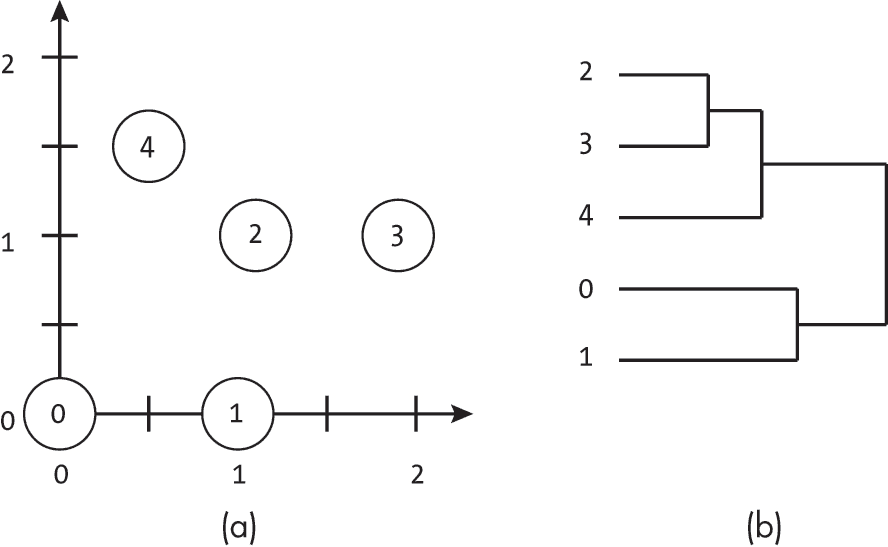
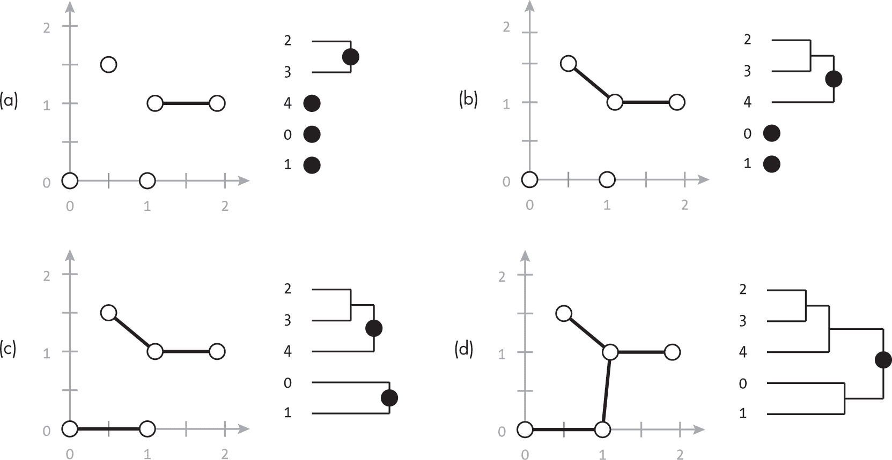

## 第十章：10 最小生成树


加权无向图的*最小生成树*是连接所有节点的边集，并且具有最小的总权重。我们可以用这一概念来建模和优化多种现实世界中的问题，从设计电网到推测松鼠应该如何构建它们的洞穴。

本章介绍了构建最小生成树的两种经典算法。普里姆算法是一种逐步聚合的节点算法，它通过构建越来越大的连接节点集合来实现。克鲁斯卡尔算法通过从排序后的边列表中逐一添加边来构建最小生成树。

在讨论最小生成树如何应用于多个现实世界问题之后，我们考虑与最小生成树紧密相关的另外两个算法：基于网格的迷宫生成和单连接聚类。我们展示了这些任务如何映射为图问题，并通过本章的算法变种进行求解。

### 最小生成树的结构

一个图的*生成树*是连接图中所有节点的边集，并且不形成任何环。我们可以将生成树想象为现实世界基础设施网络的骨干——连接每个节点的最少连接，使得任何节点都可以从其他节点到达。这些可能是电力线、道路、计算机网络中的链接，或者是松鼠洞穴中的通道。*最小生成树*是连接所有节点的边集，同时最小化边权的总和。

我们可以通过一个特别有组织的松鼠洞穴来形象化这些要求，如图 10-1 所示。松鼠将它们的领域构建为一系列通过隧道（边）连接的洞穴（节点）。就像在图中一样，每条隧道直接连接着两个洞穴，并且是一条直线。松鼠设定了两个额外的要求。首先，每个洞穴到地表需要通过隧道从任何其他洞穴到达。毕竟，如果多个入口不能让你从一个洞口消失然后从另一个洞口出来，那还有什么用呢？其次，隧道的总距离必须最小化。松鼠很懒，宁愿随机地在不同地点从地面冒出来，而不愿挖新的隧道。



图 10-1: 五个松鼠洞穴连接成最小生成树

正式定义，在一个加权无向图中寻找最小生成树的问题如下：

给定一个由节点 *V* 和边 *E* 组成的图，找到一个边集 *E*′ ⊆ *E*，它连接图中每个节点，同时最小化边权重的总和 *∑*e [∈] E[′] *weight*(*e*)*。

按照定义，最小生成树将拥有|*V*| – 1 条边，这是连接|*V*|个节点所需的最少边数。任何更多的边都会产生环路和不必要的重量。

### 使用案例

本节介绍了一些使用最小生成树概念设计高效物理网络或优化社交网络通信的实际案例。

#### 物理网络

最小生成树在确定我们需要构建的、以最低成本完全连接物理网络的链接集时非常有用。想象一下，算法咖啡公司计划为其各个地点之间传送咖啡豆构建一套最先进的气动管道系统。在承诺提供超过 10,000 种咖啡后，公司很快意识到一些地点缺乏足够的存储空间来存放如此多种类的咖啡豆。因此，公司决定建立一个中央仓库，根据需求将少量咖啡豆运送到每个商店。每个商店现在将拥有无与伦比的咖啡选择。

规划人员很快意识到，从每个商店到仓库建立气动管道的费用过高。位于 Javaville 的两家商店距离配送中心超过 10 英里，但彼此相隔仅两个街区。通过从配送中心到 Main Street 位置再到 Coffee Boulevard 位置建立一条管道要便宜得多。对 Coffee Boulevard 位置的请求可以通过先将咖啡豆发送到 Main Street 位置，然后再转发到 Coffee Boulevard 来满足。

这种多步骤路由将气动传递系统的设计转化为一个最小生成树问题，如图 10-2 所示。算法咖啡公司每个建筑物都是一个节点，任何一对商店之间的潜在管道都是一条边。



图 10-2：最小生成树交付网络中的两家咖啡店

在图 10-2 中，边的权重是建造两栋建筑之间气动管道的成本。虽然通常与距离有关，但成本也可能因环境因素而增加。例如，在城市中心修建一条管道比在农田下修建相同长度的管道要昂贵得多。规划者需要找到一组边（需要建造的管道），以便连接所有建筑物并最小化成本。

除了气动咖啡管外，最典型的最小成本生成树在物理网络中的应用包括以下几种：

**构建高速公路** 节点是城市，边是高速公路，边的权重是建造两点之间高速公路的成本。

**电力网** 节点是城市，边是传输线路，边的权重是建造两点之间传输线路的成本。

**跨岛桥梁** 节点是群岛中的岛屿，边是两岛之间的实际桥梁，边的权重是建造两岛之间桥梁的成本。

**航空网络设计** 节点是机场，边是航班，边的权重是两机场之间飞行的成本。

#### 社交网络

最小生成树也适用于非物理网络。例如，想象一个不相信群发邮件的“数据结构专家个人通信协会”。这种公告方式过于冷漠。相反，组织者坚持要求每个消息必须通过成员之间的个人电话传递。然而，像任何由专家组成的组织一样，成员之间有着各种各样的旧友谊和恩怨。去年，艾丽斯·哈希表与鲍勃·二叉搜索树发生了争执，之后他们不再交谈。

每年，组织都会开发一个复杂的电话树，允许该组织在最小化成员不适感的同时传播即将举行的会议的消息。每个成员都表示为一个节点，并与其他成员通过边相连。边的成本是两个成员之间交谈时的不适感。在最佳情况下，即朋友之间的聊天，权重最小，仅表示电话通话的时间成本。然而，在最坏情况下，两名有恩怨的成员之间的成本会导致数天的生产力损失和愤怒的抱怨。组织需要找到一组配对通信，使每个成员都能收到会议的相关信息，同时最小化整体的不安。这要求所有节点通过最少数量和成本的边进行连接。

### 普里姆算法

构建最小生成树需要一种算法，从完整的图中选择一个最小代价的边集，使得生成的图是完全连接的。找到图的最小生成树的一种方法是*普里姆算法*，该算法由包括计算机科学家 R.C. 普里姆和数学家 Vojteˇch Jarník 在内的多位学者独立提出。该算法与第七章中的 Dijkstra 算法非常相似，都是通过遍历一个未访问的节点集，并逐个节点地构建最小生成树。

普里姆算法从一个未访问的所有节点集合开始，任意选择一个节点进行访问。这个已访问的节点构成最小生成树的起点。在每次迭代中，算法会找到与它已经访问过的节点中某一个节点的边权最小的未访问节点，并问：“哪个节点离我们已连接集合的边界最近，且可以以最小代价添加进来？”算法将这个新节点从未访问集合中移除，并将相应的边添加到最小代价生成树中。它不断地在每次迭代中添加节点和边，直到访问了所有的节点。

普里姆算法最多访问每个节点一次，并且最多考虑每条边两次（每个端点各一次）。此外，对于每个节点，我们可能会看到与|*V*|的对数成比例的成本，来插入或更新在标准堆中实现的优先队列中的节点。因此，算法的总成本按(|*V*| + |*E*|) × log (|*V*|)的复杂度增长。

我们可以将普里姆算法想象成一个建设公司，受雇于一个群岛之间的桥梁升级项目。该公司计划将连接群岛的腐朽木桥替换为现代化的桥梁。由于旧的木桥无法承受施工设备的重量，因此从公司角度来看，只有通过新桥连接的岛屿才算是“真正连接”。他们的合同要求，最终任何一对岛屿都必须通过新建的现代化桥梁相互可达。

建设者从一个岛屿开始，向外扩展，逐渐用新的桥梁连接更多岛屿。每一步，他们选择升级连接当前已连接岛屿与外部岛屿之间的最短木桥。通过始终从已连接岛屿开始新桥的建设，建设者可以用现代桥梁将设备运送到新边的起点。通过始终在未连接岛屿上结束桥梁，建设者在每一步都增加了已连接岛屿集的覆盖范围。

#### 代码

在 Prim 算法的每一步中，我们跟踪未连接的节点以及连接它们的最佳边权重。我们通过使用自定义的PriorityQueue实现来维护这些数据，该实现提供了一种高效的机制来查找队列中的值并修改优先级。为了理解这段代码，你只需要掌握向优先队列中插入项、从优先队列中移除项以及修改优先级的基本知识。然而，如果你感兴趣，可以在附录 B 中查看详细信息。

代码本身会遍历优先队列中的节点，直到队列为空。每次从优先队列中移除一个新节点（即未访问的节点），它会检查该节点的未访问邻居，并判断当前节点是否为任何未连接的邻居提供了更好的（即更低成本的）边。如果是，它就会用新的边和权重更新邻居的信息：

```
def prims(g: Graph) -> Union[list, None]:
    pq: PriorityQueue = PriorityQueue(min_heap=True)
    last: list = [-1] * g.num_nodes
    mst_edges: list = []

  ❶ pq.enqueue(0, 0.0)
    for i in range(1, g.num_nodes):
        pq.enqueue(i, float('inf'))

  ❷ while not pq.is_empty():
        index: int = pq.dequeue()
        current: Node = g.nodes[index]

      ❸ if last[index] != -1:
            mst_edges.append(current.get_edge(last[index]))
        elif index != 0:
            return None

      ❹ for edge in current.get_edge_list():
            neighbor: int = edge.to_node
            if pq.in_queue(neighbor):

                if edge.weight < pq.get_priority(neighbor):
                    pq.update_priority(neighbor, edge.weight)
                    last[neighbor] = index

    return mst_edges 
```

这段代码首先创建了三个辅助数据结构，包括一个基于最小堆的未连接节点优先队列（pq）、一个表示在给定节点之前最后访问节点的数组（last），以及最小生成树的最终边集（mst_edges）。这段代码需要导入在附录 B 中定义的自定义PriorityQueue类，以及从 Python 的typing库中导入Union。

所有节点在算法开始时都会被插入到优先队列中❶。起始节点（0）被赋予优先级 0.0，其他节点则赋予无限优先级。接着，代码按照类似于 Dijkstra 算法的方式，逐一处理未访问的节点。一个while循环会一直运行，直到未访问节点的优先队列为空❷。在每次迭代中，会选择与任何已访问节点距离最小的节点，并从优先队列中出队。如我们将看到的，这有效地将该节点从未访问的节点集中移除。

接下来，代码检查是否存在一条返回到连通集合中某个节点的边 ❸。有两种情况可能导致节点的last条目为-1。第一种情况是节点 0，由于首先被探索，因此没有前驱节点。第二种情况是断开分量，其中index无法从节点 0 到达。在后一种情况下，由于所有节点无法连接，图就没有最小生成树，函数返回None。

在将新节点添加到已访问集合（通过出队操作）后，for循环遍历每个节点的邻居 ❹，检查邻居是否未被访问（仍在优先队列中）。如果是，代码将通过比较先前最佳边的权重与新边的权重，来检查是否找到了到该节点的更好边。代码最后通过返回组成最小生成树的边集来结束。

请注意，如果图是断开的，每个连通分量都有自己的最小生成树。与这里呈现的代码的替代方法是返回为每个连通分量创建最小生成树的边的列表。我们可以通过删除elif检查 ❸及其对应的返回语句来实现这一点。然后，代码将通过从优先队列中选择一个节点并继续选择边来处理下一个分量。

#### 一个例子

图 10-3 展示了 Prim 算法在一个包含八个节点的图上的示例。每个子图右侧的表格显示了每个节点跟踪的信息，包括节点的 ID、从已连接节点集合到该节点的距离（由节点的优先级存储），以及当前连接子集中的最近节点，该信息存储在last列表中。除了第一个节点外，所有节点的初始距离为无穷大，last节点指针为-1，表示我们尚未找到通向该节点的路径。移除一个节点后，我们将其行标灰色显示，以表示该节点不再被考虑。

搜索从图 10-3(a)中的节点 0 开始。这对应于我们的岛屿桥梁建设公司在其母岛的总部开始运营。搜索从优先队列中移除节点 0，检查其每个邻居，并相应更新信息。节点 1 被分配了 1.0 的距离，节点 3 被分配了 0.6 的距离。两个邻居的last值现在都指向节点 0，作为已连接子集中最近的节点。

在图 10-3(b)中，搜索进展到距离最近且不在已连接子集中的节点。这对应于建立岛屿之间的第一座桥梁。算法从优先队列中取出距离（优先级）为 0.6 的节点 3，将其加入已连接子集，并检查其邻居节点 4 和 6。这两个节点通过节点 3 的边成为新可达节点。搜索更新了这两个节点的优先级和last值。

搜索接下来探索图 10-3(c)中的节点 1。在检查节点 1 的邻居时，发现了一个更短的边连接到节点 4。这相当于工人们注意到旧木桥（1，4）比另一个当前计划升级的木桥（3，4）更短，因此升级成本更低。因此，搜索更新了节点 4 的距离为 0.5，并将其last指针更新为节点 1，以反映连接边的起点。搜索现在计划使用边（1，4）将节点 4 加入到我们的已连接集合中，而不是使用之前的边（3，4）。



图 10-3：Prim 算法的示意图

在接下来的五个子图中，搜索依次进行到节点 5、节点 2、节点 4、节点 6 和节点 7，检查每个节点未访问的邻居，并更新发现更短边的节点。每一步，连接的子图大小增加一，直到所有节点都被连接。

### 克鲁斯卡尔算法

普里姆算法的逐节点方法的替代方案是采用基于边的方式来构建最小生成树。克鲁斯卡尔算法由跨学科的学者约瑟夫·B·克鲁斯卡尔发明，其原理是循环遍历一个排序后的边权重列表，逐步添加边以构建最小生成树。直观地，我们希望添加图中较小的边，因为它们是节点之间最便宜的连接。如果我们维护一个按权重排序的边列表，就可以逐步添加下一个有助于构建最小生成树的边。这一排序列表循环遍历的过程就是克鲁斯卡尔算法的核心。

克鲁斯卡尔算法的成本与|*E*| log (|*E*|)成正比。算法首先提取并排序每条边，所需时间与|*E*| log (|*E*|)成正比。使用高效实现的并查集算法，我们可以在|*E*| log (|*V* |)时间内合并集合。只要|*E*| ≥ |*V* |，算法的规模将是|*E*| log (|*E*|)。

我们可以通过将克鲁斯卡尔算法与一位宠物主人为其心爱的仓鼠搭建复杂生活空间的情境进行可视化。仓鼠已经有了几个大栖息地，主人决定用透明管道将它们连接起来，让宠物自由穿梭于各个笼子之间。栖息地在房间内的布局是固定的。为了最小化所需的管道总量，主人测量每一对栖息地之间的距离，排序列表，然后决定接下来添加哪条管道。与岛屿建设的例子不同，宠物主人不需要担心将施工设备从一个节点运送到另一个节点。他们可以轻松地在任意一对节点之间移动来建立连接。

#### Union-Find

除了找到下一个最低成本的边，我们在考虑每条新边时还需要回答一个额外的问题：这条边是否将当前断开的集群连接起来？如果没有，那么这条边就是多余的。记住，关键字是*最小*。如果我们已经有了边(A, B)和(B, C)，那么边(A, C)就没有帮助，因为节点 C 已经通过节点 B 从节点 A 到达。

为了高效实现克鲁斯卡尔算法，我们使用一种新的辅助数据结构UnionFind。这种数据结构允许我们表示一组不同的集合，我们将使用它来跟踪图的连通组件。该数据结构支持一些高效的集合操作，包括以下内容：

are_disjoint(i, j)确定两个元素i和j是否在不同的集合中。我们使用此方法来测试两个节点是否属于同一连通集合。

union_sets(i, j)将包含元素 i 的集合和包含元素 j 的集合合并为一个集合。我们用它来连接两个节点集合，当我们添加一条边时。

数据结构还会跟踪不相交集合的计数，并在每次操作时更新（num_disjoint_sets）。

对于本书中的算法，实际上不需要深入了解 UnionFind 的细节。将其视为一个方便进行操作的模块就足够了。有兴趣的读者可以在附录 C 中找到一个基本的描述和足够实现本书算法的代码。

#### 代码

给定辅助数据结构，Kruskal 算法的代码分为两个主要步骤。首先，我们创建一个包含所有图的边的列表并进行排序。然后，我们通过遍历该列表，检查当前边是否连接了不相连的组件，如果是的话，就将其添加到我们的最小生成树中：

```
def kruskals(g: Graph) -> Union[list, None]:
    djs: UnionFind = UnionFind(g.num_nodes)
    all_edges: list = []
    mst_edges: list = []

  ❶ for idx in range(g.num_nodes):
        for edge in g.nodes[idx].get_edge_list():
          ❷ if edge.to_node > edge.from_node:
                all_edges.append(edge)
  ❸ all_edges.sort(key=lambda edge: edge.weight)

    for edge in all_edges:
      ❹ if djs.are_disjoint(edge.to_node, edge.from_node):
            mst_edges.append(edge)
            djs.union_sets(edge.to_node, edge.from_node)

  ❺ if djs.num_disjoint_sets == 1:
        return mst_edges
    else:
        return None 
```

代码首先创建一系列辅助数据结构，包括一个表示当前不相交集合的 UnionFind 数据结构（djs），用于确定哪些点已经属于同一个簇，一个列表（all_edges）用于存储*排序后的*边列表，以及一个空列表（mst_edges）用于存放最小生成树的结果边。然后，代码遍历图中的每个节点来填充这些辅助数据结构❶。对于每个节点，它将该节点的每条边插入到所有边的列表中。

由于我们对无向图的表示在节点 A 和节点 B 的邻接表中都包含边 (A, B)，代码使用简单的检查来避免重复添加相同的边❷。（请注意，这个检查仅在使用这种无向图表示法时用于提高效率。如果没有该检查，代码仍然能够正常工作，只不过在 all_edges 中会包含两倍数量的边。）

在所有边列表组装完成后，代码会按边的权重升序对边进行排序❸。代码通过单一的for循环遍历排序后的每条边，然后使用UnionFind数据结构检查该边是否连接两个当前未连接的组件❹。如果是，这条边就是有用的。代码会将它添加到最小生成树的边集(mst_edges)中，并合并该边节点的两个不连通子集。

最后，代码检查是否能够将所有节点连接成一个单一的连通组件❺。如果是，它会返回最小生成树的边列表。如果不是，它则返回None。如果去掉这个最终的检查，代码将返回那些不属于单一连通组件的图的每个最小生成树的边。

#### 一个示例

图 10-4 展示了 Kruskal 算法在一个有 8 个节点和 12 条边的图上的运行示例。

搜索从一个空的边集开始，因此是一个不连通的节点集。在图 10-4(a)中，搜索从图中选择了权重最小的边。这个边对应的是边(1, 5)，权重为 0.2。图中的边用粗体标记，表示它是最小成本生成树的一部分。节点 1 和节点 5 现在属于同一个连通子集，搜索将不连通的子集数量从八个减少到了七个。

在图 10-4(b)中，搜索继续通过选择权重次小的边来进行。这次它通过权重为 0.3 的边连接了节点 6 和节点 7，将不连通的子集数量减少到了六个。



图 10-4：Kruskal 算法的示意图

在接下来的两个子图中，搜索将节点 2 和节点 4 添加到第一个连通子集{1, 5}中，结果形成了包含{1, 2, 4, 5}的连通集。在图 10-4(e)中，算法通过边权重为 0.6 的边将节点 0 和节点 3 连接在一起，合并了另外两个孤立的节点。接着，算法通过在接下来的两个子图中添加边(0, 1)和(3, 6)，将剩余的三个不连通子集合并到一起。此时，所有节点已经连接成一个单一的子集，意味着最小成本生成树的边连接了图中的所有节点。### 迷宫生成

尽管前几章中介绍的图形搜索方法可以帮助我们算法地解决迷宫问题，但它们无法帮助我们首先生成迷宫。在本节中，我们偏离了最小生成树算法的更经典用途（例如构建交通网络），展示了如何扩展 Kruskal 算法来创建随机但始终可解的迷宫。为了让迷宫足够有趣，我们确保每个迷宫只有一个有效的解。

假设我们被要求为当地一家家庭餐厅的儿童餐垫设计一个迷宫。我们的设计可以很简单，但必须是可解的，并且迷宫中只有一条路径。餐厅老板聪明地不想用不可能解开的迷宫来挑战年轻的顾客，以免造成尖叫声和食物被扔出去的情况。

#### 表示基于网格的迷宫

为了简化本节代码，我们使用类似图纸上的常规方格来表示迷宫。在经过数小时的深思熟虑后，我们决定通过给每条边着色来表示迷宫的墙壁。玩家可以在没有墙壁的两个相邻方格之间移动。随着每条线的绘制，我们消除了离开该方格的一个潜在选项，也许还会因我们正在创造的艰难任务而轻轻一笑。

图 10-5(a)展示了一个基于网格的迷宫示例。我们可以通过图形等效地表示该网格结构，如图 10-5(b)所示。



图 10-5：一个基于网格的迷宫及其图形表示

在图 10-5(b)中，迷宫中的每个方格都对应一个单独的图节点。我们在没有墙壁的两个相邻节点之间添加无向边，以便边表示能够从一个节点到达另一个节点。

#### 生成迷宫

我们通过从一个基于网格的图开始，并基于 Kruskal 算法构建一个随机化的生成树算法，来连接所有节点。基于网格的初始结构使我们能够基于邻接关系建立连接。每个节点最多有四个连接，分别连接其上、下、左、右的节点。生成生成树可以确保每个节点都可以从任何其他节点到达，并且我们可以从起始节点到达结束节点。

我们使用一个连接的基于网格的图来定义有效边，如图 10-6 所示。就像我们在第五章中生成的网格一样，这个图表示我们需要连接的所有节点，以及我们可以用来连接它们的潜在边的集合。如果我们的网格宽度为*w*，高度为*h*，那么它包含*h* × *w*个节点和连接相邻节点的无向边（权重为 1）。



图 10-6：基于网格的图

如果我们使用图 10-6 中的图来构建我们的最终迷宫，那么任意两点之间就会有大量潜在路径。换句话说，这个图并不会构成一个特别有趣或具有挑战性的迷宫。从起始节点开始，我们可以通过在水平方向和垂直方向上各走一步，直接到达终点节点。现实世界中的类似例子可能是一个用空旷草坪做的树篱迷宫，或者是我们餐垫上的一个空白迷宫。为了构建一个有趣的迷宫，我们需要从这些边中选择一个最小的子集。

就像 Kruskal 算法一样，我们从一个空的生成树开始，其中没有任何节点是连接的。在我们基于网格的餐垫的例子中，我们从一个方格网格开始。我们逐个向生成树添加边并擦除相邻方格之间的线。我们也可以将连接两个组件的过程想象成一个卡通人物用一个巨大的大锤子拆除两个相邻房间之间的实体墙，或者直接穿透墙壁。当我们的卡通人物愉快地打开通道（或者我们小心地擦去网格线）时，原本分离的组件连接在一起，迷宫中的路径也形成了。

生成随机迷宫的关键直观上是随机选择下一条边。Kruskal 算法和 Prim 算法都依赖于某种方法来打破权重相同边之间的平局。然而，在这个案例中，所有的边权重都是相同的（1.0），所以我们可以随机选择一条边。如果所选的边连接了两个不相交的组件，我们就保留它。这条边在之前无法到达的两个组件之间打开了一条路径。否则，如果所选的边连接了两个已经连接的组件，我们就舍弃它，因为在组件之间添加多个路径会导致循环，破坏迷宫必须只有一条路径的规则。

#### 代码

以下代码允许我们从基于网格的图中随机创建一组迷宫边：

```
def randomized_kruskals(g: Graph) -> list:
  ❶ djs: UnionFind = UnionFind(g.num_nodes)
    all_edges: list = []
    maze_edges: list = []

  ❷ for idx in range(g.num_nodes):
        for edge in g.nodes[idx].get_edge_list():
            if edge.to_node > edge.from_node:
                all_edges.append(edge)

  ❸ while djs.num_disjoint_sets > 1:
        num_edges: int = len(all_edges)
      ❹ edge_ind: int = random.randint(0, num_edges - 1)
        new_edge: Edge = all_edges.pop(edge_ind)

      ❺ if djs.are_disjoint(new_edge.to_node, new_edge.from_node):
            maze_edges.append(new_edge)
            djs.union_sets(new_edge.to_node, new_edge.from_node)

    return maze_edges 
```

该函数使用完整的基于网格的图（g）来定义边列表。代码首先设置辅助数据结构，包括表示不相交集合的<ssamp class="SANS_TheSansMonoCd_W5Regular_11">UnionFind数据结构（<ssamp class="SANS_TheSansMonoCd_W5Regular_11">djs），所有边的列表（<ssamp class="SANS_TheSansMonoCd_W5Regular_11">all_edges），以及迷宫或生成树边的列表（<ssamp class="SANS_TheSansMonoCd_W5Regular_11">maze_edges）❶。像克鲁斯卡尔算法一样，代码从图中提取出完整的边列表❷。

该算法通过单个<ssamp class="SANS_TheSansMonoCd_W5Regular_11">while循环进行迭代，直到所有节点属于同一集合（因此可达）❸。在每次循环迭代中，算法随机选择一条边❹，使用 Python 的<ssamp class="SANS_TheSansMonoCd_W5Regular_11">random库中的<ssamp class="SANS_TheSansMonoCd_W5Regular_11">randint()函数（这要求我们在文件开头包含<ssamp class="SANS_TheSansMonoCd_W5Regular_11">import random）。然后，它从所有边列表中移除选中的边，并检查它是否连接了两个之前不相交的集合❺。如果是，则将该边添加到迷宫边列表中，并合并对应的集合。否则，忽略该边。算法在所有节点合并为一个集合后完成，返回定义迷宫的边列表：最小生成树。

#### 一个示例

图 10-7 展示了该算法前几个步骤的示例。每个子图的左侧图示表示当前迷宫，定义为已移除的墙壁，而右侧图示则表示通过添加边缘到图中的迷宫。在每一步（每次<ssamp class="SANS_TheSansMonoCd_W5Regular_11">while循环迭代中），最多添加一条边。



图 10-7：迷宫构造算法的六个步骤

提前构建完整的基于网格的图（g）并不是绝对必要的。相反，我们可以像在第五章中构建网格时那样，根据计算出的邻接关系编程填充<ssamp class="SANS_TheSansMonoCd_W5Regular_11">all_edges列表。然而，在本章的目的下，从完整的基于网格的图开始，使代码与克鲁斯卡尔算法的关联更加明显，并且保持代码简单。

随机化的 Kruskal 算法是一种生成迷宫的简单方法，它不能保证终点位于一条深且转弯多的路径的尽头。它可能会生成非常无聊的迷宫，比如在图 10-8(a)、10-8(b)和 10-8(c)中所示的那些。我们只能确保该算法*不会*生成一个终点无法到达的迷宫，例如在图 10-8(d)中所示的那个。



图 10-8：三个过于简单的迷宫和一个无法解决的迷宫

除了设计儿童餐垫所涉及的激动人心的商业机会外，本节中的迷宫生成算法展示了我们如何扩展最小生成树和 Kruskal 算法的基本组件。此外，它还演示了如何在算法中使用随机化来生成不同的生成树。

### 单链接层次聚类

我们还可以调整 Kruskal 算法来处理看似不同的空间点聚类问题。*聚类*是常见的无监督数据挖掘和机器学习方法，它将数据点分配到簇中，使得每个簇中的点是相似的（根据某种给定的相似性定义）。例如，我们可以根据地理接近度将咖啡馆进行聚类，使得安克雷奇的所有咖啡店都聚集在一个簇中，而檀香山的咖啡馆则聚集在另一个簇中。生成的簇为数据点提供了一个分区，这可以帮助我们发现数据中的结构或对相似的数据点进行分类。

存在多种聚类技术，它们在定义相似点和如何将点分配到簇中的方式上有所不同。顾名思义，层次聚类是一种通过在每个层次上合并两个“相邻”的簇来创建簇层次结构的方法。每个数据点最初定义自己的簇；这些簇会迭代地合并，直到所有点都属于同一个簇。即使在层次聚类中，也有不同的方法来确定合并哪些簇，包括以下几种：

+   计算每个簇的点的均值位置，并合并中心最接近的簇

+   从两个簇中找到最远的点对，并合并最大距离最小的簇

+   从两个簇中找到最接近的点对，并合并最小距离最小的簇

本节重点介绍最后一种方法，称为*单链接聚类*，它通过连接两个簇中最接近的一对单独点来合并簇。我们将介绍一个几乎与图的 Kruskal 算法相同的实现算法。

图 10-9 展示了单链接聚类的一个例子。左侧图形显示了五个二维点（0, 0）、（1, 0）、（1.2, 1）、（1.8, 1）和（0.5, 1.5）。右侧图形展示了层次聚类。



图 10-9：一组二维点（左）及其对应的单链接聚类（右）

我们从每个点单独作为一个簇开始，并通过合并距离最小的两个单独点（点 2 和点 3）来创建一个合并簇。接下来，我们将簇 {2, 3} 和 {4} 合并，因为点 2 和点 4 之间的距离是不同簇中所有点对中最小的。这个过程继续进行，如图 10-9 右侧所示。

层次聚类的优点在于它提供了一个易于可视化和解释的结构。我们可以利用这个结构通过沿着层次结构向上走，直到达到给定的距离阈值，动态改变聚类的数量（分区级别）。在达到阈值之前已经合并的点将被归为一类，而未合并的簇则保持独立。

#### 代码

为了简化聚类代码的逻辑，我们定义了两个小的辅助类，用来存储关于点和结果聚类连接的信息。首先，为了表示我们正在聚类的二维点，我们定义了一个Point类来存储坐标并计算点对之间的距离：

```
class Point:
    def __init__(self, x: float, y: float):
        self.x: float = x
        self.y: float = y

    def distance(self, b) -> float:
        diff_x: float = (self.x - b.x)
        diff_y: float = (self.y - b.y)
        dist: float = math.sqrt(diff_x*diff_x + diff_y*diff_y)
        return dist 
```

distance() 函数计算二维空间中的欧几里得距离，并要求我们在文件开头包含 import math，以便使用 math 库的平方根函数。（附录 A 进一步讨论了如何从空间点创建图形，包括使用替代距离函数。）

其次，由于我们没有使用显式图形，我们还定义了一个Link数据结构，用于存储同一簇中各点之间的连接：

```
class Link:
    def __init__(self, dist: float, id1: int, id2: int):
        self.dist: float = dist
        self.id1: int = id1
        self.id2: int = id2 
```

这个数据结构实际上与无向图的边完全相同。它存储了一对标识符，表示两个点以及它们之间的距离（权重）。我们在这里将其定义为一个独立的数据结构，以突出我们不需要显式地构建图来进行单链接聚类这一事实。

使用这两个辅助数据结构，我们可以基于克鲁斯卡尔算法的思路实现单链接层次聚类算法：

```
def single_linkage_clustering(points: list) -> list:
    num_pts: int = len(points)
    djs: UnionFind = UnionFind(num_pts)
    all_links: list = []
    cluster_links: list = []

  ❶ for id1 in range(num_pts):
        for id2 in range(id1 + 1, num_pts):
            dist = points[id1].distance(points[id2])
            all_links.append(Link(dist, id1, id2))

  ❷ all_links.sort(key=lambda link: link.dist)

    for x in all_links:
      ❸ if djs.are_disjoint(x.id1, x.id2):
            cluster_links.append(x)
            djs.union_sets(x.id1, x.id2)

    return cluster_links 
```

代码接受一个 Point 对象列表 (points) 来进行聚类。该函数首先创建一系列辅助数据结构，包括一个表示离散集的 UnionFind 数据结构 (djs)，用来确定哪些点已经属于同一个聚类，一个空列表 (all_links) 用来存储所有的点对距离，以及一个空列表 (cluster_links) 用来存储表示每次合并的 Link 对象。然后，代码使用一对嵌套的 for 循环遍历所有点对 ❶。对于每一对，代码使用点的 distance 函数计算距离，并创建一个 Link 数据结构来保存这个距离信息。所有点对距离计算完成后，代码将按递增距离排序链接 ❷。

接下来，另一个 for 循环遍历排序列表中的每一条边，使用 UnionFind 数据结构检查下一个点对是否已经在同一个聚类中 ❸。如果不是，程序将把这个链接添加到 cluster _links 中，将包含这两个点的两个聚类合并，并合并这些点的离散集。

最后，代码返回表示聚类的 Link 对象列表。每个 Link 表示两个之前不相交的聚类之间的连接。cluster_links 中的链接将按距离递增顺序排列，因此第一个元素表示合并的前两个点。

#### 一个例子

图 10-10 展示了我们在图 10-9 中的数据点上运行聚类算法的步骤。图的左列显示了当前的聚类，作为二维点的连接图组件。图的右列显示了相同的聚类，在层次结构中作为合并的点，每个聚类以圆形表示。



图 10-10：单链接聚类

在图 10-10(a)中，算法将最接近的两个点——(1.2, 1)和(1.8, 1)——合并为一个聚类。使用图 10-9 中的点标签，我们分别将这两个点称为 2 和 3。

在下一步中，图 10-10(b)中，算法将最接近的点对所在的两个聚类合并。在这一阶段，最接近的点是(1.2, 1)和(0.5, 1.5)，它们之间的距离约为 0.86。由于(1.2, 1)已经是某个聚类的一部分，算法将整个聚类与包含单个点(0.5, 1.5)的聚类合并。最终得到的聚类包含三个点{2, 3, 4}。

算法在图 10-10(c)中继续进行，通过将剩余的两个独立点(0, 0)和(1, 0)合并为一个新的聚类。此时，算法已经创建了两个分别包含三点和两点的独立聚类。在最后一步中，图 10-10(d)中，这两个聚类通过在每个聚类中最接近的点对(1.2, 1)和(1, 0)之间添加一条链接来合并。

由于单链接聚类通过连接越来越远的点对来扩展聚类，我们可以将这种距离作为算法的停止阈值。例如，如果我们将最大距离设置为 0.95，那么我们将得到图 10-10(b)中显示的三个不同的聚类。

### 为什么这很重要

最小生成树问题可以帮助我们解决一系列现实世界中的优化问题，从建设道路到设计通信网络。在计算机科学领域，我们可以利用最小生成树来解决网络、聚类和生物数据分析等一系列问题。例如，我们可以将通信网络表示为一个图，并找到最小生成树，以决定哪些连接需要升级，确保所有节点都可以通过新技术互通。

我们也可以将相同的基本方法应用于那些我们通常不认为是基于图的问题。通过使用克鲁斯卡尔算法的变体，我们可以通过构建相似数据点的簇来搜索实数值数据集中的结构，或者通过在算法中引入随机化来设计可解的迷宫，从而创造出新颖的解决方案。在单链接聚类中，我们使用距离来确定哪些点是相似的。

下一章将扩展这一讨论，介绍帮助我们识别对保持连通性至关重要的节点和边的算法。
