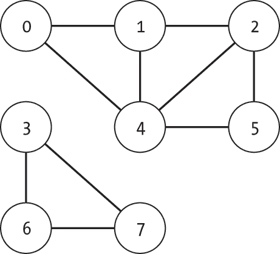
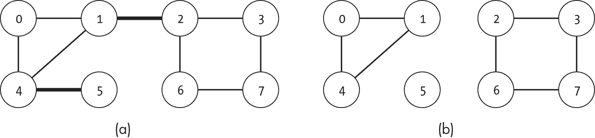
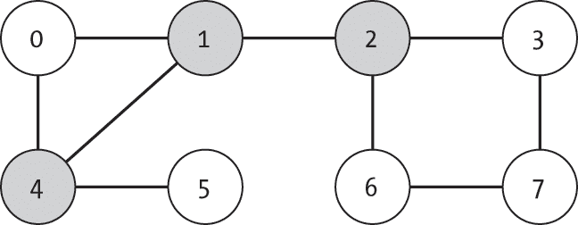
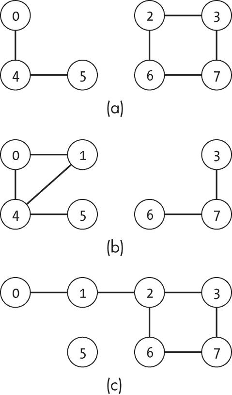
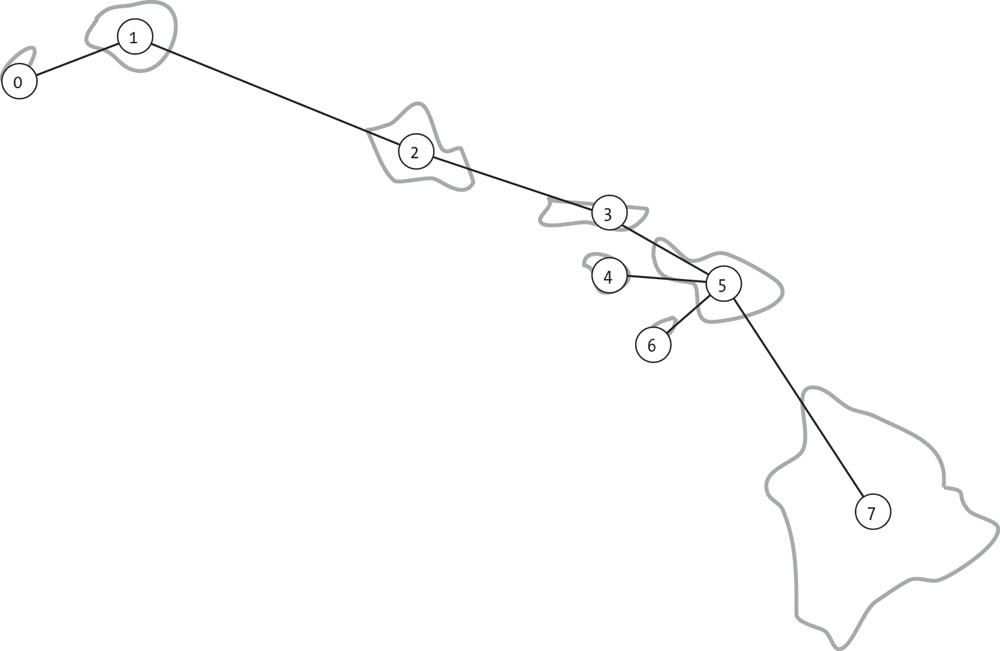
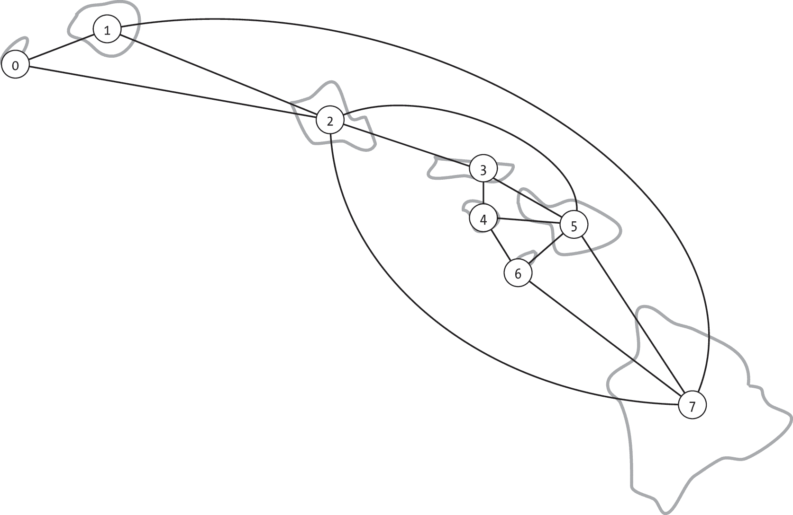
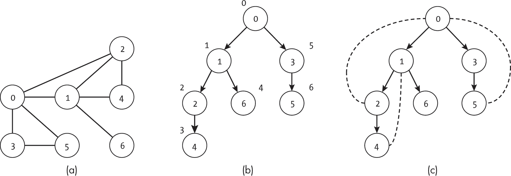
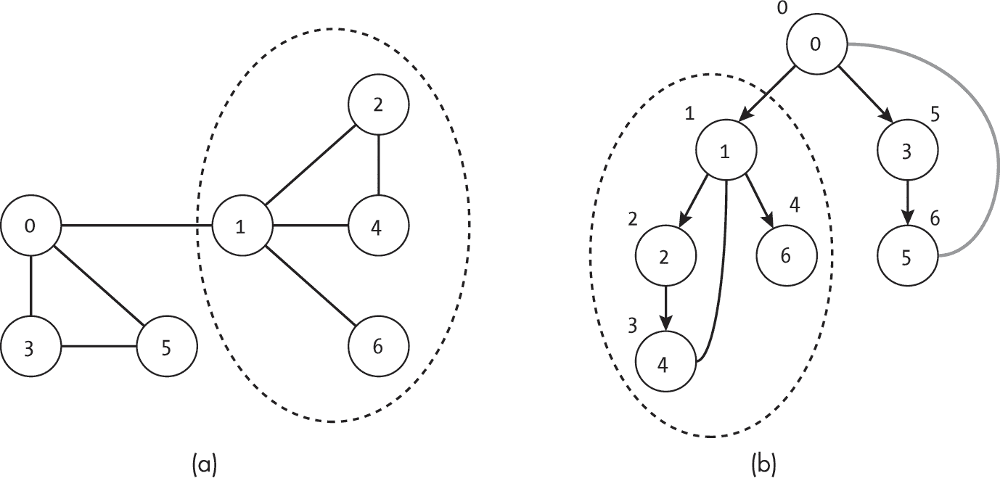
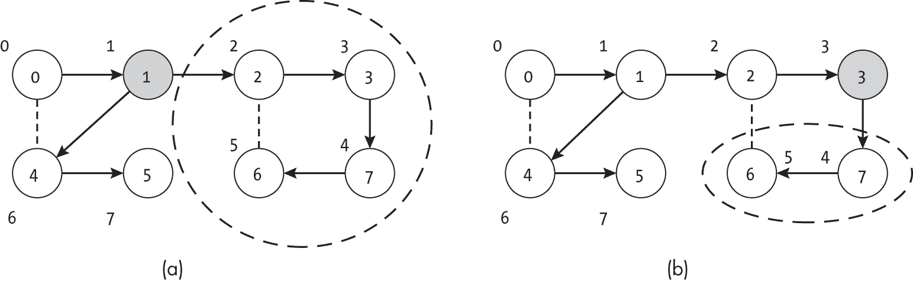
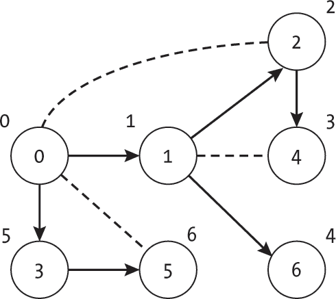

<hgroup>

## <samp class="SANS_Futura_Std_Bold_Condensed_B_11">11</samp> <samp class="SANS_Dogma_OT_Bold_B_11">桥和关节点</samp>

</hgroup>


在本章中，我们考虑连通性的另一个方面：在无向图中，维持连通分量完整性所必需的节点和边。这些分别被称为*关节点*和*桥*。理解哪些节点或边对维持连通性至关重要，对于一系列现实世界的问题非常重要。每当我们必须确保网络中没有单点故障时，我们就需要找出其桥和关节点。

在正式定义桥和关节点之后，本章提供了一些实际的示范性应用案例，这些概念可以应用于其中，比如为一组岛屿开发强健的交通网络，以及为邪恶的巫师构建最佳的秘密迷宫。接着，我们介绍了两种高效搜索这些元素的算法，基于第四章中介绍的深度优先搜索算法。

### <samp class="SANS_Futura_Std_Bold_B_11">桥和关节点的定义</samp>

对于无向图中的每一对节点，要使它们能够相互到达，它们必须属于同一个连通分量。在第三章中，我们学到了无向图中的连通分量是节点的一个子集 *V*′ ⊆ *V*，使得对于所有 *u* ∈ *V*′ 和 *v* ∈ *V*′，*u* 可以从 *v* 到达。以一系列由渡轮连接的岛屿为例。节点代表岛屿，边代表它们之间的渡轮路线。为了提供全面的旅行选项，交通规划者需要使得结果图包含一个单一的连通分量。也就是说，一个人必须能够在渡轮网络中通过直接连接或一系列旅行，在任何两个岛屿之间往返。

图 11-1 显示了一个包含两个独立连通分量{0, 1, 2, 4, 5}和{3, 6, 7}的示例图。



<samp class="SANS_Futura_Std_Book_Oblique_I_11">图 11-1：一个包含两个独立连通分量的图</samp>

*桥*是一个边，它的去除会将一个连通分量分割成两个不相交的分量。图 11-2(a)显示了一个包含两条桥（1, 2）和（4, 5）的示例图。移除其中任意一条边都会将单一的连通分量分割成两个。移除两条边都会将图分割成三个独立的连通分量，如图 11-2(b)所示。



<samp class="SANS_Futura_Std_Book_Oblique_I_11">图 11-2：一个有两个桥接点的图（a），以及移除桥接点后的三个独立组件（b）</samp>

类似地，*关节点*（或*割顶*）是一个节点，移除它会将一个连通组件拆分为两个或多个不相交的组件。例如，图图 11-3 中有三个关节点：阴影节点 1、2 和 4。



<samp class="SANS_Futura_Std_Book_Oblique_I_11">图 11-3：一个有三个关节点的图</samp>

图 11-4 展示了分别移除图 11-3 中的每个关节点所产生的影响。



<samp class="SANS_Futura_Std_Book_Oblique_I_11">图 11-4：移除不同关节点的结果</samp>

在图 11-4(a)中，移除节点 1 会产生两个组件 {0, 4, 5} 和 {2, 3, 6, 7}。在图 11-4(b)中，移除节点 2 会产生组件 {0, 1, 4, 5} 和 {3, 6, 7}，而移除节点 4 会产生组件 {0, 1, 2, 3, 6, 7} 和 {5}，如图 11-4(c)所示。

### <samp class="SANS_Futura_Std_Bold_B_11">用例</samp>

在图中识别桥接点和关节点对于理解网络中的单点故障至关重要。本节提供了一些现实世界中寻找桥接点和关节点的应用实例。我们首先展示如何将这些概念应用于创建一个具有韧性的渡轮网络，然后探讨如何将相同的技术扩展到防止疾病传播或构建最佳魔法迷宫。

#### <samp class="SANS_Futura_Std_Bold_Condensed_Oblique_BI_11">设计韧性网络</samp>

一个*韧性网络*需要能够优雅地处理单个边或节点的丢失，而不会失去连通性。为了扩展上一节中的岛屿示例，假设有两个假想的渡轮网络，连接八个夏威夷岛屿，如图 11-5 和图 11-6 所示。



<samp class="SANS_Futura_Std_Book_Oblique_I_11">图 11-5：假设的夏威夷岛屿之间渡轮航线的地图</samp>

图 11-5 展示了连接八个岛屿所需的最小渡轮网络。如果所有渡轮都正常运行，任何两个岛屿之间都可以互通。虽然可能需要经过多个跳跃才能到达目的地，但总会有一条路径。

然而，这个网络很脆弱。如果在欧胡岛（节点 2）和莫洛凯岛（节点 3）之间的渡轮出现故障，网络就会被分割成两部分。人们将无法从毛伊岛（节点 5）和尼伊豪岛（节点 0）之间旅行。图中的每条渡轮路线都是一个桥梁，任何一条线路的丧失都会使至少一个岛屿断开连接。同样，图 11-5 中的许多节点也是关节点。如果欧胡岛的渡轮码头（节点 2）因天气原因关闭，它将把考艾岛（节点 1）和毛伊岛（节点 5）隔断。

通过理解网络的桥梁和关节点，规划者可以设计出一个更强大的网络，没有桥梁，如图 11-6 所示。例如，即使渡轮出现故障（移除一条边），也不会切断任何两个岛屿之间的旅行。如果欧胡岛（节点 2）和莫洛凯岛（节点 3）之间的渡轮出现故障，旅行者仍然可以通过其他路线从毛伊岛（节点 5）前往尼伊豪岛（节点 0）。该网络也没有关节点。例如，如果毛伊岛的渡轮码头关闭，它只会断开该岛屿的连接。



<samp class="SANS_Futura_Std_Book_Oblique_I_11">图 11-6：夏威夷岛屿之间假设渡轮路线的第二张地图</samp>

我们可以将这些概念扩展到交通系统之外，应用到计算机网络、电网、通信网络或废水系统中。虽然通常最好设计没有桥梁或关节点的图，但这并不总是可行的。然而，了解一个网络的弱点仍然对规划有所帮助。

#### <samp class="SANS_Futura_Std_Bold_Condensed_Oblique_BI_11">防止疾病传播</samp>

想一想常见感冒是如何通过社交网络传播的。为了简化，我们假设你需要靠近一个生病的人才能得感冒。你不能从一个你永远不会见到的人那里感染感冒。如果这些边代表现实世界中人们之间的互动，那么病毒只能在邻近的节点之间传播。

我们可以使用桥梁和关节点的概念来模拟或阻止疾病的传播。与以前的同事进行的咖啡聚会就像一个桥梁，它允许感冒在两组原本不相交的人群之间传播：你以前的同事和你现在的同事。一个自我隔离并切断病毒在不同人群之间传播的人是一个关节点。通过几周不参加任何活动，你可以帮助防止感冒在不同的社交圈之间传播。你的跑步朋友、数据结构阅读小组的成员以及你的同事们，将只能各自限于他们自己的人群内传播感冒，而不会通过你互相传播。

#### <samp class="SANS_Futura_Std_Bold_Condensed_Oblique_BI_11">设计魔幻迷宫</samp>

与前两种情况不同，我们希望最小化桥梁和关节点，试想一个邪恶的巫师决定在他的迷宫中布置最有效的陷阱。一个作为迷宫两个部分唯一连接通道的隧道就是桥梁。如果一个部分包含迷宫入口，另一个部分包含目标，巫师知道所有的冒险者都必须经过这条隧道，这使得它成为布置最强大陷阱的理想地点。同样，必须穿过的房间以便在迷宫的两个部分之间移动就是关节点——部署高级怪物的理想场所。

在更常见的场景中，我们可以使用这些相同的技术，在关键的高速公路（桥梁）上设置收费站，或者在机场航站楼交汇处设置信息亭（关节点）。在这些情况下，我们利用这样一个事实：从图的一个部分到另一个部分的旅行者必须经过这个单一的节点或边。理解图的连通性可以帮助我们优化潜在稀缺或昂贵的资源。

### <samp class="SANS_Futura_Std_Bold_B_11">桥梁查找算法</samp>

计算机科学家罗伯特·塔尔扬（Robert Tarjan）提出了一系列有用的算法，用于通过图的深度优先搜索树的性质来理解图的结构。本节介绍了一种*桥梁查找算法*，它在无向图上使用了这一方法。该算法从一个任意节点开始深度优先搜索，并跟踪所用的边以及节点首次访问的顺序（*顺序索引*或*前序索引*，记作*order*(*u*)）。我们可以利用这些信息通过询问一个边是否是到达其子树中节点的唯一路径来寻找桥梁。那些不出现在深度优先搜索树*T*中的边可以立即排除为桥梁，因为我们已经能在不使用它们的情况下到达节点。这意味着我们只需考虑*T*中的边。

图 11-7 显示了一个图的示例以及其对应的深度优先搜索树的两种表示，树的根节点为 0。图 11-7(a)显示了初始图。图 11-7(b)显示了从节点 0 开始的深度优先搜索树；每个节点外的数字表示顺序索引。图 11-7(c)显示了相同的树，并将*未遍历的边*标为虚线。这些未遍历的边称为*回边*，它们回到在深度优先搜索过程中已经访问过的节点。



<samp class="SANS_Futura_Std_Book_Oblique_I_11">图 11-7：无向图（a），深度优先搜索树（b），以及包含未遍历边的深度优先搜索树（c）</samp>

我们可以通过查找指向 *T* 子树的边来识别桥，其中该子树的节点只与同一子树中的邻居相连。换句话说，如果边（*v*，*u*）是桥，则没有其他方式能够进出节点 *u* 的子树，除了通过边（*v*，*u*）进入或离开。在图 11-7(a)中，边（1，6）就是一个这样的例子，提供了进入或离开以节点 6 为根的子树的唯一路径。相反，边（0，3）不是桥，因为节点 5 有一条通往节点 0 的边。

这个算法的关键是我们可以查看 *u* 及其后代节点的邻域中的最小和最大顺序索引。根据深度优先搜索的性质，*u* 的子树中的所有节点的顺序索引都必须位于 [*order*（*u*），*order*（*u*） + *K* − 1] 范围内，其中 *K* 是子树中节点的数量（包括 *u*）。这是因为搜索在访问 *u* 后，先访问这些节点，然后才访问其他子树中的节点。如果 *u* 的子树中的节点有任何邻居，其顺序索引超出了这个范围，则通向该邻居的边将提供进入 *u* 子树的替代路径。

我们可以通过观察到任何未访问的节点，只要它可以从子树到达，就会被深度优先搜索所探索，从而出现在子树中，来简化问题。因此，我们只需要检查指向邻居且具有较低顺序索引的回边即可。我们可以通过检查边（*v*，*u*），其中 *v* 是 *u* 的父节点，是否为桥来进行测试，即检查 *u* 的子树中的任何节点是否有一个邻居 *w*，使得 *order*（*w*） < *order*（*u*），并排除连接（*v*，*u*）本身。如果存在这样的邻居，我们就找到了一个绕过（*v*，*u*）的回边，并且可以确定（*v*，*u*）不是桥。相反，如果在排除连接（*v*，*u*）的情况下，所有子树邻居 *w* 的 *order*（*w*） ≥ *order*（*u*），则（*v*，*u*）是一个桥。

图 11-7 中的节点 2 提供了一个此类情况的例子。搜索通过边（1，2）到达节点 2，并将其分配了顺序索引 2，如图 11-7(b)所示。为了使边（1，2）成为一座桥，必须没有从该子树出去的替代路径。然而，节点 2 本身有一条通向节点 0（顺序 = 0）的边，从而提供了这样的替代路径。

相反的情况显示在图 11-8 中，边 (0, 1)。图 11-8(a)中的图与图 11-7(a)中的图稍有不同，排除了边 (0, 2)，因此边 (0, 1) 现在是一个桥接边。图 11-8(b) 显示了以节点 0 为根的对应深度优先搜索子树，其中未遍历的边以灰色显示。两幅图中的虚线椭圆表示节点 1 的子树。如图 11-8(b)所示，从节点 1 的子树到顺序小于 1 的节点的唯一连接是边 (0, 1) 本身。



<samp class="SANS_Futura_Std_Book_Oblique_I_11">图 11-8：一个无向图 (a) 和一个深度优先搜索树 (b)</samp>

桥接查找算法通过记录邻接任何子树节点的最低序号，检查深度优先搜索树中的每个子树。唯一排除的邻接边是子树根节点 *u* 与其父节点之间的链接，因为这就是我们正在测试的边。

#### <samp class="SANS_Futura_Std_Bold_Condensed_Oblique_BI_11">代码</samp>

我们可以通过一次深度优先搜索来实现桥接查找算法。为了简化代码，我们将使用辅助数据结构 <samp class="SANS_TheSansMonoCd_W5Regular_11">DFSTreeStats</samp> 来跟踪深度优先搜索到达各个节点的顺序信息，包括：

<samp class="SANS_TheSansMonoCd_W7Bold_B_11">parent</samp> **(**<samp class="SANS_TheSansMonoCd_W7Bold_B_11">list</samp>**) **将每个节点的索引映射到其在深度优先搜索树中的父节点索引

<samp class="SANS_TheSansMonoCd_W7Bold_B_11">next_order_index</samp> **(**<samp class="SANS_TheSansMonoCd_W7Bold_B_11">int</samp>**) **存储下一个要分配的顺序索引

<samp class="SANS_TheSansMonoCd_W7Bold_B_11">order</samp> **(**<samp class="SANS_TheSansMonoCd_W7Bold_B_11">list</samp>**) **将每个节点的索引映射到其顺序索引

<samp class="SANS_TheSansMonoCd_W7Bold_B_11">lowest</samp> **(**<samp class="SANS_TheSansMonoCd_W7Bold_B_11">list</samp>**) **将每个节点映射到其深度优先搜索子树或其直接邻居（不包括节点的父节点）中的 *最低* 顺序索引

数据结构 <samp class="SANS_TheSansMonoCd_W5Regular_11">DFSTreeStats</samp> 提供了这个信息的封装，避免了我们需要将许多参数传递给搜索函数。我们还可以使用该对象执行基本的赋值和更新操作。我们在以下代码中定义了 <samp class="SANS_TheSansMonoCd_W5Regular_11">DFSTreeStats</samp>：

```
class DFSTreeStats:
    def __init__(self, num_nodes: int): 
      ❶ self.parent: list = [-1] * num_nodes
        self.next_order_index: int = 0
        self.order: list = [-1] * num_nodes
        self.lowest: list = [-1] * num_nodes

    def set_order_index(self, node_index: int):
        self.order[node_index] = self.next_order_index
        self.next_order_index += 1
      ❷ self.lowest[node_index] = self.order[node_index] 
```

构造函数将所有信息设置为初始值❶。代码将<samp class="SANS_TheSansMonoCd_W5Regular_11">parent</samp>、<samp class="SANS_TheSansMonoCd_W5Regular_11">order</samp>和<samp class="SANS_TheSansMonoCd_W5Regular_11">lowest</samp>列表的所有条目初始化为<samp class="SANS_TheSansMonoCd_W5Regular_11">-1</samp>，以表示这些值尚未为每个节点设置。它将<samp class="SANS_TheSansMonoCd_W5Regular_11">next_order_index</samp>设置为<samp class="SANS_TheSansMonoCd_W5Regular_11">0</samp>，以准备处理第一个节点。

辅助方法<samp class="SANS_TheSansMonoCd_W5Regular_11">set_order_index()</samp>记录当前节点的顺序索引，并增加下一个要分配的顺序索引。它还初始化该节点的最低顺序索引，初始值为该节点自身的顺序索引❷。

我们使用来自第四章的深度优先搜索，来填写<samp class="SANS_TheSansMonoCd_W5Regular_11">DFSTreeStats</samp>的条目并查找桥。

```
def bridge_finding_dfs(g: Graph, index: int, stats: DFSTreeStats, results: list):
  ❶ stats.set_order_index(index)

    for edge in g.nodes[index].get_sorted_edge_list():
        neighbor: int = edge.to_node
      ❷ if stats.order[neighbor] == -1:
            stats.parent[neighbor] = index
            bridge_finding_dfs(g, neighbor, stats, results)
          ❸ stats.lowest[index] = min(stats.lowest[index],
                                      stats.lowest[neighbor])
          ❹ if stats.lowest[neighbor] >= stats.order[neighbor]:
                results.append(edge)
        elif neighbor != stats.parent[index]:
          ❺ stats.lowest[index] = min(stats.lowest[index],
                                      stats.order[neighbor])

def find_bridges(g: Graph) -> list:
    results: list = []
    stats: DFSTreeStats = DFSTreeStats(g.num_nodes)
    for index in range(g.num_nodes):
        if stats.order[index] == -1:
            bridge_finding_dfs(g, index, stats, results)
    return results 
```

递归辅助函数<samp class="SANS_TheSansMonoCd_W5Regular_11">bridge_finding_dfs()</samp>通过使用<samp class="SANS_TheSansMonoCd_W5Regular_11">set_order_index()</samp>辅助方法❶，首先设置当前节点的顺序索引和子树中可达的最低顺序索引的初始值。

代码接着使用<samp class="SANS_TheSansMonoCd_W5Regular_11">for</samp>循环检查每个节点的邻居。为了与其他示例中的顺序保持一致，我们使用函数<samp class="SANS_TheSansMonoCd_W5Regular_11">get_sorted_edge_list()</samp>按顺序遍历邻居，尽管按排序顺序遍历对于算法的正确性并非必要。如果某个邻居尚未访问（其<samp class="SANS_TheSansMonoCd_W5Regular_11">order</samp>值未设置）❷，代码将其父节点设置并递归地探索它。递归调用返回后，代码通过比较子节点的<samp class="SANS_TheSansMonoCd_W5Regular_11">lowest</samp>条目与它自身的<samp class="SANS_TheSansMonoCd_W5Regular_11">lowest</samp>条目❸，检查是否找到了邻近子树的较小顺序索引。

此时，搜索已完成对以<samp class="SANS_TheSansMonoCd_W5Regular_11">neighbor</samp>为根的深度优先搜索子树的探索。它可以通过比较子树中任何节点或其直接邻居的最低顺序索引与子树根节点的顺序索引，来检查<samp class="SANS_TheSansMonoCd_W5Regular_11">edge</samp>是否为桥❹。代码将新发现的桥添加到<samp class="SANS_TheSansMonoCd_W5Regular_11">result</samp>中。

如果邻居已被访问（其 <samp class="SANS_TheSansMonoCd_W5Regular_11">order</samp> 值已设置），代码首先检查邻居是否是父节点。如果是，那么正在考虑的边刚刚被遍历过，搜索将忽略它。否则，代码会检查该邻居是否代表子树外的节点，通过检查该邻居的顺序索引 ❺。

<samp class="SANS_TheSansMonoCd_W5Regular_11">find_bridges()</samp> 函数提供了一个封装器，用于设置统计信息和 <samp class="SANS_TheSansMonoCd_W5Regular_11">results</samp> 数据结构，然后开始搜索。代码通过执行一次深度优先搜索来找到每个连通分量中的所有桥，使用的方式是从 Listing 4-2 中改编而来。由于每个节点仅访问一次，每条边最多检查两次（每个方向一次），因此整个算法的成本是 |*V* | + |*E*|。

#### <samp class="SANS_Futura_Std_Bold_Condensed_Oblique_BI_11">示例</samp>

图 11-9 显示了在一个具有八个节点的图上运行桥查找算法的示例。每个子图显示了搜索完成访问圈中节点后的状态。<samp class="SANS_TheSansMonoCd_W5Regular_11">DFSTreeStats</samp> 的列表 <samp class="SANS_TheSansMonoCd_W5Regular_11">order</samp> 和 <samp class="SANS_TheSansMonoCd_W5Regular_11">low</samp> 被展示。箭头表示到目前为止遍历的边，而虚线边表示已经被搜索到但未遍历的边，粗体灰色箭头表示桥。

图 11-9(a) 显示了搜索完成节点 6 后算法的状态。此时，算法已初步访问并为节点 0、1、2、3、7 和 6 设置了先序索引。节点 4 和 5 未被访问，因此没有先序索引。同样，低值与算法在访问已访问节点的子节点后获得的状态相对应。节点 6 的最终状态是 <samp class="SANS_TheSansMonoCd_W5Regular_11">最低</samp>，因为搜索已经完成了对它的处理。相比之下，节点 3 的 <samp class="SANS_TheSansMonoCd_W5Regular_11">最低</samp> 值尚未最终确定，因为算法尚未完成对其子树的搜索。

在 图 11-9(b) 中，搜索回溯到节点 7 并完成了该节点。在此过程中，算法检查边(7, 6)是否可能是桥。由于 <samp class="SANS_TheSansMonoCd_W5Regular_11">lowest[6]</samp> 小于 <samp class="SANS_TheSansMonoCd_W5Regular_11">order[6]</samp>，我们知道从子树中存在一条备用路径（通过节点 2），因此该边不是桥。

![每个子图显示一个具有八个节点的图以及两个数组中的值。在(A)中，节点 6 被圈出，order 数组包含[0, 1, 2, 3, –1, –1, 5, 4]，low 数组包含[0,1, 2, 3, –1, –1, 2, 4]。](../images/f11009.jpg)

<samp class="SANS_Futura_Std_Book_Oblique_I_11">图 11-9：桥接算法的各个阶段</samp>

根据图 11-9(e)，搜索已经找到了第一个桥接边。虽然它还没有完成处理节点 1，但已经完全搜索了以节点 2 为根的子树。在从节点 2 返回后，算法发现<samp class="SANS_TheSansMonoCd_W5Regular_11">lowest[2]</samp>等于<samp class="SANS_TheSansMonoCd_W5Regular_11">order[2]</samp>，表明边（1, 2）是通向或离开以节点 2 为根的子树的唯一路径。它将（1, 2）添加到桥接边列表中，然后继续处理节点 1 的其他子节点。在图 11-9(f)中，完成了以节点 5 为根的子树后，搜索发现边（4, 5）必定是另一个桥接边，因为删除该边会使节点 5 与其他节点断开连接。

为了形象化这一过程，想象我们的邪恶巫师正在检查他们新创建的魔法迷宫。他们首先开始走迷宫，建立一个深度优先树，并在每个房间的墙上用粉笔标记该房间的前序索引。每当他们进入一个新房间时，他们会递归地探索任何未访问的邻居房间，并探头查看以前访问过的邻居房间，检查墙上的标记。当他们访问到“松动天花板砖房间”时，他们可能会发现一个新邻居，“丑陋地毯房间”，并且还会找到一条通向先前访问过的“总是令人不舒服的温暖房间”的连接。在整个过程中，他们记录下进入每个房间以来看到的最小编号。

在回溯通过每个走廊后，巫师检查他们的笔记，以确定他们刚刚访问过的任何房间是否有邻近房间，其前序索引小于走廊尽头的房间（即他们回溯时刚离开的房间）。在回溯通过他们个人最喜欢的“吊灯过多走廊”后，巫师实际上是在问：“是否还有其他通道可以让冒险者到达前面的某个房间？还是他们必须穿过‘吊灯过多走廊’？”如果没有其他通道，他们可以将“吊灯过多走廊”标记为一个桥接边，并且高兴地知道冒险者总会看到这个华丽装饰的通道，同时还计划设置一个很好的陷阱。

### <samp class="SANS_Futura_Std_Bold_B_11">一种寻找关节点的算法</samp>

我们可以通过考虑每个子树的根节点，而不是直接与它们相连的边，使用非常相似的逻辑，来将桥接查找算法适应为识别关节点。我们通过寻找一个节点*u*来识别关节点，该节点的深度优先搜索树中的后代没有任何邻居位于该树中的*u*之上。一个来自树外节点的边，连接到*u*的后代之一，将为*u*提供一个关键的替代路径。

要理解如何使用节点的子树来识别关节点，考虑图 11-10 中展示的两种情况。我们将深度优先搜索的子树映射到原始无向图上，并用箭头标示每个节点的顺序索引。当前正在考虑的节点被阴影标出，节点的后代由虚线边界标示。



<samp class="SANS_Futura_Std_Book_Oblique_I_11">图 11-10：图中深度优先搜索树中的两个节点及其子树</samp>

在图 11-10(a)中，算法正在考虑节点 1 及其后代 {2, 3, 6, 7}。移除节点 1 会将其后代与图的其余部分断开。相比之下，节点 3 不是一个关节点，如图 11-10(b)所示。该节点的后代包括节点 6，而节点 6 有一条通向节点 2 的链接（在节点 3 的子树外）。边 (2, 6)，尽管不包含在深度优先搜索树中，但在节点 3 被移除时，提供了通向节点 6 和 7 的备用路径。

这个逻辑适用于除根节点外的每个节点。由于根节点没有祖先，我们不能使用相同的方法来检查子树是否有回边。相反，我们必须寻找根节点有多个子树的情况。如图 11-11 中的示例图所示，只有当图的组件在根节点被移除后会断开时，根节点才会有多个子树。如果子树之间有一条连接边，深度优先搜索会在返回根节点之前先遍历该边。



<samp class="SANS_Futura_Std_Book_Oblique_I_11">图 11-11：根节点为关节点的深度优先子树</samp>

我们可以将专业的根节点测试与桥接检测算法中的下界追踪相结合，以识别图中的关节点，如以下代码所示。

#### <samp class="SANS_Futura_Std_Bold_Condensed_Oblique_BI_11">代码</samp>

与桥接查找算法类似，我们通过一次深度优先搜索实现*关节点查找算法*，该算法同时完成搜索和识别。我们重复使用<samp class="SANS_TheSansMonoCd_W5Regular_11">DFSTreeStats</samp>数据结构来跟踪并更新每个节点的父节点、顺序索引和最低可达顺序索引的信息。

为了简化代码，我们将搜索分为两个函数。第一个函数处理非根节点并执行递归探索：

```
def articulation_point_dfs(g: Graph, index: int, stats: DFSTreeStats,
                           results: set): 
  ❶ stats.set_order_index(index)
    for edge in g.nodes[index].get_edge_list():
        neighbor: int = edge.to_node
        if stats.order[neighbor] == -1:
            stats.parent[neighbor] = index
            articulation_point_dfs(g, neighbor, stats, results)
          ❷ stats.lowest[index] = min(stats.lowest[index],
                                      stats.lowest[neighbor])

          ❸ if stats.lowest[neighbor] >= stats.order[index]:
                results.add(index)

        elif neighbor != stats.parent[index]:
          ❹ stats.lowest[index] = min(stats.lowest[index],
                                      stats.order[neighbor]) 
```

递归函数 <samp class="SANS_TheSansMonoCd_W5Regular_11">articulation_point_dfs()</samp> 执行了此算法的大部分工作。它首先设置当前节点的顺序索引和暂定下界 ❶，然后通过遍历每个邻居来执行深度优先搜索，检查是否已访问，如果没有，则递归地进行探索。

代码跟踪任何节点在子树中邻居的下界。对于深度优先搜索树中的子树（先前未探索的节点），代码会根据该子树的最低邻居来更新下界 ❷。标识关节点的逻辑发生在每个子节点的递归探索之后。代码通过检查该子树中的任何节点是否包含一个在深度优先搜索树中高于当前节点的邻居 ❸ 来确定当前节点的移除是否会切断它刚刚访问过的子树。

对于那些不属于深度优先搜索子树（先前已探索的节点）且不是当前节点的父节点的邻居，代码会将节点的下界与邻居的顺序索引进行比较 ❹。

对于根节点，我们添加了一些额外的逻辑来跟踪子树的数量：

```
def articulation_point_root(g: Graph, root: int,
                            stats: DFSTreeStats, results: set): 
    stats.set_order_index(root)
    num_subtrees: int = 0 for edge in g.nodes[root].get_edge_list():
        neighbor: int = edge.to_node
      ❶ if stats.order[neighbor] == -1:
            stats.parent[neighbor] = root
            articulation_point_dfs(g, neighbor, stats, results)
            num_subtrees += 1

  ❷ if num_subtrees >= 2:
        results.add(root) 
```

<samp class="SANS_TheSansMonoCd_W5Regular_11">articulation_point_root()</samp> 函数首先设置根节点的顺序索引，并初始化 <samp class="SANS_TheSansMonoCd_W5Regular_11">num_subtrees</samp> 计数器。然后，它通过遍历每个邻居，检查是否已访问过 ❶，如果没有，则使用 <samp class="SANS_TheSansMonoCd_W5Regular_11">articulation_point_dfs()</samp> 函数递归地进行探索。代码不是通过使用下界逻辑来判断根节点是否为关节点，而是直接检查根节点是否有两个或更多的子树 ❷。如果是，它将根节点添加到结果中。

查找所有关节点的函数是通过使用 <samp class="SANS_TheSansMonoCd_W5Regular_11">articulation_point_root()</samp> 函数在图中的每个连通分量上运行此搜索：

```
def find_articulation_points(g: Graph) -> set:
    stats: DFSTreeStats = DFSTreeStats(g.num_nodes)
    results: set = set()
    for index in range(g.num_nodes):
      ❶ if stats.order[index] == -1:
            articulation_point_root(g, index, stats, results)
    return results 
```

<samp class="SANS_TheSansMonoCd_W5Regular_11">find_articulation_points()</samp> 函数首先创建并初始化算法所需的数据结构。由于数据结构是通过节点进行索引的，并且不同的连通分量是离散的，因此代码可以使用单一的 <samp class="SANS_TheSansMonoCd_W5Regular_11">stats</samp> 和 <samp class="SANS_TheSansMonoCd_W5Regular_11">results</samp> 对象来处理所有连通分量。然后，代码遍历每个节点，检查是否已经通过搜索访问过 ❶，如果没有，则从该节点开始新的深度优先搜索。最后，它返回所有关节点的列表。

#### <samp class="SANS_Futura_Std_Bold_Condensed_Oblique_BI_11">一个示例</samp>

图 11-12 展示了寻找关节点算法的示意图。每个子图显示了算法在*完成*访问圈中节点后的状态。被测试的边通过箭头表示，如果它们是深度优先搜索树的一部分，或者通过虚线表示，如果它们不是。未探索的边是实心灰色线，已发现的关节点则被阴影标出。

![每个子图展示了一个包含八个节点的图，并且有两个数组的值。在（A）中，节点 6 被圈出，order 数组包含[0, 1, 2, 3, –1, –1, 5, 4]，low 数组包含[0, 1, 2, 3, –1, –1, 2, 4]。](../images/f11012.jpg)

<samp class="SANS_Futura_Std_Book_Oblique_I_11">图 11-12：关节点查找算法的各个阶段</samp>

图 11-12 中展示的大部分算法行为与图 11-9 中的行为相同。节点被探索的顺序以及每一步中<samp class="SANS_TheSansMonoCd_W5Regular_11">DFSTreeStats</samp>的值是相同的。行为上的区别出现在图 11-12(d)中检测到关节点的地方。任何以节点 3 为根的子树的邻居的最低顺序索引是 2，即当前节点的顺序索引。我们知道节点 2 至少有一个没有与任何祖先节点连接的子树，这意味着移除节点 2 会断开该子树。

图 11-12(e)很有趣，因为尽管它显示了完成节点 5 后的状态，但算法已经将（未完成的）节点 1 标记为关节点，这是因为在检查每个子树后，执行了关节点测试。无论在探索节点 1 的其他后代时发生什么，我们都知道移除该节点会断开以节点 2 为根的子树。

图 11-12(h)展示了算法的最后一步。在这一点上，搜索已经从对<samp class="SANS_TheSansMonoCd_W5Regular_11">articulation_point_dfs()</samp>函数的调用返回，并正在测试根节点。它没有使用低边界，而是检查根节点有多少个子树，揭示出节点 0 只有一个深度优先搜索子树。图中的所有节点在搜索返回节点 0 之前，都通过节点 1 被访问。因此，节点 0 不是关节点。

### <samp class="SANS_Futura_Std_Bold_B_11">为什么这很重要</samp>

桥和关节点对于理解图的结构至关重要，包括它们的故障点和瓶颈。正如我们在示例用例中所见，这些特性适用于各种现实世界问题，从将冗余路线纳入航空网络，到设计终极魔法迷宫。

本章介绍的算法提供了实用的方法，用于识别这些结构元素，并利用深度优先搜索树和顺序索引来确定哪些节点可以通过替代路径到达。这再次突显了简单的深度优先搜索的强大和多功能性，并展示了如何通过增加顺序索引等信息，深入理解图的整体结构。

下一章将进一步扩展我们关于连通性的讨论，这次将考虑有向图以及相关的强连通分量概念。我们介绍了一种算法，该算法基于本章中介绍的利用深度优先搜索收集统计信息来理解图结构的思想。
