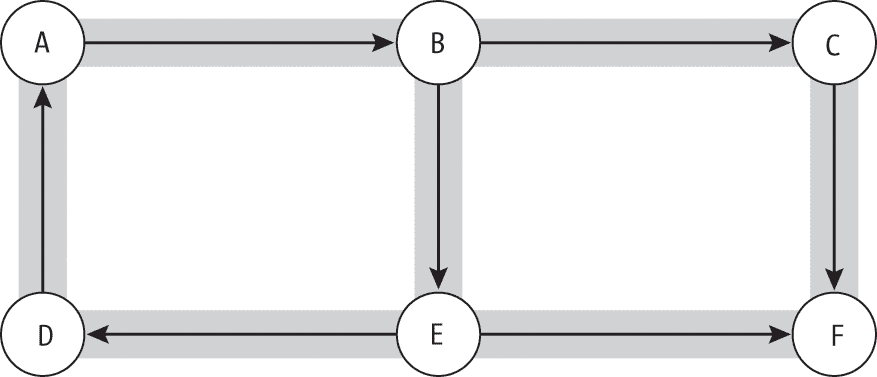
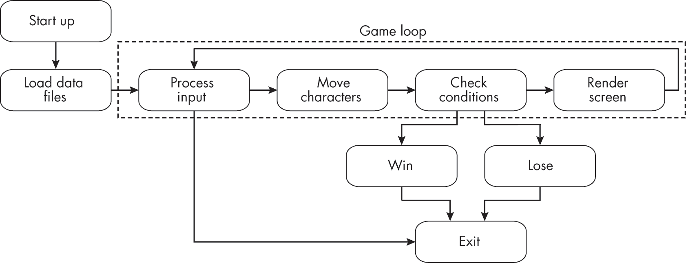
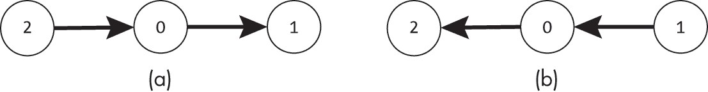
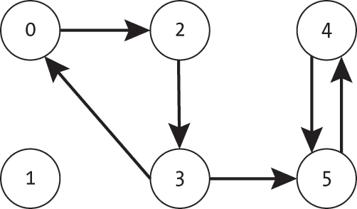
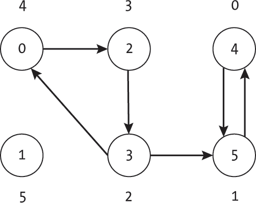
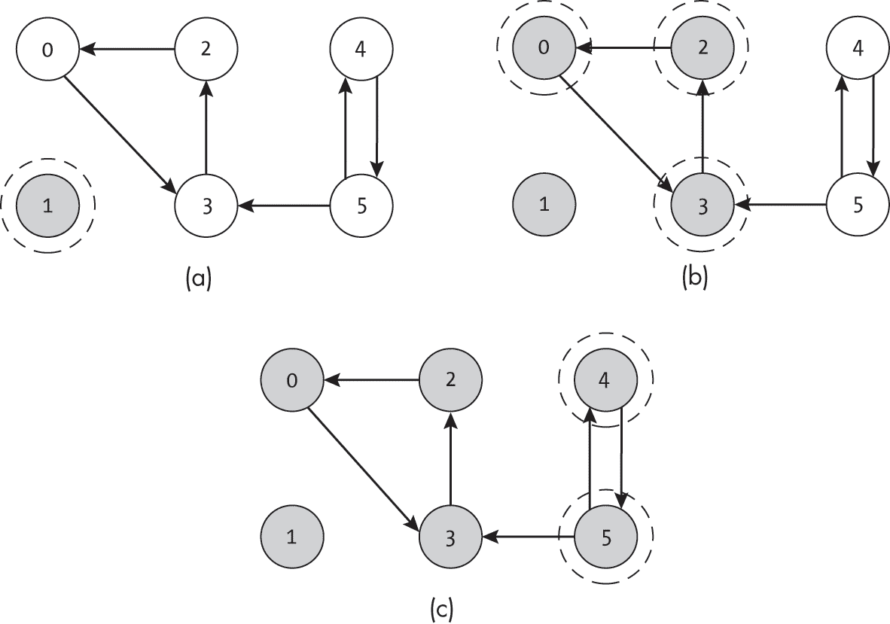

## 第十二章：12 强连通分量


前几章使用无向图上的连通分量来回答诸如“我们能从这里到达某个位置吗？”或“移除此边会破坏图的连通性吗？”这类问题。随着我们开始思考*方向性*，这些问题和解答它们的算法变得更加复杂。当我们考察有向图上的*可达性*时，单纯地说“我们能从 A 到 B”已经不再足够。我们需要理解是否能返回到 A，如果不能，这将如何影响图的遍历。

本章探讨了*强连通分量*的概念，这是有向图中一组节点，使得该组中的任何节点都可以从该组中的任何其他节点到达。这些分量帮助我们理解图的结构以及如何遍历图。我们首先正式介绍强连通分量的概念，并提供检查一组节点是否强连通的示例代码。我们还描述了一些强连通分量的实际应用，包括建模计算机程序如何在某些状态下卡住，以及信息如何通过社交网络流动，然后讨论一个识别图的强连通分量的示例算法。

### 定义强连通分量

有向图中强连通分量的正式定义是一个最大节点集*V'* ⊆ *V*，使得对于任何两个节点*u* ∈ *V'*和*v* ∈ *V'*，存在一条从*u*到*v*的有向边路径。换句话说，您可以从同一分量中的任何其他节点出发，到达强连通分量中的任何节点。如果有向图中的每个节点都属于同一个强连通分量，则我们称该图为*强连通*。

我们可以通过交通网络来直观地理解强连通分量的重要性。让我们回到一个邪恶巫师设计的神奇迷宫，如第十一章所介绍的那样。为了阻止冒险者迷路，巫师使用单向门连接迷宫中的每个房间，如图 12-1 所示。这样，他们就给每条路径设定了预定义的流向。例如，冒险者可以通过房间 A 和 B 之间的门从 A 到 B，但无法反向通过。



图 12-1：一个模型，表示六个房间之间的单向门

这种方法超出了巫师的预期。他们原本只希望防止冒险者回溯并从后方袭击他们的爪牙。然而，他们发现某些房间变得无法从其他房间到达。迷宫包含多个强连通组件：{A, B, D, E}，{C} 和 {F}。冒险者可以从房间 A 穿越到 B，再到 E，再到 D，并返回 A，而不会触及任何门。然而，一旦他们需要离开这个组件，灾难就发生了。进入房间 C 的冒险者很快发现，他们无法找到回到房间 A、B、D 或 E 的路径。随着时间的推移，冒险者实际上被引导进入房间 F，这使得巫师能够将他们困在这个房间，并让他们与一只 BOSS 级怪物对抗。

#### 确定哪些节点是相互可达的

理解并构建强连通组件的关键在于确定哪些节点是*相互可达*的。让我们首先回顾一下节点 *v* 从节点 *u* 可达的含义。如在第三章的“可达性”中所述，节点 *v* 只有在存在一系列（有向）边，形成从节点 *u* 到节点 *v* 的连续路径时，才算从节点 *u* 可达。根据这个定义，每个节点都可以从自身可达，方法是使用空边集；我们可以通过不移动到达自己所在的位置。

我们可以定义一个辅助函数 get_reachable()，通过广度优先搜索来获取从给定起始索引（index）开始，在有向图 g 中所有可达节点的集合。我们使用 set 数据结构来追踪当前搜索过程中可达的节点以及已经访问过的节点，如列表 12-1 所示。

```
def get_reachable(g: Graph, index: int) -> set:  
    seen: set = set()
    pending: queue.Queue = queue.Queue()

  ❶ seen.add(index)
    pending.put(index)

  ❷ while not pending.empty():
        current_index: int = pending.get()
        current: Node = g.nodes[current_index]
        for edge in current.get_edge_list():
            neighbor: int = edge.to_node
          ❸ if neighbor not in seen:
                pending.put(neighbor)
                seen.add(neighbor)

    return seen 
```

列表 12-1：获取从给定节点可达的节点索引集合

代码首先设置数据结构：一个已经访问过的、因此可达的节点集合（seen）和一个待探索的未来节点索引队列（pending）。注意，使用队列数据结构要求我们在文件中包含 import queue。代码将初始节点（index）同时添加到 seen 集合和待探索的节点索引队列 ❶ 中。

该代码使用广度优先搜索来发现图中所有其他可达的节点。当仍有节点可供探索（即pending不为空）❷时，代码将出队下一个索引，检索该节点，并使用for循环检查其每个邻居。如果代码之前未遇到过某个邻居，则该邻居的索引将被添加到队列和seen集合中❸。当代码没有更多节点可供探索时，它返回已见索引的集合。该集合包括所有可以从index到达的节点。

示例 12-1 中的算法就像一个有条不紊的冒险者在规划穿越魔法迷宫的旅程，且他们手中有一张地图。冒险者维护一个待评估房间的列表（队列），列表初始时只有入口一个房间。在每一步，他们从列表中取出顶部的房间，划去它，仔细在地图上找到它的位置，并检查相邻的房间。他们将任何未探索的邻居添加到列表的底部，并在地图上为该房间画上整齐的勾号。然后，他们继续评估房间，从列表中取出顶部（或最旧）的项，直到列表为空。

#### 确定节点是否强连接

我们可以使用示例 12-1 中的可达性函数来定义一种暴力检查，来判断一组节点（由索引列表inds给出）是否强连接，如下代码所示：

```
def check_strongly_connected(g: Graph, inds: list) -> bool: 
    for i in inds:
        reachable = get_reachable(g, i)
        for other in inds:
            if other not in reachable:
                return False
    return True 
```

该代码使用一对嵌套的for循环来检查组件中每个节点是否可以从其他每个节点到达。它从inds中的每个节点索引开始，并使用来自示例 12-1 的get_reachable()辅助函数生成可达节点的集合。然后，它检查inds中的每个索引是否出现在此可达集合中。如果任何节点无法从其他节点到达，则该函数返回False。否则，它返回True。

尽管 check_strongly_connected() 函数很简单，仅由两个循环和一个辅助搜索函数组成，但它不是一种高效的方法。我们在这里介绍它，是因为它提供了一个易于理解和直观的概述，说明了一个节点集合需要满足什么条件才能是强连通的。它相当于一个不幸的冒险者，每次从可能的每个房间开始探索迷宫，并记录他们到达的目的地。对于一组 |*V*| 节点，该函数需要运行 |*V*| 次搜索，然后检查其他 |*V*| – 1 个节点与结果可达集合的关系。

更糟糕的是，check_strongly_connected() 函数并没有告诉我们是否有节点缺失在强连通分量中。记住，强连通分量是*最大*的互相可达节点集合。该函数仅告诉我们列表中每一对节点是否互相可达，但没有告诉我们其他哪些节点可能属于该集合。

### 用例

在图中识别强连通分量对于理解图中的可能移动至关重要。本节提供了一些识别强连通分量的实际应用：分析程序中的操作流、网络中的八卦传播流以及交通网络的遍历能力。

#### 计算机程序状态建模

我们可以将计算机程序的状态建模为有向图。启动状态可能是一个节点，连接到加载初始数据、初始化变量和检查网络连接的状态。例如，图 12-2 显示了视频游戏中的状态图。程序的各个状态代表处理用户输入和渲染屏幕。虚线表示核心游戏循环，它形成一个强连通分量，其中每个状态都可以从其他状态到达。然而，诸如加载初始数据文件或退出游戏的状态不属于该分量；一旦加载了初始数据文件，程序就不会再返回到该状态。



图 12-2：作为程序状态集建模的一个玩具视频游戏

计算机程序可能有多个强连通分量，封装了不同的操作或逻辑。例如，一个数据分析程序可能有一个强连通分量用于批量处理文件中的数据，另一个用于允许用户交互。

#### 理解一个八卦网络

寻找图的强连通分量的能力可以帮助我们确定信息在有向通信网络中的传播范围。对于这样的网络，一个强连通分量就是一组人，如果其中一个人知道某些信息，那么整组人都会知道。也就是说，信息会从该组中的任何一个节点传递到该组中所有其他节点。

考虑图示 图 12-3 中的社交网络，其中每个节点代表一个个体。从节点 *u* 到节点 *v* 的边表示人 *u* 会告诉人 *v* 一个关于新图算法书籍发布的激动人心的谣言。没有边表示没有这种沟通。如果某个节点分享了一个谣言，那么这些信息将传播到从起始节点可达的所有节点。


图 12-3：一个模拟通信网络的图

强连通分量提供了对完全共享信息的群体的洞察。在 图 12-3 中，节点 0、1、3 和 4 形成了一个强连通分量。任何节点 4 分享的信息最终都会被该分量中的其他节点了解。

请记住，信息仍然可以在不同强连通分量之间的两个节点之间流动。在 图 12-3 中，节点 5 分享的任何信息最终都会通过节点 4 传递到节点 0。然而，反过来则不成立。由于节点 4 不与节点 5 分享信息，因此节点 5 和 2 被切断了来自图左侧的秘密。直到该图算法书籍正式发布前，他们不会知道这本书的消息。

#### 规划一个旅行网络

在规划一个真实世界的旅行网络时，理解其中涉及的强连通分量是至关重要的。在旅行的上下文中，一个强连通分量对于旅行者进行圆形旅行是必需的。如果两个地点不在同一个强连通分量中，比如带有单向门的巫师地牢，那么任何穿越该网络的人可能会陷入某些地点的子集中。

例如，在一个航空网络中，从城市 *u* 可到达的任何城市 *v* 必须属于同一个强连通分量。否则，第一组的飞机和乘客将被困在第二组中。如果一家航空公司提供从多伦多到珀斯的一系列航班，它们还需要提供另一组航班，将飞机和乘客送回多伦多。

请注意，航空网络不必严格地形成一个单一的连通分量，因为航空公司可以用两个不同的强连通分量服务两个不相交的市场。也许它运营着一个服务佛罗里达城市的通勤网络，并且有一个独立的网络覆盖新英格兰。然而，每个子网络必须是强连通的。

设计任何交通网络时，都会考虑到相同的因素。如果城市某个区域只有单向的进站路，那将是一个灾难。通勤者只能开车进入该区域，却无法离开。这个区域很快就会被汽车塞满，绝望的司机试图寻找任何逃离的办法，持续的鸣笛声让局面更加混乱。

### Kosaraju-Sharir 算法

*Kosaraju-Sharir 算法*（或简称*Kosaraju 算法*）是一种实用、易懂且可视化的算法，用于查找强连通分量。在他们的书《数据结构与算法》（Addison-Wesley，1983 年）中，Aho、Hopcroft 和 Ullman 描述了这一方法是由计算机科学家 S. Rao Kosaraju 和 M. Sharir 独立发明的。该算法通过使用一对深度优先搜索和一个反转图来识别强连通分量。

Kosaraju-Sharir 算法首先通过执行图的深度优先搜索来进行，该搜索有效地提出了“我可以从这个起始节点到达哪些节点？”在整个搜索过程中，它记录了每个节点的*完成时间*。完成时间，也叫做*后序索引*，是一个计数器，记录了搜索完成处理一个节点的顺序。第一个完成的节点时间为 0，第二个为 1，依此类推。在我们的迷宫示例中，这相当于巫师使用深度优先搜索走过迷宫的房间——只通过正确方向的门——并记录下他们离开每个房间的最终时间。

让我们回到巫师检查他们升级版迷宫的场景，如图 12-1 所示。在初步检查时，他们禁用了单向门的魔法，以便可以自由地漫游自己的迷宫。然后，巫师从房间 A 开始检查。他们走到 B，然后到 C，再到 F，最后遇到第一个死胡同。由于没有地方可去，F 的结束顺序是 0\。巫师回溯到 C（因为他们控制着迷宫，所以保持了那扇门是开的），意识到没有新的地方可以去，并给 C 房间分配了结束顺序 1\。直到他们回溯到 B，才发现了一条新的前进路径。这次，他们去到房间 E，再到房间 D，因为在标记 B 房间完成之前，需要探索这条路径。此搜索通过如下方式分配结束时间：F = 0，C = 1，D = 2，E = 3，B = 4，A = 5\。从第一次搜索得到的顺序不仅依赖于图的结构，还依赖于选择的起始节点。如果巫师从房间 D 开始检查，他们将最后完成该房间，并得到结束顺序：F = 0，C = 1，E = 2，B = 3，A = 4，D = 5。

算法的第二阶段反转图的边的方向，并运行另一组深度优先搜索。通过这样做，它有效地将问题从“从这个起始节点可以到达哪些节点？”转变为“如果我想到达这个节点，我从哪里开始？”这相当于巫师检查迷宫时，逆向查看单向门的方向。在每个房间，他们使用深度优先搜索，沿着单向门的相反方向行进，从而能够看到哪些房间通向当前房间。

为了看清楚这一点，请考虑图 12-4(a)中的简单图和其反向图图 12-4(b)。从节点 0 开始的深度优先搜索将找到从节点 0 可达的节点（在这个例子中是节点 1）。然而，在图 12-4(b)中对反向图进行相同的搜索，将找到能够到达原始图中节点 0 的节点（即节点 2）。



图 12-4：一个简单的图（a）及其反向图（b）

通过在反向图上运行第二次搜索，并按照*递减*的结束顺序选择我们的起始节点，Kosaraju-Sharir 算法结合了两个问题：“从这个起始节点可以到达哪些节点？”和“如果我想到达这个节点，我从哪里开始？”在第二阶段，算法从每个之前未访问的节点开始新的搜索（在反向图上），并记录哪些节点是新访问的。在每次搜索期间访问的节点集合构成了图中的强连通分量。

尽管 Kosaraju-Sharir 算法执行了多次深度优先搜索，但每个节点最多只会被访问两次：一次是在原图中，一次是在反转图中。每次访问时，算法会检查当前节点的出边，要求的时间是|*V*| + |*E*|，每次搜索所需的时间都是成比例的。反转图需要再次遍历所有节点及其出边，时间复杂度同样是|*V*| + |*E*|。因此，算法的总体运行时间为|*V*| + |*E*|。

这个算法为何有效的推理有点复杂，完整的证明超出了本书的范围。有兴趣的读者可以在算法学类的书籍中找到相关讨论，比如《数据结构与算法》和 Sedgewick 与 Wayne 的《算法》第 4 版（Addison-Wesley, 2011）。目前，让我们来看看这个算法是如何基于第四章和第十一章中的算法来解决一个新问题的。

#### 转置图

Kosaraju-Sharir 算法的核心步骤是对图的边反向版本进行深度优先搜索，这个版本称为*转置图*。这个术语来源于*矩阵转置操作*，它反转每条边的方向；我们稍后将详细讨论这一点。

对于图的邻接表表示法，我们定义了一个<`samp` class="SANS_TheSansMonoCd_W5Regular_11">make_transpose_graph()函数，它通过遍历图中的每条边并将反向边添加到一个新图中来创建转置图：

```
def make_transpose_graph(g: Graph) -> Graph:  
  ❶ g2: Graph = Graph(g.num_nodes, undirected=g.undirected)
    for node in g.nodes:
        for edge in node.get_edge_list():
            g2.insert_edge(edge.to_node, edge.from_node, edge.weight)
    return g2 
```

make_transpose_graph()代码首先创建一个空图（g2），并设置正确的节点数量，并复制原图的<`samp` class="SANS_TheSansMonoCd_W5Regular_11">无向设置❶。然后，它遍历原图中的每个节点及其每条边。对于每条边，代码会在新图中添加一条相反方向的边。最后，代码返回新图。

我们可以通过考虑底层环境的变化来将这个函数与前面提到的迷宫示例相结合。一位学徒邪恶巫师，为了在自己的声誉上有所成就，决定将迷宫中*每个*门的方向反转。他们通过从一张新的地图开始，考虑旧地图中的每个门，并将其添加到新地图中，方向相反来执行这一大胆的计划。每个门处理完后，他们将其提交给导师，等待不可避免的赞扬。

请注意，尽管<sup>make_transpose_graph()</sup>函数在技术上通过复制原始图的<sup>undirected</sup>设置支持无向图，但它仅对有向图有用。无向图的转置将等于原始图。

#### 代码

Kosaraju-Sharir 算法的代码使用了一个辅助函数，该函数实现了每个算法阶段所需的单独搜索，执行针对未访问节点的修改版深度优先搜索，并按递增的完成时间将每个新访问的节点添加到给定的列表中：

```
def add_reachable(g: Graph, index: int, seen: list, reachable: list): 
    seen[index] = True
    current = g.nodes[index]

    for edge in current.get_edge_list():
        if not seen[edge.to_node]:
            add_reachable(g, edge.to_node, seen, reachable)
    reachable.append(index) 
```

除了图（g）和当前索引（index）外，该函数还接受一个布尔列表（seen），指示哪些节点已经被访问过，以及一个表示完成顺序的节点索引列表（reachable）。代码首先将当前节点索引标记为已访问，并检索节点数据结构。一个简单的for循环遍历未访问的邻居节点并递归探索它们。当搜索完成处理一个节点时，它会将该节点添加到<sup>reachable</sup>列表的末尾。由于节点索引是在函数的末尾添加的，因此一旦递归探索完成，最终列表将按完成时间递增的顺序排序。

Kosaraju-Sharir 算法的完整代码包括两次遍历节点列表，并在当前未访问的节点上调用辅助函数：

```
def kosaraju_sharir(g: Graph) -> list: 
    seen1: list = [False] * g.num_nodes
    finish_ordered: list = []
  ❶ for ind in range(g.num_nodes):
        if not seen1[ind]:
            add_reachable(g, ind, seen1, finish_ordered) ❷ gT: Graph = make_transpose_graph(g)

    seen2: list = [False] * g.num_nodes
    components: list = []
  ❸ while finish_ordered:
        start: int = finish_ordered.pop()
        if not seen2[start]:
            new_component: list = []
          ❹ add_reachable(gT, start, seen2, new_component)
            components.append(new_component)

    return components 
```

代码通过设置数据结构来开始第一次搜索：一个布尔列表表示每个节点是否已被访问（seen1），以及一个按*递增*完成时间排序的节点索引列表（finish_ordered）。finish_ordered列表最初为空，因为没有节点被访问过。然后，for循环执行算法的第一阶段，通过遍历每个节点索引并从任何未访问的节点开始深度优先搜索 ❶。由于代码在每次调用时使用相同的finish_ordered列表，因此所有节点都包含在一个单独的列表中。

第二阶段通过使用 make_transpose_graph() 函数反转图的边❷开始。代码创建一个新的布尔列表来指示在第二轮搜索过程中它已经访问过的节点（seen2），然后创建一个空的组件列表（components）。components 列表将是一个包含多个列表的列表，每个条目包含一个强连通分量中所有节点的索引。一个 while 循环按 *递减* 完成顺序❸遍历节点，通过将 finish_ordered 列表当作栈来实现这一排序，每次迭代时弹出栈中的最后一个元素。栈的大小减小一个，代码检查一个新的节点索引（start），看看是否需要从该节点开始新的搜索。

使用 add_reachable() 函数，代码从每个未访问的节点开始新的搜索❹。每次，它传入一个新的空结果列表（new_component）来表示当前的强连通分量。该函数将该列表填充为新的强连通分量的节点索引。然后，代码将 new_component 列表附加到 components 列表中。

#### 一个示例

让我们来看看 Kosaraju-Sharir 算法在示例图 12-5 中的表现。



图 12-5：一个包含六个节点的有向图

算法的第一阶段如图 12-6 所示，按照节点索引递增的顺序考虑节点。算法从节点 0 开始进行深度优先搜索，并计算每个节点完成的顺序。节点 4 位于一条长长的死胡同的尽头，因此最先完成。相比之下，节点 0 直到它的深度优先搜索发现四个其他节点后才完成。在第一次深度优先搜索完成后，节点 1 仍未访问，因此算法从该节点开始新的搜索。最终的排序为 4, 5, 3, 2, 0, 1，如每个节点外部指示的完成顺序所示。



图 12-6：Kosaraju-Sharir 算法的第一次迭代产生了节点的排序。

在算法的这一阶段，我们从每个未访问的节点开始新的深度优先搜索，如节点 1 的情况。不能从节点 0 到达的节点因此会在后续的深度优先搜索中被包含，并添加到排序的末尾。

在第二阶段，Kosaraju-Sharir 算法对图进行转置，使用一个新的未见标记数组，并重复执行最多 |*V* | 次深度优先搜索序列。算法不会按照任意顺序（例如使用递增的节点索引）来搜索节点，而是使用第一步中完成顺序的反向来选择起始节点：1、0、2、3、5、4。最后完成的节点成为第一次搜索的起点。每当算法在外部循环中遇到一个未见的节点时，它就从该节点开始新的深度优先搜索。它将所有在此次深度优先搜索中遇到的未见节点添加到当前组件中，并标记它们为已见。

图 12-7 显示了我们在示例图中第二阶段执行的三次搜索，从图 12-7(a)中的节点 1、图 12-7(b)中的节点 0，以及最终在图 12-7(c)中的节点 5 开始。用虚线圈起的节点表示在每次深度优先搜索中访问的节点，而灰色节点表示由当前搜索或先前的搜索将其seen值设置为True的节点。



图 12-7：Kosaraju-Sharir 算法的第二阶段

如图 12-6 所示，我们只在未见的节点上启动搜索，单个搜索不会访问先前搜索中已见的节点。

第一次深度优先搜索，如图 12-7(a)所示，从节点 1 开始。在图 12-7(b)中，反向图的深度优先搜索从节点 0 开始，依次访问节点 3，然后是节点 2。此时，它遇到死胡同并回溯。当深度优先搜索返回到节点 0 时，我们知道我们已经访问了所有可以到达节点 0 并且在原始图中从节点 0 可达的节点。第三次也是最后一次深度优先搜索，如图 12-7(c)所示，探索了节点 4 和 5。

### 为什么这很重要

强连通分量揭示了相互可达的节点子集。本文中的概念不仅为解决现实世界问题（如交通网络或谣言网络）提供了一个实用工具，而且为思考图的基本结构提供了基础。例如，识别强连通分量提供了一种将大图分割成有意义子图的机制。

本章介绍的算法基于第四章中的基本深度优先搜索，用于分析图中的可达性并构建强连通分量。Kosaraju-Sharir 算法提供了一种既实用又易于可视化的查找连通分量的方法，展示了我们如何继续将搜索算法应用于更复杂的问题。

除了本章介绍的算法外，还有多种其他方法被开发出来用于查找强连通分量。例如，罗伯特·塔尔贾恩（Robert Tarjan）提出了一种算法，仅依靠一次深度优先搜索，并使用与他在第十一章中讨论的算法相同的原理。和本书中的所有主题一样，存在多种具有不同权衡的解决方案。本章的目标是为理解和比较这些不同方法提供基础。

下一章讨论了图中的随机游走，基于强连通分量的概念，研究了游走如何陷入吸收状态或永远漫游下去。
