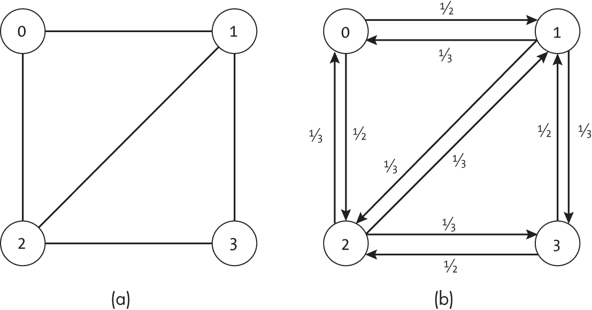
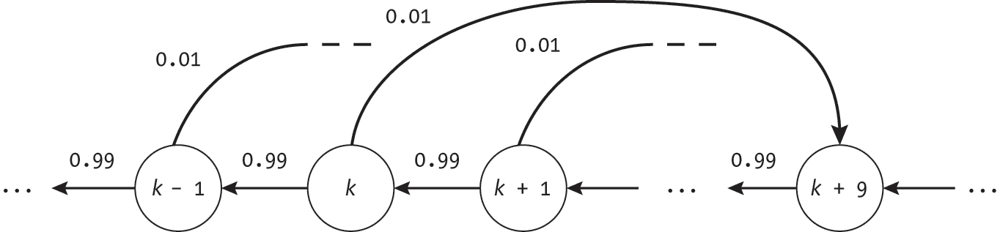
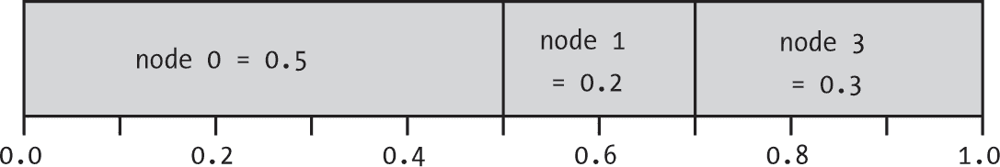
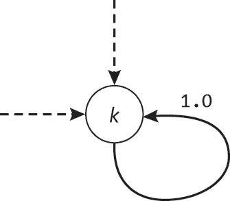
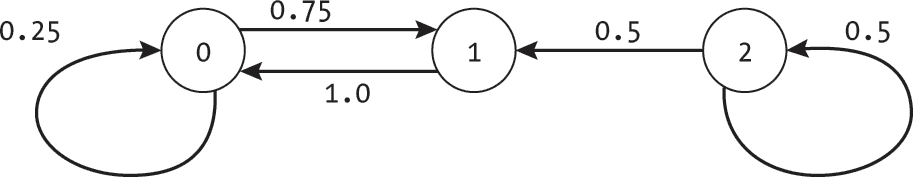
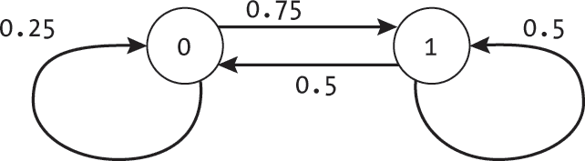
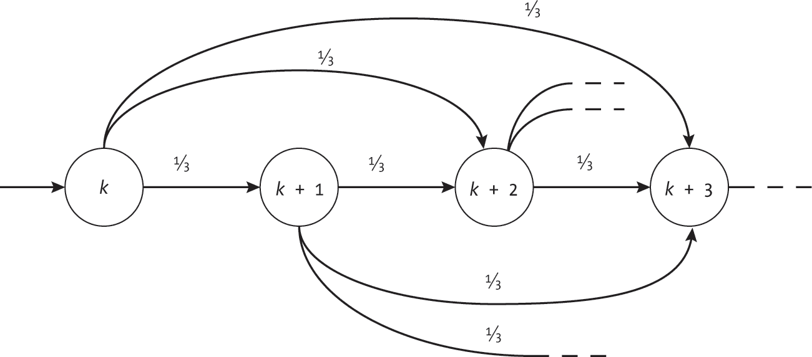
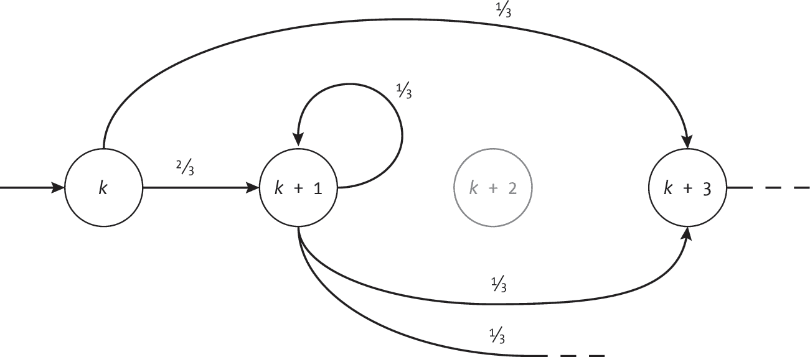
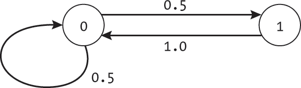

<hgroup>

## <samp class="SANS_Futura_Std_Bold_Condensed_B_11">13</samp> <samp class="SANS_Dogma_OT_Bold_B_11">随机行走</samp>

</hgroup>


到目前为止，本书介绍了多种旨在实现特定目标的算法。本章考虑了那些寻求做些不同事情的算法：在图上引入*随机行为*。分析图上的随机移动使我们能够模拟和研究具有非确定性行为的系统，例如随机化网络路由或现实世界中的社交互动。

图上的随机行走有着丰富的数学历史，远超本书的范围。本章概述了随机行走，介绍了如何用马尔科夫链分析它们，并提供了在图上实现随机行走的代码。我们探讨了通过随机行走可以调查的问题类型以及能够建模的系统，如赌博和基于运气的棋盘游戏。最后，我们考虑如何通过样本观察重建潜在的图。

### <samp class="SANS_Futura_Std_Bold_B_11">引入随机行走</samp>

图上的*随机行走*是一个节点序列，其中序列中的下一个节点是基于某种概率分布随机选择的。我们用 *u* 到 *v* 的*转移概率*表示：

*p*(*u* → *v*) 其中 0 ≤ *p*(*u* → *v*) ≤ 1

这意味着当我们处于节点 *u* 时，我们根据给定的概率分布从 *u* 的邻居中选择下一个节点。

我们可以将随机行走想象成一个完全拒绝提前计划的游客。相信偶然性能带来最好的假期，他们在没有地图或目的地线索的情况下出发，开始探索这座城市。当他们到达一个交叉口时，会考虑可能的路线并随机选择一条。游客每次做出决定时，都会独立考虑，而不考虑过去或未来的转变。

我们使用图的结构以几种方式限制概率。首先，我们限制只能在通过边连接当前节点的节点之间移动。在有向图的情况下，这必须是朝正确方向的边：

*p*(*u* → *v*) = 0 如果 (*u*, *v*) ∉ *E*

换句话说，我们的游客如果没有道路连接点 *u* 和点 *v*，就无法从 *u* 到 *v*。为了清晰起见，本章还要求如果边存在，则概率必须大于零：

*p*(*u* → *v*) > 0 如果 (*u*, *v*) ∈ *E*

这意味着我们的游客理论上可以遍历城市中的所有道路。

其次，所有出发邻接边的转移概率之和必须为 1.0：

∑v *p*(*u* → *v*) = 1 对于每个 *u* ∈ *V*

这限制了概率的分布，使其形成有效的分布。每个节点必须至少包含一条出口边。在有向图中，我们可以使用自环*p*(*u* → *u*) > 0 来模拟漫步未前往新节点的情况。这个约束意味着游客始终至少有一条路径可以继续前进，即使这条路径最终回到当前的位置。

#### <samp class="SANS_Futura_Std_Bold_Condensed_Oblique_BI_11">随机漫步中的概率</samp>

最简单的随机漫步是我们以相等的概率从出口边选择。在这种情况下，我们假设的游客完全随机地从当前交叉口的街道中选择。如果交叉口有两条出口边，游客选择其中一条的概率为 50%。如果交叉口有四条出口边，每条边的概率为 25%。图 13-1 展示了一个无向且无权重的图（a）以及每个节点的相应转移概率（b）。



<samp class="SANS_Futura_Std_Book_Oblique_I_11">图 13-1：无向图（a）及其随机漫步概率（b）</samp>

尽管我们讨论了有向和无向图上的随机漫步，但我们始终将这些系统建模为有向图，因为在许多情况下，两个节点之间的转移概率不会是对称的。用正式的术语来说：

*p*(*u* → *v*) ≠ *p*(*v* → *u*)

在图 13-1(b)中，例如，从节点 0 到节点 1 的概率是 1/2，而从节点 1 到节点 0 的概率只有 1/3。对于我们的游荡游客而言，旅行在两个交叉口之间的概率取决于当前交叉口有多少条路分出。

我们可以使用加权图来模拟更现实的场景，通过为每条边分配不同的概率，并将这些概率存储在边的权重中。我们对这些概率（边的权重）进行约束，使得所有出口边的概率和等于 1.0。图 13-2 展示了一个作为有向加权图的示例。在节点 3 的随机漫步中，有三个可能的下一状态：它可以以 0.2 的概率移动到节点 1，或以 0.6 的概率移动到节点 2，或者以 0.2 的概率停留在节点 3（通过自环）。


<samp class="SANS_Futura_Std_Book_Oblique_I_11">图 13-2：带有转移概率的有向图</samp>

这些更一般的图对应于一个受概率性因素影响的游客，这些因素超出了道路数量。他们倾向于朝着具有更有趣建筑的区域走去，或者跟随咖啡的香气。当他们到达一个特定的四岔路口时，他们有惊人的 90%的概率向左转，朝着一条咖啡馆街道走去。

#### <samp class="SANS_Futura_Std_Bold_Condensed_Oblique_BI_11">作为马尔科夫链的随机游走</samp>

图的边上的随机游走是 *马尔科夫链* 或 *马尔科夫模型* 的一种示例，这种系统的下一个状态的概率仅依赖于当前状态。每一步的选择不考虑之前的路径，这种特性称为 *时间不变性*。我们将其与马尔科夫链相联系，以便利用大量相关的分析。对不同类型的马尔科夫链的全面研究远远超出了本书的范围。在本章中，我们将简要介绍一些有助于分析随机游走的概念和术语，并展示其建模能力。

时间不变性特性对应于我们徘徊游客的习惯，即只考虑他们面前开放的路径。他们不考虑烦人的细节，例如他们已经去过哪里，走了多少步，甚至是一天中的哪个时段。虽然对于像吃饭和睡觉这样常规的活动来说，这并不是最理想的，但这位游客坚定地遵循着他们随机的度假原则。

在概率和统计的参考文献中，这些转移概率通常写作 *p*(*X*t | *X*t [– 1])，表示在时刻 *t* 系统处于状态 *X*t 的概率，前提是系统在时刻 *t* – 1 时处于状态 *X*t [– 1]。将这种简写与基于图的符号结合，我们得到以下方程：

*p*(*u* → *v*) = *p*(*X*t = *v* | *X*t [– 1] = *u*)

鉴于每个转移的独立性，我们可以通过将每个转移的概率相乘来计算从固定起始节点 *v*[0] 到整个路径 [*v*[0], *v*[1], *v*[2], . . . , *v*k] 的概率：

*p*([*v*[0], *v*[1], *v*[2], . . . , *v*k]) = ∏i [= 1 to] k *p*(*X*t = *v*i | *X*t [– 1] = *v*i [– 1])

马尔科夫链对于许多任务非常有用，尤其是那些转移与之前路径无关的任务。人工智能使用各种（更强大的）马尔科夫模型来模拟或推理各种现实现象，从理解语音到使用自主代理进行决策。例如，*隐马尔科夫模型* 是机器学习中的一个基础，它使用随机的转移状态，这些状态的输出是噪声。已经有高效的算法可以从输出中估计潜在的状态，甚至通过样本数据学习转移概率和输出分布。

相比之下，本章中我们考虑的随机游走代表了一个特别简单的马尔可夫模型。每个状态（节点）在每个时刻都是可见的，决策是完全随机的。然而，正如我们将看到的，即使这些看似简单的模型，也能提供丰富的模拟和分析能力。

#### <samp class="SANS_Futura_Std_Bold_Condensed_Oblique_BI_11">转移概率</samp>

在使用边的权重对图进行随机游走建模时，我们要求每个节点的出边权重形成一个有效的概率分布。我们可以通过遍历每个节点并检查其出边的权重总和是否为 1.0，来测试我们的<samp class="SANS_TheSansMonoCd_W5Regular_11">Graph</samp>数据结构的边权重是否形成了一个有效的概率分布，正如在 Listing 13-1 中所示。

```
def is_valid_probability_graph(g: Graph) -> bool: 
    for node in g.nodes:
      ❶ edge_list: list = node.get_edge_list()
        if len(edge_list) == 0:
            return False

        total: float = 0.0
        for edge in edge_list:
          ❷ if edge.weight < 0.0 or edge.weight > 1.0:
                return False
            total += edge.weight
      ❸ if abs(total - 1.0) > 1e-10:
            return False

    return True 
```

<samp class="SANS_Futura_Std_Book_Oblique_I_11">Listing 13-1: 检查存储在边权重中的概率的有效性</samp>

代码使用<samp class="SANS_TheSansMonoCd_W5Regular_11">for</samp>循环遍历每个节点，并检查其出边的权重是否形成一个有效的概率分布。首先，它提取该节点的边列表，并检查该列表是否为空❶。如果为空，说明从该节点没有出路，代码返回<samp class="SANS_TheSansMonoCd_W5Regular_11">False</samp>。节点的出边权重总和为 1 的约束要求每个节点必须至少有一条权重不为零的出边，即使它是自环。

代码使用第二个<samp class="SANS_TheSansMonoCd_W5Regular_11">for</samp>循环遍历每个出边。它检查每个边的概率是否在 0.0 到 1.0 之间，如果不是，立即返回<samp class="SANS_TheSansMonoCd_W5Regular_11">False</samp>❷，然后将当前边的权重加到总和中。在检查完所有的边后，代码会检查总权重是否为 1.0，以允许少量的浮动点误差❸。只有当所有节点和边满足这些条件时，才会返回<samp class="SANS_TheSansMonoCd_W5Regular_11">True</samp>。

#### <samp class="SANS_Futura_Std_Bold_Condensed_Oblique_BI_11">矩阵表示</samp>

图的矩阵表示在分析图上随机游走的性质时非常有用，并且在统计学和机器学习的文献中常用于描述随机游走。在矩阵表示中，转移概率通常通过*转移矩阵*（*M*）来指定，其中矩阵的第*i*行第*j*列的值对应于从节点*i*到节点*j*的概率：

M[*i*][*j*] = *p*(*i* → *j*)

我们甚至可以重用 第一章 中的 <samp class="SANS_TheSansMonoCd_W5Regular_11">GraphMatrix</samp> 数据结构来存储这些值。由于我们将条目限制为概率，我们对 <samp class="SANS_TheSansMonoCd_W5Regular_11">GraphMatrix</samp> 的 <samp class="SANS_TheSansMonoCd_W5Regular_11">connection</samp> 列表施加了额外的限制：

+   对于所有 <samp class="SANS_TheSansMonoCd_W5Regular_11">i</samp> 和 <samp class="SANS_TheSansMonoCd_W5Regular_11">j</samp>，有 0 ≤ <samp class="SANS_TheSansMonoCd_W5Regular_11">connections[i][j]</samp> ≤ 1。

+   对于所有 <samp class="SANS_TheSansMonoCd_W5Regular_11">i</samp>，有 ∑j <samp class="SANS_TheSansMonoCd_W5Regular_11">connections[i][j]</samp> = 1。

这些约束与先前对边权重施加的限制相对应。

我们可以使用矩阵运算来模拟随机步伐的效果。我们令 *V*t 为概率向量，使得 *V*t [*u*] 表示我们在时间步 *t* 时随机漫步位于节点 *u* 的概率（因此对于每个 *u*，0 ≤ *V*t [*u*] ≤ 1 且 ∑u *V*t [*u*] = 1）。例如，我们可以使用 *V*t = [0.5, 0.4, 0.0, 0.1]* 来表示在 Figure 13-2 中我们的漫步位于四个节点的概率。该向量表示在节点 0 处有 50% 的概率，在节点 1 处有 40% 的概率，在节点 2 处有 0% 的概率，在节点 4 处有 10% 的概率。

向量 *V*[0] 给出了从每个节点开始漫步的概率。例如，*V*[0] = [1.0, 0.0, 0.0, 0.0] 表示从节点 0 确定性地开始漫步，而 *V*[0] = [0.5, 0.5, 0.0, 0.0] 表示从节点 0 或节点 1 开始漫步的机会相等。接下来，向量 *V*[1] 给出了根据 *V*[0] 随机开始漫步并执行一步随机漫步后，位于每个节点的概率。*V*[2] 表示随机漫步进行两步后的概率，依此类推。

我们可以使用矩阵代数与转移矩阵 *M* 来计算后续的概率分布：

*V*t [+ 1] = *V*t *M*

每个条目 *V*t [+ 1] [*u*] 给出了我们在下一时间步 *t* + 1 时随机漫步位于节点 *u* 的概率。我们甚至可以在 <samp class="SANS_TheSansMonoCd_W5Regular_11">GraphMatrix</samp> 类中添加一个方法来执行此计算，如 Listing 13-2 所示。

```
def simulate_random_step(self, Vt: list) -> list: 
    if len(Vt) != self.num_nodes:
        raise ValueError("Incorrect length of probability dist")

    Vnext: list = [0.0] * self.num_nodes
    for i in range(self.num_nodes):
        for j in range(self.num_nodes):
            Vnext[j] += Vt[i] * self.connections[i][j]
    return Vnext 
```

<samp class="SANS_Futura_Std_Book_Oblique_I_11">Listing 13-2: 在图上模拟单步随机漫步</samp>

代码首先检查传入向量 <samp class="SANS_TheSansMonoCd_W5Regular_11">Vt</samp> 的长度是否正确，如果不正确，则抛出错误。然后，它创建一个结果向量 <samp class="SANS_TheSansMonoCd_W5Regular_11">Vnext</samp>，并使用一对嵌套的 <samp class="SANS_TheSansMonoCd_W5Regular_11">for</samp> 循环执行计算。最后，它返回新的概率向量。

> <samp class="SANS_Dogma_OT_Bold_B_15">注意</samp>

*正如在第一章中提到的，本书中的代码使用列表的列表来表示矩阵，以便于说明。为了提高效率，生产环境中的代码应该使用支持高效矩阵操作的库，例如* <samp class="SANS_TheSansMonoCd_W7Italic">numpy</samp>*。*

模拟随机步长的计算也适用于一个确定性状态：*V*[*u*] = 1 对于恰好一个节点 *u*。然后通过乘以 *V*t [+ 1] = *V*t *M*，我们得到随机游走在从 *u* 出发后恰好一步的概率分布。我们可以通过再次乘以 *M* 来重复这一过程，如下所示：

*V*t [+ 2] = *V*t *M M*

这给出了恰好经过两步后到达的节点的概率分布。

另外，我们可以扩展我们的矩阵表示，使得 *M*t 成为一个随机游走的转移矩阵，表示恰好 *t* 步的随机游走，因此 *M*t [*u*][*v*] 是从节点 *u* 到节点 *v* 在恰好 *t* 步内的转移概率。我们可以直接通过矩阵乘法来计算这个矩阵：

*M*t = ∏I [= 1 到] t *M*

虽然矩阵表示法对于描述和分析随机游走的性质很有用，但本章其余部分的代码使用了我们 <samp class="SANS_TheSansMonoCd_W5Regular_11">Graph</samp> 类的邻接表表示法，以保持与其他章节的一致性。所有函数都可以适配为与 <samp class="SANS_TheSansMonoCd_W5Regular_11">GraphMatrix</samp> 类一起使用。

### <samp class="SANS_Futura_Std_Bold_B_11">使用案例</samp>

随机游走用于建模和分析涉及非确定性行为的问题。随机行为在许多现实世界的系统中都有出现，从人类互动到一些计算机算法中的显式随机性。在本节中，我们将看三个示例用例：社交网络、随机化探索和机会游戏。

#### <samp class="SANS_Futura_Std_Bold_Condensed_Oblique_BI_11">社交网络中的信息链</samp>

我们可以使用随机游走来模拟谣言如何在社交网络中传播，其中的互动包含随机成分。每个人都决心不传播过多的闲言碎语，但一旦听到谣言，他们就迫不及待地想与某个人分享。因此，他们将新闻传给遇到的第一个人。这是一个概率性的选择，因为他们不知道首先会遇到哪个朋友。分享完新闻后，他们暂时满足，会等到别人再次传递这个谣言给他们时，才会继续讨论。

我们可以将社交网络建模为一个图，其中边表示每个邻居是传递谣言的对象的概率。谣言本身随机在图中传播，逐个传递给不同的人。

#### <samp class="SANS_Futura_Std_Bold_Condensed_Oblique_BI_11">探索</samp>

之前的章节讨论了许多用于确定性地探索图的算法，如深度优先搜索或 A*搜索。然而，许多现实世界中的探索涉及随机元素，比如基于天气的路径封闭。随机漫步允许我们模拟具有这些约束的系统。

考虑第八章中提到的探险者，正在寻找通往考古遗址的最佳路径。当前的条件可能会为他们的探索增添随机因素。当面临路径的分岔时，北边的路线可能有 50%的几率被洪水淹没，而南边的路线则有 10%的几率被愤怒的黄蜂群堵住。考虑到这些概率，我们可以将他们穿越丛林的艰难旅程建模为一次随机漫步。

我们可以使用类似的方法来分析动态环境中的机器人路径规划。一个探索损坏建筑物的搜救机器人可能会在不同的时间遇到不同的障碍物，比如火灾或被淹没的通道，并需要重新规划路径。

#### <samp class="SANS_Futura_Std_Bold_Condensed_Oblique_BI_11">机会游戏</samp>

我们还可以使用随机漫步来模拟机会游戏的结果。图节点表示不同的游戏状态，边表示这些状态的可能（概率）变化。例如，我们可以使用图 13-3 所示的马尔可夫链来表示赌徒玩一美元老虎机的情况。



<samp class="SANS_Futura_Std_Book_Oblique_I_11">图 13-3：赌徒图中的一个子集</samp>

每个状态表示赌徒手中的美元数量。每次拉动老虎机时，都会决定下一个状态，而不考虑之前的拉动或赌徒当前的财务状况。也许机器有 1/100 的几率支付 10 美元，将赌徒从状态*k*移动到状态*k* + 9，而 99/100 的几率什么也不支付，将赌徒从状态*k*移动到*k* - 1。

随着我们对更复杂的机会游戏进行建模，我们需要更复杂的图来表示这些情况。在本章稍后，我们将展示如何使用图来建模基于运气的桌面游戏。我们讨论了同时表示多个玩家状态的节点及其之间的转换。

### <samp class="SANS_Futura_Std_Bold_B_11">模拟随机漫步</samp>

理解随机游走及其底层图形的一个强大方法是*反复模拟*图上的随机游走并分析所走过的路径。我们通过反复选择基于当前状态邻居的概率分布来模拟图上的随机游走。作为先决条件，我们需要一个从有限选项集中按预定概率采样的函数。

我们提供了一个简单的算法进行说明，它在 0, 1)范围内均匀抽取一个随机数，并通过遍历每个出边，累积之前节点的累积概率，检查该随机数对应哪个邻居。我们实际上是将[0, 1)范围划分为每个选项的区域，其中每个区域的大小对应于该选项的概率。[图 13-4 展示了一个示例，其中 50%的范围指向节点 0，20%指向节点 1，30%指向节点 3。

通过在遍历选项时跟踪目前为止看到的累积概率，我们在跟踪每个区域的起始和结束，并将其与选定值进行比较。我们想要找到一个区域，该区域的范围包含我们随机选择的值。只要跨过累积值超过随机选择值的区域边界，我们就知道走得太远了。



<samp class="SANS_Futura_Std_Book_Oblique_I_11">图 13-4：到三个节点的转移概率及其对应的累积概率</samp>

图上的随机游走代码包括生成随机数，随后是一个单独的 <samp class="SANS_TheSansMonoCd_W5Regular_11">for</samp> 循环，遍历出边，如列表 13-3 所示。

```
def choose_next_node(current: Node) -> int: 
  ❶ prob: float = random.random()
    cumulative: float = 0.0
    edge_list: list = current.get_edge_list()

    for edge in edge_list:
        cumulative += edge.weight
      ❷ if cumulative >= prob:
            return edge.to_node
  ❸ return edge_list[-1].to_node 
```

<samp class="SANS_Futura_Std_Book_Oblique_I_11">列表 13-3：在随机游走中选择下一个节点</samp>

代码首先使用 Python 的 <samp class="SANS_TheSansMonoCd_W5Regular_11">random</samp> 库从 0, 1)范围内生成一个随机数 ❶。然后，它通过一个 <samp class="SANS_TheSansMonoCd_W5Regular_11">for</samp> 循环遍历每个出边来计算目前为止看到的总（累积）概率。选中的边是第一个其权重导致累积概率超过选定随机数的边 ❷。如果代码到达列表末尾（由于浮点数存储的精度问题），代码将简单地返回最后一条边 ❸。

[列表 13-3 中的 <samp class="SANS_TheSansMonoCd_W5Regular_11">choose_next_node()</samp> 函数没有对每个节点离开的概率分布进行任何有效性检查。这是故意的，因为每次调用该函数时都不想支付进行检查的成本。相反，我建议使用列表 13-1 中的 <samp class="SANS_TheSansMonoCd_W5Regular_11">is_valid_probability_graph()</samp> 函数，先检查所有节点的分布。

给定这个辅助函数，从一个给定起始节点（<samp class="SANS_TheSansMonoCd_W5Regular_11">start</samp>）执行随机漫步的代码相对简短：

```
def random_walk(g: Graph, start: int, steps: int) -> list: 
  ❶ if not is_valid_probability_graph(g):
        raise ValueError("Graph weights are not probabilities.")

    walk: list = [-1] * steps
    current: int = start
    walk[0] = current
    for i in range(1, steps):
      ❷ current = choose_next_node(g.nodes[current])
        walk[i] = current

    return walk 
```

该函数首先确认图的权重表示一个有效的概率分布，如果没有则抛出错误 ❶。接着，它分配一个列表 <samp class="SANS_TheSansMonoCd_W5Regular_11">walk</samp> 来存储结果，将当前节点设置为起始节点，并将漫步的第一步设置为起始节点。代码使用一个 <samp class="SANS_TheSansMonoCd_W5Regular_11">for</samp> 循环迭代每一步，使用列表 13-3 中的 <samp class="SANS_TheSansMonoCd_W5Regular_11">choose_next_node()</samp> 函数不断从当前节点选择下一个节点 ❷。代码将新节点添加到 <samp class="SANS_TheSansMonoCd_W5Regular_11">walk</samp> 列表中，并在走完所有步骤后返回该列表。

### <samp class="SANS_Futura_Std_Bold_B_11">统计度量</samp>

随机漫步是理解随机化系统和计算各种实用统计度量的有力工具。例如，我们可能想找到到达特定节点的概率，或确定需要多少步才能到达那里。这些度量在回答以下问题时非常有用：“一个赌徒输掉所有钱的概率是多少？”或者“一个谣言平均需要多长时间才能传到我这里？”或者“如果一个游客在城市中随机游荡多年，他们在每个地方会停留多久？”

在本节中，我们简要考虑如何将这些问题应用于我们徘徊的游客案例，并概述如何计算答案。在考虑到到达特定节点的概率和所需平均步数后，我们分析了随机漫步的长期行为。

#### <samp class="SANS_Futura_Std_Bold_Condensed_Oblique_BI_11">到达与吸收时间</samp>

*到达时间*指的是随机漫步必须采取的平均步数，直到它从一个给定的起始节点首次到达集合 *A* ⊂ *V* 中的一个节点。例如，如果 *A* 是我们游客正在探索的小镇上所有有咖啡馆的交叉路口的集合，他们可能想要计算这个集合的到达时间，以便了解他们可能何时能喝到下一杯咖啡。

如果一个随机游走无法离开子集*A*中的节点，我们称这些到达时间为*吸收时间*，因为游走已经被*A*吸收。例如，在图 13-5 中，节点*k*形成了一个吸收集。一旦游走到达节点*k*，它将永远停留在那里。



<samp class="SANS_Futura_Std_Book_Oblique_I_11">图 13-5：一个由单个节点组成的吸收集</samp>

吸收节点还可以用来表示随机游走的终止。例如，游客可以决定在到达酒店时停止随机游走。

在分析图上的随机游走时，我们通常会考虑与到达时间相关的两个统计量：游走到达子集的概率和达到该子集所需的期望时间。

##### <samp class="SANS_Futura_Std_Bold_Condensed_B_11">到达概率和吸收概率</samp>

*到达概率*对于一个节点子集*A* ⊆ *V*来说，是指从节点*u*开始的随机游走将会在该子集内到达节点*v* ∈ *A*的概率。我们可以使用这个度量来回答像“我们的游客遇到咖啡馆的概率是多少？”这样的问题。类似地，*吸收概率*对于一个节点子集*A*来说，是指从节点*u*开始的随机游走会被该子集吸收的概率。这使我们能够问类似“游客回到酒店并停止随机游走的概率是多少？”这样的问题。

吸收子集的节点可以影响非吸收节点的到达概率。例如，考虑图 13-6 中显示的加权图，其中有三个节点和一个吸收子集{0, 1}。



<samp class="SANS_Futura_Std_Book_Oblique_I_11">图 13-6：一个包含三个节点和转移概率的图</samp>

在给定潜在的无限步数的情况下，从节点 2 开始的随机游走到达节点 0 的概率是 1.0。相反，一旦游走到达节点*A* = {0, 1}，它将永远无法到达节点 2，因为它将被困在一个无限的步骤集合中，该集合连接到节点 0 和 1。

##### <samp class="SANS_Futura_Std_Bold_Condensed_B_11">期望到达时间</samp>

*期望到达时间*是指一个随机游走（平均而言）首次到达子集*A*中的一个节点所需要的步骤数。这使我们能够确定游客平均需要多久才能喝到下一杯咖啡。*吸收时间*类似，量化了随机游走到达吸收集所需的期望时间。对于我们的游客来说，这将是他们的游走将持续多久（直到他们到达酒店并停下来）。

例如，图 13-6 中从节点 0 到节点 1 的预期到达时间（记作 *h*[01]）如下所示：

*h*[01] = 1 × *p*(在 1 步后首次到达节点 1)

+ 2 × *p*(在 2 步后首次到达节点 1)

+ 3 × *p*(在 3 步后首次到达节点 1) + . . .

*h*[01] = 1 × ¾ + 2 × ¼ × ¾ + 3 × (¼)² × ¾ + 4 × (¼)³ × ¾ + . . .

*h*[01] = 4/3

这是因为从节点 0 开始的可能游走包括 [0, 1]、[0, 0, 1]、[0, 0, 0, 1] 等等。如果我们拥有完整的转移矩阵，就可以通过一组方程来求解预期到达时间。

预期到达时间可能是无限的，例如 图 13-6 中从节点 0 到节点 2 的 *h*[02]。无论我们考虑多长时间的游走，都无法从节点 0 到达节点 2。

#### <samp class="SANS_Futura_Std_Bold_Condensed_Oblique_BI_11">平稳分布</samp>

*平稳分布* 表示如果我们在一个强连通的图中永远游走，每个状态的访问分布。这个分布提供了我们在每个节点停留的可能性。例如，我们可以问：“我们的游客已经游走了好几天，当前他们有多大概率在第五街的咖啡馆？”我们还可以利用平稳分布来预测成千上万的游客的可能位置，这些游客都遵循相同的随机化规则在城市中游走。

回到本章早些时候介绍的矩阵表示法（其中 *M* 是转移矩阵，*V*t 是一个概率向量，使得 *V*t [*u*] 是在时间步 *t* 时随机游走位于节点 *u* 的概率），平稳分布是一个向量 *V*^*，其满足：

*V*^* = *V* ^**M*

换句话说，在随机游走中再增加一步也不会改变可能位置的分布。

我们可以从图的结构中推导出平稳分布。考虑 图 13-7 中的两个节点图，其中 *M* = [[0.25, 0.75], [0.5, 0.5]]。



<samp class="SANS_Futura_Std_Book_Oblique_I_11">图 13-7：一个包含两个节点和四个转移概率的图</samp>

图 13-7 中图的结构表明，从长远来看，随机游走将在节点 1 上花费比节点 0 更多的时间。由于自环的存在，停留在节点 0 的概率仅为 0.25，而停留在节点 1 的概率为 0.5。我们可以通过平稳分布量化在每个节点上花费的时间差异，对于该图，平稳分布为 *V*^* = [0.4, 0.6]。

### <samp class="SANS_Futura_Std_Bold_B_11">基于运气的桌面游戏</samp>

我们可以结合本节中的主题，考虑随机游走最有趣的应用之一：分析基于运气的儿童棋盘游戏。这些游戏没有实际的选择，而是依赖于转盘或骰子生成的随机数字来决定行动。在花了几个小时转动指示棋子前进一格、两格或三格的拨轮之后，即使是不懂统计学的人也可能会问到目标状态的期望吸收时间，问：“我还需要多久才能玩完这个游戏？”我们可以通过将游戏建模为图上的随机游走来回答这些问题。

考虑一个简单的游戏示例，目标是成为第一个完成棋盘一圈的玩家。在每个玩家的回合中，他们使用一个标有 1、2 和 3 的小转盘，指示要走多少步。图 13-8 显示了游戏中多个状态的图示。节点的数字对应棋盘上的方格，玩家当前所在方格是*k*。根据转盘的随机结果，他们可以移动到方格*k* + 1、*k* + 2 或*k* + 3，每个方格的概率为 1/3。



<samp class="SANS_Futura_Std_Book_Oblique_I_11">图 13-8：表示基于转盘的游戏示例状态的图</samp>

为了让游戏更刺激（或可能让更多的孩子因沮丧而哭泣），游戏设计者将某些方格标记为“倒退 X 步”。这些代表应避免的陷阱。我们可以将这种行为直接纳入我们的图中。

图 13-9 显示了一个状态图，其中方格*k* + 2 包含“倒退一格”的指示。这实际上将节点*k* + 2 从图中移除（在图中通过将节点变灰来表示）。在这个状态下无法完成一个回合。相邻节点的转移概率也相应发生变化。从节点*k*到*k* + 1 的概率从 1/3 增加到 2/3，因为现在转动 1 和 2 都会停在方格*k* + 1。类似地，从节点*k* + 1 转动 1 会将玩家带回节点*k* + 1。我们将这建模为一个自环，概率为 1/3。



<samp class="SANS_Futura_Std_Book_Oblique_I_11">图 13-9：表示从状态</samp> <samp class="SANS_Futura_Std_Book_11">k</samp> <samp class="SANS_Futura_Std_Book_Oblique_I_11">在基于转盘的游戏中的移动</samp>

虽然我们可以添加更多的边来捕捉基于方格和旋转器的转移，但要捕捉玩家之间互动等方面需要更复杂的模型。本节中介绍的图模型只捕捉了单次随机行走在棋盘游戏中的动态。如果所有玩家是独立的，这样的模型工作得很好。然而，如果游戏提供了一种在某个玩家落到另一个玩家的方格上时将其击退两个方格的能力，那么我们就需要一个同时考虑两个玩家位置的模型。

我们可以通过增加节点的数量来创建此类模型，以匹配棋盘游戏的可用状态。与其为*N*个方格使用*N*个节点，我们可以通过将游戏状态建模为包含爱丽丝位置（玩家 1 的状态）、鲍勃位置（玩家 2 的状态）以及一个布尔值表示是否是爱丽丝回合的三元组，来使用 2*N*²个节点。例如，三元组<samp class="SANS_TheSansMonoCd_W5Regular_11">(5, 4, False)</samp>表示爱丽丝在第 5 个方格，鲍勃在第 4 个方格，并且是鲍勃的回合。如果我们将三项选择旋转器与新的“击退”规则结合起来，那么鲍勃有 1/3 的概率旋转到 1，前进一个方格，并将爱丽丝击退两个方格。更正式地说，*p*(<samp class="SANS_TheSansMonoCd_W5Regular_11">(5, 4, False)</samp> → <samp class="SANS_TheSansMonoCd_W5Regular_11">(3, 5, True)</samp>) = 1/3。

### <samp class="SANS_Futura_Std_Bold_B_11">转移概率</samp>

除了分析给定的图形外，我们还可以将本章中的概念扩展到*估计*这些图形本身，从观察数据中进行估算。假设我们发现了一个游客的日志本，他在过去一年里随机地在一个未知城市的街道上漫游。每个条目至少列出了一个地点和一个时间。为了更好地理解他们的旅程，我们考虑他们长时间的访问地点序列。

我们可以轻松地从地点名称重建各个节点，例如整数广场和浮动点港口。稍作推理，我们还可以识别边的存在；例如，从整数广场到“如果-那么”交叉口的过渡暗示着它们之间存在一条边。经过几个小时对游客痛苦循环路径的研究后，我们退后一步，试图重建他们的转移矩阵。

#### <samp class="SANS_Futura_Std_Bold_Condensed_Oblique_BI_11">最大似然估计</samp>

我们可以利用一系列由一次或多次行走所产生的观察值来估计转移矩阵，从而统计地估计转移概率。*最大似然估计*让我们找到那些最大化在给定参数下观测到样本数据的模型参数（转移概率）。我们在这里不会讨论这种方法的数学细节，但简而言之，最大似然估计利用每一步的独立性，通过计算以下两项量来计算从节点*u*到节点*v*的转移概率：

***N***u 节点 *u* 在数据中作为移动起始节点出现的次数（不是路径中的最后一个节点）

***N***u [→] v 节点 *v* 在数据中紧跟在节点 *u* 之后出现的次数

给定这些信息，我们计算转移的概率如下：

*p*(*u* → *v*) ≈ *N*u [→] v / *N*u

如果我们从节点 1 出发了 100 次，其中有 30 次直接移动到节点 3，那么我们估算 *p*(1 → 3) = 30 / 100 = 0.3。

#### <samp class="SANS_Futura_Std_Bold_Condensed_Oblique_BI_11">转移矩阵估算算法</samp>

从观察数据中估算一个潜在图形的算法包含三个阶段。在第一个阶段，我们使用行走中访问过的节点来计算图形中节点的数量。这相当于扫描游客的日志并确定我们需要跟踪多少个交叉点。第二，我们构建节点访问次数的计数数组（*N*u）和节点到节点转移的计数矩阵（*N*u [→] v）。我们通过遍历行走中的每一步来计算计数，实际上是在重新追溯游客的旅程。最后，我们通过为所有非零的节点到节点转移插入边来构建图形。

因为我们是从行走中的节点构建图形，所以只包括算法至少访问过一次的节点。这意味着，对于一个断开的图形，我们只会捕捉到从初始起始节点（或节点们）可达的部分。如果游客害怕水并拒绝过桥，那么我们可能会错过河对岸的所有地点。

清单 13-4 反映了这三个阶段。

```
def estimate_graph_from_random_walks(walks: list) -> Graph: 
    num_nodes: int = 0
  ❶ for path in walks:
        for node in path:
            if node >= num_nodes:
                num_nodes = node + 1

    counts: list = [0.0] * num_nodes
    move_counts: list = [[0.0] * num_nodes for _ in range(num_nodes)]
  ❷ for path in walks:
        for i in range(0, len(path) - 1):
            counts[path[i]] += 1.0
            move_counts[path[i]][path[i + 1]] += 1.0

    g: Graph = Graph(num_nodes)
  ❸ for i in range(num_nodes):
        if counts[i] > 0.0:
            for j in range(num_nodes):
              ❹ if move_counts[i][j] > 0.0:
                    g.insert_edge(i, j, move_counts[i][j] / counts[i])
    return g 
```

<samp class="SANS_Futura_Std_Book_Oblique_I_11">清单 13-4：从观察数据估算转移矩阵</samp>

该函数接收一个包含多个随机行走的节点的列表的列表（<samp class="SANS_TheSansMonoCd_W5Regular_11">walks</samp>）。代码首先使用一对嵌套的 <samp class="SANS_TheSansMonoCd_W5Regular_11">for</samp> 循环遍历每个行走和该行走中的每个节点，并记录看到的最大索引 ❶。然后，它为两组计数（<samp class="SANS_TheSansMonoCd_W5Regular_11">counts</samp> 和 <samp class="SANS_TheSansMonoCd_W5Regular_11">move_counts</samp>）分配数据结构，并使用 <samp class="SANS_TheSansMonoCd_W5Regular_11">for</samp> 循环遍历路径中的每一步 ❷ 来填充这些数据。一旦计数完成，代码创建一个图形（<samp class="SANS_TheSansMonoCd_W5Regular_11">g</samp>）并用两层嵌套的 <samp class="SANS_TheSansMonoCd_W5Regular_11">for</samp> 循环遍历每对节点 ❸。如果这两个节点之间的转移计数非零 ❹，则计算概率并将相应的边插入图形中。

请记住，使用看到的最高索引的缺点在于，如果底层图由多个不连通的组件组成，重建的图将包含我们永远不会访问的索引。由于这些索引的计数为零，它们将没有出边，导致生成的图未能通过<samp class="SANS_TheSansMonoCd_W5Regular_11">is_valid_probability_graph()</samp>检查。为了简化并保持与前面章节的一致性，我们在清单 13-4 中使用了最大索引方法，但更健壮的方法是使用*节点名称*到索引的映射，如附录 A 中所述。

作为估算图的示例，考虑一个旅行日志，其中包含两条路径并且访问了编号的建筑物：

```
path1 = [0, 1, 0, 0, 1, 0, 0]
path2 = [0, 1, 0, 1, 0, 0, 0] 
```

我们可以将这些路径输入到我们的估算函数中，来了解旅游者的度假行为：

```
g = estimate_graph_from_random_walks([path1, path2]) 
```

看这些路径时，有几个要点立刻显现。首先，旅游者总是从节点 0 出发。其次，他们只访问了两个建筑，0 号和 1 号。在这个案例中，0 号建筑是有咖啡馆的大堂的酒店，而 1 号建筑是街对面的咖啡店。

在计算最大似然估计时，我们积累了以下值：

*N*[0] = 8, *N*[1] = 4

*N*[0 → 0] = 4, *N*[0 → 1] = 4, *N*[1 → 0] = 4, *N*[1 → 1] = 0

旅游者从节点 0 出发移动了八次 (*N*[0] = 8)。其中四次停留在节点 0 (*N*[0 → 0] = 4)，四次移动到节点 1 (*N*[0 → 1] = 4)。他们从节点 1 出发四次，始终回到节点 0 (*N*[1 → 0] = 4)，从未回到节点 1 (*N*[1 → 1] = 0)。

我们使用这些统计数据来估算成对的转移概率：

*p*(0 → 0) = 4 / 8 = 0.5

*p*(0 → 1) = 4 / 8 = 0.5

*p*(1 → 0) = 4 / 4 = 1.0

*p*(1 → 1) = 0 / 4 = 0.0

这些概率提供了估算图的边权重，如图 13-10 所示。注意，我们没有包括边(1, 1)，因为它的权重为 0。



<samp class="SANS_Futura_Std_Book_Oblique_I_11">图 13-10：一个根据数据估算的边转移概率图</samp>

在酒店时，旅游者有 50%的机会停留在酒店，也有 50%的机会走到街对面的咖啡店。然而，在咖啡店时，他们总是直接回到酒店。

#### <samp class="SANS_Futura_Std_Bold_Condensed_Oblique_BI_11">处理有限数据的局限性</samp>

当然，直到我们积累了足够的观察数据之前，我们对转移概率的估计可能会非常嘈杂。如果我们的图足够大，可能永远也没有机会观察到某些节点或低概率的边。这是使用随机数据时的一个基本问题。如果我们的游客有 5%的几率进入一条狭窄的小巷，我们在看到他们 10 次时，他们可能每次都会合理地跳过这条小巷。

使用统计学方法，我们不仅可以分析最大似然值，还可以分析它们的误差范围和我们的置信水平。这些分析超出了本书的范围。现在，我们只是提醒读者避免从少量的随机数据中得出严谨的结论。

### <samp class="SANS_Futura_Std_Bold_B_11">随机起始节点</samp>

我们可以扩展我们的模型及其估计，考虑随机游走从不同节点开始的情况。*随机起始节点*的概念可能并不直观，因为物理上的游走通常从一个特定地点开始，比如游客的酒店。然而，随机起始点可以代表许多现实世界的现象，例如游客随机选择离开某个酒店，或者谣言从社交网络中的一个随机点开始传播。

让我们将起始概率的向量标记为*S*，其中*S*[*u*]表示我们从节点*u*开始随机游走的概率。由于*S*包含概率，我们限制 0 ≤ *S*[*u*] ≤ 1，并且∑u *S*[*u*] = 1。

#### <samp class="SANS_Futura_Std_Bold_Condensed_Oblique_BI_11">选择一个随机起始节点</samp>

我们可以用与示例 13-3 中用于 <samp class="SANS_TheSansMonoCd_W5Regular_11">choose_next_node()</samp> 相同的方法，直接抽取起始节点：

```
def choose_start(S: list) -> int: 
  ❶ prob: float = random.random()
    cumulative: float = 0.0

  ❷ for i in range(len(S)):
        cumulative += S[i] if cumulative >= prob:
            return i
    return len(S) - 1 
```

<samp class="SANS_TheSansMonoCd_W5Regular_11">choose_start()</samp>函数使用 Python 的 <samp class="SANS_TheSansMonoCd_W5Regular_11">random</samp> 库 ❶ 从[0, 1)之间随机抽取一个数。与 <samp class="SANS_TheSansMonoCd_W5Regular_11">choose_next_node()</samp> 函数按节点边进行迭代不同，该函数会在*S*中的值上迭代，直到找到正确的值 ❷。

作为一个更详细的例子，想象一个邪恶的巫师，他创建的地下城使用随机化的入口，以防止前来的冒险者编写攻略（从而影响他们的退休计划）。巫师使用精心挑选的分布*S*将每个新到达者传送到一个随机地点。他们通过将宝藏室的起始概率设置为零，*S*[*treasure*] = 0，来限制冒险者永远不能从宝藏室开始他们的探险。为了减少冒险者之间分享信息的可能性，巫师还强制要求所有房间的起始概率 *S*[*room*] < 0.1，这意味着冒险者有不到 10%的概率从任何特定房间开始。

#### <samp class="SANS_Futura_Std_Bold_Condensed_Oblique_BI_11">估计起始节点的概率分布</samp>

如果我们运行多个随机漫步，可能会对估计起始状态的分布感兴趣。我们可以使用类似于转移概率的方法来估计起始概率。如果*N*[0][*u*]是从节点*u*开始的漫步次数，那么我们将从节点*u*开始的概率定义为该节点开始漫步的次数所占的比例：

S[*u*] = *N*[0][*u*] / ∑v *N*[0][*v*]

我们可以在以下代码中实现这一估计：

```
def estimate_start_from_random_walks(walks: list) -> list: 
    num_nodes: int = 0
  ❶ for path in walks:
        for node in path:
            if node >= num_nodes:
                num_nodes = node + 1
    counts: list = [0.0] * num_nodes

  ❷ for path in walks:
        counts[path[0]] += 1.0

    for i in range(num_nodes):
        counts[i] = counts[i] / len(walks)
    return counts 
```

与估计转移概率的代码类似，估计起始概率的代码从计算最大节点索引开始，并创建一个数据结构来跟踪出现次数❶。然而，在这种情况下，代码只关注漫步中的第一个节点。它通过一个<sup class="SANS_TheSansMonoCd_W5Regular_11">for</sup>循环遍历不同的漫步，统计有多少次漫步是从每个节点开始的❷。然后它计算每个节点的经验起始概率。

我们的冒险者理论上可以使用这种方法为他们即将发布的战略指南收集信息。他们进入地下城几百次，每次都仔细记录自己落脚的位置。他们可以决定是否值得编写一本全面的地下城指南，尽管这意味着需要一次又一次地穿越相同的地下城。

### <samp class="SANS_Futura_Std_Bold_B_11">为什么这很重要</samp>

在图上分析随机漫步对于理解图的结构以及分析其底层系统是非常有用的。然而，更重要的是，随机漫步的概念扩展了我们可以用图算法建模的现实世界问题的范围。我们可以超越确定性问题，比如如何找到两个节点之间的最短路径，转而考虑更现实的行为。例如，为了模拟有时会发生错误的路径规划，我们可以使用一种随机漫步，它大多数时候走最优路径，但在某些交叉口会随机出错。

在下一章，我们将话题转向另一个方向，从整体容量的角度考虑图，寻找通过网络的最大流，以建模从管道到交通运输的各种系统。
