## 第十四章：14 最大流算法


前几章已经展示了如何利用图来建模连接性和交通问题。本章考虑了网络的*整体容量*以及流量如何在其中流动。假设我们想要模拟水流通过管道网络的情况。我们可以使用边的权重来表示任意两节点之间可以流过多少水，从而帮助我们确定整个网络的最大容量。

*最大流问题*旨在确定在给定有限容量的边时，图可以支持多少流量。这个表述是有意保持一般性的。我们可能在模拟水流通过管道、人员流动通过交通网络，或者信息流动通过社交网络。每个应用都带来了自己的术语、测量方法和单位。然而，它们都归结为一个基本问题。

本章中，我们考虑如何在有向带权图上计算最大流量，使用*Ford-Fulkerson*和*Edmonds-Karp*算法。在此过程中，我们展示如何扩展我们在前几章中使用的<code class="SANS_TheSansMonoCd_W5Regular_11">Graph</code>和<code class="SANS_TheSansMonoCd_W5Regular_11">Edge</code>数据结构，以支持边的容量的动态使用。

### 最大流问题

给定一个带权图，其中的边表示相邻节点之间流动的方向性和容量，我们如何确定网络中的最大流量？我们将流量起点的节点称为*源节点*并标记为*s*，将流量的目的地节点称为*汇节点*并标记为*t*。我们用*容量*（*u*, *v*）表示从*u*到*v*的边的容量——即该边能支持的最大流量。我们用*流量*（*u*, *v*）表示通过该边的流量。网络中的总流量是从源节点流出的流量（或者，等效地，进入汇节点的流量）。

我们可以将最大流问题在城市外的废水处理系统中进行可视化。假设废水通过一条源管道从城市流出，再通过一条汇管道进入污水处理厂。在源和汇之间，废水通过不同大小的管道流动，其流量在各个节点之间分配和重新组合。管道的容量决定了可以通过的废水量。

为了模拟现实的行为，最大流问题施加了几个约束条件。第一个约束是源节点（城市）只有流出，而汇节点（污水处理厂）只有流入。从数学角度来看：

*容量*（*u*, *s*）= 0 对于每个节点 *u*

对于每个节点 *v*，*capacity*(*t, v*) = 0。

这对应于一个非常合理的约束条件，即不能通过源管道将废水流回城市，也不能从污水处理系统流出任何东西。

第二个约束是，通过一条边（管道）的流量不能小于零，也不能超过该边的容量。用数学术语表示：

对于任意一对节点 *u* 和 *v*，*flow*(*u*, *v*) 的值必须满足 0 ≤ *flow*(*u*, *v*) ≤ *capacity*(*u*, *v*)。

上限转化为管道的物理约束。如果我们试图通过管道推送过多的水，它将爆裂。没有人希望发生这种情况。零的下限表示管道的方向性，例如单向阀门以防止水流反向流过管道。

最后的约束是，对于除源点和汇点之外的所有节点，流入该节点的流量必须等于流出该节点的流量。在数学上，这意味着对于每个节点 *u*：

∑v *flow*(*v*, u*) = ∑v *flow*(*u*, v*)。

这个约束防止了节点处出现无效情况，例如水在管道交汇处神奇地出现或消失。

在本章的最后几节之前，我们施加了一个额外的约束，这将帮助我们推理最大流算法。我们不允许 *反向边*，即在相反方向上连接相同节点的有向边。实际上，这意味着如果从节点 *u* 到节点 *v* 有一条边，我们就不允许从节点 *v* 到节点 *u* 有一条边。这个限制有助于简化后面章节中讨论的 *残余网络* 的定义。我们将在本章末尾放宽这一限制。

图 14-1 是一个关于小图的最大流问题示例。图 14-1(a) 中的边权表示容量。为了计算从节点 0 到节点 3 的源点到汇点的总流量，我们可以沿每条路径加总流量。图 14-1(b) 展示了一个最大流配置。在顶部路径上，我们可以从节点 0 向节点 1 发送 5 单位的流量。从节点 1 到节点 3 的边可以承载更多的流量，但这并不会帮助我们。我们无法将超过 5 单位的流量送到节点 1，因此我们无法让流量超过 5 单位。因此，顶部路径的最大流为 5。

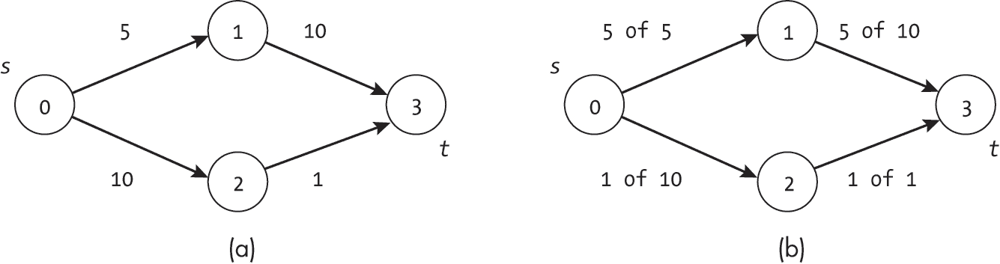

图 14-1：带有容量（a）的图和沿图边的最大流（b）

类似地，图 14-1(a)显示了图中底部路径上的一对限制。虽然从节点 0 到节点 2 的边看起来很有前景，容量为 10，但我们将无法将如此多的流量*从*节点 2 传出。边(2, 3)成为一个严重的瓶颈，容量为 1。就像一条大水管过渡到小水管一样，这些边的组合将底部路径的总容量限制为 1，网络中的总流量限制为 6。

对于更大的图，最大流问题变得更加复杂。考虑在图 14-2 中，当我们从节点 2 到节点 1 添加一条容量为 7 的新边时会发生什么。也许由于不断发生下水道倒灌，政府决定从节点 2 到节点 1 建造一条新管道。边(2, 1)为节点 2 的流量提供了另一条路径。最多可以有 7 个单位的流量分流并通过边(2, 1)，同时 1 个单位继续通过(2, 3)。

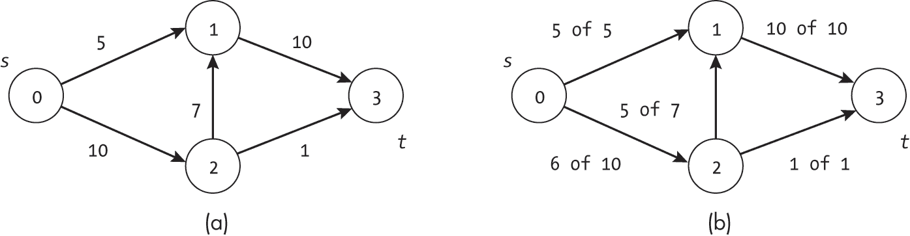

图 14-2：带容量的第二个示例图（a）及其沿这些边的最大流量（b）

然而，我们需要确保通过节点 1 的新路径能够处理这额外的流量。我们已经有 5 个单位的流量从节点 0 到节点 1。由于边(1, 3)的容量是 10，而我们已经使用了 5 个，所以它仅剩下 5 个单位的容量。尽管建立了一条容量为 7 的新边，但我们只能通过网络传送额外的 5 个单位流量。

### 应用场景

最大流问题自然反映了一系列现实世界的现象，包括液体通过管道的流动、人们通过交通网络的流动，或者信息通过社交网络的流动。

#### 物理管道

最大流问题中的许多术语源于物质通过管道流动的物理现象。术语*源*、*汇*、*容量*，甚至*流量*都与它们的物理对应物相对应。我们可以轻松地将这些物理问题映射到它们的计算等效问题。

尽管本章的主要示例是废水系统中的水流，管道类比的应用远超污水或室内管道，我们可以提出更多的问题。也许我们对枫糖浆在加工厂中的流动感兴趣。给定一系列复杂的管道和节点，整个系统的容量是多少？在不导致枫糖浆加工失败的情况下，我们可以通过它输送多少液体？这些初步问题为进一步的分析和优化奠定了基础，包括回答“当前系统中的瓶颈在哪里？”或“我们应该通过增加另一根管道来扩展容量吗？”等后续问题。

#### 交通网络

交通网络也是进行最大流分析的肥沃土壤。想象一下，你最喜欢的体育队在远方城市举行冠军赛。成千上万的本地粉丝想飞到那里，参加这场无疑是本世纪最重要的比赛。航空公司可以将这种需求建模为最大流问题，以确定目前有多少粉丝能够在两座城市之间旅行。边是城市对之间的航线，每条航线有一定数量的座位，构成了其容量。流量是已经占用的座位数。本地城市是源节点，粉丝们从这里出发前往目的地，而东道城市是汇点节点。

航空公司可以通过此分析判断是否需要增加航班。如果有大量的粉丝需求远超现有航班的容量，那么就有更多的利润空间。

#### 通信网络

我们还可以使用最大流问题来建模信息通过通信或社交网络的传递。例如，假设你想通过战略性地在社交网络中传递信息来影响另一个人的决定。也许你正在试图说服你最喜欢公司的招聘经理，你将是前任首席执行官的理想继任者。为了影响他们的决定，你开始分享自己令人惊叹的成就故事，使你成为源节点，而招聘经理则是汇点节点。

不幸的是，网络中的成员在传递此类消息时有时间和兴趣的限制。这个容量在任意两个节点之间是不同的。也许两个朋友每天早上都一起喝咖啡，其中一个可以将大量的信息传递给另一个。然而，紧张的关系可能导致信息传递能力受限。将这种情况建模为最大流问题有助于你确定实际能够传递到汇点节点的信息量。

### 扩展数据结构

在介绍第一个算法之前，我们需要扩展 Edge 和 Graph 数据结构，以便完整地表示容量和流量。由于 Graph 数据结构中的边权无法同时表示容量限制和已使用的数量，而最大流问题需要能够捕捉到既有 *固定总容量* 又有 *动态流量* 的图。

在本节中，我们定义了两个新的数据结构。CapacityEdge 类基于我们的 Edge 类，并增加了支持表示已使用容量的功能。ResidualGraph 类与 Graph 类的结构类似，但增加了跟踪图中动态变化流量的功能。

#### 带容量的边

为了建模最大流问题，图的边需要能够存储两个信息：固定的总容量和动态的流量。我们定义了一个 CapacityEdge 类，用于存储以下信息：

from_node **(**int**) **存储边的起始节点索引

to_node **(**int**) **存储边的目标节点索引

capacity **(**float**) **存储边的总容量

used **(**float**) **存储边的已使用容量

我们将边中的单一权重值替换为 capacity 和 used 的组合。 图 14-3 显示了在流量上下文中这些属性的可视化，其中 capacity 是管道的宽度，used 是已占用的量。

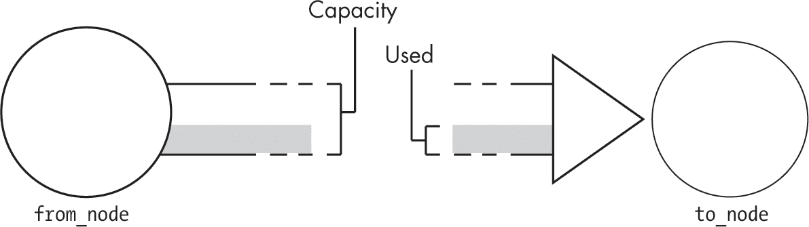

图 14-3：一个 CapacityEdge 对象的属性

与我们在第一章中定义并在全书中使用的<sup class="SANS_TheSansMonoCd_W5Regular_11">Edge</sup>数据结构不同，CapacityEdge对象既提供存储功能，又提供操作这些存储的函数，如下所示：

```
class CapacityEdge: 
    def __init__(self, from_node: int, to_node: int, capacity: float):
        self.from_node: int = from_node
        self.to_node: int = to_node
        self.capacity: float = capacity
      ❶ self.used: float = 0.0

    def adjust_used(self, amount: float): 
      ❷ if self.used + amount < 0.0 or self.used + amount > self.capacity:
            raise Exception("Capacity Error")
        self.used += amount

    def capacity_left(self) -> float: 
        return self.capacity - self.used

    def flow_used(self) -> float: 
        return self.used 
```

构造函数初始化对象的变量，将used设置为0，表示边的初始流量为零❶。接下来，adjust_used()函数允许算法修改流经该边的流量。它接受一个调整值，并将其添加到当前使用的流量中。我们可以将该函数形象化为水龙头的旋钮。如果我们将其旋转一侧，传入正值，流量增加；如果将其旋转到另一侧，传入负值，流量减少。然而，与水龙头不同的是，当流量达到上限时，函数不会自动“停止旋转”。代码中包含额外的检查，以确保使用的容量在边的规定限制范围内❷。具体而言，流经一条边的流量不能小于 0，也不能大于该边的总容量。

进一步推展水龙头的类比，我们可能希望能够指示每个方向上可以旋转水龙头的程度。我们提供了函数capacity_left()，以指示边上剩余的未使用容量（也称为*前向残余*）。这是我们可以在边上增加的额外流量。类似地，我们提供了函数flow_used()，用于指示当前已使用的容量（也称为*反向残余*）。

#### 残余图

就像我们需要添加功能来追踪边中已使用的容量一样，我们还必须增强图的表示，以支持这些动态边的存储和计算。我们还添加了与最大流问题相关的辅助跟踪信息，即源节点和汇节点的索引。我们将这种增强的图称为*残余图*，因为它跟踪节点对之间的剩余（或剩余）容量。

我们定义了一个ResidualGraph类，它使用更简化的邻接表表示，并包含以下内容：

num_nodes **（**int**）** 存储图中节点的总数。

source_index **（**int**）** 存储源节点的索引。

sink_index **（**int**）** **存储汇点节点的索引。

edges **（**list**）** **存储一个字典，该字典包含每个节点的相邻边对象，按目标节点键控。要访问从节点j到节点k的CapacityEdge，我们使用edges[j][k]。

all_neighbors **（**list**）** **存储每个节点的所有入邻居和出邻居索引的集合。

ResidualGraph表示与<class="SANS_TheSansMonoCd_W5Regular_11">Graph类的不同之处在于，我们不再存储Node对象。相反，相同的邻接表信息，包括字典的使用，被合并到edges列表中。虽然这种方式呈现了一个更紧凑的表示方式，足以支持最大流算法，但我们失去了在节点中轻松存储辅助数据的能力，这在其他算法中曾被使用。

尽管我们在处理有向图，我们介绍的算法仍需要扫描所有邻居节点，包括不包含在传统邻接表中的入邻居。为了方便这些计算，我们存储了额外的列表all_neighbors。将任意两个节点之间的连接限制为单一的有向CapacityEdge（不允许反向平行边）使得前向和后向流的推理变得更加容易。如我们所见，这种限制并不减少图的表示能力，因为我们可以将一个带有反向平行边的图转化为一个没有这些边的图。

为了演示 edges 和 all_neighbors 列表如何捕获图的结构，考虑图 14-4 所示的例子 ResidualGraph 以及其两个列表数据结构。左侧显示的是四节点图，中央是对应的 edges 列表，右侧是 all_neighbors 列表。节点 1 有两条出边（节点 2 和节点 3），因此在其邻接字典 edges[1] 中有两个条目。字典 edges[1] 中的每个条目将邻居的索引映射到对应的 CapacityEdge，即从节点 1 出发的边。由于节点 1 还从节点 0 获得一条入边，因此集合 all_neighbors[1] 包含三个索引：0、2 和 3。

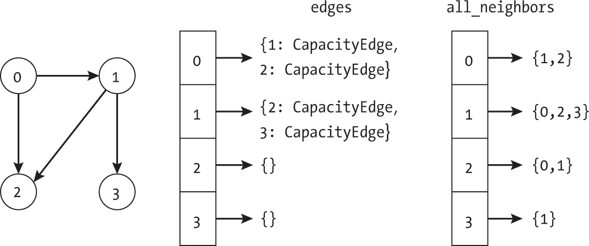

图 14-4：一个残余图及其内部列表数据结构

ResidualGraph 类提供了用于创建和操作这种类型图的函数：

```
class ResidualGraph: 
    def __init__(self, num_nodes: int, source_index: int, sink_index: int):
        self.num_nodes: int = num_nodes
        self.source_index: int = source_index
        self.sink_index: int = sink_index
        self.edges: list = [{} for _ in range(num_nodes)]
        self.all_neighbors: list = [set() for _ in range(num_nodes)]

    def get_edge(self, from_node: int, to_node: int) -> Union[CapacityEdge,
                                                              None]: 
        if from_node < 0 or from_node >= self.num_nodes:
            raise IndexError
        if to_node < 0 or to_node >= self.num_nodes:
            raise IndexError
        if to_node in self.edges[from_node]:
            return self.edges[from_node][to_node]
        return None

    def insert_edge(self, from_node: int, to_node: int, capacity: float): 
      ❶ if from_node < 0 or from_node >= self.num_nodes:
            raise IndexError
        if to_node < 0 or to_node >= self.num_nodes:
            raise IndexError

      ❷ if from_node == self.sink_index:
            raise ValueError("Tried to insert edge FROM sink node.")
        if to_node == self.source_index:
            raise ValueError("Tried to insert edge TO source node.")
        if from_node in self.edges[to_node]:
            raise ValueError(f"Tried to insert edge {from_node}->{to_node}, "
                             f"edge {to_node}->{from_node} already exists.")
        if capacity <= 0:
            raise ValueError(f"Tried to insert capacity {capacity}")

      ❸ self.edges[from_node][to_node] = CapacityEdge(from_node, to_node,
                                                      capacity) ❹ self.all_neighbors[from_node].add(to_node)
        self.all_neighbors[to_node].add(from_node)

    def compute_total_flow(self) -> float: 
        total_flow: float = 0.0
        for to_node in self.edges[self.source_index]:
            total_flow += self.edges[self.source_index][to_node].flow_used()
        return total_flow 
```

构造函数通过为所有节点创建空的邻接字典（edges）和邻居集合（all_neighbors）来创建一个空图。接下来，get_edge() 函数是从 Graph 类中镜像出来的，允许我们访问每条边。这个函数的大部分代码用于边界检查：如果 from_node 或 to_node 不在图中，函数会抛出 IndexError。如果边不在图中，函数返回 None。如果节点有效且边存在于图中，代码会返回对应的 CapacityEdge。这段代码依赖于从 typing 库导入 Union 来支持多种返回类型的类型提示。

由于 ResidualGraph 使用不同的结构来存储具有容量的边并添加更多的邻居信息来跟踪传入边，因此 insert_edge() 函数需要相应地跟踪这些信息。代码首先进行与我们在 Graph 类中使用的相同的索引有效性检查 ❶，并添加检查以确保我们在最大流问题中对图的结构约束 ❷。这些检查包括： (1) 确保汇节点没有出边，(2) 确保源节点没有入边，(3) 确保新插入的边不是现有边的反向，(4) 确保容量大于零。

如果所有检查都通过，代码会创建一个新的 CapacityEdge 并将其添加到 edges 列表的相应条目中 ❸。如果在同一方向上这两个节点之间已经插入了边，代码会覆盖它。最后，代码将 to_node 添加到 from_node 的所有邻居列表中，并将 from_node 添加到 to_node 的所有邻居列表中 ❹。

compute_total_flow() 函数演示了如何使用 ResidualGraph 中的值来推理其属性，通过对每条从源节点离开的边的流量求和来计算从源到汇的总流量。由于所有流量都来自单一源节点，因此这就是图中的总流量。

ResidualGraph 类中的其余函数与 Ford-Fulkerson 算法的操作密切相关；我们将在介绍算法时结合上下文展示它们。

### Ford-Fulkerson 算法

数学家 L.R. Ford Jr. 和 D.R. Fulkerson 开发了一种通用方法，通过反复找到源到汇之间的未充分利用的路径，并增加这些路径上的流量，从而找到图中的最大流。这种方法依赖于 *增广* *路径* 的概念，即从源节点到汇节点的路径，沿着该路径可以增加流量。Ford-Fulkerson 技术上是一个通用方法，涵盖了一系列特定的算法，因为原始论文没有指定用哪种搜索算法来查找增广路径。本节介绍了一个使用深度优先搜索的示例实现。

一般的 Ford-Fulkerson 方法可能会在容量使用无理数的病态情况下无法终止。这些情况可以通过限制容量的精度来避免，或者正如本章稍后所示，通过选择具有最少边的增广路径来避免。

#### 定义增广路径

增广路径的最简单形式是从源点到汇点的一系列有向边，这些边的当前流量小于其容量。在这种情况下，如图 14-5(a)所示，我们可以沿路径[0, 2, 3]添加流量，将总流量增加 2 个单位。图 14-5(b)展示了结果，总流量从源点离开并进入汇点，达到了 7 个单位。

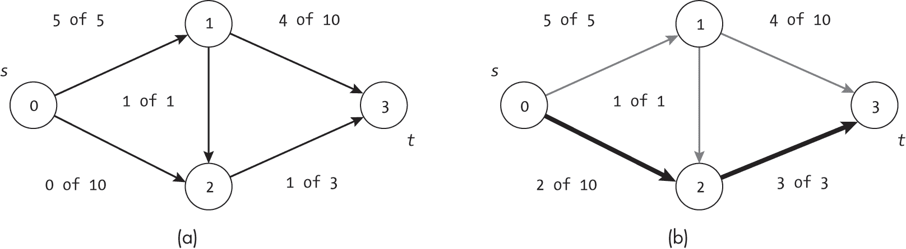

图 14-5：添加流量前后的容量图（a）和（b）

然而，仅仅增加前向流量只能部分解决问题。图 14-6 展示了这样一种情况：从源点到汇点没有未使用容量的路径。该图并未达到最大流量，因为从节点 1 到节点 2 的流量正在从节点 1 到节点 3 的潜在流量中抽取流量。同时，这种流量导致了从节点 2 到节点 3 的边被完全利用，从而无法接受来自边(0, 2)的更多流量。

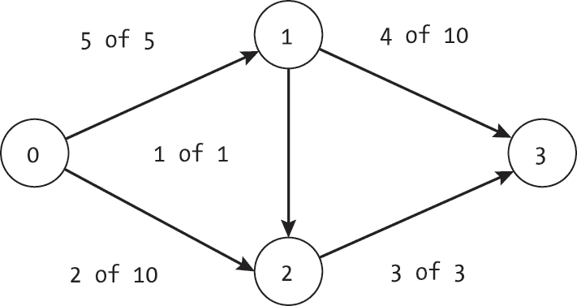

图 14-6：没有低利用率前向路径的图

我们可以使用图 14-7 中展示的两个步骤来增加图的流量。进入节点 1 的 5 个单位流量最初被分成两个流，1 个单位流量流向节点 2，4 个单位流量流向节点 3。我们将这种分配更改为将 1 个额外的单位流量引导到节点 3，如图 14-7(a)所示。图中的总流量保持不变，但边(2, 3)上的流量现在降到容量以下。其次，我们增加了从节点 0 通过节点 2 到节点 3 的流量，如图 14-7(b)所示，将图的整体流量增加到 8 个单位。


图 14-7：在图 14-6 中添加流量的两步

为了重新路由流量，算法还需要能够通过将流量转移到另一条边上来减少沿某条边的流量。因此，我们将沿有向边（*u*，*v*）的*残余*定义如下。向前残余是从节点*u*到节点*v*的未使用容量，即*capacity*（*u*，*v*）−*flow*（*u*，*v*）。这与我们通常所理解的额外容量一致。向后残余是沿着与边方向相反的方向，即从节点*v*到节点*u*的已使用容量*flow*（*v*，*u*）。这对应于可以从节点*u*的输入中移除的容量，允许我们接受来自其他地方的输入。

我们可以通过低利用率的有向边传递更多流量，或者将流量推回有向边的相反方向。图 14-8 展示了结合向前和向后残余的示例情况。

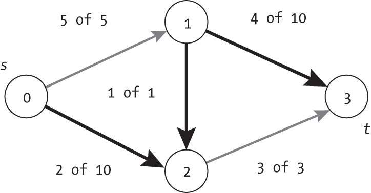

图 14-8：包含沿边减少流量的增广路径

加粗的边表示从源到汇的无向路径，我们可以按如下方式修改流量：

+   边（0, 2）有一个向前残余值为 8，因此我们可以通过该边向节点 2 添加更多单位的流量。

+   边（1, 2）有一个向后残余值为 1，因此我们可以将该流量减少 1 个单位，以便允许节点 2 从另一个源（在本例中是节点 0）接收更多流量。由于节点 2 的输出流量上限为 3 个单位，并且我们需要保持流入和流出相等，我们需要减少从节点 1 流入节点 2 的流量，以便增加从节点 0 流入节点 2 的流量。

+   边（1, 3）有一个向前残余值为 6，因此它可以接收节点 1 不再流向节点 2 的额外输出。同样，我们需要保持节点 1 的流入流量与流出流量平衡。

理解福特-福尔克森算法的关键在于，推动流量通过反向边实际上是减少从源节点流出的流量，使其能够流向新的目的地。正如我们将在下一节中看到的那样，我们需要在任一方向推动流量，这意味着仅仅探索每个节点（有向）邻接表中的边已经不再足够。我们需要考虑进出节点的边。

我们可以将这个算法可视化为一个污水工程师管理之前描述的污水系统。该工程师通过将流量引导到最佳管道集来最大化总的污水流量。主要约束是管道（边）和接头箱（节点）的容量。最后一位工程师为了炫耀，忽略了总容量，推动了超过实际可行的流量。超负荷的管道迅速爆裂，导致了一个污水喷泉，这个事件在报纸上讨论了好几周。

新的工程师通过不断寻找从源点到汇点的路径，来解决这个问题，直到该路径无法再承载更多污水，并且将尽可能多的污水通过该路径传输（但不超过）。有时这意味着要反向推动已有的流量，这没问题，只要这些流量能够通过另一个接头（节点）流向汇点。任何流入接头的污水也必须流出。否则，它有可能导致接头箱爆裂。工程师不断增加流量，直到所有路径都完全饱和。

#### 寻找增广路径

在我们定义搜索算法之前，我们需要形式化路径上剩余流量的计算。从前面的描述中我们可以记得，增广路径可以包含正向剩余流量和反向剩余流量的组合。我们在 ResidualGraph 类中定义了一个辅助方法，以简化计算路径上任意两节点之间剩余流量（无论是正向还是反向）的逻辑：

```
def get_residual(self, from_node: int, to_node: int) -> float: 
  ❶ if to_node not in self.all_neighbors[from_node]:
        return 0

  ❷ if to_node in self.edges[from_node]:
        return self.edges[from_node][to_node].capacity_left()
    else:
        return self.edges[to_node][from_node].flow_used() 
```

get_residual() 函数首先检查两个节点是否连接 ❶。如果没有连接，那么该边既不是正向边也不是反向边，剩余流量为零。如果边（from_node，to_node）在有向边的邻接表中，那么它是正向边 ❷，函数返回剩余容量（正向剩余流量）。否则，该边必定存在于相反方向，因此代码返回已使用的流量（反向剩余流量）。

在本节中，我们使用修改后的深度优先搜索来检查图中是否存在增广路径：

```
def find_augmenting_path_dfs(g: ResidualGraph) -> list: 
    seen: list = [False] * g.num_nodes
    last: list = [-1] * g.num_nodes
    augmenting_path_dfs_recursive(g, g.source_index, seen, last)
    return last

def augmenting_path_dfs_recursive(g: ResidualGraph, current: int,
                                  seen: list, last: list): 
    seen[current] = True
    for n in g.all_neighbors[current]:
      ❶ if not seen[n] and g.get_residual(current, n) > 0:
            last[n] = current
          ❷ if last[g.sink_index] != -1:
                return
            augmenting_path_dfs_recursive(g, n, seen, last) 
```

这段代码由一对函数组成。首先，find_augmenting_path_dfs() 函数设置了用于深度优先搜索的列表 seen 和 last，如第四章中所描述。接着，它调用递归的深度优先搜索函数，并返回表示增广路径的 last 列表。

augmenting_path_dfs_recursive() 函数执行递归的深度优先探索。与标准的深度优先搜索相同，它将当前节点标记为已访问，然后遍历该节点的邻居。代码使用 for 循环遍历残余图的 all_neighbors 列表，沿着有向边的两个方向进行探索。在探索当前节点的邻居时，代码会检查该节点是否未被访问（如同标准的深度优先搜索）以及残余是否非零 ❶。这个条件防止了搜索使用已经饱和的边。如果边是可行的并且该节点未被访问，搜索将更新跟踪信息，并递归地探索该节点。

代码包含一个可选的提前终止检查 ❷。它会在从源节点到汇节点找到路径时停止探索新的邻居。通过检查 last[g.sink_index] 是否已被赋值，代码可以跳过在汇节点之前和路径上较早节点的递归探索。

图 14-9 显示了在图 14-6 中的图上，find_augmenting_path_dfs() 的迭代过程。每条边都标记为 *X* / *Y*，其中 *X* 是已使用的流量，*Y* 是该边的总容量。已访问的节点为阴影标记，虚线圈中的节点是刚刚调用递归函数的节点。

![在(A)中，节点 0 被圈出，last 的值为[–1, –1, –1, –1]。在(B)中，节点 2 被圈出，last 的值为[–1, –1, 0, –1]。在(C)中，节点 1 被圈出，last 的值为[–1, 2, 0, –1]。在(D)中，没有节点被圈出，last 的值为[–1, 2, 0, 1]。](../images/f14009.jpg)

图 14-9：查找增广路径的搜索步骤

图 14-9(a) 显示了源节点未被访问前算法的状态。图 14-9(b) 显示了搜索的第二步：在访问节点 0 后，算法找到了两个邻居节点 1 和 2。只有边(0, 2)的容量未使用，因此搜索继续沿该分支进行。

由于该算法考虑了出边和入边，它在节点 2 找到两个选项。边 (1, 2) 和 (2, 3) 在各自的方向上已满载。然而，边 (1, 2) 是从节点 2 进入的，因此它有一个反向剩余值为 1。这条边为我们提供了一个减少流入节点 2 的机会。如图 14-9(c) 所示，搜索沿这条边继续，探索节点 1。

在探索节点 1 时，算法找到了一条通向汇点节点的未使用容量的路径。代码不会访问汇点节点，而是一旦找到任何路径便返回。在此情况下，如图 14-9(d) 所示，算法返回一个 last 数组 [-1, 2, 0, 1]，表示增广路径。

#### 更新路径的容量

在找到增广路径后，Ford-Fulkerson 算法必须确定可以通过路径推送多少额外的流量，然后更新路径的容量以表示增加的流量。为此，我们向 ResidualGraph 类添加了两个函数。min_residual_on_path() 函数通过最后指针遍历路径，并计算路径上任何边的最小剩余值：

```
def min_residual_on_path(self, last: list) -> float: 
    min_val: float = math.inf

    current: int = self.sink_index
  ❶ while current != self.source_index:
        prev: int = last[current]
        if prev == -1:
            raise ValueError
        min_val = min(min_val, self.get_residual(prev, current))
      ❷ current = prev
    return min_val 
```

代码首先将 min_val 设置为无穷大（这要求文件包含 import math），作为尚未找到最小值的标志。然后，它使用 while 循环从汇点反向遍历指针链，直到到达源节点 ❶。在每一步，它考虑当前节点前面的节点，并检查它是否不是 -1，如果是 -1，则表示路径断开。代码通过在当前边上使用 get_residual() 更新最小值，并继续前进到前一个节点 ❷。在检查完路径上的所有边后，代码返回它遇到的最小剩余值。

如果我们对图 14-6 中显示的结果应用 min_residual_on_path()，并且 last 数组为 [-1, 2, 0, 1]，我们就可以遍历图 14-8 中显示的路径。该路径上的最小剩余值是沿边 (1, 2) 的 1。

一旦我们确定了可以通过路径推送多少额外的流量，我们就使用 update_along_path() 函数来更新路径：

```
def update_along_path(self, last: list, amount: float): 
    current: int = self.sink_index
  ❶ while current != self.source_index:
        prev: int = last[current]
        if prev == -1:
            raise ValueError

      ❷ if current in self.edges[prev]:
            self.edges[prev][current].adjust_used(amount) else:
            self.edges[current][prev].adjust_used(-amount)
        current = prev 
```

与min_residual_on_path()函数类似，update_along_path()函数的代码通过使用while循环从汇点向源点回溯最后的指针 ❶。同样，它会检查前一个节点是否表示一个有效路径。如果有效，它会检查路径上边的方向，然后更新已用量 ❷。前向边在邻接表中出现，代码将新流量添加到已用容量上。反向边则是算法将流量回推的地方。边的方向是相反的，因此该边本身不在邻接表中。代码从已经使用的量中减去新流量。

#### 将所有部分组合在一起

使用深度优先搜索的福特-富尔克森算法由我们在整个章节中介绍的各个部分组成。如清单 14-1 所示，算法反复搜索增广路径。当找到增广路径时，它计算路径上的最小剩余，并相应地增加流量。

```
def ford_fulkerson(g: Graph, source: int, sink: int) -> ResidualGraph: 
  ❶ residual: ResidualGraph = ResidualGraph(g.num_nodes, source, sink)
    for node in g.nodes:
        for edge in node.edges.values():
            residual.insert_edge(edge.from_node, edge.to_node, edge.weight)

  ❷ done = False
    while not done:
      ❸ last: list = find_augmenting_path_dfs(residual)
      ❹ if last[sink] > -1:
            min_value: float = residual.min_residual_on_path(last)
            residual.update_along_path(last, min_value)
        else:
            done = True

    return residual 
```

清单 14-1：使用深度优先搜索的福特-富尔克森算法

代码通过创建一个ResidualGraph开始，其中容量等于原始图的权重 ❶。这有效地复制了图形，同时也转变了表示方式。

算法的主循环相对较小，开始时使用一个布尔值done来跟踪上一次迭代是否找到了增广路径 ❷。如果找到了，done将被设置为False，代码将继续搜索新的增广路径 ❸。代码检查返回的路径是否有效 ❹，如果有效，使用min_residual_on_path()函数计算路径上的最小剩余，并使用update_along_path()函数更新路径上的流量。如果代码在汇点处发现last值为-1，说明从源点到汇点没有路径，可以将done设置为True。该函数最后返回剩余图。

#### 一个示例

图 14-10 展示了 Ford-Fulkerson 算法在一个示例图上运行的情况，其中每个子图表示算法进行一次迭代后的<sup class="SANS_TheSansMonoCd_W5Regular_11">ResidualGraph</sup>状态。加粗的箭头表示在每次迭代中找到的增广路径，并且已更新容量的使用部分，完全使用该增广路径，如每条边上的*X*和*Y*符号所示。

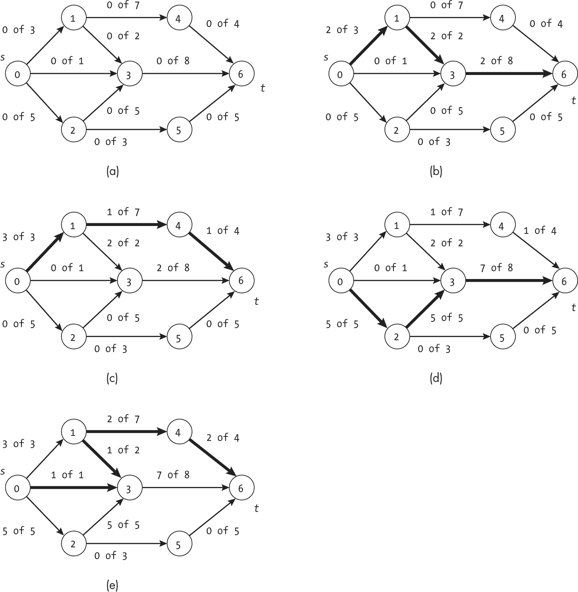

图 14-10：带有深度优先搜索的 Ford-Fulkerson 算法步骤，应用于包含七个节点的图

图 14-10 展示了使用深度优先搜索如何影响 Ford-Fulkerson 算法获取增广路径的顺序。例如，尽管在示例图底部通过边(0, 2)、(2, 5)和(5, 6)存在一条容量为 3 的路径，但算法首先填充了一些较小的流量，例如图 14-10(c)中的容量为 1 的路径。

图 14-10(e)展示了一条使用正向和反向剩余流的增广路径。为了增加通过边(4, 6)到达汇点的流量，算法将流量从节点 1 的边(1, 3)重定向到边(1, 4)。这给节点 4 提供了 2 个单位的输入，算法可以将其传递到汇点。然而，这使得节点 3 少了 1 个单位的流量。搜索通过从源点通过边(0, 3)的额外流量来弥补节点 3 的输入损失。

一旦算法计算出<sup class="SANS_TheSansMonoCd_W5Regular_11">ResidualGraph</sup>，我们可以使用该数据结构来回答其他问题。例如，我们可以使用<sup class="SANS_TheSansMonoCd_W5Regular_11">compute _total_flow()</sup>函数来计算图的最大流量。

### 埃德蒙兹-卡普算法

计算机科学家耶菲姆·迪尼茨（以 E.A. Dinic 为名）和计算机科学家杰克·埃德蒙兹与理查德·M·卡普分别发表了关于 Ford-Fulkerson 算法的分析，这些分析选择了边数最少的增广路径。这个方法现在被称为*迪尼茨算法*或*埃德蒙兹-卡普算法*，它通过这种路径选择避免了在使用非理性边容量时的种种问题，从而在所有情况下限制了算法的迭代次数。本节将展示如何利用广度优先搜索来找到这样的增广路径。

#### 代码

大多数 Edmonds-Karp 算法使用之前介绍的 Ford-Fulkerson 算法中的函数，如update_along_path()和min_residual_on_path()。我们需要更改的只是寻找增广路径的函数和调用它的外部函数。

我们使用改进版的广度优先搜索来寻找增广路径：

```
def find_augmenting_path_bfs(g: ResidualGraph) -> list: 
    seen: list = [False] * g.num_nodes
    last: list = [-1] * g.num_nodes
    pending: queue.Queue = queue.Queue() ❶ seen[g.source_index] = True
    pending.put(g.source_index)
  ❷ while not pending.empty() and not seen[g.sink_index]:
        current: int = pending.get()
        for n in g.all_neighbors[current]:
          ❸ if not seen[n] and g.get_residual(current, n) > 0:
              ❹ pending.put(n)
                seen[n] = True
                last[n] = current

    return last 
```

find_augmenting_path_bfs()函数首先设置标准的广度优先搜索数据结构，包括每个节点是否已被访问的列表（seen），路径上前一个节点的列表（last），以及待探索节点的队列（pending）。使用Queue数据结构需要在文件顶部额外添加import queue。然后，函数将源节点插入为起点❶。主while循环会继续，直到待处理队列为空或汇点节点已被访问❷。与深度优先搜索代码一样，这第二个检查使得搜索一旦找到*任何*从源点到汇点的路径就终止。

在探索当前节点的邻居时，代码检查该节点是否未被访问（如同标准的广度优先搜索）以及残量是否非零❸。如果该边是可行的且节点未被访问，搜索会更新追踪信息并将其添加到队列中❹。

图 14-11 展示了find_augmenting_path_bfs()在一个部分容量已被使用的图上的迭代过程。阴影部分的节点表示已被访问，虚线框中的节点是搜索刚刚*处理完成*的节点。

图 14-11(a)展示了while循环开始前算法的状态，而图 14-11(b)展示了搜索的第一步。访问节点 0 后，我们发现了两条未访问邻居节点（节点 1 和 3）之间具有未使用容量的边。两邻居被加入到pending队列中。

该算法在图 14-11(c)中与标准的广度优先搜索有所不同。尽管节点 2 是节点 1 的邻居，但边(1, 2)已经满了。我们无法通过该边再发送流量，因此算法排除了使用该边的路径，并将节点 2 保持为未访问状态。直到图 14-11(d)，它才找到一条通向节点 2 的可行路径（从节点 3 出发）。

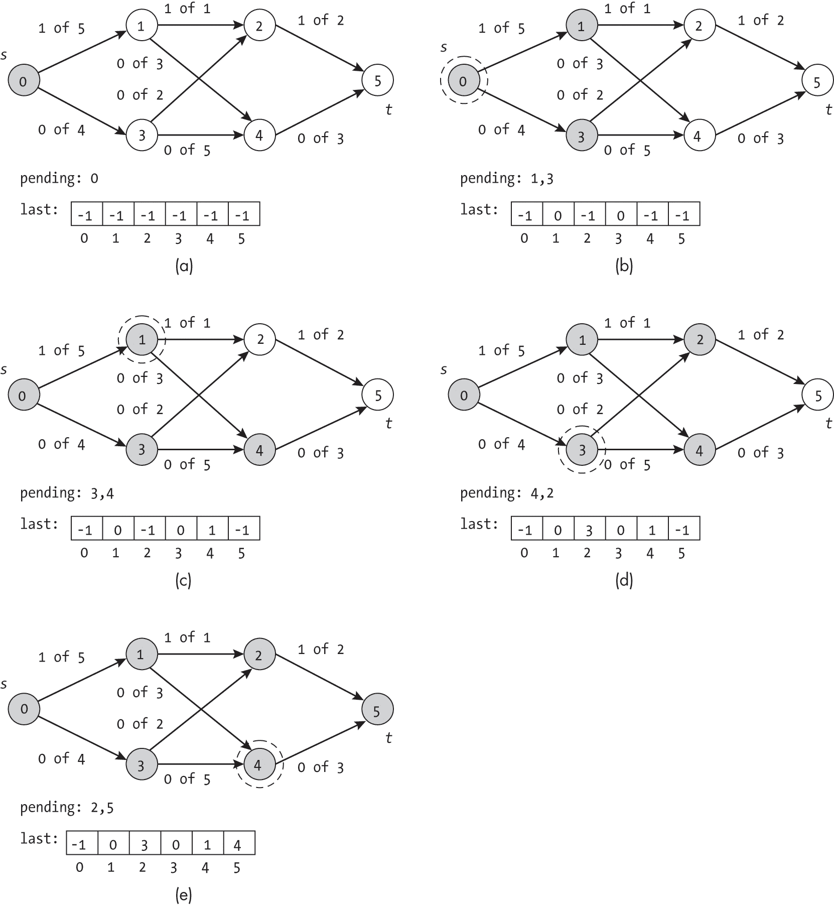

图 14-11：搜索增广路径的步骤

搜索在 图 14-11(e) 中完成，找到通向汇节点的路径。此时，它已经找到了一个可行的路径 [0, 1, 4, 5] 从源节点到汇节点，无需考虑其他节点。

顶级 Edmonds-Karp 算法的代码与 清单 14-1 中的 Ford-Fulkerson 深度优先搜索版本几乎相同：

```
def edmonds_karp(g: Graph, source: int, sink: int) -> ResidualGraph: 
    residual: ResidualGraph = ResidualGraph(g.num_nodes, source, sink)
    for node in g.nodes:
        for edge in node.edges.values():
            residual.insert_edge(edge.from_node, edge.to_node, edge.weight)

    done = False
    while not done:
      ❶ last: list = find_augmenting_path_bfs(residual)
        if last[sink] > -1:
            min_value: float = residual.min_residual_on_path(last)
            residual.update_along_path(last, min_value)
        else:
            done = True
    return residual 
```

与 清单 14-1 中的代码唯一显著的不同是使用了函数 find_augmenting_path_bfs() 来进行增广路径的搜索 ❶。

#### 一个示例

图 14-12 显示了在一个包含 8 个节点和 11 条边的图上运行 Edmonds-Karp 算法的示例，其中节点 0 为源节点，节点 7 为汇节点。 图 14-12(a) 表示第一次迭代前的 ResidualGraph 状态。此时，所有边的容量都没有被使用。算法的每个后续步骤都显示在*每次*增广路径更新后；加粗的边表示所使用的增广路径。例如，在 图 14-12(b) 中，边 (0, 1)、(1, 2) 和 (2, 7) 形成增广路径。最小残余为 3，子图显示了在该路径上增加 3 个单位流量后的已使用容量。

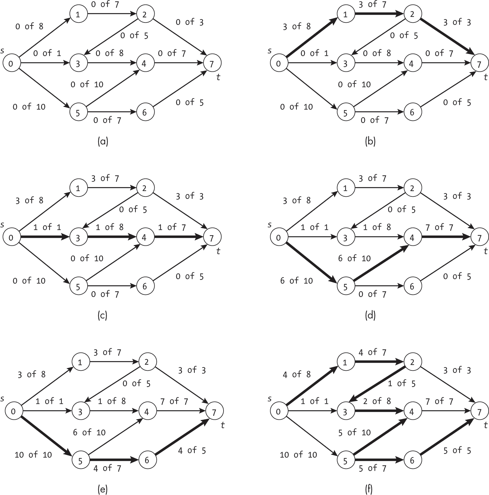

图 14-12：在一个包含八个节点的图上执行 Edmonds-Karp 算法的步骤

图 14-12(f)展示了算法使用反向剩余流的步骤。在经过四轮仅沿前向边缘的搜索后，搜索遇到了瓶颈，并*减少*了从节点 5 到节点 4 的边的流量，以释放更多的容量。为了理解这种操作的帮助，考虑从节点 0 到节点 5 的流量。在最后一步之前，流量已经达到了最大值。该边无法处理超过 10 个单位的流量。然而，这个流量并未得到最优利用。通过减少从节点 5 到节点 4 的流量，我们可以将更多的流量通过节点 6 送往汇点。这使得节点 4 的流入流量低于流出流量。为了解决这种不平衡，我们需要通过替代路径推动更多的流量。在这种情况下，额外的单位流量通过路径[0, 1, 2, 3, 4]到达节点 4。### 建模日益复杂的现实世界情况

我们的最大流算法对图的结构设置了限制，以简化对算法的推理。这些约束包括将图限制为单一源节点和单一汇点，并禁止反向平行边。本节将探讨如何放宽其中一些限制，以建模日益复杂的现实世界情况。

#### 多个源

许多现实世界的流网络包含多个源节点。例如，考虑我们在本章中一直使用的废水问题的更现实的视角。与单一的进水管道相比，网络更有可能包括来自每个与系统连接的建筑物的管道。即使我们在城市层面建模，我们也可以预期新的源节点将来自周边郊区加入到网络中。图 14-13(a)显示了一个包含三个源节点的网络。


图 14-13：具有多个源的流图（a）及其对应的模型，单一聚合源（b）

幸运的是，我们可以通过添加一个新的人工源节点*s*′来轻松扩展流网络模型，该节点有效地为所有先前的源节点提供流量。新源节点通过有向边连接到每个先前的源节点。反过来，这些先前的源节点现在成为我们扩展模型中的内部节点，如图 14-13(b)所示。加粗的箭头表示从新节点到先前源节点添加的新边。

当然，我们的人工源节点在现实中并不存在。城市的暴雨排水系统并不是由一个秘密的超级排水管道提供的。相反，聚合源作为一种方便的数学抽象，允许我们将所有流量的源归结为一个单一（虚拟）节点。

添加新节点和边引发了一个问题，即我们如何选择这些新边的容量。如果我们将其容量设置得太低，这些边将成为瓶颈，导致无法准确建模问题。然而，如果我们将边的权重设置得过高也没关系，因为瓶颈将成为原始网络中已经存在的瓶颈。因此，我们可以在这些新边上使用无限容量，以便为之前的源提供它们可以处理的所有流量。在废水系统的背景下，这些边将是巨大的管道，远远超过任何工程师实际能够建造的流量。

我们创建了一个辅助函数，用于将一个具有多个源的任意图增广，添加聚合源，如 Listing 14-2 所示。

```
def augment_multisource_graph(g: Graph, sources: list) -> int: 
  ❶ new_source: Node = g.insert_node()

  ❷ for old_source in sources:
        g.insert_edge(new_source.index, old_source, math.inf)
    return new_source.index 
```

Listing 14-2: 将多源图转换为单源图

代码将一个新节点插入到图中 ❶。对于每个之前的源，代码会从新源到该源创建一个具有无限容量的新边 ❷。最后，代码返回新源的索引，以供我们在调用 Ford-Fulkerson 算法时使用。

#### 多个汇点

就像许多现实世界的问题有多个源一样，我们经常遇到具有多个汇点的网络。以洲际公路系统为例，汽车和卡车沿着道路流向多个不同的目的地。Figure 14-14(a) 显示了一个具有两个汇点节点的网络。

我们可以将用于多源问题的方法适配到处理多个汇点的问题。我们创建一个新的聚合汇点 *t*′，并从每个之前的汇点到新聚合汇点创建有向边，如图 Figure 14-14(b) 所示。新节点和边被加粗显示。我们为这些边分配足够的容量，以确保它们不会产生新的瓶颈。

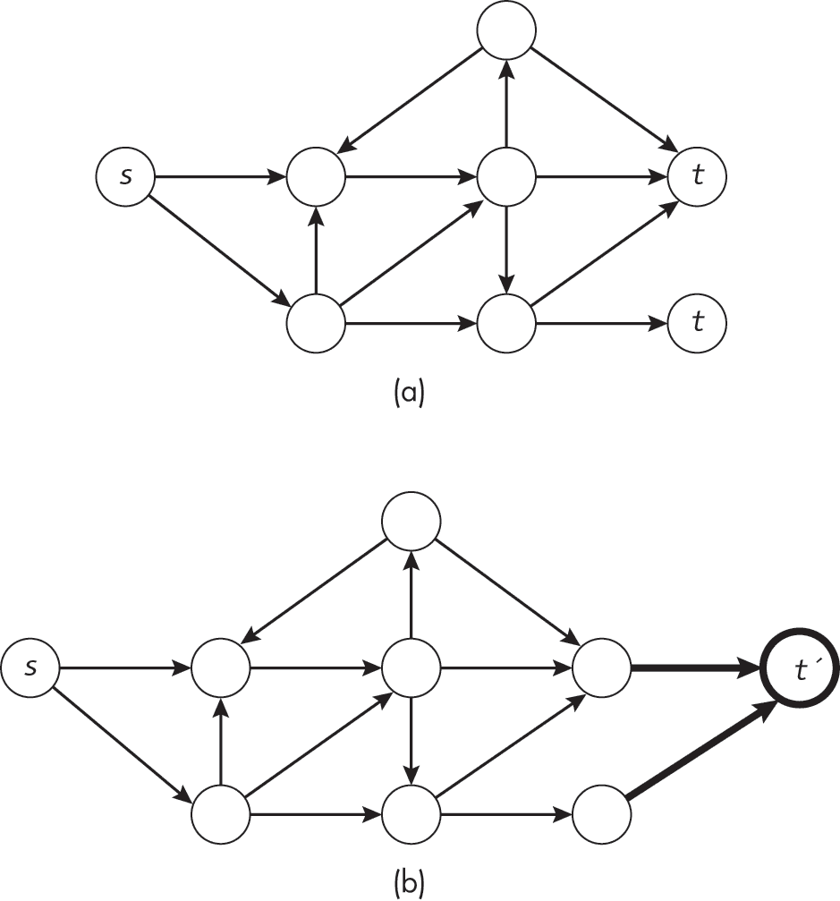

Figure 14-14: 一个具有多个汇点的流量图（a），以及相应的具有单一聚合汇点的模型（b）

同样，我们提供一个辅助函数，用于将给定图增广，添加多个汇点：

```
def augment_multisink_graph(g: Graph, sinks: list) -> int: 
    new_sink: Node = g.insert_node()

    for old_sink in sinks:
        g.insert_edge(old_sink, new_sink.index, math.inf)
    return new_sink.index 
```

代码遵循 augment_multisource_graph() 函数的形式，如 Listing 14-2 所示。它将一个新的汇点节点插入图中，创建与每个旧汇点之间具有足够容量的边，并返回这个新节点的索引。

#### 反向边

在实际应用中，禁止反向平行边也是不现实的。继续以州际高速公路系统为例，几乎每条高速公路都是双向道路：你可以从克利夫兰到布法罗，也可以从布法罗到克利夫兰。

我们可以使用另一个数学技巧来支持这种实际案例，同时保持图中不允许有反向平行边的限制。当处理一个包含边(*u*, *v*)，容量为*w*[1]和边(*v*, *u*)，容量为*w*[2]的回路时，如图 14-15(a)所示，我们可以添加一个新节点*x*，并将边(*u*, *v*)替换为边对(*u*, *x*)和(*x*, *v*)，如图 14-15(b)所示。如果我们将先前边(*u*, *v*)的容量*w*[1]应用于边(*u*, *x*)和(*x*, *v*)，则扩展路径允许的总流量为相同的值（*w*[1]）。

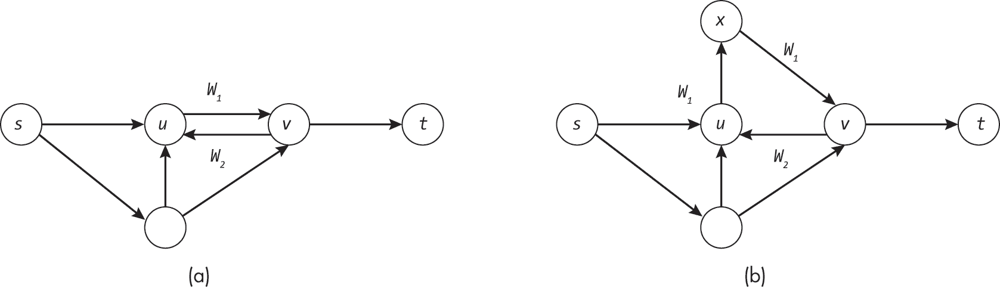

图 14-15：包含两个边的回路图（a）及其扩展版本（b）

我们可以定义一个单一的预处理步骤，遍历图中的所有边，并在需要时插入额外的节点和边。如果原始图包含一条边（起点，终点）及其反向边（终点，起点），那么我们就有反向平行边，需要插入一个新节点。

### 为什么这很重要

我们可以利用最大流问题来解答各种实际的分析和优化问题。除了单纯地从源点到汇点找到最大流量外，解决最大流问题的技巧还能为网络本身提供重要的见解：我们可以利用残差图来找到瓶颈，或者发现哪些链路存在过剩的容量。例如，假设我们对一个拟议的废水处理系统进行分析，结果显示，由于网络中的其他限制，一条容量为每分钟 50 加仑的管道只会使用每分钟 10 加仑。我们现在知道，这条管道是一个明显的节省成本的机会。

本章中的算法方法还提供了新的思路来思考和处理图。CapacityEdge 数据结构是标准边的扩展，它可以跟踪动态量，而在<sup class="SANS_TheSansMonoCd_W5Regular_11">ResidualGraph</sup>中的路径会随着流量的应用而变化。这是我们第一次看到需要考虑与边相关的动态量的算法。

正如我们将在下一章看到的，最大流算法有扩展到更一般的匹配问题，包括优化节点对之间的连接。我们还将看到这些技术如何应用于更抽象的最大基数二分图匹配问题。
