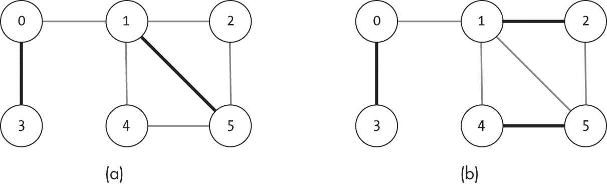
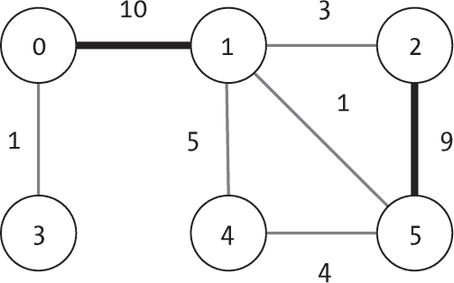
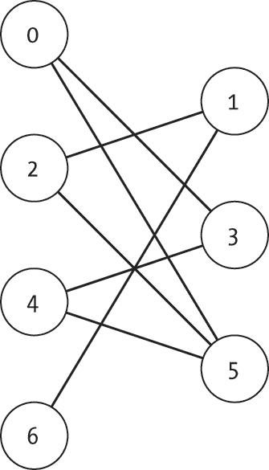
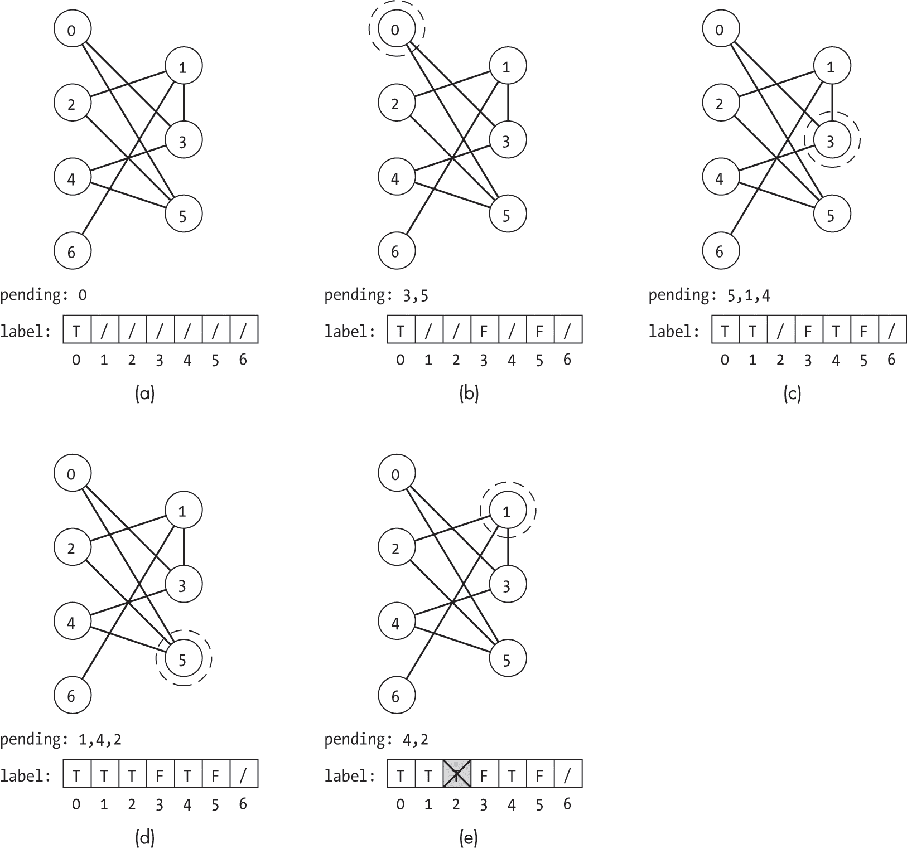
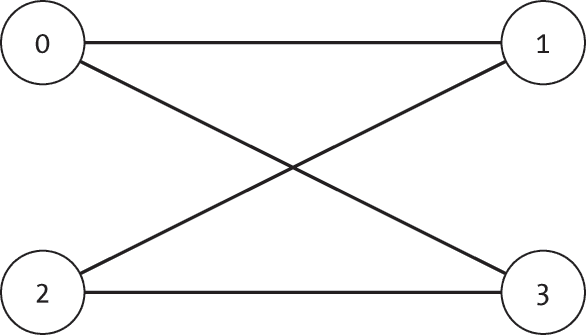
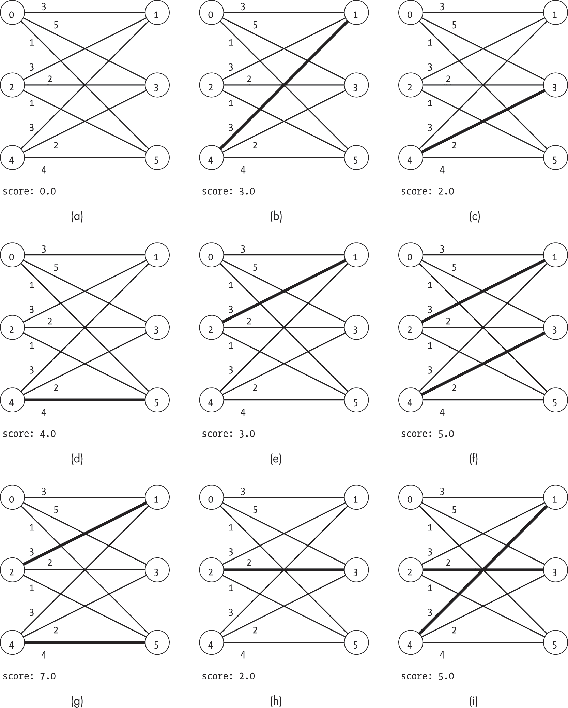
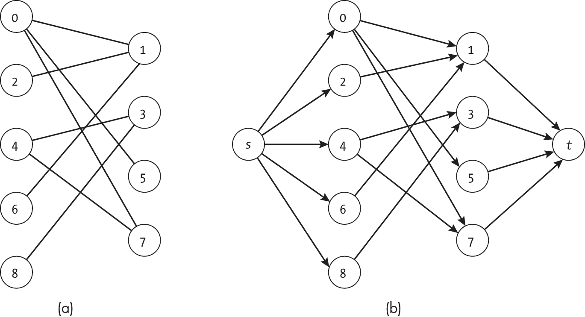
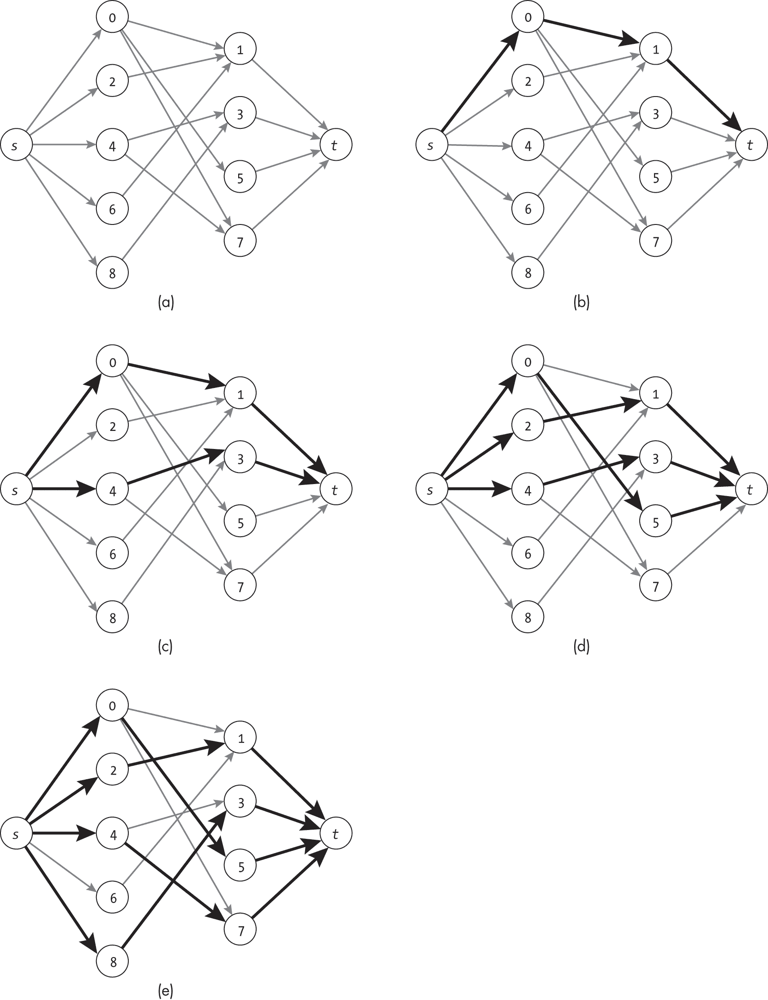
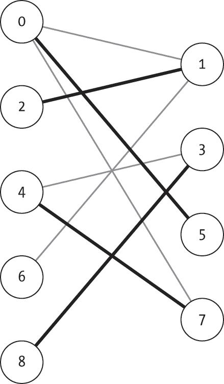

<hgroup>

## <samp class="SANS_Futura_Std_Bold_Condensed_B_11">15</samp> <samp class="SANS_Dogma_OT_Bold_B_11">二分图匹配</samp>

</hgroup>


许多商业和物流问题都涉及到从两个不同集合中匹配项目。我们可能需要将人匹配到工作、会议匹配到地点、车辆匹配到路线，或将被收养的宠物匹配到家庭。在每一种情况下，我们都必须询问哪个集合中的项目与第二个集合中的哪个项目兼容。本章将详细探讨这个问题，称为*二分图匹配*。

*二分图*是一个由两个不相交的节点集合组成的图，其中每条边的两端总是分别位于这两个集合中。这个图自然地适用于匹配问题：每个节点集合代表我们想要匹配的项目集，而边则表示项目之间的兼容性。

本章首先讨论图上匹配的更广泛概念，然后正式介绍无向二分图及其二分匹配算法，并展示图匹配涵盖了从为小组工作分配伙伴到数据中心作业调度等一系列问题，以及相关的技术挑战。

### <samp class="SANS_Futura_Std_Bold_B_11">匹配</samp>

在无向图上，*匹配*是指一组边，其中每条边的两个节点不共享任何节点。换句话说，匹配中的每条边连接两个不同的节点，每个节点最多只能与一条边相邻。我们可以通过使用学生之间的友谊关系来可视化匹配。在这种情况下，每条边代表两位朋友（边的两个节点），他们将合作完成项目。作为这种配对分配的自然结果，我们只会配对那些已经有社交关系的学生，且不能保证所有学生都能找到配对。

匹配的基本概念为我们提供了解决一系列问题的可能性。作为本章的具体示例，下面我们将讨论两个特别有用的匹配问题。首先，寻找一个*最大基数匹配*（有时缩写为*最大匹配*）的任务是找到一个具有最多边的匹配。这相当于为学生分配配对，创建最多的组。其次，*极大匹配*是指任何一个匹配，在这个匹配中没有额外的边可以加入而不破坏匹配属性。虽然最大基数匹配总是一个极大匹配，但反之则不成立。

图 15-1 展示了这两种匹配类型的示例。我们不能再向图 15-1(a)中的极大匹配中添加任何边（由粗体边表示），否则就会重用一个节点。同时，图 15-1(b)既是极大匹配，也是最大基数匹配：我们无法为该图创建一个超过三条边的匹配。



<samp class="SANS_Futura_Std_Book_Oblique_I_11">图 15-1：最大匹配（a）和最大基数匹配（b）</samp>

寻找*最大权重匹配*的问题是指在加权图中找到最大化边权总和的匹配。这对应于在分配小组时优先考虑学生之间的友谊强度。尽管这种方法在最大化奖励函数（如学生幸福感）的背景下是有用的，但它不一定会导致最大基数匹配。例如，图 15-2 展示了一个最大权重匹配，但它不是最大基数匹配。两个节点对{0, 1}和{2, 5}被匹配，而节点 3 和 4 被遗漏。



<samp class="SANS_Futura_Std_Book_Oblique_I_11">图 15-2：图上的最大权重匹配</samp>

可匹配问题的列表远不止这些初始示例。我们可以问一个图是否存在*完美匹配*，其中每个节点恰好被包含一次；找到一个最大基数匹配，最小化边权的总和；或者找到一个匹配，在保持边数不超过给定数量的情况下，最大化权重。在本章的其余部分，我们将主要集中于最大基数匹配，这是最简单且应用最广泛的形式之一，适用于特定图类型的背景。

### <samp class="SANS_Futura_Std_Bold_B_11">二分图</samp>

如前所述，*二分图*可以被划分为两个不相交的节点集，以至于没有边连接同一集中的两个节点。二分图通常被可视化为两行并行的节点，如图 15-3 所示。左列和右列定义了两个节点集。图中的每一条边都横跨这两列。



<samp class="SANS_Futura_Std_Book_Oblique_I_11">图 15-3：一个包含七个节点的二分图</samp>

二分图为配对匹配问题提供了一个自然模型。在一个典型的例子中，左侧的项代表人，而右侧的项代表他们有资格胜任的工作，这在一个简单的图中总结了复杂的约束条件。

虽然匹配是本章的重点，但二分图的实用性远不止于此。二分图可以模拟许多现象，从跨越河流的物理桥梁到在聚会中互相监视的间谍。

### <samp class="SANS_Futura_Std_Bold_B_11">二分图标记</samp>

给定一个无向图，我们可以询问它是否是二分图，如果是的话，哪个节点属于哪个集合。我们可以利用二分图的特性来进行这项检查，并标记哪些节点属于哪个集合。我们知道，任何通过无向二分图的路径都必须在两个集合之间交替，而一个节点不能有来自其所在集合的邻居。我们使用简单的搜索方法，无论是广度优先还是深度优先，遍历无向图并给节点分配标签。关键是，我们先任意为第一个节点分配一个标签，然后每当穿越一条边时，交替分配标签。如果我们发现两个邻居有相同的标签，我们就知道这个图不是二分图。

我们可以将这个算法想象成在一个鸡尾酒会上，多个间谍机构在竞争。各个间谍机构由不相交的间谍集合组成，表示为节点。每条边代表两个人互相监视的关系。这些间谍训练有素，每个间谍可以同时监视多个人——间谍 A 可能在监视间谍 B、间谍 C 和间谍 D！

一位无聊的服务员，无法识别舞厅里每个人的真实身份，利用这个机会来确定哪些间谍是合作的。他们首先随机挑选一名间谍并将其分配到绿色队伍。然后，他们确定这个间谍监视的所有人，并将这些人分配到黄色队伍。接下来，对于每个新发现的黄色成员，服务员会确定他们正在监视谁，并将被监视的人分配到绿色队伍。这个过程来回跳动，随着服务员递送各种开胃菜，揭示出每个人的归属。

当然，如果服务员发现有间谍监视自己队伍中的成员，他们就知道这个图不是二分图。也许间谍机构派来了内务人员，或者有双重间谍。不管怎样，情况不再是简单的黄色与绿色对立，服务员可能不想卷入其中。

#### <samp class="SANS_Futura_Std_Bold_Condensed_Oblique_BI_11">代码</samp>

Listing 15-1 中的二分图标记代码使用广度优先搜索（BFS）迭代地遍历图，并将节点标记为属于右侧或左侧。

```
def bipartite_labeling(g: Graph) -> Union[list, None]: 
    label: list = [None] * g.num_nodes
    pending: queue.Queue = queue.Queue()

  ❶ for start in range(g.num_nodes):
      ❷ if label[start] is not None:
            continue

      ❸ pending.put(start)
        label[start] = True
        while not pending.empty():
            current: int = pending.get()
          ❹ next_label = not label[current]

            for edge in g.nodes[current].get_edge_list():
                neighbor: int = edge.to_node
              ❺ if label[neighbor] is None:
                    pending.put(neighbor)
                    label[neighbor] = next_label
              ❻ elif label[neighbor] != next_label:
                    return None
    return label 
```

<samp class="SANS_Futura_Std_Book_Oblique_I_11">Listing 15-1: 根据节点在二分图中的位置对其进行标记</samp>

<samp class="SANS_TheSansMonoCd_W5Regular_11">bipartite_labeling()</samp> 函数维护一个列表，将每个节点索引映射到三种状态之一（未标记 = <samp class="SANS_TheSansMonoCd_W5Regular_11">None</samp>，右侧 = <samp class="SANS_TheSansMonoCd_W5Regular_11">False</samp>，或左侧 = <samp class="SANS_TheSansMonoCd_W5Regular_11">True</samp>），通过布尔值和 <samp class="SANS_TheSansMonoCd_W5Regular_11">None</samp> 值的组合。代码通过设置标签列表（<samp class="SANS_TheSansMonoCd_W5Regular_11">label</samp>）和队列（<samp class="SANS_TheSansMonoCd_W5Regular_11">pending</samp>）开始，这要求我们导入 Python 的 <samp class="SANS_TheSansMonoCd_W5Regular_11">queue</samp> 库。每个标签被初始化为 <samp class="SANS_TheSansMonoCd_W5Regular_11">None</samp>，表示算法尚未看到该节点并为其分配标签。此列表将既用于在广度优先搜索中跟踪已访问的节点，也用于存储标签。

代码的主体是一个重复的广度优先搜索，其中外部循环从任何未访问的节点开始新的搜索❶。一个 <samp class="SANS_TheSansMonoCd_W5Regular_11">for</samp> 循环检查每个潜在的起始节点是否已被之前的搜索访问过。如果是（节点的标签不是 <samp class="SANS_TheSansMonoCd_W5Regular_11">None</samp>），则代码跳过它❷。如果节点尚未被访问，代码将其添加到 <samp class="SANS_TheSansMonoCd_W5Regular_11">pending</samp> 队列中进行广度优先搜索，标记其属于左侧（标签为 <samp class="SANS_TheSansMonoCd_W5Regular_11">True</samp>），并从该节点开始新的广度优先搜索❸。

在每一步广度优先搜索中，代码获取当前正在探索的节点，并使用其标签来确定其邻居的标签❹。也就是说，当前节点的邻居必须具有相反的标签；否则，图不是二分图。代码遍历节点的边，并检查每个邻居。如果邻居尚未被访问（标签为 <samp class="SANS_TheSansMonoCd_W5Regular_11">None</samp>）❺，代码会设置标签（标记为已访问），并将其添加到 <samp class="SANS_TheSansMonoCd_W5Regular_11">pending</samp> 队列中。如果该节点已被访问，代码将利用此机会检查其标签的有效性❻。如果标签与预期不符，则图中存在两个连接的节点在同一侧，因此不是二分图。它会立即返回 <samp class="SANS_TheSansMonoCd_W5Regular_11">None</samp> 来指示问题。

如果代码成功完成了探索每个节点所需的一系列广度优先搜索，它将返回一个节点标签列表，包含 <samp class="SANS_TheSansMonoCd_W5Regular_11">True</samp> 或 <samp class="SANS_TheSansMonoCd_W5Regular_11">False</samp> 值。否则，它会返回 <samp class="SANS_TheSansMonoCd_W5Regular_11">None</samp> 来表示图不是二分图。和书中的其他示例一样，我们需要从 Python 的 <samp class="SANS_TheSansMonoCd_W5Regular_11">typing</samp> 库中导入 <samp class="SANS_TheSansMonoCd_W5Regular_11">Union</samp> 来支持这些多个返回值的类型提示。

#### <samp class="SANS_Futura_Std_Bold_Condensed_Oblique_BI_11">一个示例</samp>

图 15-4 显示了二分图标签算法在一个七节点图上的应用步骤。在 图 15-4(a) 中，选择了一个任意节点（0），赋予第一个标签（<samp class="SANS_TheSansMonoCd_W5Regular_11">True</samp>），并将其加入队列进行探索。这相当于服务员选择了第一个间谍并将其分配到绿色队。

在探索节点 0 后，算法发现了两个邻居，如 图 15-4(b) 所示。它给节点 3 和 5 赋予 <samp class="SANS_TheSansMonoCd_W5Regular_11">False</samp> 标签，表示它们与节点 0 在不同的集合中。两个节点也被加入到队列中。

图 15-4(c) 显示了在探索节点 3 并发现一个新邻居节点 4 后，搜索的状态。由于节点 3 的标签为 <samp class="SANS_TheSansMonoCd_W5Regular_11">False</samp>，搜索为节点 4 赋予了 <samp class="SANS_TheSansMonoCd_W5Regular_11">True</samp> 标签。算法还检查了所有先前看到的节点，在本例中是节点 0，以确认它们的标签是否与预期值匹配。对于无聊的服务员来说，这一步相当于观察到第一个被认定为黄色队成员的人。服务员躲到一盆植物后面，注意到那个人 3 正在看着人 0，这符合任何好间谍的预期。片刻之后，服务员注意到人 3 也在看着人 4。服务员发现了绿色队的另一个成员，并在鸡尾酒纸巾上做了记录。

搜索继续在图中逐个节点进行。在每一步，算法检查完整的邻居集合，为新的邻居赋标签并将其加入队列，同时检查已知邻居的标签是否一致。搜索在 图 15-4(h) 中结束，所有节点都已检查完毕。

![每个子图显示了来自图 15-3 的图形，包含七个节点和无向边（0, 3）、（0, 5）、（2, 1）、（2, 5）、（4, 3）、（4, 5）和（6, 1）。在子图 B 中，节点 0 被圈出，标签列表显示为 [T, /, /, F, /, F, /]](../images/f15004.jpg)

<samp class="SANS_Futura_Std_Book_Oblique_I_11">图 15-4：成功的二分图检查步骤</samp>

我们还可以使用相同的算法来识别非二分图。图 15-5 展示了在一个非二分图上应用相同的算法，该图通过在图 15-4 中的图上添加一条额外的边来形成。在前几个步骤中，搜索的过程与图 15-4 中的类似。在图 15-5(a)中选择了一个任意的初始节点，并在图 15-5(b)中进行探索。问题的第一个迹象出现在图 15-5(c)中，节点 1 被标记为出现在左侧，因为它是节点 3 的邻居。我们可以通过视觉表示轻松地看出这是一个错误，但算法尚未获得这类信息。从它的角度来看，节点 1 完全可能位于左侧。直到算法进一步执行，它才会发现问题。



<samp class="SANS_Futura_Std_Book_Oblique_I_11">图 15-5：一次失败的二分图检查步骤</samp>

算法最终在图 15-5(e)中发现了问题，当它探索节点 1 时。由于节点 1 自身的标签是<samp class="SANS_TheSansMonoCd_W5Regular_11">True</samp>，它期望其邻居是<samp class="SANS_TheSansMonoCd_W5Regular_11">False</samp>。当它检查节点 2 时就失败了。节点 2 在探索节点 5 时曾被标记为<samp class="SANS_TheSansMonoCd_W5Regular_11">True</samp>，但节点 2 不能同时是<samp class="SANS_TheSansMonoCd_W5Regular_11">True</samp>和<samp class="SANS_TheSansMonoCd_W5Regular_11">False</samp>。因此，这个图不是二分图。

### <samp class="SANS_Futura_Std_Bold_B_11">使用案例</samp>

*二分匹配问题*涉及在二分图上解决匹配问题，并可以用来解决许多现实世界中的优化和分配问题。由于二分图的结构，每条被选中的边将把左侧的一个节点与右侧的一个节点连接起来。根据任务的不同，问题可能是在尝试最大化不同的标准，比如匹配的数量或使用的边权重之和。这个模型涵盖了许多现实世界的问题，这些问题通常我们不会在图的上下文中考虑，从作业调度到规划办公室大楼的组织，再到在魔法地下城中匹配英雄与怪物。

#### <samp class="SANS_Futura_Std_Bold_Condensed_Oblique_BI_11">作业调度</samp>

假设一个物理实验室希望最大化其机器上同时运行的仿真数量。这些机器的能力各不相同，但每台机器一次只能运行一个程序。科学家们将每个程序提交给人类调度员，并催促调度员优先处理他们自己的工作。然而，每个程序都有自己的要求，如高内存或 GPU。调度员必须遵守这些约束，从而限制有效分配的数量。

调度员敏锐地察觉到这是运用二分匹配算法的最佳时机，于是将分配建模为一个无向图。他们将科学家的工作列在左侧，将计算机列在右侧，然后如果某个程序可以在某台计算机上运行，就从程序到计算机画一条边。需要高内存的工作与高内存计算机之间有边，要求 GPU 的工作与带 GPU 的计算机之间有边，以此类推。在确认他们的表示方式后，他们开始寻找能同时安排的最大数量的工作。

#### <samp class="SANS_Futura_Std_Bold_Condensed_Oblique_BI_11">分配办公室空间</samp>

快乐数据结构公司正在寻找新办公室。虽然大多数团队都在期待搬迁日的到来，憧憬着新的工作空间，规划人员却在担心如何将每个团队分配到新大楼的工作区。每个工作区都有基于区域属性的约束，包括自然光、资源访问和面积。

在收集了几天的长长需求清单后，规划人员决定将这个问题建模为二分图匹配问题。一组节点代表团队，另一组代表工作空间。与某个团队需求兼容的空间通过边连接。每个团队只能分配到一个空间，每个空间只能容纳一个团队。规划人员使用团队与空间之间的二分图匹配来找到一个满足所有约束条件的团队与空间的分配方案。

#### <samp class="SANS_Futura_Std_Bold_Condensed_Oblique_BI_11">规划任务战斗</samp>

一支冒险小队正在探索一个神秘的地下城时，偶然闯入了一个满是怪物的房间。每个冒险者同意与一只怪物单独作战，但小队需要（快速地）进行分配。一些分配是无效的：巫师不能与抗魔的蜥蜴作战，剑术大师不能挑战蒸汽云。

在经典的作业分配问题上，团队将该问题建模为一个二分图分配。他们使用一组节点表示冒险者，另一组节点表示怪物。兼容的敌人通过边连接。现在，他们只需要高效地将每个冒险者与一个敌人匹配。

### <samp class="SANS_Futura_Std_Bold_B_11">穷举算法</samp>

找到各种匹配方式（包括最大基数匹配和最大权重匹配）的一个简单方法是尝试每一种边的组合。我们可以枚举所有 2^|*^E*^|个可能的边集，丢弃那些使用任何节点超过一次的集合，然后根据我们的评分标准对其余的集合进行评分。在本节中，我们简要地考虑了一种基于深度优先搜索的算法，执行这种*详尽搜索*。该算法提供了一个基准，用于与更高效的计算方法进行比较。

#### <samp class="SANS_Futura_Std_Bold_Condensed_Oblique_BI_11">匹配数据</samp>

为了简化和通用化本节的代码，我们围绕匹配分配创建了一个包装数据结构，跟踪匹配和当前评分。<samp class="SANS_TheSansMonoCd_W5Regular_11">Matching</samp>对象保存关于当前匹配的三条信息：

<samp class="SANS_TheSansMonoCd_W7Bold_B_11">num_nodes</samp> **(**<samp class="SANS_TheSansMonoCd_W7Bold_B_11">int</samp>**) **存储图中的节点总数

<samp class="SANS_TheSansMonoCd_W7Bold_B_11">assignments</samp> **(**<samp class="SANS_TheSansMonoCd_W7Bold_B_11">list</samp>**) **存储每个节点到其配对节点的映射，如果节点没有配对，则为<samp class="SANS_TheSansMonoCd_W5Regular_11">-1</samp>

<samp class="SANS_TheSansMonoCd_W7Bold_B_11">score</samp> **(**<samp class="SANS_TheSansMonoCd_W7Bold_B_11">float</samp>**) **存储匹配的得分

<samp class="SANS_TheSansMonoCd_W5Regular_11">assignments</samp>列表是双向的，存储二分图两侧的配对。例如，包含边(0, 4)时，将导致<samp class="SANS_TheSansMonoCd_W5Regular_11">assignments[0]=4</samp>和<samp class="SANS_TheSansMonoCd_W5Regular_11">assignments[4]=0</samp>。

为了实现这个包装数据结构，我们定义了一个构造函数来创建一个空的匹配，并提供了添加和移除匹配边的函数：

```
class Matching:
    def __init__(self, num_nodes: int): 
        self.num_nodes: int = num_nodes self.assignments: list = [-1] * num_nodes
        self.score: float = 0.0

    def add_edge(self, ind1: int, ind2: int, score: float): 
        self.assignments[ind1] = ind2
        self.assignments[ind2] = ind1
        self.score += score

    def remove_edge(self, ind1: int, ind2: int, score: float): 
        self.assignments[ind1] = -1
        self.assignments[ind2] = -1
        self.score -= score 
```

为了简化示例，<samp class="SANS_TheSansMonoCd_W5Regular_11">add_edge()</samp>和<samp class="SANS_TheSansMonoCd_W5Regular_11">remove_edge()</samp>函数都没有检查节点的有效性或节点是否已分配。在实际生产软件中，你通常需要添加检查，确保没有节点被重复使用，并且所添加的边存在于图中，可以使用类似第一章中的检查方法。

#### <samp class="SANS_Futura_Std_Bold_Condensed_Oblique_BI_11">详尽评分</samp>

我们使用基于递归深度优先搜索的方法来列举使用的边。我们不是在节点上进行深度优先搜索，而是在节点分配上进行探索。

例如，考虑图 15-6 中的二分图。节点 0 有三种匹配选择：无匹配、节点 1 或节点 3，同样适用于节点 2。



<samp class="SANS_Futura_Std_Book_Oblique_I_11">图 15-6：包含四个节点的二分图</samp>

我们可以将图中的潜在匹配空间在图 15-6 中可视化为一棵树，每一层表示左侧节点的某个匹配分配。此树如图 15-7 所示。树的第一层根据节点 0 的三种不同选择分成三种情况。左分支代表如果我们不配对节点 0 的选项。中间分支代表将节点 0 与节点 1 配对的选项。右分支代表将节点 0 与节点 3 配对的选项。我们通过只考虑与图中的边对应的潜在匹配来限制搜索空间。

![一棵展示潜在匹配的树。每个节点是每个节点的匹配向量。根节点是[–1, –1, –1, 1]，而最右下角的节点是[3, 2, 1, 0]。](../images/f15007.jpg)

<samp class="SANS_Futura_Std_Book_Oblique_I_11">图 15-7：潜在节点匹配分配的搜索树</samp>

图 15-7 中的第二层树展示了类似的节点 2 分配的拆分。由于节点 0 在三个分支中的两个分支中已被分配，因此这些分支只能再分成两个子选项。

由于这种方法执行的是穷举搜索，它可以解决各种二分匹配问题，包括最大基数匹配和最大权重匹配。正如我们所看到的，唯一变化的因素是我们如何计算匹配的得分。

#### <samp class="SANS_Futura_Std_Bold_Condensed_Oblique_BI_11">代码</samp>

我们使用递归算法实现对这棵树的最大权重匹配搜索：

```
def bipartite_matching_exh(g: Graph) -> Union[list, None]: 
  ❶ labels: Union[list, None] = bipartite_labeling(g)
    if labels is None:
        return None

    current: Matching = Matching(g.num_nodes)
  ❷ best_matching: Matching = matching_recursive(g, labels, current, 0)
    return best_matching.assignments

def matching_recursive(g: Graph, labels: list, current: Matching,
                       index: int) -> Matching: 
  ❸ if index >= g.num_nodes:
        return copy.deepcopy(current)
  ❹ if not labels[index]:
        return matching_recursive(g, labels, current, index + 1)

  ❺ best: Matching = matching_recursive(g, labels, current, index + 1)
    for edge in g.nodes[index].get_edge_list():
      ❻ if current.assignments[edge.to_node] == -1:
            current.add_edge(index, edge.to_node, edge.weight)
            new_m: Matching = matching_recursive(g, labels, current, index + 1)
            if new_m.score > best.score:
                best = new_m
            current.remove_edge(index, edge.to_node, edge.weight)
    return best 
```

外部包装函数 <samp class="SANS_TheSansMonoCd_W5Regular_11">bipartite_matching_exh()</samp> 标记图的两侧 ❶ 并设置 <samp class="SANS_TheSansMonoCd_W5Regular_11">Matching</samp> 数据结构。如果图不是二分图，它返回 <samp class="SANS_TheSansMonoCd_W5Regular_11">None</samp>（这再次需要包含 <samp class="SANS_TheSansMonoCd_W5Regular_11">import Union</samp> 来支持多个返回值的类型提示）。然后，它调用递归函数进行匹配 ❷。

递归函数 <samp class="SANS_TheSansMonoCd_W5Regular_11">matching_recursive()</samp> 首先检查是否已到达搜索的底部 ❸，即左侧的所有内容都已被分配（即使是分配了 <samp class="SANS_TheSansMonoCd_W5Regular_11">-1</samp>）。如果没有更多的节点可以分配，它会返回 <samp class="SANS_TheSansMonoCd_W5Regular_11">Matching</samp> 的副本，作为在这一分支下找到的最佳分配，使用 Python 的 <samp class="SANS_TheSansMonoCd_W5Regular_11">deepcopy()</samp> 函数，该函数来自 <samp class="SANS_TheSansMonoCd_W5Regular_11">copy</samp> 库。代码执行副本操作是为了有效地捕捉这一匹配，并将其与 <samp class="SANS_TheSansMonoCd_W5Regular_11">current</samp> 对象分开，因为后者将在搜索的剩余过程中继续被修改。使用 <samp class="SANS_TheSansMonoCd_W5Regular_11">deepcopy()</samp> 需要在文件顶部包含 <samp class="SANS_TheSansMonoCd_W5Regular_11">import copy</samp>。

然后，代码检查此节点是否位于图的左侧 ❹。由于代码只从左侧节点进行分配，我们通过在下一个索引处使用当前匹配调用递归函数，跳过右侧的节点。尽管代码可以修改为同时测试左右两侧，但为右侧节点分配是不必要的。每条边只能使用一次，并且保证与左侧节点相邻。

然后，代码检查每个可用的匹配选项与当前节点的匹配情况，并保存最佳匹配，从选择将当前节点（<samp class="SANS_TheSansMonoCd_W5Regular_11">index</samp>）保持未分配开始，通过递归函数以当前匹配在下一个索引 ❺ 处进行调用。代码将此分支下的最佳匹配保存为 <samp class="SANS_TheSansMonoCd_W5Regular_11">best</samp>，以供稍后比较。接着，它使用 <samp class="SANS_TheSansMonoCd_W5Regular_11">for</samp> 循环遍历当前节点的每一个邻居，检查当前的匹配分配，从而跳过已经分配给其他节点的节点 ❻。代码将每一个可行的邻居加入匹配中，使用递归函数获取该路径下的最佳匹配，必要时更新 <samp class="SANS_TheSansMonoCd_W5Regular_11">best</samp> 匹配，并从匹配中移除该边。最后，它返回整个分支下的最佳匹配。

我们可以通过更改传递给匹配的分数，将代码中的最大权重匹配更改为最大基数匹配。也就是说，我们在添加或移除边时，用 <samp class="SANS_TheSansMonoCd_W5Regular_11">edge.weight</samp> 替换 <samp class="SANS_TheSansMonoCd_W5Regular_11">1.0</samp>。通过此更改，搜索将选择分配更多边的匹配，而不是选择总权重较大的匹配。

#### <samp class="SANS_Futura_Std_Bold_Condensed_Oblique_BI_11">示例</samp>

我们可以通过观察每次算法到达递归底部时当前匹配的状态来可视化此函数。图 15-8 显示了算法在一个示例图上达到递归结束的前九次情况。

由于该算法首先测试无分配（<samp class="SANS_TheSansMonoCd_W5Regular_11">-1</samp>）分支，因此递归首先遇到完全分配 <samp class="SANS_TheSansMonoCd_W5Regular_11">[-1,-1,-1,-1]</samp>，如图 15-8(a)所示。在评估这个空匹配之后，搜索回溯并测试节点 4 的其他分配，同时保持节点 0 和 2 的分配不变。这产生了图 15-8(b)、15-8(c) 和 15-8(d) 中的匹配。直到图 15-8(f)，算法才评估了一个使用了两条边的匹配。



<samp class="SANS_Futura_Std_Book_Oblique_I_11">图 15-8：穷举搜索算法的前九个步骤</samp>

尽管穷举算法是完整的并且具有可推广性，但它效率低下，特别是在大图上。即使是在图 15-8 中的六节点图，搜索也需要探索 34 种不同的分配。下一节介绍了几种专门的算法，它们可以高效地解决单一匹配问题。

### <samp class="SANS_Futura_Std_Bold_B_11">解决最大基数二分图问题</samp>

本节展示了如何使用上一章中的最大流算法高效地解决最大基数二分图问题。我们可以通过将二分图转换为带有有向边和单位权重的流网络，直接将最大基数二分图问题转化为最大流问题。图 15-9(a) 显示了一个二分图，图 15-9(b) 显示了该转换的结果。我们添加了一个单一的源节点 *s*，它向左列的所有节点提供流量。我们添加了一个单一的汇节点 *t*，它接受右列节点的流量。图中的每条边都从左向右有向，并且容量为 1。（为了减少杂乱，插图中未显示边的容量。）



<samp class="SANS_Futura_Std_Book_Oblique_I_11">图 15-9：一个二分图 (a) 和其流网络版本 (b)</samp>

使用此设置，源节点可以为每个左侧节点提供最多一个单位的流量。类似地，右侧列中的每个节点最多可以向汇节点提供 1 个单位的流量。考虑到流入一个节点的流量必须等于流出该节点的流量，左侧的每个节点最多可以向右侧的一个节点发送 1 个单位的流量。右侧的每个节点最多可以接受左侧节点发送的 1 个单位的流量。最大流量等于我们可以分配的最大配对数。

#### <samp class="SANS_Futura_Std_Bold_Condensed_Oblique_BI_11">代码</samp>

执行最大基数二分匹配的代码使用了 第十四章 中的 Edmonds-Karp 实现来完成所有繁重的工作。包装函数本身的主要任务是通过添加源节点和汇节点来转换图形，之后再修剪掉不需要的边：

```
def bipartite_matching_max_flow(g: Graph) -> Union[list, None]: 
    num_nodes: int = g.num_nodes

    labeling: Union[list, None] = bipartite_labeling(g)
    if labeling is None:
        return None

  ❶ extended: Graph = Graph(g.num_nodes + 2, undirected=False)
    for node in g.nodes:
        for edge in node.edges.values():
            if labeling[edge.from_node]:
                extended.insert_edge(edge.from_node, edge.to_node, 1.0)

  ❷ source_ind: int = num_nodes
    sink_ind: int = num_nodes + 1
    for i in range(num_nodes):
        if labeling[i]:
            extended.insert_edge(source_ind, i, 1.0)
        else:
            extended.insert_edge(i, sink_ind, 1.0)

  ❸ residual: ResidualGraph = edmonds_karp(extended, source_ind, sink_ind)

  ❹ result: list = [-1] * g.num_nodes
    for from_node in range(residual.num_nodes):
        if from_node != source_ind:
            edge_list: dict = residual.edges[from_node]
            for to_node in edge_list.keys():
                if to_node != sink_ind and edge_list[to_node].used > 0.0:
                    result[from_node] = to_node
                    result[to_node] = from_node
    return result 
```

<samp class="SANS_TheSansMonoCd_W5Regular_11">bipartite_matching_max_flow()</samp> 函数返回一个分配列表（格式与 <samp class="SANS_TheSansMonoCd_W5Regular_11">Matching</samp> 类的 <samp class="SANS_TheSansMonoCd_W5Regular_11">assignments</samp> 列表相同），或者如果图不是二分图，则返回 <samp class="SANS_TheSansMonoCd_W5Regular_11">None</samp>。

为了构建增强图，代码首先必须知道哪些节点在二分图的哪一侧。它重用了来自 清单 15-1 的 <samp class="SANS_TheSansMonoCd_W5Regular_11">bipartite_labeling()</samp> 函数，并借此机会检查是否为非二分图。

代码接着构建一个增强图。首先，它创建一个新的（有向）图，并为源节点和汇节点添加两个额外的节点❶。其次，它添加有向边，每条边的容量为 <samp class="SANS_TheSansMonoCd_W5Regular_11">1</samp>，并从左列指向右列，使用 <samp class="SANS_TheSansMonoCd_W5Regular_11">labeling</samp> 列表来确定每个节点所在的列。最后，代码连接源节点和汇节点❷。它从源节点到原图的每个左侧节点添加边，从原图的每个右侧节点到汇节点添加边。

代码在图上运行 Edmonds-Karp 算法，以找到最大流量 ❸。结果图（<samp class="SANS_TheSansMonoCd_W5Regular_11">residual</samp>）中每个已使用流量的 <samp class="SANS_TheSansMonoCd_W5Regular_11">CapacityEdge</samp> 都是连接的。然而，整个图仍然包含源节点、汇节点及其对应的所有边。代码遍历这些边，并为每个 <samp class="SANS_TheSansMonoCd_W5Regular_11">CapacityEdge</samp> 填充分配信息，前提是其 <samp class="SANS_TheSansMonoCd_W5Regular_11">used</samp> 大于零，且起始节点不是源节点，目标节点不是汇节点❹。

#### <samp class="SANS_Futura_Std_Bold_Condensed_Oblique_BI_11">示例</samp>

图 15-10 显示了最大流算法在 图 15-9 中的示例二分图上识别匹配的步骤。每次算法执行后，容量已满的边（<samp class="SANS_TheSansMonoCd_W5Regular_11">used</samp> 等于 1）会被加粗。

我们可以将这个算法与在“用例”中介绍的作业调度算法相结合，参见 第 263 页。工作 0（节点 0）是最灵活的作业，能够在四台机器中的三台上运行。相比之下，工作 2、6 和 8 仅限于在特定机器上运行。

图 15-10(a) 显示了算法添加了源节点、汇节点和所有相应边的初始状态。此时没有边携带任何流量。这对应于开始时没有作业在任何机器上调度的空状态。

图 15-10(b) 和 15-10(c) 展示了代码找到前两个增广路径后分配的状态。在第一轮中，它发现未分配的工作 0 可以在未使用的机器 1 上运行，并做出了相应的分配。在第二轮中，它对工作 4 和机器 3 执行了相同的操作。

事情在此时变得有趣，如 图 15-10(d) 所示。通过将工作 0 分配给机器 1，算法阻塞了工作 2 和工作 6，因为这两个作业只能在机器 1 上运行。幸运的是，算法可以通过找到一个新的增广路径来解决此问题：（*s*，2）、（2，1）、（1，0）、（0，5）、（5，*t*）。这样做时，它沿着边（0，1）反向推送流量，从机器 1 上解分配工作 0。最终结果是，调度了一个新的作业。

图 15-10(e) 显示了一个类似的多步增广路径。这个新路径由边（*s*，8）、（8，3）、（3，4）、（4，7）和（7，*t*）组成。代码首先将工作 4 从机器 3 上解分配，然后将工作 4 分配给机器 7，并将工作 8 分配给机器 3。



<samp class="SANS_Futura_Std_Book_Oblique_I_11">图 15-10：最大流算法在增广二分图上的操作</samp>

在最大流算法完成后，生成了 图 15-10(e) 中的图形。为了生成匹配列表，算法接着遍历残余图的边。它跳过与源节点 *s* 或汇节点 *t* 相连的所有边，因为这些边不属于原始的二分图。它保存所有具有非零流量的连接。匹配的边（0, 5）、（2, 1）、（4, 7）和（8, 3）结果显示在 图 15-11 中。原始二分图中的未使用连接以细灰线表示以供参考。



<samp class="SANS_Futura_Std_Book_Oblique_I_11">图 15-11：一个二分图，最大匹配中的边加粗显示</samp>

最大流算法只会找到一个单一的最大匹配，该匹配不一定是唯一的。例如，在图 15-11 中，可能存在其他的匹配方式。我们可以选择包括边 (6, 1) 而不是边 (2, 1)。

### <samp class="SANS_Futura_Std_Bold_B_11">为什么这很重要</samp>

二分图使我们能够将一系列分配问题转化为等价的图算法，从而利用大量强大的图算法。通过这种方式，我们可以解决一些最初可能不会认为是图形问题的问题。最大匹配问题就是这种灵活性的一个明确示例，它将从两个不相交集合中匹配项的问题转化为一个图问题，我们可以用最大流算法来解决。

在本书的下一节，我们切换话题，考虑一些在图形上计算上具有挑战性的问题。第十六章介绍了为图的节点分配颜色的问题，要求相邻的节点不能共享颜色。第十七章考虑了其他一些有用的节点分配问题。最后，第十八章将挑战性问题的讨论扩展到在图中寻找特定类型路径的问题。
