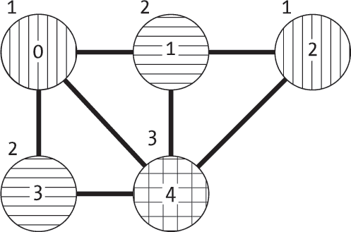
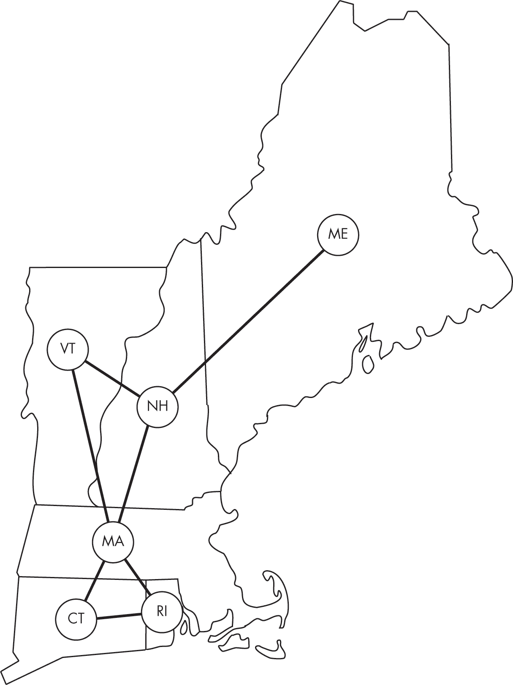
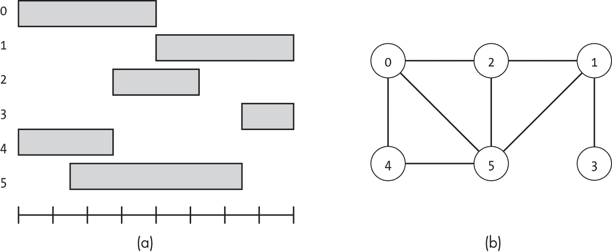
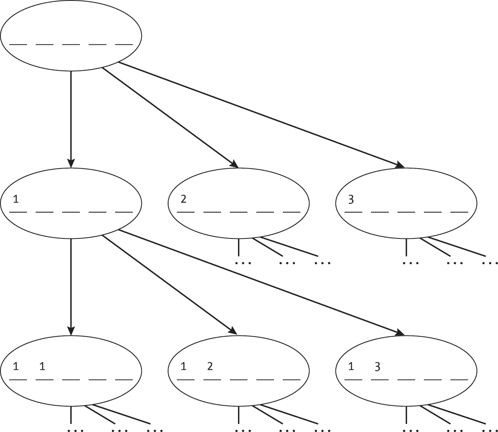
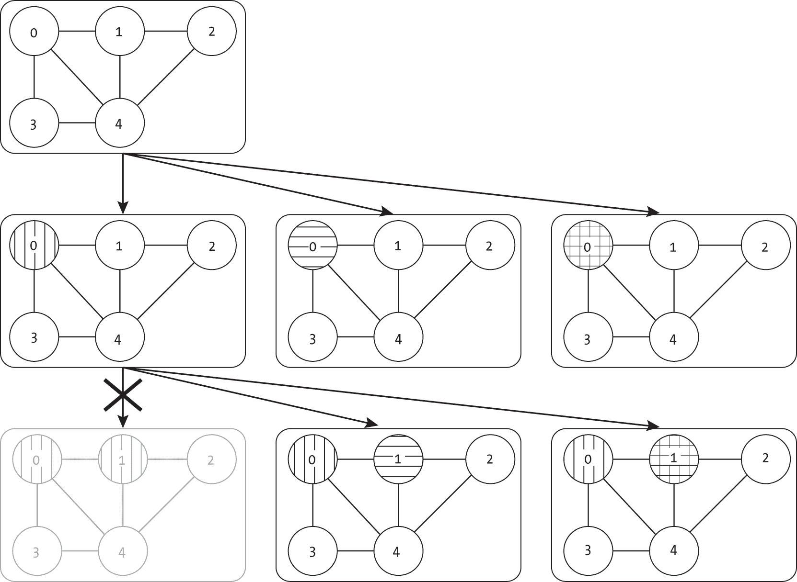
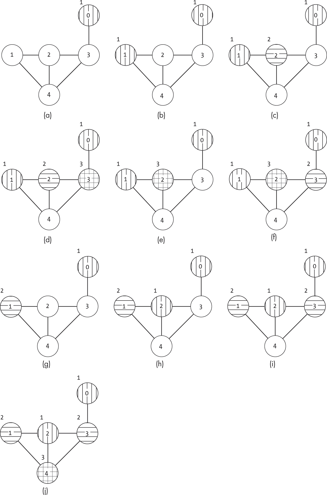
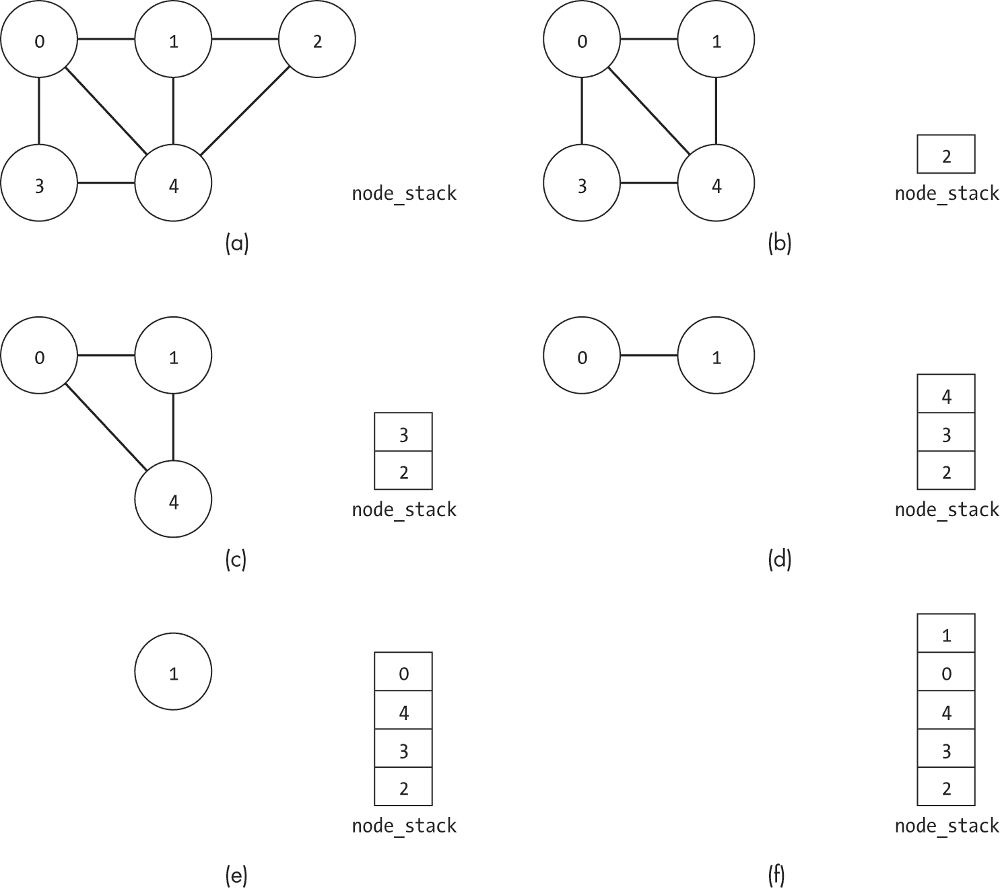
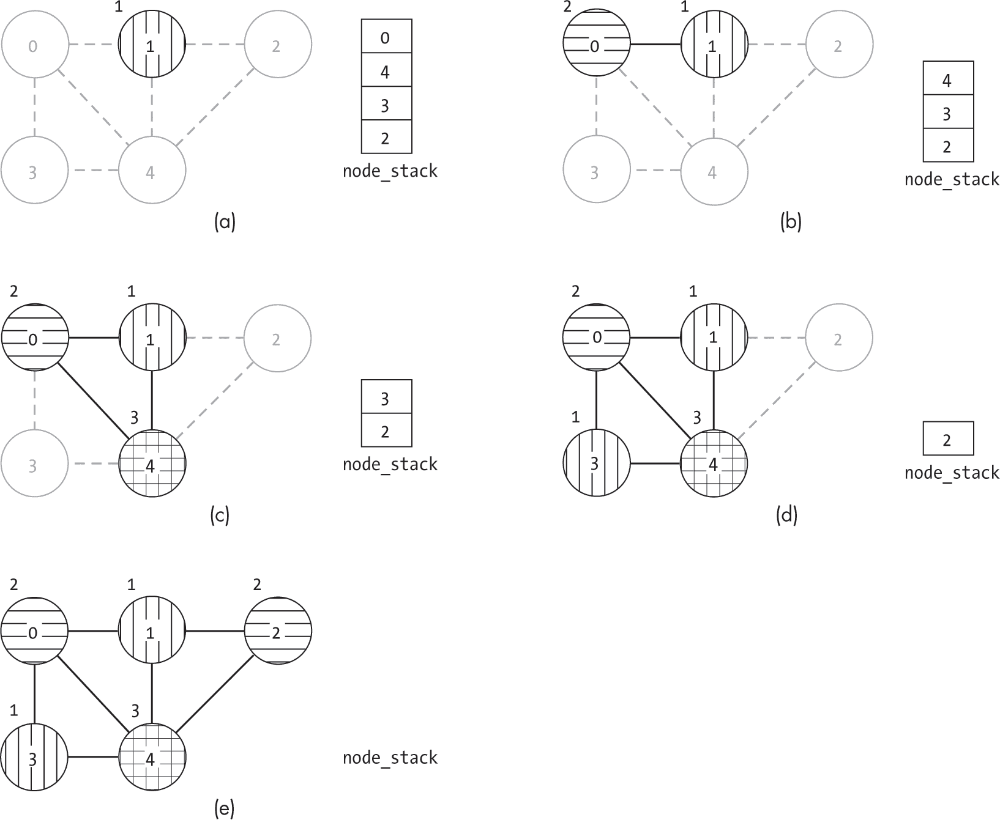
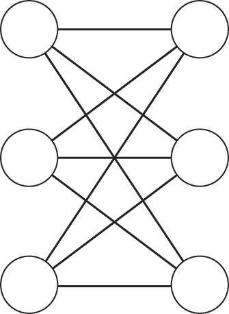

## 第十六章：16 图着色


*图着色* 是一个概念上简单但计算上复杂的问题，具有广泛的现实世界应用。它的核心是为无向图中的每个节点分配一个颜色，确保任何一对共享边的节点具有不同的颜色。该问题的变体包括最小化使用的颜色数量或仅使用固定数量的颜色进行分配。

我们可以通过欧洲地图轻松地形象化图着色问题的重要性。我们需要为每个国家分配一个颜色，使得没有两个相邻的国家有相同的颜色。如果我们把法国和比利时都涂成绿色，观众可能无法看到它们之间的边界。除了地图之外，图着色问题所施加的约束条件适用于许多现实世界的优化任务。

本章首先正式定义图着色问题，并更深入地讨论现实世界中的应用案例。然后，我们将探讨几种解决该任务的方法，并讨论为什么使用固定数量颜色的问题（或最小化使用的颜色数量）令人惊讶地困难。

### 图着色问题

*图着色问题* 包括为无向图中的每个 |*V* | 节点分配颜色，使得没有两个共享边的节点有相同的颜色。正式地，我们可以将该问题定义如下：

给定一个由节点集合 *V* 和边集合 *E* 定义的图，以及一个颜色集合 *C*，找到一个节点与颜色的分配，使得对于任何两个节点 *u* ∈*V* 和 *v* ∈*V*，如果它们通过边连接（*u*, *v*) ∈ *E*，则 *color*(*u*) ≠ *color*(*v*)。

我们可以将 *最小图着色问题* 定义为找到最小数量的颜色，使得图具有有效的图着色。

在本章中，我们使用图节点的 label 字段来存储该节点的颜色。颜色将通过整数表示，从 1 开始，None 的值表示未分配的节点（node.label == None）。

列表 16-1 定义了一个简单的 is_graph_coloring_valid() 函数，用于检查图是否具有有效的着色。这个检查器既提供了图着色问题的机械过程的良好概述，也为测试提供了一个有用的实用函数。

```
def is_graph_coloring_valid(g: Graph) -> bool: 
    for node in g.nodes:
      ❶ if node.label is None:
            return False
        for edge in node.get_edge_list():
            neighbor: Node = g.nodes[edge.to_node]
          ❷ if neighbor.label == node.label:
                return False
    return True 
```

列表 16-1：检查图的着色是否有效

代码使用一个 for 循环遍历图中的每个节点，首先检查节点是否分配了颜色 ❶。如果没有，图的着色是不完整的，因此无效。如果节点有颜色，代码使用第二个 for 循环遍历该节点的每个邻居，并检查两个节点是否共享相同的颜色 ❷。如果两个邻居共享相同的颜色，着色无效，代码返回 False。如果代码遍历了每个节点的每个邻居且没有找到匹配，则返回 True。

我们在本章插图中使用不同方向排列的哈希值表示不同的节点颜色，如图 16-1 所示。



图 16-1：一个有效颜色分配的图

对于本章中的图示，我们将标记每个节点外部的颜色编号，并从 1 开始编号颜色。

### 应用案例

我们可以使用图着色模型来描述一系列现实世界的问题，包括地图着色、会议座位安排、分配停车位，以及保护迷宫中的宝贵财宝。

#### 地图着色

图着色的经典应用案例来自于世界各地制图师和地图出版商的日常需求。为了区分地图上的不同区域，必须使用不同的颜色对各个区域进行着色。以图 16-2 所示的新英格兰地图为例，我们可以选择将康涅狄格州涂成绿色，将罗德岛涂成橙色。



图 16-2：新英格兰地图及其叠加的图表示

我们可以通过为每个区域创建一个节点，并在共享边界的任何两个区域之间添加边，将地图着色问题转化为图着色问题。在图 16-2 中，罗德岛节点与康涅狄格州和马萨诸塞州的节点之间有边连接。制图师的目标就是找到一个有效的图着色。

#### 组织座位安排

每年举办的“咖啡饮用数据结构爱好者大会”是一个充满欢乐但出乎意料地充满政治斗争的活动。社区内对咖啡和数据结构的偏好存在深刻分歧，包括轻烘焙和深烘焙阵营之间的对立，超过 30 个不同的热衷数据结构小组，以及不可避免地在任何计算机科学讨论中出现的编程语言之争。并非所有的偏好差异都会引发争执，但那些引发争执的会导致数小时的迂腐争吵。每年，组织者都面临着一个艰巨的任务——在开幕宴会上分配桌子，确保没有激烈的争论。

组织者长期以来一直利用这次聚会作为测试新图着色算法的机会。将每个与会者建模为一个节点，并将强烈的意见分歧建模为一条边，宴会座位安排的会议主席试图找到一个与会者分配到桌子的方案，确保同一桌子上的两个人没有强烈的意见分歧。节点的颜色代表桌子的分配。

在最简单的情况下，组织者可以将桌子分成最小的连贯群体。他们可能会为仅仅是喝浓缩咖啡、写 Fortran 程序的哈希表爱好者分配一张桌子。这相当于给该节点分配一个完全独特的颜色。然而，这种方法是多余且浪费的，几乎会为每个与会者分配一张桌子。上述的哈希表爱好者与浓缩咖啡和深烘焙咖啡饮用者、Fortran 或 Cobol 用户以及大多数数据结构的爱好者相处得相当融洽。会议主席的目标是最小化桌子的数量（图的颜色），同时确保不会引发激烈的争吵。

#### 分配停车位

数据结构与咖啡书店全天都有稳定的顾客流量。为了满足需求，店主决定雇佣更多的员工。经过广泛的面试，店主雇佣了六名员工。他们制定了一个时间表，安排这些新员工在一天内按固定班次工作，如图 16-3(a)所示。然而，仍然有一个问题：他们应为员工预留多少个停车位？



图 16-3：员工工作时间（a）与相应的停车冲突图（b）

利用他们的数据结构专业知识，业主们迅速将问题简化为图着色问题。如图 16-3(b)所示，每个员工都成为图中的一个节点，任何两个日程有重叠的员工之间都会有一条边，这样他们就需要在相同时间占用停车位。例如，员工 1 的日程与员工 2、3 和 5 的日程有重叠。但与员工 0 或 4 的日程没有重叠，这意味着员工 1 可以与后两位员工共享一个停车位。如果业主能够找到一个最多包含*C*种颜色的图着色方案，那么他们就可以安全地预留最多*C*个停车位。

#### 规划魔法迷宫

一位邪恶的巫师决定建造一个魔法迷宫来保护他们最珍贵的宝物，一只能演奏他们最喜欢歌曲的号角。为了保护“美妙音乐之角”免受无情冒险者的侵扰，巫师在迷宫中布满了各种陷阱和怪物。

然而，巫师很快就遇到了一个问题。由于大量的通道（边），许多房间（节点）相互连接。它们不希望因为两个相邻房间有相同的怪物而被认为是懒惰的。迷宫设计的技巧是声誉的必要条件；即使是最初级的冒险者，也会对那些一个接一个地在房间里放置相同挑战的建筑师失去尊重。然而，巫师希望通过批量订购怪物来降低成本。他们需要确定能够使用的最少数量的怪物（颜色），以确保没有两个相邻的房间包含相同的怪物。

### 图着色算法

计算机科学家和数学家们开发了多种算法来解决图着色问题。然而，每种解决方案都有其权衡。有些算法使用启发式方法来找到解，但可能需要过多的颜色；另一些则在大规模图形中计算代价较高。

图着色是一个*NP 难问题*，这意味着非正式地说，目前没有已知的算法能够在最坏情况下其运行时间随着数据规模的增加而呈多项式增长。实际上，需要考虑的状态数是指数级的：对于一个有|*V*|个节点和*C*种颜色的问题，需要考虑|*V*|*^C*种状态。然而，这并非全是坏消息。尽管该问题在最坏情况下受限于其行为，但许多算法在实践中表现良好，并且可以应用于许多日常问题。

本节中的算法用于寻找有效的图着色。如果找到了一个有效的着色，它会返回 True 来表示成功，并将颜色分配设置在节点的 label 字段中，而不是返回一个单独的数据结构。如果无法找到有效的分配集，算法将返回 False。

#### 穷举搜索

*穷举搜索* 是一种全面的方法，能够确保在存在有效图着色的情况下找到一个解：

```
def graph_color_brute_force(g: Graph, num_colors: int) -> bool: 
    options: list = [i for i in range(1, num_colors + 1)]

  ❶ for counter in itertools.product(options, repeat=g.num_nodes):
      ❷ for n in range(g.num_nodes):
            g.nodes[n].label = counter[n]
      ❸ if is_graph_coloring_valid(g):
            return True

  ❹ for n in range(g.num_nodes):
        g.nodes[n].label = None
    return False 
```

该代码使用 Python 的 itertools 包中的 product 函数来枚举所有可能的颜色分配组合❶。最初，counter 的每个值都被分配给第一个颜色（1）。在每次迭代中，计数器会发生变化。

在每次 for 循环的迭代中，代码将分配值复制到节点标签中❷，并检查这些分配是否有效❸。如果有效，立即返回 True 表示已经找到了解决方案。否则，循环继续执行下一种组合。如果代码没有找到成功的组合，则返回 False。在此之前，它会将所有节点的标签分配重置为 None，因为没有有效的着色❹。

当然，随着图的大小增大，穷举搜索的代价可能会变得非常昂贵。如果图有 |*V* | 个节点并使用 *C* 种颜色，那么我们可能需要测试 |*V* |*^C* 个分配组合，才能找到一个有效的解或确定没有任何 *C* 颜色分配能工作。图 16-4 显示了对五节点图进行穷举搜索的前六次迭代，使用了三种颜色，图来自 图 16-1。搜索从所有节点为同一颜色开始，如 图 16-4(a) 所示，接着进行不同的分配。

![一个包含五个节点的图及其边（0, 1）、（0, 3）、（0, 4）、（1, 2）、（1, 4）、（2, 4）、（3, 4）。(A) 显示了五节点图，其中所有节点都使用垂直哈希并标记为颜色 = 1，对应于 [1, 1, 1, 1, 1] 的分配。(B) 显示相同的图，其中节点 0 现在使用水平哈希，并标记为颜色 = 2，对应于 [2, 1, 1, 1, 1] 的分配。(C) 显示 [1, 2, 1, 1, 1] 的分配。(D) 显示 [2, 2, 1, 1, 1] 的分配。(E) 显示 [1, 1, 2, 1, 1] 的分配。(F) 显示 [2, 1, 2, 1, 1] 的分配。](../images/f16004.jpg)

图 16-4：穷举搜索的前六次迭代

如图 16-4 所示，穷举搜索可能会浪费大量时间检查一个接一个明显错误的状态。它提供了简单性和完整性，但代价是效率。如果我们的图没有边，那么显然所有节点都无法共享相同的颜色。想象一下，使用这种方法的人类会感到多么沮丧，因为他们被迫测试一个又一个他们知道不会成功的组合，因为图的某个地方明显存在冲突。

#### 回溯搜索

我们还可以使用*递归回溯搜索*来实现前一节中的基于迭代器的穷举搜索。与前几章中使用的深度优先搜索，尤其是第四章中的深度优先搜索不同，这种回溯搜索并不会通过相邻节点探索单独的节点。相反，搜索状态就是颜色分配的集合。我们递归地探索所有可能的颜色分配，遇到不可行的解时进行回溯。我们搜索中的每个状态都对应于节点的部分颜色分配，如图 16-5 所示。



图 16-5：回溯搜索在不同分配上分支

我们可以首先将相同的搜索空间建模为基于迭代器的穷举搜索，使用深度优先搜索而不进行任何剪枝（稍后我们会改进这种方法）。这种搜索通过给下一个未分配的节点分配颜色来进入相邻状态，如清单 16-2 所示。

```
def graph_color_dfs(g: Graph, num_colors: int, index: int=0) -> bool: 
    if index == g.num_nodes:
        return is_graph_coloring_valid(g)

    for color in range(1, num_colors + 1):
        g.nodes[index].label = color
      ❶ if graph_color_dfs(g, num_colors, index + 1):
            return True

  ❷ g.nodes[index].label = None
    return False 
```

清单 16-2：颜色分配的递归穷举搜索

graph_color_dfs() 代码使用递归搜索为每个节点分配颜色。它从基本情况开始，检查是否所有节点都已分配颜色，如果是，检查分配是否有效。如果还有节点需要分配，代码将迭代当前节点的所有可能颜色。对于每种颜色，代码将继续在下一个节点（按索引顺序）上进行递归搜索。如果分配导致有效解，它返回 True ❶。如果搜索未找到有效的分配，它将当前节点的颜色重置为 None ❷ 并通过返回 False 来回溯。

清单 16-2 中的回溯搜索实现仅仅是基于迭代器的穷举搜索的另一种实现方式。它并没有提高效率。 图 16-6 显示了搜索如何迭代通过与穷举搜索在 图 16-4 中相同的第一个死胡同。经过所有步骤后，到达了 图 16-6(e) 中的死胡同，算法回溯并尝试为节点 4 分配新的值，如 图 16-6(f) 所示。

![一个包含五个节点和边（0, 1）、（0, 3）、（0, 4）、（1, 2）、（1, 4）、（2, 4）和（3, 4）的图。 (A) 显示了只有节点 0 被标记为 color = 1 的五节点图。 (B) 显示了相同的图，其中节点 0 被标记为 color = 1，节点 1 被标记为 color = 1。 (C) 显示了分配 [1, 1, 1, None, None]。 (D) 显示了分配 [1, 1, 1, 1, None]。 (E) 显示了分配 [1, 1, 1, 1, 1]。 (F) 显示了分配 [1, 1, 1, 1, 2]。](../images/f16006.jpg)

图 16-6：图着色的回溯搜索的前六个步骤

然而，我们可以通过 *剪枝* 来大大提高效率，仅探索有效路径。在给节点分配颜色之前，我们可以检查该分配是否会导致冲突。如果是，我们不仅跳过该分配，还跳过由此产生的所有后续递归，如 图 16-7 所示，我们跳过了从给节点 0 和节点 1 都分配颜色 = 1 开始的整个子树。而是，一旦我们给节点 0 分配了颜色 = 1，我们只考虑颜色 2 和 3 来分配给相邻的节点 1。



图 16-7：带有剪枝的回溯搜索在图着色中的前几个步骤

*回溯搜索与剪枝*的代码需要做一个小的修改。在给节点分配颜色之前，我们需要检查是否有任何邻居已经有了该分配。这个简单的检查可以防止我们深入到死胡同：

```
def graph_color_dfs_pruning(g: Graph, num_colors: int, index: int=0) -> bool: 
    if index == g.num_nodes:
        return True

    for color in range(1, num_colors + 1):
      ❶ is_usable: bool = True
        for edge in g.nodes[index].get_edge_list():
            if g.nodes[edge.to_node].label == color:
                is_usable = False

        if is_usable:
          ❷ g.nodes[index].label = color
          ❸ if graph_color_dfs_pruning(g, num_colors, index + 1):
                return True
            g.nodes[index].label = None

    return False 
```

代码再次从基本情况开始，检查是否所有节点都已分配，如果是，返回 True。代码不需要检查当前分配的有效性，因为它会在分配每个颜色之前进行检查。

如果还有更多节点需要探索（分配），则代码会遍历当前节点的所有可能颜色。它首先检查是否有任何邻接节点使用此颜色，如果有，则将该颜色标记为不可用于当前节点❶。如果颜色可用，代码会继续进行递归探索，将该颜色分配给节点❷，并递归地继续到下一个节点❸。与清单 16-2 中的方法一样，如果代码找到有效的分配，它会返回 True，如果必须回溯，则返回 False。

图 16-8 展示了一个带有剪枝的回溯搜索示例，图中有五个节点，*C* = 3。

在其最初的几步中，搜索过程通过为图 16-8(a)中的节点 0、图 16-8(b)中的节点 1、图 16-8(c)中的节点 2，以及图 16-8(d)中的节点 3 分配有效颜色来进行。当它到达节点 4 时，它意识到自己已经到了死胡同：这三个潜在的颜色都无法分配给该节点。搜索回溯到它为节点 3 分配颜色的地方，但这并没有帮助，因为在那个时刻，节点 3 只有一个有效的分配。搜索再次回溯，并尝试为图 16-8(e)中的节点 2 进行不同的分配。当搜索遇到图 16-8(f)中的下一个死胡同时，它会回溯到为节点 1 分配颜色的地方，并尝试在那里使用一种新颜色，如图 16-8(g)所示。通过新的节点 1 分配，搜索可以顺利为剩余的节点找到分配。



图 16-8：带剪枝的回溯搜索图着色算法的十个步骤

带剪枝的回溯搜索就像一个有着好橡皮擦的有条理的会议策划人。他们从一个一个地做初步的桌位分配开始。对于每个分配，他们都会检查桌上是否存在已知的冲突。如果有，他们跳过该分配，避免浪费时间——如果他们已经知道会导致围绕 B 树与红黑树优缺点的激烈争论，那么继续寻找剩下的解决方案就没有意义了。然而，这种有效性检查也仅能帮助到一定程度。策划人仍然会遇到死胡同，当前的与会者没有有效的座位。如果每张桌子上已经坐满了至少一位 Python 爱好者，那热衷的 LISP 程序员就无路可走了。会议策划人拿出他们 trusty 的橡皮擦，深深地叹了口气，开始回溯到一个更早的时刻，在那个地方他们本可以做出不同的分配。

#### 贪心搜索

除了这些准确但计算开销大的解决方案外，我们还可以考虑启发式方法。*贪心法*图着色一次考虑一个节点，选择第一个不会与已分配邻居违反任何约束的颜色。与本节描述的穷举算法不同，我们定义的这个贪心搜索并不考虑最大颜色数。虽然它总能找到某个解决方案，但由于其贪心性质，它不一定总是使用最小的颜色数。

贪心搜索方法的代码从一个辅助函数开始，该函数通过确定邻居使用的颜色来找到节点的第一个有效颜色，然后选择该集合中没有的第一个颜色，如第 16-3 节所示。

```
def first_unused_color(g: Graph, node_index: int) -> int: 
    used_colors: set = set()
    for edge in g.nodes[node_index].get_edge_list():
        neighbor: Node = g.nodes[edge.to_node]
      ❶ if neighbor.label is not None:
            used_colors.add(neighbor.label)

  ❷ color: int = 1
    while color in used_colors:
        color = color + 1
    return color 
```

第 16-3 节：为节点找到有效的颜色分配

first_unused_color() 函数将相邻节点中已使用的颜色收集到 set 数据结构 used_colors 中，这使得它能够轻松插入新颜色并检查某个颜色是否已被使用。然后，代码会遍历所有该节点的邻居。对于每个邻居，它将该邻居的颜色添加到 used_colors 集合中。它会跳过未分配颜色的节点（neighbor.label == None），因为这些节点不会造成冲突 ❶。代码最后通过 while 循环来查找第一个不在 used_colors 集合中的颜色 ❷。虽然这种方式效率不是特别高，但该循环总能找到*某种*可以使用的颜色。

给定辅助函数后，这种贪心搜索可以在一个循环中实现：

```
def graph_color_greedy(g: Graph) -> bool: 
    for idx in range(g.num_nodes):
        g.nodes[idx].label = first_unused_color(g, idx)
    return True 
```

graph_color_greedy() 函数使用索引变量 idx 遍历所有节点。对于每个节点，它调用第 16-3 节中的辅助函数，找到第一个不与已分配邻居冲突的颜色。为了与本章中的其他算法保持一致，函数返回 True，表示已找到有效的着色。

我们可以通过数据结构大会上宴会座位安排的会议主席的视角来形象化贪心算法。组织者逐一遍历与会者名单，在将每位与会者安排到一张桌子后，再继续安排下一位。对于每位与会者，组织者查看可用的桌子列表，并检查是否与已安排在某桌的与会者发生冲突。这相当于检查当前与会者（节点）是否与该桌的其他占用者（已安排的节点）发生冲突（共享边）。如果发生冲突，组织者将转到下一张桌子。如果桌子安排完毕，组织者会叹气，嘟囔着一些不友好的话，关于编程语言争斗的荒谬，并在场地上添加一张新桌子。

图 16-9 说明了这个贪心搜索过程。在图 16-9(a)的第一次迭代中，代码为节点 0 分配颜色。在图 16-9(b)中，接着考虑节点 1。由于该节点与节点 0 共享一条边，因此搜索不能重用颜色=1，而是为节点 1 分配颜色=2。当在图 16-9(c)中考虑节点 2 时，唯一已分配的邻居颜色为 2，因此搜索可以为节点 2 分配颜色=1。这个过程持续进行，直到为所有节点分配颜色，如图 16-9(e)所示。

![一个包含五个节点和边（0, 1），（0, 3），（0, 4），（1, 2），（1, 4），（2, 4）和（3, 4）的图。（A）展示了只有节点 0 被标记为颜色=1 的五节点图。（B）展示了同样的图，节点 0 标记为颜色=1，节点 1 标记为颜色=2。（C）展示了分配为[1, 2, 1, None, None]的分配。（D）展示了分配为[1, 2, 1, 2, None]的分配。（E）展示了分配为[1, 2, 1, 2, 3]的分配。](../images/f16009.jpg)

图 16-9：贪心着色算法的五个步骤

在拥有足够颜色的情况下，贪心算法将为图找到有效的着色。然而，这种分配并不保证使用最少的颜色。相反，节点分配的顺序对贪心算法需要多少颜色有显著影响。请参见图 16-10，它展示了同一图的两种有效着色方法。

![两个子图都展示了包含五个节点和边（0, 3），（1, 2），（1, 4），（2, 3），（2, 4）和（3, 4）的图。（A）展示了分配为[1, 1, 2, 3, 4]的图。（B）展示了分配为[1, 3, 2, 3, 1]的图。](../images/f16010.jpg)

图 16-10：一个图，其中贪心着色方法使用四种颜色（a）找到了解决方案，而实际上只需三种颜色（b）即可得到解决方案

图 16-10(a)展示了贪心算法生成的图着色。由于搜索为节点 0 和 1 分配了相同的颜色，它必须在节点 4 上使用第四种颜色。相比之下，采用深度优先搜索并进行剪枝的算法会找到一个仅需三种颜色的最优着色，如 图 16-10(b) 所示。两者的权衡是速度与最优性的选择。虽然贪心搜索有时会使用超过最少颜色数的颜色，但它没有回溯过程，因此执行速度更快。

#### 节点移除

另一个值得讨论的启发式算法是 IBM 团队提出的*移除算法*，用于在编译器中为 CPU 寄存器分配变量，以避免冲突。该算法通过迭代地简化问题来工作（如果可能的话）。就像为停车位分配空间的例子一样，论文的作者将寄存器分配定义为一个图着色问题，节点代表变量，边表示哪些变量在同一时刻被使用，而颜色则代表每个 CPU 的寄存器。颜色的数量由芯片架构固定为*C*。该算法的目标是确定是否能找到一种着色方式，使得使用的颜色数不超过*C*。

正如乔治·蔡廷（George Chaitin）等人在其论文《通过着色进行寄存器分配》中所讨论的那样，IBM 团队提出了一种多步骤的寄存器分配方法，其中包括一个用于生成颜色分配的节点移除算法。该算法基于一个洞察力：如果一个节点的边数少于*C*，在为其邻居分配颜色后，我们可以轻松地为它分配一个颜色。我们只需要查看其邻居的颜色，并使用任何在这些邻居中没有出现过的颜色，重新利用我们的 first_unused_color() 函数，参考 Listing 16-3。因此，我们可以最初忽略那些边数少于*C*的节点，专注于处理那些更复杂的情况：拥有*C*个或更多邻居的节点。实际上，我们可以更进一步，暂时从图中移除所有边数少于*C*的节点及其边，处理完其他节点后再重新加入这些节点，并为它们分配颜色。

基于这一洞察力，该算法会迭代检查当前图中的节点，并移除所有边数少于*C*的节点以及它们的边。它会将这些节点加入栈中，待处理完更复杂的情况后再重新访问。随着节点和边的移除，新的节点会低于*C*邻居的阈值，也可以被移除。它知道，在为邻居分配颜色后，当回到这些节点时，可以轻松地使用 first_unused_color() 为这些节点分配颜色。

如果算法能够从图中移除每个节点，那么我们就知道它具有有效的*C*色彩。如果搜索跟踪它在栈中移除的内容，它可以从栈中弹出项目，逆转操作并重新组装图，通过这种方式有效地重新将节点添加到图中，并在此过程中分配颜色。

移除算法的代码使用了这种两阶段的方法：

```
def graph_color_removal(g: Graph, num_colors: int) -> bool: 
    removed: list = [False] * g.num_nodes
    node_stack: list = []
  ❶ g2 = g.make_copy() removed_one: bool = True
    while removed_one:
        removed_one = False
        for node in g2.nodes:
          ❷ if not removed[node.index] and node.num_edges() < num_colors:
                node_stack.append(node.index)

              ❸ all_edges: list = node.get_sorted_edge_list()
                for edge in all_edges:
                    g2.remove_edge(edge.from_node, edge.to_node)

                removed[node.index] = True
                removed_one = True

  ❹ if len(node_stack) < g.num_nodes:
        return False

  ❺ while len(node_stack) > 0:
        current: int = node_stack.pop()
        g.nodes[current].label = first_unused_color(g, current)

    return True 
```

代码首先创建了多个辅助数据结构。removed 数组为每个节点存储一个布尔值，允许代码快速检查节点是否仍然在图中。node_stack 列表存储了被移除的节点的信息以及它们被移除的顺序。代码还创建了图的副本（g2），允许它移除边而不修改原始图❶。

然后，代码进入一个 while 循环，只要函数在前一次迭代中移除了至少一个节点（通过布尔值 removed_one 跟踪）。在 while 循环中，代码遍历图中的每个节点，检查该节点是否已经被移除以及它有多少个邻居❷。如果节点没有被移除且邻居数量少于 *C*（num_colors）个，代码会将节点添加到 node_stack 中，移除它的所有边❸，并将节点标记为已移除。从技术上讲，代码仅移除图中的边；节点的移除通过 removed 数组捕获。这使我们能够在 for 循环中稳定地遍历图中的节点，并且不会影响算法的准确性。

如果代码未能将图中的所有节点移除并将其添加到堆栈中，则说明它在寻找有效颜色分配时失败了 ❹。在这种情况下，代码返回 False。如果存在有效的分配，代码会一次为每个节点分配颜色 ❺。每次从堆栈中弹出一个节点时，它使用 first_unused_color() 来选择一个有效的颜色，来自清单 16-3。由于当节点被加入堆栈时，其邻居少于 num_colors，因此它现在必须有少于 num_colors 个已分配颜色的邻居。因此，first_unused_color() 将在[1, num_colors]范围内选择一个有效的颜色。

我们可以通过使用关键短语 “我稍后再处理这个与会者” 来在会议计划者的背景下想象移除算法。每当会议计划者看到一个冲突少于 *C* 的与会者时，他们会不屑地说：“这个人不会成为问题的。我可以为他们找一个桌子。我会在处理完困难的与会者之后再处理他们。” 外部人可能会认为这是拖延，但图着色爱好者会把它看作是一个关键的算法性洞察。

图 16-11 显示了此代码操作的第一阶段，其中 *C* = 3。在这个阶段，节点是一次一个地被移除。在 while 循环的第一次迭代中，移除了三个节点。节点 2 的邻居少于 *C*，因此它被加入到堆栈中，如图 16-11(b)所示。接下来，在图 16-11(c)中移除了节点 3。此时，节点 4 的邻居少于 *C*，也可以被移除，如图 16-11(d)所示。



图 16-11：移除图着色算法的第一阶段

该算法现在已经遍历了图中的每个节点一次。由于它在这次迭代中移除了至少一个节点，因此它从节点 0 重新开始，并再次检查。在图 16-11(e)中，它移除了节点 0，该节点只有一个剩余的邻居。最后，在图 16-11(f)中，它移除了节点 1。

算法的第二阶段，如图 16-12 所示，是标记并“重新添加”节点。算法首先从栈中弹出节点 1，并将其标记为颜色 1，如图 16-12(a)所示。在图 16-12(b)中，算法从栈中弹出节点 0，并将节点 0 分配为不与邻居冲突的第一个颜色。这个过程继续在图 16-12(c)、16-12(d)和 16-12(e)中依次进行，分别为节点 4、3 和 2 着色。



图 16-12：移除图着色算法的第二阶段

不幸的是，这种启发式方法并不足以解决所有图。即使在有一个至少有 *C* 条边的互联节点集群的情况下，图着色有时也可以使用少于 *C* 种颜色。例如，在图 16-13 中，尽管仅用两种颜色就可以完成有效的着色，但当 *C* = 3 时，移除算法会失败。因为每个节点都有三个邻居，移除算法无法删除任何节点。它陷入了死胡同。



图 16-13：一个移除算法失败的示例图

然而，很明显，我们可以为图 16-13 创建一个有效的着色方案，只需使用两种颜色即可。我们可以将所有左侧节点分配为颜色 1，所有右侧节点分配为颜色 2。由于边仅连接左侧节点和右侧节点，便不会发生冲突。实际上，我们可以使用第十五章中的二分图标记算法来解决这个特殊的案例。

### 为什么这很重要

图节点着色问题在现实世界中有多种应用场景，从规划魔法迷宫到分配停车位。这个问题之所以有趣，是因为没有已知的算法能够高效地解决所有情况。相反，我们必须依赖于穷举搜索或启发式方法。这促使我们开发了各种方法，以在不同的现实世界条件下提供良好的性能。

在下一章，我们将探讨类似的任务分配问题，这些问题目前没有已知的高效解法。我们将研究基于本章回溯深度优先搜索的多种不同分支搜索方法，并考虑各种启发式方法和使用随机算法来寻找解决方案。
