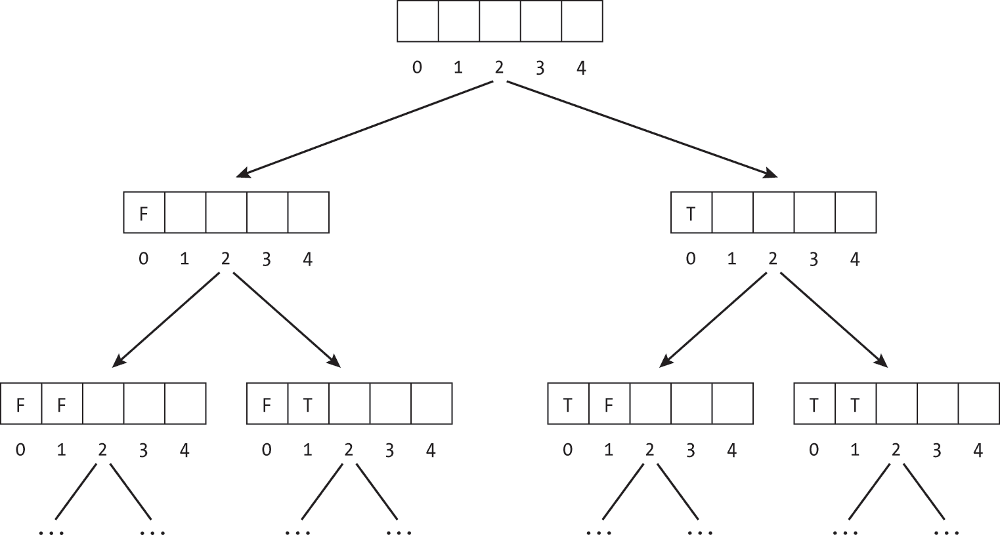
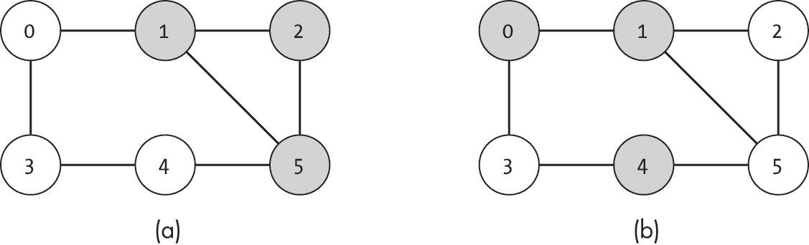
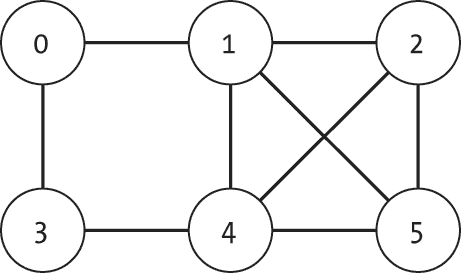
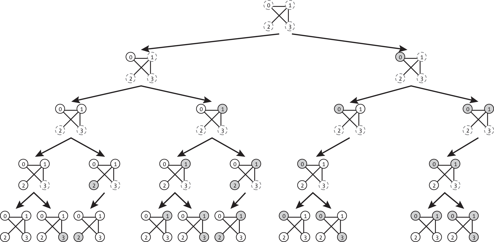
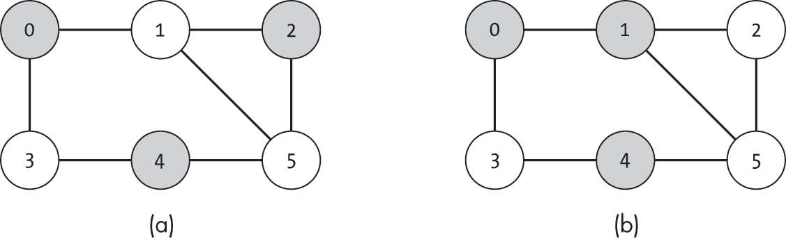
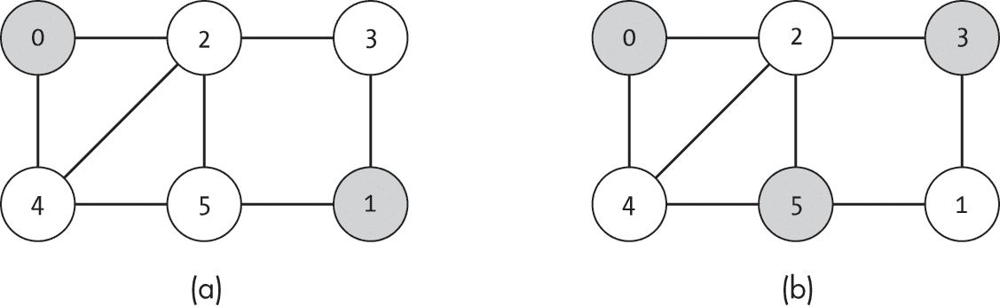
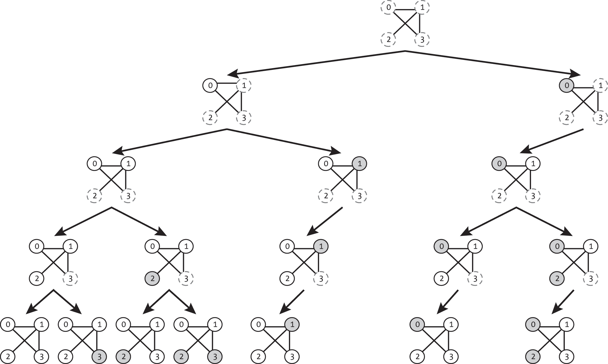
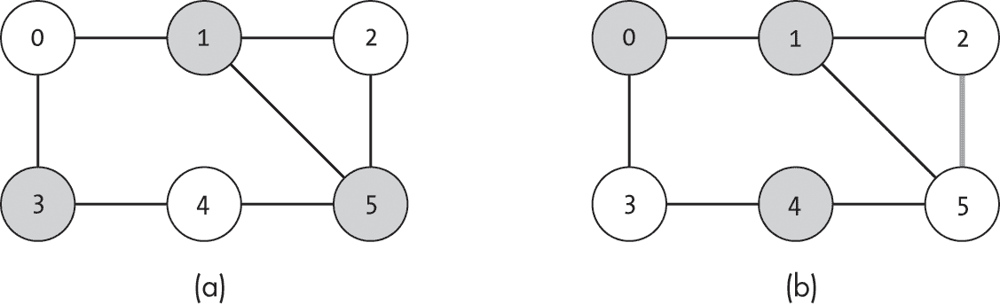
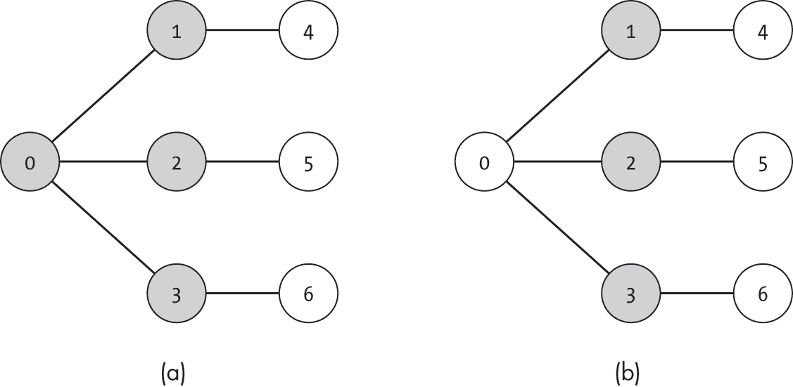
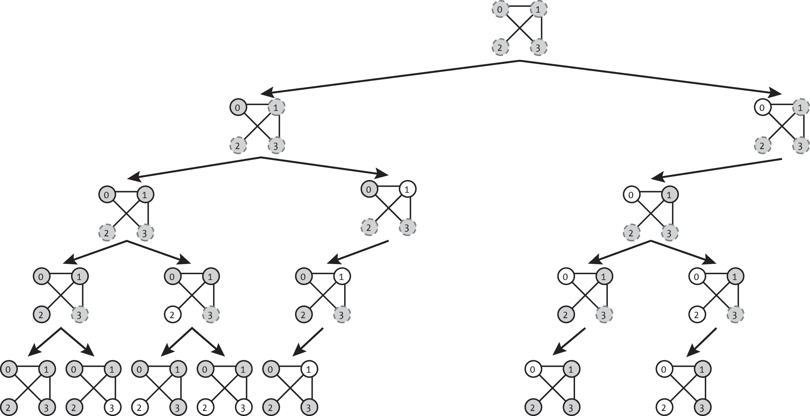

## 17 团、独立集和顶点覆盖


在上一章中，我们看到看似简单的颜色分配问题会迅速膨胀成代价高昂的搜索。在这里，我们考虑类似的挑战性问题，即组装满足各种条件的节点集：最大团、最大独立集和最小顶点覆盖。

对于这些问题中的每一个，我们都希望找到满足某些基于邻接节点或边缘的条件的最大或最小节点集。虽然检查单一的提议解决方案是否满足各种约束条件很容易，但找到最佳解决方案可能需要大量计算。与图着色问题类似，这些问题被归类为 NP-困难问题。同样，我们可以使用启发式方法或穷举法来解决这些问题。

本章开始时回到了上一章介绍的带剪枝的穷举回溯搜索，并将其适应于对本章所涉及的三个问题进行穷举搜索。此外，我们还考虑了多种贪心或启发式方法。我们还将讨论每个问题的实际应用，从选择办公室位置的团到避免怨恨的独立集，再到利用顶点覆盖建立警卫塔。

### 回溯搜索节点集

对于本章中的每个问题，我们都希望找到满足给定约束的节点集。我们使用在第十六章中介绍的带剪枝的回溯搜索的修改版本，通过探索是否将每个节点包含在集合中的不同分配来寻找潜在的解决方案。与图着色问题中的应用一样，这些回溯搜索会列举所有有效的解决方案。虽然它们会检查每一个可能的有效分配，但它们的效率很少高。

这种搜索的基本概念是通过一次考虑一个节点并在每个决策点将搜索分成两个路径，来探索每一个可能的节点集。在第一条路径中，搜索探索不包含当前节点的可能集合。在第二条路径中，搜索探索包含当前节点的可能集合。

图 17-1 展示了这种方法，每个节点在集合中的包含情况标记为 True（包含）或 False（不包含）。列表中的空条目表示我们尚未决定是否包含该节点。在每个层次，搜索会考虑下一个未分配的节点，并在每个决策点分支出两个可能的分支。



图 17-1：回溯搜索，穷举尝试所有集合赋值

因为在图 17-1 中我们将每个分支分成两个子分支，所以每一层的可能选项数量都会翻倍。对于一个有*N*个决策的树，我们探索 2*^N*个完整的赋值。在图节点的子集的情况下，我们将每个节点视为一个单独的决策，因此*N* = |*V*|，我们有 2^|*V*|种选项可以探索。虽然剪枝无效路径有助于去除一些明显不可行的结果，但它无法避免此搜索可能带来的复杂性全面爆炸。

我们可以将这种搜索视为解决魔法地下城谜题的方法。当我们进入寒冷的石质房间时，发现墙上有五个巨大的开关。根据我们之前对魔法地下城的研究，我们知道只有一种正确的开关配置能打开通向藏有宝藏的门。不幸的是，地下城的设计师并不仅仅是在试图创造一个有趣的谜题；他们想要保护他们的宝藏，因此完全没有提供任何线索。虽然检查任何单一猜测并不需要很长时间，但我们可能需要尝试每一种组合才能找到正确的配置。

为了得到宝藏，我们从最左侧的开关（关闭）开始猜测，然后是第二个左侧的开关（关闭），依此类推，直到所有开关都处于关闭位置。当宝库门不可避免地没有打开时，我们回溯到上一个决策点（我们将最右侧的开关设置为关闭）并尝试开启选项。当这样做无效时，我们继续回溯（回到第二个最右侧的开关），将其改为开启，再次尝试探索最后一个开关的每种可能设置。我们应该感到幸运，因为地下城设计师的预算只有五个开关，这意味着我们只需要测试 2⁵ = 32 种设置。但每次回溯时，我们发现很难保持如此积极的心态。

本章中的所有算法，我们都描述了相同的两种算法方法来寻找解决方案。我们首先描述了一种近似的贪心搜索，以建立问题的基础和影响解决方案的因素。接着我们展示了如何将回溯搜索应用于该问题，并添加剪枝技术。

### 团

*团*是无向图中完全连接的节点子集。形式上，我们说一个团是一个节点集*V*′ ⊆ *V*，满足以下条件：

(*u*, *v*) ∈ *E* 对于所有 *u* ∈ *V*′ 和 *v* ∈ *V*′

在社交网络中，一个团是指一群彼此都是朋友的人。

图 17-2 展示了一个图形，其中有两个阴影子集节点。在图 17-2(a)中，阴影节点{1, 2, 5}形成了一个团体，因为图中包含了子集中每一对节点之间的边。相比之下，在图 17-2(b)中，阴影节点{0, 1, 4}并未形成一个团体，因为节点 0 和 4 之间没有边，节点 1 和 4 之间也没有边。



图 17-2：一个包含节点子集形成团体（a）和非团体节点子集（b）的图

我们可以通过检查每一对节点并确认它们之间是否存在边来判断一组节点是否形成了一个团体，正如在清单 17-1 中所示。

```
def is_clique(g: Graph, nodes: list) -> bool: 
    num_nodes: int = len(nodes)
    for i in range(num_nodes):
        for j in range(i + 1, num_nodes):
            if not g.is_edge(nodes[i], nodes[j]):
                return False
    return True 
```

清单 17-1：检查一组节点是否形成有效的团体

代码使用一对for循环来遍历列表中的每一对节点，并检查是否存在相应的边。如果边缺失，代码会立即返回False。如果代码成功检查完列表中的所有节点对而没有发现缺失的边，则返回True。

我们可以将此检查可视化为社交网络中的一个好奇外人。在听到某高中“伟大朋友圈”的传言后，怀疑的外人宣称，“他们不可能真的都互相喜欢”，并着手揭示这个团体的隐藏分裂。外人以初学侦探的方式，逼问每个人关于他们与其他团体成员的关系：“你真的和 Jonny 是朋友吗？那 Suzy 呢？”直到他们确认每一对关系都是真实的，才放弃了他们的怀疑。

虽然判断一组给定的节点是否形成一个团体比较简单，但构建图中最大的可能团体则要困难得多。寻找*最大团体*的问题是指在图中找到最大的节点子集*V*′ ⊆ *V*，使其形成一个有效的团体。这个问题比在图中寻找任意团体要困难得多，因为一个节点是否有效的成员取决于团体中其他节点的关系。如果逐个添加节点，早期的选择可能会导致我们走向次优的方向并排除后续的节点。

#### 使用案例

我们可以通过考虑需要由交通路线（边）直接连接的地点（节点）来形象化团体的重要性。王国的冒险者、探险家和制图师公会正在寻找在有魔法地牢的地方建立区域总部。在经过数小时关于各种标准的重要性讨论之后，包括地牢难度和新鲜农产品的可获取性，他们最终得出结论，首要优先事项是各办公室之间便捷的交通。毕竟，公会的各个办公室共享一份为会员开放的任务列表。如果老墨尔本市的一个冒险者得知“决策悬崖”处有一个有前景的任务，他们会希望直接前往那里。公会领导们召集资深制图师寻找最大的城市集，其中每个城市都通过一条公路直接相连。制图师们熟悉最大团体问题，开始枚举所有可能的组合。

在一个不那么幻想的世界里，我们可能希望使用最大团体检测来选择具有直接交通连接的商业地点或具有直接链接的计算节点。这些问题都涉及到在图中找到完全连接的子集。

#### 贪心搜索

我们可以通过从任意一个节点开始，将其作为我们的团体，并不断添加兼容的节点，来定义一个构建团体的贪心算法。我们总是选择添加那些能保持我们的团体*有效*的新节点，所谓有效节点，是指与团体中的每个节点都有边相连的节点。

清单 17-2 展示了如何通过检查每个节点，列出是否可以将其添加到集合中并保持团体有效的选项。

```
def clique_expansion_options(g: Graph, clique: list) -> list: 
    options: list = []
    for i in range(g.num_nodes):
      ❶ if i not in clique:
            valid: bool = True
            for j in clique:
              ❷ valid = valid and g.is_edge(i, j)
            if valid:
                options.append(i)
    return options 
```

清单 17-2：检查可以添加到团体中的节点

代码遍历图中的每个节点，测试该节点是否可以被添加到团体中，首先检查该节点是否已经是团体的一部分 ❶。如果不是，代码通过检查该节点是否与团体中的每个节点都有边相连来验证其有效性 ❷。如果每个团体节点的这些测试都通过，代码就会将当前节点添加到扩展选项列表中。

这个函数可以帮助“大朋友小组”识别潜在的成员。学校里的每个学生都是潜在候选人。对于每个还不在小组中的学生，小组的代表会询问每个成员：“你们是朋友吗？”如果潜在成员已经和所有现有成员是朋友（即新节点与小组中的每个节点都有边相连），那么现有成员会迅速欢迎他们的共同朋友加入。

在清单 17-3 中，我们构建了一个贪心算法，逐步构建一个团体，每次添加一个节点。

```
def clique_greedy(g: Graph) -> list: 
    clique: list = []
    to_add: list = clique_expansion_options(g, clique)
    while len(to_add) > 0:
      ❶ clique.append(to_add[0])
        to_add = clique_expansion_options(g, clique)
    return clique 
```

列表 17-3：寻找团的贪婪算法

代码从一个空列表开始，表示正在构建的团。它使用一个while循环，持续调用列表 17-2 中的函数<sup class="SANS_TheSansMonoCd_W5Regular_11">clique_expansion_options()</sup>来找到潜在选项列表，并将返回列表中的第一个选项添加到团中❶。当没有更多节点可以添加到当前团时（len(to_add) == 0），它停止并返回该列表。

当逐个添加节点时，我们立刻会遇到一个问题：“我们接下来应该添加哪个节点？”在列表 17-3 中的代码中，我们只添加了第一个选项，但这可能是一个*糟糕*的选择。考虑一下，如果我们将这个贪婪算法应用于图 17-3 中的图，结果会怎样。按原样，贪婪算法会首先选择节点 0，最终返回{0, 1}，而不是更大的团{1, 2, 4, 5}。



图 17-3：一个贪婪搜索最大团失败的图

贪婪搜索无法保证找到最大团，因为贪婪搜索的每次迭代中的决策并不独立。每次算法将节点 *u* 添加到团中时，这会阻止它添加与 *u* 没有边的任何未来节点。我们很容易因为一开始就选择了错误的节点而陷入局部最大值。我们可以改进选择启发式方法，例如选择边最多的节点，但这也只能起到有限的作用。要构建一个最大团，我们需要进行更全面（且代价更高）的搜索。

#### 回溯搜索

*回溯搜索* 最大团递归地尝试将图中的一个节点设置为团的成员或非成员，如列表 17-4 所示。在每一层递归中，搜索函数使用当前已构建的团（clique）和下一个要测试的节点（index），并递归地测试所有未分配节点的组合，返回该分支搜索中找到的最大团。这个分支过程有效地测试了所有 2^|*^V* ^|个可能的节点子集，同时利用剪枝方法切除无效的选项。

```
def maximum_clique_recursive(g: Graph, clique: list, index: int) -> list: 
  ❶ if index >= g.num_nodes:
        return copy.copy(clique)

  ❷ best: list = maximum_clique_recursive(g, clique, index + 1)

  ❸ can_add: bool = True
    for n in clique:
        can_add = can_add and g.is_edge(n, index)

    if can_add:
        clique.append(index)
        candidate: list = maximum_clique_recursive(g, clique, index + 1)
      ❹ clique.pop()

      ❺ if len(candidate) > len(best):
            best = candidate

    return best 
```

列表 17-4：递归探索可能的团

回溯搜索的代码首先检查是否达到了终止条件（已迭代过图中的最后一个节点） ❶。如果是，那么就没有剩余需要检查的内容，clique 就是沿该分支搜索得到的最大子集。代码会返回当前团体的副本，以有效地快照当前状态，并将其与在搜索其余部分中会继续修改的 clique 对象分开。

如果搜索尚未达到递归的终点，代码会尝试分别使用和不使用 index 来构建团体。它通过调用 maximum_clique_recursive()，以当前的 clique 和下一个节点的索引 ❷ 来测试不带 index 的子集，然后保存沿该分支获得的最佳结果以供比较。

在测试包含当前节点的子集之前，代码通过检查该节点是否与当前的 clique ❸ 兼容，避免探索无效的子树。与清单 17-2 中的 clique_expansion_options() 函数类似，maximum_clique_recursive() 函数会检查拟加入的节点 index 是否与当前团体中的所有节点都有边相连。如果缺少任何一条边，添加 index 将导致无效的团体。代码会跳过对这种无效集的递归探索。

如果当前节点与当前团体兼容，代码会尝试将其添加到团体中，并递归测试剩余的选项。然后，它通过移除 index 来清理 clique 数据，以便该 clique 列表可以在其他分支中继续使用 ❹。代码会比较两个分支的结果，并保留较大的有效节点子集 ❺。

我们在清单 17-4 中调用该函数，初始值为 clique=[] 和 index=0，或者使用包装函数：

```
def maximum_clique_backtracking(g: Graph) -> list: 
    return maximum_clique_recursive(g, [], 0) 
```

图 17-4 显示了搜索的可视化。每一层都显示了算法在是否包含某个节点上的分支。第一层考虑是否包含节点 0。第二层考虑是否包含节点 1。被分配到团体的节点用阴影表示，排除的节点为白色，未分配的节点为虚线圆圈。



图 17-4：最大团体的回溯搜索步骤

图 17-4 中的子图展示了每次函数调用开始时 团体 列表的状态。正如你所看到的，函数只跟踪包含有效团体的分支。例如，在评估 clique=[0] 和 index=2 时，搜索无法跟随右侧分支，因为 {0, 2} 不是一个有效的团体。因此，搜索只测试了 16 种可能的完整组合中的 10 种，如最后一行所示。

### 独立集

一个 *独立集* 实际上是一个团体的对立面。我们在一个无向图中定义独立集为一个节点的子集，保证该子集中的任何两个节点之间都没有邻接边。正式地说，独立集是一个节点集 *V*′ ⊆ *V*，满足以下条件：

(*u*, *v*) ∉ *E* 对于所有 *u* ∈ *V*′ 和 *v* ∈ *V*′

我们可以将选择独立集想象成策划世界上最尴尬的聚会：我们邀请一群来自学校或办公室的人，确保聚会中的任何人都不喜欢其他人。

图 17-5 展示了一个包含两组阴影节点的图。在 图 17-5(a) 中，阴影节点 {0, 2, 4} 构成一个独立集，因为图中没有连接这些节点的边。相比之下，在 图 17-5(b) 中，阴影节点 {0, 1, 4} 并不构成独立集，因为节点 0 和 1 之间有一条边。



图 17-5：具有独立子集（a）和非独立子集（b）节点的图

确定一组节点是否构成独立集需要检查每对节点，并确认它们之间没有边：

```
def is_independent_set(g: Graph, nodes: list) -> bool: 
    num_nodes: int = len(nodes)
    for i in range(num_nodes):
        for j in range(i + 1, num_nodes):
            if g.is_edge(nodes[i], nodes[j]):
                return False
    return True 
```

这段代码与 清单 17-1 中的团体检查算法几乎相同。它遍历列表中的每对节点，并检查它们是否违反了独立集的标准。

在我们尴尬聚会的背景下，is_independent_set()函数扮演着另一个持怀疑态度的外来者的角色。无法忍受寂静，他们坚持说：“这里一定有些人是朋友。”他们询问聚会中的每个成员与其他与会者的关系，问：“你确定你们不是朋友吗？”“那他们呢？”只有当每个问题的回答都是没有一对是朋友时，他们才承认，尴尬的气氛是可以理解的，主人可能有点傲慢。

和团体一样，生成大的独立集可能很困难，因为向我们的独立集添加一个节点可能会影响其他节点的有效性。寻找*最大独立集*的问题就是在图中找到一个最大的节点子集*V*′ ⊆ *V*，该子集构成一个有效的独立集。

#### 使用案例

我们可以通过考虑一个问题来形象化独立集的重要性：我们希望选择一组没有负面联系（边）的人（节点）。想象一下，在一个高度功能失调的组织中，你被分配任务建立一个功能正常的项目团队。每个员工对同事都怀有怨恨，因为“错放”的午餐或被遗忘的生日。实际上，人力资源部门甚至已经建立了一个图，表示成对的怨恨关系。每个节点代表一名员工，无向边表示相互之间的恶意。寻找一个没有互相讨厌的员工团队的问题，就是在这个图中找到一组节点，使得这组节点之间没有共享边。

或者，我们可以将独立集问题想象成设计一个神奇地下城的背景。为了给冒险者提供一个适当但不至于不可能完成的挑战，一位邪恶的巫师决定不在任何两个相邻的房间中放置 BOSS 级怪物。他们将地下城层级建模为一个图，节点表示房间，房间之间的隧道表示边。接下来，他们开始寻找包含 BOSS 级怪物的最大独立集房间。其余的房间可以安排低级史莱姆，以便给冒险者们休息一下。

#### 贪心搜索

和团体算法一样，我们可以定义一个贪心算法，通过逐个添加兼容节点来构建独立集。我们通过检查每个节点是否有效，列出独立扩展的选项，如列表 17-5 所示。

```
def independent_set_expansion_options(g: Graph, current: list) -> list: 
    options: list = []
    for i in range(g.num_nodes):
        if i not in current:
            valid: bool = True
            for j in current:
              ❶ valid = valid and not g.is_edge(i, j) if valid:
                options.append(i)
    return options 
```

列表 17-5：找到可以添加到独立集中的节点

代码遍历图中的每个节点，并测试该节点是否可以添加到独立集合中。对于这个功能，代码检查考虑中的节点是否与当前集合中的任何节点共享边 ❶。只有当这些检查对于集合中的每个节点都通过（并且 valid 仍然为 True）时，代码才会将当前节点添加到候选节点列表中。

我们可以通过选择下一个符合启发式的节点来扩展贪婪搜索，而不是仅仅选择任何可行的节点。这个启发式方法不会保证 100% 的正确结果，但它可以帮助引导集合构建朝着更好的方向发展。对于独立集合问题，一个合理的启发式方法是选择边数最少的节点，这些节点可能与其他节点的冲突较少，因此更符合我们的需求。在我们功能失调的组织中，这相当于选择那些怀恨最少的团队成员。

清单 17-6 展示了我们如何通过修改 清单 17-5 来编码这个启发式方法，从而返回具有最少边数的可行节点。

```
def independent_set_lowest_expansion(g: Graph, current: list) -> int: 
  ❶ best_option: int = -1
    best_num_edges: int = g.num_nodes + 1

    for i in range(g.num_nodes):
      ❷ if i not in current and g.nodes[i].num_edges() < best_num_edges:
            valid: bool = True
          ❸ for j in current:
                valid = valid and not g.is_edge(i, j)
            if valid:
                best_num_edges = g.nodes[i].num_edges()
                best_option = i
    return best_option 
```

清单 17-6：寻找与独立集合兼容的具有最少边数的节点

代码在很大程度上与 清单 17-5 中的代码相似，但会跟踪看到的最佳节点（best_option）及其边数（best_num_edges）。它首先将看到的最佳节点设置为无效选项 -1，并将最佳边数设置为大于单个节点可能相邻的数量 ❶。然后，代码使用 for 循环检查每个节点的可行性。然而，在进行可行性测试之前，代码会先检查考虑中的节点是否比当前已找到的最佳节点具有更少的边 ❷。如果没有，它是否可行就不重要，因为代码反正不会返回它。因此，它可以跳过可行性测试，继续检查下一个节点。

实际的可行性测试与 清单 17-5 中的完全相同❸。代码使用一个 for 循环遍历现有的独立集合，测试每个节点是否与当前候选节点 i 兼容。只有当这些检查对于集合中的每个节点都通过时，代码才会将当前节点保存为新的 best_option。在遍历完所有可能的节点后，代码返回找到的最佳节点。

我们可以通过不断将最佳候选节点添加到独立集合中来构建贪婪搜索：

```
def independent_set_greedy(g: Graph) -> list: 
    i_set: list = []
    to_add: int = independent_set_lowest_expansion(g, i_set)
    while to_add != -1:
        i_set.append(to_add)
        to_add = independent_set_lowest_expansion(g, i_set)
    return i_set 
```

代码从一个空列表 i_set 开始，并使用来自清单 17-6 的 independent_set _lowest_expansion() 函数来找到最佳节点进行添加。它使用一个 while 循环，持续地找到并添加节点，直到无法再添加其他节点。

在我们功能失调的组织示例中，寻找独立集的贪心搜索算法通过每次选择与之前选择的每个员工兼容且怨恨最少的员工，逐步建立一个团队。我们从选择没有冲突的员工（节点）开始（没有边）。这些员工可以总是添加到独立集中。接下来，我们考虑只有单一冲突的员工，依此类推，始终跳过与当前团队中任何人不兼容的员工。

贪心搜索并不总是能找到最大独立集。尽管使用了有信息的启发式方法，但这个贪心搜索仍然可能做出次优选择，将解决方案局限于局部最小值。考虑如果我们将这个贪心算法应用于图 17-6 中的图，结果会怎样。



图 17-6：贪心搜索最大独立集的结果（a）和真实的最大独立集（b）

如图 17-6(a)所示，贪心算法将选择节点 0，然后选择节点 1，最终锁定在局部最小值。如果搜索选择节点 3 作为第二选择，如图 17-6(b)所示，它将找到 {0, 3, 5}。#### 回溯搜索

构建最大独立集的回溯搜索再次尝试为每个节点标记为集合的成员或非成员。这个分支使得函数可以测试所有节点组合，并返回通过每个分支搜索找到的最大独立集。在每一层递归中，清单 17-7 中的函数将传入目前已构建的独立集（current）和下一个要测试的节点（index）。

```
def maximum_independent_set_rec(g: Graph, current: list, index: int) -> list: 
  ❶ if index >= g.num_nodes:
        return copy.copy(current)

  ❷ best: list = maximum_independent_set_rec(g, current, index + 1)

  ❸ can_add: bool = True
    for n in current:
        can_add = can_add and not g.is_edge(n, index)

    if can_add:
        current.append(index)
      ❹ candidate: list = maximum_independent_set_rec(g, current, index + 1)
      ❺ current.pop()

        if len(candidate) > len(best):
            best = candidate

    return best 
```

清单 17-7：递归探索可能的独立集

按照列表 17-4 中 maximum_clique_recursive() 函数的相同模式，maximum_independent_set_rec() 函数首先测试是否已到达递归的末尾，并且没有剩余的节点需要检查 ❶。如果是，它会返回当前独立集的副本，作为沿此分支找到的最佳结果。

如果搜索还没有到达递归的末尾，它会尝试构建两个独立集合，一个包含 index，另一个不包含 index。它通过用当前独立集和下一个节点的索引 ❷ 来调用函数，从而测试不包含 index 的子集。这实际上跳过了当前的索引，继续考虑后续节点。代码将沿此分支找到的最佳结果保存下来，作为其他分支的基准。

然后，代码检查当前节点（index）是否与正在构建的独立集兼容 ❸。如果当前节点与 current 中的任何节点共享边，那么添加该节点将导致无效的独立集。代码仅探索能够形成有效独立集的路径（can_add == True）。

如果当前节点与当前集合兼容，代码会尝试将该节点添加到 current 中，并递归测试剩余选项 ❹。然后，它通过删除 index 来清理 current 列表，以便在其他分支中继续使用该列表 ❺。代码比较两个分支的结果，并保留较大的有效节点子集。

我们在列表 17-7 中调用函数，初始值为 current=[] 和 index=0，或者使用一个包装函数：

```
def maximum_independent_set_backtracking(g: Graph) -> list: 
    return maximum_independent_set_rec(g, [], 0) 
```

图 17-7 显示了搜索的可视化，每一层表示算法在是否包含某个节点上的分支。分配给独立集的节点用阴影表示，排除的节点为白色，未分配的节点为虚线圆圈。



图 17-7：最大独立集回溯搜索的探索

图 17-7 中的子图展示了每次函数调用开始时的当前状态。第一级考虑是否包含节点 0；第二级考虑是否包含节点 1。由于该函数仅探索包含有效独立集的分支，因此它仅达到了 16 种可能完整赋值中的 7 种。

### 顶点覆盖

虽然寻找团体（cliques）和独立集（independent sets）的问题都聚焦于是否一对节点是邻居，但*顶点覆盖（vertex cover）*的问题则考虑每个节点所连接的边。我们在无向图中定义顶点覆盖为一个节点子集，使得每一条边至少有一个端点在这个集合中。换句话说，每条边都被至少一个顶点（节点）覆盖。形式化地，顶点覆盖是一个节点集合*V*′ ⊆ *V*，满足以下条件：

对于每条边（*u*, *v*）∈ *E*，我们有 *u* ∈ *V*′，*v* ∈ *V*′，或者两者都在。

我们可以在一个由群岛（节点）和桥梁（边）组成的王国背景下来设想顶点覆盖。为了维护安全，王国在每个岛屿上建造了高大的瞭望塔来监视每座桥梁。每座岛屿上的瞭望塔能够看到触及该岛屿的每座桥梁，从而使王国能够策略性地选择瞭望塔的位置。然而，每座桥梁（边）必须至少以一个岛屿为终点，并且该岛屿上有一座瞭望塔（选定的节点）。

图 17-8 展示了一个包含两个阴影节点子集的图。图中阴影节点{1, 3, 5}在图 17-8(a)中形成了一个顶点覆盖，因为每条边至少触及一个阴影节点。相反，图 17-8(b)中的阴影节点{0, 1, 4}并没有形成顶点覆盖，因为边（2, 5）没有被集合中的任何节点覆盖。



图 17-8：形成顶点覆盖的节点子集（a）和不是顶点覆盖的节点子集（b）

判断一组节点是否形成顶点覆盖需要我们检查图中的每一条边是否被集合中的至少一个节点所覆盖：

```
def is_vertex_cover(g: Graph, nodes: list) -> bool: 
  ❶ node_set: set = set(nodes) for edge in g.make_edge_list():
      ❷ if edge.from_node not in node_set and edge.to_node not in node_set:
            return False
    return True 
```

这段代码首先创建一个包含节点的集合（node_set），通过使用 set 数据结构来实现快速查找，而不是通过 list 进行搜索 ❶。然后，它循环遍历图中的每一条边，检查源节点和目标节点是否都不在集合中 ❷。如果这两个节点都不在集合中，那么该边就没有被覆盖，函数立即返回 False。如果代码能遍历所有的边，最后返回 True。

寻找*最小顶点覆盖*的问题就是找到图中最小的节点子集 *V*′ ⊆ *V*，该子集能形成一个顶点覆盖。这个问题与成本节省有直接的类比。在瞭望塔的例子中，王国希望建造最少数量的瞭望塔，以确保每座桥梁的安全。

#### 使用案例

顶点覆盖问题在维护的背景下自然出现。假设一个邪恶但整洁的巫师建造了一个魔法地下城。知道自己不能让通道不清扫或冒着火把熄灭的风险，他们需要在每个通道附近安置一队紧急修理小兵。在冒险者跌跌撞撞地走过隧道，与怪物搏斗时打松了石块后，小兵们会冲过去修复损坏。为了效率，巫师需要在每个通道尽头的两个房间中至少安排一个队伍。为了尽量降低成本，巫师精心计算出他们可以雇佣的最少数量的队伍。

在非魔法环境下，我们可能会考虑雇佣维修队或收费员来管理交通网络。为了保持成本低廉，我们计划设置一个收费站，通过该收费站，所有进出岛屿的交通流量都会经过。

#### 贪心搜索

我们可以基于为独立集提出的贪心算法，创建一个用于寻找顶点覆盖的贪心方法，方法是使用节点的子集，如清单 17-8 所示。这一次，我们使用启发式方法，选择能够覆盖最多未覆盖边的节点。

```
def vertex_cover_greedy_choice(g: Graph, nodes: list) -> int: 
  ❶ edges_covered: set = set([])
    for index in nodes:
        for edge in g.nodes[index].get_edge_list():
            edges_covered.add((edge.from_node, edge.to_node))
            edges_covered.add((edge.to_node, edge.from_node))

    best_option: int = -1
    best_num_edges: int = 0 for i in range(g.num_nodes):
        new_covered: int = 0
        for edge in g.nodes[i].get_edge_list():
          ❷ if (edge.from_node, edge.to_node) not in edges_covered:
                new_covered = new_covered + 1

        if new_covered > best_num_edges:
            best_num_edges = new_covered
            best_option = i

    return best_option 
```

清单 17-8：启发式选择一个节点来添加到顶点覆盖中

相较于清单 17-6 中的代码，这段代码进行了一些额外的记录工作，用于跟踪在集合edges_covered中已经覆盖的边。它首先创建一个空的已覆盖边集合❶。由于我们的Graph类实现了无向边，代码会将每条无向边以两个方向添加到edges_covered中。

主要的for循环类似于独立集的启发式方法，代码遍历图中的每个节点并检查它的启发式值。在这种情况下，代码计算当前节点的边中有多少会被新覆盖❷，并保持目前为止看到的最佳选项，返回它。如果没有任何节点能够增加已覆盖的边的数量（即nodes已经形成了一个有效的顶点覆盖），代码返回-1。

我们通过在清单 17-8 中的选择逻辑外面加一个循环，创建了一个完整的贪心算法：

```
def vertex_cover_greedy(g: Graph) -> list: 
    nodes: list = []
    to_add: int = vertex_cover_greedy_choice(g, nodes)
    while to_add != -1:
        nodes.append(to_add)
        to_add = vertex_cover_greedy_choice(g, nodes)
    return nodes 
```

代码从一个空的节点列表(nodes)开始，表示当前选择，并使用来自清单 17-8 的vertex_cover_greedy_choice()函数逐个添加节点，直到构建出一个有效的顶点覆盖，并且没有任何添加能够增加覆盖率。

请注意，我们可以通过在外部循环中维护< samp class="SANS_TheSansMonoCd_W5Regular_11">edges_covered集合并将其传递给vertex_cover_greedy_choice()函数来提高这个贪心算法的效率。这样可以避免在每次迭代时重新计算它。在本描述的上下文中，我们故意重新计算edges_covered，以保持选择函数独立。

正如本章中所有其他贪心算法一样，最小顶点覆盖的贪心算法并不能保证是最优的。一个看起来不错的初始选择可能在整个图的上下文中证明是次优的。

想象一下我们在瞭望塔示例中的规划员正在处理图 17-9 中展示的岛屿。为了保持低成本，规划员选择了拥有最多桥梁的岛屿（节点 0）作为第一个瞭望塔。这通常是一个不错的策略，因为该节点覆盖了最多的边。然而，在这种情况下，它导致了图 17-9(a)中展示的次优解。通过首先选择节点 0，规划员需要选择另外三个岛屿来覆盖最右侧的边。更糟糕的是，他们会一次又一次重复这个错误。只要贪心算法使用确定性的选择，它总会产生相同的结果。



图 17-9：在最小顶点覆盖问题上，非最优贪心搜索（a）与最优解（b）的结果比较

相比之下，图 17-9(b)展示了一个使用更少节点的顶点覆盖。一旦我们包含了节点 1、2 和 3，就不再需要包含节点 0。

#### 回溯搜索

虽然最小顶点覆盖的回溯搜索采用了与最大团和独立集构建类似的逐节点方法，但通过添加节点构建顶点覆盖并未提供相同的剪枝机会。我们的通用剪枝方法要求我们从一个有效的解决方案开始，并跳过那些使候选集合无效的选择。然而，一个有效顶点覆盖的子集可能无法覆盖每一条边，因此可能本身不是一个有效的顶点覆盖。因此，我们不能从一个空集合开始并从那里构建。

如果我们从一个完整的节点集合开始并逐个删除节点，而不是向集合中添加节点，我们就能重新获得剪枝的机会。由于所有节点的集合本身就是一个有效的顶点覆盖，我们重新获得了仅沿着仍然有效的顶点覆盖分支前进的约束。

在每一层递归中，回溯搜索函数会取当前的顶点覆盖（current）和下一个待测试移除的节点（index），并探索如果移除该节点和不移除该节点的两种可能性，如清单 17-9 所示。

```
def minimum_vertex_cover_rec(g: Graph, current: set, index: int) -> set: 
  ❶ if index >= g.num_nodes:
        return copy.copy(current) best: set = minimum_vertex_cover_rec(g, current, index + 1)

    can_remove: bool = True
    for edge in g.nodes[index].get_edge_list():
      ❷ can_remove = can_remove and edge.to_node in current

    if can_remove:
        current.remove(index)
        candidate: set = minimum_vertex_cover_rec(g, current, index + 1)
      ❸ current.add(index)

        if len(candidate) < len(best):
            best = candidate

    return best 
```

清单 17-9：递归探索可能的顶点覆盖

代码首先测试是否已经到达递归的末尾，并且没有剩余的节点可供检查 ❶。如果是，它会返回当前顶点覆盖的副本作为沿着该分支找到的最佳结果。

如果函数尚未到达递归的结束，代码会尝试带有和不带有index的顶点覆盖。然而，与清单 17-4 和 17-7 中的搜索不同，这里考虑的是是否*移除*index。默认选项是将index保留在集合中，通过递归调用函数，使用当前集合和下一个节点的索引。代码将此分支的结果保存为基准最佳结果。

在移除节点之前，代码检查此移除是否会破坏顶点覆盖。为了确保在没有index的情况下集合仍然有效，当前由该节点覆盖的所有边必须由current中的另一个节点覆盖 ❷。代码通过遍历当前节点的每条边并检查相应的邻居（edge.to_node）是否在current中来进行检查。

如果可以移除当前节点，代码尝试从current中移除index并递归测试剩余的选项。然后，它通过重新添加index来清理current数据，这样集合就可以在其他分支中使用 ❸。代码比较两个分支的结果，并保留较小的有效节点子集。

我们调用清单 17-9 中的函数，初始时将current设置为所有节点索引的集合，并将index=0，通过使用包装函数：

```
def minimum_vertex_cover_backtracking(g: Graph) -> list: 
    current: set = set([i for i in range(g.num_nodes)])
    best: set = minimum_vertex_cover_rec(g, current, 0)
    return list(best) 
```

图 17-10 提供了这种搜索的可视化，每一层展示算法在移除（或不移除）单个节点时的分支情况。分配给顶点覆盖的节点被阴影显示，排除的节点为白色，未分配的节点最初是虚线圆圈，包含在顶点覆盖中。



图 17-10：用于寻找顶点覆盖的回溯搜索

图 17-10 中的子图显示了每次函数调用开始时current的状态。由于该函数只探索包含有效顶点覆盖的分支，它仅遍历了 16 个可能完整分配中的 7 个。

### 随机化算法

另一种解决本章讨论的分配问题的方法是使用*随机化算法*来评估解决方案。这些算法使用随机数生成器来选择下一个要添加到集合中的节点或从集合中移除的节点。起初，这看起来似乎不太可能奏效。以确定性思维为主的用户可能会惊呼：“为什么要添加一个随机节点，而我们可以通过贪心搜索添加最好的节点？难道我们不会浪费大量时间做出糟糕的选择吗？”虽然随机化算法确实会探索次优选择，但它们有几个重要的优势值得考虑。

首先，随机化算法避免了贪心算法可能陷入的局部最小值。正如我们在图 17-9(a)中看到的，贪心搜索通过单独做每个选择，可能会导致次优解。相比之下，随机化算法有时会猜测一个好的解决方案，就像图 17-9(b)中的情况一样。

其次，随机化算法非常适合并行化：我们可以并行运行多个随机化搜索（无需大量协调），然后比较每个搜索中找到的最佳结果。这相当于让多个瞭望塔规划者各自进行随机化搜索并比较结果，或许作为一次王国范围的竞争，参赛者争夺制作最佳瞭望塔计划的称号。每个小组可以独立工作，而无需进行王国范围的协调。

在最简单的形式中，没有任何机制阻止随机化搜索多次尝试相同的解决方案。虽然我们可以使用额外的跟踪来避免或至少减少评估重复选项，但这会增加复杂性，并且在并行搜索的情况下，还需要进行协调。在本节中，我们关注随机化如何工作的基础知识，因此保持实现简单。

#### 基本随机化搜索

最简单的随机化搜索完全随机地选择可行的选项。让我们考虑在寻找最大独立集的背景下，这种方法如何工作。我们可以使用来自清单 17-5 的 independent_set_expansion_options() 函数，提供可行选项的列表：

```
def independent_set_random(g: Graph) -> list: 
    i_set: list = []
    options: list = independent_set_expansion_options(g, i_set)
    while len(options) > 0:
      ❶ index: int = random.randint(0, len(options)-1)
        i_set.append(options[index])
      ❷ options = independent_set_expansion_options(g, i_set)
    return i_set 
```

代码从一个空的独立集（i_set）和一个包含所有节点的潜在选项列表（options）开始。代码通过不断随机选择一个可行的节点 ❶，将其添加到独立集中，并重新构建可行扩展选项集 ❷ 来运行。代码使用 Python 的 random 库中的 randint() 函数来选择节点，因此文件顶部需要包含 import random。循环继续，直到没有更多可添加的选项，此时代码返回当前的独立集。

尽管是随机的，这个函数保证生成有效的独立集。在每次迭代中，算法只考虑来自可行选项列表的扩展，这意味着每次添加后独立集依然有效。我们可以使用一个循环不断搜索更好的解，直到达到最大迭代次数为止：

```
def build_independent_set_random(g: Graph, iterations: int) -> list: 
    best_iset: list = []
    for i in range(iterations):
        current_iset: list = independent_set_random(g)
        if len(current_iset) > len(best_iset):
            best_iset = current_iset
    return best_iset 
```

代码从一个空的独立集（best_iset）开始，作为迄今为止看到的最佳结果。然后它使用一个 for 循环来生成和测试更多选项。在每次迭代中，代码使用 independent_set_random() 生成一个随机独立集，并将其大小与迄今为止看到的最佳集进行比较。它跟踪看到的最大独立集，并将其作为 best_iset 返回，在测试了 iterations 次选项后返回结果。

我们可以将这种搜索过程与之前提到的在功能失调的组织中建立团队的例子联系起来。规划者决心组建最大团队，但由于时间紧迫，他们无法进行全面的搜索。由于面临严格的最后期限，他们决定建立 100 个随机但有效的团队，并向老板呈现最佳团队。在他们的 100 次尝试中，他们使用随机选择的方法，确保至少有机会尝试一些之前未曾考虑过的选项。在 100 次尝试后，他们写下最佳团队，并赶紧去老板办公室以完成最后期限。

与贪心搜索类似，随机搜索并不能保证找到最佳解。然而，与贪心搜索不同，随机搜索可以避免一遍又一遍地犯同样的错误。

#### 加权随机搜索

完全随机化搜索的一个潜在缺点是，我们有相等的概率选择一个有前景的节点或一个糟糕的节点。虽然必须有一定的概率选择每个节点，以完全探索解空间，但我们并不一定要以相等的概率选择节点。我们没有理由让办公室外交官（没有人际冲突的人）和办公室麻烦制造者（与公司一半的人有持续的纷争）有相等的机会进入团队。

一个*加权随机化算法*利用关于问题结构的信息来定义一个自定义的概率分布，以选择节点。举一个简单的例子，考虑在最大独立集问题中选择下一个节点。给定一个表示当前独立集的节点子集*V*′ ⊆ *V*，我们可以定义一个可行候选集*C*，该集由那些不在*V*′中且与*V*′中某个节点没有边相连的节点组成。形式上，我们可以这样表示：

对于每个*u* ∈ *C* 和 *v* ∈ *V*′：*u* ≠ *v* 且 (*u*, *v*) ∉ *E*。

给定这个候选集*C*，我们可以定义一个概率分布*p*(*v*)，用于选择节点*v* ∈ *V*，其中：

*p*(*v*) = 0 如果 *v* ∉ *C*

和

∑v *p*(*v*) = 1

例如，我们可以为每个节点分配一个权重，该权重与邻接边的数量成反比，从而增加我们选择邻居较少的节点的概率。

### 为什么这很重要

对于本章和上一章中涉及的所有问题，评估一个提议的解决方案很容易，但找到最优解却很困难。我们已经研究了多种解决 NP 难题图分配问题的方法，包括贪婪搜索、随机化搜索、穷举搜索和定制（启发式）算法。然而，没有一种已知的方法对于所有情况都是高效的。

这些问题仅仅是 NP 难图问题的一个子集。虽然它们没有已知的通用高效算法，但它们通常对应着现实世界中至关重要的问题。因此，理解这些问题的结构以及解决它们的实际技术是很重要的。

我们为本章中的每个问题提出了两种方法——一种是近似贪婪解法，另一种是使用回溯搜索的穷举解法——以说明这些问题以及使它们在计算上困难的因素。这些方法仅仅触及了所研究的技术范围的表面。例如，有兴趣的读者可以在 Cormen、Leiserson、Rivest 和 Stein 的《*算法导论*》（第四版，MIT 出版社，2022 年）中找到一个关于顶点覆盖的有界近似算法。Russell 和 Norvig 的《*人工智能：一种现代方法*》（第四版，Pearson，2020 年）为强大的约束满足算法世界提供了很好的介绍，并将这些算法应用于图着色等问题。

在下一章，我们将讨论选择图中的哪些边作为遍历图的部分，而不是为集合选择节点。
