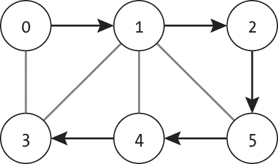
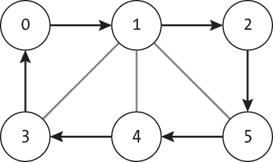
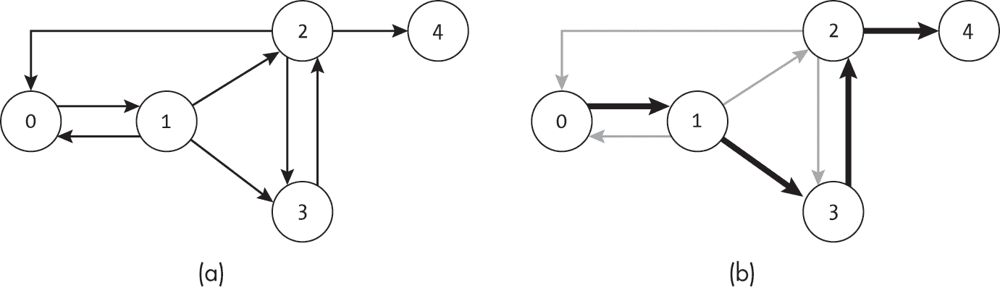
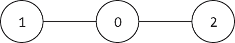
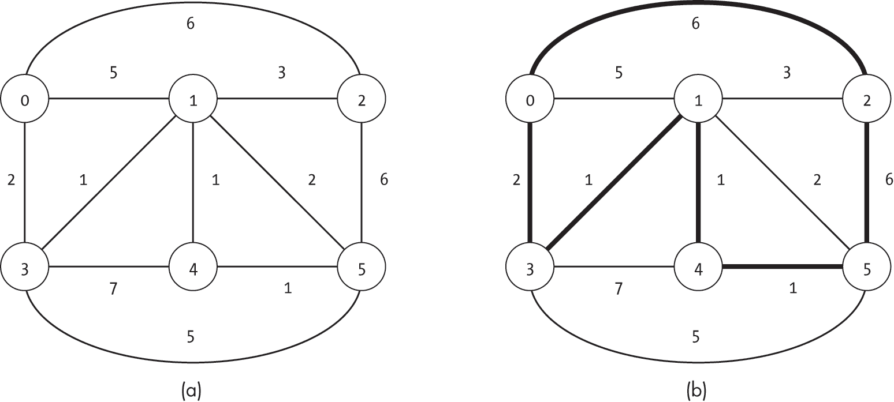
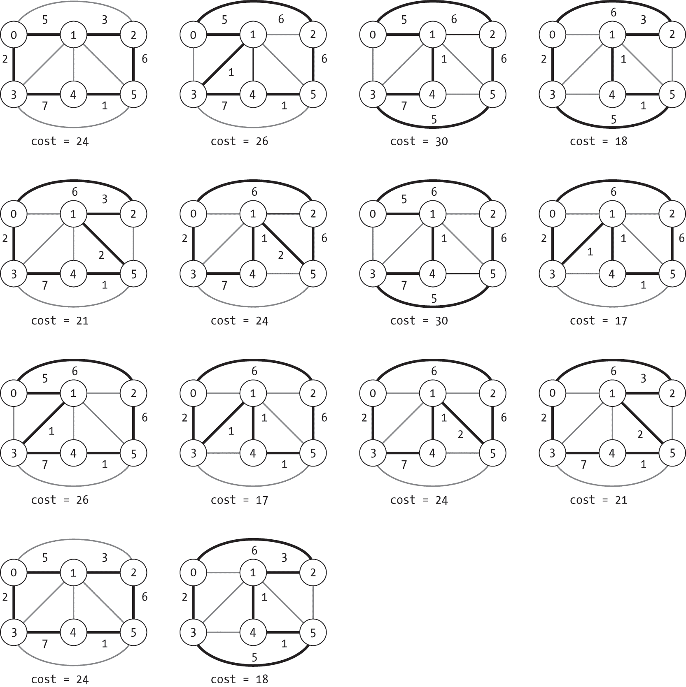
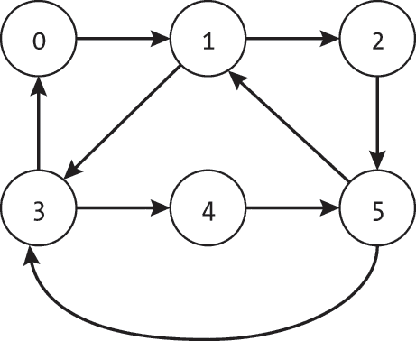
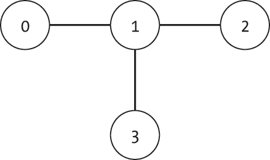
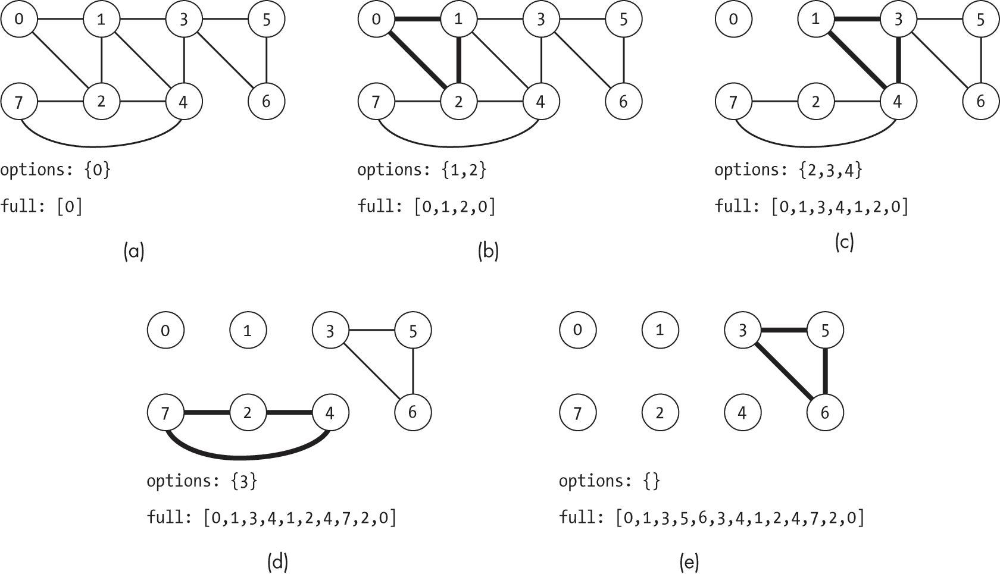

## 第十八章：18 图中的旅游路线


设计一个最佳观光旅游的难题非常适合用图形来表示。根据我们的旅行偏好，我们可能希望精确地访问一组主要景点一次，最小化总行程，或者访问目的地城市中的每一条街道。每一种情况都对应着一个经典的图问题：规划图中的路径。

本章中，我们将考虑这个核心问题的几种变体。*哈密尔顿路径*是指每个节点仅访问一次，可以帮助我们规划那些我们希望访问离散景点的旅行。解决*旅行商问题*则可以帮助我们访问每个景点，同时最小化总行程距离。最后，*欧拉路径*仅遍历每条边一次，可以帮助我们规划那些我们希望在不重复的情况下遍历每条街道的旅行。

这些路径规划问题不仅限于度假规划，它们在现实世界中有广泛的应用，如解决航运行业中的物流问题。不幸的是，许多问题也伴随着显著的计算挑战。虽然计算欧拉路径问题有高效的计算解法，但哈密尔顿路径和旅行商问题都是 NP 难题。我们将基于前几章的技术，创建穷举算法来解决这些问题。

### 哈密尔顿路径与循环

*哈密尔顿路径*是以数学家威廉·哈密尔顿命名的，它是图中的一条路径，访问每个节点一次且仅一次。我们可以将这个问题看作是为一个既彻底又容易感到无聊的游客规划行程的问题。游客面临着两个相互竞争的目标。首先，他们需要确保访问城市中的每个景点，不希望错过任何一个。其次，他们希望避免看到同一个景点两次。毕竟，如果你已经看过了一个巨大的钟楼，你真的需要再看一遍吗？

图 18-1 展示了一个包含六个节点的图中的哈密尔顿路径[0, 1, 2, 5, 4, 3]。该路径从节点 0 开始，经过节点 1、2、5 和 4，最后到达节点 3。每个节点仅被访问一次。



图 18-1：哈密尔顿路径

对于游客而言，更有用的是*哈密尔顿循环*（或回路），它从同一个节点出发并回到该节点，同时访问每个节点一次且仅一次。虽然游客希望尽量避免重复的目的地，但他们希望能在酒店开始和结束旅行——这是一个可接受的折中，因为这样就不必在城市中搬运行李。

虽然旅游示例使用了预定义的节点（酒店）作为起点和终点，但哈密顿循环可以从图中的任何节点开始或结束。图 18-2 中的示例哈密顿循环可能从节点 0 或其他任意五个节点开始。



图 18-2：哈密顿循环

由于图 18-2 中的路径形成了一个循环，路径上的所有节点必须能够从自身到达。如我们所见，这种灵活性并不适用于一般的哈密顿路径。

#### 验证哈密顿路径

判断路径是否是哈密顿路径需要我们检查每个节点是否被访问一次。我们定义了一个检查函数is_hamiltonian_path()，它接受一个由已访问节点组成的路径列表：

```
def is_hamiltonian_path(g: Graph, path: list) -> bool: 
    num_nodes: int = len(path)
  ❶ if num_nodes != g.num_nodes:
        return False

    visited: list = [False] * g.num_nodes
  ❷ prev_node: int = path[0]
    visited[prev_node] = True

    for step in range(1, num_nodes):
        next_node: int = path[step]

      ❸ if not g.is_edge(prev_node, next_node):
            return False
      ❹ if visited[next_node]:
            return False

        visited[next_node] = True
        prev_node = next_node

    return True 
```

代码首先通过确认路径长度等于图中节点的数量 ❶ 来检查潜在的有效性。如果路径中的步骤较少，那么就无法访问所有节点。如果步骤过多，那么某个节点一定被访问了多次。这也处理了空路径和空图的边界情况。

如果路径非空，代码会设置数据结构，使用布尔数组跟踪每个节点是否被访问过（visited），以及沿路径看到的前一个节点（prev_node）。算法通过将prev_node设置为路径中的第一个节点并将其标记为已访问 ❷来开始检查。

算法的大部分内容是通过路径进行的for循环。在每一步，它检查前一个节点和当前节点之间是否存在边 ❸，然后检查当前节点是否尚未被访问 ❹。如果任何一个检查失败，则路径不是有效的哈密顿路径，代码返回False。如果两个检查都成功，算法将当前节点标记为已访问，并将prev_node设置为当前节点。如果代码成功遍历整个路径，则表示它已经访问了图中的相同数量的节点，并且没有访问任何节点两次。它返回True表示成功。

#### 使用深度优先搜索寻找哈密顿路径

虽然寻找哈密顿路径的问题是 NP 难题，但我们可以定义一个穷举搜索，尽管代价很高，它仍然能够找到这样的路径。我们使用深度优先搜索的变体，该变体不是每次只访问一个节点，而是探索通过一个节点的所有路径。

考虑 图 18-3(a) 中的图。这个图有一个有效的哈密顿路径 [0, 1, 3, 2, 4]，如 图 18-3(b) 中所示。然而，第四章 中的深度优先搜索不会按此顺序访问节点，而是在节点 3 之前探索节点 2。



图 18-3：一个哈密顿路径，它与深度优先搜索的访问顺序不匹配

为了找到有效的哈密顿路径，我们必须扩展这个深度优先搜索，使其能够回溯并尝试不同的路径。搜索必须在当前节点之后重置节点的访问状态为未访问，以便它可以尝试不同的路径到达这些节点。

列表 18-1 中的哈密顿深度优先搜索代码使用了标准的深度优先搜索，并进行了少量修改。

```
def hamiltonian_dfs_rec(g: Graph, current: int, path: list,
                        seen: list) -> Union[list, None]: 
    path.append(current)
    seen[current] = True
  ❶ if len(path) == g.num_nodes:
        return path

    for edge in g.nodes[current].get_edge_list():
        n: int = edge.to_node
        if not seen[n]:
          ❷ result: Union[list, None] = hamiltonian_dfs_rec(g, n, path, seen) if result is not None:
                return result

  ❸ _ = path.pop()
    seen[current] = False
    return None 
```

列表 18-1：一个用于搜索哈密顿路径的递归函数

hamiltonian_dfs_rec() 函数接受图（g）、当前节点索引（current）、到目前为止的路径（作为节点列表，path），以及已经访问的节点的布尔列表（seen）。如果找到了路径，它将返回代表路径的节点列表，否则返回 None。我们必须从 Python 的 typing 库中导入 Union，以支持返回值的类型提示。

代码首先将当前节点添加到路径中，并将其标记为已访问。然后，它检查是否已访问 g.num_nodes 个独特的节点 ❶。如果是，path 就是一个有效的哈密顿路径，函数将返回它。

核心搜索逻辑发生在路径尚未完成时。代码通过 for 循环迭代出边，并递归地测试未访问的邻居 ❷。如果在这些探索中找到有效的哈密顿路径（result is not None），它会立即返回该路径。在这种情况下，函数退出时不会重置节点的 seen 值或 path 列表，因为它将不再继续测试备用路径。

如果代码在通过每条出边时都没有找到有效路径，它会回溯到上一个节点。代码会从路径中移除当前节点并标记为未访问 ❸。这样，搜索就可以通过不同的路径访问该节点。代码返回 None，表示无法在此分支上找到路径。

我们定义了一个包装器，它从每个可能的起始节点启动搜索：

```
def hamiltonian_dfs(g: Graph) -> Union[list, None]: 
    seen: list = [False] * g.num_nodes
    for start in range(g.num_nodes):
        path: Union[list, None] = hamiltonian_dfs_rec(g, start, [], seen)
        if path is not None:
            return path
    return None 
```

hamiltonian_dfs() 函数将 seen 列表初始化为所有 False，并使用 for 循环从每个起始节点开始递归搜索。一旦找到路径（即非 None 的结果），就返回该路径。如果无法使用任何起始节点找到有效的哈密顿路径，则返回 None。

图 18-4 展示了这种更新后的搜索示例。在访问 图 18-4(a) 中的节点 1 时，搜索有两个去向选择，节点 2 或 3。它首先探索节点 2，如 图 18-4(b) 所示，这导致在节点 3 处遇到死胡同，未能访问节点 4。由于无法访问节点 4，因此没有找到有效的哈密顿路径，必须回溯并尝试备用路径。


图 18-4：基于深度优先的哈密顿路径搜索步骤

搜索回溯到节点 2。它将节点 3 标记为未访问，因为它不再将该节点包含在当前路径中。搜索考虑从节点 2 出发的其他路径。它已经拒绝了边 (2, 0)，因为它之前已经访问过节点 0。剩下的边是 (2, 4)，如 图 18-4(c) 所示。不幸的是，走这条边会导致死胡同，无法访问节点 3，搜索再次被阻塞。

搜索必须回溯到节点 1，并尝试通往节点 3 的路径，如 图 18-4(d) 所示。它将节点 2 和节点 4 都重置为未访问，并返回到 图 18-4(a) 中显示的状态。这样它就可以从节点 3 到达节点 2，并继续前往节点 4。

不幸的是，执行一次深度优先搜索可能不足以解决问题。与哈密顿回路不同，搜索的起始节点会影响是否能够找到哈密顿路径。 图 18-5 显示了一个图，其中从节点 1 开始可以找到哈密顿路径 [1, 0, 2]，从节点 2 开始可以找到哈密顿路径 [2, 0, 1]，但从节点 0 开始无法找到哈密顿路径。



图 18-5：从节点 0 开始没有哈密顿路径的图

为了解决这个问题，我们可以使用每个可能的起始节点进行单独的深度优先搜索。我们会继续搜索，直到用尽所有起始节点或者找到一个有效的路径。  ### 旅行商问题

*旅行商问题* 是寻找哈密顿回路的扩展问题，它考虑了边的权重。这个问题的模型借鉴了旅行商规划多城市行程的问题，其目标是找到一条路径，满足以下条件：(1) 从同一节点出发并返回；(2) 每个节点恰好访问一次；(3) 最小化边权重的总和。

图 18-6 显示了一个示例图 (a) 和其最低成本的旅行商路线 (b)。通过手动尝试不同的路径，几分钟内就能快速发现问题的难度：即使是像这样的简单图，可能的路径数量也会急剧增加。



图 18-6：一个包含 6 个节点和 11 条边的示例图 (a) 以及一个最优的旅行商路径 (b)

这个任务在现实世界中的许多具体应用，如运输和物流，使其在多个领域至关重要。正因为如此，计算机科学家和数学家们投入了大量时间和精力研究旅行商问题，并开发了许多方法，包括启发式搜索和近似算法。在本节中，我们将基于前几节的方法，构建一个基于深度优先搜索的穷举法。

#### 深度优先搜索

我们可以直接调整哈密顿路径的深度优先搜索算法来考虑路径成本。在此过程中，我们需要做三项更改。首先，因为我们要寻找的是循环而不是路径，所以我们更新算法以返回起始节点。其次，我们不再在找到第一个有效结果时立即停止，而是继续搜索，直到评估所有有效的哈密顿循环，从而找到最低成本的循环。第三，我们跟踪迄今为止看到的最佳路径及其成本。

我们定义了该算法，在路径上执行深度优先搜索，每当从节点回溯时，重置每个节点的seen标签。与哈密顿路径搜索类似，这允许我们尝试从每个节点出发的替代路径。每当我们通过完成哈密顿循环到达递归的终点时，我们会返回路径的副本及其成本。调用函数比较每次递归调用中的路径和成本，并返回最佳路径。

与哈密顿路径算法不同，我们可以从任意一个节点开始此搜索，而不必从每个起始节点开始，因为旅行商问题的结果是一个循环。无论从哪个节点作为起始和结束点，整个循环的成本都是相同的。

#### 代码

我们基于 Listing 18-1 中哈密顿路径搜索的代码实现了旅行商问题的代码。再次，我们从递归函数开始，如 Listing 18-2 所示。

```
def tsp_dfs_rec(g: Graph, path: list, seen: list, cost: float) -> tuple: 
    current: int = path[-1]

  ❶ if len(path) == g.num_nodes:
        last_edge: Union[Edge, None] = g.get_edge(current, path[0])
        if last_edge is not None:
            return (cost + last_edge.weight, path + [path[0]])
        else:
            return (math.inf, [])

    best_path: list = []
    best_score: float = math.inf
    for edge in g.nodes[current].get_edge_list():
        n: int = edge.to_node
        if not seen[n]:
          ❷ seen[n] = True
            path.append(n)

          ❸ result: tuple = tsp_dfs_rec(g, path, seen, cost + edge.weight)
          ❹ seen[n] = False
            _ = path.pop()

            if result[0] < best_score:
                best_score = result[0]
                best_path = result[1]

    return (best_score, best_path) 
```

Listing 18-2：用于旅行商问题的递归函数

tsp_dfs_rec()函数接受图（g）、到目前为止的路径（path）、访问过的节点的布尔列表（seen）和到目前为止的成本（cost）。它提取当前节点的索引作为<code>path</code>中的当前终节点。

该函数首先考虑递归的基本情况，其中所有节点都已经被访问❶。它检查是否可以通过返回起始节点（path[0]）将路径转换为一个循环。如果可以，代码返回一个包含循环成本和完整循环的新副本的元组（path + [path[0]]）。如果没有边返回到起始节点，代码返回无限大的成本，表示这不是一个有效的循环。

如果算法有更多节点需要探索，代码使用for循环遍历当前节点的出边，并递归地测试未访问的邻居❸。与清单 18-1 中用于哈密顿路径的代码不同，代码会增加❷并重置❹调用函数中的seen列表和path列表。这简化了之前的基本情况逻辑。在递归探索邻居之后，代码检查是否找到了更好的结果，如果有，便保存它。最后，它返回通过该分支找到的最佳成本和循环。

我们定义了一个包装器，设置数据结构并启动搜索：

```
def tsp_dfs(g: Graph) -> tuple: 
    if (g.num_nodes == 1):
        return (0.0, [0])

    seen: list = [False] * g.num_nodes
    path: list = [0]
    seen[0] = True

    return tsp_dfs_rec(g, path, seen, 0.0) 
```

代码首先检查图中只有一个节点的边界情况，并返回相应的答案。接着，它为搜索设置初始的seen和path列表，从节点 0 开始路径并标记为已访问。最后，它运行搜索并返回结果。

在清单 18-2 中显示的递归函数是旅行商问题算法的基本实现。我们可以通过额外的剪枝来提高它的效率。例如，如果当前路径的成本超过了迄今为止的最佳成本，我们可以剪枝该路径。类似地，我们可以结合启发式方法，例如按边权递增的顺序探索邻居，以专注于潜在的低成本路径。正如前面所提到的，旅行商问题的优化和启发式方法种类繁多，远超本章的讨论范围。

#### 一个例子

图 18-7 显示了在图 18-6(a)的图上运行此搜索的结果。每个子图展示了算法找到哈密顿循环的基本情况，路径以粗体突出显示，成本列在其下方。



图 18-7：深度优先搜索中探索的 14 个哈密尔顿回路

每条路径在图 18-7 中出现多次，因为算法会在两个方向上找到回路。例如，第一个子图对应路径[0, 1, 2, 5, 4, 3, 0]，而倒数第二个子图对应路径[0, 3, 4, 5, 2, 1, 0]。

### 欧拉路径和回路

*欧拉路径*以数学家莱昂哈德·欧拉命名，是一种通过图的路径，恰好经过每一条边一次。我们可以将问题看作是一个高效的橱窗购物游客。为了调查城市中的所有商店，游客会寻找一条路径，确保每条路只走一次。他们不愿意错过通过某条路时可能找到的潜在商店，也不愿浪费时间再走已经看过的街道。*欧拉回路*是一个从同一个节点出发并返回的欧拉路径，它提供了一个理想的规划工具，如果游客希望从酒店出发并返回，但又想确保每条路都走一次。

> 注意

*请记住，正如第三章中所述，我们使用的是计算机科学文本中常见的路径定义，这允许节点重复。这与图论中对路径的正式定义不同，后者不允许重复节点。在图论中，这个问题可能被称为寻找一个*欧拉轨迹*。

图 18-8 展示了一个包含六个节点的图上的欧拉回路。路径从节点 0 开始，包含[0, 1, 2, 5, 1, 3, 4, 5, 3, 0]。尽管路径回访了节点，但它只经过了每条边一次。游客可能会多次通过相同的交叉口，但每条街道的店铺橱窗仅会经过一次。



图 18-8：欧拉回路

并非所有的图都包含欧拉路径。图 18-9 展示了一个无向图，其中不可能存在欧拉路径。从节点 1 移动到任何其他节点后，搜索需要使用相同的边返回到节点 1。由于节点 0、2 和 3 只与节点 1 相连，因此任何经过所有边的路径都需要返回到节点 1。



图 18-9：没有欧拉路径的图

莱昂哈德·欧拉设计了一种简单而有效的方法来测试一个连通的无向图是否包含欧拉回路：

一个连通的无向图当且仅当所有节点的度数都是偶数时，才包含欧拉回路。

使用这个测试，我们可以定义一个辅助函数，用于测试图是否既完全连通又具有欧拉回路，如示例 18-3 所示。

```
def has_eulerian_cycle(g: Graph) -> bool: 
  ❶ components: list = dfs_connected_components(g)
    for i in range(g.num_nodes):
      ❷ if components[i] != 0:
            return False

      ❸ degree: int = g.nodes[i].num_edges()
        if i in g.nodes[i].edges:
            degree += 1
        if degree % 2 == 1:
            return False
    return True 
```

示例 18-3：检查图是否完全连通并具有欧拉回路

该代码首先使用来自第四章的 dfs_connected_components() 函数为每个节点标记其组件 ❶。然后，它使用 for 循环检查每个节点，确认它属于同一组件 ❷ 且具有偶数度数。

为了完整性，has_eulerian_cycle() 中的度数计算处理了无向自环的情况 ❸。正如第二章中所述，形成自环的边在无向图中被计算两次度数，因为它们分别与每个端点的节点接触。

如果代码发现一个不连通的组件或一个度数为奇数的节点，它将立即返回 False。如果它检查所有节点都没有问题，则返回 True。

#### 验证欧拉路径

为了确定路径是否是有效的欧拉回路，我们需要检查每条边是否只被使用一次。我们定义一个检查函数，将路径作为节点列表传入：

```
def is_eulerian_cycle(g: Graph, path: list) -> bool: 
    num_nodes: int = len(path)
  ❶ if num_nodes == 0:
        return g.num_nodes == 0

  ❷ used: dict = {}
    for node in g.nodes:
        for edge in node.get_edge_list():
            used[(edge.from_node, edge.to_node)] = False

    prev_node: int = path[0]
    for step in range(1, num_nodes):
        next_node: int = path[step]
      ❸ if not g.is_edge(prev_node, next_node):
            return False
      ❹ if used[(prev_node, next_node)]:
            return False ❺ used[(prev_node, next_node)] = True
        if g.undirected:
            used[(next_node, prev_node)] = True

        prev_node = next_node

  ❻ for value in used.values():
        if not value:
            return False
  ❼ return path[0] == path[-1] 
```

is_eulerian_cycle() 代码首先检查空路径的边界情况，只有当图没有节点时，空路径才被认为是有效的 ❶。如果路径确实有边，代码构建一个字典 used，该字典将图中的每条边映射到一个布尔值，用于指示该边是否已被访问 ❷。

代码的主体部分是一个 for 循环，它遍历路径，结合前一个节点 (prev_node) 和当前节点 (next_node) 来识别当前的边。如果路径使用了不存在的边 ❸ 或已被遍历的边 ❹，该函数将立即返回 False。否则，代码将标记这些边为已访问 ❺，并确保在无向图的情况下，双向边都被标记。

代码完成后会检查是否访问了每条边，并在发现未访问的边时返回False ❻。（或者，我们可以结构化代码来计算边的总数和已访问的边数，正确处理无向情况，并仅进行计数比较。）该函数使用最后检查确保起始节点和结束节点相同，意味着路径是一个回路 ❼。

#### 使用海尔霍尔策算法查找欧拉回路

与本章前两个问题不同，寻找欧拉回路的问题不是 NP 难题，并且存在一种高效的方法来在图中找到欧拉回路。数学家卡尔·海尔霍尔策（Carl Hierholzer）开发了一种用于提取具有欧拉回路的图中欧拉回路的算法。*海尔霍尔策算法*通过反复寻找未使用的边上的循环，并从图中移除这些循环来运行。由于该算法要求图中必须存在欧拉回路，因此我们使用欧拉度数测试（以及清单 18-3 中的代码）来对图进行预检查。

这种方法背后的主要思路是，如果一个图具有欧拉回路，我们可以通过一系列潜在的较小循环构建这个完整的回路。我们将这些较小的循环称为*子循环*，以便与完整的欧拉回路区分开来。算法首先通过查找图中的任何一个循环并移除其边来开始，这可能会在图中留下部分边。由于该图具有一个使用所有边的完整欧拉回路，算法可以通过将这些剩余的边插入到完整路径中，插入额外的子循环，每个子循环都从当前路径中的相同节点开始和结束。

图 18-10 展示了该算法的一个示例。在图 18-10(b)中，搜索找到一个初始循环[0, 1, 2, 5, 3, 0]，该循环使用五条边并访问了五个阴影节点。然后它移除这些边，如图 18-10(c)所示。

![四个子图展示了 Hierholzer 算法的步骤。在(a)中，显示了一个包含六个节点和九条无向边的初始图，边为(0, 1)、(0, 3)、(1, 2)、(1, 3)、(1, 5)、(2, 5)、(3, 4)、(3, 5)和(4, 5)。(B)显示了一个包含箭头的循环[0, 1, 2, 5, 3, 0]，箭头指示遍历过的边。(C)展示了去除遍历边后的图。(D)展示了突出显示的循环[1, 5, 4, 3, 1]。](../images/f18010.jpg)

图 18-10：Hierholzer 算法在步骤前（a）、第一步期间（b）、第一步后（c）和第二步期间（d）的图

接下来，算法寻找一个从之前访问过的节点出发并结束于该节点的循环，但该循环通过未使用的边缘。图 18-10(d) 显示了循环 [1, 5, 4, 3, 1]。我们可以通过将其插入到节点 1 的出现位置，将这个新环路拼接到完整路径中，最终路径为 [0, 1, 5, 4, 3, 1, 2, 5, 3, 0]。

根据算法如何选择下一个访问的节点，不同的实现最终可能会探索不同的子循环，并为相同的图生成不同的欧拉回路。例如，本节中的代码将按照图 18-10(a)中的节点顺序进行探索，从而生成图 18-8 中的最终欧拉回路：[0, 1, 2, 5, 1, 3, 4, 5, 3, 0]。

要从图中提取欧拉回路，我们必须通过图中的子循环进行遍历：

```
def hierholzers(g: Graph) -> Union[list, None]: 
  ❶ if not has_eulerian_cycle(g):
        return None

    g_r: Graph = g.make_copy()
    options: set = set([0])
    full_cycle: list = [0]

    while len(options) > 0:
      ❷ start: int = options.pop()
        current: int = start
        subcycle: list = [start]

      ❸ while current != start or len(subcycle) == 1:
          ❹ neighbor: int = list(g_r.nodes[current].edges.keys())[0] subcycle.append(neighbor)
            g_r.remove_edge(current, neighbor)

          ❺ new_num_edges: int = g_r.nodes[current].num_edges()
            if new_num_edges > 0:
                options.add(current)
            elif new_num_edges == 0 and current in options:
                options.remove(current)

            current = neighbor

      ❻ if g_r.nodes[start].num_edges() == 0 and start in options:
            options.remove(start)

        loc: int = full_cycle.index(start)
      ❼ full_cycle = full_cycle[0:loc] + subcycle + full_cycle[loc+1:]

    return full_cycle 
```

代码首先通过使用 Listing 18-3 ❶ 中的 has_eulerian_cycle() 函数来确认图是否存在欧拉回路。如果检查失败，代码将返回 None，表示没有欧拉回路。代码依赖于从 typing 库导入 Union 来支持多个返回类型的类型提示。如果检查通过，代码会设置初始数据结构，包括一个可以修改的图的完整副本（g_r），一个已访问节点的集合，用于作为子循环的起始点（options），以及一个跟踪迄今为止构建的欧拉回路的列表（full_cycle）。代码将通过遍历子循环并将其插入到 full_cycle 中，逐步构建 full_cycle。

算法的主体是一个 while 循环，只要存在带有未使用边缘的已访问节点（options 不为空），它就会继续寻找新的循环。options 集合提供了一个节点列表，代码可以从这些节点开始一个新的子循环。代码从 options ❷ 中弹出一个任意节点，并开始遍历一个循环。

代码通过使用内部while循环遍历新的循环，直到它完成一个回路并返回到循环的起始节点 ❸。循环条件还会检查新的循环是否至少走了一步后才会终止。如果len(subcycle) == 1，循环会继续，因为路径还没有走到任何地方。在每一步的循环遍历过程中，代码选择当前节点edges字典中的第一个键作为下一个要访问的目标（neighbor） ❹。它将neighbor添加到当前跟踪的循环中，并从图的副本中删除该边。

代码通过考虑当前节点剩余的边数来更新options ❺。如果至少还有一条剩余的边，它将该节点添加到options中，以表示还有其他路径可走。相比之下，如果代码刚刚删除了当前节点的最后一条相邻边，代码将该节点从options中移除。在内部while循环完成后，代码同样会丢弃没有剩余边的起始节点 ❻。

在完成内部循环后，代码还将subcycle插入到full_cycle ❼中。为了简化处理，我们使用线性时间查找（index()函数）并构建一个新的full_cycle副本。如果进行额外的记录工作，我们可以使用更高效的方法来最小化这一步的成本。

图 18-11 展示了 Hierholzer 算法在一个包含八个节点的图上的操作。图 18-11(a)展示了图的状态、options集合以及算法开始前的full_cycle列表。其余的子图展示了每次外部while循环迭代后的算法状态。在该迭代中遍历并移除的边以粗体显示。

我们可以通过将该算法可视化为一位城市旅游局官员规划综合旅游的过程来理解。其目标是设计一条遍历每条街道一次的路径，让游客全方位体验这座城市，而不产生不必要的重复。他们选择城市的豪华酒店作为起点（节点 0），并开始出发。旅行过程中，他们记录下每条已走过的街道，并访问未走过的道路交叉口。

图 18-11(b) 展示了旅游规划者第一天的结果。通过走未探索的道路，他们完成了一个小循环 [0, 1, 2, 0]，回到了酒店。此时，他们在当前节点没有未走过的道路。尽管还有许多街道没有被探索，他们仍然毫不气馁，标记了道路（0, 1）、（1, 2）和（2, 0）为已走过。他们还注意到，在交叉口（即节点）1 和 2，他们本可以选择不同的道路。



图 18-11：Hierholzer 算法在示例图上的步骤

第二天，规划者前往一个未走过边的节点，从那里继续探索。如图 18-11(c)所示，他们选择从节点 1 出发，因为它在之前的循环中是可达的，并且有未探索的选项。他们完成了另一个小循环 [1, 3, 4, 1]，然后返回到节点 1，发现他们已经遍历了所有相邻的街道。他们更新了地图，删除了道路（1, 3）、（3, 4）和（4, 1），并注意到有未探索的街道从节点 2、3 和 4 的交叉口分叉出来。他们将今天的路径拼接到昨天的路径中，形成了合并路径 [0, 1, 3, 4, 1, 2, 0]。

第三天的情况类似，规划者从节点 2 出发，如图 18-11(d)所示。他们完成了循环 [2, 4, 7, 2]，删除了已走的街道，并将已合并的路径扩展为 [0, 1, 3, 4, 1, 2, 4, 7, 2, 0]。在这一天的旅行过程中，他们注意到已经走过了所有与节点 2 和 4 相邻的道路。他们从起始选项中移除了这两个节点，只剩下节点 3。

最后一天从节点 3 开始，如图 18-12(e) 所示。规划者走了 [3, 5, 6, 3] 并将其拼接到已合并路径中，形成欧拉回路 [0, 1, 3, 5, 6, 3, 4, 1, 2, 4, 7, 2, 0]。

### 为什么这很重要

本章讨论的三个问题——寻找哈密顿路径和欧拉路径以及解决旅行推销员问题——在各种现实世界的规划和优化应用中具有明确的应用场景。与前两章中从给定起点到给定终点寻找路径的问题不同，本章所涉及的问题旨在寻找访问图中每个节点或边的路径。

这些问题为构建更复杂的任务提供了基础。我们可以通过添加成对排序约束来扩展欧拉路径问题。例如，游客可能需要先参观城市的欢迎中心并购买票据，然后才能乘坐缆车。一家公司可能会将其城市分配给五名销售人员，要求他们为每位员工分配城市和路径。本章中的这三个问题仅仅是我们可以提出的有趣且复杂问题的冰山一角。

本章中的问题还表明，解决看似相似的问题的难度实际上可能差异很大。尽管寻找欧拉路径和哈密顿路径的任务有类似的现实世界类比，但它们的最坏情况计算成本差异显著。在解决新问题时，认识到并理解这些差异非常重要，这有助于我们决定采用何种方法。
