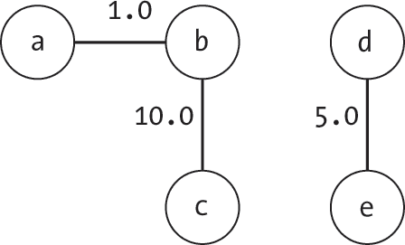
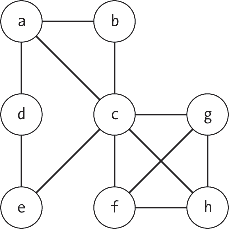
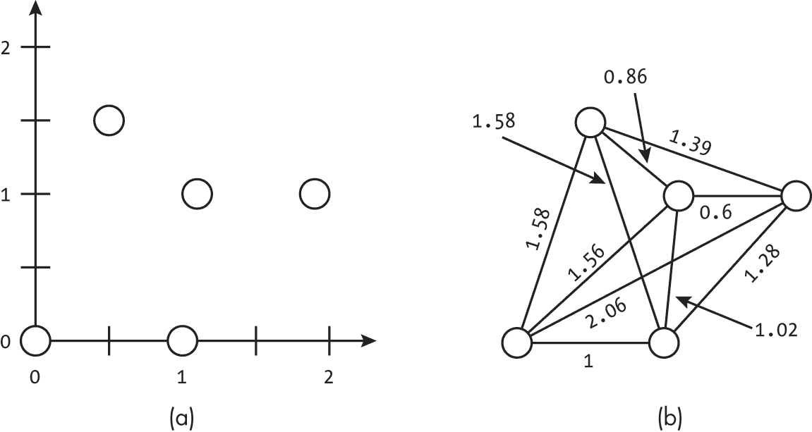
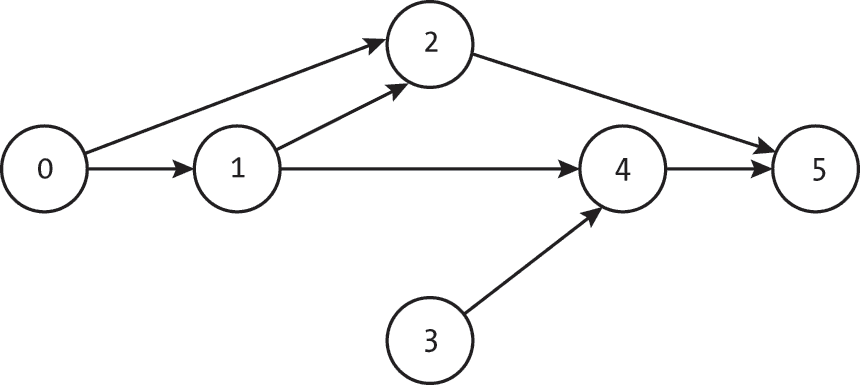

# 第二十章：A 构建图


本书已经涵盖了多种操作图的算法。为了将这些算法应用于现实问题，我们需要一个机制，能够以编程方式创建新图或从文件中加载它们。

虽然第一章中的图形创建函数，如 insert_node() 和 insert_edge() 提供了定义图的完整机制，但为每个图形手动编写代码是不现实的。除了列出数百或数千个 insert_edge() 语句的繁琐外，这种方法还容易出错。

在本附录中，我们介绍了几种简单的机制，用于创建图并从文件中加载它们。与前几章一样，我们优化的是易理解性，而非存储大小或计算效率。这意味着我们使用的某些输入格式，如逗号分隔值，将是简单的。然而，这些格式非常适合展示我们需要考虑的信息以及如何以编程方式操作这些信息来构建图。读者可以基于这些方法构建适合自己应用的优化格式。

本附录使用 Python 的 csv 库来简化文件的加载和解析。我们鼓励读者探索更多专门的库，它们可能进一步简化代码。

## 从边构建图

我们从第一章开始使用的 Graph 数据结构依赖于一个构造函数，它创建一个没有边的初始图。用户可以使用 insert_edge() 函数向图中添加边。在本节中，我们将自动化这一流程，基于边的列表构建图。

在从给定的边列表创建一个新图后，我们将扩展该功能以从边文件中读取并写入数据。在此过程中，我们解决了节点是通过通用文本标签而不是节点索引来指定的问题。

### 从列表插入边

我们可以通过一个 Edge 数据结构的列表来创建一个图：

```
def make_graph_from_edges(num_nodes: int,
                          undirected: bool,
                          edge_list: list) -> Graph: 
    g: Graph = Graph(num_nodes, undirected)
    for edge in edge_list:
        g.insert_edge(edge.from_node, edge.to_node, edge.weight)
    return g 
```

除了边列表，代码还输入节点数量（num_nodes）以及图是否为无向图（undirected）。它创建一个初始的图结构，包含正确数量的节点和无向设置，然后循环遍历每个边并将其插入到图中。如果边是无向的，insert_edge()函数在<sam class="SANS_TheSansMonoCd_W5Regular_11">Graph类中会在两个方向插入有向边。

在许多情况下，我们可以通过跟踪看到的最大节点索引来直接计算节点数量。然而，这种方法不允许存在完全断开的节点，因为它们的索引永远不会出现在边列表中，结果图可能会缺少后面的节点。因此，代码将<sam class="SANS_TheSansMonoCd_W5Regular_11">num_nodes作为输入参数。

图 A-1 展示了一个图的构造示例，其中插入了以下有向边：

[Edge(0,1,1.0), Edge(1,3,10.0), Edge(2,4,5.0), Edge(3,1,2.0), Edge(1,2,3.0)]

图 A-1(a)展示了第一个节点插入后的图。每个子图展示了代码的for循环迭代后的图状态。


图 A-1：向一个五节点图中添加边的步骤

我们可以将make_graph_from_edges()函数与返回边列表的算法结合使用，例如第十章中的randomized_kruskals()算法。

### 从文件加载边列表

构建图的一种自然方法是直接从文件加载图。虽然我们可以使用许多不同的格式来存储图的表示，但我们将从最简单的方法之一开始：将图存储为逗号分隔值（CSV）文件。每一行表示一个边，列出起始节点作为字符串标签，目标节点作为字符串标签，以及一个可选的浮动权重。未连接的节点单独列出。

使用这种 CSV 格式，我们可以使用以下数据对图 A-2 中显示的无向图进行编码：

a,b

b,c,10.0

d,e,5.0

这些数据定义了一个包含五个节点 a、b、c、d 和 e，以及三条边的图。两条边具有显式权重，第三条使用默认值 1.0。



图 A-2：一个包含五个节点和三条加权边的图

我们可以扩展此格式以考虑完全断开的节点，这些节点不会出现在任何边中，通过允许只有一个条目的行来实现。这一单一条目仅表示节点存在，从而程序将其包含在图中。

我们可以使用这种通用格式来编码大量的现实世界现象。例如，我们可以使用一个文件来表示教室里的纸条传递行为。每个节点代表一个学生。每一行提供有关课堂（图）的新信息。一行可以包含一个单独的名字，表示学生（节点）的存在。或者，一行可以表示学生之间的有向纸条传递行为，并包含<sup class="SANS_TheSansMonoCd_W5Regular_11">person1</sup>*,* <sup class="SANS_TheSansMonoCd_W5Regular_11">person2</sup>*,* <sup class="SANS_TheSansMonoCd_W5Regular_11">weight</sup>，表示学生 1 向学生 2 传递纸条的次数（由 weight 表示）。

读取此类 CSV 文件的代码利用 Python 的<sup class="SANS_TheSansMonoCd_W5Regular_11">open()</sup>函数来读取文件，并使用 csv 包（需要导入<sup class="SANS_TheSansMonoCd_W5Regular_11">csv</sup>）来解析每一行，如列表 A-1 所示。

```
def make_graph_from_weighted_csv(filename: str, undirected: bool) -> Graph: 
    g: Graph = Graph(0, undirected)
    node_indices: dict = {}

  ❶ with open(filename) as f:
        graph_reader = csv.reader(f, delimiter=',')
      ❷ for row in graph_reader:
            name1: str = row[0]
            if name1 not in node_indices:
                new_node: Node = g.insert_node(label=name1)
                node_indices[name1] = new_node.index
            index1: int = node_indices[name1]

          ❸ if len(row) > 1:
                name2: str = row[1]
                if name2 not in node_indices:
                    new_node = g.insert_node(label=name2)
                    node_indices[name2] = new_node.index
                index2: int = node_indices[name2] ❹ if len(row) > 2:
                    weight: float = float(row[2])
                else:
                    weight = 1.0

                g.insert_edge(index1, index2, weight)
    return g 
```

列表 A-1：从 CSV 文件加载图

代码首先创建必要的数据结构——一个空的图（g）和一个空的字典（node_indices），该字典将字符串名称映射到相应的节点索引。

然后，代码打开文件并使用<sup class="SANS_TheSansMonoCd_W5Regular_11">csv.reader</sup> ❶进行解析。它遍历文件中的每一行，最多读取三个条目 ❷。对于每一行，它从第一个条目中提取节点的名称。由于代码读取的是名称，它需要将这些名称映射到相应的索引。如果节点已经在图中，代码可以从<sup class="SANS_TheSansMonoCd_W5Regular_11">node_indices</sup>字典中查找它。否则，它发现了一个尚未在图中的节点，并必须将该节点插入到图中，并将名称插入字典。如果该行仅包含一个条目，函数会跳过剩余的逻辑并继续到下一行。

然而，如果这一行有第二个条目，那么该行指定了一个边 ❸。代码提取第二个节点的名称。然后，它检查该节点是否在图中，如果不在，就插入该节点。代码会检查行中是否有第三个条目，表示权重 ❹。如果没有提供权重，代码会使用默认值 1.0。最后，代码使用这两个节点的索引和权重的组合，将一条新边插入到图中。

代码会逐行读取 CSV 文件，直到读取完整个文件。此时，它会返回最终的图。文件会在代码退出 with 语句时自动关闭。

这段代码中的主要复杂性之一是将节点的文本字符串映射到它们的索引。理论上，我们可以限制加载函数要求文件提供每个节点的整数索引。虽然这样可以去掉映射的需求，但会大大降低可用性。每次我们想加载一个新的图时，必须首先构建从名称到索引的映射并转换文件。在后续章节中，我们将讨论如何将这一常见操作集成到 Graph 数据结构本身。

### 将边列表保存到文件

我们可以使用相同的逗号分隔值格式来保存我们最喜爱的图。由于我们考虑的大多数图未使用命名节点，因此我们将在 CSV 文件中使用每个节点的整数索引作为其名称。然而，我们仍然面临清单 A-1 中的代码将节点索引分配到遇到的位置的问题。理想情况下，我们希望节点 5 在重新加载时仍然是节点 5，无论代码在边列表中遇到它的顺序如何。

解决这个问题有几种潜在的方案。我们可以完全放弃使用名称，只在 CSV 中存储整数节点索引，并修改清单 A-1 以直接将节点名称读取为整数索引。或者，我们可以在 CSV 文件开始时按顺序输出每行一个节点名称，以指示它们的存在。这样可以确保第一个节点映射到索引 0，第二个节点映射到索引 1，以此类推。

对于以下代码，我们采用第二种方法，以保持与清单 A-1 一致。这段代码同样适用于基于整数的读取器：

```
def save_graph_to_csv(g: Graph, filename: str): 
  ❶ with open(filename, 'w', newline="\n") as f:
        graph_writer = csv.writer(f, delimiter=',')
      ❷ for node in g.nodes:
            graph_writer.writerow([node.index])

      ❸ for node in g.nodes:
            for edge in node.get_edge_list():
                graph_writer.writerow([edge.from_node, edge.to_node,
                                       edge.weight]) 
```

代码使用csv.writer打开文件并写入数据❶。它使用for循环遍历每个节点，每行写入一个节点索引❷。这确保了即使某些节点不属于任何边，也会被包含在 CSV 中。最后，一对for循环遍历图中的每条边，并写入三项值（起始节点、目标节点和权重），表示这条边❸。当代码退出with语句时，文件会自动关闭。

## 按名称插入节点

列表 A-1 中的一大部分代码涉及到将节点名称映射到索引的处理。我们在node_indices字典中查找每个名称字符串，以获取索引。如果名称不在字典中，我们需要插入一个新节点，并创建一个相应的字典条目，将名称映射到新索引。根据你在程序中如何引用节点，这可能是一个常见问题。

为了简化与命名节点的工作，我们可以将这一逻辑整合到Graph类本身中。我们需要做两个修改。首先，在初始化函数中添加一个空字典的创建：

```
self.node_indices: dict = {} 
```

每当我们需要将名称映射到索引时，我们都会使用这个字典。

第二，我们向Graph类中添加一个函数，该函数执行查找和（如有必要）插入操作，如列表 A-2 所示。

```
def get_index_by_name(self, name: str) -> int: 
    if name not in self.node_indices:
        new_node: Node = self.insert_node() self.node_indices[name] = new_node.index
    return self.node_indices[name] 
```

列表 A-2：向图中添加命名节点

代码首先通过检查节点名称是否在映射中，来判断该节点是否已经存在于图中。如果没有，图将使用原始的insert_node()函数将节点插入图中。它还将名称插入索引映射中。该函数最终返回节点的索引。

我们可以通过懒散教师创建座位表的情景来形象化这个函数。在第一天，老师允许学生选择自己的座位，但不打算记录谁坐在哪儿。座位表最初是空的。随着课程的进行，学生们举手提问。每次发生这种情况，老师都会看一眼座位表。如果学生的名字在上面，老师就会使用它。否则，老师会盯着学生看，完全没有技巧地问：“你是谁？”当学生翻完白眼并回答之后，老师会把学生添加到座位表中。随着学生们的出现，座位表逐渐填满。

我们可以使用这些辅助函数，更简洁地重写列表 A-1 中的 CSV 读取器代码：

```
def make_graph_from_weighted_csv2(filename: str, undirected: bool) -> Graph: 
    g: Graph = Graph(0, undirected)

    with open(filename) as f:
        graph_reader = csv.reader(f, delimiter=',')
        for row in graph_reader:
          ❶ index1: int = g.get_index_by_name(row[0])

            if len(row) > 1:
              ❷ index2: int = g.get_index_by_name(row[1])

                if len(row) > 2:
                    weight: float = float(row[2])
                else:
                    weight = 1.0
                g.insert_edge(index1, index2, weight)
    return g 
```

该代码遵循与列表 A-1 相同的流程，但使用get_index_by _name()来进行节点映射和查找每行中的第一个❶和第二个节点❷。

## 共现

*共现图*表示哪些实体对曾经共同出现过。在生物学中，它们可以用来研究相互作用，比如哪些基因经常一起出现，或者哪些微生物之间存在互动。在社会学中，它们可以建模群体聚会或学术出版物的共同作者关系。而在流行文化中，它们可以帮助回答一些关键问题，例如哪些电影明星曾经在同一部电影中共同出演，正如在第二章中讨论的那样。

吸收共现数据的难点在于，它通常由一组集合而不是成对的交互组成。我们最喜爱的在线电影数据库可能不会列出去年夏天热播电影中所有电影明星的每一对搭档。相反，它提供一个标记为*演员表*的单一列表，列出电影中所有出现的演员。

例如，在回顾当地剧团近期的所有演出时，我们可能会发现以下演员表：

(A, B, C)

(D, E)

(A, D)

(C, F, G, H)

(C, E)

使用单一的演员表列表，我们可以很容易地看到A与C曾在同一舞台上演出。然而，如果我们对更复杂的问题感兴趣，比如A和H之间有多少度的分隔，我们就需要构建一个更全面的图像。图 A-3 展示了基于这些演出的共现图。



图 A-3：一个无向图，包含八个节点，表示演员在剧中的共现情况

为了使模型更强大，我们可以使用边权来追踪两个节点的共同出现次数。例如，Alice 和 Bob 在 10 个不同的戏剧中共同出演后，可能会有更强的演出关联，而 Diane 与 Alice 的较弱连接则来源于仅仅一次的同台演出。如果你想了解世界著名的 Alice，最好通过 Bob 使用更强的关联。

我们可以扩展从 CSV 加载图的方法，以从任意列表构建成对图形。我们不再期望每行最多只有三个条目，而是允许将所有共同出现的条目列在同一行。然后，代码会根据每个列表推断出成对的边：

```
def make_graph_from_multi_csv(filename: str) -> Graph: 
    g: Graph = Graph(0, undirected=True)
    with open(filename) as f:
        graph_reader = csv.reader(f, delimiter=',')
        for row in graph_reader:
            num_items: int = len(row)

            for i in range(num_items):
                index1: int = g.get_index_by_name(row[i])

                for j in range(i + 1, num_items):
                    index2: int = g.get_index_by_name(row[j])
                    edge: Union[Edge, None] = g.get_edge(index1, index2)
                  ❶ if edge is not None:
                        weight = edge.weight + 1.0
                    else:
                        weight = 1.0
                  ❷ g.insert_edge(index1, index2, weight)
    return g 
```

与之前的 CSV 读取器一样，代码首先创建一个空图，打开文件并使用 csv.reader 进行解析。这次，代码将图限制为无向图，因为这些共现边没有暗示的方向性。代码还不维护一个名称字典，而是使用列表 A-2 中的辅助函数来插入新节点并检索每个节点的索引。

代码使用 for 循环逐行迭代。对于每一行，它使用另一对嵌套的 for 循环来遍历每行中的所有唯一条目对。它通过 get_index_by_name() 函数查找节点的索引，并在需要时插入新节点。在创建边之前，代码会检查该边是否已存在 ❶。我们使用 Python 的 typing 库中的 Union 使得 None 可以由 get_edge() 函数返回。如果边已存在，代码会检索其当前权重并将其增加 1，然后插入具有更新权重的新边 ❷。由于 insert_edge() 在插入重复项时会覆盖现有的边，代码实际上是更新了现有边的权重。

与之前在列表 A-1 中的 CSV 读取器一样，代码会逐行读取文件，直到读取完整个文件为止。此时，它会返回最终的图。

## 空间点

在使用图形来模拟路径规划或其他物理问题时，我们经常需要从一系列空间数据点构建图形。我们可以通过创建一个图，其中每个空间点对应一个节点，且每对点之间有一条边来实现这一点。

图 A-4 展示了这种表示方式的一个例子。图 A-4(a) 展示了五个二维点：(0, 0)、(1, 0)、(1.2, 1)、(1.8, 1) 和 (0.5, 1.5)。图 A-4(b) 展示了图的表示，其中的边权重捕捉了点与点之间的距离。



图 A-4：一组二维空间点（a）及其对应的图表示（b）

我们首先定义一个辅助类来存储空间点并计算它们之间的距离：

```
class Point: 
    def __init__(self, x: float, y: float):
        self.x: float = x
        self.y: float = y

    def distance(self, b) -> float:
        diff_x: float = (self.x - b.x)
        diff_y: float = (self.y - b.y)
      ❶ dist: float = math.sqrt(diff_x*diff_x + diff_y*diff_y)
        return dist 
```

虽然不要求使用 Point 类，但它使我们可以轻松地更换为更高维度的点或替代的距离函数。distance() 函数计算二维空间中的欧几里得距离。请注意，我们需要导入 math 才能使用平方根函数。

我们可以通过修改 distance() 函数来替换为替代的距离函数。例如，我们可以通过将 ❶ 处的代码修改为以下内容来使用曼哈顿距离：

```
 dist: float = abs(diff_x) + abs(diff_y) 
```

我们可以通过使用一对嵌套循环来编写构建图的代码，该图是由空间点构成的：

```
def build_graph_from_points(points: list) -> Graph:  
    num_pts: int = len(points)
    g: Graph = Graph(num_pts, undirected=True)

    for i in range(num_pts):
        for j in range(i + 1, num_pts): dist: float = points[i].distance(points[j])
            g.insert_edge(i, j, dist)
    return g 
```

该代码为数据集中的每个点分配一个节点，然后使用一对 for 循环遍历每一对点。对于每一对，代码使用 Point 类中的 distance() 函数计算两点之间的距离，并在图中插入带有相应权重的无向边。所有边添加完后，函数返回已完成的图。

## 前提条件

在第九章中，我们讨论了拓扑排序的问题——根据图的有向边对节点进行排序。图 A-5 展示了这种排序的一个例子，其中每个节点沿水平方向进行排序。



图 A-5：根据节点之间的相对依赖关系排序的六个节点

拓扑排序使我们能够列出操作手册的步骤、规划具有先决条件的课程，或者计算编译程序各部分的顺序。这些问题都要求我们明确节点之间的依赖关系。

我们定义了一个简单的函数，从一个前置条件的字典构建图。字典中的每个条目将一个节点映射到它的依赖列表。例如，图 A-5 中的图将表示为：

{0: [], 1: [0], 2: [0, 1], 3: [], 4: [1, 3], 5: [2, 4]}

没有依赖的节点，例如节点 0 和 3，用一个空列表表示。

从依赖关系构建图的代码由遍历每个节点的循环组成，同时还遍历每个节点的依赖项：

```
def make_graph_from_dependencies(dependencies: dict) -> Graph: 
    g: Graph = Graph(0, undirected=False)
    for node in dependencies:
        n_index: int = g.get_index_by_name(node) for prior in dependencies[node]:
            p_index: int = g.get_index_by_name(prior)
            g.insert_edge(p_index, n_index, 1.0)
    return g 
```

代码首先分配一个空的有向图。它通过遍历 `dependencies` 列表中的每个键，使用 `for` 循环来填充图。对于每个条目，即使是那些没有前置依赖的条目，代码也会使用 `get_index_by_name()` 来查找并可能插入一个新节点。此代码足以填充图的节点。

为了填充边，代码使用第二个 `for` 循环遍历每个节点的依赖列表。通过 `get_index_by_name()` 获取依赖项的索引（并可能插入一个新节点）。然后，代码插入从依赖节点 *到* 当前节点的边。由于我们只关心排序，代码对所有边使用默认的 `1.0` 权重。代码最后返回构建的图。
