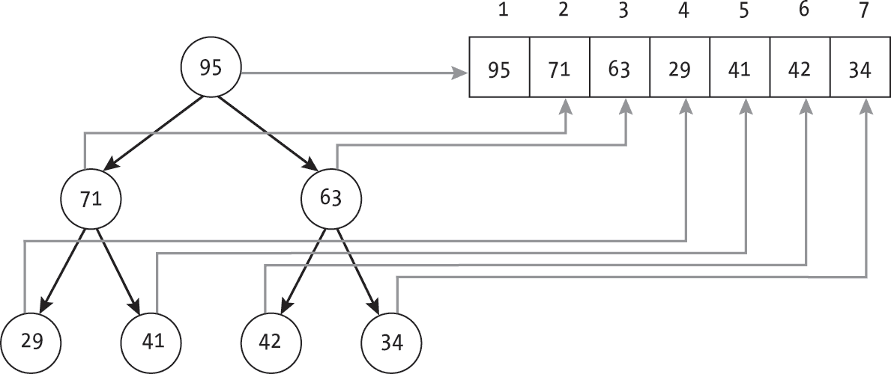
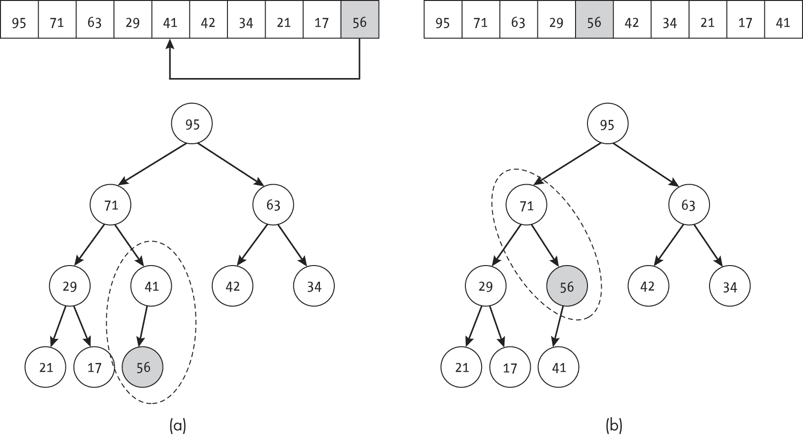
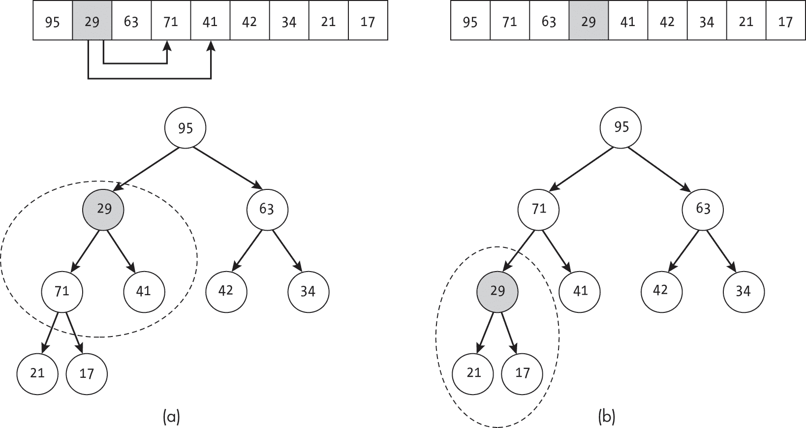
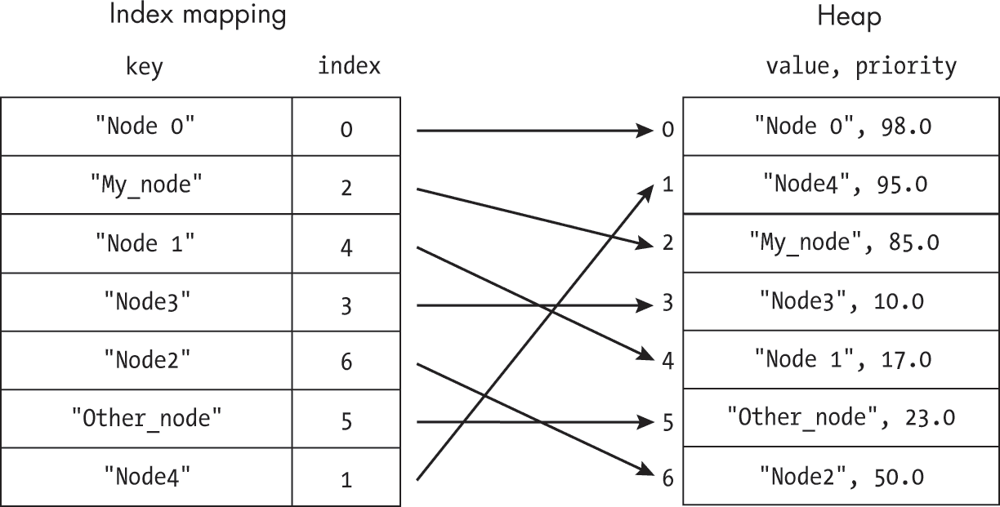

<hgroup>

# <samp class="SANS_Futura_Std_Bold_Condensed_B_11">B</samp> <samp class="SANS_Dogma_OT_Bold_B_11">可修改优先队列</samp>

</hgroup>


本书中的几个算法，如 Dijkstra 算法和 A* 搜索，使用了增强型优先队列，允许程序修改现有元素的优先级。为完整起见，本附录描述并提供了该数据结构的代码。

虽然许多标准堆实现支持添加和移除元素，但它们通常不支持高效地更改元素的优先级。我们将简要概述堆，然后定义一个对标准优先队列的小扩展，该扩展使用字典来映射每个元素在堆中的位置。此映射允许我们高效地查找给定的元素并更改其优先级。最后，我们将展示用于实现可修改优先队列的代码。

## <samp class="SANS_Futura_Std_Bold_B_11">堆</samp>

我们优先队列数据结构的核心是堆数据结构。本节提供了一个简短的堆介绍，内容来自我之前的书《*数据结构的有趣方式*》。我们将讨论足够的堆内容来解释代码，但不会深入探讨；你可以在上述书籍中学习更多关于堆及其性质的详细信息。

*堆* 是一种二叉树的变种，它在节点与其子节点之间维持一种特殊的有序关系。*最大堆* 按照最大堆属性对元素进行排序，该属性规定树中任意节点的值都大于或等于其子节点的值。*最小堆* 按照最小堆属性对元素进行排序，该属性规定树中任意节点的值都小于或等于其子节点的值。对于优先队列，我们使用最大堆根据优先级对元素进行排序。

### <samp class="SANS_Futura_Std_Bold_Condensed_Oblique_BI_11">堆元素</samp>

我们使用两个变量来定义优先队列中的每个元素。元素的 *值* 是我们存储的关于该对象的信息。这可以是整数（节点的索引）、字符串（节点的名称）或甚至是对象。元素的 *优先级* 是一个浮动小数，用于确定优先队列中下一个被提取的元素。

我们使用一个包装数据结构 <samp class="SANS_TheSansMonoCd_W5Regular_11">HeapItem</samp> 来存储项的值和优先级的组合：

```
class HeapItem: 
    def __init__(self, value, priority: float):
        self.value = value
        self.priority = priority

  ❶ def __lt__(self, other):
        return self.priority < other.priority

  ❷ def __gt__(self, other):
        return self.priority > other.priority 
```

该数据结构包含一个构造函数来初始化对象，并重载了小于 ❶ 和大于 ❷ 比较运算符以比较优先级。这个数据结构并非严格必要，增加了一些开销；我们可以选择使用元组。但是，在本章中，我们将依赖于 <samp class="SANS_TheSansMonoCd_W5Regular_11">HeapItem</samp> 来使代码更具可读性。

### <samp class="SANS_Futura_Std_Bold_Condensed_Oblique_BI_11">基于数组的存储</samp>

虽然堆是通过树来定义的，但我们使用基于数组的标准实现方式，这种方式特别高效。数组中的每个元素对应树中的一个节点，根节点位于索引 1（我们跳过索引 0，这是堆的常规做法）。子节点的索引是相对于其父节点的索引定义的；例如，索引为*i*的节点，其子节点的索引分别为 2*i*和 2*i* + 1。我们同样可以计算出索引*i*节点的父节点的索引，公式为<samp class="SANS_TheSansMonoCd_W5Regular_11">Floor</samp>(*i*/2)。这种索引方案，如图 B-1 所示，使得算法可以轻松地基于父节点的索引计算子节点的索引，反之亦然。



<samp class="SANS_Futura_Std_Book_Oblique_I_11">图 B-1：堆以树形（左）和数组（右）表示</samp>

尽管数组中的项目并未按照排序顺序排列，但第一个项目总是优先级最高的。在最大堆中，数组中的第一个项目具有最大优先级；而在最小堆中，第一个项目具有最小优先级。这意味着我们可以通过简单的查找来访问堆中的“下一个”项目。

### <samp class="SANS_Futura_Std_Bold_Condensed_Oblique_BI_11">元素交换</samp>

插入和移除项目都会破坏堆的性质，并通过交换元素对来恢复它。每当我们发现一个项目位置不正确时，可以通过将其与父节点向上交换或与子节点向下交换来修正排序。我们重复这个过程，直到该项处于堆中的正确位置。

在最大堆的情况下，如果一个元素的优先级比它的父节点大，我们就将该元素向上交换。例如，在图 B-2 中，元素 56 的位置不正确。当我们将其与父节点图 B-2(a)进行比较时，我们看到 56 大于 41，这违反了最大堆的性质。我们可以通过交换这两个元素来修正它，将 56 放置到相对于父节点的正确位置，正如图 B-2(b)所示。



<samp class="SANS_Futura_Std_Book_Oblique_I_11">图 B-2：一个不合适的堆元素（a）和结果向上比较与交换（b）</samp>

类似地，如果一个元素的优先级小于其子节点中的任何一个，我们就将其在最大堆中向下交换。在这种情况下，我们还必须选择哪个子节点进行交换，选择两个子节点中较大的一个，以保持最大堆的性质。例如，在图 B-3 中，元素 29 的位置不对。当我们将其优先级与其子节点在图 B-3(a)中的优先级进行比较时，我们发现 29 小于 71，并且 29 小于 41，这违反了最大堆的性质。我们通过将元素 29 与其两个子节点中较大的那个交换来修复这一点，如图 B-3(b)所示。



<samp class="SANS_Futura_Std_Book_Oblique_I_11">图 B-3：一个位置不对的堆元素（a）以及由此产生的向下比较和交换（b）</samp>

在修复最小堆时，我们反转比较的方向。如果一个元素的优先级小于其父节点的优先级，我们就将其向上交换；如果其优先级大于两个子节点中的任何一个，则将其向下交换。在向下交换时，我们选择优先级较小的子节点，以保持最小堆的性质。

## <samp class="SANS_Futura_Std_Bold_B_11">可修改优先队列</samp>

可修改的优先队列由一个封装标准基于堆的优先队列的类和一个将项目映射到堆数组位置的字典组成。该结构如图 B-4 所示，字典（按项目的值索引）位于左侧，基于数组的最大堆位于右侧。如图所示，字典中的每个条目都指向堆数组中该项目的索引。



<samp class="SANS_Futura_Std_Book_Oblique_I_11">图 B-4：优先队列类中的两个数据结构</samp>

给定这些属性，我们定义了一个简单的接口，使我们能够将(value, priority)对插入到优先队列中，从优先队列的前端移除值，并更改现有值的优先级。我们还包括了几个方便的函数，用于获取大小或检查某个值是否在优先队列中。

本附录提供了构成优先队列接口的函数代码：

<samp class="SANS_TheSansMonoCd_W7Bold_B_11">dequeue()</samp> 从优先队列中移除顶部项并返回其值。

<samp class="SANS_TheSansMonoCd_W7Bold_B_11">enqueue(value, priority)</samp> 将一个新的(value, priority)对插入到优先队列中。

<samp class="SANS_TheSansMonoCd_W7Bold_B_11">get_priority(value)</samp> 返回该值的浮动优先级。

<samp class="SANS_TheSansMonoCd_W7Bold_B_11">in_queue(value)</samp>返回一个布尔值，指示给定值是否在优先队列中

<samp class="SANS_TheSansMonoCd_W7Bold_B_11">is_empty()</samp>返回一个布尔值，指示优先队列是否为空

<samp class="SANS_TheSansMonoCd_W7Bold_B_11">peek_top()</samp>返回优先队列中的顶部项目

<samp class="SANS_TheSansMonoCd_W7Bold_B_11">peek_top_priority()</samp>返回队列中顶部项目的优先级

<samp class="SANS_TheSansMonoCd_W7Bold_B_11">peek_top_value()</samp>返回队列中顶部项目的值

<samp class="SANS_TheSansMonoCd_W7Bold_B_11">size()</samp>返回优先队列中的项目数

<samp class="SANS_TheSansMonoCd_W7Bold_B_11">update_priority(value, priority)</samp>更新具有给定值的项目的优先级

## <samp class="SANS_Futura_Std_Bold_B_11">数据结构</samp>

<samp class="SANS_TheSansMonoCd_W5Regular_11">PriorityQueue</samp>类为堆和索引字典提供了一个封装。它包含以下属性：

<samp class="SANS_TheSansMonoCd_W7Bold_B_11">array_size</samp> **(**<samp class="SANS_TheSansMonoCd_W7Bold_B_11">int</samp>**) **存储堆数组的总长度

<samp class="SANS_TheSansMonoCd_W7Bold_B_11">heap_array</samp> **(**<samp class="SANS_TheSansMonoCd_W7Bold_B_11">list</samp>**) **存储<samp class="SANS_TheSansMonoCd_W5Regular_11">HeapItems</samp>，作为优先队列的堆排序内部存储

<samp class="SANS_TheSansMonoCd_W7Bold_B_11">last_index</samp> **(**<samp class="SANS_TheSansMonoCd_W7Bold_B_11">int</samp>**) **存储堆中最后一个元素的索引

<samp class="SANS_TheSansMonoCd_W7Bold_B_11">is_min_heap</samp> **(**<samp class="SANS_TheSansMonoCd_W7Bold_B_11">bool</samp>**) **指示一个<samp class="SANS_TheSansMonoCd_W5Regular_11">PriorityQueue</samp>对象是最小堆（<samp class="SANS_TheSansMonoCd_W5Regular_11">True</samp>）还是最大堆（<samp class="SANS_TheSansMonoCd_W5Regular_11">False</samp>）

<samp class="SANS_TheSansMonoCd_W7Bold_B_11">indices</samp> **(**<samp class="SANS_TheSansMonoCd_W7Bold_B_11">dict</samp>**) **存储一个映射，将<samp class="SANS_TheSansMonoCd_W5Regular_11">HeapItem</samp>的值映射到其在<samp class="SANS_TheSansMonoCd_W5Regular_11">heap_array</samp>中的索引，从而实现通过值高效查找项目

我们定义了一个构造函数，它将属性初始化为空优先队列的值，并提供一些基本功能：

```
class PriorityQueue:
    def __init__(self, size: int = 100, min_heap: bool = False): 
        self.array_size: int = size
      ❶ self.heap_array: list = [None] * size
        self.last_index: int = 0
        self.is_min_heap: bool = min_heap
        self.indices: dict = {}

    def size(self) -> int: 
        return self.last_index

    def is_empty(self) -> bool: 
        return self.last_index == 0

    def in_queue(self, value) -> bool: 
        return value in self.indices

    def get_priority(self, value) -> Union[float, None]: 
        if not value in self.indices:
            return None
        ind: int = self.indices[value]
        return self.heap_array[ind].priority 
```

<samp class="SANS_TheSansMonoCd_W5Regular_11">PriorityQueue</samp>构造函数根据估算的大小预分配<samp class="SANS_TheSansMonoCd_W5Regular_11">heap_array</samp> ❶。正如我们稍后所见，如果需要的元素超过<samp class="SANS_TheSansMonoCd_W5Regular_11">array_size</samp>，堆会使用数组扩展来增加大小。

<samp class="SANS_TheSansMonoCd_W5Regular_11">size()</samp> 和 <samp class="SANS_TheSansMonoCd_W5Regular_11">is_empty()</samp> 函数都使用 <samp class="SANS_TheSansMonoCd_W5Regular_11">last_index</samp> 的值来确定优先队列中的项数。请注意，因为在这种情况下我们使用的是 1 索引，所以 <samp class="SANS_TheSansMonoCd_W5Regular_11">PriorityQueue</samp> 中的元素数量始终等于 <samp class="SANS_TheSansMonoCd_W5Regular_11">last_index</samp>，当 <samp class="SANS_TheSansMonoCd_W5Regular_11">last_index</samp> <samp class="SANS_TheSansMonoCd_W5Regular_11">==</samp> <samp class="SANS_TheSansMonoCd_W5Regular_11">0</samp> 时，堆是空的。

接下来的两个函数使用优先队列的 <samp class="SANS_TheSansMonoCd_W5Regular_11">indices</samp> 字典，该字典将每个项的值映射到其在队列中的索引，以便高效查找项。<samp class="SANS_TheSansMonoCd_W5Regular_11">in_queue()</samp> 函数通过检查值是否存在于 <samp class="SANS_TheSansMonoCd_W5Regular_11">indices</samp> 中来检查值是否在队列中。<samp class="SANS_TheSansMonoCd_W5Regular_11">get_priority()</samp> 函数首先检查项是否在优先队列中，如果不在，则返回 <samp class="SANS_TheSansMonoCd_W5Regular_11">None</samp>。否则，它使用 <samp class="SANS_TheSansMonoCd_W5Regular_11">indices</samp> 查找正确的 <samp class="SANS_TheSansMonoCd_W5Regular_11">HeapItem</samp> 并返回其优先级。与其他可以返回多种类型的函数一样，我们使用了 Python 的 <samp class="SANS_TheSansMonoCd_W5Regular_11">typing</samp> 库中的 <samp class="SANS_TheSansMonoCd_W5Regular_11">Union</samp>。

### <samp class="SANS_Futura_Std_Bold_Condensed_Oblique_BI_11">定义辅助函数</samp>

我们还定义了几个内部辅助函数以支持堆操作。由于我们允许堆可配置为最小堆或最大堆，这些函数封装了这两种设置所需的不同逻辑。

#### <samp class="SANS_Futura_Std_Bold_Condensed_B_11">检查反转</samp>

第一个辅助函数检查节点及其父节点是否在堆的错误顺序中：

```
def _elements_inverted(self, parent: int, child: int) -> bool: 
  ❶ if parent < 1 or parent > self.last_index:
        return False
    if child < 1 or child > self.last_index:
        return False

  ❷ if self.is_min_heap:
        return self.heap_array[parent] > self.heap_array[child]
    else:
        return self.heap_array[parent] < self.heap_array[child] 
```

<samp class="SANS_TheSansMonoCd_W5Regular_11">_elements_inverted()</samp> 函数的代码首先对节点父节点和子节点的索引进行边界检查 ❶。如果任一索引无效，代码将返回 <samp class="SANS_TheSansMonoCd_W5Regular_11">False</samp>。由于我们将在本节稍后使用此函数来确定是否需要在堆中交换节点，这样可以防止交换超出数组的边界。该检查考虑到了堆使用从索引 1 开始的数组，因此不允许索引 0。

然后，代码根据是处理最小堆还是最大堆来分支 ❷。在最小堆的情况下，代码通过检查父节点的优先级是否大于子节点的优先级来判断元素是否被反转。在最大堆的情况下，代码通过检查父节点的优先级是否小于子节点的优先级来检查是否存在反转。由于我们在<samp class="SANS_TheSansMonoCd_W5Regular_11">HeapItem</samp>中重载了这两种比较，代码始终检查项目的相对优先级。

#### <samp class="SANS_Futura_Std_Bold_Condensed_B_11">交换元素</samp>

第二个辅助函数交换堆数组中的两个元素。这个操作需要一些额外的逻辑，因为我们不仅需要交换对象，还需要更新它们在<samp class="SANS_TheSansMonoCd_W5Regular_11">indices</samp>字典中的相应条目：

```
def _swap_elements(self, index1: int, index2: int): 
  ❶ if index1 < 1 or index1 > self.last_index:
        return
    if index2 < 1 or index2 > self.last_index:
        return

    item1: HeapItem = self.heap_array[index1]
    item2: HeapItem = self.heap_array[index2]
    self.heap_array[index1] = item2
    self.heap_array[index2] = item1

  ❷ self.indices[item1.value] = index2
    self.indices[item2.value] = index1 
```

同样，<samp class="SANS_TheSansMonoCd_W5Regular_11">_swap_elements()</samp>的代码首先进行边界检查 ❶，如果任一索引越界则提前返回。然后，代码提取两个堆项目，交换它们在数组中的位置，并更新它们在字典中的索引 ❷。

#### <samp class="SANS_Futura_Std_Bold_Condensed_B_11">向上传播元素</samp>

第三个辅助函数实现了附录中描述的向上传播：

```
def _propagate_up(self, index: int): 
    parent: int = int(index / 2)
  ❶ while self._elements_inverted(parent, index):
        self._swap_elements(parent, index)
        index = parent
        parent = int(index / 2) 
```

<samp class="SANS_TheSansMonoCd_W5Regular_11">_propagate_up()</samp>代码首先计算父节点的索引。然后，它使用<samp class="SANS_TheSansMonoCd_W5Regular_11">while</samp>循环不断地将元素向上交换，直到它相对于父节点的顺序正确 ❶。由于<samp class="SANS_TheSansMonoCd_W5Regular_11">_elements_inverted()</samp>在任一索引越界时返回<samp class="SANS_TheSansMonoCd_W5Regular_11">False</samp>，当元素到达数组的前面（索引 1 和父节点索引 0）时，循环也会终止。

每次循环发现元素仍然不在正确位置时，它会将该元素与其父节点交换。代码然后更新元素的索引，并计算新父节点的索引。

#### <samp class="SANS_Futura_Std_Bold_Condensed_B_11">向下传播元素</samp>

最终的辅助函数实现了之前描述的向下传播：

```
def _propagate_down(self, index: int): 
    while index <= self.last_index:
        swap: int = index
        if self._elements_inverted(swap, 2*index):
            swap = 2*index
        if self._elements_inverted(swap, 2*index+1):
            swap = 2*index + 1

      ❶ if index != swap:
            self._swap_elements(index, swap)
            index = swap
        else:
          ❷ break 
```

<samp class="SANS_TheSansMonoCd_W5Regular_11">_propagate_down()</samp>代码使用<samp class="SANS_TheSansMonoCd_W5Regular_11">while</samp>循环不断将元素向下交换，直到它成为数组中的最后一个元素或相对于子节点的顺序正确。代码使用<samp class="SANS_TheSansMonoCd_W5Regular_11">_elements_inverted()</samp>函数检查左右子节点，该函数还处理数组的边界检查。如果找到具有反转优先级的子节点 ❶，代码会执行交换。否则，它会跳出循环 ❷。

### <samp class="SANS_Futura_Std_Bold_Condensed_Oblique_BI_11">添加项目</samp>

我们通过先将新元素附加到数组的末尾来添加 (*enqueue*) 新元素，这对应于树底层第一个空位。由于这个位置没有考虑到项目的优先级，因此我们很可能破坏了堆的性质。我们通过交换该元素向上移动，直到它处于正确的位置来修正这一点。

入队的代码执行堆插入以及额外的书籍管理：

```
def enqueue(self, value, priority: float): 
  ❶ if value in self.indices:
        self.update_priority(value, priority)
        return

  ❷ if self.last_index == self.array_size - 1:
        old_array: list = self.heap_array
        self.heap_array = [None] * self.array_size * 2
        for i in range(self.last_index + 1):
            self.heap_array[i] = old_array[i]
        self.array_size = self.array_size * 2

    self.last_index = self.last_index + 1
    self.heap_array[self.last_index] = HeapItem(value, priority)
    self.indices[value] = self.last_index
    self._propagate_up(self.last_index) 
```

<samp class="SANS_TheSansMonoCd_W5Regular_11">enqueue()</samp> 函数的代码首先检查对象是否已经存在于优先队列中，方法是判断它的值是否在 <samp class="SANS_TheSansMonoCd_W5Regular_11">indices</samp> 中 ❶。如果是，它更新项目的优先级并返回。代码不会插入具有重复值的项目。

代码接下来检查列表是否有足够的空间容纳新元素 ❷。如果没有，它必须在插入项目之前分配更多空间，并使用数组扩展来增加大小。

最后，代码将元素插入到 <samp class="SANS_TheSansMonoCd_W5Regular_11">heap_array</samp> 的末尾。它在 <samp class="SANS_TheSansMonoCd_W5Regular_11">indices</samp> 字典中标记该位置，以便后续查找，然后使用 <samp class="SANS_TheSansMonoCd_W5Regular_11">_propagate_up()</samp> 修正插入造成的任何排序问题。重要的是，<samp class="SANS_TheSansMonoCd_W5Regular_11">_propagate_up()</samp> 函数使用 <samp class="SANS_TheSansMonoCd_W5Regular_11">_swap_elements()</samp> 函数，这会更新 <samp class="SANS_TheSansMonoCd_W5Regular_11">indices</samp>。因此，尽管代码最初将 <samp class="SANS_TheSansMonoCd_W5Regular_11">indices[value]</samp> 设置为 <samp class="SANS_TheSansMonoCd_W5Regular_11">last_index</samp>，它会在整个过程中正确更新此索引映射。

### <samp class="SANS_Futura_Std_Bold_Condensed_Oblique_BI_11">移除项目</samp>

我们通过用数组中的最后一个值替换顶部节点来移除 (*dequeue*) 顶部节点。这将最后一个节点跳到树的根部，这很可能破坏堆的性质。我们通过将该元素向下传播，直到它不再与其子节点顺序错误来修正相对顺序。

出队的代码执行堆移除以及额外的书籍管理：

```
def dequeue(self): 
    if self.last_index == 0:
        return None

  ❶ result: HeapItem = self.heap_array[1]
    new_top: HeapItem = self.heap_array[self.last_index]
    self.heap_array[1] = new_top
    self.indices[new_top.value] = 1

    self.heap_array[self.last_index] = None
    self.indices.pop(result.value)
    self.last_index = self.last_index - 1

    self._propagate_down(1)
    return result.value 
```

<samp class="SANS_TheSansMonoCd_W5Regular_11">dequeue()</samp> 函数的代码首先检查队列是否为空，如果为空，则返回 <samp class="SANS_TheSansMonoCd_W5Regular_11">None</samp>。（根据代码的上下文，我们可能需要引发错误。）

如果队列不为空，代码更新堆和索引映射。首先，它将 <samp class="SANS_TheSansMonoCd_W5Regular_11">heap_array</samp> 中的最后一个元素交换到第一个位置，并将旧根保存为 <samp class="SANS_TheSansMonoCd_W5Regular_11">result</samp> ❶。第二步，它从数组和索引映射中删除原来的顶部元素（<samp class="SANS_TheSansMonoCd_W5Regular_11">result</samp>）。第三步，使用 <samp class="SANS_TheSansMonoCd_W5Regular_11">_propagate_down()</samp> 函数修复堆属性的任何破坏。最后，返回结果的值。

### <samp class="SANS_Futura_Std_Bold_Condensed_Oblique_BI_11">修改优先级</samp>

可修改优先级队列支持的最终操作是更改元素的优先级。这涉及到查找元素在 <samp class="SANS_TheSansMonoCd_W5Regular_11">heap_array</samp> 中的位置，修改优先级，并使用 <samp class="SANS_TheSansMonoCd_W5Regular_11">_propagate_up()</samp> 或 <samp class="SANS_TheSansMonoCd_W5Regular_11">_propagate_down()</samp> 函数修复由于优先级变化导致的堆属性破坏。大部分代码都是确定应该使用哪个传播函数：

```
def update_priority(self, value, priority: float): 
    if not value in self.indices:
        return

    index: int = self.indices[value]
    old_priority: float = self.heap_array[index].priority
    self.heap_array[index].priority = priority

    if self.is_min_heap:
        if old_priority > priority:
            self._propagate_up(index)
        else:
            self._propagate_down(index)
    else:
        if old_priority > priority:
            self._propagate_down(index)
        else:
            self._propagate_up(index) 
```

代码首先通过检查 <samp class="SANS_TheSansMonoCd_W5Regular_11">value</samp> 是否在 <samp class="SANS_TheSansMonoCd_W5Regular_11">indices</samp> 字典中来确定值是否在优先级队列中。如果没有，则没有需要更新的内容，可以立即返回。

如果值在优先级队列中，代码查找并保存该项的当前索引（<samp class="SANS_TheSansMonoCd_W5Regular_11">index</samp>）和优先级（<samp class="SANS_TheSansMonoCd_W5Regular_11">old_priority</samp>），然后设置新的优先级。此时，代码必须根据对象是否为最小堆以及新优先级是否大于旧优先级来确定使用哪个传播函数。如果对象是最小堆且旧优先级较大，或对象是最大堆且旧优先级较小，则代码使用 <samp class="SANS_TheSansMonoCd_W5Regular_11">_propagate_up()</samp>；如果对象是最小堆且旧优先级较小，或对象是最大堆且旧优先级较大，则使用 <samp class="SANS_TheSansMonoCd_W5Regular_11">_propagate_down()</samp>。

## <samp class="SANS_Futura_Std_Bold_B_11">查看函数</samp>

除了本附录中介绍的标准优先级入队/出队函数外，我们还提供了一些额外的便捷函数，执行允许我们查看顶部值的操作——即在不出队的情况下查看它。我们可以返回顶部项的整个 <samp class="SANS_TheSansMonoCd_W5Regular_11">HeapItem</samp>（如果队列为空，则返回 <samp class="SANS_TheSansMonoCd_W5Regular_11">None</samp>），项的值，或项的优先级：

```
def peak_top(self) -> Union[HeapItem, None]: 
    if self.is_empty():
        return None
    return self.heap_array[1]

def peek_top_priority(self) -> Union[float, None]: 
    obj: Union[HeapItem, None] = self.peak_top()
    if not obj:
        return None
    return obj.priority

def peek_top_value(self): 
    obj: Union[HeapItem, None] = self.peak_top()
    if not obj:
        return None
    return obj.value 
```

这三个函数中的每一个都提供了一种有用的机制，用于在不修改队列的情况下检查优先队列中的“最佳”项，并且在调试时非常有用。
