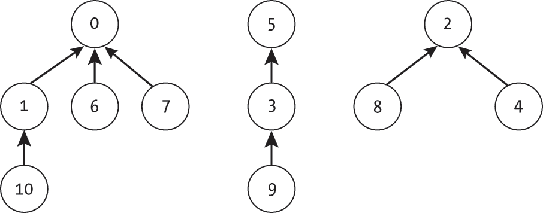
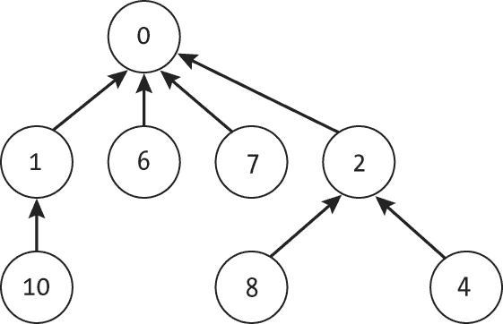

# C UNION-FIND


Kruskal 算法、随机迷宫生成和单链聚类都使用一种名为UnionFind的数据结构来表示图中不同连通分量对应的节点不相交的集合。这个数据结构使得算法能够高效地(1) 判断两个节点是否已经在同一个连通分量中，以及(2) 合并两个不同的分量。为完整性起见，本附录描述并提供了该数据结构的代码。

我们首先简要概述并查集数据结构，然后提供足够的代码以实现本书中的算法。我们鼓励感兴趣的读者进一步探索相关资源。Daniel Zingaro 的《Algorithmic Thinking》第 2 版（No Starch Press，2023）中的“并查集”一章，提供了对这些迷人数据结构的易懂介绍，并介绍了额外的优化。

## 并查集数据结构

*并查集*数据结构（也叫做*不相交集合*数据结构）通常被视为一组树的列表（也叫做*树的森林*）。每个项表示为树节点，每个集合表示为一棵树。若且仅若两个项处在同一棵树中，则它们被视为在同一个集合中。

图 C-1 显示了一个示例的并查集数据结构，包含 11 个项，分为三组：{0, 1, 6, 7, 10}、{3, 5, 9}、{2, 4, 8}。如图所示，树并不限于二叉树（每个节点最多有两个子节点），也没有强制对元素进行排序。



图 C-1：三个不相交的集合表示为树

该数据结构中的每个集合都通过根节点的索引号唯一标识。在图 C-1 中，树从左到右分别标记为 0、5 和 2。我们可以通过从某个节点遍历到该树的根节点来轻松检索该项的集合标签。例如，我们可以通过从节点 9 经过节点 3 到节点 5，然后返回 5 来识别项 9 的集合标签。

我们通过合并树来创建集合的并集。将一棵树附加到另一棵树上有多种方式。在本附录中，我们将使用常见的优化方法，将节点较少的树的根节点附加到较大树的根节点上。图 C-2 展示了将以 0 和 2 为根的集合合并为一个集合的示例。由于以节点 2 为根的树包含的节点较少，我们将节点 2 的父指针指向节点 0，实际上将子树作为子节点添加。



图 C-2：合并两棵树

为了便于说明，本节介绍了一种简化的 UnionFind 数据结构，它使用显式的森林树实现，使树形操作更为清晰。还可以进行更高效的优化，例如基于数组的实现和使用路径压缩来减少树的高度。

## UnionFind

UnionFind 数据结构将元素划分为不同的（且不重叠的）集合，使得每个元素仅属于一个集合。对于 Kruskal 算法，这些集合表示图中的不同连通组件。同一组件中的节点属于同一个集合。

如第十章所述，这种数据结构非常强大，因为它能够非常快速地执行两个操作。第一个操作是判断两个点是否在同一个集合中，这对于判断两个节点是否已连接是必要的。第二个操作是合并两个集合，这对于连接组件是必要的。

本附录提供了以下函数的代码，这些函数构成了并查集接口：

are_disjoint(i, j)判断两个元素 i 和 j 是否属于不同的集合

union_sets(i, j)将包含元素 i 的集合与包含元素 j 的集合合并为一个集合

find_set(i)返回包含元素 i 的集合的唯一标签

### UnionFindNode

由于我们只需要向上遍历树（而不是向下），每个节点只需要存储两项信息：它自己的索引号和指向其父节点的指针。节点不需要存储指向子节点的指针。我们可以按如下方式定义一个最简的 UnionFindNode：

```
class UnionFindNode: 
    def __init__(self, label: int):
        self.label = label
        self.parent = None 
```

我们最初将一个节点的父节点设置为 None，表示它是一个根节点。

### UnionFind 类

我们的最简 UnionFind 对象跟踪三项信息：

nodes **(**list**) **一个按标签索引的 UnionFindNode 对象的列表

set_sizes **(**list**) **一个将集合标签映射到其大小的列表

num_disjoint_sets **(**int**) **不相交集合的数量

我们使用列表来存储节点，因为在本书中的算法只需要支持连续的整数标签。然而，通过使用字典将每个标签映射到其对应的 UnionFindNode，我们也可以支持更通用的标签类型，如字符串。num_disjoint_sets 属性可以通过其他属性计算得到，但为了简便，它被显式存储。

使用这些属性，我们定义了一个构造函数，用于设置并查集数据结构的初始状态：

```
class UnionFind:
    def __init__(self, num_sets: int): 
        self.nodes: list = [UnionFindNode(i) for i in range(num_sets)]
        self.set_sizes: list = [1 for i in range(num_sets)]
        self.num_disjoint_sets: int = num_sets 
```

构造函数接受项的数量（num_sets），并构建完整的节点列表（nodes）和每个集合的大小列表（set_sizes）。由于所有项最初都在不相交的集合中，构造函数将每个项的 num_sets 大小初始化为 1。最后，它设置不相交集合的计数（num_disjoint_sets）。

查找集合的标签对应于向上遍历树并返回根节点的标签：

```
def find_set(self, label: int) -> int: 
    if label < 0 or label >= len(self.nodes):
        raise IndexError

  ❶ current: UnionFindNode = self.nodes[label]
    while current.parent is not None:
        current = current.parent
    return current.label 
```

find_set() 函数首先检查标签的边界，如果标签超出范围，则引发 IndexError。然后，它从当前节点 ❶ 开始，使用 while 循环向上遍历树直到父节点。它返回父节点的标签作为集合的标识符。

are_disjoint() 函数使用两次调用 find_set() 来提取每个项的集合标签，并测试它们是否相等：

```
def are_disjoint(self, label1: int, label2: int) -> bool: 
    return self.find_set(label1) != self.find_set(label2) 
```

如果集合标签相同，则项必须共享一个根节点，从而属于同一集合。

取两个集合的并集包含将树连接在一起：

```
def union_sets(self, label1: int, label2: int): 
  ❶ set1_label: int = self.find_set(label1)
    set2_label: int = self.find_set(label2)
    if set1_label == set2_label:
        return ❷ if self.set_sizes[set1_label] < self.set_sizes[set2_label]:
        small = set1_label
        large = set2_label
    else:
        small = set2_label
        large = set1_label
  ❸ self.nodes[small].parent = self.nodes[large]
    self.set_sizes[large] += self.set_sizes[small]
    self.set_sizes[small] = 0
    self.num_disjoint_sets -= 1 
```

union_sets() 函数首先通过查找每个集合的标签并检查它们是否已经相等 ❶。如果相等，则不需要进行任何操作，函数返回。如果不相等，函数使用 set_sizes 列表来确定哪个树的节点较少 ❷，并将较小树的根节点附加到较大树的根节点下 ❸。最后，函数通过计算较大树的新大小来更新剩余数据，将较小树的大小条目设置为 0（因为它不再是一个不相交的集合），并更新不相交集合的数量。
