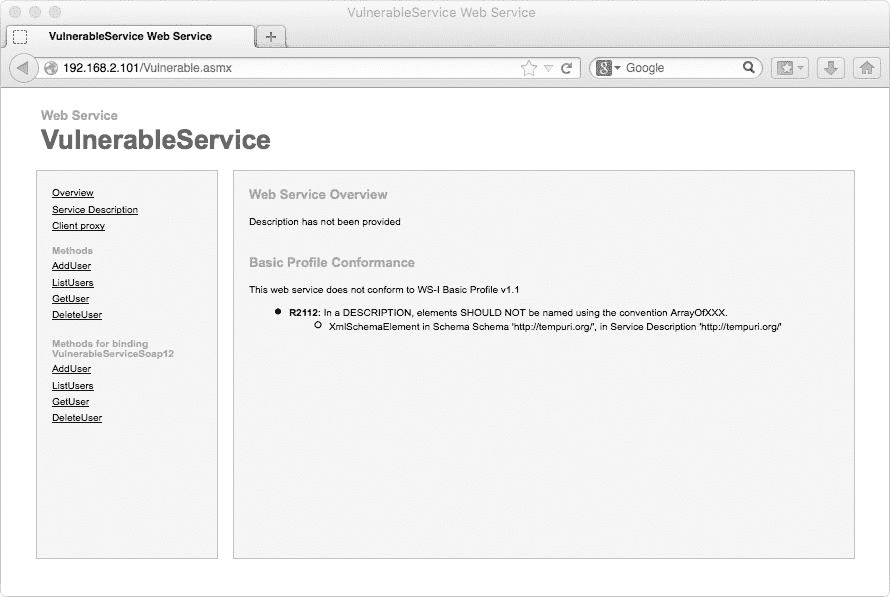
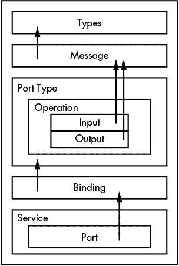

3

模糊测试 SOAP 端点

作为渗透测试员，你可能会遇到提供程序化 API 访问的应用程序或服务器，这些 API 通过 SOAP 端点提供。SOAP（简单对象访问协议）是一种常见的企业技术，允许以语言无关的方式访问编程 API。一般来说，SOAP 是通过 HTTP 协议使用的，并且它使用 XML 来组织发送到 SOAP 服务器的数据。Web 服务描述语言（WSDL）描述了通过 SOAP 端点公开的方法和功能。默认情况下，SOAP 端点公开 WSDL XML 文档，客户端可以轻松解析这些文档，以便与 SOAP 端点进行交互，C# 有多个类使得这成为可能。

本章建立在你如何通过编程方式构造 HTTP 请求来检测 XSS 和 SQL 注入漏洞的基础知识之上，只不过这次我们关注的是 SOAP XML。此章还会展示如何编写一个小型模糊测试器来下载和解析 SOAP 端点公开的 WSDL 文件，然后使用 WSDL 文件中的信息生成 SOAP 服务的 HTTP 请求。最终，你将能够系统化并自动化地查找 SOAP 方法中的 SQL 注入漏洞。

设置脆弱的端点

本章中，你将使用一个名为 CsharpVulnSoap 的预配置虚拟设备中的脆弱端点（该文件应具有 .ova 扩展名），该设备可在 VulnHub 网站上找到（[`www.vulnhub.com/`](http://www.vulnhub.com/)）。下载虚拟设备后，你可以通过双击文件将其导入到 VirtualBox 或 VMware 中，支持大多数操作系统。一旦安装完成，使用密码 password 登录，或者使用访客会话打开终端。接着，输入 ifconfig 查找虚拟设备的 IP 地址。默认情况下，该设备将通过仅主机接口进行监听，而与之前章节中的网络接口桥接不同。

在网页浏览器中打开端点，如图 3-1 所示，你可以使用屏幕左侧的菜单项（AddUser、ListUsers、GetUser 和 DeleteUser）查看 SOAP 端点公开的功能在使用时的返回结果。导航到 http://<ip>/Vulnerable.asmx?WSDL 应该会展示一个 WSDL 文档，该文档描述了可以解析的 XML 文件中的可用函数。让我们深入研究该文档的结构。

图 3-1：从 Firefox 查看脆弱的端点

解析 WSDL

WSDL XML 文档有点复杂。即使是我们要解析的简单 WSDL 文档也并不简单。然而，由于 C# 提供了出色的类来解析和使用 XML 文件，正确解析 WSDL 并使其处于一个可以面向对象地与 SOAP 服务交互的状态是相当容易的。

一个 WSDL 文档本质上是一些 XML 元素，这些元素彼此之间以逻辑方式相关，从文档底部到顶部。文档底部，你与服务交互，向端点发出请求。从服务开始，你有了端口的概念。这些端口指向绑定，而绑定又指向端口类型。端口类型包含该端点上可用的操作（或方法）。操作包含输入和输出，二者都指向一个消息。消息指向一个类型，而该类型包含调用方法所需的参数。图 3-2 直观地解释了这一概念。

图 3-2: WSDL 文档的基本逻辑布局

我们的 WSDL 类构造函数将按相反顺序工作。首先，我们创建构造函数，然后我们将创建一个类来处理 WSDL 文档每个部分的解析，从类型到服务。

为 WSDL 文档创建一个类

当你通过编程解析 WSDL 时，最简单的方法是从文档的顶部开始，处理 SOAP 类型，然后逐步向下解析文档。让我们创建一个名为 WSDL 的类，它包含 WSDL 文档。构造函数相对简单，如清单 3-1 所示。

> public WSDL (XmlDocument doc)
> 
> {
> 
> XmlNamespaceManager nsManager = new ➊XmlNamespaceManager(doc.NameTable);
> 
> nsManager.➋AddNamespace("wsdl", doc.DocumentElement.NamespaceURI);
> 
> nsManager.AddNamespace("xs", "http://www.w3.org/2001/XMLSchema");
> 
> ParseTypes(doc, nsManager);
> 
> ParseMessages(doc, nsManager);
> 
> ParsePortTypes(doc, nsManager);
> 
> ParseBindings(doc, nsManager);
> 
> ParseServices(doc, nsManager);
> 
> }

清单 3-1: WSDL 类构造函数

我们的 WSDL 类的构造函数只调用了少数几个方法（我们稍后会编写），并且它期望获取包含所有 Web 服务定义的 XML 文档作为参数。我们需要做的第一件事是定义在实现解析方法时使用 XPath 查询时所引用的 XML 命名空间（这些内容在清单 3-3 及后续清单中有所介绍）。为此，我们创建一个新的 XmlNamespaceManager ➊，并使用 AddNamespace() 方法 ➋ 添加两个命名空间：wsdl 和 xs。然后，我们调用将解析 WSDL 文档元素的方法，从类型开始，一直到服务。每个方法接受两个参数：WSDL 文档和命名空间管理器。

我们还需要访问 WSDL 类中的一些属性，这些属性与构造函数中调用的方法相对应。将清单 3-2 中显示的属性添加到 WSDL 类中。

> public List<SoapType> Types { get; set; }
> 
> public List<SoapMessage> Messages { get; set; }
> 
> public List<SoapPortType> PortTypes { get; set; }
> 
> public List<SoapBinding> Bindings { get; set; }
> 
> public List<SoapService> Services { get; set; }

清单 3-2: WSDL 类的公共属性

WSDL 类的这些属性由模糊测试工具（因此它们是 public 的）和构造函数中调用的方法使用。它们是我们在本章中将实现的 SOAP 类的列表。

编写初始解析方法

首先，我们将编写在 Listing 3-1 中调用的方法。一旦这些方法实现完成，我们将继续创建每个方法依赖的类。这会有点工作量，但我们会一起完成的！

我们将从实现 Listing 3-1 中调用的第一个方法`ParseTypes()`开始。构造函数中调用的所有方法相对简单，看起来都与 Listing 3-3 类似。

> private void ParseTypes(XmlDocument wsdl, XmlNamespaceManager nsManager)
> 
> {
> 
> this.Types = new List<SoapType>();
> 
> string xpath = ➊"/wsdl:definitions/wsdl:types/xs:schema/xs:element";
> 
> XmlNodeList nodes = wsdl.DocumentElement.SelectNodes(xpath, nsManager);
> 
> foreach (XmlNode type in nodes)
> 
> this.Types.Add(new SoapType(type));
> 
> }

Listing 3-3: WSDL 类构造函数中调用的`ParseTypes()`方法

因为这些方法仅在 WSDL 构造函数内部调用，所以我们使用`private`关键字，这样只有 WSDL 类才能访问它们。`ParseTypes()`方法接受一个 WSDL 文档和命名空间管理器（用于解析 WSDL 文档中的命名空间）作为参数。接下来，我们实例化一个新的 List 对象，并将其分配给 Types 属性。然后，我们使用 C#中 XML 文档的 XPath 功能，遍历 WSDL 中的 XML 元素。XPath 允许程序员根据文档中的节点路径遍历和使用 XML 文档。在这个示例中，我们使用 XPath 查询➊来枚举文档中的所有 SOAP 类型节点，使用`SelectNodes()`方法。然后，我们遍历这些 SOAP 类型，并将每个节点传递给`SoapType`类构造函数，这是我们在进入初始解析方法后将实现的类之一。最后，我们将新实例化的`SoapType`对象添加到 WSDL 类的 SoapType 列表属性中。

很简单，对吧？我们将采用这种使用 XPath 查询遍历特定节点的模式，再做几次，以便从 WSDL 文档中获取其他几种我们需要的节点类型。XPath 非常强大，对于 C#语言的使用也非常合适。

现在我们将实现 WSDL 构造函数中调用的下一个方法来解析 WSDL 文档，即`ParseMessages()`，如 Listing 3-4 所示。

> private void ParseMessages(XmlDocument wsdl, XmlNamespaceManager nsManager)
> 
> {
> 
> this.Messages = new List<SoapMessage>();
> 
> string xpath = ➊"/wsdl:definitions/wsdl:message";
> 
> XmlNodeList nodes = wsdl.DocumentElement.SelectNodes(xpath, nsManager);
> 
> foreach (XmlNode node in nodes)
> 
> this.Messages.Add(new SoapMessage(node));
> 
> }

Listing 3-4: WSDL 类构造函数中调用的`ParseMessages()`方法

首先，我们需要实例化并分配一个新的 List 来保存 SoapMessage 对象。（SoapMessage 是我们将在“创建 SoapMessage 类来定义发送的数据”一节中实现的类，见第 60 页。）使用 XPath 查询➊从 WSDL 文档中选择消息节点，我们遍历 SelectNodes()方法返回的节点，并将它们传递给 SoapMessage 构造函数。这些新实例化的对象将被添加到 WSDL 类的 Messages 属性中，以便稍后使用。

从 WSDL 类调用的接下来几个方法与前面两个类似。到现在为止，鉴于前面两个方法的工作方式，它们应该对你来说相对直接。这些方法的详细信息请见清单 3-5。

> private void ParsePortTypes(XmlDocument wsdl, XmlNamespaceManager nsManager)
> 
> {
> 
> this.PortTypes = new List<SoapPortType>();
> 
> string xpath = "/wsdl:definitions/wsdl:portType";
> 
> XmlNodeList nodes = wsdl.DocumentElement.SelectNodes(xpath, nsManager);
> 
> foreach (XmlNode node in nodes)
> 
> this.PortTypes.Add(new SoapPortType(node));
> 
> }
> 
> private void ParseBindings(XmlDocument wsdl, XmlNamespaceManager nsManager)
> 
> {
> 
> this.Bindings = new List<SoapBinding>();
> 
> string xpath = "/wsdl:definitions/wsdl:binding";
> 
> XmlNodeList nodes = wsdl.DocumentElement.SelectNodes(xpath, nsManager);
> 
> foreach (XmlNode node in nodes)
> 
> this.Bindings.Add(new SoapBinding(node));
> 
> }
> 
> private void ParseServices(XmlDocument wsdl, XmlNamespaceManager nsManager)
> 
> {
> 
> this.Services = new List<SoapService>();
> 
> string xpath = "/wsdl:definitions/wsdl:service";
> 
> XmlNodeList nodes = wsdl.DocumentElement.SelectNodes(xpath, nsManager);
> 
> foreach (XmlNode node in nodes)
> 
> this.Services.Add(new SoapService(node));
> 
> }

清单 3-5：WSDL 类中其余的初始解析方法

为了填充 PortTypes、Bindings 和 Services 属性，我们使用 XPath 查询来查找并遍历相关节点；然后我们实例化特定的 SOAP 类（接下来将实现这些类），并将它们添加到列表中，以便在稍后需要构建 WSDL 模糊测试逻辑时使用。

这就是 WSDL 类的全部内容。一个构造函数，几个存储与 WSDL 类相关数据的属性，以及一些解析 WSDL 文档的方法，这些就是你开始工作的全部内容。接下来我们需要实现支持类。在解析方法中，我们使用了一些尚未实现的类（SoapType、SoapMessage、SoapPortType、SoapBinding 和 SoapService）。我们将从 SoapType 类开始。

为 SOAP 类型和参数编写一个类

为了完成 ParseTypes()方法，我们需要实现 SoapType 类。SoapType 类是一个相对简单的类。它只需要一个构造函数和几个属性，如清单 3-6 所示。

> public class SoapType
> 
> {
> 
> public SoapType(XmlNode type)
> 
> {
> 
> this.Name = type.➊Attributes["name"].Value;
> 
> this.Parameters = new List<SoapTypeParameter>();
> 
> if (type.➋HasChildNodes && type.FirstChild.HasChildNodes)
> 
> {
> 
> foreach (XmlNode node in type.➌FirstChild.FirstChild.➍ChildNodes)
> 
> this.Parameters.Add(new SoapTypeParameter(node));
> 
> }
> 
> }
> 
> public string Name { get; set; }
> 
> public List<SoapTypeParameter> Parameters { get; set; }
> 
> }

清单 3-6：在 WSDL 模糊测试中使用的 `SoapType` 类

`SoapType` 构造函数中的逻辑与前面解析方法中的逻辑类似（见 清单 3-4 和 3-5），不同之处在于我们没有使用 XPath 来枚举我们正在遍历的节点。我们本可以使用 XPath，但我想展示另一种遍历 XML 节点的方式。通常，当你解析 XML 时，XPath 是首选方法，但 XPath 可能会计算量较大。在这种情况下，我们将写一个 `if` 语句来检查是否需要遍历子节点。在这个特定实例中，使用 `foreach` 循环遍历子节点来找到相关的 XML 元素，比使用 XPath 的代码要少一些。

`SoapType` 类有两个属性：一个是 `Name` 属性，类型为字符串，另一个是参数列表（`SoapTypeParameter` 类，稍后我们会实现）。这两个属性都在 `SoapType` 构造函数中使用，并且是公有的，以便稍后在类外部使用。

我们使用传入构造函数参数的节点的 `Attributes` 属性 ➊ 来检索节点的 `name` 属性。`name` 属性的值被赋给 `SoapType` 类的 `Name` 属性。我们还实例化了 `SoapTypeParameter` 列表，并将新对象赋给 `Parameters` 属性。完成这一步后，我们使用 `if` 语句判断是否需要遍历子节点，因为我们没有使用 XPath 来遍历任何子节点。通过使用 `HasChildNodes` 属性 ➋，它返回一个布尔值，我们可以判断是否需要遍历子节点。如果节点有子节点，且该节点的第一个子节点也有子节点，我们就会遍历它们。

每个 `XmlNode` 类都有一个 `FirstChild` 属性和一个 `ChildNodes` 属性 ➊，返回可遍历的子节点列表。在 `foreach` 循环中，我们使用一系列 `FirstChild` 属性 ➌ 来遍历传入节点的第一个子节点的第一个子节点的子节点。

传递给 `SoapType` 构造函数的 XML 节点示例如 清单 3-7 中所示。

在遍历传入的 `SoapType` 节点的相关子节点之后，我们通过将当前子节点传入 `SoapTypeParameter` 构造函数来实例化一个新的 `SoapTypeParameter` 类。新对象被存储在 `Parameters` 列表中，以便以后访问。

> <xs:element name="AddUser">
> 
> <xs:complexType>
> 
> <xs:sequence>
> 
> <xs:element minOccurs="0" maxOccurs="1" name="username" type="xs:string"/>
> 
> <xs:element minOccurs="0" maxOccurs="1" name="password" type="xs:string"/>
> 
> </xs:sequence>
> 
> </xs:complexType>
> 
> </xs:element> Listing 3-7: 示例 SoapType XML

现在，让我们创建 SoapTypeParameter 类。SoapTypeParameter 类也相对简单。事实上，不需要对子节点进行迭代，只需进行基本的信息收集，正如 Listing 3-8 所示。

> public class SoapTypeParameter
> 
> {
> 
> public SoapTypeParameter(XmlNode node)
> 
> {
> 
> ➊如果 (node.Attributes["maxOccurs"].Value == "unbounded")
> 
> this.MaximumOccurrence = int.MaxValue;
> 
> else
> 
> this.MaximumOccurrence = int.Parse(node.Attributes["maxOccurs"].Value);
> 
> this.MinimumOccurrence = int.Parse(node.Attributes["minOccurs"].Value);
> 
> this.Name = node.Attributes["name"].Value;
> 
> this.Type = node.Attributes["type"].Value;
> 
> }
> 
> public int MinimumOccurrence { get; set; }
> 
> public int MaximumOccurrence { get; set; }
> 
> public string Name { get; set; }
> 
> public string Type { get; set; }
> 
> }

Listing 3-8: SoapTypeParameter 类

传递给 SoapTypeParameter 构造函数的 XML 节点示例如 Listing 3-9 所示。

> <xs:element minOccurs="0" maxOccurs="1" name="username" type="xs:string"/> Listing 3-9: 传递给 SoapTypeParameter 构造函数的示例 XML 节点

给定一个像这样的 XML 节点，我们可以预期在我们的方法中发生一些事情。首先，这是一个非常基本的 WSDL 参数，定义了一个名为 username 的参数，其类型为 string。它至少可以出现零次，最多一次。仔细查看 Listing 3-8 中的代码，你会注意到有一个 if 语句 ➊ 检查 maxOccurs 的值。与 minOccurs 不同，maxOccurs 可以是一个整数或字符串值 unbounded，因此我们需要在将其传递给 int.Parse() 方法之前检查 maxOccurs 的值，以确认它的具体值。

在我们的 SoapTypeParameter 构造函数中，我们首先根据节点的 maxOccurs 属性赋值 MaximumOccurrence 属性。然后根据相应的节点属性赋值 MinimumOccurrence、Name 和 Type 属性。

创建 SoapMessage 类以定义发送数据

SOAP 消息定义了一组数据，Web 服务为某个操作预期接收或响应这些数据。它引用了之前解析的 SOAP 类型和参数，以向客户端应用程序呈现数据或从中获取数据，并由多个部分组成，这个“部分”是技术术语。SOAP 1.1 消息 XML 元素的示例如 Listing 3-10 所示。

> <message name="AddUserHttpGetIn">
> 
> <part name="username" type="s:string"/>
> 
> <part name="password" type="s:string"/>
> 
> </message> Listing 3-10: 示例 SOAP 消息 XML 元素

我们的 SoapMessage 类，它消费像 Listing 3-10 中的 XML 元素，详见 Listing 3-11。

> public class SoapMessage
> 
> {
> 
> public SoapMessage(XmlNode node)
> 
> {
> 
> this.Name = ➊node.Attributes["name"].Value;
> 
> this.Parts = new List<SoapMessagePart>();
> 
> 如果 (node.HasChildNodes)
> 
> {
> 
> foreach (XmlNode part in node.ChildNodes)
> 
> this.Parts.Add(new SoapMessagePart(part));
> 
> }
> 
> }
> 
> public string Name { get; set; }
> 
> public List<SoapMessagePart> Parts { get; set; }
> 
> }

清单 3-11：SoapMessage 类

首先，我们将消息的名称分配给 SoapMessage 类的 Name 属性 ➊。然后，我们实例化一个新的名为 SoapMessagePart 的部分列表，并遍历每个 <part> 元素，将元素传递给 SoapMessagePart 构造函数，并通过将其添加到 Parts 列表中来保存新创建的 SoapMessagePart，以备后续使用。

为消息部分实现一个类

像我们之前实现的 SOAP 类一样，SoapMessagePart 类是一个简单的类，如清单 3-12 所示。

> public class SoapMessagePart
> 
> {
> 
> public SoapMessagePart(XmlNode part)
> 
> {
> 
> this.Name = ➊part.Attributes["name"].Value;
> 
> if (➋part.Attributes["element"] != null)
> 
> this.Element = part.Attributes["element"].Value;
> 
> else if ( part.Attributes["type"].Value != null)
> 
> this.Type = part.Attributes["type"].Value;
> 
> else
> 
> throw new ArgumentException("Neither element nor type is set.", "part");
> 
> }
> 
> public string Name { get; set; }
> 
> public string Element { get; set; }
> 
> public string Type { get; set; }
> 
> }

清单 3-12：SoapMessagePart 类

SoapMessagePart 类的构造函数接受一个 XmlNode 类型的单一参数，该参数包含了 SoapMessage 中部分的名称、类型或元素。SoapMessagePart 类定义了三个公共属性：部分的 Name、Type 和 Element，都是字符串类型。首先，我们将部分的名称存储在 Name 属性中 ➊。然后，如果存在名为 element 的属性 ➋，我们将 element 属性的值赋给 Element 属性。如果 element 属性不存在，则必须存在 type 属性，此时我们将 type 属性的值赋给 Type 属性。这三个属性中，只会为任何给定的 SOAP 部分设置其中的两个——SOAP 部分总是具有 Name 属性，并且有一个 Type 或 Element 属性。Type 或 Element 会根据部分是简单类型（如字符串或整数）还是由另一个 XML 元素包裹的复杂类型来决定。我们需要为每种类型的参数创建一个类，我们将从实现 Type 类开始。

使用 SoapPortType 类定义端口操作

在定义了 SoapMessage 和 SoapMessagePart 类以完成 清单 3-4 中的 ParseMessages() 方法之后，我们继续创建 SoapPortType 类，它将完成 ParsePortTypes() 方法。SOAP 端口类型定义了在给定端口上可用的操作（不要与网络端口混淆），其解析过程在清单 3-13 中详细介绍。

> public class SoapPortType
> 
> {
> 
> public SoapPortType(XmlNode node)
> 
> {
> 
> this.Name = ➊node.Attributes["name"].Value;
> 
> this.Operations = new List<SoapOperation>();
> 
> foreach (XmlNode op in node.ChildNodes)
> 
> this.Operations.Add(new SoapOperation(op));
> 
> }
> 
> public string Name { get; set; }
> 
> public List<SoapOperation> Operations { get; set; }
> 
> }

清单 3-13：在 ParsePortTypes() 方法中使用的 SoapPortType 类

这些 SOAP 类如何工作的模式是延续的：在示例 3-13 中的 SoapPortType 类定义了一个小的构造函数，该构造函数接受来自 WSDL 文档的 XmlNode。它需要两个公共属性：一个 SoapOperation 列表和一个 Name 字符串。在 SoapPortType 构造函数中，我们首先将 Name 属性 ➊ 分配给 XML 的 name 属性。然后，我们创建一个新的 SoapOperation 列表，并遍历 portType 元素中的每个子节点。我们在遍历时，将子节点传递给 SoapOperation 构造函数（在下一节中我们将构建这个构造函数），并将生成的 SoapOperation 存储在我们的列表中。一个来自 WSDL 文档的 XML 节点示例，它将传递给 SoapPortType 类构造函数，如示例 3-14 所示。

> <portType name="VulnerableServiceSoap">
> 
> <operation name="AddUser">
> 
> <input message="s0:AddUserSoapIn"/>
> 
> <output message="s0:AddUserSoapOut"/>
> 
> </operation>
> 
> <operation name="ListUsers">
> 
> <input message="s0:ListUsersSoapIn"/>
> 
> <output message="s0:ListUsersSoapOut"/>
> 
> </operation>
> 
> <operation name="GetUser">
> 
> <input message="s0:GetUserSoapIn"/>
> 
> <output message="s0:GetUserSoapOut"/>
> 
> </operation>
> 
> <operation name="DeleteUser">
> 
> <input message="s0:DeleteUserSoapIn"/>
> 
> <output message="s0:DeleteUserSoapOut"/>
> 
> </operation>
> 
> </portType> 示例 3-14：传递给 SoapPortType 类构造函数的 portType XML 节点示例

正如你所看到的，portType 元素包含我们将能够执行的操作，例如列出、创建和删除用户。每个操作都映射到一个特定的消息，我们在示例 3-11 中进行了解析。

为端口操作实现一个类

为了使用来自 SoapPortType 类构造函数的操作，我们需要创建 SoapOperation 类，如示例 3-15 所示。

> public class SoapOperation
> 
> {
> 
> public SoapOperation(XmlNode op)
> 
> {
> 
> this.Name = ➊op.Attributes["name"].Value;
> 
> foreach (XmlNode message in op.ChildNodes)
> 
> {
> 
> if (message.Name.EndsWith("input"))
> 
> this.Input = message.Attributes["message"].Value;
> 
> else if (message.Name.EndsWith("output"))
> 
> this.Output = message.Attributes["message"].Value;
> 
> }
> 
> }
> 
> public string Name { get; set; }
> 
> public string Input { get; set; }
> 
> public string Output { get; set; }
> 
> }

示例 3-15：SoapOperation 类

SoapOperation 构造函数接受一个 XmlNode 作为唯一的参数。我们做的第一件事是将 SoapOperation 类中的一个属性 Name ➊ 分配给传递给构造函数的操作 XML 元素的 name 属性。然后，我们遍历每个子节点，检查元素的名称是否以 "input" 或 "output" 结尾。如果子节点的名称以 "input" 结尾，我们将 Input 属性分配给输入元素的名称。否则，我们将 Output 属性分配给输出元素的名称。现在，SoapOperation 类已经实现，我们可以继续完成 ParseBindings() 方法所需的类。

定义 SOAP 绑定中使用的协议

绑定的两种常见类型是 HTTP 和 SOAP。看似冗余，但 HTTP 绑定通过通用的 HTTP 协议传输数据，使用 HTTP 查询字符串或 POST 参数。SOAP 绑定则使用 SOAP 1.0 或 SOAP 1.1 协议，通过简单的 TCP 套接字或命名管道进行数据传输，数据以 XML 格式流动到达服务器。SoapBinding 类允许你根据绑定类型选择如何与给定的 SOAP 端口进行通信。

从 WSDL 中显示的一个示例绑定节点见 清单 3-16。

> <binding name="VulnerableServiceSoap" type="s0:VulnerableServiceSoap">
> 
> <soap:binding transport="http://schemas.xmlsoap.org/soap/http"/>
> 
> <operation name="AddUser">
> 
> <soap:operation soapAction="http://tempuri.org/AddUser" style="document"/>
> 
> <input>
> 
> <soap:body use="literal"/>
> 
> </input>
> 
> <output>
> 
> <soap:body use="literal"/>
> 
> </output>
> 
> </operation>
> 
> </binding> 清单 3-16：来自 WSDL 的示例绑定 XML 节点

为了解析这个 XML 节点，我们的类需要从绑定节点中提取一些关键信息，如 清单 3-17 所示。

> public class SoapBinding
> 
> {
> 
> public SoapBinding(XmlNode node)
> 
> {
> 
> this.Name = ➊node.Attributes["name"].Value;
> 
> this.Type = ➋node.Attributes["type"].Value;
> 
> this.IsHTTP = false;
> 
> this.Operations = new List<SoapBindingOperation>();
> 
> foreach (XmlNode op in node.ChildNodes)
> 
> {
> 
> if (➌op.Name.EndsWith("operation"))
> 
> {
> 
> this.Operations.Add(new SoapBindingOperation(op));
> 
> }
> 
> else if (op.Name == "http:binding")
> 
> {
> 
> this.Verb = op.Attributes["verb"].Value;
> 
> this.IsHTTP = true;
> 
> }
> 
> }
> 
> }
> 
> public string Name { get; set; }
> 
> public List<SoapBindingOperation> Operations { get; set; }
> 
> public bool IsHTTP { get; set; }
> 
> public string Verb { get; set; }
> 
> public string Type { get; set; }
> 
> }

清单 3-17：SoapBinding 类

在将 XmlNode 作为参数传递给 SoapBinding 构造函数后，我们首先将节点的 name 和 type 属性的值分别赋给 SoapBinding 类的 Name ➊ 和 Type ➋ 属性。默认情况下，我们将 IsHTTP 布尔属性设置为 false。IsHTTP 属性帮助我们确定如何发送我们要模糊测试的数据，可以使用 HTTP 参数或 SOAP XML。

当我们遍历子节点时，我们会测试每个子节点的名称是否以 "operation" ➌ 结尾。如果是，我们将该操作添加到 SoapBindingOperation 列表中。如果子节点的名称不以 "operation" 结尾，则该节点应该是一个 HTTP 绑定。我们通过 else if 语句确保这一点，并将 HTTP Verb 属性设置为子节点的 verb 属性值。我们还将 IsHTTP 设置为 true。Verb 属性应包含 GET 或 POST，这告诉我们数据是否会以查询字符串（GET）参数或 POST 参数的形式发送到 SOAP 端点。

接下来，我们将实现 SoapBindingOperation 类。

编译操作子节点列表

SoapBindingOperation 类是一个小类，在 SoapBinding 类构造函数中被使用。它定义了几个字符串属性，这些属性将根据传递给构造函数的操作节点赋值，如 Listing 3-18 所示。

> public class SoapBindingOperation
> 
> {
> 
> public SoapBindingOperation(XmlNode op)
> 
> {
> 
> this.Name = ➊op.Attributes["name"].Value;
> 
> foreach (XmlNode node in op.ChildNodes)
> 
> {
> 
> if (➋node.Name == "http:operation")
> 
> this.Location = node.Attributes["location"].Value;
> 
> else if (node.Name == "soap:operation" || node.Name == "soap12:operation")
> 
> this.SoapAction = node.Attributes["soapAction"].Value;
> 
> }
> 
> }
> 
> public string Name { get; set; }
> 
> public string Location { get; set; }
> 
> public string SoapAction { get; set; }
> 
> }

Listing 3-18: SoapBindingOperation 类

使用传递给构造函数的 XmlNode，我们首先将 Name 属性 ➊ 设置为 XML 节点上的 name 属性值。操作节点包含几个子节点，但我们只关心三个特定的节点：http:operation、soap:operation 和 soap12:operation。当我们遍历子节点以找到我们关心的节点时，我们检查操作是否为 HTTP 操作。如果是 HTTP 操作 ➋，我们会存储该操作的端点位置，它是一个相对 URI，例如 /AddUser。如果是 SOAP 操作，我们会存储 SoapAction，它在对 SOAP 端点进行 SOAP 调用时会在特定的 HTTP 头中使用。当我们编写模糊测试逻辑时，这些信息将用于将数据发送到正确的端点。

寻找端口上的 SOAP 服务

在开始模糊测试之前，我们需要完成 WSDL 的解析。我们将实现另外两个小类，分别包含可用的 SOAP 服务和这些服务上的 SOAP 端口。我们必须首先实现 SoapService 类，如 Listing 3-19 所示。

> public class SoapService
> 
> {
> 
> public SoapService(XmlNode node)
> 
> {
> 
> this.Name = ➊node.Attributes["name"].Value;
> 
> this.Ports = new List<SoapPort>();
> 
> foreach (XmlNode port in node.ChildNodes)
> 
> this.Ports.Add(new SoapPort(port));
> 
> }
> 
> public string Name { get; set; }
> 
> public List<SoapPort> Ports { get; set; }
> 
> }

Listing 3-19: SoapService 类

SoapService 类只接受一个 XML 节点作为构造函数的参数。我们首先将服务的名称分配给类的 Name 属性 ➊，然后创建一个新的端口列表，称为 SoapPort。当我们遍历服务节点中的子节点时，我们使用每个子节点创建一个新的 SoapPort 并将该新对象添加到 SoapPort 列表中以供后续引用。

一个包含四个子端口节点的服务 XML 节点来自一个 WSDL 文档，如 Listing 3-20 所示。

> <service name="VulnerableService">
> 
> <port name="VulnerableServiceSoap" binding="s0:VulnerableServiceSoap">
> 
> <soap:address location="http://127.0.0.1:8080/Vulnerable.asmx"/>
> 
> </port>
> 
> <port name="VulnerableServiceSoap12" binding="s0:VulnerableServiceSoap12">
> 
> <soap12:address location="http://127.0.0.1:8080/Vulnerable.asmx"/>
> 
> </port>
> 
> <port name="VulnerableServiceHttpGet" binding="s0:VulnerableServiceHttpGet">
> 
> <http:address location="http://127.0.0.1:8080/Vulnerable.asmx"/>
> 
> </port>
> 
> <port name="VulnerableServiceHttpPost" binding="s0:VulnerableServiceHttpPost">
> 
> <http:address location="http://127.0.0.1:8080/Vulnerable.asmx"/>
> 
> </port>
> 
> </service> 列表 3-20: WSDL 文档中的示例服务节点

最后一步是实现 SoapPort 类，完成 ParseServices()方法，然后完成 WSDL 的解析以进行模糊测试。SoapPort 类在列表 3-21 中展示。

> public class SoapPort
> 
> {
> 
> public SoapPort(XmlNode port)
> 
> {
> 
> this.Name = ➊port.Attributes["name"].Value;
> 
> this.Binding = port.Attributes["binding"].Value;
> 
> this.ElementType = port.➋FirstChild.Name;
> 
> this.Location = port.FirstChild.Attributes["location"].Value;
> 
> }
> 
> public string Name { get; set; }
> 
> public string Binding { get; set; }
> 
> public string ElementType { get; set; }
> 
> public string Location { get; set; }
> 
> }

列表 3-21: SoapPort 类

为了完成 WSDL 文档的解析，我们从传递给 SoapPort 构造函数的 port 节点中获取一些属性。我们首先将端口的名称存储在 Name 属性中 ➊，将绑定信息存储在 Binding 属性中。然后，通过 FirstChild 属性 ➋引用端口节点的唯一子节点，我们将该子节点的名称和位置数据分别存储在 ElementType 和 Location 属性中。

最后，我们将 WSDL 文档拆分为可管理的片段，这将使我们能够轻松编写一个模糊测试器来发现潜在的 SQL 注入漏洞。通过将 WSDL 的各个部分描述为类，我们可以以编程方式驱动自动化漏洞检测和报告。

自动化模糊测试 SOAP 端点以检测 SQL 注入漏洞

现在，WSDL 模糊测试器的构建模块已经完成，我们可以开始进行真正的工具开发。使用 WSDL 类，我们可以以面向对象的方式与 WSDL 中的数据交互，这使得对 SOAP 端点的模糊测试变得更加容易。我们从编写一个新的 Main()方法开始，该方法接受一个参数（SOAP 端点的 URL），可以在其自己的 Fuzzer 类中的文件中创建，如列表 3-22 所示。

> private static ➊WSDL _wsdl = null;
> 
> private static ➋string _endpoint = null;
> 
> public static void Main(string[] args)
> 
> {
> 
> _endpoint = ➌args[0];
> 
> Console.WriteLine("正在获取服务的 WSDL: " + _endpoint);
> 
> HttpWebRequest req = (HttpWebRequest)WebRequest.Create(_endpoint + "?WSDL");
> 
> XmlDocument wsdlDoc = new XmlDocument();
> 
> 使用 (WebResponse resp = req.GetResponse())
> 
> 使用 (Stream respStream = resp.GetResponseStream())
> 
> wsdlDoc.➍Load(respStream);
> 
> _wsdl = new WSDL(wsdlDoc);
> 
> Console.WriteLine("已获取并加载 Web 服务描述。");
> 
> foreach (SoapService service in _wsdl.Services)
> 
> FuzzService(service);
> 
> }

列表 3-22：SOAP 端点模糊测试器的 Main()方法

我们首先在 Main()方法之前声明一些静态变量。这些变量将在我们编写的方法中使用。第一个变量是 WSDL 类 ➊，第二个变量存储 SOAP 端点的 URL ➋。

在 Main()方法中，我们将 _endpoint 变量赋值为传递给模糊测试器的第一个参数 ➌。然后我们打印一条友好的消息，提醒用户我们将获取 SOAP 服务的 WSDL。

在存储端点的 URL 后，我们创建一个新的 HttpWebRequest，通过在端点 URL 末尾附加?WSDL 来检索 SOAP 服务的 WSDL。我们还创建一个临时的 XmlDocument 来存储 WSDL 并传递给 WSDL 类构造函数。将 HTTP 响应流传递给 XmlDocument 的 Load()方法 ➍，我们将 HTTP 请求返回的 XML 加载到 XML 文档中。然后我们将生成的 XML 文档传递给 WSDL 类构造函数以创建一个新的 WSDL 对象。现在我们可以遍历每个 SOAP 端点服务并对其进行模糊测试。foreach 循环遍历 WSDL 类 Services 属性中的对象，并将每个服务传递给 FuzzService()方法，我们将在下一节中编写该方法。

模糊测试单个 SOAP 服务

FuzzService()方法接受一个 SoapService 作为参数，然后决定我们是否需要使用 SOAP 或 HTTP 参数对服务进行模糊测试，如列表 3-23 所示。

> static void FuzzService(SoapService service)
> 
> {
> 
> Console.WriteLine("正在模糊测试服务: " + service.Name);
> 
> foreach (SoapPort port in service.Ports)
> 
> {
> 
> Console.WriteLine("正在模糊测试 " + port.ElementType.Split(':')[0] + " 端口: " + port.Name);
> 
> SoapBinding binding = _wsdl.Bindings.➊Single(b => b.Name == port.Binding.Split(':')[1]);
> 
> if (binding.➋IsHTTP)
> 
> FuzzHttpPort(binding);
> 
> else
> 
> FuzzSoapPort(binding);
> 
> }
> 
> }

列表 3-23：用于确定如何对给定的 SoapService 进行模糊测试的 FuzzService()方法

在打印出我们将进行模糊测试的当前服务后，我们遍历服务的 Ports 属性中的每个 SOAP 端口。使用语言集成查询（LINQ）Single()方法 ➊，我们选择与当前端口对应的单个 SoapBinding。然后我们测试该绑定是否为普通的 HTTP 或基于 XML 的 SOAP。如果绑定是 HTTP 绑定 ➋，我们将其传递给 FuzzHttpPort()方法进行模糊测试。否则，我们假设绑定是 SOAP 绑定，并将其传递给 FuzzSoapPort()方法。

现在让我们实现 FuzzHttpPort()方法。在处理 SOAP 时，可能的 HTTP 端口有两种：GET 和 POST。FuzzHttpPort()方法决定了在模糊测试期间发送 HTTP 请求时将使用哪种 HTTP 动词，如列表 3-24 所示。

> static void FuzzHttpPort(SoapBinding binding)
> 
> {
> 
> if (binding.Verb == "GET")
> 
> FuzzHttpGetPort(binding);
> 
> else if (binding.Verb == "POST")
> 
> FuzzHttpPostPort(binding);
> 
> else
> 
> throw new Exception("无法识别的 verb: " + binding.Verb);
> 
> }

示例 3-24：FuzzHttpPort() 方法

FuzzHttpPort() 方法非常简单。它测试 SoapBinding 属性 Verb 是否等于 GET 或 POST，然后将绑定传递给相应的方法—FuzzHttpGetPort() 或 FuzzHttpPostPort()。如果 Verb 属性既不等于 GET 也不等于 POST，则会抛出异常，提醒用户我们不知道如何处理给定的 HTTP 动词。

现在我们已经创建了 FuzzHttpPort() 方法，接下来实现 FuzzHttpGetPort() 方法。

创建 Fuzz 的 URL

这两个 HTTP 模糊测试方法比之前的模糊器方法要复杂一些。FuzzHttpGetPort() 方法的前半部分（在示例 3-25 中介绍）构建了初始的 fuzz URL。

> static void FuzzHttpGetPort(SoapBinding binding)
> 
> {
> 
> SoapPortType portType = _wsdl.PortTypes.➊Single(pt => pt.Name == binding.Type.Split(':')[1]);
> 
> foreach (SoapBindingOperation op in binding.Operations)
> 
> {
> 
> Console.WriteLine("正在模糊操作: " + op.Name);
> 
> string url = ➋_endpoint + op.Location;
> 
> SoapOperation po = portType.Operations.Single(p => p.Name == op.Name);
> 
> SoapMessage input = _wsdl.Messages.Single(m => m.Name == po.Input.Split(':')[1]);
> 
> Dictionary<string, string> parameters = new Dictionary<string, string>();
> 
> foreach (SoapMessagePart part in input.Parts)
> 
> parameters.Add(part.Name, part.Type);
> 
> bool ➌first = true;
> 
> List<Guid> guidList = new List<Guid>();
> 
> foreach (var param in parameters)
> 
> {
> 
> if (param.Value.EndsWith("string"))
> 
> {
> 
> Guid guid = Guid.NewGuid();
> 
> guidList.Add(guid);
> 
> url ➍+= (first ?➎ "?" : "&") + param.Key + "=" + guid.ToString();
> 
> }
> 
> first = false;
> 
> }

示例 3-25：FuzzHttpGetPort() 方法的前半部分，我们构建了初始的 fuzz URL

在 FuzzHttpGetPort() 方法中，我们首先使用 LINQ ➊ 从 WSDL 类中选择与当前 SOAP 绑定对应的端口类型。接着，我们遍历当前绑定的 Operations 属性，该属性包含了有关我们可以调用的每个操作及其调用方式的信息。在遍历时，我们会打印出将要进行 fuzz 的操作。然后，我们通过将当前操作的 Location 属性附加到我们在 Main() 方法开始时设置的 _endpoint 变量上，创建我们将用于 HTTP 请求的 URL。我们使用 LINQ 方法 Single() 从 portType 的 Operations 属性中选择当前的 SoapOperation（不要与 SoapBindingOperation 混淆！）。我们还使用相同的 LINQ 方法选择作为当前操作输入的 SoapMessage，这告诉我们当前操作在被调用时期望什么样的信息。

一旦我们获得了设置 GET URL 所需的信息，我们创建一个字典来存储将要发送的 HTTP 参数名称和参数类型。我们通过 foreach 循环遍历每个输入部分。在遍历过程中，我们将每个参数的名称和类型（在这种情况下始终为字符串）添加到字典中。当我们将所有的参数名称和其相应类型存储在一起后，我们可以构建最初的 URL 进行模糊测试。

首先，我们定义一个名为 first ➌ 的布尔值，用于确定附加到操作 URL 的参数是否为第一个参数。这一点非常重要，因为第一个查询字符串参数总是通过问号 (?) 与基本 URL 分隔，而后续参数则通过与号 (&) 分隔，因此我们需要确保区分清楚。接着，我们创建一个 Guid 列表，用于存储我们与参数一起发送的唯一值，以便在 FuzzHttpGetPort() 方法的后半部分引用它们。

接下来，我们使用 foreach 循环遍历参数字典。在这个 foreach 循环中，我们首先测试当前参数的类型是否为字符串。如果是字符串，我们创建一个新的 Guid，用作参数的值；然后我们将新的 Guid 添加到我们创建的列表中，以便稍后引用它。接着，我们使用 += 操作符 ➍将参数和新值附加到当前 URL。通过三元操作符 ➎，我们决定是否应为参数添加问号或与号前缀。这是根据 HTTP 协议定义的 HTTP 查询字符串参数的方式。如果当前参数是第一个参数，它将以问号作为前缀，否则它将以与号作为前缀。最后，我们将参数设置为 false，以便后续参数将使用正确的分隔符。

模糊化已创建的 URL

在使用查询字符串参数创建 URL 后，我们可以发送 HTTP 请求，同时有系统地将参数值替换为可能引发 SQL 错误的污染值，如清单 3-26 所示。代码的后半部分完成了 FuzzHttpGetPort() 方法。

> Console.WriteLine("正在模糊化完整 URL：" + url);
> 
> int k = 0;
> 
> foreach(Guid guid in guidList)
> 
> {
> 
> string testUrl = url.➊Replace(guid.ToString(), "fd'sa");
> 
> HttpWebRequest req = (HttpWebRequest)WebRequest.Create(testUrl);
> 
> string resp = string.Empty;
> 
> try
> 
> {
> 
> 使用 (StreamReader rdr = new ➋StreamReader(req.GetResponse().GetResponseStream()))
> 
> resp = rdr.ReadToEnd();
> 
> }
> 
> ➌catch (WebException ex)
> 
> {
> 
> 使用 (StreamReader rdr = new StreamReader(ex.Response.GetResponseStream()))
> 
> resp = rdr.ReadToEnd();
> 
> if (resp.Contains("syntax error"))
> 
> Console.WriteLine("可能的 SQL 注入向量在参数：" + input.➍Parts[k].Name);
> 
> }
> 
> k++;
> 
> }
> 
> }
> 
> }

清单 3-26：FuzzHttpGetPort() 方法的后半部分，发送 HTTP 请求

现在我们已经得到了要进行模糊测试的完整 URL，我们将其打印出来供用户查看。我们还声明了一个整数 k，在遍历 URL 中的参数值时会递增，以便跟踪可能存在漏洞的参数。接着，使用 foreach 循环，我们遍历用作参数值的 Guid 列表。在 foreach 循环内，我们首先做的是使用 Replace()方法将当前的 Guid 替换为字符串"fd'sa" ➊，这应该会污染任何使用该值而未进行适当清理的 SQL 查询。然后，我们使用修改后的 URL 创建一个新的 HTTP 请求，并声明一个名为 resp 的空字符串，用于存放 HTTP 响应。

在一个 try/catch 块中，我们尝试使用 StreamReader ➋读取来自服务器的 HTTP 请求响应。如果服务器返回 500 错误（当服务器端发生 SQL 异常时会发生此情况），读取响应将导致异常。如果抛出异常，我们将在 catch 块中捕获异常 ➌，并再次尝试从服务器读取响应。如果响应包含字符串语法错误，我们将打印一条消息，提醒用户当前的 HTTP 参数可能容易受到 SQL 注入攻击。为了精确告诉用户哪个参数可能存在漏洞，我们使用整数 k 作为 Parts 列表的索引 ➍，并检索当前属性的 Name。当一切完成后，我们将整数 k 递增 1，并用新值重新开始 foreach 循环进行测试。

这就是进行 HTTP GET SOAP 端口模糊测试的完整方法。接下来，我们需要实现 FuzzHttpPostPort()来对 POST SOAP 端口进行模糊测试。

对 HTTP POST SOAP 端口进行模糊测试

对给定的 SOAP 服务进行 HTTP POST SOAP 端口模糊测试与进行 GET SOAP 端口模糊测试非常相似。唯一的区别是数据作为 HTTP POST 参数而非查询字符串参数发送。当将 HTTP POST 端口的 SoapBinding 传递给 FuzzHttpPostPort()方法时，我们需要遍历每个操作，并系统地污染发送到操作的数据，以引发 Web 服务器的 SQL 错误。列表 3-27 显示了 FuzzHttpPostPort()方法的前半部分。

> static void FuzzHttpPostPort(SoapBinding binding)
> 
> {
> 
> ➊SoapPortType portType = _wsdl.PortTypes.Single(pt => pt.Name == binding.Type.Split(':')[1]);
> 
> foreach (SoapBindingOperation op in binding.Operations)
> 
> {
> 
> Console.WriteLine("模糊测试操作：" + op.Name);
> 
> string url = _endpoint + op.Location;
> 
> ➋SoapOperation po = portType.Operations.Single(p => p.Name == op.Name);
> 
> SoapMessage input = _wsdl.Messages.Single(m => m.Name == po.Input.Split(':')[1]);
> 
> Dictionary<string, string> parameters = new ➌Dictionary<string, string>();
> 
> foreach (SoapMessagePart part in input.Parts)
> 
> parameters.Add(part.Name, part.Type); 列表 3-27：在 FuzzHttpPostPort()方法中确定要进行模糊测试的操作和参数

首先，我们选择与传递给方法的 SoapBinding 对应的 SoapPortType ➊。然后，我们遍历每个 SoapBindingOperation，以使用 `foreach` 循环确定当前的 SoapBinding。在遍历过程中，我们打印出一条消息，指定当前正在 fuzzing 的操作，然后构建要发送 fuzzing 数据的 URL。我们还为 portType 变量选择对应的 SoapOperation ➋，以便我们能找到需要的 SoapMessage，其中包含我们需要发送给 Web 服务器的 HTTP 参数。获得所有构建和有效请求 SOAP 服务所需的信息后，我们构建一个小的字典 ➌，包含参数名及其类型，供后续遍历。

现在我们可以构建将发送到 SOAP 服务的 HTTP 参数，如 Listing 3-28 所示。继续将这段代码输入到 FuzzHttpPostPort() 方法中。

> string postParams = string.Empty;
> 
> bool first = true;
> 
> List<Guid> guids = new List<Guid>();
> 
> foreach (var param in parameters)
> 
> {
> 
> if (param.Value.➊EndsWith("string"))
> 
> {
> 
> Guid guid = Guid.NewGuid();
> 
> postParams += (first ➋? "" : "&") + param.Key + "=" + guid.ToString();
> 
> guids.Add(guid);
> 
> }
> 
> if (first)
> 
> first = ➌false;
> 
> }

Listing 3-28: 构建要发送到 POST HTTP SOAP 端口的 POST 参数

现在我们已经拥有了构建 POST 请求所需的所有数据。我们声明一个字符串来保存 POST 参数，并声明一个布尔值来决定是否在参数前添加一个 "&" 符号，以分隔 POST 参数。我们还声明了一个 Guid 列表，以便后续在方法中使用时存储我们添加到 HTTP 参数中的值。

现在我们可以使用 `foreach` 循环遍历每一个 HTTP 参数，并构建我们将在 POST 请求体中发送的参数字符串。在遍历时，首先检查参数类型是否以字符串 ➊ 结尾。如果是，我们为参数值创建一个字符串。为了跟踪我们使用的字符串值，并确保每个值都是唯一的，我们创建一个新的 Guid 并将其作为参数的值。通过三元操作符 ➋，我们判断是否应该在参数前面加上一个 "&" 符号。然后我们将 Guid 存储到 Guid 列表中。一旦我们将参数和值追加到 POST 参数字符串中，我们检查布尔值，如果它为 true，则将其设置为 false ➌，以便后续的 POST 参数将用 "&" 符号分隔。

接下来，我们需要将 POST 参数发送到服务器，然后读取响应并检查是否有错误，如 Listing 3-29 所示。

> int k = 0;
> 
> foreach (Guid guid in guids)
> 
> {
> 
> string testParams = postParams.➊Replace(guid.ToString(), "fd'sa");
> 
> byte[] data = System.Text.Encoding.ASCII.GetBytes(testParams);
> 
> HttpWebRequest req = ➋(HttpWebRequest) WebRequest.Create(url);
> 
> req.Method = "POST";
> 
> req.ContentType = "application/x-www-form-urlencoded";
> 
> req.ContentLength = data.Length;
> 
> req.GetRequestStream().➌Write(data, 0, data.Length);
> 
> string resp = string.Empty;
> 
> 尝试
> 
> {
> 
> 使用（StreamReader rdr = new StreamReader(req.GetResponse().GetResponseStream())）
> 
> resp = rdr.➍ReadToEnd();
> 
> } catch (WebException ex)
> 
> {
> 
> 使用（StreamReader rdr = new StreamReader(ex.Response.GetResponseStream())）
> 
> resp = rdr.ReadToEnd();
> 
> if (resp.➎Contains("syntax error"))
> 
> Console.WriteLine("参数中可能存在 SQL 注入漏洞：" + input.Parts[k].Name);
> 
> }
> 
> k++;
> 
> }
> 
> }

列表 3-29：将 POST 参数发送到 SOAP 服务并检查服务器错误

开始时，我们声明一个名为 k 的整数变量，k 会在整个模糊测试中递增并用来跟踪潜在的易受攻击参数，我们将 k 的初始值设置为 0。然后，我们使用 foreach 循环遍历 Guid 列表。在遍历过程中，我们首先做的是通过使用 Replace()方法➊将当前的 Guid 替换为一个带有恶意值的新 POST 参数字符串。由于每个 Guid 都是唯一的，当我们替换 Guid 时，只会更改单个参数的值。这让我们能够精确确定哪个参数可能存在漏洞。接下来，我们发送 POST 请求并读取响应。

一旦我们获得了要发送到 SOAP 服务的新 POST 参数字符串，我们通过 GetBytes()方法将该字符串转换为字节数组，然后将字节数组写入 HTTP 流中。接着，我们构建 HttpWebRequest➋以将字节发送到服务器，并将 HttpWebRequest 的 Method 属性设置为“POST”，ContentType 属性设置为 application/x-www-form-urlencoded，ContentLength 属性设置为字节数组的大小。一旦构建完成，我们通过将字节数组、数组开始写入的索引（0）以及要写入的字节数传递给 Write()方法➌，将字节数组写入请求流中。

在将 POST 参数写入请求流之后，我们需要读取服务器的响应。在声明一个空字符串用于保存 HTTP 响应后，我们使用 try/catch 块来捕获从 HTTP 响应流读取时抛出的任何异常。在 using 语句的上下文中创建一个 StreamReader，我们尝试使用 ReadToEnd()方法➍读取整个响应并将响应赋值给空字符串。如果服务器响应的 HTTP 状态码为 50x（表示服务器端发生错误），我们捕获该异常，尝试再次读取响应，并将响应字符串重新赋值为空字符串以更新它。如果响应中包含语法错误➎这一短语，我们会打印一条消息，提醒用户当前的 HTTP 参数可能存在 SQL 注入漏洞。为了确定哪个参数存在漏洞，我们使用整数 k 作为参数列表的索引来获取当前参数的名称。最后，我们将 k 整数增加 1，以便在下一个迭代中引用下一个参数，然后我们开始为下一个 POST 参数重新执行这个过程。

这完成了 FuzzHttpGetPort() 和 FuzzHttpPostPort() 方法的实现。接下来，我们将编写 FuzzSoapPort() 方法来模糊测试 SOAP XML 端口。

模糊测试 SOAP XML 端口

为了模糊测试 SOAP XML 端口，我们需要动态构建 XML 以发送到服务器，这比构建 HTTP 参数以在 GET 或 POST 请求中发送要稍微复杂一些。不过，刚开始时，FuzzSoapPort() 方法与 FuzzHttpGetPort() 和 FuzzHttpPostPort() 方法类似，如 Listing 3-30 所示。

> static void FuzzSoapPort(SoapBinding binding)
> 
> {
> 
> SoapPortType portType = _wsdl.PortTypes.Single(pt => pt.Name == binding.Type.Split(':')[1]);
> 
> foreach (SoapBindingOperation op in binding.Operations)
> 
> {
> 
> Console.➊WriteLine("正在模糊测试操作：" + op.Name);
> 
> SoapOperation po = portType.Operations.Single(p => p.Name == op.Name);
> 
> SoapMessage input = _wsdl.Messages.Single(m => m.Name == po.Input.Split(':')[1]); Listing 3-30: 收集初步信息以构建动态 SOAP XML

与 GET 和 POST 模糊测试方法一样，我们需要在开始之前收集一些关于我们要模糊测试的目标的信息。我们首先使用 LINQ 从 _wsdl.PortTypes 属性中获取对应的 SoapPortType；然后我们通过 foreach 循环迭代每个操作。迭代时，我们将当前正在模糊测试的操作打印到控制台 ➊。为了向服务器发送正确的 XML，我们需要选择与传递给方法的 SoapBinding 类相对应的 SoapOperation 和 SoapMessage 类。通过 SoapOperation 和 SoapMessage，我们可以动态构建所需的 XML。为此，我们使用 LINQ to XML，它是 System.Xml.Linq 命名空间中的一组内置类，允许你创建简单的动态 XML，如 Listing 3-31 所示。

> XNamespace soapNS = "http://schemas.xmlsoap.org/soap/envelope/";
> 
> XNamespace xmlNS = op.➊SoapAction.Replace(op.Name, string.Empty);
> 
> XElement soapBody = new XElement(soapNS + "Body");
> 
> XElement soapOperation = new ➋XElement(xmlNS + op.Name);
> 
> soapBody.Add(soapOperation);
> 
> List<Guid> paramList = new List<Guid>();
> 
> SoapType type = _wsdl.Types.➌Single(t => t.Name == input.Parts[0].Element.Split(':')[1]);
> 
> foreach (SoapTypeParameter param in type.Parameters)
> 
> {
> 
> XElement soapParam = new ➍XElement(xmlNS + param.Name);
> 
> if (param.Type.EndsWith("string"))
> 
> {
> 
> Guid guid = Guid.NewGuid();
> 
> paramList.Add(guid);
> 
> soapParam.➎SetValue(guid.ToString());
> 
> }
> 
> soapOperation.Add(soapParam);
> 
> }

Listing 3-31: 使用 LINQ to XML 在 SOAP 模糊测试器中构建动态 SOAP XML

我们首先创建两个 XNameSpace 实例，用于构建 XML。第一个 XNameSpace 是默认的 SOAP 命名空间，而第二个 XNameSpace 会根据当前操作的 SoapAction 属性 ➊ 进行更改。在定义命名空间后，我们使用 XElement 类创建两个新的 XML 元素。第一个 XElement（将命名为 <Body>）是一个标准的 XML 元素，用于在 SOAP 中封装当前 SOAP 操作的数据。第二个 XElement 将以当前操作命名 ➋。这两个 XElement 实例分别使用默认 SOAP 命名空间和 SOAP 操作命名空间。然后，我们使用 XElement Add() 方法将第二个 XElement 添加到第一个 XElement 中，以便 SOAP <Body> XML 元素将包含 SOAP 操作元素。

在创建了外部 XML 元素后，我们创建一个 Guid 列表来存储我们生成的值，并且我们还使用 LINQ ➌ 选择当前的 SoapType，以便可以遍历 SOAP 调用所需的参数。在遍历时，我们首先为当前参数 ➍ 创建一个新的 XElement。如果参数类型是字符串，我们通过 SetValue() ➎ 为 XElement 分配一个 Guid 作为值，并将该 Guid 存储在我们创建的 Guid 列表中，供后续参考。然后，我们将 XElement 添加到 SOAP 操作元素中，并继续处理下一个参数。

一旦我们完成了将参数添加到 SOAP 操作 XML 节点中，就需要将整个 XML 文档组合起来，如 Listing 3-32 所示。

> XDocument soapDoc = new XDocument(new XDeclaration("1.0", "ascii", "true"),
> 
> new ➊XElement(soapNS + "Envelope",
> 
> new XAttribute(XNamespace.Xmlns + "soap", soapNS),
> 
> new XAttribute("xmlns", xmlNS),
> 
> ➋soapBody)); Listing 3-32: 组合整个 SOAP XML 文档

我们需要创建一个 XDocument，并添加一个名为 SOAP Envelope ➊ 的 XElement。通过将一个新的 XElement 传递给 XDocument 构造函数，我们创建了一个新的 XDocument。该 XElement 又是通过定义节点的 XML 命名空间的几个属性以及包含我们用参数构建的 SOAP body ➋ 来创建的。

现在 XML 已经构建完成，我们可以将 XML 发送到 Web 服务器，并尝试引发 SQL 错误，如 Listing 3-33 所示。继续将这段代码添加到 FuzzSoapPort() 方法中。

> int k = 0;
> 
> foreach (Guid parm in paramList)
> 
> {
> 
> string testSoap = soapDoc.ToString().➊Replace(parm.ToString(), "fd'sa");
> 
> byte[] data = System.Text.Encoding.ASCII.GetBytes(testSoap);
> 
> HttpWebRequest req = (HttpWebRequest) WebRequest.Create(_endpoint);
> 
> req.Headers["SOAPAction"] = ➋op.SoapAction;
> 
> req.Method = "POST";
> 
> req.ContentType = "text/xml";
> 
> req.ContentLength = data.Length;
> 
> using (Stream stream = req.GetRequestStream())
> 
> stream.➌Write(data, 0, data.Length); Listing 3-33: 创建 HttpWebRequest 以将 SOAP XML 发送到 SOAP 端点

与本章前面介绍的模糊测试器类似，我们遍历在构建 SOAP 操作的 XML 时创建的值列表中的每个 Guid。遍历过程中，我们将当前 Guid 替换为一个值，如果该值在 SQL 查询中使用不当，则应引发 SQL 错误➊。替换 Guid 为被污染的值后，我们使用 GetBytes()方法将结果字符串转换为字节数组，并将其写入 HTTP 流作为 POST 数据。

然后我们构建 HttpWebRequest，用于发起 HTTP 请求并读取结果。需要注意的一个特殊部分是 SOAPAction 头➋。此 SOAPAction HTTP 头将由 SOAP 端点使用，以确定对数据执行的操作，如列出或删除用户。我们还将 HTTP 方法设置为 POST，内容类型设置为 text/xml，内容长度设置为我们创建的字节数组的长度。最后，我们将数据写入 HTTP 流➌。现在我们需要读取来自服务器的响应，并确定我们发送的数据是否引发了 SQL 错误，如清单 3-34 所示。

> string resp = string.Empty;
> 
> try
> 
> {
> 
> using (StreamReader rdr = new StreamReader(req.GetResponse().GetResponseStream()))
> 
> resp = rdr.➊ReadToEnd();
> 
> }
> 
> catch (WebException ex)
> 
> {
> 
> using (StreamReader rdr = new StreamReader(ex.Response.GetResponseStream()))
> 
> resp = rdr.ReadToEnd();
> 
> if (resp.➋Contains("syntax error"))
> 
> Console.WriteLine("参数中可能存在 SQL 注入向量：");
> 
> Console.Write(type.Parameters[k].Name);
> 
> }
> 
> k++;
> 
> }
> 
> }
> 
> }

清单 3-34：在 SOAP 模糊测试器中读取 HTTP 流并查找错误

清单 3-34 使用了与清单 3-26 和清单 3-29 中的模糊测试器几乎相同的代码来检查 SQL 错误，但在这种情况下，我们以不同的方式处理检测到的错误。首先，我们声明一个字符串来保存 HTTP 响应并开始一个 try/catch 块。然后，在 using 语句的上下文中，我们使用 StreamReader 尝试读取 HTTP 响应的内容，并将响应存储在字符串中➊。如果由于 HTTP 服务器返回 50x 错误而引发异常，我们将捕获该异常并尝试再次读取响应。如果抛出异常且响应数据包含“syntax error”短语➋，我们打印一条消息提醒用户可能存在 SQL 注入以及潜在的易受攻击的参数名。最后，我们递增 k 并继续处理下一个参数。

运行模糊测试器

现在我们可以针对易受攻击的 SOAP 服务设备 CsharpVulnSoap 运行模糊测试器。该模糊测试器接受一个参数：易受攻击的 SOAP 端点的 URL。在本例中，我们将使用[`192.168.1.15/Vulnerable.asmx`](http://192.168.1.15/Vulnerable.asmx)。将 URL 作为第一个参数传递并运行模糊测试器，应该会得到与清单 3-35 类似的输出。

> $ mono ch3_soap_fuzzer.exe http://192.168.1.15/Vulnerable.asmx
> 
> 获取服务的 WSDL：http://192.168.1.15/Vulnerable.asmx
> 
> 获取并加载了 Web 服务描述。
> 
> 模糊测试服务：VulnerableService
> 
> 模糊测试 SOAP 端口：➊VulnerableServiceSoap
> 
> 模糊测试操作：AddUser
> 
> 用户名参数中的可能 SQL 注入向量
> 
> 密码参数中的可能 SQL 注入向量
> 
> --省略--
> 
> 模糊测试 HTTP 端口：➋VulnerableServiceHttpGet
> 
> 模糊测试操作：AddUser
> 
> 完整的模糊测试 URL：http://192.168.1.15/Vulnerable.asmx/AddUser?username=a7ee0684-
> 
> fd54-41b4-b644-20b3dd8be97a&password=85303f3d-1a68-4469-bc69-478504166314
> 
> 用户名参数中的可能 SQL 注入向量
> 
> 密码参数中的可能 SQL 注入向量
> 
> 模糊测试操作：ListUsers
> 
> 完整的模糊测试 URL：http://192.168.1.15/Vulnerable.asmx/ListUsers
> 
> --省略--
> 
> 模糊测试 HTTP 端口：➌VulnerableServiceHttpPost
> 
> 模糊测试操作：AddUser
> 
> 用户名参数中的可能 SQL 注入向量
> 
> 密码参数中的可能 SQL 注入向量
> 
> 模糊测试操作：ListUsers
> 
> 模糊测试操作：GetUser
> 
> 用户名参数中的可能 SQL 注入向量
> 
> 模糊测试操作：DeleteUser
> 
> 用户名参数中的可能 SQL 注入向量 第 3-35 列表：针对 CsharpVulnSoap 应用程序运行的 SOAP 模糊测试器部分输出

从输出中，我们可以看到模糊测试的各个阶段。从 VulnerableServiceSoap 端口➊开始，我们发现 AddUser 操作在传递给操作的用户名和密码字段中可能存在 SQL 注入漏洞。接下来是 VulnerableServiceHttpGet 端口➋。我们对相同的 AddUser 操作进行模糊测试，并打印出我们构建的 URL，可以将其粘贴到 Web 浏览器中，查看成功调用后的响应。再次发现，用户名和密码参数可能容易受到 SQL 注入攻击。最后，我们对 VulnerableServiceHttpPost SOAP 端口➌进行模糊测试，首先对 AddUser 操作进行模糊测试，结果与前面几个端口相同。ListUsers 操作未发现潜在的 SQL 注入漏洞，这也可以理解，因为它本身没有参数。GetUser 和 DeleteUser 操作的用户名参数可能存在 SQL 注入漏洞。

结论

本章中，你了解了核心库中可用的 XML 类。我们使用这些 XML 类实现了一个完整的 SOAP 服务 SQL 注入模糊测试器，并介绍了与 SOAP 服务交互的一些方法。

第一个也是最简单的方法是通过 HTTP GET 请求，我们根据 WSDL 文档描述的 SOAP 服务构建了带有动态查询字符串参数的 URL。实现这一方法后，我们构建了一种方法来对 SOAP 服务进行 POST 请求的模糊测试。最后，我们编写了一个方法，使用 C#中的 LINQ to XML 库动态生成用于模糊测试服务器的 SOAP XML。

C#中强大的 XML 类使得处理和使用 XML 变得轻松自如。由于许多企业技术依赖 XML 进行跨平台通信、序列化或存储，理解如何高效地读取和创建 XML 文档非常有用，特别是对于安全工程师或渗透测试员。
