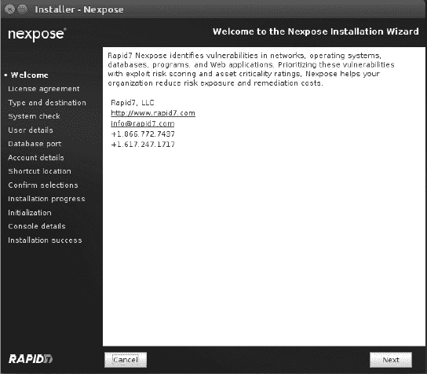
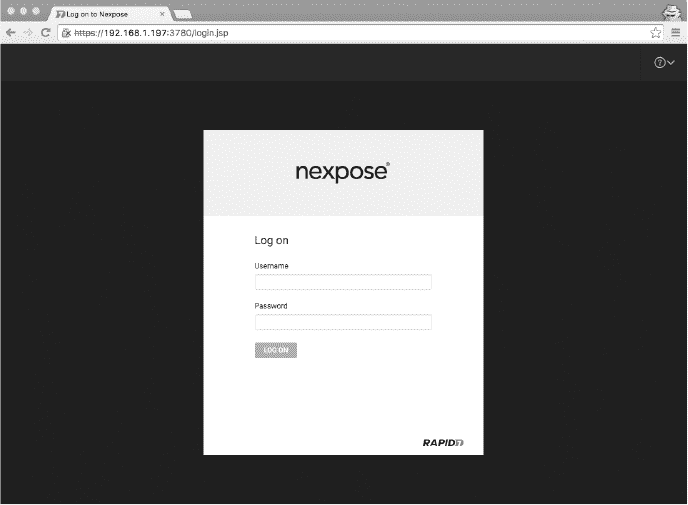
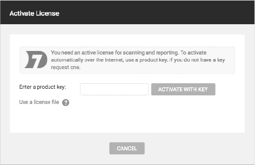
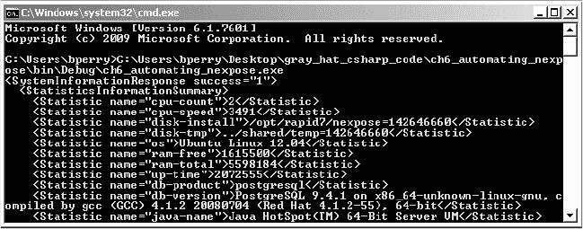

6

自动化 Nexpose

Nexpose 是一款类似于 Nessus 的漏洞扫描工具，但它针对企业级漏洞管理进行优化。这意味着它不仅帮助系统管理员找出需要修补的主机，还帮助他们随着时间的推移缓解并优先处理潜在漏洞。在本章中，我将向你展示如何使用 C# 来自动化 Rapid7 的 Nexpose 漏洞扫描工具，创建一个 Nexpose 站点、扫描该站点、生成该站点漏洞的 PDF 报告，然后删除该站点。Nexpose 的报告功能非常灵活和强大，允许你为从高管到技术管理员的各种受众自动生成报告。

就像在第五章中讨论的 Nessus 扫描器一样，Nexpose 也使用 HTTP 协议暴露其 API，但它使用 XML 格式而非 JSON 来格式化数据。如同在第五章中所述，我们将编写两个独立的类：一个与 Nexpose API 通信（会话类），另一个驱动 API（管理类）。一旦我们编写好这些类，你将学习如何运行扫描并查看结果。

安装 Nexpose

Nexpose 以各种形式和版本由 Rapid7 提供。我们将在一台全新安装的 Ubuntu 14.04 LTS 机器上使用 Rapid7 提供的 Nexpose 二进制安装程序，使用清单 6-1 中显示的命令和 URL。每当发布新版本时，URL 将会更新为最新的安装程序。如果该 URL 无法使用，您也可以在注册社区激活密钥（运行 Nexpose 所必需）后找到下载链接。下载安装程序后，我们需要设置可执行文件权限，以便之后以 root 身份运行安装程序。

> $ wget http://download2.rapid7.com/download/NeXpose-v4/NeXposeSetup-Linux64.bin
> 
> $ chmod +x ./NeXposeSetup-Linux64.bin
> 
> $ sudo ./NeXposeSetup-Linux64.bin  清单 6-1：下载并安装 Nexpose

当安装程序在图形桌面环境中运行时，例如 KDE 或 GNOME，用户将看到一个图形化的安装程序界面，用于进行初始配置，如图 6-1 所示。如果你通过基于文本的环境（如 SSH）安装 Nexpose，安装程序将通过是/否问题和其他提示信息逐步进行配置。

图 6-1：图形化的 Nexpose 安装程序

一旦安装了 Nexpose，在终端中运行 ifconfig 查看 IP 地址，然后在浏览器中输入 https://ip:3780/，将 ip 替换为运行 Nexpose 的机器的 IP 地址。你应该能看到 Nexpose 的登录页面，如图 6-2 所示。

图 6-2：Nexpose 登录页面

使用在设置过程中要求的凭据。你可能会在看到登录页面之前遇到 SSL 证书错误。因为 Nexpose 默认使用自签名的 SSL 证书，你的浏览器可能不信任它，并可能会报错。这是正常且预期的。

激活与测试

当你第一次登录时，系统应该会提示你输入在注册社区版后通过电子邮件发送给你的激活密钥，如图 6-3 所示。

图 6-3：Nexpose 中的激活弹出窗口

现在测试你的安装，确保软件已正确激活，并且可以通过发送 HTTP 请求与 Nexpose API 进行身份验证。你可以使用 curl 工具向 API 发出身份验证请求并显示响应，如清单 6-2 所示。

> $ curl -d '<LoginRequest user-id="nxadmin" password="nxpassword"/>' -X POST -k \
> 
> -H "Content-Type: text/xml" https://192.168.1.197:3780/api/1.1/xml
> 
> <LoginResponse success="1" session-id="D45FFD388D8520F5FE18CACAA66BE527C1AF5888"/>
> 
> $

清单 6-2：使用 curl 成功通过 Nexpose API 进行身份验证

如果你看到一个包含 success="1" 和会话 ID 的响应，说明 Nexpose 已正确激活，且 API 按照你的凭据正常工作。

一些 Nexpose 术语

在我们进一步讨论如何管理和报告 Nexpose 中的漏洞扫描之前，我们需要定义几个术语。当你在 Nexpose 中启动漏洞扫描时，你扫描的是一个站点，站点是相关主机或资产的集合。

Nexpose 有两种类型的站点：静态站点和动态站点。在我们的自动化过程中，我们将重点关注前者。静态站点包含一个主机列表，你只能通过重新配置站点来更改该列表。这就是为什么它被称为静态——站点不会随着时间变化。Nexpose 还支持基于资产过滤器创建站点，因此动态站点中的资产可能会根据其漏洞计数或无法认证的情况从一周到另一周发生变化。动态站点更复杂，但比静态站点更强大，是一个值得通过额外作业来熟悉的好功能。

构成站点的资产只是你网络中可以与 Nexpose 通信的连接设备。这些资产可以是裸机数据中心机架服务器、VMware ESXi 主机或 Amazon AWS 实例。如果你能通过 IP 地址 ping 通它，它就可以是你 Nexpose 站点中的资产。许多时候，将物理网络中的主机分离到 Nexpose 中的逻辑站点是有益的，这样你就可以更精细地扫描和管理漏洞。一个复杂的企业网络可能会有一个专门用于 ESXi 主机的站点，一个用于高层管理人员网络段的站点，以及一个用于客户服务呼叫中心资产的站点。

NexposeSession 类

我们将从编写 NexposeSession 类开始，来与 Nexpose API 进行通信，如 清单 6-3 所示。

> public class NexposeSession : IDisposable
> 
> {
> 
> public ➊NexposeSession(string username, string password, string host,
> 
> int port = ➋3780, NexposeAPIVersion version = ➌NexposeAPIVersion.v11)
> 
> {
> 
> this.➍Host = host;
> 
> this.Port = port;
> 
> this.APIVersion = version;
> 
> ServicePointManager.➎ServerCertificateValidationCallback = (s, cert, chain, ssl) => true;
> 
> this.➏Authenticate(username, password);
> 
> }
> 
> public string Host { get; set; }
> 
> public int Port { get; set; }
> 
> public bool IsAuthenticated { get; set; }
> 
> public string SessionID { get; set; }
> 
> public NexposeAPIVersion APIVersion { get; set; }

清单 6-3：NexposeSession 类的开始部分，包括构造函数和属性

NexposeSession 类的构造函数 ➊ 接受最多五个参数：其中三个是必需的（用户名、密码和连接的主机），两个是可选的（端口和 API 版本，默认为 3780 ➋ 和 NexposeAPIVersion.v11 ➌）。从 ➍ 开始，我们将 Host、Port 和 APIVersion 属性分别赋值为三个必需的参数。接下来，我们通过将 ServerCertificateValidationCallback 设置为始终返回 true，禁用 SSL 证书验证。这种做法违反了良好的安全原则，但由于 Nexpose 默认使用自签名证书在 HTTPS 上运行，我们禁用验证（否则，在 HTTP 请求过程中 SSL 证书验证会失败）。在 ➏，我们尝试通过调用 Authenticate() 方法进行身份验证，方法的详细代码见 清单 6-4。

> public XDocument ➊Authenticate(string username, string password)
> 
> {
> 
> XDocument cmd = new ➋XDocument(
> 
> new XElement("LoginRequest",
> 
> new XAttribute("user-id", username),
> 
> new XAttribute("password", password)));
> 
> XDocument doc = (XDocument)this.➌ExecuteCommand(cmd);
> 
> ➍if (doc.Root.Attribute("success").Value == "1")
> 
> {
> 
> ➎this.SessionID = doc.Root.Attribute("session-id").Value;
> 
> this.IsAuthenticated = true;
> 
> }
> 
> else
> 
> throw new Exception("身份验证失败");
> 
> ➏return doc;
> 
> }

清单 6-4：NexposeSession 类的 Authenticate() 方法

Authenticate() 方法 ➊ 接受用户名和密码作为参数。为了将用户名和密码发送到 API 进行身份验证，我们在 ➋ 创建一个具有根节点 LoginRequest 和 user-id、password 属性的 XDocument。我们将 XDocument 传递给 ExecuteCommand() 方法 ➌，然后存储 Nexpose 服务器返回的结果。

在 ➍，我们判断 Nexpose 的 XML 响应是否包含成功属性值 1。如果是的话，在 ➎ 我们将 SessionID 属性赋值为响应中的 session-id，并将 IsAuthenticated 设置为 true。最后，我们返回 XML 响应 ➏。

ExecuteCommand() 方法

清单 6-5 中显示的 ExecuteCommand() 方法是 NexposeSession 类的核心。

> public object ExecuteCommand(XDocument commandXml)
> 
> {
> 
> string uri = string.Empty;
> 
> switch (this.➊APIVersion)
> 
> {
> 
> case NexposeAPIVersion.v11:
> 
> uri = "/api/1.1/xml";
> 
> break;
> 
> case NexposeAPIVersion.v12:
> 
> uri = "/api/1.2/xml";
> 
> break;
> 
> default:
> 
> throw new Exception("未知的 API 版本。");
> 
> }

清单 6-5：NexposeSession 类的 ExecuteCommand()方法的开始部分

在我们能够向 Nexpose 发送数据之前，我们需要知道使用哪个版本的 API，因此在➊处我们使用一个 switch/case 块（类似于一系列 if 语句）来测试 APIVersion 的值。例如，NexposeAPIVersion.v11 或 NexposeAPIVersion.v12 的值将告诉我们需要使用版本 1.1 或 1.2 的 API URI。

向 Nexpose API 发出 HTTP 请求

在确定了要发送 API 请求的 URI 之后，我们现在可以将 XML 请求数据发送到 Nexpose，如清单 6-6 所示。

> byte[] byteArray = Encoding.ASCII.GetBytes(commandXml.ToString());
> 
> ➊ HttpWebRequest request = WebRequest.Create("https://" + this.Host
> 
> + ":" + this.Port.ToString() + uri) as HttpWebRequest;
> 
> request.Method = ➋"POST";
> 
> request.ContentType = ➌"text/xml";
> 
> request.ContentLength = byteArray.Length;
> 
> using (Stream dataStream = request.GetRequestStream())
> 
> dataStream.➍Write(byteArray, 0, byteArray.Length); 清单 6-6：在 ExecuteCommand()中通过 HTTP 发送 XML 命令给 Nexpose

与 Nexpose 的 HTTP API 通信分为两个部分。首先，Nexpose 使用 XML 发出 API 请求，XML 会告诉 Nexpose 我们要执行的命令；然后，它读取 API 请求的响应结果。为了实际向 Nexpose API 发出 HTTP 请求，我们创建一个 HttpWebRequest ➊并将其 Method 属性设置为 POST ➋，ContentType 属性设置为 text/xml ➌，ContentLength 属性设置为我们 XML 的长度。接下来，我们将 API XML 命令字节写入 HTTP 请求流，并通过 Write() ➍方法将流发送到 Nexpose。Nexpose 将解析 XML，确定要执行的操作，然后在响应中返回结果。

> > Mono 中的 TLS
> > 
> > 截至本文写作时，Mono 中的 TLS 状态仍在变化中。虽然 TLS v1.1 和 v1.2 的支持已编写完成，但目前默认并未启用。因此，HTTP 库可能无法发出 HTTPS 请求，并且只会输出一条关于身份验证失败的模糊异常。如果发生这种情况，那是因为 Nexpose 只允许 TLS v1.1 或 v1.2 连接，而 Mono 只能支持 v1.0。为了解决这个问题，您只需要添加一行代码，强制 Mono 通过 Burp Suite 代理进行测试，这是我们在第二章中使用的工具。
> > 
> > 为了实现这一点，我们可以将清单 6-6 中的代码修改为清单 6-7 中的以下代码。
> > 
> > request.Method = "POST";
> > 
> > request.Proxy = new ➊WebProxy("127.0.0.1:8080");
> > 
> > request.ContentType = "text/xml"; 清单 6-7：为 TLS 设置代理
> > 
> > 我们添加了一行代码来设置请求的代理属性，以便它指向一个正在监听的 Burp Suite 代理 ➊。Burp Suite 将愉快地为我们的 Mono 客户端协商一个 TLS v1.0 连接，并为 Nexpose 服务器协商一个 TLS v1.1/1.2 连接。当 TLS 问题得到解决——希望是在不久的将来——本书中的代码应该可以跨平台工作，而不需要这种绕过方法。

读取来自 Nexpose API 的 HTTP 响应

接下来，我们需要读取刚刚发出的 API 请求的 HTTP 响应。第 6-8 节 展示了如何通过读取 Nexpose 的 HTTP 响应来完成 ExecuteCommand() 方法，然后根据 HTTP 响应的内容类型返回 XDocument 或原始字节数组。在 第 6-8 节 完成 ExecuteCommand() 方法后，我们就能够发出 API 请求并根据响应的内容类型返回正确的响应数据。

> string response = string.Empty;
> 
> using (HttpWebResponse r = request.➊GetResponse() as HttpWebResponse)
> 
> {
> 
> using (StreamReader reader = new ➋StreamReader(r.GetResponseStream()))
> 
> response = reader.➌ReadToEnd();
> 
> if (r.ContentType.Contains(➍"multipart/mixed"))
> 
> {
> 
> string[] splitResponse = response
> 
> .Split(new string[] {➎"--AxB9sl3299asdjvbA"}, StringSplitOptions.None);
> 
> splitResponse = splitResponse[2]
> 
> .Split(new string[] { ➏"\r\n\r\n" }, StringSplitOptions.None);
> 
> string base64Data = splitResponse[1];
> 
> return ➐Convert.FromBase64String(base64Data);
> 
> }
> 
> }
> 
> return XDocument.Parse(response);
> 
> }

第 6-8 节：NexposeSession 类的 ExecuteCommand() 方法的最后部分

通常，当你向 Nexpose 发送一个 XML 命令时，你会收到一个 XML 响应。但是当你请求一个漏洞扫描报告时，比如我们在执行漏洞扫描后请求的 PDF 报告，你会收到 HTTP 响应 multipart/mixed 而不是 application/xml。Nexpose 为什么根据 PDF 报告更改 HTTP 响应尚不明确，但因为我们的请求可能会返回一个包含 Base64 编码报告或 XDocument（我们在第三章 中首次使用的 XML 文档类）的响应，我们需要能够处理这两种类型的响应。

为了开始读取来自 Nexpose 的 HTTP 响应，我们调用 GetResponse() ➊ 以便读取 HTTP 响应流；然后我们创建一个 StreamReader ➋ 来将响应数据读取到字符串 ➌ 中，并检查其内容类型。如果响应类型是 multipart/mixed ➍，我们将响应分解为一个字符串数组，以便利用 Nexpose 的 multipart/mixed 响应总是使用字符串 --AxB9sl3299asdjvbA ➎ 来分隔 HTTP 响应中的参数这一特点来解析报告数据。

在 HTTP 响应被拆分后，结果字符串数组中的第三个元素将始终包含来自扫描的 Base64 编码报告数据。在➏处，我们使用两个换行序列（\r\n\r\n）来分隔出报告数据。现在我们可以仅引用 Base64 编码的数据，但首先我们必须从 Base64 编码的报告末尾删除一些无效数据。最后，我们将 Base64 编码的数据传递给 Convert.FromBase64String()➐，它返回一个 Base64 解码数据的字节数组，该数据可以被写入文件系统作为最终的 PDF 报告，供稍后阅读。

注销并清理会话

第 6-9 节展示了 Logout()和 Dispose()方法，它们将使我们能够轻松地注销会话并清理会话数据。

> public XDocument ➊Logout()
> 
> {
> 
> XDocument cmd = new ➋XDocument(
> 
> new XElement(➌"LogoutRequest",
> 
> new XAttribute(➍"session-id", this.SessionID)));
> 
> XDocument doc = (XDocument)this.ExecuteCommand(cmd);
> 
> this.➎IsAuthenticated = false;
> 
> this.SessionID = string.Empty;
> 
> return doc;
> 
> }
> 
> public void ➏Dispose()
> 
> {
> 
> if (this.➐IsAuthenticated)
> 
> this.Logout();
> 
> }

第 6-9 节：NexposeSession 类的 Dispose()和 Logout()方法

在 Logout()方法➊中，我们构建了一个 XDocument➋，其中根节点为 LogoutRequest➌，并带有 session-id 属性➍。当我们将此信息作为 XML 发送给 Nexpose 时，它将尝试使会话 ID 令牌失效，从而有效地将我们注销。同时，我们将 IsAuthenticated➎设置为 false，并将 SessionID 设置为 string.Empty 以清理旧的身份验证信息；然后返回注销响应的 XML。

我们将使用 Dispose()方法➏（由 IDisposable 接口要求）来清理 Nexpose 会话。如你所见，在➐，我们检查是否已通过身份验证，如果是，则调用 Logout()来使会话失效。

查找 API 版本

第 6-10 节展示了我们如何使用 NexposeAPIVersion 来确定使用哪个 Nexpose API 版本。

> public enum NexposeAPIVersion
> 
> {
> 
> v11,
> 
> v12
> 
> }

第 6-10 节：在 NexposeSession 类中使用的 NexposeAPIVersion 枚举

代码枚举 NexposeAPIVersion 为我们提供了一种简单的方法来确定应该向哪个 API URI 发起 HTTP 请求。在第 6-5 节中，我们正是通过 NexposeAPIVersion 来构建 API URI 并在 ExecuteCommand()中使用它。

驱动 Nexpose API

第 6-11 节展示了我们如何使用 NexposeSession 与 Nexpose API 通信，进行身份验证并打印 SessionID。这是一个很好的测试，可以确保我们迄今为止编写的代码按预期工作。

> class MainClass
> 
> {
> 
> public static void Main(string[] args)
> 
> {
> 
> 使用(NexposeSession session = new ➊NexposeSession("admin", "adm1n!", "192.168.2.171"))
> 
> {
> 
> Console.WriteLine(session.SessionID);
> 
> }
> 
> }
> 
> }

第 6-11 节：使用 NexposeSession 进行身份验证并打印 SessionID

在 ➊ 处，我们尝试通过将 Nexpose 服务器的用户名、密码和 IP 地址传递给一个新的 NexposeSession 来进行身份验证。如果身份验证成功，我们将在屏幕上显示分配给会话的 SessionID。如果身份验证失败，我们抛出一个包含“身份验证失败”消息的异常。

NexposeManager 类

如 Listing 6-12 所示的 NexposeManager 类允许我们创建、监视并报告扫描结果。我们从一个简单的 API 调用开始。

> public class NexposeManager : ➊IDisposable
> 
> {
> 
> private readonly NexposeSession _session;
> 
> public NexposeManager(➋NexposeSession session)
> 
> {
> 
> if (!session.➌IsAuthenticated)
> 
> throw new ➍ArgumentException("尝试从 "
> 
> + "未经身份验证的会话。请进行身份验证。", "session");
> 
> _session = session;
> 
> }
> 
> public XDocument ➎GetSystemInformation()
> 
> {
> 
> XDocument xml = new XDocument(
> 
> new XElement("➏SystemInformationRequest",
> 
> new XAttribute("session-id", _session.SessionID)));
> 
> ➐return (XDocument)_session.ExecuteCommand(xml);
> 
> }
> 
> public void ➑Dispose()
> 
> {
> 
> _session.Logout();
> 
> }
> 
> }

Listing 6-12：带有 GetSystemInformation() 方法的 NexposeManager 类

因为 NexposeManager 实现了 IDisposable ➊，我们通过声明 _session 来编写 Dispose() 方法，_session 保存 NexposeManager 将使用的 NexposeSession 类，并将 NexposeSession ➋ 作为唯一参数传递。如果 Nexpose 会话身份验证成功 ➌，我们将 _session 赋值为 session。如果不成功，我们抛出一个异常 ➍。

为了最初测试管理器类，我们将实现一个简短而简单的 API 方法，用于检索 Nexpose 控制台的一些基本系统信息。GetSystemInformation() 方法 ➎ 发出一个简单的 SystemInformationRequest API 请求 ➏，然后返回响应 ➐。

为了打印 Nexpose 系统信息（包括版本信息，例如正在使用的 PostgreSQL 和 Java 版本，以及硬件信息，例如 CPU 数量和可用内存），我们将 NexposeManager 添加到我们的 Main() 方法中，参考 Listing 6-11，如 Listing 6-13 所示。

> public static void Main(string[] args)
> 
> {
> 
> using (NexposeSession session = new NexposeSession("admin", "Passw0rd!", "192.168.2.171"))
> 
> {
> 
> using (NexposeManager manager = new ➊NexposeManager(session))
> 
> {
> 
> Console.WriteLine(manager.➋GetSystemInformation().ToString());
> 
> }
> 
> }
> 
> }

Listing 6-13：在 Main() 方法中使用 NexposeManager 类

我们将 NexposeSession 类传递给 NexposeManager 构造函数 ➊，然后调用 GetSystemInformation() ➋ 来打印系统信息，如 图 6-4 所示。

图 6-4：通过 API 获取 Nexpose 系统信息

自动化漏洞扫描

在本节中，我们最后看一下如何使用 Nexpose 自动化漏洞扫描。我们创建一个 Nexpose 站点，扫描该站点，然后下载扫描结果报告。我们仅触及 Nexpose 强大扫描功能的表面。

创建带资产的网站

在启动 Nexpose 扫描之前，我们需要创建一个要扫描的网站。列表 6-14 显示了我们如何在 CreateOrUpdateSite()方法中构建创建网站的 XML API 请求。

> public XDocument ➊CreateOrUpdateSite(string name, string[] hostnames = null,
> 
> string[][] ips = null, int siteID = ➋-1)
> 
> {
> 
> XElement hosts = new ➌XElement("Hosts");
> 
> if (➍hostnames != null)
> 
> {
> 
> foreach (string host in hostnames)
> 
> hosts.Add(new XElement("host", host));
> 
> }
> 
> if (➎ips != null)
> 
> {
> 
> foreach (string[] range in ips)
> 
> {
> 
> hosts.Add(new XElement ("range",
> 
> new XAttribute("from", range[0]),
> 
> new XAttribute("to", range[1])));
> 
> }
> 
> }
> 
> XDocument xml = ➏new XDocument(
> 
> new XElement("SiteSaveRequest",
> 
> new XAttribute("session-id", _session.SessionID),
> 
> new XElement("Site",
> 
> new XAttribute("id", siteID),
> 
> new XAttribute("name", name),
> 
> ➐hosts,
> 
> new XElement("ScanConfig",
> 
> new XAttribute("name", "Full audit"),
> 
> new XAttribute(➑"templateID", "full-audit")))));
> 
> return (XDocument)_session.➒ExecuteCommand(xml);
> 
> }

列表 6-14：NexposeManager 类中的 CreateOrUpdateSite()方法

CreateOrUpdateSite()方法➊最多接受四个参数：可读的人类网站名称、任何主机名和 IP 范围以及网站 ID。传递-1➋作为网站 ID，如此所示，创建一个新的网站。在➌，我们创建了一个名为 Hosts 的 XML 元素，如果 hostnames 参数不为 null➍，我们将其添加到 Hosts 中。我们对传递的任何 IP 范围➎做同样的处理。

接下来，我们创建一个 XDocument ➏，其中根 XML 节点为 SiteSaveRequest，并包含一个 session-id 属性，用于告诉 Nexpose 服务器我们已经通过身份验证并可以进行此 API 调用。在根节点内，我们创建一个名为 Site 的 XElement 来保存新网站的具体信息和扫描配置详情，如要扫描的主机➐和扫描模板 ID➑。在➒时，我们将 SiteSaveRequest 传递给 ExecuteCommand()，并将 ExecuteCommand()返回的对象强制转换为 XDocument。

开始扫描

列表 6-15 显示了如何使用 ScanSite()和 GetScanStatus()方法开始网站扫描并获取其状态。希望你能开始看到，当 NexposeSession 类处理所有通信，而你只需要设置 API 请求的 XML 时，在 Manager 类中实现新的 API 功能是多么容易。

> public XDocument ➊ScanSite(int ➋siteID)
> 
> {
> 
> XDocument xml = ➌new XDocument(
> 
> new XElement(➍"SiteScanRequest",
> 
> new XAttribute("session-id", _session.SessionID),
> 
> new XAttribute("site-id", siteID)));
> 
> return (XDocument)_session.ExecuteCommand(xml);
> 
> }
> 
> public XDocument ➎GetScanStatus(int scanID)
> 
> {
> 
> XDocument xml = ➏new XDocument(
> 
> new XElement("ScanStatusRequest",
> 
> new XAttribute("session-id", _session.SessionID),
> 
> new XAttribute("scan-id", scanID)));
> 
> return (XDocument)_session.ExecuteCommand (xml);
> 
> }

列表 6-15：NexposeManager 类中的 ScanSite()和 GetScanStatus()方法

ScanSite() 方法 ➊ 接受 siteID ➋ 作为扫描参数。我们创建一个 XDocument ➌，根节点为 SiteScanRequest ➍，然后为其添加 session-id 和 site-id 属性。接着，我们将 SiteScanRequest XML 发送到 Nexpose 服务器并返回响应。

GetScanStatus() 方法 ➎ 接受一个参数，检查扫描 ID，这是 ScanSite() 方法返回的。创建一个新的 XDocument ➏，根节点为 ScanStatusRequest，添加 session-id 和 scan-id 属性后，我们将生成的 XDocument 发送到 Nexpose 服务器，并将响应返回给调用者。

创建 PDF 站点报告并删除站点

Listing 6-16 显示了我们如何使用 GetPdfSiteReport() 和 DeleteSite() 方法通过 API 创建扫描报告并删除站点。

> public byte[] GetPdfSiteReport(int siteID)
> 
> {
> 
> XDocument doc = new XDocument(
> 
> new XElement(➊"ReportAdhocGenerateRequest",
> 
> new XAttribute("session-id", _session.SessionID),
> 
> new XElement("AdhocReportConfig",
> 
> new XAttribute("template-id", "audit-report"),
> 
> new XAttribute("format", ➋"pdf"),
> 
> new XElement("Filters",
> 
> new XElement("filter",
> 
> new XAttribute("type", "site"),
> 
> new XAttribute("id", ➌siteID))))));
> 
> return (➍byte[])_session.ExecuteCommand(doc);
> 
> }
> 
> public XDocument ➎DeleteSite(int siteID)
> 
> {
> 
> XDocument xml = new XDocument(
> 
> new XElement(➏"SiteDeleteRequest",
> 
> new XAttribute("session-id", _session.SessionID),
> 
> new XAttribute("site-id", siteID)));
> 
> ➐ return (XDocument)_session.ExecuteCommand(xml);
> 
> }

Listing 6-16：NexposeManager 类中的 GetPdfSiteReport() 和 DeleteSite() 方法

两个方法都只接受一个参数，即站点 ID。为了生成 PDF 报告，我们使用 ReportAdHocGenerateRequest ➊ 并指定 pdf ➋ 和 siteID ➌。我们将 ExecuteCommand() 返回的对象转换为字节数组 ➍，而不是 XDocument，因为 Nexpose 会为 ReportAdHocGenerateRequest 返回一个 multipart/mixed 的 HTTP 响应。我们返回 PDF 报告的原始字节流，供调用方法使用。

我们使用 DeleteSite() ➎ 删除站点，创建一个 SiteDeleteRequest XDocument ➏，然后调用 API 并返回结果 ➐。

综合起来

现在你已经知道如何通过编程操作 Nexpose，接下来让我们创建一个新的 Nexpose 站点，扫描它，生成其漏洞的 PDF 报告，并删除该站点。Listing 6-17 通过创建一个新站点并通过我们两个新类获取其 ID 来开始这一过程。

> public static void Main(string[] args)
> 
> {
> 
> using (NexposeSession session = new ➊NexposeSession("admin", "adm1n!", "192.168.2.171"))
> 
> {
> 
> using (NexposeManager manager = new ➋NexposeManager(session))
> 
> {
> 
> ➌string[][] ips =
> 
> {
> 
> new string[] { "192.168.2.169", ➍string.Empty }
> 
> };
> 
> XDocument site = manager.➎CreateOrUpdateSite(➏Guid.NewGuid().ToString(), null, ips);
> 
> int siteID = int.Parse(site.Root.Attribute("site-id").Value); Listing 6-17：创建临时站点并获取站点 ID

在创建 NexposeSession ➊ 和 NexposeManager ➋ 对象之后，我们将要扫描的 IP 地址列表作为字符串 ➌ 传入，包含起始地址和结束地址。要扫描单个 IP，请使用空字符串作为第二个元素，如 ➍ 所示。我们将目标 IP 列表与一个 Guid ➏ 作为临时站点名称一起传递给 CreateOrUpdateSite() ➎。（我们只需要一个唯一的字符串作为站点名称。）当我们收到来自 Nexpose 创建临时站点的 HTTP 响应时，我们从 XML 中提取站点 ID 并存储它。

启动扫描

清单 6-18 展示了如何通过基本上保持在一个 while 循环中并等待扫描完成来运行和监控漏洞扫描。

> XDocument scan = manager.➊ScanSite(siteID);
> 
> XElement ele = scan.XPathSelectElement("//SiteScanResponse/Scan");
> 
> int scanID = int.Parse(ele.Attribute("scan-id").Value);
> 
> XDocument status = manager.➋GetScanStatus(scanID);
> 
> while (status.Root.Attribute("status").Value != ➌"finished")
> 
> {
> 
> Thread.Sleep(1000);
> 
> status = manager.GetScanStatus(scanID);
> 
> Console.➍WriteLine(DateTime.Now.ToLongTimeString()+": "+status.ToString());
> 
> }

清单 6-18：启动和监控 Nexpose 扫描

我们通过将站点 ID 传递给 ScanSite() ➊ 来开始扫描，然后从响应中获取扫描 ID，并将其传递给 GetScanStatus() ➋。接下来，在一个 while 循环中，我们每隔几秒钟检查一次扫描状态，只要扫描状态还没有完成 ➌。然后，我们再次检查扫描状态，并使用 WriteLine() ➍ 向用户显示状态消息。

生成报告并删除站点

一旦扫描完成，我们就可以生成报告并删除站点，如 清单 6-19 所示。

> byte[] report = manager.➊GetPdfSiteReport(siteID);
> 
> string outdir = Environment.GetFolderPath(Environment.SpecialFolder.DesktopDirectory);
> 
> string outpath = Path.Combine(outdir, ➋siteID + ".pdf");
> 
> File.➌WriteAllBytes(outpath, report);
> 
> manager.➍DeleteSite(siteID);
> 
> }
> 
> }
> 
> }

清单 6-19：检索 Nexpose 网站报告，将其写入文件系统，然后删除该网站

为了生成报告，我们将站点 ID 传递给 GetPdfSiteReport() ➊，它返回一个字节数组。然后，我们使用 WriteAllBytes() ➌ 将 PDF 报告保存在用户的桌面目录中，文件名为站点的 ID ➋ 并加上 .pdf 后缀。然后我们使用 DeleteSite() ➍ 删除该站点。

运行自动化

清单 6-20 展示了如何运行扫描并查看其报告。

> C:\Users\example\Documents\ch6\bin\Debug>.\06_automating_nexpose.exe
> 
> 11:42:24 PM: <ScanStatusResponse success="1" scan-id="4" engine-id="3" status=➊"running" />
> 
> --snip--
> 
> 11:47:01 PM: <ScanStatusResponse success="1" scan-id="4" engine-id="3" status="running" />
> 
> 11:47:08 PM: <ScanStatusResponse success="1" scan-id="4" engine-id="3" status=➋"integrating" />
> 
> 11:47:15 PM: <ScanStatusResponse success="1" scan-id="4" engine-id="3" status=➌"finished" />
> 
> C:\Users\example\Documents\ch6\bin\Debug>dir \Users\example\Desktop\*.pdf
> 
> C 盘的卷为 Acer
> 
> 卷序列号是 5619-09A2
> 
> 目录 C:\Users\example\Desktop
> 
> 07/30/2017 11:47 PM 103,174 4.pdf ➍
> 
> 09/09/2015 09:52 PM 17,152,368 Automate the Boring Stuff with Python.pdf
> 
> 2 个文件 17,255,542 字节
> 
> 0 个目录 362,552,098,816 字节可用
> 
> C:\Users\example\Documents\ch6\bin\Debug> 示例 6-20：运行扫描并将报告写入用户的桌面

请注意，在示例 6-20 的输出中，Nexpose 至少返回了三种扫描状态，它们是扫描的不同阶段：运行中 ➊、集成中 ➋ 和完成 ➌。扫描完成后，我们的 PDF 报告将写入用户的桌面 ➍，如预期的那样。你可以用你喜欢的 PDF 阅读器打开这份新报告，看看 Nexpose 可能发现了哪些漏洞。

结论

在本章中，你学习了如何使用漏洞扫描器 Nexpose 来报告网络上给定主机的漏洞。你还了解了 Nexpose 如何存储关于网络中计算机的信息，例如站点和资产。你构建了一些类，以便使用基础的 C# 库通过编程方式驱动 Nexpose，并学习了如何使用 NexposeSession 进行身份验证，向 Nexpose 发送和接收 XML 数据。你还看到了 NexposeManager 类如何封装 API 中的功能，包括创建和删除站点的能力。最后，你能够驱动 Nexpose 扫描网络资产，然后创建一个漂亮的 PDF 报告，展示扫描结果。

Nexpose 的功能远远超出了简单的漏洞管理。扩展你的库以覆盖这些高级功能应该相对简单，并且是一个熟悉 Nexpose 提供的其他强大功能的绝佳方式，例如自定义扫描策略、认证漏洞扫描和更多可定制的报告。一个先进、现代、成熟的企业网络需要细粒度的系统控制，使组织能够将安全集成到业务工作流中。Nexpose 提供了这一切，是作为 IT 管理员或系统管理员必备的强大工具。
