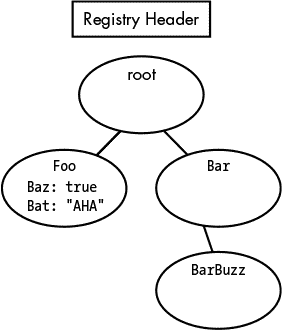

14

离线读取注册表 Hive

Windows NT 注册表是一个金矿，里面包含了很多有用的数据，比如补丁级别和密码哈希。而这些信息不仅对那些希望利用网络漏洞的渗透测试者有用，对任何从事信息安全事件响应或数据取证的人员也同样有价值。

举个例子，假设你拿到了一台被入侵的计算机的硬盘，并且你需要找出发生了什么事情。你该怎么做？无论 Windows 是否能正常运行，从硬盘中读取关键信息都是至关重要的。Windows 注册表实际上是磁盘上一组文件，称为注册表 Hive，学会如何浏览注册表 Hive 能让你更好地利用这些包含大量有用信息的 Hive。注册表 Hive 也是解析二进制文件格式的一个很好的入门，二进制文件格式是为了计算机高效存储数据而设计的，但对人类来说并不太友好。

在本章中，我们将讨论 Windows NT 注册表 Hive 数据结构，并编写一个包含几个类的小型库来读取离线 Hive，从中提取有用信息，比如启动键。如果你以后想从注册表中提取密码哈希，这将非常有用。

注册表 Hive 结构

高级别来看，注册表 Hive 是一个节点树。每个节点可能有键/值对，并且可能有子节点。我们将使用节点键和值键这两个术语来分类注册表 Hive 中的两种数据类型，并为这两种键类型创建类。节点键包含有关树结构及其子键的信息，而值键保存应用程序访问的值信息。从视觉效果来看，树的形态有点像图 14-1。

图 14-1：一个简单的注册表树的可视化表示，展示了节点、键和值

每个节点键都有一些特定的元数据与之一起存储，例如最后一次修改其值键的时间和其他系统级信息。所有这些数据都为计算机读取进行了高效存储——但对人类来说并不友好。在实现我们的库时，我们会跳过一些元数据，以便使最终结果更简洁，但我会在过程中指出这些实例。

如你在图 14-1 中看到的，注册表头之后，节点树以根节点键开始。根节点键有两个子节点，在这个示例中我们称它们为 Foo 和 Bar。Foo 节点键包含两个值键，分别是 Baz 和 Bat，其值分别为 true 和 "AHA"。而 Bar 则只有子节点 BarBuzz，且只有一个值键。这个注册表 Hive 树的示例非常简单且人为构造。你机器上的注册表 Hive 要复杂得多，可能包含数百万个键！

获取注册表 Hive

在正常操作期间，Windows 会锁定注册表蜂巢以防止篡改。修改 Windows 注册表可能会带来灾难性后果，比如计算机无法启动，因此这并不是一项可以轻视的操作。然而，如果你具有管理员权限，可以使用 cmd.exe 导出指定的注册表蜂巢。Windows 随附有 reg.exe，这是一个有用的命令行工具，用于读取和写入注册表。我们可以使用这个工具来复制我们感兴趣的注册表蜂巢，以便离线读取，如 Listing 14-1 所示。这将防止任何意外灾难的发生。

> Microsoft Windows [版本 6.1.7601]
> 
> 版权所有 (c) 2009 Microsoft Corporation。保留所有权利。
> 
> C:\Windows\system32>reg ➊save HKLM\System C:\system.hive
> 
> 操作成功完成。

Listing 14-1：使用 reg.exe 复制注册表蜂巢

使用保存子命令 ➊，我们指定要保存的注册表路径以及保存到的文件。第一个参数是 HKLM\System 路径，它是系统注册表蜂巢的根节点（其中包含如启动密钥等信息）。通过选择这个注册表路径，我们可以将系统的注册表蜂巢保存到机器外部，以便以后进行进一步分析。同样的技术可以用于 HKLM\Sam（存储用户名和哈希值）和 HKLM\Software（存储补丁级别和其他软件信息）。但请记住，保存这些节点需要管理员权限！

如果你有一个可以挂载到机器上的硬盘，另一个获取注册表蜂巢的方法是直接从 System32 文件夹中复制注册表蜂巢，操作系统将原始蜂巢存储在该文件夹中。如果 Windows 没有运行，注册表蜂巢不会被锁定，你应该能够将它们复制到其他系统中。你可以在目录 C:\Windows\System32\config 中找到操作系统当前使用的原始蜂巢（参见 Listing 14-2）。

> Microsoft Windows [版本 6.1.7601]
> 
> 版权所有 (c) 2009 Microsoft Corporation。保留所有权利。
> 
> C:\Windows\system32>cd config
> 
> C:\Windows\System32\config>dir
> 
> C: 驱动器的卷标是 BOOTCAMP
> 
> 卷序列号为 B299-CCD5
> 
> C:\Windows\System32\config 目录
> 
> 01/24/2016 02:17 PM <DIR> .
> 
> 01/24/2016 02:17 PM <DIR> ..
> 
> 05/23/2014 03:19 AM 28,672 BCD-Template
> 
> 01/24/2016 02:24 PM 60,555,264 COMPONENTS
> 
> 01/24/2016 02:24 PM 4,456,448 DEFAULT
> 
> 07/13/2009 08:34 PM <DIR> Journal
> 
> 09/21/2015 05:56 PM 42,909,696 prl_boot
> 
> 01/19/2016 12:17 AM <DIR> RegBack
> 
> 01/24/2016 02:13 PM 262,144 SAM
> 
> 01/24/2016 02:24 PM 262,144 SECURITY ➊
> 
> 01/24/2016 02:36 PM 115,867,648 SOFTWARE ➋
> 
> 01/24/2016 02:33 PM 15,728,640 SYSTEM ➌
> 
> 06/22/2014 06:13 PM <DIR> systemprofile
> 
> 05/24/2014 10:45 AM <DIR> TxR
> 
> 8 个文件 240,070,656 字节
> 
> 6 个目录 332,737,015,808 字节可用
> 
> C:\Windows\System32\config>

Listing 14-2：C:\Windows\System32\config 文件夹中的注册表蜂巢内容

列表 14-2 显示了目录中的注册表蜂巢。SECURITY ➊、SOFTWARE ➋ 和 SYSTEM ➌ 是包含最常查找信息的蜂巢。一旦蜂巢文件复制到你的系统上，如果你使用的是 Linux 或 OS X，你可以轻松验证你保存了想要读取的注册表蜂巢，方法是使用文件命令，正如 列表 14-3 所示。

> $ 文件系统.hive
> 
> system.hive：MS Windows 注册表文件，NT/2000 或更高版本
> 
> $

列表 14-3：确认你在 Linux 或 OS X 中保存了哪个注册表蜂巢

现在我们准备开始分析注册表文件了。

读取注册表蜂巢

我们将从读取注册表蜂巢头开始，它是位于注册表蜂巢开头的 4,096 字节数据块。别担心，实际上只有前 20 字节左右对于解析是有用的，我们将只读取前四个字节来验证文件是否为注册表蜂巢。剩余的 4,000 多字节只是缓冲区。

创建一个类来解析注册表蜂巢文件

我们将创建一个新的类来开始解析文件：RegistryHive 类。这是我们为读取离线注册表蜂巢实现的几个简单类之一。它只有一个构造函数和一些属性，如 列表 14-4 所示。

> public class RegistryHive
> 
> {
> 
> public ➊RegistryHive(string file)
> 
> {
> 
> if (!➋File.Exists(file))
> 
> throw new FileNotFoundException();
> 
> this.Filepath = file;
> 
> using (FileStream stream = ➌File.OpenRead(file))
> 
> {
> 
> using (BinaryReader reader = new ➍BinaryReader(stream))
> 
> {
> 
> byte[] buf = reader.ReadBytes(4);
> 
> if ➎(buf[0] != 'r' || buf[1] != 'e' || buf[2] != 'g' || buf[3] != 'f')
> 
> throw new NotSupportedException("文件不是注册表蜂巢。");
> 
> //快进
> 
> ➏reader.BaseStream.Position = 4096 + 32 + 4;
> 
> this.RootKey = new ➐NodeKey(reader);
> 
> }
> 
> }
> 
> }
> 
> public string Filepath { get; set; }
> 
> public NodeKey RootKey { get; set; }
> 
> public bool WasExported { get; set; }
> 
> }

列表 14-4：RegistryHive 类

让我们看看构造函数，魔术就在这里开始。构造函数 ➊ 接受一个参数，即文件系统中离线注册表蜂巢的文件路径。我们使用 File.Exists() ➋ 检查路径是否存在，如果不存在就抛出异常。

一旦我们确定文件存在，我们需要确保它是一个注册表文件。但这并不难。任何注册表蜂巢的前四个魔术字节应该是 r、e、g 和 f。为了检查我们的文件是否匹配，我们使用 File.OpenRead() ➌ 打开一个流来读取文件。然后，我们通过将文件流传递给 BinaryReader 构造函数 ➍ 来创建一个新的 BinaryReader。我们用它来读取文件的前四个字节，并将它们存储在一个字节数组中。然后，我们检查它们是否匹配 ➎。如果不匹配，我们就抛出一个异常：蜂巢文件要么损坏得无法正常读取，要么根本就不是一个蜂巢文件！

如果头部检查通过，那么我们快速前进到➏注册表头部块的末尾，找到根节点键（跳过我们此时不需要的一些元数据）。在下一节中，我们将创建一个 NodeKey 类来处理我们的节点键，这样我们就可以通过将 BinaryReader 传递给 NodeKey 构造函数➐来读取该键，并将新的 NodeKey 分配给 RootKey 属性以供以后使用。

创建 NodeKey 类

NodeKey 类是我们需要实现的最复杂的类，用于读取离线注册表 hive。注册表 hive 中存储了一些节点键的元数据，我们可以跳过其中的一些，但有很多是我们无法跳过的。然而，NodeKey 类的构造函数相当简单，尽管它有很多属性，如 Listing 14-5 所示。

> public class NodeKey
> 
> {
> 
> public ➊NodeKey(BinaryReader hive)
> 
> {
> 
> ReadNodeStructure(hive);
> 
> ReadChildrenNodes(hive);
> 
> ReadChildValues(hive);
> 
> }
> 
> public List<NodeKey> ➋ChildNodes { get; set; }
> 
> public List<ValueKey> ➌ChildValues { get; set; }
> 
> public DateTime ➍Timestamp { get; set; }
> 
> public int ParentOffset { get; set; }
> 
> public int SubkeysCount { get; set; }
> 
> public int LFRecordOffset { get; set; }
> 
> public int ClassnameOffset { get; set; }
> 
> public int SecurityKeyOffset { get; set; }
> 
> public int ValuesCount { get; set; }
> 
> public int ValueListOffset { get; set; }
> 
> public short NameLength { get; set; }
> 
> public bool IsRootKey { get; set; }
> 
> public short ClassnameLength { get; set; }
> 
> public string Name { get; set; }
> 
> public byte[] ClassnameData { get; set; }
> 
> public NodeKey ParentNodeKey { get; set; }

Listing 14-5: NodeKey 类的构造函数和属性

NodeKey 类的构造函数➊接收一个参数，即注册表 hive 的 BinaryReader。构造函数调用三个方法来读取和解析节点的特定部分，我们将在接下来的部分实现这些方法。在构造函数之后，我们定义了几个将在接下来的三个方法中使用的属性。前三个属性特别有用：ChildNodes ➋、ChildValues ➌和 Timestamp ➍。

NodeKey 构造函数中调用的第一个方法是 ReadNodeStructure()，该方法从注册表 hive 读取节点键数据，但不包括其子节点或值。详细内容请参见 Listing 14-6。

> private void ReadNodeStructure(BinaryReader hive)
> 
> {
> 
> byte[] buf = hive.➊ReadBytes(4);
> 
> if (buf[0] != 0x6e || buf[1] != 0x6b) //nk
> 
> throw new NotSupportedException("无效的 nk 头部");
> 
> long startingOffset = ➋hive.BaseStream.Position;
> 
> this.➌IsRootKey = (buf[2] == 0x2c) ? true : false;
> 
> this.➍Timestamp = DateTime.FromFileTime(hive.ReadInt64());
> 
> hive.BaseStream.Position += ➎4; //跳过元数据
> 
> this.ParentOffset = hive.➏ReadInt32();
> 
> this.SubkeysCount = hive.ReadInt32();
> 
> hive.BaseStream.Position += 4; //跳过元数据
> 
> this.LFRecordOffset = hive.ReadInt32();
> 
> hive.BaseStream.Position += 4; //跳过元数据
> 
> this.ValuesCount = hive.ReadInt32();
> 
> this.ValueListOffset = hive.ReadInt32();
> 
> this.SecurityKeyOffset = hive.ReadInt32();
> 
> this.ClassnameOffset = hive.ReadInt32();
> 
> hive.BaseStream.Position = startingOffset + 68;
> 
> this.NameLength = hive.➐ReadInt16();
> 
> this.ClassnameLength = hive.ReadInt16();
> 
> buf = hive.➑ReadBytes(this.NameLength);
> 
> this.Name = System.Text.Encoding.UTF8.GetString(buf);
> 
> hive.BaseStream.Position = this.ClassnameOffset + 4 + 4096;
> 
> this.➒ClassnameData = hive.ReadBytes(this.ClassnameLength);
> 
> }

列表 14-6：NodeKey 类的 ReadNodeStructure() 方法

要开始 ReadNodeStructure() 方法，我们使用 ReadBytes() ➊ 读取节点键的接下来的四个字节，以检查是否位于节点键的开始位置（请注意，第二个两个字节是我们可以忽略的垃圾数据；我们只关心前两个字节）。我们将这两个字节分别与 0x6e 和 0x6b 进行比较。我们正在寻找代表 ASCII 字符 n 和 k（表示节点键）的两个十六进制字节值。注册表中的每个节点键都以这两个字节开始，因此我们可以始终确保正在解析我们预期的数据。在确定我们正在读取一个节点键后，我们保存当前的文件流位置 ➋，以便稍后可以轻松返回到此位置。

接下来，我们开始为一些 NodeKey 属性赋值，从 IsRootKey ➌ 和 Timestamp ➍ 属性开始。注意，每隔几行，我们会在当前流位置 ➎ 跳过四个字节而不读取任何内容。我们跳过了一些对于我们目的不必要的元数据。

接下来，我们使用 ReadInt32() 方法 ➏ 读取四个字节，并返回一个 C# 可以读取的整数。这正是 BinaryReader 类如此有用的原因。它有许多方便的方法，可以帮助你将字节转换。正如你所看到的，大多数时候我们会使用 ReadInt32() 方法，但偶尔我们也会使用 ReadInt16() ➐ 或其他方法来读取特定类型的整数，例如无符号整数或非常长的整数。

最后，我们读取 NodeKey 的名称 ➑ 并将该字符串赋给 Name 属性。我们还读取类名数据 ➒，稍后在转储引导键时将使用这些数据。

现在我们需要实现 ReadChildrenNodes() 方法。该方法会遍历每个子节点，并将节点添加到 ChildNodes 属性中，以便稍后进行分析，正如 列表 14-7 所示。

> private void ReadChildrenNodes(➊BinaryReader hive)
> 
> {
> 
> this.ChildNodes = new ➋List<NodeKey>();
> 
> 如果 (this.LFRecordOffset != -1)
> 
> {
> 
> hive.BaseStream.Position = 4096 + this.LFRecordOffset + 4;
> 
> byte[] buf = hive.ReadBytes(2);
> 
> //ri
> 
> 如果 ➌(buf[0] == 0x72 && buf[1] == 0x69)
> 
> {
> 
> int count = hive.ReadInt16();
> 
> ➍for (int i = 0; i < count; i++)
> 
> {
> 
> long pos = hive.BaseStream.Position;
> 
> int offset = hive.ReadInt32();
> 
> ➎hive.BaseStream.Position = 4096 + offset + 4;
> 
> buf = hive.ReadBytes(2);
> 
> 如果 !(buf[0] == 0x6c && (buf[1] == 0x66 || buf[1] == 0x68))
> 
> throw new Exception("在以下位置发现错误的 LF/LH 记录："
> 
> + hive.BaseStream.Position);
> 
> ➏ParseChildNodes(hive);
> 
> ➐hive.BaseStream.Position = pos + 4; //跳转到下一个记录列表
> 
> }
> 
> }
> 
> //lf 或 lh
> 
> else if ➑(buf[0] == 0x6c && (buf[1] == 0x66 || buf[1] == 0x68))
> 
> ➒ParseChildNodes(hive);
> 
> else
> 
> throw new Exception("在以下位置发现无效的 LF/LH/RI 记录："
> 
> + hive.BaseStream.Position);
> 
> }
> 
> }

Listing 14-7: NodeKey 类的 ReadChildrenNodes()方法

像我们将要为 NodeKey 类实现的大多数方法一样，ReadChildrenNodes()方法接受一个参数，即注册表 hive 的 BinaryReader ➊。我们创建一个空的节点键列表 ➋，供 ChildNodes 属性读取。然后，我们必须解析当前节点键中的任何子节点。这有点棘手，因为有三种不同的方式指向子节点键，而且其中一种类型的读取方式与另外两种不同。这三种类型分别是 ri（索引根）、lf（快速叶子）和 lh（哈希叶子）结构。

我们首先检查是否是 ri 结构 ➌。ri 结构是一个容器，并且存储方式稍有不同。它用于指向多个 lf 或 lh 记录，并允许一个节点键拥有比单个 lf 或 lh 记录能够处理的更多子节点。在一个 for 循环 ➍中遍历每一组子节点时，我们跳转到每个子记录 ➎，并通过将 hive 的 BinaryReader 作为唯一参数传递给 ParseChildNodes() ➏来调用它，这是我们接下来会实现的。解析完子节点后，我们可以看到流的位置已经发生了变化（我们在注册表 hive 中移动了位置），因此我们将流的位置重置回 ri 列表 ➐，也就是在读取子节点之前的位置，以便读取列表中的下一个记录。

如果我们正在处理一个 lf 或 lh 记录 ➑，我们只需要将 BinaryReader 传递给 ParseChildNodes()方法 ➒，并让它直接读取节点。

幸运的是，一旦子节点被读取，它们都可以以相同的方式进行解析，无论指向它们的结构是什么。执行所有实际解析的方法相对简单，如示例 14-8 所示。

> private void ParseChildNodes(➊BinaryReader hive)
> 
> {
> 
> int count = hive.➋ReadInt16();
> 
> long topOfList = hive.BaseStream.Position;
> 
> ➌for (int i = 0; i < count; i++)
> 
> {
> 
> hive.BaseStream.Position = topOfList + (i*8);
> 
> int newoffset = hive.ReadInt32();
> 
> hive.BaseStream.Position += 4; //跳过注册表元数据
> 
> hive.BaseStream.Position = 4096 + newoffset + 4;
> 
> NodeKey nk = new ➍NodeKey(hive) { ParentNodeKey = this };
> 
> this.ChildNodes.➎Add(nk);
> 
> }
> 
> hive.BaseStream.Position = topOfList + (count * 8);
> 
> }

Listing 14-8: NodeKey 类的 ParseChildNodes()方法

ParseChildNodes()方法接受一个参数，即 hive 的 BinaryReader ➊。我们需要遍历并解析的节点数量存储在一个 16 位整数中，我们从 hive 中读取该值➋。在存储当前位置以便稍后返回后，我们开始在 for 循环中迭代➌，跳转到每个新节点并将 BinaryReader 传递给 NodeKey 类构造函数 ➍。一旦子 NodeKey 创建完成，我们将➎该节点添加到 ChildNodes 列表中，然后重新开始这一过程，直到没有更多节点可读取。

最后一个方法是在 NodeKey 构造函数中调用的，即 ReadChildValues()方法。这个方法调用，详见列表 14-9，将所有我们在节点键中找到的键/值对填充到 ChildValues 属性列表中。

> private void ReadChildValues(BinaryReader hive)
> 
> {
> 
> this.ChildValues = new ➊List<ValueKey>();
> 
> if (this.ValueListOffset != ➋-1)
> 
> {
> 
> ➌hive.BaseStream.Position = 4096 + this.ValueListOffset + 4;
> 
> for (int i = 0; i < this.ValuesCount; i++)
> 
> {
> 
> hive.BaseStream.Position = 4096 + this.ValueListOffset + 4 + (i*4);
> 
> int offset = hive.ReadInt32();
> 
> hive.BaseStream.Position = 4096 + offset + 4;
> 
> this.ChildValues.➍Add(new ValueKey(hive));
> 
> }
> 
> }
> 
> }

列表 14-9：NodeKey 类的 ReadChildValues()方法

在 ReadChildValues()方法中，我们首先实例化一个新的列表➊来存储 ValueKeys，并将其分配给 ChildValues 属性。如果 ValueListOffset 不等于-1 ➋（这是一个特殊值，表示没有子值），我们跳转到 ValueKey 列表➌并开始在 for 循环中读取每个值键，逐个将➍每个新键添加到 ChildValues 属性中，以便我们稍后访问。

通过这一步，NodeKey 类完成了。最后要实现的是 ValueKey 类。

创建一个类来存储值键

ValueKey 类比 NodeKey 类要简单得多，也更短。ValueKey 类的大部分内容仅是构造函数，如列表 14-10 所示，尽管还有一些属性。这就是在我们开始读取离线注册表 hive 之前，剩下要实现的全部内容。

> public class ValueKey
> 
> {
> 
> public ➊ValueKey(BinaryReader hive)
> 
> {
> 
> byte[] buf = hive.➋ReadBytes(2);
> 
> if (buf[0] != 0x76 || buf[1] != 0x6b) //vk
> 
> throw new NotSupportedException("坏的 vk 头");
> 
> this.NameLength = hive.➌ReadInt16();
> 
> this.DataLength = hive.➍ReadInt32();
> 
> byte[] ➎databuf = hive.ReadBytes(4);
> 
> this.ValueType = hive.ReadInt32();
> 
> hive.BaseStream.Position += 4; //跳过元数据
> 
> buf = hive.ReadBytes(this.NameLength);
> 
> this.Name = (this.NameLength == 0) ? "Default" :
> 
> System.Text.Encoding.UTF8.GetString(buf);
> 
> if (➏this.DataLength < 5)
> 
> ➐this.Data = databuf;
> 
> else
> 
> {
> 
> hive.BaseStream.Position = 4096 + BitConverter.➑ToInt32(databuf, 0) + 4;
> 
> this.Data = hive.ReadBytes(this.DataLength);
> 
> }
> 
> }
> 
> public short NameLength { get; set; }
> 
> public int DataLength { get; set; }
> 
> public int DataOffset { get; set; }
> 
> public int ValueType { get; set; }
> 
> public string Name { get; set; }
> 
> public byte[] Data { get; set; }
> 
> public string String { get; set; }
> 
> }

清单 14-10：ValueKey 类

在构造函数➊中，我们读取了前两个字节，并通过将这两个字节与 0x76 和 0x6b 进行比较，确保我们读取的是值键，就像之前做的那样。在这种情况下，我们查找的是 ASCII 编码的 vk。我们还读取了名称➌和数据➎的长度，并将这些值分配给它们各自的属性。

需要注意的是，databuf 变量➎可以包含指向值键数据的指针，或者直接包含值键数据本身。如果数据长度为五个字节或更多，数据通常存储在一个四字节指针中。我们使用 DataLength 属性➏来检查 ValueKey 的长度是否小于五。如果是，我们将 databuf 变量中的数据直接分配给 Data 属性➐并结束。如果不是，我们将 databuf 变量转换为 32 位整数➑，这个整数表示文件流中当前位置到实际数据的偏移量，然后跳转到流中的那个位置并使用 ReadBytes()方法读取数据，将其分配给 Data 属性。

测试库

完成编写类后，我们可以编写一个简短的 Main()方法，如清单 14-11 所示，来测试我们是否成功解析了注册表 hive。

> public static void Main(string[] args)
> 
> {
> 
> RegistryHive hive = new ➊RegistryHive(args[0]);
> 
> Console.WriteLine("根键的名称是 " + hive.RootKey.Name);
> 
> }

清单 14-11：打印注册表 hive 根键名称的 Main()方法

在 Main()方法中，我们通过将程序的第一个参数作为离线注册表 hive 的文件路径来实例化一个新的 RegistryHive 类➊。然后，我们打印出存储在 RegistryHive 类 RootKey 属性中的注册表 hive 根节点名称：

> $ ./ch14_reading_offline_hives.exe /Users/bperry/system.hive
> 
> 根键的名称是 CMI-CreateHive{2A7FB991-7BBE-4F9D-B91E-7CB51D4737F5}
> 
> $

一旦我们确认成功解析了 hive，就可以开始在注册表中搜索我们感兴趣的信息了。

转储启动密钥

用户名很有用，但密码哈希值可能更有用。因此，我们现在来看看如何查找这些值。为了访问注册表中的密码哈希，我们必须首先从 SYSTEM hive 中检索启动密钥。Windows 注册表中的密码哈希使用启动密钥进行加密，启动密钥对于大多数 Windows 机器来说是唯一的（除非它们是镜像或虚拟机克隆）。通过在类中添加四个方法，我们可以从 SYSTEM 注册表 hive 中转储启动密钥。

GetBootKey()方法

第一个方法是 GetBootKey() 方法，它接收一个注册表蜂巢并返回一个字节数组。启动密钥分布在注册表蜂巢中的多个节点键上，我们必须先读取这些节点键，然后使用特殊的算法对它们进行解码，从而得到最终的启动密钥。该方法的开始部分展示在列表 14-12 中。

> static byte[] GetBootKey(RegistryHive hive)
> 
> {
> 
> ValueKey controlSet = ➊GetValueKey(hive, "Select\\Default");
> 
> int cs = BitConverter.ToInt32(controlSet.Data, 0);
> 
> StringBuilder scrambledKey = new StringBuilder();
> 
> foreach (string key in new string[] ➋{"JD", "Skew1", "GBG", "Data"})
> 
> {
> 
> NodeKey nk = ➌GetNodeKey(hive, "ControlSet00" + cs +
> 
> "\\Control\\Lsa\\" + key);
> 
> for (int i = 0; i < nk.ClassnameLength && i < 8; i++)
> 
> scrambledKey.➍Append((char)nk.ClassnameData [i*2]);
> 
> }

列表 14-12：开始实现 GetBootKey() 方法来读取加密的启动密钥

GetBootKey() 方法通过使用 GetValueKey() 方法 ➊ 获取 \Select\Default 值的键（我们稍后会实现该方法）。它持有当前由注册表使用的控制集。我们需要它，以便从正确的控制集中读取正确的启动密钥注册表值。控制集是在注册表中保存的操作系统配置集合。为了备份防止注册表损坏，会保留多个副本，因此我们要选择默认启动时选中的控制集，这是由 \Select\Default 注册表值键决定的。

一旦我们找到了正确的默认控制集，我们就会遍历包含编码的启动密钥数据的四个值键——JD、Skew1、GBG 和 Data ➋。在遍历过程中，我们通过 GetNodeKey() ➌（我们也将很快实现该方法）找到每个键，逐字节遍历启动密钥数据，并将 ➍ 它追加到总的加密启动密钥中。

一旦我们得到了加密的启动密钥，我们需要解密它，并且可以使用一个简单的算法。列表 14-13 展示了我们如何将加密的启动密钥转换为用于解密密码哈希的密钥。

> byte[] skey = ➊StringToByteArray(scrambledKey.ToString());
> 
> byte[] descramble = ➋new byte[] { 0x8, 0x5, 0x4, 0x2, 0xb, 0x9, 0xd, 0x3,
> 
> 0x0, 0x6, 0x1, 0xc, 0xe, 0xa, 0xf, 0x7 };
> 
> byte[] bootkey = new ➌byte[16];
> 
> ➍for (int i = 0; i < bootkey.Length; i++)
> 
> bootkey[i] = skey[➎descramble[i]];
> 
> return ➏bootkey;
> 
> }

列表 14-13：完成 GetBootKey() 方法来解密启动密钥

在将加密密钥转换为字节数组以便进一步处理时，我们使用 StringToByteArray() ➊（我们稍后会实现此方法），然后创建一个新的字节数组 ➋ 来解密当前的值。接着，我们创建另一个新的字节数组 ➌ 来存储最终结果，并开始在一个 for 循环 ➍ 中遍历加密密钥，使用 descramble 字节数组 ➎ 来为最终的 bootkey 字节数组找到正确的值。最后的密钥将返回给调用者 ➏。

GetValueKey() 方法

GetValueKey() 方法，如 Listing 14-14 所示，简单地返回注册表文件中给定路径的值。

> static ValueKey GetValueKey(➊RegistryHive hive, ➋string path)
> 
> {
> 
> string keyname = path.➌Split('\\').➍Last();
> 
> NodeKey node = ➎GetNodeKey(hive, path);
> 
> return node.ChildValues.➏SingleOrDefault(v => v.Name == keyname);
> 
> }

Listing 14-14: GetValueKey() 方法

这个简单的方法接受一个注册表文件 ➊ 和注册表路径 ➋ 来查找该文件中的节点。我们使用反斜杠字符来分隔注册表路径中的节点，分割 ➌ 路径并将路径的最后一部分 ➍ 作为要查找的值键。然后，我们将注册表文件和路径传递给 GetNodeKey() ➎（下文实现），该方法会返回包含该键的节点。最后，我们使用 LINQ 方法 SingleOrDefault() ➏ 从节点的子值中返回值键。

GetNodeKey() 方法

GetNodeKey() 方法比 GetValueKey() 方法稍微复杂一些。如 Listing 14-15 所示，GetNodeKey() 方法会遍历一个注册表文件，直到找到给定的节点键路径并返回节点键。

> static NodeKey GetNodeKey(➊RegistryHive hive, ➋string path)
> 
> {
> 
> NodeKey ➌node = null;
> 
> string[] paths = path.➍Split('\\');
> 
> foreach (string ch in ➎paths)
> 
> {
> 
> if (node == null)
> 
> node = hive.RootKey;
> 
> ➏foreach (NodeKey child in node.ChildNodes)
> 
> {
> 
> if (child.Name == ch)
> 
> {
> 
> node = child;
> 
> break;
> 
> }
> 
> }
> 
> throw new Exception("未找到名称为 " + ch + " 的子项");
> 
> }
> 
> ➐return node;
> 
> }

Listing 14-15: GetNodeKey() 方法

GetNodeKey() 方法接受两个参数——需要搜索的注册表文件 ➊ 和需要返回的节点路径 ➋，这些路径由反斜杠字符分隔。我们首先声明一个空的节点 ➌ 来跟踪我们遍历注册表树路径时的位置；然后，我们在每个反斜杠字符处分割 ➍ 路径，返回路径段字符串的数组。接下来，我们遍历每个路径段，逐步遍历注册表树，直到找到路径的最后节点。我们使用一个 foreach 循环开始遍历，这个循环将会依次处理 paths 数组 ➎ 中的每个路径段。在遍历每个段时，我们会在 for 循环中使用另一个 foreach 循环 ➏ 来查找路径中的下一个段，直到找到最后一个节点。最后，我们返回 ➐ 我们找到的节点。

StringToByteArray() 方法

最后，我们实现了 StringToByteArray() 方法，它在 Listing 14-13 中被使用。这个非常简单的方法在 Listing 14-16 中详细说明。

> static byte[] StringToByteArray(string s)
> 
> {
> 
> return ➊Enumerable.Range(0, s.Length)
> 
> .➋Where(x => x % 2 == 0)
> 
> .➌Select(x => Convert.ToByte(s.Substring(x, 2), 16))
> 
> .ToArray();
> 
> }

Listing 14-16: GetNodeKey() 方法使用的 StringToByteArray() 方法

StringToByteArray() 方法使用 LINQ 将每两个字符的字符串转换为一个字节。例如，如果传入字符串 "FAAF"，该方法将返回字节数组 { 0xFA, 0xAF }。使用 Enumerable.Range() ➊ 来遍历字符串中的每个字符，我们通过 Where() ➋ 跳过奇数位置的字符，然后使用 Select() ➌ 将每对字符转换为它们所表示的字节。

获取启动密钥

我们最终可以尝试从系统蜂巢中转储启动密钥。通过调用我们新的 GetBootKey() 方法，我们可以重写之前用于打印根密钥名称的 Main() 方法，改为打印启动密钥。清单 14-17 展示了这一点。

> public static void Main(string[] args)
> 
> {
> 
> RegistryHive systemHive = new ➊RegistryHive(args[0]);
> 
> byte[] bootKey = ➋GetBootKey(systemHive);
> 
> ➌Console.WriteLine("启动密钥: " + BitConverter.ToString(bootKey));
> 
> }

清单 14-17：测试 GetBootKey() 方法的 Main() 方法

这个 Main() 方法将打开注册表蜂巢 ➊，它作为唯一的参数传递给程序。然后，将新的蜂巢传递给 GetBootKey() 方法 ➋。保存了新的启动密钥后，我们使用 Console.WriteLine() 打印启动密钥 ➌。

然后，我们可以运行测试代码来打印启动密钥，如清单 14-18 所示。

> $ ./ch14_reading_offline_hives.exe ~/system.hive
> 
> 启动密钥：F8-C7-0D-21-3E-9D-E8-98-01-45-63-01-E4-F1-B4-1E
> 
> $

清单 14-18：运行最终的 Main() 方法

成功了！但我们如何确认这就是实际的启动密钥呢？

验证启动密钥

我们可以通过将我们的代码与 bkhive 工具的结果进行比较，来验证代码是否正常工作，bkhive 是一个常用的工具，用于转储系统蜂巢的启动密钥，正如我们所做的那样。在本书的代码仓库中（可以从本书页面的[`www.nostarch.com/grayhatcsharp/`](https://www.nostarch.com/grayhatcsharp/)找到）包含了 bkhive 工具的源代码。编译并运行该工具，使用我们一直在测试的同一个注册表蜂巢，应该能验证我们的结果，正如清单 14-19 所示。

> $ cd bkhive-1.1.1
> 
> $ make
> 
> $ ./bkhive ~/system.hive /dev/null
> 
> bkhive 1.1.1 由 Objectif Securite 提供
> 
> http://www.objectif-securite.ch
> 
> 原作者：ncuomo@studenti.unina.it
> 
> 根密钥：CMI-CreateHive{2A7FB991-7BBE-4F9D-B91E-7CB51D4737F5}
> 
> 默认 ControlSet：001
> 
> 启动密钥：➊f8c70d213e9de89801456301e4f1b41e
> 
> $

清单 14-19：验证我们的代码返回的启动密钥与 bkhive 打印的一致

bkhive 工具验证了我们自己的启动密钥转储工具的完美运行！尽管 bkhive 打印的启动密钥 ➊ 格式略有不同（全部小写且没有连字符），但它打印的数据与我们的一致（F8C70D21...）。

你可能会疑问，为什么要通过 C#类来导出启动密钥，而不直接使用 bkhive 工具呢？bkhive 工具是高度专用的，它只会读取注册表蜂巢的特定部分，但我们实现的类可以用来读取注册表蜂巢的任何部分，例如密码哈希值（这些哈希值是用启动密钥加密的！）和补丁级别信息。我们的类比 bkhive 工具更加灵活，如果你想扩展你的应用程序，它们还可以作为起点使用。

结论

一个针对进攻或事件响应的注册表库的显而易见的下一步是导出实际的用户名和密码哈希值。获取启动密钥是这其中最困难的部分，但它也是唯一需要使用 SYSTEM 注册表蜂巢的步骤。导出用户名和密码哈希值则需要使用 SAM 注册表蜂巢。

阅读注册表蜂巢（以及其他二进制文件格式）是一个重要的 C#技能。事件响应和进攻安全专业人员通常必须能够实现读取和解析各种格式的二进制数据的代码，这些数据可能通过网络传输或存储在磁盘上。在本章中，你首先学习了如何导出注册表蜂巢，以便我们可以将它们复制到其他机器上并离线读取。然后，我们实现了使用 BinaryReader 读取注册表蜂巢的类。在这些类构建完成后，我们能够读取离线蜂巢并打印根密钥名称。接着，我们更进一步，导出了启动密钥，该密钥用于加密存储在 Windows 注册表中的密码哈希值，导出自系统蜂巢。
