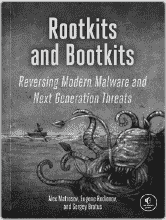
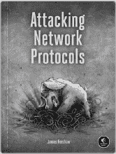
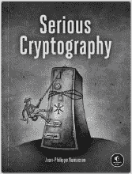
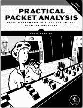
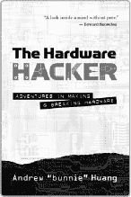
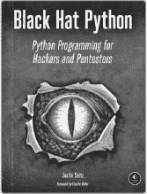

> 资源
> 
> 访问[`www.nostarch.com/grayhatcsharp/`](https://www.nostarch.com/grayhatcsharp/)获取资源、勘误表及更多信息。
> 
> 更多来自 NO STARCH PRESS 的实用书籍
> 
> 
> 
> 《Rootkits 与 Bootkits》
> 
> 《逆向现代恶意软件与下一代威胁》
> 
> 作者: ALEX MATROSOV, EUGENE
> 
> RODIONOV 和 SERGEY BRATUS
> 
> 2017 年秋季, 504 页, $49.95
> 
> ISBN 978-1-59327-716-1
> 
> 
> 
> 《攻击网络协议》
> 
> 作者: JAMES FORSHAW
> 
> 2017 年秋季, 408 页, $49.95
> 
> ISBN 978-1-59327-750-5
> 
> 
> 
> 《严肃的密码学》
> 
> 作者: JEAN-PHILIPPE AUMASSON
> 
> 2017 年夏季, 304 页, $49.95
> 
> ISBN 978-1-59327-826-7
> 
> 
> 
> 《实用数据包分析（第 3 版）》
> 
> 《使用 Wireshark 解决现实世界的网络问题》
> 
> 作者: CHRIS SANDERS
> 
> 2017 年 4 月, 368 页, $49.95
> 
> ISBN 978-1-59327-802-1
> 
> 
> 
> 《硬件黑客》
> 
> 《硬件制作与破解冒险》
> 
> 作者: ANDREW “BUNNIE” HUANG
> 
> 2017 年 3 月, 416 页, $29.95
> 
> ISBN 978-1-59327-758-1
> 
> 精装版
> 
> 
> 
> 《黑帽 Python》
> 
> 《黑客与渗透测试的 Python 编程》
> 
> 作者: JUSTIN SEITZ
> 
> 2014 年 12 月, 192 页, $34.95
> 
> ISBN 978-1-59327-590-7

|

> > 电话：
> > 
> > 1.800.420.7240 或
> > 
> > 1.415.863.9900

|

> > > > > > > 邮箱：
> > > > > > > 
> > > > > > > [SALES@NOSTARCH.COM](http://SALES@NOSTARCH.COM)
> > > > > > > 
> > > > > > > 网站：
> > > > > > > 
> > > > > > > [WWW.NOSTARCH.COM](http://WWW.NOSTARCH.COM)

|
