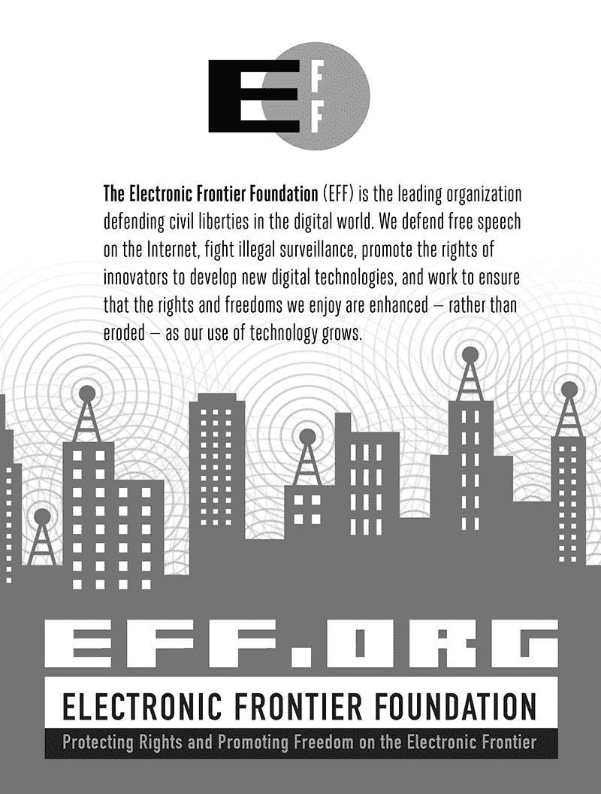

# 第十七章

“准备好迎接疯狂的 C#攻防开发之旅。” —Matt Graeber, Microsoft MVP

学习如何使用 C#强大的核心库集合，自动化繁琐但重要的任务，如模糊测试、漏洞扫描和恶意软件分析。在 Mono 的帮助下，你将编写自己的实用安全工具，这些工具可以在 Windows、OS X、Linux，甚至移动设备上运行。

经过一段时间的 C#速成课程和一些高级特性的学习后，你将学会如何： ⋆ 编写模糊测试工具，利用 HTTP 和 XML 库扫描 SQL 注入和 XSS 攻击 ⋆ 在 Metasploit 中生成 shellcode，以创建跨平台和跨架构的有效负载 ⋆ 自动化 Nessus、OpenVAS 和 sqlmap，扫描漏洞并利用 SQL 注入 ⋆ 为 OS X 和 Linux 编写.NET 反编译器

> ⋆ 解析和读取离线注册表文件，以提取系统信息
> 
> ⋆ 使用 MSGPACK RPC 自动化安全工具 Arachni 和 Metasploit 通过最大化 C#丰富的工具和库，简化并优化你的工作日，使用《Gray Hat C#》进行攻防开发。

关于作者

Brandon Perry 自从开源.NET 实现 Mono 问世以来，一直在编写 C#应用程序。在空闲时间，他喜欢为 Metasploit 框架编写模块、解析二进制文件并进行模糊测试。他是《Wicked Cool Shell Scripts, 2nd Edition》（No Starch Press）的联合作者。他在[`volatileminds.net/`](https://volatileminds.net/)管理他的软件和其他项目。

|  | 最高级的极客娱乐^™ [www.nostarch.com](http://www.nostarch.com) |
| --- | --- |

“我躺平了。”本书使用了耐用的装订方式，不会突然合上。
