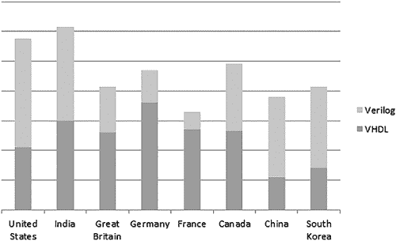

# 第二章：1 认识 FPGA

*FPGA*，全称*现场可编程门阵列*，是一种高度强大的*集成电路*，是一种将电子电路集成在一个封装中的技术。名称中的*现场可编程*部分意味着 FPGA 可以在现场重新编程（即无需返回给制造商）。*门阵列*部分表明 FPGA 是由一个二维网格组成，网格内包含大量的门，这些门是数字逻辑的基本单元，我们将在第三章中深入讨论。

这个名称实际上有些过时。事实上，有些 FPGA 并不是现场可编程的，而且大多数 FPGA 也不再仅仅是简单的门阵列。实际上，它们比这复杂得多。尽管有这些例外，FPGA 的名称还是沿用了多年，而且它突出了 FPGA 的一个独特特性：它们的惊人灵活性。FPGA 的用途仅受设计师想象力的限制。其他数字可编程设备，如微控制器，通常是根据特定功能设计的；你只能做那些已经内建的功能。相比之下，FPGA 的门阵列（或更现代的等效物）就像一块白纸，你可以编程、重新编程、再编程，使其做几乎任何你想做的事情，且限制较少。然而，这种自由也不是没有代价的，FPGA 开发需要一套独特的技能。

学习如何使用 FPGA 需要一种与传统计算机编程不同的思维方式。例如，传统的软件工程（如 C 语言编程）是串行的：先发生这个，然后发生那个，最后发生那个。这是因为 C 语言是编译后在单一处理器或 CPU 上运行的，而该 CPU 是一个串行机器，它一次处理一条指令。

FPGA 与传统的计算机处理器不同，它们是并行工作的：所有的操作同时进行。理解串行编程与并行编程的区别，对于使用 FPGA 至关重要。当你能够用并行方法来解决问题时，你的整体问题解决能力将得到提升。这些技能也会应用到其他非 FPGA 的场景中；你会开始以不同的方式看待问题，而不仅仅是以串行的思维去思考。学习如何用并行思维而非串行思维来解决问题，是成为一名 FPGA 工程师的关键技能，而且你将在本书中不断地培养这一技能。

FPGA 设计非常有趣。当你使用 Verilog 或 VHDL 创建 FPGA 设计时（关于这些语言将在本章后续部分介绍），你是在最低层次编写代码。你实际上是在创建电气组件之间、设备的输入/输出引脚之间的物理连接，真正的电线。这使你能够解决几乎所有数字问题：你拥有完全的控制权。这种编程方式远比使用具有处理器的微控制器要低级。例如，学习 FPGA 是熟悉硬件编程技术的一个极好方法，同时也有助于更好地理解数字逻辑在其他应用中的工作原理。一旦你开始使用 FPGA，你会对即使是最简单的集成电路的复杂性产生新的敬意。

本章通过提供一些背景信息，为你深入了解 FPGA 打下基础。我们将简要回顾 FPGA 的历史，从 1980 年代的初次诞生到今天，并探讨一些常见的应用。我们还将比较 FPGA 与其他常见数字组件的异同，例如微控制器和应用特定集成电路（ASIC）。最后，我们将讨论 Verilog 和 VHDL 这两种用于 FPGA 编程的主流语言之间的差异。

## FPGA 的简短历史

第一个 FPGA 是由 Xilinx 在 1985 年创建的 XC2064。它非常原始，只有 800 个逻辑门，与今天 FPGA 所能执行的数百万个逻辑门操作相比微不足道。它的价格也相对较贵，售价为 55 美元，按通货膨胀调整后今天大约为 145 美元。尽管如此，XC2064 启动了整个行业，并且（与 Altera 一起）Xilinx 在过去 30 多年里一直是 FPGA 市场的主导公司之一。

像 XC2064 这样的早期 FPGA 只能执行非常简单的任务：布尔运算，例如对两个输入引脚进行逻辑“或”运算并将结果输出到一个输出引脚（你将在第三章中学习到更多关于布尔运算和逻辑门的知识）。在 1980 年代，这类问题需要专门的电路，由“或”门组成。如果你还需要对两个不同的引脚执行布尔“与”运算，你可能还需要增加另一个电路，将这些专用组件填充到电路板上。随着 FPGA 的出现，一个设备就可以替代许多离散的逻辑门组件，降低成本、节省电路板上的空间，并且随着项目需求的变化，设计可以重新编程。

从这些简单的起步开始，FPGA 的能力有了显著提升。多年来，这些设备已设计成拥有更多的*硬知识产权（IP）*，即 FPGA 内部专门用于执行特定任务的组件（与可执行多任务的*软*组件不同）。例如，现代 FPGA 中的硬 IP 模块使得它们能够直接与 USB 设备、DDR 内存及其他外部组件进行接口连接。其中一些功能（如 USB-C 接口）没有某些专用硬 IP 是无法实现的。公司甚至将专用处理器（称为*硬处理器*）放入 FPGA 中，以便在 FPGA 内部运行普通的 C 代码。

随着设备的不断发展，FPGA 市场经历了许多并购。2020 年，芯片制造公司 AMD 以 350 亿美元收购了 Xilinx。这次收购可能是对其主要竞争对手 Intel 在 2015 年以 167 亿美元收购 Altera 的回应。有趣的是，两个主要以 CPU 为核心的公司决定收购 FPGA 公司，这也引发了很多关于其原因的猜测。一般认为，随着 CPU 的成熟，将部分芯片用于类似 FPGA 的可重编程硬件似乎是一个值得追求的想法。

除了 Xilinx 和 Altera（从现在开始我会分别使用它们的母公司名称，AMD 和 Intel），其他公司在 FPGA 市场中也找到了自己的定位。例如，Lattice Semiconductor 凭借主要生产较小且价格较低的 FPGA 取得了不错的成绩。Lattice 乐于在这个市场的低端独立发展，同时让 AMD 和 Intel 在高端市场中竞争。如今，开源社区已经接纳了 Lattice FPGA，并通过逆向工程使其能够进行低级别的黑客攻击。FPGA 领域的另一家中型公司 Actel，于 2010 年被 Microsemi 以 4.3 亿美元收购，而 Microsemi 本身在 2018 年被 Microchip Technology 收购。

## 流行的 FPGA 应用

在现代、高性能且灵活的形式下，FPGA 被广泛应用于许多有趣的领域。例如，它们是电信行业的关键组件，常常出现在手机信号塔中。它们负责路由互联网流量，将互联网带入你的智能手机，让你在通勤的公交车上观看 YouTube 视频。

FPGA 在金融行业中也被广泛应用于高频交易，公司利用算法自动进行快速的股票买卖。交易员发现，如果你能够比竞争对手稍微快一点地执行股票购买或销售，就能获得财务上的优势。执行速度至关重要；哪怕是微小的延迟，都可能让公司损失数百万美元。FPGA 非常适合这项任务，因为它们的速度非常快，并且能够根据新的交易算法进行重新编程。这是一个毫秒决定胜负的行业，而 FPGA 能够提供优势。

FPGA 在国防工业中也有应用，比如雷达数字信号处理。FPGA 可以使用数学滤波器处理接收到的雷达反射信号，从而发现几百英里外的小物体。它们还被用于处理和操控红外（IR）摄像头的图像，这些摄像头能够看到热量而非可见光，使得军事人员即使在完全黑暗的环境中也能看到人类。这些操作通常需要大量的数学运算，需要并行进行许多乘法和加法运算，而 FPGA 在这方面表现得尤为出色。

FPGA 在航天工业中也找到了自己的市场：它们可以通过编程冗余措施来应对辐射轰击的影响，因为辐射可能导致数字电路故障。在地球上，大气层保护电子设备（以及人类）免受大量的太阳辐射，但外太空没有这层“温暖的被子”，因此卫星上的电子设备面临着更为严苛的环境。

最后，FPGA 也受到了人工智能（AI）社区的关注。它们可以用于加速神经网络，这是一个大规模并行计算问题，因此它们正在帮助人类解决一些传统编程方法无法解决的问题：图像分类、语音识别与翻译、机器人控制、游戏策略等。

这篇关于 FPGA 应用的概览远远不够全面。总体而言，FPGA 是解决任何需要高带宽、低延迟或高处理能力的数字电子问题的良好选择。

## 常见数字逻辑组件的比较

尽管 FPGA 自早期发展以来已经取得了很大的进展，并且广泛应用于多个领域，但与微控制器和 ASIC 等其他数字逻辑组件相比，FPGA 仍然是一项相对小众的技术。在本节中，我们将对这三种技术进行比较。你将看到为什么 FPGA 对于某些问题是一个好的解决方案，但对于其他问题则不适用，并且它们面临来自其他设备，尤其是微控制器的激烈竞争。

### FPGA 与微控制器

微控制器无处不在。如果你不是嵌入式软件工程师，你可能没有意识到有多少玩具、工具、小设备和仪器都由小型且廉价的微控制器控制：从电视遥控器到咖啡机，再到会说话的玩具。如果你是电子爱好者，你可能熟悉*Arduino*，它由 Atmel（现在的 Microchip Technology）出品的小型微控制器驱动（Microchip 也是以前的 Actel 公司）。全球已有数百万个 Arduino 售出给爱好者。它们便宜、有趣，并且相对容易操作。

那么，为什么微控制器到处可见，而 FPGA 却没有呢？为什么你的咖啡机或艾尔摩娃娃没有 FPGA 控制呢？主要原因是成本。消费电子行业是使用最多微控制器的行业，对成本的敏感度非常高。像你我这样的消费者希望购买尽可能便宜的产品，而制造这些产品的公司会尽可能压缩每一分钱，以达成这一目标。

微控制器种类繁多，每种微控制器都针对特定用途设计。这有助于公司降低成本。例如，如果你的产品需要一个模拟到数字转换器（ADC）、两个 USB 接口以及至少 30 个通用输入输出（GPIO）引脚，就有一款微控制器恰好满足这些规格。如果你意识到只需要一个 USB 接口呢？也许会有另一款微控制器符合这些规格。正因为种类繁多，企业不需要为多余的功能付费。公司可以找到一款满足最低需求的微控制器，并在这个过程中节省资金。

FPGA 则更加通用。通过单一的 FPGA，你可能会创建五个 ADC 接口而没有 USB 接口，或者三个 USB 接口而没有 ADC 接口。你几乎拥有一张空白的画布。可是，正如你将学到的，FPGA 需要许多内部线路（称为*路由*）来支持所有这些不同的可能性，这些路由增加了成本和复杂性。在许多情况下，你最终会为不需要的额外功能和灵活性付出更多的费用。

成本的另一个因素是数量。如果你购买 1000 万个微控制器，这在消费电子领域并不算不现实，那么每颗芯片的价格就会比购买 10 万个便宜。与此同时，FPGA 通常是以较小的数量生产和销售的，因此每个单元的价格较高。这有点像“先有鸡还是先有蛋”的问题，FPGA 本可以因为数量增多而便宜，但要想数量增多，价格必须降低。如果成本和微控制器相同，FPGA 的使用量会更多吗？我认为可能会更多，但 FPGA 的使用也更复杂，这也对它们造成了一定的制约。

由于微控制器是为特定目的设计的，因此它们非常容易设置。你可以在几个小时内就让微控制器运行基本的设计。相比之下，你需要在 FPGA 内编程*所有内容*，这非常耗时。虽然有一些硬件 IP 块可以帮助你入门，但设备的大部分是可编程逻辑——我们之前提到的那块空白画布——你需要自己设计。用像 Verilog 或 VHDL 这样的语言编写代码也比用 C 语言要花费更多时间，而 C 语言通常用于编程微控制器。使用 C 语言时，你在更高的层次上编写代码，因此可以用一行代码完成更多操作。而在 Verilog 和 VHDL 中，你则是在更低的层次上编写代码：你的代码实际上是在创建单个逻辑门和导线。你可以把低级编程想象成用单个 LEGO 积木来拼装，而高级编程则像是在使用已经构建好的 LEGO 套件。这增加了复杂性，从而增加了时间，也提高了成本。工程师们通常都希望找到最简单的解决方案，而大多数情况下，微控制器比 FPGA 更简单。

另一个需要考虑的因素是设备的功耗。许多电子设备依赖电池运行，因此至关重要的是通过尽可能降低设备的功耗来最大化电池寿命。例如，一节 AAA 电池就能为蓝牙鼠标提供数月的使用时间，因为微控制器是为特定用途设计的，可以优化为消耗极少的功率。相比之下，FPGA 拥有大量的布线资源，在功耗方面无法与微控制器竞争。这并不是说不能在电池供电的应用中使用 FPGA，但在同等条件下，微控制器每次都会在这一方面胜出。

总结来说，微控制器在成本、易用性和功耗方面几乎总是占据优势。那么，为什么还有人会选择 FPGA 而不是微控制器呢？还有其他因素需要考虑，比如速度和灵活性，在这些方面，FPGA 却能扭转局面。

当我说速度时，我指的是两件事：带宽和计算能力。*带宽*是数据通过路径传输的速率。FPGA 的带宽可以非常大，远超过任何微控制器能够达到的水平。它们可以毫不费力地处理每秒数百吉比特的数据。例如，在驱动多个 4K 显示器时，FPGA 的高带宽可以发挥巨大作用。FPGA 经常用于需要大量带宽以跟上数据流的视频编辑硬件。它们的高带宽使得它们能够以非常快的速度从各种外部接口（USB-C、以太网、模拟到数字转换器、内存等）传输大量数据。

至于计算速度，FPGA 每秒能够进行的数学计算远超任何微控制器的能力。微控制器通常只有一个处理器，所有计算都通过同一个处理器进行，因此每秒能够执行的计算数量有限。而 FPGA 则能够并行运行多个计算。例如，你可以同时运行数百次乘法运算，这在微控制器中是根本不可能实现的。这在处理大规模数学滤波数据时尤其有用，因为这些滤波过程通常涉及许多乘法和加法运算，且速度非常快。

FPGA 的另一个主要优点是其灵活性。我之前说过，微控制器有各种各样的类型，但当然，这只是一个小小的夸张。如果你的设计有一些特别的需求——比如需要 16 个 ADC 接口——那么世界上可能没有任何微控制器能够满足这些需求。FPGA 的限制要小得多。正如我提到的，FPGA 就像一块空白的画布，可以编程来做几乎任何事情，这为你提供了极大的灵活性来解决各种数字逻辑问题。

当你面临一个工程问题时，你需要选择最合适的工具来解决它。通常情况下，微控制器非常适用，但有时由于速度或灵活性问题，它可能无法胜任。在这种情况下，FPGA 是一个很好的选择。然而，还有一种值得考虑的设备：ASIC。

### FPGAs 与 ASICs 的对比

ASIC 是一种为特定用途设计的集成电路。与可以适应多种用途的 FPGA 不同，ASIC 是专门为某一项任务而设计的，能够在这项任务上做到极致。你可能会认为拥有 FPGA 的灵活性总是更好，但实际上还是有一些权衡需要考虑。我们已经从成本、易用性、功耗、速度和灵活性等方面对比了 FPGA 和微控制器，现在让我们也从这些方面来比较 FPGA 和 ASIC。

由于 ASIC 在少量生产时的*非经常性工程（NRE）*成本非常高，因此其制造成本非常昂贵：你需要向半导体代工厂（或称*fab*）支付大量的前期费用，才能获得第一颗 ASIC 芯片。通常，ASIC 设计的 NRE 成本可能高达数百万美元。是否选择设计 ASIC 很大程度上取决于你需要多少芯片。如果你只生产少量的产品，即使是几万个，也很难收回 ASIC 的前期成本。然而，如果你需要数百万颗芯片，那么 ASIC 就会变得具有吸引力，因为第一颗芯片之外的每颗芯片非常便宜（通常不到 1 美元）。与此相比，FPGA 的单颗芯片往往超过 10 美元，你就会发现 FPGA 在大批量生产中经济上并不划算。总的来说，在较小数量的情况下，FPGA 通常优于 ASIC，但在较大数量时，FPGA 无法与 ASIC 竞争。

FPGA 在一个领域总是优于 ASIC，那就是易用性。设计一个 ASIC 的过程非常复杂。而且，在你去芯片制造厂（fab）制造芯片之前，必须确保你的设计没有错误，否则你就浪费了 NRE 成本。另一方面，大多数 FPGA 可以在现场修复（因此称为*现场可编程*），所以即使在将产品交付给客户后发现了错误，你仍然可以更新代码并解决问题。这对于 ASIC 来说则根本不可能做到。因此，在制造 ASIC 之前，你必须花费大量的工程时间和精力，验证你的 ASIC 设计尽可能没有漏洞。实际上，*验证工程*就是做这项工作的一个学科，我们将在第五章中更详细地探讨这一点。

ASIC 的一个主要优势是它可以针对低功耗进行优化。ASIC 被精细调校以适应特定的应用需求；它们只包含所需的部分，没有多余的功能。与此同时，回想一下，FPGA 具有大量的线路和互联，这为其提供了灵活性，但也意味着它使用更多的电力。ASIC 相对于 FPGA 的另一个优势是，它们可以使用优化低功耗的制造技术，甚至在晶体管级别上进行优化。举个现实中的例子，当比特币刚出现时，人们使用家用电脑（CPU）进行挖矿。这种方式每挖出一个比特币就会消耗大量电力。最终，人们意识到 FPGA 可以被编程用来挖掘比特币，比 CPU 消耗的电力更少。由于电力昂贵，使用 FPGA 挖掘比特币变得更具利润。再往后发展，人们意识到 ASIC 可以比 FPGA 更快速、更节能地挖掘比特币。制造一款专用于比特币挖矿的 ASIC 变得物有所值，因为它在降低功耗上的节省非常显著。如今，比特币几乎完全依赖 ASIC 进行挖矿。

在速度方面，FPGAs 和 ASICs 都具有大带宽，能够传输大量数据。它们在数学运算方面也非常强大，尤其是在乘法和加法运算上，且都可以并行执行这些操作。ASICs 在这一方面稍占优势：因为它们是专门为某一特定用途设计的，因此通常比 FPGAs 更快。

另一方面，FPGAs 提供了比 ASICs 更大的灵活性。设计中所具备的灵活性非常宝贵，特别是当你在做一个不完全明确的项目时。与固定的 ASICs 不同，FPGAs 可以反复重新编程，添加或移除功能和特性。此外，ASICs 的设计、制造和验证过程需要很长时间，而 FPGA 则可以立刻开始使用，因此进展速度通常更快。

一般来说，当生产量非常高时，ASICs 在成本上优于 FPGAs，但当生产量较低时则不然。ASICs 在功耗上优于 FPGAs，并且在速度上稍有优势，但在灵活性和易用性上则不如 FPGAs。然而，实际上，ASICs 和 FPGAs 经常是一起使用的。当一家公司想设计一个 ASIC 时，通常会先用 FPGA 设计一个原型，然后再生产 ASIC。这种方法使工程师可以更早地接触硬件，并在花费数百万美元定制芯片之前对产品充满信心。工程师可以通过 FPGA 原型在 Verilog 或 VHDL 代码中解决问题，并在成本较低、实现更简单时进行修正。此代码并非是一次性丢弃的代码，因为同样的 Verilog 或 VHDL 可以用来创建 ASIC。

### FPGAs 与微控制器与 ASICs 的比较

这一部分信息有点多，所以下面我们简要总结一下关于 FPGAs、微控制器和 ASICs 的讨论。表 1-1 提供了每种设备在不同参数上的对比概况。虽然总有例外情况，但这张表格提供了一个很好的概括。

表 1-1： 比较 FPGA 与微控制器与 ASIC 的优劣

|  | FPGA | 微控制器 | ASIC |
| --- | --- | --- | --- |
| 成本（小批量生产） | 适中 | 便宜 | 昂贵 |
| 成本（大批量生产） | 适中 | 便宜 | 便宜 |
| 速度 | 快速 | 适中 | 快速+ |
| 功耗 | 适中 | 低 | 低 |
| 灵活性 | 高 | 低 | 无 |
| 易用性 | 中等 | 容易 | 困难 |

成本通常是为什么微控制器或 ASIC 在大批量应用中被选择而不是 FPGA 的主要因素。它们更便宜，这在对成本高度敏感的行业中至关重要。当性能是最重要的考虑因素，并且高昂的初期成本和复杂性是可以接受的时，ASIC 通常是首选。FPGA 的最佳应用领域是那些低量但在带宽或计算上需要高速的应用，或者需要非常灵活和独特的设计（例如需要 16 个 ADC 接口的设计）。

最终，FPGA、微控制器和 ASIC 是工程师工具箱中的三种工具。在审视你特定问题的需求时，你需要决定这些工具中哪个提供了最佳的解决方案。你不会用锤子来拧螺丝；了解在何时使用哪种工具对于成为一名优秀工程师至关重要。审视多种可能性并选择技术解决方案的过程在工程学中通常被称为*技术研究*。

我喜欢 FPGA，但当我面对技术问题时，通常正确的解决方案是微控制器：它们易于使用且价格低廉。然而，微控制器并不*总是*正确的解决方案。有时候你需要更多的速度，或者问题是微控制器本身设计不适用的。选择合适的工具来解决你的问题将使解决问题的过程更加愉快。正如你希望看到的，使用 FPGA 确实是非常愉快的！这就像玩乐高或者在 Minecraft 中建造房子。使用简单的、低级的构建模块，你可以创造出令人惊叹的复杂作品。

## Verilog 和 VHDL

正如我之前提到的，FPGA（和 ASIC）有两种主要的编程语言：Verilog 和 VHDL。这些语言被称为*硬件描述语言（HDL）*，因为它们用于定义数字逻辑电路的行为。尽管在语法上，Verilog 和 VHDL 可能看起来与传统编程语言相似，但必须意识到，HDL 完全是另一种类型的语言。当你用 HDL 编写 FPGA 代码时，你直接操作的是 FPGA 上的电线、逻辑门和其他离散资源，而使用传统编程语言编程时，你并不直接控制设备的低级部分。理解你写的 Verilog 或 VHDL 代码背后的逻辑，并知道用这些代码实例化了哪些 FPGA 组件，是数字设计师的关键技能，也是我们在本书中会不断提到的内容。

FPGA 初学者经常会困惑是学习 Verilog 还是 VHDL 更好。没有正确的答案；这实际上取决于你的具体情况。为了帮助你做出决定，我们将对比这两种语言，找出你可能选择其中一种的原因。

注意

*本书中的所有代码示例将同时展示 Verilog 和 VHDL 两种语言，因此无论你选择哪种语言，都能跟得上进度。*

VHDL 代表 VHSIC 硬件描述语言，而 VHSIC 这个缩写中的缩写代表的是 Very High-Speed Integrated Circuit（超高速集成电路）。全称是*超高速集成电路硬件描述语言*——真是个绕口令！它是由美国国防部（DoD）于 1983 年开发的，并且借鉴了另一个由 DoD 开发的语言 Ada 的许多特性和语法。VHDL 和 Ada 一样，是强类型语言。

如果你从未接触过强类型语言，刚开始可能会有些挑战。强类型要求设计师在代码中非常明确。例如，在像 Python 或 C 这样的弱类型语言中，你可以将一个定义为整数的变量与一个定义为浮点数的变量相加，完全没有问题。然而，像 VHDL 这样的强类型语言是绝对不允许这样做的。在 VHDL 中相加两个数字时，它们的位宽（位数）和类型必须完全匹配，否则语法检查器会抛出一些难以理解的错误。在你理解语言执行的强类型检查之前，作为初学者，解决这些问题可能会变得非常麻烦。在 VHDL 中处理这些问题时，你通常需要创建正确类型的中介信号，或者在代码中使用大量的类型转换。这也是为什么 VHDL 通常比 Verilog 需要更多敲键盘输入（也就是更多代码）来实现相同功能的原因之一。如果你想使用 VHDL，成为一个快速打字员会对你有帮助。

与 VHDL 相比，Verilog 看起来更像 C 等软件语言，这使得一些人更容易阅读 Verilog 代码并理解其功能。此外，Verilog 是弱类型的。它允许你编写错误的代码，但更简洁。它在将浮点数与整数相加时不会出错，即使这个加法结果可能不正确。

另一个有趣的对比点是，Verilog 是区分大小写的，而 VHDL 则不是。这意味着在 Verilog 中，一个名为RxDone的变量与一个名为rxDone的变量不同，而在 VHDL 中，它们被视为相同。虽然强类型的 VHDL 不区分大小写，而弱类型的 Verilog 却区分大小写，这可能看起来有些奇怪，但这就是历史的安排。根据我的经验，Verilog 的大小写敏感性可能会造成一些难以诊断的问题。你可能认为两个信号是相同的，但由于大小写的差异，代码将它们视为不同的信号。

然而，最终这些点都不是最重要的因素。你应该根据你在学校或工作中更可能使用哪种语言来选择 Verilog 或 VHDL。如果你的大学使用 Verilog，那就学习 Verilog！如果你想要工作的公司使用 VHDL，那就学习 VHDL！谁使用 VHDL 而不是 Verilog 的分布高度依赖于你所在的地区。如果你通过 Google 趋势比较 VHDL 和 Verilog，你会更清楚应该首先学习哪种语言。

当你查看全球范围内这两个术语的整体搜索量时，你会发现“Verilog”的搜索量通常多于“VHDL”。也许是因为 Verilog 使用得更频繁，或者人们在使用 Verilog 时遇到更多问题，需要比 VHDL 更频繁地在线查找解决方案。不管怎样，按国家细分这些趋势更有启发性。图 1-1 展示了一些例子。

图 1-1：Verilog 与 VHDL 在选定国家的搜索量对比

印度和美国是两个在这两个术语的谷歌搜索量最大国家，但尽管在印度 VHDL 和 Verilog 的受欢迎程度大致相当，Verilog 在美国的受欢迎程度略高于 VHDL。事实上，根据我个人经验，在美国，国防行业偏好 VHDL，而商业行业偏好 Verilog。注意，在德国和法国，VHDL 明显比 Verilog 更受欢迎。如果你来自这两个国家，我强烈建议你首先学习 VHDL！相反，在中国和韩国，Verilog 远比 VHDL 更受欢迎，因此请根据情况调整优先顺序。

总的来说，VHDL 和 Verilog 是同样强大的语言。你应该根据你所在的地区和情况选择学习哪种语言。

## 总结

本章介绍了 FPGA，并提供了关于其历史和常见应用的概述。我们将 FPGA 与微控制器和 ASIC 进行了比较，并看到了每种集成电路类型的优势所在。你了解到，FPGA 在不太敏感于成本，但需要高速、最大灵活性或独特接口的应用中表现出色。最后，我们探讨了用于与 FPGA 配合工作的两种最流行的硬件描述语言：Verilog 和 VHDL，并讨论了如何根据你的需求和情况选择合适的语言。
